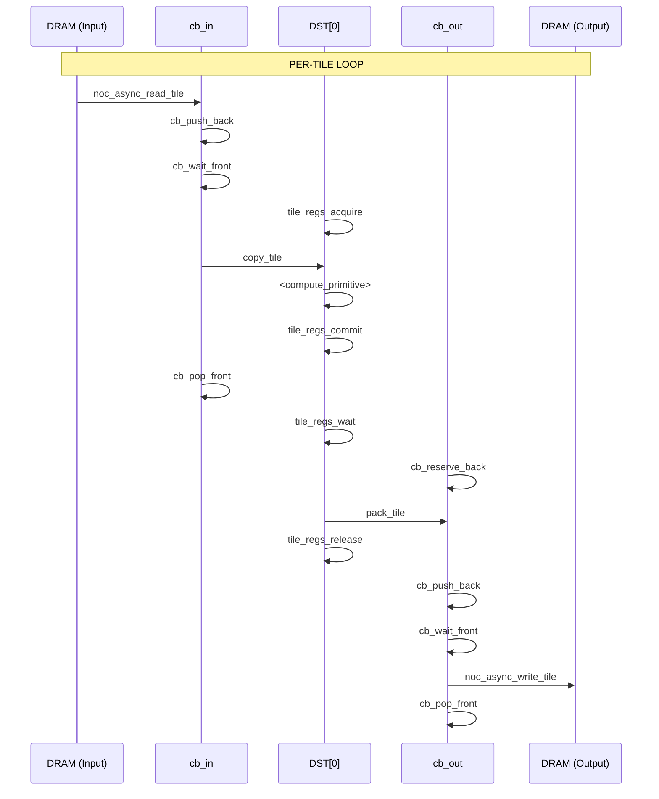
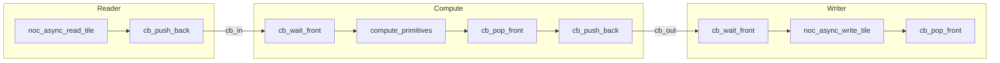
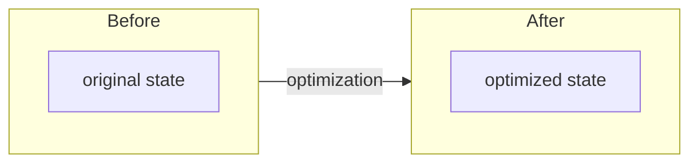
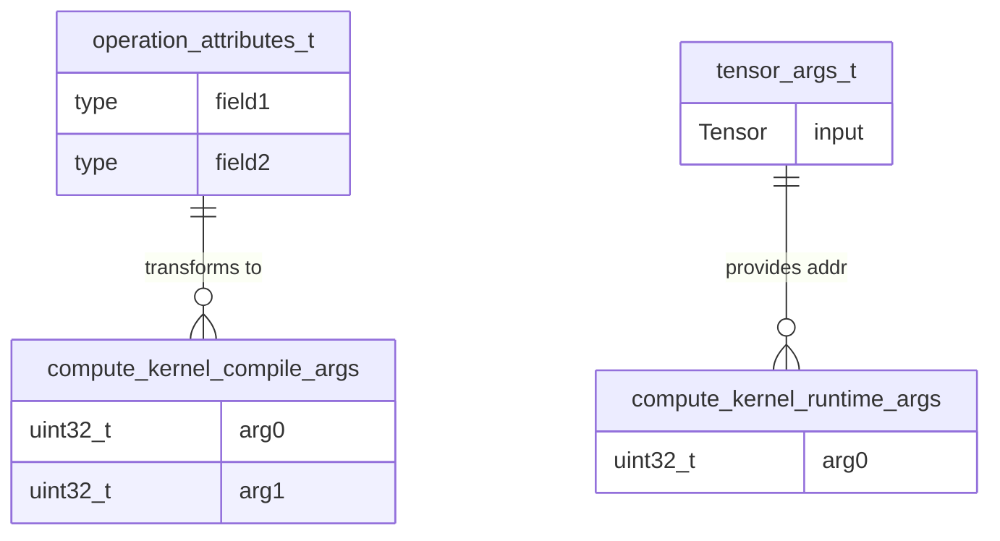

# Analyze Golden-Standard OP Implementation

Analyze a new OP implementation and create complete documentation with 1-to-1 mapping.

## Input

- `$ARGUMENTS`: Path to OP directory (e.g., `ttnn/cpp/ttnn/operations/experimental/dropout`)

## Key Principle

Section 3 (LLK Selection) treats primitive selection as a **graph search problem**:
- **Input**: Data source (DRAM or L1 based on `hw_strategy.memory_layout`)
- **Output**: Data sink (DRAM or L1)
- **Path**: Chain of LLK primitives where each primitive's `produces` satisfies the next primitive's `requires`
- **No distinction**: All LLK primitives are equal nodes - no "compute" vs "data movement" separation

## Execution Steps

### Step 1: Extract LLK Primitives from Kernels

1. Find all kernel files in `$ARGUMENTS/device/kernels/`:
   - `compute/*.cpp` - compute kernels
   - `dataflow/*.cpp` or `reader_*.cpp`, `writer_*.cpp` - dataflow kernels

2. For **all** kernels (compute and dataflow), extract ALL LLK primitives as equal nodes:
   - Init functions: `init_sfpu`, `tilize_init`, `pack_untilize_init`, etc.
   - DST management: `tile_regs_acquire`, `tile_regs_commit`, `tile_regs_wait`, `tile_regs_release`
   - CB operations: `cb_wait_front`, `cb_pop_front`, `cb_reserve_back`, `cb_push_back`
   - Tile operations: `copy_tile`, `pack_tile`, `dropout_tile`, `transpose_wh_tile`, etc.
   - NOC operations: `noc_async_read_tile`, `noc_async_write_tile`, barriers
   - Zero-copy patterns: `set_globally_allocated_address`
   - Compile-time args: `get_compile_time_arg_val(N)`
   - Runtime args: `get_arg_val<T>(N)`

3. Build complete primitive chain from input to output (all primitives, not just compute)

### Step 2: Verify Primitives in Catalog

1. Read `_dev_TODO.now/LLK/primitives_catalog.md`

2. For each extracted primitive, check if it exists in the catalog:
   - Search for primitive name in `primitive_catalog:` YAML section
   - Verify signature matches

3. List missing primitives (if any)

### Step 3: Add Missing Primitives to Catalog

For each missing primitive:

1. Search codebase for header file:
   ```
   grep -r "void <primitive_name>" tt_metal/include/compute_kernel_api/
   ```

2. Extract from header:
   - Full function signature
   - Header path
   - Any template parameters

3. Determine state machine requirements by analyzing:
   - What states does it require? (Look for assertions/preconditions in implementation)
   - What states does it produce?
   - Category: `init`, `dst_management`, `cb_sync`, `data_movement`, `sfpu_compute`, `transform`

4. Add to `_dev_TODO.now/LLK/primitives_catalog.md` in appropriate section:
   ```yaml
   <primitive_name>:
     category: <category>
     requires: [<required_states>]
     produces: [<produced_states>]
     signature: "<full_signature>"
     header: "<header_path>"
     effect: "<one-line description>"
   ```

5. Create `_dev_TODO.now/LLK/<primitive_name>.md` with structure:
   ```markdown
   # <primitive_name>

   <One-line description>

   ## Signature

   ```cpp
   <signature>
   ```

   ## Header

   `<header_path>`

   ## State Machine

   ```yaml
   requires: [<states>]
   produces: [<states>]
   ```

   ## Parameters

   | Name | Type | Description |
   |------|------|-------------|
   | ... | ... | ... |

   ## Effect

   <Mathematical effect or data transformation>

   ## Usage Context

   - Pattern: <which patterns use this>
   - Called after: <preceding primitives>
   - Called before: <following primitives>
   ```

### Step 4: Analyze OP Structure

1. Read OP files:
   - `device/<op>_device_operation_types.hpp` → operation_attributes, tensor_args
   - `device/<op>_device_operation.hpp` → prim_name, namespace
   - `device/<op>_device_operation.cpp` → validation, compute_output_specs
   - `device/<op>_program_factory.hpp` → factory structs
   - `device/<op>_program_factory.cpp` → CB setup, kernel creation, arg binding

2. Extract:
   - Namespace and prim_name
   - operation_attributes_t fields
   - tensor_args_t fields
   - CB allocations (index, size, format, zero_copy)
   - Kernel paths and types
   - Compile-time args per kernel
   - Runtime args per kernel
   - Work distribution logic (split_work_to_cores, sharded, etc.)

### Step 5: Create per-OP Specification

Create `_dev_TODO.now/per-OP/<op_name>.md` with 8 sections:

```markdown
# <OP Name>

<One-line description>

---

## Section 1: Algorithm [HUMAN]

```yaml
algorithm:
  transformation: "<mathematical formula>"

  preconditions:
    - { id: A1, entity: <entity>, attr: <attr>, rel: "<rel>", value: <value> }

  postconditions:
    - { id: O1, entity: Output.shape, rel: "==", expr: "<expression>" }

  attributes:
    - { name: <name>, type: <type>, desc: "<description>" }

  invariants:
    - { id: D1, rule: "<rule>" }
```

---

## Section 2: HW Strategy [HUMAN]

```yaml
hw_strategy:
  memory_layout: <INTERLEAVED|HEIGHT_SHARDED|WIDTH_SHARDED|BLOCK_SHARDED>
  input_layout: <TILE|ROW_MAJOR>
  output_layout: <TILE|ROW_MAJOR>
```

---

## Section 3: LLK Selection (Tetris Block Matching) [DERIVED]

Graph traversal to find primitive chain from input to output.

```yaml
llk_selection:
  # =========================================================================
  # REASONING (primitives_catalog.md search trace)
  # =========================================================================
  # Trace the path from input to output through LLK primitives.
  # Each primitive's `produces` must satisfy the next primitive's `requires`.
  # No distinction between compute/data-movement - all are equal graph nodes.
  # =========================================================================

  # =========================================================================
  # BUSINESS LOGIC RESULT
  # =========================================================================
  cb_allocation:
    cb_in: { index: c_0, direction: consumer }
    cb_out: { index: c_2, direction: producer }

  init_chain:
    - { fn: <init_function>, produces: <STATE> }

  param_transforms:
    - { llk: <llk_param>, algo: <algo_param>, transform: "<INT_SCALE|BIT_CAST|IDENTITY>", expr: "<expression>" }
```

### LLK Primitive Flow (mermaid)

**CRITICAL**:
- Diagram endpoints must match `hw_strategy.memory_layout`: `DRAM (Input)` for INTERLEAVED, `L1 (Input)` for sharded
- Show complete primitive chain including memory transfer primitives (noc_async_read/write)
- Use meaningful CB names (cb_in, cb_out) derived from cb_allocation
- All LLK primitives shown as equal graph nodes



### LLK Primitive State Table

| Step | Primitive | Requires | Produces | Effect |
|------|-----------|----------|----------|--------|
| ... | ... | ... | ... | ... |

---

## Section 4: Kernel Boundaries [DERIVED]

Architecture pattern decision (made AFTER Section 3 identifies primitives).

```yaml
kernel_boundaries:
  pattern: <Reader-Compute-Writer | ReaderCompute-Writer | Signal-Compute-Writer>
```

### Kernel Boundaries Diagram (mermaid flowchart LR)

Use **horizontal orientation**. Kernel boundaries are at `cb_push_back` → `cb_wait_front` transitions:



---

## Section 5: Optimizations Applied

Only show optimizations that are actually applied. If none, use empty list.

```yaml
optimizations_applied:
  - id: <OPT_ID>
    brief: "<short description>"
```

### Optimization Diagrams (mermaid flowchart)

For each applied optimization, show before/after:



---

## Section 6: C++ Binding

### C++ Binding ER Diagram

Use ER diagram to show types with complete field definitions:



```yaml
cpp_binding:
  namespace: "<full::namespace>"
  prim_name: "<ttnn::prim::name>"

types:
  operation_attributes:
    - { name: <name>, type: <type> }
  tensor_args:
    - { name: <name>, type: "<type>" }

circular_buffers:
  - { name: cb_in, index: c_0 }

kernels:
  reader:
    path: "<kernel_path>"
    compile_args:
      - { idx: N, name: <name>, value: "<expr>" }
    runtime_args:
      - { idx: N, name: <name> }
```

---

## Section 7: Implementation Notes [REFERENCE]

**Kernel source**: `<path_to_compute_kernel>`

```yaml
implementation_notes:
  # Any discrepancies, hardcoded values, special handling, observations
```
```

### Step 6: Validate 1-to-1 Mapping

Verify documentation matches implementation:

1. **Init sequence**: All init calls in spec appear in kernel, same order
2. **Loop structure**: Spec's loop structure matches kernel's for/while loops
3. **Primitive calls**: Every primitive in spec appears in kernel with matching args
4. **CB indices**: Spec's CB indices match kernel's `tt::CBIndex::c_N` values
5. **Compile args**: Spec's compile_args match `get_compile_time_arg_val(N)` order
6. **Runtime args**: Spec's runtime_args match `get_arg_val<T>(N)` order
7. **Types**: operation_attributes_t and tensor_args_t fields match spec

Report any mismatches for manual review.

## Output

1. Updated `_dev_TODO.now/LLK/primitives_catalog.md` (if primitives were added)
2. New `_dev_TODO.now/LLK/<primitive>.md` files (for each new primitive)
3. New `_dev_TODO.now/per-OP/<op_name>.md` with complete specification

## Reference Documents

- `_dev_TODO.now/Idea.md` - Documentation vision, principles, and Section format requirements
- `_dev_TODO.now/Common_Optimizations.md` - Optimization patterns (OPT_BLOCK_CB, etc.)
- `_dev_TODO.now/Global_Architecture.md` - HW architecture, work distribution
- `_dev_TODO.now/Global_Structural.md` - YAML schema reference
- `_dev_TODO.now/LLK/primitives_catalog.md` - Primitive definitions and patterns
- `_dev_TODO.now/per-OP/dropout.md` - Example: INTERLEAVED (DRAM→DRAM chain)
- `_dev_TODO.now/per-OP/convert_to_chw.md` - Example: sharded (L1→L1 chain)
- `_dev_TODO.now/per-OP/convert_to_hwc.md` - Example: conditional DRAM/L1 input

## Strict Requirements

- No prose padding. YAML blocks are source of truth.
- Every primitive call in kernel must appear in spec.
- Every spec primitive must appear in kernel.
- CB indices must match exactly.
- Arg indices must match exactly.
- Init order must match exactly.
- **Section 3 diagram endpoints must match hw_strategy.memory_layout**
- **Section 3 must show complete primitive chain (including noc_async_read/write)**
- **Section 4 must use horizontal flowchart (LR) with kernel boundaries at cb_push_back/cb_wait_front**
- **Section 5 only shows applied optimizations (no "not applied" items)**
- **Section 6 must use ER diagram with complete field definitions (no "...")**
- **No inline NOTE comments in per-OP files** - rules documented once in Idea.md
