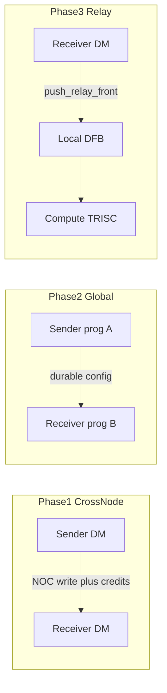

# CrossNodeDFB & GlobalDFB — Live Working Document

**Branch:** `abhullar/gb-cn-dfbs`
**Status date:** 2026-08-05 (updated after stash apply)
**Purpose:** Portable design + implementation handoff so work can continue on another machine without Cursor chat context.

> **This chat vs prior chats:** The Quasar tilize / datacopy investigation in a recent session is **unrelated**. CrossNode/Global DFB design lived primarily in [CrossNode Global DFB plan](e74d1ad1-0a33-4a49-806f-7d14aedd38f2) (~2026-07-21). This document is the branch-checkable source of truth.

---

## Where things are left off (read this first)

| Item | Status |
|------|--------|
| **Phase 0 — Design lock-in** | **Done** |
| **Phase 1a — WH/BH CrossNodeDFB** | **Mostly landed (unstaged stash apply)** — see snapshot below |
| **Phase 1b — Quasar CrossNodeDFB** | Pending |
| **Phase 2a/2b — GlobalDFB** | Not started (config word[4] reserved for future checkpoint) |
| **Phase 3 — Relay** | **Partial early land** on CrossNode (device hooks + `TensixRelayDFBAlignment`); full Phase 3 still open |
| **Metal 2.0 ProgramSpec wiring** | Still out of scope; stub still fatals |

**Immediate next steps (Phase 1a close-out, then 1b):**

1. **Build / run** `test_cross_node_dfb` on WH/BH and fix any compile/runtime breaks from rebasing onto current main.
2. **Gaps still open in 1a:** borrowed user L1 data path; convert tests toward hybrid Metal 2.0 kernels (plan rule) if still desired; public `host_api.hpp` export if needed.
3. Then **Phase 1b** Quasar FW + software-credit path.

**No GlobalDFB sources** yet. Do not treat CrossNode as persistent.

---

## Current tree snapshot (post-stash, 2026-08-05)

Stash applied ~**3.4k LOC** of WH/BH CrossNodeDFB onto `abhullar/gb-cn-dfbs` (git shows files **staged** as `A`/`M` under the feature paths; docs still untracked). This is a **semantics-corrected** descendant of PR #47637 — not the old “persistent CrossNode” shape.

### What is present

| Area | Paths |
|------|--------|
| Host API | `tt_metal/impl/dataflow_buffer/cross_node_dfb.hpp`, `tt_metal/impl/buffers/cross_node_dfb.cpp` |
| Shared constants | `tt_metal/hw/inc/hostdev/cross_node_dfb_constants.h` (`MAX_CROSS_NODE_DFBS=16`, `CROSS_NODE_DFB_OFFSET_NONE=0xFF`) |
| Device API | `tt_metal/hw/inc/api/dataflow/cross_node_dfb.h` |
| Init / iface | `tt_metal/hw/inc/internal/cross_node_dfb_init.h`, `cross_node_dfb_interface.h` |
| FW (tt-1xx) | `brisc.cc` / `ncrisc.cc` / `trisc.cc` — BRISC `setup_cross_node_dfb_interfaces</*reset_credits=*/true>`; NCRISC/TRISC `false` |
| Program / dispatch | `program.cpp`, `program_impl.hpp`, `dispatch.cpp` / `.hpp` — attach, finalize region, `CrossNodeDFBCommandGenerator` |
| Slow-dispatch write | `tt_metal/impl/host_api/tt_metal.cpp` (kernel-config CrossNode region) |
| Build | `tt_metal/impl/sources.cmake`, `tests/.../api/sources.cmake` |
| Tests | `tests/tt_metal/tt_metal/api/test_cross_node_dfb.cpp`, `cross_node_dfb_test_utils.hpp`, kernels `cross_node_dfb_{sender,receiver,relay_receiver,relay_trisc}.cpp` |

### Host surface (as landed)

```text
experimental::CreateCrossNodeDFB(device, sender_receiver_mapping, entry_size, num_entries, buffer_type=L1)
experimental::AttachCrossNodeDFB(program, core_spec, dfb, relay_dfb_name = nullopt) → uint8_t slot
experimental::UpdateDynamicCrossNodeDFBAddress(program, dfb)
```

- Include via `impl/dataflow_buffer/cross_node_dfb.hpp` — **not** yet re-exported from `tt_metal/api/tt-metalium/host_api.hpp`.
- Data + config buffers are **runtime-allocated** inside Create (receiver-sharded data ring; config sharded over senders ∪ receivers). **No borrowed-user-buffer Create overload yet.**
- `Attach` takes optional singular `relay_dfb_name` (not a list).
- Mutual exclusion: CrossNodeDFB and GlobalCircularBuffer cannot coexist on the same Program.
- Docs on Attach/device header: **same-program only; reset on program init; persistence is GlobalDFB.**

### Device surface (as landed)

Layered API matches the Phase 0 FAQ:

```text
Sender:   reserve_back[_for_receiver] → write_{multicast,to_receiver,strided} → barrier → push_back[_to_receiver]
Receiver: wait_front → get_read_ptr → pop_front
Relay:    register_relay_dfb / push_relay_front / align on resize
```

- Prefix layout matches Remote CB so credit helpers can `reinterpret_cast`.
- Config page `word[4]` = fifo wr/rd checkpoint **reserved for GlobalDFB**; CrossNode FW **always** inits iface ptrs from `fifo_start_addr`.
- WH/BH only in comments (`Quasar support planned`).

### Firmware reset contract (as landed)

- Every `setup_*` resets fifo ptrs to `fifo_start_addr`.
- BRISC additionally zeros local `pages_sent` / `pages_acked` when `reset_credits=true` (no NOC; each core clears its own config page).
- This is the CrossNode “reset on program init” path — **not** FW auto-commit.

### Tests present (Gen1 `CreateKernel`, not Metal 2.0 ProgramSpec)

| Test | Intent |
|------|--------|
| `TensixCreateCrossNodeDFBs` | Create + topology rejects |
| `TensixProgramCrossNodeDFBsAPI` | Attach / slot / UpdateDynamic / mutual exclusion |
| `TensixCreateCrossNodeDFBs_MultiSender` | Multi-sender create |
| `TensixProgramCrossNodeDFBsAPI_RelayDFBNames` | Attach stores `relay_dfb_name` |
| `TensixBasicPushPop_1to1` | DM↔DM 1:1 |
| `TensixWriteMulticast_1to4` | Multicast write + collective credit |
| `TensixWriteStrided_1to4` | Strided scatter |
| `TensixWriteToReceiver_ReceiverContiguous` | Per-receiver write + collective credit |
| `TensixRoundRobinPushBackToReceiver` | Per-receiver credit (Flow C) |
| `TensixDecoupledWriteThenCredit` | Write then separate push |
| `TensixMultipleSenders_MtoN` | Multi-sender |
| `TensixProgramInitResetsPointers` | **Correct** CrossNode semantics (replaces old CrossProgramPersistence) |
| `TensixMidFlightResize` | Mid-flight entry_size change |
| `TensixRelayDFBAlignment` | Same-program relay + resize realign |
| `TensixBarrierCompletesAll` | Barrier |

Explicitly **not** present (and called out in comments): `TensixRelayDFBTriscCrossProgramPersistence` — deferred to GlobalDFB / Phase 2–3.

### Gaps vs Phase 1a plan

| Planned | Landed? |
|---------|---------|
| Reset-on-init + layered API + Create/Attach/UpdateDynamic | Yes |
| DM↔DM functional tests + `ProgramInitResetsPointers` | Yes |
| Relay host plumbing + same-program alignment test | Yes (early) |
| Borrowed user sharded L1 + mismatch tests | **No** |
| Hybrid Metal 2.0 kernels for CrossNode tests | **No** (Gen1 kernels) |
| Public header in `host_api.hpp` | **No** |
| Quasar | **No** (Phase 1b) |
| GlobalDFB | **No** (Phase 2) |
| Build/CI green on this main | **Unknown — verify next** |

---

## Product split (locked)

| | **CrossNodeDFB** | **GlobalDFB** |
|--|--|--|
| Scope | Different nodes, **same program** | Different nodes, **across programs** |
| Data | Like local DFB: **program-allocated** sharded L1 (default) **or user-borrowed** | **User-owned sharded L1 only** |
| Config | Runtime-allocated | Runtime-allocated |
| Data location | Receiver L1 ring(s); one FIFO/shard per receiver | Same |
| Pointers | **Reset on program init** | **Persist** for host object lifetime; recreate to clear |
| Commit / store-back | None | Device OO `~GlobalDFB()` commits; explicit `commit()` mid-kernel; host dtor only frees |
| Create vs Attach | Create = topology + data/config; Attach = wire into Program (slot) | Same; Attach can span many programs |

```text
Phase 0 → Phase 1a (WH/BH CrossNode) → Phase 1b (Quasar CrossNode)
       → Phase 2a (WH/BH Global) → Phase 2b (Quasar Global)
       → Phase 3 (relay) → later: Metal 2.0 ProgramSpec
```



---

## Design FAQs (resolved in Phase 0)

### 1. Access patterns / sender API

Do **not** bake STRIDED/ALL into the buffer config. Layered sender API (do not build on `remote_cb_push_back_and_write_pages`):

```text
Sender:   reserve_back[_for_receiver]
       → write_multicast | write_to_receiver | write_strided
       → barrier
       → push_back | push_back_to_receiver   # credits only

Receiver: wait_front → get_read_ptr / read → pop_front

Relay (optional): register_relay_dfb / push_relay_front
```

Naming: **relay** (not “shadow”). Landed Attach uses singular `relay_dfb_name`.

### 2. Memory placement

Data rings in **receiver L1**. Sender NOC-writes payload; credits via config sideband. Config always runtime-allocated. Landed Create always allocates data; borrowed path still TODO.

### 3. Nested wrap / rotated window

Out of scope for Phases 1–3. Global→compute = streaming or DM-linearized relay only.

### 3b. Must every remote DFB relay to compute?

**No.** DM↔DM needs no local DFB. Relay only when compute consumes.

### 4. Commit policy (Global only)

| Source | Policy |
|--------|--------|
| Early GlobalDFB API redesign | Explicit `commit()` + opt-in **FW auto_commit** |
| **Locked Phase 0 FAQ (prefer)** | Device OO `~GlobalDFB()` commits as primary; explicit `commit()` mid-kernel; **no FW auto-commit as main**; host dtor frees only |

CrossNode: no commit; FW resets ptrs/credits on program init (as landed).

### 5. Create vs Attach

As locked; mirrored by landed CrossNode APIs.

### 6. Host `ResetGlobalDFBPointers`

Out of scope for v1 — recreate object.

---

## Test rule (all phases)

- **Target:** Metal 2.0 for kernels / local DFBs / tensors; Gen1 experimental only for CrossNode/Global Create/Attach/UpdateDynamic*.
- **Current tests:** Gen1 `CreateKernel` for sender/receiver/relay kernels. Migrating to hybrid Metal 2.0 remains a Phase 1a polish item.

Metal 2.0 `CrossNodeDataflowBufferSpec` still fatals in `MakeProgramFromSpec` — leave unwired.

---

## Prior art / lineage

| Source | Role |
|--------|------|
| PR [#47637](https://github.com/tenstorrent/tt-metal/pull/47637) / `origin/abhullar/dfb-cb-convert` | Original WH/BH CrossNode draft; **wrong** persistence semantics; stale vs main |
| **This branch stash** | Corrected CrossNode (reset-on-init, `ProgramInitResetsPointers`, no CrossNode persistence tests) applied onto `gb-cn-dfbs` |
| GlobalCB / remote CB / prefetcher | Patterns for Phase 2 GlobalDFB |

Old keep/drop from Phase 0 is largely **already applied** in the stash (persistence moved off CrossNode; layered API; relay naming). Remaining drop/add: borrowed memory; optional Metal 2.0 hybrid tests.

RTA vs config overwrite (`fix_crossnodedfb_rta_ordering_bug_*`): re-verify on this main after first green test run.

---

## Phase checklist

### Phase 0 — Design — DONE

- [x] CrossNode vs Global matrix
- [x] FAQ lock-in
- [x] Keep/drop from #47637
- [x] Quasar credit approach (software credits)

### Phase 1a — WH/BH CrossNode — IN PROGRESS (code on branch)

- [x] CrossNode sources on `gb-cn-dfbs` (stash applied; not necessarily committed)
- [x] Program-init resets fifo ptrs; BRISC resets credits
- [x] Layered device API (write_* then credit push)
- [x] Create / Attach / UpdateDynamic + GlobalCB mutual exclusion
- [x] DM↔DM tests + `TensixProgramInitResetsPointers` (not CrossProgramPersistence)
- [x] Relay hooks + `TensixRelayDFBAlignment` (early Phase 3)
- [ ] Borrowed user L1 + shard-spec validation / mismatch tests
- [ ] Hybrid Metal 2.0 kernel style for tests (optional polish vs plan rule)
- [ ] Export via public `host_api.hpp` if desired
- [ ] Confirm build + `test_cross_node_dfb` green on WH/BH against current main

### Phase 1b — Quasar CrossNode

- [ ] Same host/device API; software credit path via NOC atomic
- [ ] Quasar FW program-init reset (no remote TC requirement for v1)
- [ ] QSR tests: 1:1, strided, multi-sender, program-init reset

### Phase 2a — WH/BH Global

- [ ] Host `GlobalDFB` + device OO `experimental::GlobalDFB`
- [ ] User Buffer/MeshBuffer data; runtime config; use reserved config checkpoint word
- [ ] Device dtor commit + explicit `commit()`; host dtor frees only
- [ ] Tests: CrossProgramPersistence, CommitRequired / dtor commit, coexist with CrossNode

### Phase 2b — Quasar Global

- [ ] FW must **not** wipe Global config every program
- [ ] Cross-program persistence tests on QSR

### Phase 3 — Relay (both) — PARTIAL on CrossNode

- [x] CrossNode: `register_relay_dfb` / `push_relay_front` / Attach `relay_dfb_name` / `TensixRelayDFBAlignment`
- [ ] Full DM→Compute correctness suite; Global streaming relay; Quasar relay smoke
- [ ] Streaming-only (or DM-linearized) for Global→compute
- [ ] Host aliasing API (Approach C below) — preferred over name-only Attach

### Relay considerations — connecting a local DFB to CrossNode/Global

Host must participate in **address aliasing**. Device must participate in **credit/relay ownership**. Those are different connections; conflating them leads to half-wired APIs (e.g. Attach storing `relay_dfb_name` without resolving L1 or slot).

**Three layers of “connected”:**

1. **Same L1 FIFO (host)** — Local DFB/CB backed by the CrossNode/Global data ring. Proven pattern: GlobalCB `CreateCircularBuffer(..., *global_cb)` → `globally_allocated_address`. Without this, relay is two unrelated rings.
2. **Local index ↔ remote slot (host or kernel args)** — So DM/TRISC know `relay_id` ↔ `remote_dfb_id`.
3. **Runtime relay protocol (device)** — DM: `register_relay_dfb` → `wait_front` → `push_relay_front` → `pop_front`. Compute: local wait/pop only. Credits stay with DM.

Relay is optional (DM↔DM skips 2/3). CrossNode and Global share the same host aliasing shape; Global only means the aliased buffer outlives programs.

| Approach | Idea | Pros | Cons |
|----------|------|------|------|
| **A Device-only** | Kernels take remote+local IDs; DM `register_relay_dfb` (current test kernels) | Minimal host API; clear credit ownership | Easy to mis-alias L1; no host validation |
| **B Attach name only** | `Attach(..., relay_dfb_name)` stored for JIT resolve | Records intent; optional for DM-only | As landed: stored not resolved; does not alias memory |
| **C Host create-from-remote (preferred)** | `CreateDataflowBuffer(..., remote)` or Attach with local handle — aliases `remote.dfb_buffer()` like GlobalCB | Host owns aliasing; validate size/shard/cores; Metal 2.0-friendly | New Create/Attach surface; still need device register |
| **D Fully automatic host** | Host injects init; no device `register_relay_dfb` | Kernels look like normal local consumers | Hides credits; resize / multi-relay / prefetcher switching get magical |

**Plan default:** Host **C** for L1 aliasing + pairing; **B** only as optional metadata (resolve or drop — never alone); device keeps explicit `register_relay_dfb` / `push_relay_front`. Avoid A-alone for production ops; avoid D for v1.

### Explicitly out of scope (for now)

- [ ] Metal 2.0 `CrossNodeDataflowBufferSpec` / Global in `MakeProgramFromSpec`
- [ ] Nested-wrap / RotatedViewDFB
- [ ] Host `ResetGlobalDFBPointers`
- [ ] Primary path on `remote_cb_push_back_and_write_pages`

---

## Shared API sketch

**Landed (CrossNode):** see [Current tree snapshot](#current-tree-snapshot-post-stash-2026-08-05).

**Still target (Global):**

```text
CreateGlobalDFB / AttachGlobalDFB / UpdateDynamic*
# device commit policy; no host Reset in v1
```

Topology rules (enforced in Create):

- No duplicate sender cores
- Disjoint receiver sets across senders
- Sender and receiver sets disjoint

---

## Pointers

| Plan / doc | Role |
|------------|------|
| `.cursor/plans/crossnode_global_dfb_a3b81733.plan.md` | Full phased plan + FAQs (repo copy) |
| `.cursor/docs/dataflow-buffers/DataflowBuffer.md` | Local DFB background |
| `~/.cursor/plans/globaldfb_api_redesign_5859d163.plan.md` | Granular write+credit; FW auto_commit — **commit policy superseded** |
| `~/.cursor/plans/fix_crossnodedfb_rta_ordering_bug_c2407206.plan.md` | RTA ordering (old lineage) |

Git:

- Working branch: `abhullar/gb-cn-dfbs`
- Prior art: `origin/abhullar/dfb-cb-convert` / PR #47637

---

## Unrelated concurrent work (do not mix)

Quasar **tilize** PCC / datacopy DIAG work is orthogonal. Do not mix those changes into this CrossNode/Global workstream.

---

## Changelog

| Date | Note |
|------|------|
| 2026-08-05 | Initial live handoff: Phase 0 done; Phase 1a next. |
| 2026-08-05 | **Stash applied:** WH/BH CrossNode landed with correct reset-on-init semantics, layered API, DM↔DM + ProgramInitResetsPointers + early relay. Updated status, file inventory, test list, and 1a gaps (borrowed mem, Metal 2.0 hybrid tests, build verify). Global still not started. |
| 2026-08-05 | Added **Relay considerations** (local↔remote connection layers; Approaches A–D; prefer host create-from-remote like GlobalCB). Mirrored into plan `.cursor/plans/crossnode_global_dfb_a3b81733.plan.md`. |
