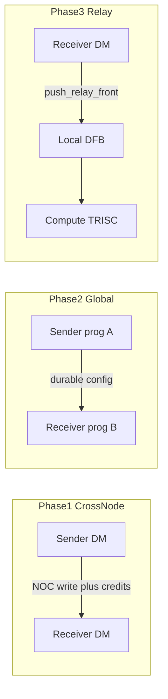
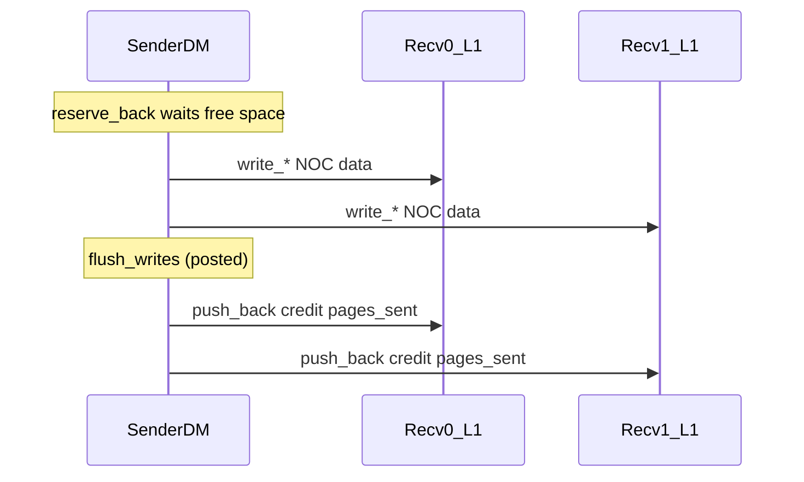
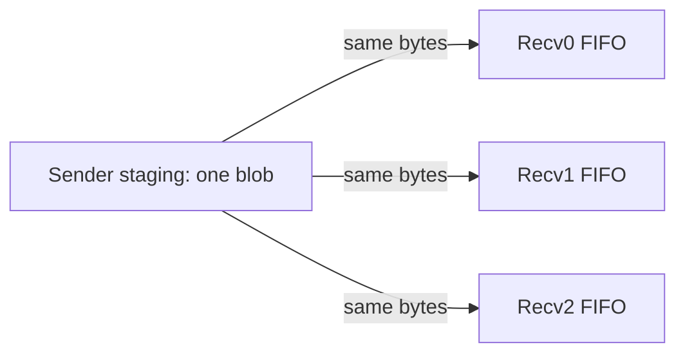
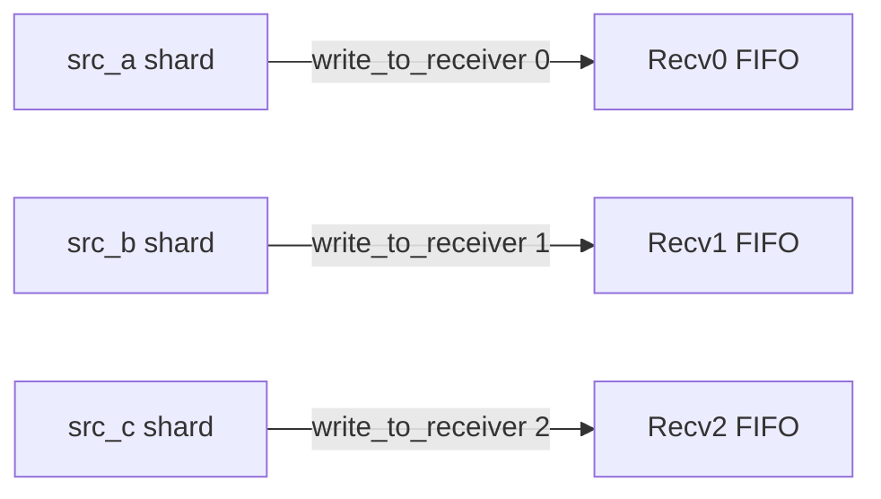
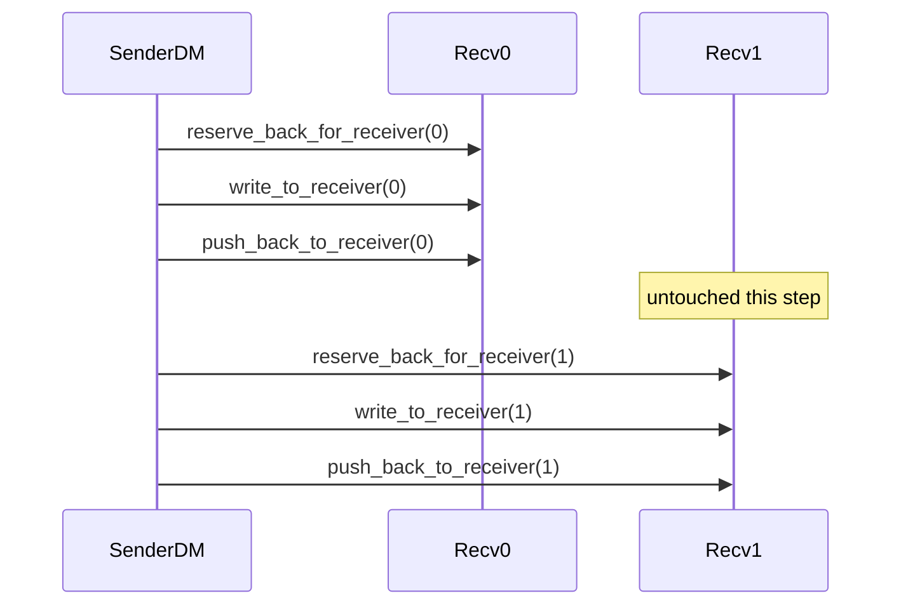
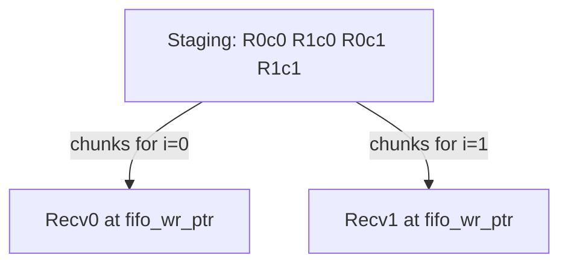
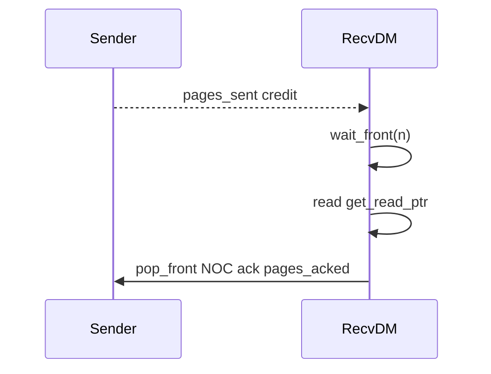

# CrossNodeDFB and GlobalDFB Phased Plan

## Context

CrossNodeDFB and GlobalDFB split today’s Global/Remote CB into two lifetimes:


|                   | CrossNodeDFB                                                                                  | GlobalDFB                                                                                                   |
| ----------------- | --------------------------------------------------------------------------------------------- | ----------------------------------------------------------------------------------------------------------- |
| Scope             | Different nodes, **same program**                                                             | Different nodes, **across programs**                                                                        |
| Data buffer       | Same as local DFB: **program-allocated** sharded L1 (default) **or user-borrowed** sharded L1 | **User-specified sharded L1 only** (no program allocator)                                                   |
| Config buffer     | Runtime allocates (rd/wr, credits)                                                            | Runtime allocates                                                                                           |
| Where data lives  | Receiver L1 ring(s); one FIFO shard per receiver (GCB layout)                                 | Same                                                                                                        |
| Pointers          | **Reset** on program init                                                                     | **Persist** for life of host object (same as GlobalCB); recreate object to clear                            |
| Sync / store-back | None (reset each program)                                                                     | Device OO `GlobalDFB` destructor calls `commit()`; explicit `commit()` for mid-kernel; host dtor only frees |


Existing prior art:

- GlobalCB: `[tt_metal/api/tt-metalium/global_circular_buffer.hpp](tt_metal/api/tt-metalium/global_circular_buffer.hpp)`, `[tt_metal/impl/buffers/global_circular_buffer.cpp](tt_metal/impl/buffers/global_circular_buffer.cpp)`, device `[tt_metal/hw/inc/api/remote_circular_buffer.h](tt_metal/hw/inc/api/remote_circular_buffer.h)`
- Prefetcher store-back: `[tt_metal/impl/buffers/kernels/tensor_prefetcher.cpp](tt_metal/impl/buffers/kernels/tensor_prefetcher.cpp)` (`load_sender_state` / `store_sender_state`)
- Draft implementation: [PR #47637](https://github.com/tenstorrent/tt-metal/pull/47637) branch `abhullar/dfb-cb-convert`
- Metal 2.0 stub (leave unwired): `[CrossNodeDataflowBufferSpec](tt_metal/api/tt-metalium/experimental/metal2_host_api/dataflow_buffer_spec.hpp)`

**Test rule (all phases):** Metal 2.0 for kernels, local DFBs, tensors; Gen1 experimental APIs only for CrossNode/Global create/attach/update.




---

## Open questions resolved (Phase 0 answers)

**Yu — explicit store-back:** Working copies of `fifo_wr_ptr`/`fifo_rd_ptr` live in the device interface; durable state is the config page. Device OO `~GlobalDFB()` commits on scope exit; explicit `commit()` for mid-kernel. CrossNode does not persist.

**John — remote CB combines too many steps:** Do not build on `remote_cb_push_back_and_write_pages`. Keep #47637’s layered API: `reserve_back` → `write_`* → barrier → `push_back`.

**John — nested wrap / non-streaming:** See [FAQ #3](#faq-3-nested-wrap) below. **Default:** Global→compute only for streaming layouts; nested-wrap Global→compute is out of scope until later.

**GlobalCB persistence today:** Worker GCB config L1 survives with the buffer object; DRAM-sender GCB uses explicit load/store of sender state. GlobalDFB follows that model (init once at Create; no mid-lifetime host Reset API in v1).

**Commit vs destructor:** See [FAQ #4](#faq-4-commit). Host `~GlobalDFB()` must **not** replace store-back.

---

## FAQ (follow-ups)

### FAQ 1 — Supported read/write patterns

Both CrossNode and Global expose the **same** producer/consumer patterns (from #47637 `cross_node_dfb.h` Flows A–D).

**Layered contract (all sender flows):** `write_*` = posted data only (NOC into receiver L1 at current `fifo_wr_ptr`); `reserve_back` = space wait; `push_back*` = credit. Flush posted writes before publishing credit. Never advance credits inside a write.




---

#### Flow A — Broadcast (`write_broadcast`)

Same payload bytes → every receiver FIFO. Use when all consumers need identical tiles.




```text
reserve_back(n)
write_broadcast(src, n)       // loop-unicast today
flush_writes()
push_back(n)                  // credit ALL receivers
```

---

#### Flow B — Receiver-contiguous (`write_to_receiver` + collective credit)

Different shards per receiver, but **same entry count** and **one** `push_back` so all rings advance together.

**Why different writes + one collective `push_back`?** Credits are occupancy counts (`pages_sent`), not payload identity. In a sharded lockstep step every receiver gets the **same number** of new valid entries (`n`), just different bytes (their contiguous shard). So:
- Writes must differ (`write_to_receiver` per shard).
- Credit can be shared: `push_back(n)` means “each receiver now has +n valid entries at `fifo_wr_ptr`.”
- Sender keeps one logical wr advance for the cohort; one barrier + one multi-receiver credit update is cheaper than N separate `push_back_to_receiver`s.
- Correct **only** when every receiver was written exactly `n` entries. Uneven or RR progress → Flow C.



```text
reserve_back(n)               // space on ALL
write_to_receiver(0, src_a, n)
write_to_receiver(1, src_b, n)
...
flush_writes()
push_back(n)                  // one collective credit
```

---

#### Flow C — Per-receiver credit (round-robin / uneven)

Credit and space-check **only** receiver `r`. Avoids head-of-line blocking on a slow peer when sending uneven or RR work.




```text
for r in receivers:
  reserve_back_for_receiver(r, n)   // poll only r
  write_to_receiver(r, src, n)
  flush_writes()
  push_back_to_receiver(r, n)       // credit only r
```

---

#### Flow D — Interleaved scatter (`write_strided`)

One call scatters an **interleaved staging buffer** (prefetcher shape). Different data per receiver; collective `push_back` after barrier. Write-only — same credit split as A/B.

**Staging layout** (2 receivers, 2 rows, 1 page/row chunk):

```text
Sender L1 staging (row-major interleaved):
  [R0_row0][R1_row0][R0_row1][R1_row1]
       |        |        |        |
       v        v        v        v
Recv0 FIFO:  [R0_row0][R0_row1]...
Recv1 FIFO:  [R1_row0][R1_row1]...
```




```text
reserve_back(n)
write_strided(src, num_rows, pages_per_row, page_size)
flush_writes()
push_back(n)
```

**vs broadcast:** broadcast = identical blob to all; strided = different interleaved chunks per receiver in one helper (caller does not loop `write_to_receiver`).

---

#### Receiver (all flows)




Relay (Phase 3, optional): DM owns CrossNode/Global wait/pop; compute uses local DFB on same L1 (`register_relay_dfbs` / `push_relay_front`).

**Not in v1:** nested-wrap / rotated-subring compute reads; compute as remote credit owner (no NOC atomics from TRISC).

### FAQ 2 — Underlying data memory

Physical placement matches GlobalCB: **data rings live in receiver L1** (one shard/FIFO per receiver). Sender does not hold the payload ring; it NOC-writes into receiver L1 and manages credits via the config sideband.


|                        | CrossNodeDFB                                                                                                                                          | GlobalDFB                                         |
| ---------------------- | ----------------------------------------------------------------------------------------------------------------------------------------------------- | ------------------------------------------------- |
| Data                   | Like local DFB: **program allocates** sharded L1 by default, **or user supplies** borrowed sharded L1 if shard spec matches producer/consumer mapping | **User must supply** sharded L1 MeshBuffer/Buffer |
| Config                 | Always runtime-allocated                                                                                                                              | Always runtime-allocated                          |
| Lifetime of data alloc | Tied to program (or user buffer lifetime if borrowed)                                                                                                 | Tied to user buffer; outlives programs            |


### FAQ 3 — Nested wrap / “rotated window” {#faq-3-nested-wrap}

**“Rotated window” means:** every receiver looks at the **same physical ring contents**, but each receiver’s *logical* “tile 0” starts at a **different offset** into that ring (as if the weight tensor were rotated so this core’s shard appears first).

Concrete picture — one physical CB on a receiver, 8 weight slots `W0…W7`:

```text
Physical order in L1 (circular):
  addr:  [W0][W1][W2][W3][W4][W5][W6][W7] then wraps to W0

Receiver A starts at W0 → logical order: W0 W1 W2 … W7
Receiver B starts at W3 → logical order: W3 W4 W5 W6 W7 W0 W1 W2   ← "rotated"
```

For B, consuming “the next weight” is not always `rd_ptr + entry_size` in the sense of a fresh FIFO of B’s own stream: B’s stream is a **view** into a shared ring with a non-zero start offset. When B’s read also approaches the **physical** end of the CB, you get two different wrap events:

1. **Physical wrap:** `rd_ptr` hits `fifo_limit` → back to `fifo_start` (normal CB).
2. **Logical / rotation wrap:** B finishes `W7` and must continue at `W0` (start of the weight region), which may not coincide with “just crossed fifo_limit.”

`wait_front`/`pop_front` only implement (1). They assume the buffer is a normal producer→consumer FIFO in arrival order. A rotated view needs custom address math (what today’s matmul does).

**Streaming mode** avoids rotation: each receiver is fed data **in the order that receiver will compute**, as a normal FIFO. Then standard DFB/CB ops work. That is why Global→compute is streaming-first.

**Do we need another abstraction for rotated windows?** Not for v1. Treat rotation as a **layout/view** problem, not a credit/TC problem.


| Approach                         | Idea                                                                                                  | Quasar fit                                                                                                                                           |
| -------------------------------- | ----------------------------------------------------------------------------------------------------- | ---------------------------------------------------------------------------------------------------------------------------------------------------- |
| Prefer non-rotated layouts       | Streaming or per-receiver consume-order shards                                                        | Best: normal local DFB / TC ops                                                                                                                      |
| Different base per receiver      | Each receiver owns an independent ring (or shard) laid out in its read order                          | Eliminates rotation; TCs work normally. This is “different bases,” but it is **not** one shared rotated ring — it is N separate FIFOs (or N shards). |
| DM remaps into relay             | Receiver DM walks the weird addressing; `push_relay_front` presents a **linear** local DFB to compute | Good Quasar path if a rotated shared ring is unavoidable: compute never sees dual-wrap                                                               |
| Software dual-wrap view API      | Explicit offset + logical wrap on WH/BH CB pointers (today’s matmul)                                  | Poor Quasar TC fit: TCs track occupancy/free-space only, not a second logical wrap                                                                   |
| New first-class “RotatedViewDFB” | Host/device abstraction encoding start offset + region                                                | Only if product later requires wait-for-all rotated matmul via DFB APIs on compute                                                                   |


**Quasar / tile counters:** TCs do not model “rotated sub-ring + physical wrap.” Setting different `base`/`limit` per receiver gives each a normal ring; it does **not** implement shared-ring rotation. For Quasar compute, either (1) layout data so each consumer’s FIFO is in-order, or (2) have DM linearize into a relay local DFB. Do **not** expect TC remapping alone to express dual-wrap.

**Plan default:** no RotatedView abstraction in Phases 1–3; document as future if needed. Global→compute = streaming (or DM-linearized relay) only.

### FAQ 3b — Must every CrossNode/Global link to a local DFB on compute? {#faq-3b-relay}

**No.** Relay / local DFB on compute is **optional**, only when compute must consume the remote FIFO.

**Evidence from today’s GlobalCB:**

- **Matmul + GCB (production):** pairs `remote_index(c_31)` **and** a local `index(src1)` on the same GCB-backed config, then `align_local_cbs_to_remote_cb` so compute uses the local CB over the same L1 (`[matmul_multicore_reuse_mcast_1d_program_factory.cpp](ttnn/cpp/ttnn/operations/matmul/device/factory/matmul_multicore_reuse_mcast_1d_program_factory.cpp)` ~2134–2142). This is the relay pattern.
- **DRAM-sender smoke / DM receivers:** often `remote_index` **only** — no local CB, no compute (`[test_dram_sender_global_cb.cpp](tests/tt_metal/tt_metal/api/test_dram_sender_global_cb.cpp)`). Valid DM↔DM (or DRISC→DM) use.

So GlobalCB is **not** always linked to a local CB on compute; the link appears when the consumer path includes TRISC. CrossNode/Global should keep the same optionality.

```text
Valid topologies:
  1. DM → DM only          (CrossNode/Global credits; no compute, no local DFB)
  2. DM → DM → relay → TRISC  (Phase 3; local DFB aliases receiver L1 for compute)
```

### FAQ 4 — Device destructor commit (OO GlobalDFB) {#faq-4-commit}

Yes — for the **device** `GlobalDFB` object (same OO style as `DataflowBuffer` / `Noc`), `**~GlobalDFB()` should call `commit()`** to store `fifo_wr_ptr`/`fifo_rd_ptr` back to the durable config page when the kernel object goes out of scope.

Policy:

1. Device `GlobalDFB` RAII: destructor commits (primary store-back path).
2. Explicit `commit()` still available for mid-kernel checkpoints (e.g. multi-GCB switching like the prefetcher).
3. **No FW auto-commit** as the main mechanism (avoids hidden FW policy); optional only if RAII is insufficient for a specific launch model.
4. Host `~GlobalDFB()` only releases host resources — still not store-back.
5. CrossNode device object: no commit in destructor (state is reset next program init).

Note: today’s local `DataflowBuffer` uses explicit `finish()` rather than destructor side effects; GlobalDFB intentionally differs because persistence is part of its contract. Document that kernels should let the object leave scope (or call `commit()`) before exit.

### FAQ 5 — Create vs Attach separation {#faq-5-create-attach}

Mirrors today’s GlobalCB: `CreateGlobalCircularBuffer` then `CreateCircularBuffer(program, …, global_cb)` (Attach for CrossNode/Global).


|             | **Create**                                                                                                               | **Attach**                                                                                                  |
| ----------- | ------------------------------------------------------------------------------------------------------------------------ | ----------------------------------------------------------------------------------------------------------- |
| When        | Once (or rarely)                                                                                                         | Per program that uses the FIFO                                                                              |
| Does        | Allocate/bind **data + config**, fix **sender→receiver topology**, entry size / num entries                              | Wire that object into a **Program** on given cores; assign **slot/index**; FW/kernel config for this launch |
| Lifetime    | Host object (+ buffers) — Global outlives programs; CrossNode usually tied to program usage but still Create-then-Attach | Program-scoped binding; CrossNode state reset on program init; Global pointers persist in config            |
| Can repeat? | New object = new rings                                                                                                   | Same Create’d object can Attach to many programs (Global) or re-Attach after rebuild                        |


**What the split achieves:**

1. **Lifetime vs wire** — topology/memory are not conflated with program construction (John: don’t combine too many steps).
2. **Cross-program reuse (Global)** — one user L1 + config; Prog A then Prog B Attach the same object without reallocating.
3. **Borrowed / user memory at Create** — data ownership decided before any program exists; Attach only consumes addresses.
4. **Partial core sets** — Attach receivers only, or senders only, without recreating the mapping.
5. **Dynamic rebase** — `UpdateDynamic*Address` after Attach without a new Create.
6. **Slot assignment** — Attach assigns the kernel-visible handle/slot for that program.

Without the split, CreateProgram would own allocation and you could not cleanly express Global persistence or shared buffers across programs.

### FAQ 6 — `ResetGlobalDFBPointers` (deferred) {#faq-6-reset}

**Skipped for v1.** A host Reset that zeroes device pointers/credits races with device `~GlobalDFB()` / `commit()` store-back and would need explicit host↔device synchronization (Finish, barriers, or a device-side reset kernel). GlobalCB has no such API either — clear state by **destroying and recreating** the object.

**Later (out of scope now):** if needed, a Reset that is either (a) device-only after Finish, or (b) documented “only when no program is using this GlobalDFB.”

**CrossNode:** still no Reset API; program init always zeros state.

---

## Phase 0 — Design lock-in

Deliverables (doc only / short spike):

- Design note: CrossNode vs Global matrix (lifetime, ownership, reset, commit, relay).
- Keep/drop list from #47637 (below).
- Quasar credit spike: use **software `pages_sent`/`pages_acked` + NOC atomic** for Phase 1b/2b (same protocol as WH/BH); do not require remote TC post for v1.

**Keep from #47637:** `Create`/`Attach`, layered sender/receiver API, relay registration hooks, hybrid Metal 2.0 tests, topology validation.

**Change:** CrossNode is not persistent (remove cross-program persistence tests for CrossNode); move durable `commit`/auto-commit to Global only; allow borrowed data for CrossNode.

---

## Shared device/host contract

Host (experimental Gen1, not ProgramSpec):

- `CreateCrossNodeDFB` / `CreateGlobalDFB`
- `Attach*(program, cores, dfb, relay_dfb_names, …)`
- `UpdateDynamic*Address`
- Global only: `commit` policy (device dtor / explicit `commit()`)
- No host `ResetGlobalDFBPointers` in v1 (recreate object to clear; see FAQ 6)

Device (same patterns for both types):

```text
Sender:   reserve_back[_for_receiver] → write_to_receiver | write_broadcast | write_strided → flush_writes → push_back[_to_receiver]
Receiver: wait_front → get_read_ptr → pop_front
Relay:    register_relay_dfbs → DM wait_front + push_relay_front; compute local DFB wait/pop
Global:   commit()
```

---

## Phase 1 — CrossNodeDFB

**Semantics:** multi-node, same program; data like local DFB (program-alloc or borrowed sharded L1); runtime config; **reset on program init**.

### 1a WH/BH

- Rebase #47637; rename/docs: CrossNode ≠ persistent.
- Program init path zeros rd/wr + credits when CrossNodeDFBs are attached.
- Memory: default program-allocated receiver-sharded L1; borrowed user sharded L1 with shard-spec validation.
- Ship DM↔DM first; relay host plumbing (`relay_dfb_names`) can land early, full relay correctness in Phase 3.
- **Write contract:** all `write_*` use **posted** unicast NOC writes; caller uses `flush_writes()` before `push_back`. Collective and per-receiver `pages_sent` increments are posted as well, matching RemoteCB ordering.
- **Program-init credit reset:** prefer host/dispatch ensuring config credit words are 0 before GO; FW setup fills iface only (no BRISC zero that can race a peer `push_back`). Peer iface setup is not required for sender NOC data/credits — only for that core’s own wait/pop.

**Tests** (evolve #47637; Metal 2.0 kernels): create/topology reject; attach/slot; UpdateDynamic; borrowed mismatch; `BasicPushPop_1to1`; multicast/strided/write_to_receiver/RR; `DecoupledWriteThenCredit`; multi-sender; `**ProgramInitResetsPointers`** (replaces CrossProgramPersistence); barrier.

### 1b Quasar

- Same host/device API; software credit path via NOC atomic.
- FW resets CrossNode state on program launch.
- Tests: 1:1 push/pop, strided, multi-sender, program-init reset on QSR.

---

## Phase 2 — GlobalDFB

**Semantics:** cross-program; **user sharded L1 data** + runtime config; persist for host object lifetime (recreate to clear); device OO `~GlobalDFB()` commits pointers (explicit `commit()` for mid-kernel); no FW auto-commit as primary; **no host Reset API in v1**.

### 2a WH/BH

- New host `GlobalDFB` + device OO `experimental::GlobalDFB` (mirror `DataflowBuffer` style).
- Factories require user Buffer/MeshBuffer for data (sharded L1 over receivers); runtime allocates config.
- Durable pointer state in config; device destructor store-back; explicit `commit()` for checkpoints (prefetcher-style multi-buffer switching).
- Host destructor only frees resources (same as GlobalCB: no mid-lifetime Reset).

**Tests:** create with user data; **CrossProgramPersistence**; CommitRequired / device-dtor commit; optional worker-sender smoke; coexist with CrossNode in different programs; recreate-clears-state (optional).

### 2b Quasar

- Same API; FW must **not** zero Global config on every program (unlike CrossNode).
- Tests: cross-program persistence + 1:1; no nested-wrap matmul.

---

## Phase 3 — Relay (both types)

- Relay is **optional**: only when compute consumes. DM↔DM CrossNode/Global need no local DFB.
- When used: DM owns remote credits; compute uses local DFB aliased to same L1 FIFO ([#47637 relay](https://github.com/tenstorrent/tt-metal/pull/47637) + remote CB overlay pattern).
- Device: `register_relay_dfbs`, `push_relay_front`.
- **Streaming-only** (or DM-linearized) for Global→compute; no RotatedView abstraction in this phase.
- Quasar: co-init with local DFB/TC (shared ring, separate SW rd vs remote credits).

**Tests:** `RelayDFB_DM_to_Compute_1to1` (CrossNode); `RelayDFB_Global_Streaming`; Quasar relay smoke; plus existing DM↔DM tests remain without relay. (No CrossNode mid-flight entry_size resize — fixed at Create; resize belongs on GlobalDFB if needed.)

### Relay considerations — connecting a local DFB to CrossNode/Global

Host must participate in **address aliasing**. Device must participate in **credit/relay ownership**. Those are different “connections”; conflating them leads to half-wired APIs (e.g. Attach storing `relay_dfb_name` without resolving L1 or slot).

#### What “connected” means (three layers)

1. **Same L1 FIFO (host)** — The local DFB/CB must be backed by the CrossNode/Global **data ring** address. Proven pattern today: GlobalCB via `CreateCircularBuffer(program, cores, config, *global_cb)` → `globally_allocated_address` from the GCB buffer ([`circular_buffer.cpp`](tt_metal/impl/buffers/circular_buffer.cpp); matmul ~2134–2142). Without this, relay is two unrelated rings.
2. **Which local index pairs with which remote slot (host or kernel args)** — So DM/TRISC know `relay_id` ↔ `remote_dfb_id`.
3. **Runtime relay protocol (device)** — Receiver DM: `register_relay_dfb` → `wait_front` → `push_relay_front` → `pop_front` (NOC ack). Compute: local `wait_front`/`pop_front` only. Credits stay with DM; compute never issues NOC atomics.

So: host **must** own (1). (2) needs an explicit association somewhere. (3) is always a device API. Relay remains **optional** — DM↔DM skips (2)/(3) entirely. CrossNode vs Global share the same host aliasing shape; Global only means the aliased buffer outlives programs.

#### Approach A — Device-only wiring

Host creates CrossNode/Global + a separate local CB/DFB; kernels take `remote_dfb_id` + `relay_cb_id` as compile args; DM calls `register_relay_dfb`. (Current relay test kernels.)

| Pros | Cons |
|------|------|
| Minimal host API; flexible per-kernel | Easy to mis-alias addresses; host does not validate the pair |
| Matches “DM owns credits” clearly | Every kernel re-implements the wiring |
| Fine for DM↔DM (no relay) | Every kernel re-implements align / pairing |

#### Approach B — Attach metadata only (`relay_dfb_name`)

`AttachCrossNodeDFB(..., "local_relay_dfb")` stores a name (comment: resolve at JIT). As landed: **stored, not resolved** — does not alias L1.

| Pros | Cons |
|------|------|
| Host records intent; optional for DM-only | Name alone does not connect memory |
| Can later auto-inject align / validate | Stringly-typed; must match Metal 2.0 accessor names |
| Same Attach site for Global across programs | Half-built today — false sense of wiring |

#### Approach C — Host “create local DFB from remote” (GlobalCB pattern) — **preferred**

Mirror GCB: a host call creates a **local** DFB/CB whose buffer is the CrossNode/Global data buffer, and records the local↔remote pair.

```text
CreateCrossNodeDFB / CreateGlobalDFB
Attach*(program, cores, remote)                    // remote slot
CreateDataflowBuffer(program, cores, local, remote) // aliases remote.dfb_buffer()
# or Attach*(..., relay_dfb = local_handle)
```

| Pros | Cons |
|------|------|
| Host **owns** address aliasing (hard to get wrong) | New Create/Attach overload surface |
| Can validate size / shard / core membership | Couples local DFB allocator to remote object |
| Matches proven GlobalCB UX | Still need device `register_relay_dfb` (or auto-inject) |
| Natural Metal 2.0 binding later (`binds_to: cross_node_x`) | |

#### Approach D — Fully automatic host (no device register)

Host sees the pair and injects init so kernels never call `register_relay_dfb`.

| Pros | Cons |
|------|------|
| Kernels look like normal local DFB consumers | Hides credit ownership; hard to debug |
| | Resize / multi-relay / mid-kernel rebinding get magical |
| | Prefetcher-style switching is awkward |

#### TRISC `align_local_cbs_to_cross_node_receiver_dfb` — long-term wiring

Keep the **helper**; stop requiring **user kernels** to call it.

| Today (scaffolding) | Phase 3 target (GlobalCB mirror) |
|---------------------|----------------------------------|
| Test TRISC kernels manually call `align_local_cbs_to_cross_node_receiver_dfb` | Host Approach **C** aliases local CB/DFB to `dfb_buffer()` |
| DM still `register_relay_dfb` | `program.cpp` JIT-emits `ALIGN_LOCAL_CBS_TO_CROSS_NODE_DFBS` (name TBD) that expands to the helper — same pattern as `ALIGN_LOCAL_CBS_TO_REMOTE_CBS` / `set_remote_circular_buffer_init` |
| | TRISC kernels only `cb_wait_front` / `cb_pop_front` on the local relay index |
| | DM keeps explicit `register_relay_dfb` + `push_relay_front` / `pop_front` (credit ownership stays visible; do not fully hide like Approach D for v1) |

The helper remains the implementation behind the emitted define (analogous to `align_local_cbs_to_remote_cb`). Manual calls in `cross_node_dfb_relay_trisc.cpp` are temporary Approach A scaffolding until JIT emit lands.

#### Plan default (Phase 3)

| Concern | Who |
|---------|-----|
| Same L1 address / size / cores | **Host** — prefer **Approach C** |
| Optional name/handle for tooling & Metal 2.0 | Host metadata on Attach (**B** as supplement — resolve it or drop it; do not rely on it alone) |
| Credit bridge (`push_relay_front` / `pop_front`) | **Device** — keep `register_relay_dfb` (or one-shot align) explicit on DM |
| TRISC local CB ptr/limit sync | **Host/JIT** — emit align define; kernels do not call `align_local_cbs_to_cross_node_receiver_dfb` by hand |

**Avoid for production ops:** device-only (A) as the sole contract — address sharing will silently break. **Avoid:** Attach string as the only API (B alone). **Avoid for v1:** fully hiding relay in FW (D).

---

## Explicitly out of scope (for now)

- Metal 2.0 `CrossNodeDataflowBufferSpec` / Global wiring in `[MakeProgramFromSpec](tt_metal/impl/metal2_host_api/program_spec.cpp)` (still fatals today).
- Non-streaming / nested-wrap Global→matmul compute; no RotatedViewDFB abstraction in Phases 1–3.
- Host `ResetGlobalDFBPointers` (H↔D sync with device commit; recreate object instead).
- Building primary path on `remote_cb_push_back_and_write_pages`.

---

## Suggested order

```text
Phase 0 → Phase 1a (WH/BH CrossNode) → Phase 1b (Quasar CrossNode)
       → Phase 2a (WH/BH Global) → Phase 2b (Quasar Global)
       → Phase 3 (relay) → later: Metal 2.0 ProgramSpec
```
