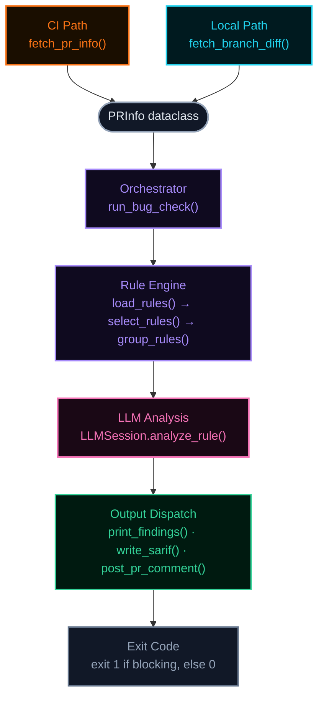

# PR Bug Checker

LLM-powered bug pattern detection for tt-metal PRs. Scans PR diffs against a library of known bug patterns using Claude, then reports findings as PR comments, SARIF output, and CLI output.

## How It Works

1. A PR is targeted (via `/bug-check` comment or local CLI invocation).
2. The tool loads all rules from `.github/bug_checker/manifest.yaml`.
3. Rules are filtered to only those matching the PR's changed files (path globs) or labels.
4. Each matching rule is sent to Claude along with the PR diff. Claude analyzes the diff against the bug pattern described in the rule's markdown file.
5. Findings are reported in three formats: CLI stdout, inline PR comments, and SARIF for GitHub Code Scanning.



### Component Reference

#### CI Path — `github_client.py` : `fetch_pr_info()` (41–76)

- Triggered by `--pr`
- Calls `gh pr view` and `gh pr diff` via the GitHub API
- Gets the real PR title, labels, SHAs, diff, and changed file list

#### Local Path — `github_client.py` : `fetch_branch_diff()` (79–129)

- Triggered by `--branch`
- Runs `git merge-base` + `git diff` locally
- PR number is set to `0`, labels default to `[]` unless `--labels` is passed

#### PRInfo dataclass — `github_client.py` (16–25)

- The shared data structure both input paths produce
- Fields: `number`, `title`, `base_sha`, `head_sha`, `diff`, `changed_files`, `labels`
- Everything downstream operates on this single type regardless of input source
- Diffs exceeding 8000 lines (`MAX_DIFF_LINES`) are truncated with a warning

#### Orchestrator — `orchestrator.py` : `run_bug_check()` (21–89)

- Central coordinator that sequences the entire pipeline:
  load rules → select matching → group by model → per-rule LLM analysis → collect findings → dispatch outputs
- Fails open — if an LLM call fails, the rule is skipped and the check still passes

#### Rule Engine — `rules.py` + `manifest.yaml` + `rules/*.md`

- `load_rules()` reads `manifest.yaml` and the markdown content of each rule
- `select_rules()` filters by file-glob and label match against `PRInfo`
- `group_rules()` batches rules that share a `group` name into a single LLM session
- Current rules:
  - `ccl-ring-buffer-mismatch` — blocking, paths: `tt_metal/impl/ccl/**`, `ttnn/cpp/ttnn/operations/ccl/**`, labels: `area:ccl`
  - `reshape-dim-check` — warning, paths: `ttnn/cpp/ttnn/operations/data_movement/**`, labels: `area:ops`

#### LLM Analysis — `llm.py` : `LLMSession.analyze_rule()` (31–194)

- Creates an Anthropic client (`claude-sonnet-4-6`, `max_tokens: 4096`, `temperature: 0`)
- Per matched rule:
  1. `_filter_diff_for_rule()` narrows the diff to files matching the rule's path globs; for label-only matches (no path globs matched), the full diff is passed through
  2. Builds a system prompt requiring structured `` ```finding `` blocks
  3. Builds a user message with the rule's markdown + filtered diff
  4. Calls `client.messages.create()`
  5. Parses the response into `Finding` objects

#### Output Dispatch — `output.py` + `github_client.py`

- **CLI stdout** — `print_findings()` — always runs, colorized with loguru
- **SARIF file** — `write_sarif()` — if `--sarif`, for GitHub Code Scanning
- **PR comments** — `post_pr_comment()` — if `--post-comments`, posts inline review comments + a summary comment

#### Exit Code — `__main__.py` (86–87)

- `exit 1` if any finding has `severity == "blocking"`, `exit 0` otherwise

Rules run in isolation by default (separate LLM session each). Rules with the same `group` in the manifest share a conversation, so later rules see earlier analysis.

## Usage

### GitHub Actions (primary)

Comment `/bug-check` on any PR. The workflow at `.github/workflows/bug-check.yaml` runs the checker and posts findings as inline comments.

### Local CLI

```bash
# Analyze current branch diff against main
python .github/bug_checker/run_bug_checker.py --branch --verbose

# Analyze against a different base branch
python .github/bug_checker/run_bug_checker.py --branch origin/release-1.0

# Analyze a PR by number (requires gh CLI auth)
python .github/bug_checker/run_bug_checker.py --pr 39432 --verbose
```

**Requirements**: `pip install -r .github/bug_checker/requirements-bug-checker.txt`

**Environment variables**:
- `BUG_CHECKER_API_KEY` or `ANTHROPIC_API_KEY` — Claude API key
- `BUG_CHECKER_MODEL` — Override the default model (default: `claude-sonnet-4-20250514`)

## Adding a New Rule

1. **Write the rule markdown** in `.github/bug_checker/rules/your-rule-name.md`. Copy `rules/template-rule.md` and fill in each section:

````markdown
# Rule Title

## Description
What the bug is, why it happens, what to look for.

## What to Look For
1. **Pattern 1**: Specific code pattern that indicates this bug.
2. **Pattern 2**: Another variant.

## Bad Code Examples
```cpp
// BUG: explain why
bad_code();
```

## Good Code Examples
```cpp
// GOOD: explain why
good_code();
```
````

2. **Add an entry to `.github/bug_checker/manifest.yaml`**:

   ```yaml
   rules:
     your-rule-name:
       file: your-rule-name.md
       severity: warning       # "blocking" fails the check, "warning" is informational
       suggest_fix: false      # true = LLM includes suggested code fixes
       model: null             # null = use default, or e.g. "claude-sonnet-4-20250514"
       group: null             # null = isolated, or a group name to share LLM context
       paths:                  # rule runs if any changed file matches these globs
         - "path/to/relevant/code/**"
       labels:                 # rule runs if any PR label matches
         - "area:your-area"
   ```

3. **Test locally** against a PR that should trigger the rule:

   ```bash
   python .github/bug_checker/run_bug_checker.py --pr <number> --verbose
   ```

## Manifest Options Reference

| Field | Type | Description |
|-------|------|-------------|
| `file` | string | Markdown filename in `.github/bug_checker/rules/` |
| `severity` | `"blocking"` \| `"warning"` | Blocking findings fail the check and are marked prominently |
| `suggest_fix` | bool | Whether the LLM should include suggested code fixes |
| `model` | string \| null | Claude model override; null uses the global default |
| `group` | string \| null | Group name for shared LLM context; null runs in isolation |
| `paths` | list of globs | Rule runs if any changed file matches |
| `labels` | list of strings | Rule runs if any PR label matches |

A rule is selected if **either** a path or a label matches.

## Data Handling

This tool sends PR diffs to the Anthropic Claude API for analysis. Do not run it on PRs containing secrets or sensitive data without appropriate review.

## Running Tests

```bash
python -m pytest .github/bug_checker/tests/ -v
```
