# TT Architecture and Metalium Guide

## Table of Contents

- [Table of Contents](#table-of-contents)
- [Executive Summary](#executive-summary)
- [Tenstorrent Architecture Overview](#tenstorrent-architecture-overview)
  - [SRAM, interleaved and shared buffers](#sram-interleaved-and-shared-buffers)
  - [Native tile based computing](#native-tile-based-computing)
  - [Where is the cache hierarchy](#where-is-the-cache-hierarchy)
  - [Tenstorrent hardware for GPU experts](#tenstorrent-hardware-for-gpu-experts)
  - [Tenstorrent hardware for CPU experts](#tenstorrent-hardware-for-cpu-experts)
  - [Scaling beyond one chip](#scaling-beyond-one-chip)
- [TT-Metalium](#tt-metalium)
  - [Running code on device](#running-code-on-device)
  - [Register control and Data Flow within the Compute Kernels](#register-control-and-data-flow-within-the-compute-kernels)
  - [Compute APIs](#compute-apis)
  - [Fast dispatch](#fast-dispatch)
  - [SPMD in Metalium](#spmd-in-metalium)

## Executive Summary

This guide introduces developers to Tenstorrent's AI accelerator (called the Tensix Processor) architecture and the TT-Metalium™ programming model. Unlike traditional GPUs that rely on massive thread parallelism, Tensix Processors use a grid of specialized compute nodes called Tensix cores. Each Tensix core contains five small RISC-V CPUs for control and instruction dispatch, dedicated hardware units for matrix operations (FPU) and vector operations (SFPU), data packing/unpacking units, and 1.5MB of local SRAM.

The typical data flow uses Network-on-Chip (NoC) interfaces to bring data into a Tensix core, where it gets unpacked, processed by the compute units, packed, and sent out via the NoC to DRAM or other Tensix cores. This design prioritizes efficient data movement and local SRAM usage, reducing frequent DRAM access.

Programming with Metalium typically requires three kernel types per Tensix core: a **reader kernel** for data input, a **compute kernel** for calculations, and a **writer kernel** for data output. These kernels coordinate through circular buffers in SRAM. The architecture natively operates on 32×32 tiles, optimized for deep learning operations. Metalium provides APIs and abstractions (including compute and data movement) to simplify development, manage hardware resources, and ensure kernel compatibility across hardware generations.

This document covers these concepts in detail to help you develop efficient applications on Tenstorrent hardware.

## Tenstorrent Architecture Overview

The architecture Tenstorrent proposed is a different kind of AI accelerator. Unlike GPUs where the processor provides a massive pool of threads and parallelize across them. Tenstorrent chips are a grid of different nodes. Most are compute nodes called a Tensix core sprinkled with some memory, chip management and Ethernet nodes to facilitate the computation. The overall chip is then called a Tensix processor. The following image shows the logical layout of a Tensix processor, with the different nodes and their functions.

The following sections focus on the individual compute units. For precision, 'Tensix' refers specifically to Tensix cores rather than the complete Tensix processor.

The following image shows the NoC grid of the Tenstorrent Wormhole™ processor (D = DRAM, T = Tensix, E = Ethernet, A = ARC/management, P = PCIe).

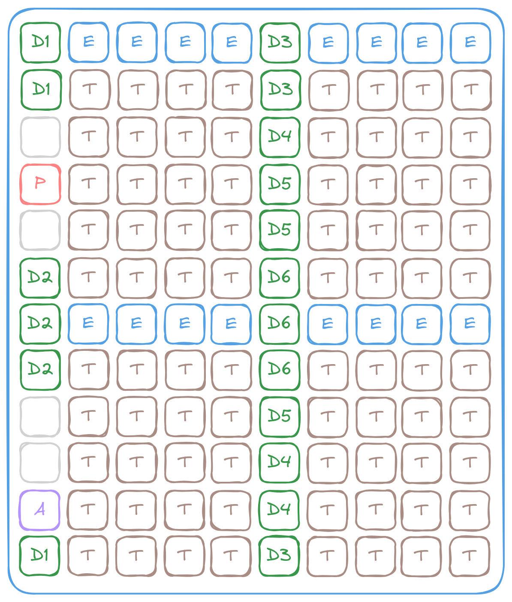

Each Tensix contains 5 "Baby" RISC-V CPUs (Data Movement 0, Data Movement 1, Unpack, Math and Pack), 2 NoC interfaces, a vector unit (SFPU), a matrix unit (FPU) and a pack and unpacker, as well as 1.5MB of SRAM (called L1 in the architecture) to hold transient data and facilitates data exchange between local components. The following image is a rough block diagram of a Tensix (blue arrow = instruction dispatch, brown arrow = data transfer)

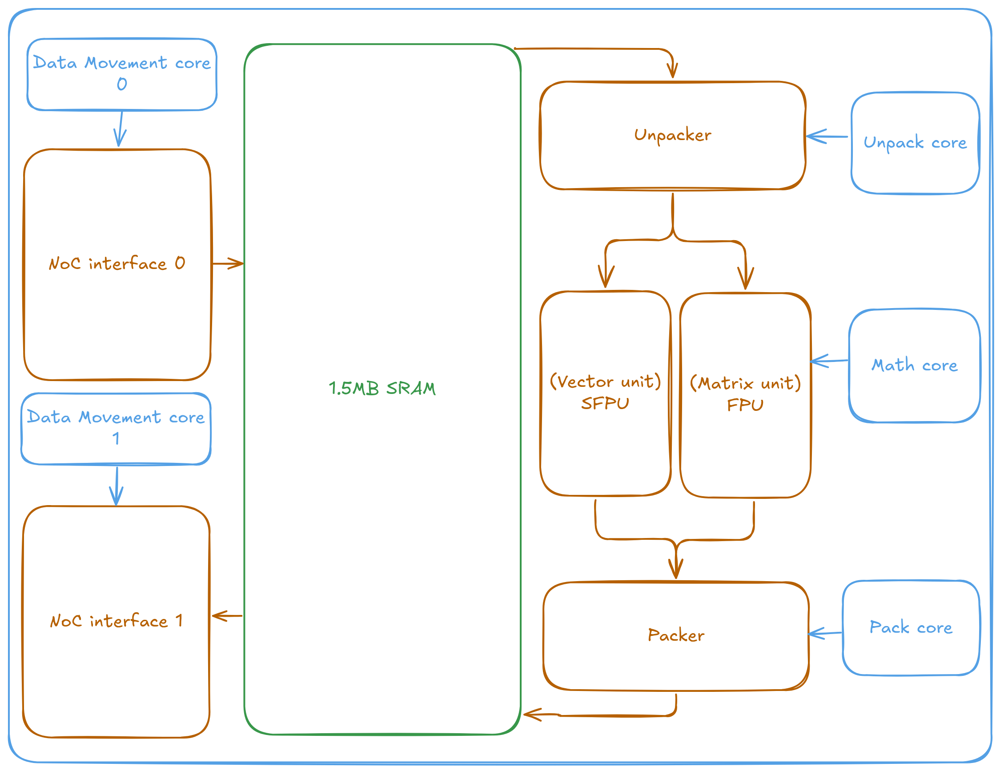

It's a lot to take in. Let's start from the obvious - RISC-V cores and the SRAM. The SRAM stores data local to the Tensix and feeds the compute engines/peripherals. Unlike GPUs, where the Streaming Processors/Compute Units (CUDA/OpenCL terms) provide the majority of computation power, the Baby RISC-V cores in Tensix primarily handle instruction dispatch and control flow. They issue commands to the NoC/Matrix/Vector/{,Un}packer units, which in turn perform the actual computational work, rather than executing the computations directly. These cores are designated "Baby" cores to reflect their design - unlike modern superscalar, vector processors, they are deliberately minimal and share more architectural similarity with classic RISC processors like the MIPS R3000 than with the complex CPUs found in contemporary phones, desktops, and servers.

The intended data flow is as follows, resembling software pipelining but on a distributed and hardware scale:

* NoC 0 reads data from DRAM (or accept data from other Tensixes)
* Unpacker unpacks the data into a format that can be processed by the matrix/tensor unit
* Matrix/tensor unit performs the computation
* Packer packs the result back into a format for storage
* NoC 1 sends the result to DRAM (or other Tensixes)

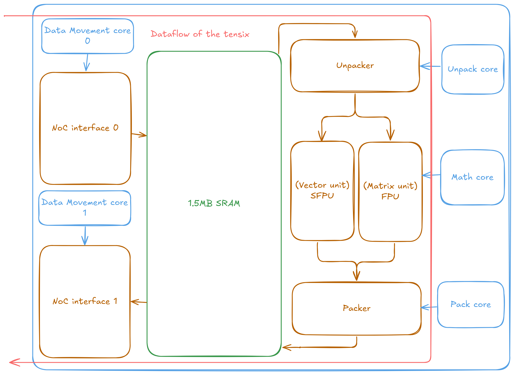


The NoCs operate in a quasi-full-duplex configuration through a unidirectional, wraparound topology where NoC 0 and NoC 1 traverse the chip in opposite directions. This bidirectional capability allows both NoCs to simultaneously send and receive data, while the unidirectional design optimizes power consumption and silicon area utilization. The wraparound 2D torus topology ensures full connectivity, enabling any point on the chip to communicate with any other location. The opposing directional flow of the two NoCs naturally provides efficient return paths for data, regardless of the originating location.

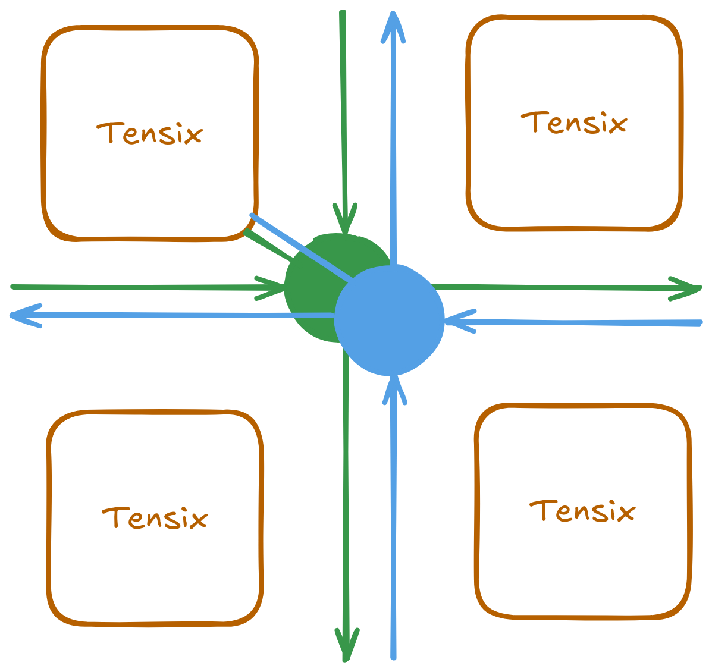

It is important to understand that the flow described above is just one possible configuration. The RISC-V cores maintain full control of every part of the Tensix. For complex operations, they are fully capable and sometimes operators intentionally utilize both NoCs for the same data movement simultaneously, doubling the effective bandwidth at the cost of not being able to overlap reads and writes together. SRAM can be used as temporary storage for intermediate results within the operation itself.

Despite the chip's grid-like topology, the architecture maintains programming flexibility. Developers can implement [Single Program, Multiple Data (SPMD)][wiki_spmd] execution patterns across cores without architectural restrictions. SPMD serves as the primary programming model for most operations, with specialized implementations only required for algorithms that benefit from exploiting the physical chip topology for performance optimization, such as the [optimized Scaled Dot Product Attention implementation on Wormhole][spda_tt_report].

[wiki_spmd]: https://en.wikipedia.org/wiki/Single_program,_multiple_data


[spda_tt_report]: https://github.com/tenstorrent/tt-metal/blob/7c26a4706be6ba8b5faf2c3ccb0e127a784883f8/tech_reports/FlashAttention/FlashAttention.md

This architecture, with its five RISC-V cores per Tensix, might initially suggest that developers need to write five separate programs for each operation. In practice, developers typically write three types of kernels per Tensix: a **reader kernel** for data input (usually managing NoC0), a **compute kernel** for the actual computation using the matrix/vector units, and a **writer kernel** for data output (usually managing NoC1). The reader and writer kernels are often reusable across different operations since they handle standard data movement patterns. The three RISC-V cores within the compute section work cooperatively, with their coordination handled automatically by the compiler and Metalium programming model rather than requiring explicit multi-threaded programming.

The following diagram illustrates how these kernel types are distributed across the Tensix architecture:

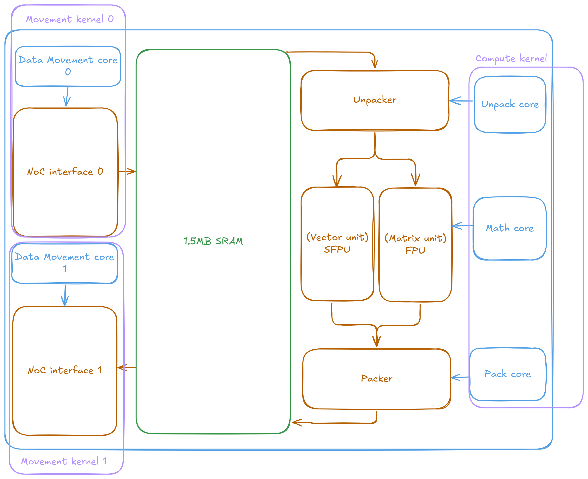


The three kernels - reader, compute, and writer - coordinate their execution using circular buffers, which are implemented in SRAM and facilitated by hardware metadata synchronization. These circular buffers act as producer-consumer queues, enabling safe and efficient data exchange between kernels.

Each kernel interacts with the buffers as follows:

- **Reader kernel:** Writes data into the circular buffer and signals when new data is available.
- **Compute kernel:** Waits for data to become available in the buffer before processing it. After computation, it writes the results to another buffer and marks them as ready.
- **Writer kernel:** Waits for the computed results to appear in the buffer before writing them to the output location.

This mechanism ensures that each kernel only proceeds when the necessary data is ready, preventing race conditions and enabling asynchronous, pipelined execution across the hardware.

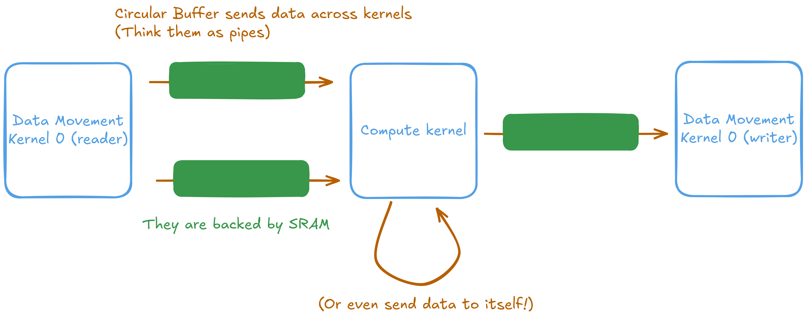
The vector addition operation demonstrates the three-kernel architecture clearly. The reader kernel accepts three parameters: the addresses of input buffers A and B, and the number of tiles to process. It fetches data from DRAM and places it into circular buffers. The compute kernel waits for data availability from the reader, performs the addition operation, and outputs results to another circular buffer. The writer kernel then retrieves the computed results and writes them to the designated output buffer. Since the NoC interfaces and compute engines operate as independent peripherals, all operations execute asynchronously, requiring explicit synchronization barriers to ensure correct data flow and prevent race conditions.

The following are the kernels, when run together, will perform vector addition on two input buffers A and B, each containing `n_tiles` tiles and write the result to an output buffer C.

```c++
// Data read kernel (data movement kernel 0)
#include <dataflow_api.h>

void kernel_main() {
    // Read parameters from the kernel run-time arguments
    const uint32_t a_addr = get_arg_val<uint32_t>(0);
    const uint32_t b_addr = get_arg_val<uint32_t>(1);
    const uint32_t n_tiles = get_arg_val<uint32_t>(2);

    constexpr auto cb_in0 = tt::CBIndex::c_0;
    constexpr auto cb_in1 = tt::CBIndex::c_1;

    const uint32_t tile_size_bytes = get_tile_size(cb_in0);

    const InterleavedAddrGenFast<true> a = {
        .bank_base_address = a_addr,
        .page_size = tile_size_bytes,
        .data_format = DataFormat::Float16_b
    };
    const InterleavedAddrGenFast<true> b = {
        .bank_base_address = b_addr,
        .page_size = tile_size_bytes,
        .data_format = DataFormat::Float16_b
    };

    // Read inputs from DRAM into circular buffers
    for (uint32_t i = 0; i < n_tiles; i++) {
        cb_reserve_back(cb_in0, 1);
        cb_reserve_back(cb_in1, 1);

        const uint32_t cb_in0_addr = get_write_ptr(cb_in0);
        const uint32_t cb_in1_addr = get_write_ptr(cb_in1);
        noc_async_read_tile(i, a, cb_in0_addr);
        noc_async_read_tile(i, b, cb_in1_addr);

        noc_async_read_barrier();  // Wait until tile reads are done

        cb_push_back(cb_in0, 1);
        cb_push_back(cb_in1, 1);
    }
}
```

For the compute kernel, the same source code is used to create binaries for all three Unpack/Math/Pack baby RISC-V cores. The Metalium compute API is implemented with code sections that are each enabled only for a specific type of core. In the example below, the `add_tiles` call has Unpack core code that copies the input tiles into the FPU's source registers, as well as Math core code that performs the addition operation on the FPU and stores the result into the destination register. On the other hand, the `cb_reserve_back` call only contains code that will execute on the Pack core. During execution, the runtime will automatically compile the compute kernel code three times, each time for a different core. The generated binaries will only contain code dedicated for a single type of core and will then be submitted to the device for concurrent execution.

Synchronization with the reader and writer kernels, as well as between the three cores that are running the compute kernel, is done through the circular buffers and other synchronization primitives.

```c++
// Compute kernel
#include <compute_kernel_api.h>
#include <compute_kernel_api/common.h>
#include <compute_kernel_api/eltwise_binary.h>

namespace NAMESPACE {
void MAIN {
    const uint32_t n_tiles = get_arg_val<uint32_t>(0);
    constexpr auto cb_in0 = tt::CBIndex::c_0;
    constexpr auto cb_in1 = tt::CBIndex::c_1;
    constexpr auto cb_out = tt::CBIndex::c_16;
    constexpr uint32_t dst_reg = 0;

    // Metalium API Calls                              Involved Cores
    binary_op_init_common(cb_in0, cb_in1, cb_out);  // Unpack, Math, Pack
    add_tiles_init(cb_in0, cb_in1, false);          // Unpack, Math

    for (uint32_t i = 0; i < n_tiles; i++) {
        cb_wait_front(cb_in0, 1);                   // Unpack
        cb_wait_front(cb_in1, 1);                   // Unpack

        tile_regs_acquire();                        // Math
        add_tiles(cb_in0, cb_in1, 0, 0, dst_reg);   // Unpack, Math
        tile_regs_commit();                         // Math

        cb_pop_front(cb_in0, 1);                    // Unpack
        cb_pop_front(cb_in1, 1);                    // Unpack

        cb_reserve_back(cb_out, 1);                 // Pack

        tile_regs_wait();                           // Pack
        pack_tile(dst_reg, cb_out, 0);              // Pack
        tile_regs_release();                        // Pack

        cb_push_back(cb_out, 1);                    // Pack
    }
}
}
```

The writer is simple. Just waits for the output data from the compute kernel to be ready in the output circular buffer and writes it to the output DRAM buffer.

```c++
// Data write kernel (data movement kernel 1)
#include <dataflow_api.h>

void kernel_main() {
    const uint32_t c_addr = get_arg_val<uint32_t>(0);
    const uint32_t n_tiles = get_arg_val<uint32_t>(1);

    constexpr auto cb_out = tt::CBIndex::c_16;

    const uint32_t tile_size_bytes = get_tile_size(cb_out);

    const InterleavedAddrGenFast<true> c = {
        .bank_base_address = c_addr,
        .page_size = tile_size_bytes,
        .data_format = DataFormat::Float16_b
    };

    // Read outputs from circular buffers into DRAM
    for (uint32_t i = 0; i < n_tiles; i++) {
        cb_wait_front(cb_out, 1);

        const uint32_t cb_out_addr = get_read_ptr(cb_out);
        noc_async_write_tile(i, c, cb_out_addr);

        noc_async_write_barrier();

        cb_pop_front(cb_out, 1);
    }
}
```

### SRAM, interleaved and shared buffers

Each Tensix contains 1.5MB of SRAM, and with hundreds of Tensix cores per chip, this provides substantial on-chip memory capacity. Unlike pure SRAM architectures that require all data to fit in SRAM, Tenstorrent's hybrid approach allows data to reside in either SRAM or DRAM as needed. This flexibility reduces expensive DRAM accesses for intermediate results while avoiding the strict memory constraints of pure SRAM designs.

This approach reduces the need for aggressive operator fusion that CPUs and GPUs require to maintain performance. In traditional architectures, intermediate tensors that exceed cache capacity get evicted to DRAM, or context switches invalidate cache contents, creating performance bottlenecks. Tenstorrent's architecture allows intermediate data to persist in SRAM across multiple operations without eviction pressure. When operations can access data stored locally within the same Tensix, NoC bandwidth requirements are eliminated entirely, further improving performance.

The physical placement of DRAM controllers on the chip can be exploited to optimize memory access patterns. By default, memory operations use "interleaved" mode, which distributes data across all available DRAM controllers. This provides the most balanced performance characteristics and works well for general-purpose workloads.

For specific operations, data can instead be stored in "sharded" mode (see the [Tensor and Memory Layout report](https://github.com/tenstorrent/tt-metal/blob/main/tech_reports/tensor_layouts/tensor_layouts.md) for details), where tensors are distributed across multiple Tensix cores based on the physical topology of the chip. This approach reduces the physical distance data must travel and minimizes cross-chip communication overhead. Sharded memory placement is particularly beneficial for attention mechanisms and convolution operations where the computation pattern aligns well with the data distribution strategy.

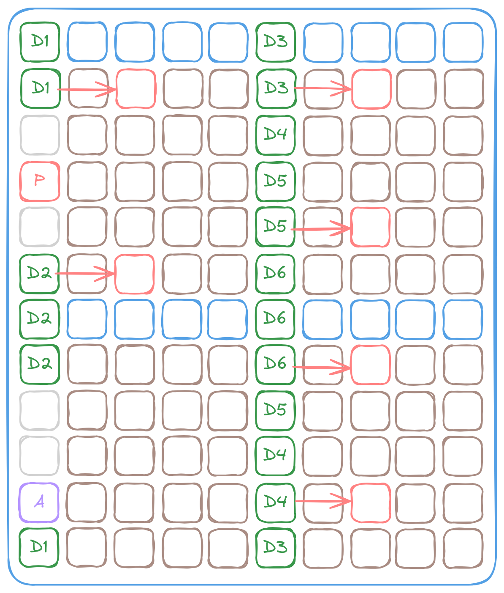

### Native tile based computing
Tenstorrent hardware natively operates on 32×32 element tiles, which optimizes common deep learning operations like matrix multiplication and convolution. This design choice addresses a fundamental inefficiency in traditional linear memory layouts: when performing matrix operations, hardware must buffer entire rows (often thousands of elements) because accessing the next row requires skipping large memory offsets, or manual zigzag/tiled matrix multiplication must be implemented which adds complexity.

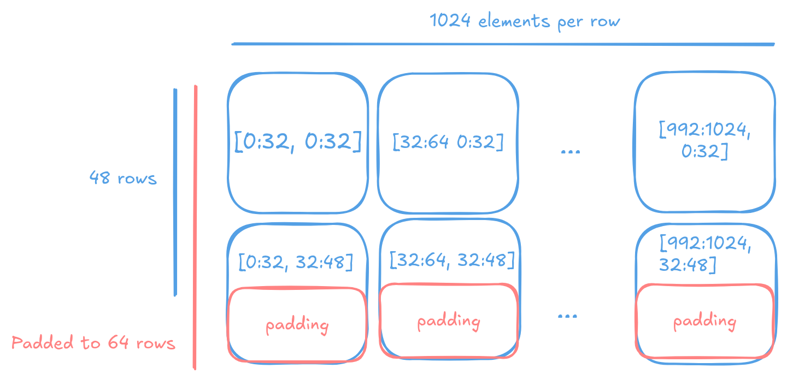

Tiled layouts solve this problem by organizing data so the next row element appears after only 32 elements, dramatically reducing the memory footprint needed for computation. This organization significantly improves the compute-to-SRAM ratio - instead of dedicating large amounts of SRAM to buffer full matrix rows, the hardware keeps more data actively involved in computation.

Tensors are stored in tiled format natively on Tenstorrent processors and converted back to linear format when returned to host systems. For example, a 48×1024 matrix becomes a 64×1024 matrix due to 32×32 tile alignment requirements, with the first dimension padded by 16 rows. Tilization and untilization operations can be performed on-device, reducing CPU overhead during model loading and inference.

The 32×32 tile size allows hardware to process data efficiently within a few clock cycles while maintaining computation pipelines. CPUs and GPUs must implement complex tiled access patterns in software to improve cache utilization and performance. Tenstorrent hardware provides this capability natively, eliminating the software overhead of tile management.

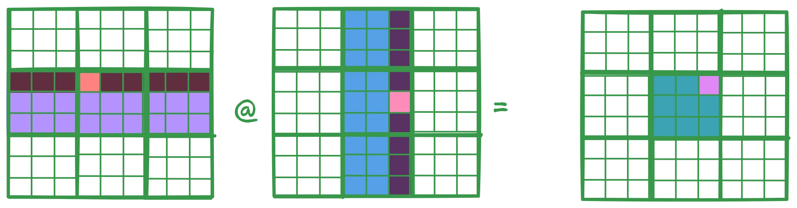

GPUs often struggle to efficiently supply data to their tensor cores because their architectures are primarily designed around vector operations. This can lead to less optimal memory access patterns for tensor workloads. In contrast, Tenstorrent hardware is built for tile-based computation from the start—both the vector and matrix units operate natively on 32×32 tiles. This approach leads to more predictable performance and a simpler programming model. For detailed performance numbers, see the [Matrix Multiplication performance report](https://github.com/tenstorrent/tt-metal/blob/main/tech_reports/GEMM_FLOPS/GEMM_FLOPS.md) as well as the [Convolution Networks on Tenstorrent Chips](https://github.com/tenstorrent/tt-metal/blob/main/tech_reports/CNNs/ttcnn.md) report.

### Where is the cache hierarchy

Tenstorrent chips deliberately omit cache hierarchies found in traditional CPU and GPU architectures. Instead of relying on automatic caching mechanisms to hide memory latency, the design provides direct access to SRAM throughout the chip. Any component can read from or write to SRAM located in other Tensix cores across the entire device.

This SRAM functions as addressable memory rather than transparent cache. Data movement requires explicit operations: either other cores write data to a target Tensix's SRAM, or the Tensix itself issues requests to fetch required data. This explicit model eliminates cache coherency protocols and provides predictable memory access latency, but places responsibility on developers to manage data placement and movement patterns effectively.

### Tenstorrent hardware for GPU experts

In contrast to modern GPU architectures that achieve high throughput through massive thread parallelism and latency-hiding techniques, Tenstorrent processors employ a fundamentally different architectural approach centered on asynchronous I/O operations and efficient resource utilization through software pipelining. The key architectural distinctions include:

* Each Baby RISC-V core within a Tensix implements single-threaded execution without hardware multithreading capabilities
* The architecture omits SIMT (Single Instruction, Multiple Thread) designs that abstract SIMD lanes as independent threads, as well as traditional latency-hiding mechanisms
* Tensix cores operate through cooperative processing models rather than conventional thread scheduling paradigms
* The deliberate absence of cache hierarchies provides deterministic and consistent memory access patterns
* DRAM access requires explicit DMA operations rather than transparent memory management
* The Network-on-Chip (NoC) interconnect facilitates efficient near-memory computation capabilities

### Tenstorrent hardware for CPU experts

Similar to the IBM CELL processor architecture, each Tensix contains dedicated SRAM that the Baby RISC-V cores and the peripherals on the Tensix access directly. Any data not stored in local SRAM must be explicitly transferred via DMA operations, either through writes from other cores or through explicit requests from the Tensix itself. Each Tensix includes dedicated vector and matrix processing units, similar to modern CPU architectures. However, the entire chip architecture omits cache hierarchies, providing deterministic and consistent memory access latency. When computational data fits within SRAM capacity, maximum performance is achieved without requiring specialized optimization techniques. Additionally, cores within each Tensix operate cooperatively rather than independently completing separate work portions.

The Baby RISC-V cores are implemented as straightforward RISC-V 32IM processors without task switching capabilities. Since explicit DMA operations are required for DRAM access (which exists outside the Tensix's address space), memory consistency and latency management is unnecessary. Inter-core data communication within the Tensix uses hardware mutex mechanisms and circular buffer structures.

### Scaling beyond one chip

As models grow larger, multi-chip co-processing becomes essential for serving state-of-the-art models. The machine learning community has traditionally relied on CPUs and PCIe buses for inter-device data transfers. However, the scale requirements of modern workloads necessitated specialized solutions like NVLink and Infiniband. While these proprietary interconnects are effective, they require expensive cabling and switching infrastructure.

Tenstorrent takes a different approach by using standard Ethernet connectivity. While NVIDIA's NVLink 5.0 provides 400G (G = Gbps) connectivity, Tenstorrent chips support standard Ethernet up to 800G - infrastructure already present in modern data centers. This eliminates the need for proprietary interconnects and specialized switches. The chips have sufficient NoC bandwidth and processing capability to function as network switches themselves, enabling converged computing without affecting computational performance.

The Wormhole n300 card illustrates this design with two Wormhole chips connected via Ethernet. The chip with direct PCIe host connectivity (L chip - Local) communicates with the secondary chip (R chip - Remote) through this Ethernet link. The SDK abstracts this topology, allowing developers to program both chips uniformly for memory allocation, kernel execution, and data transfer operations.

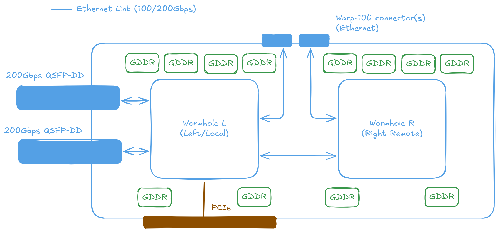

This architecture scales efficiently beyond two chips. The QuietBox configuration contains 8 Wormhole or 4 Blackhole™ processors connected in a mesh topology. Data can be transferred between processors using specialized code called EDM (Ethernet Data Movers) that handles traffic routing over the Ethernet interconnects.

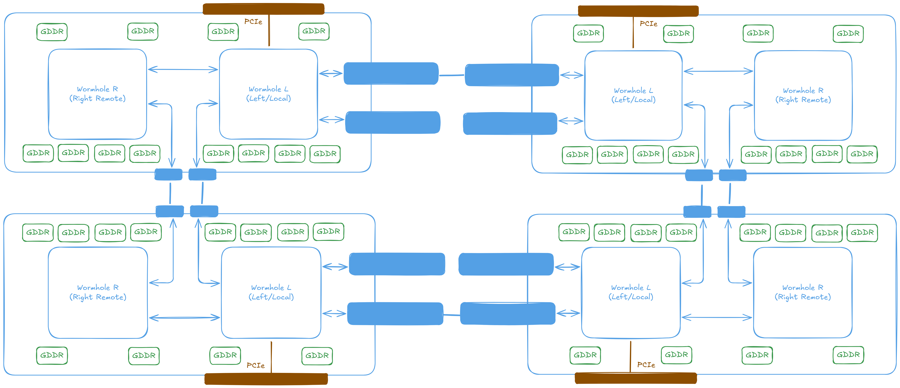

While 8 chips provides substantial computational capacity, larger configurations are required for training the most demanding models. The same interconnect architecture scales to configurations of up to 32 chips connected on a single host system.

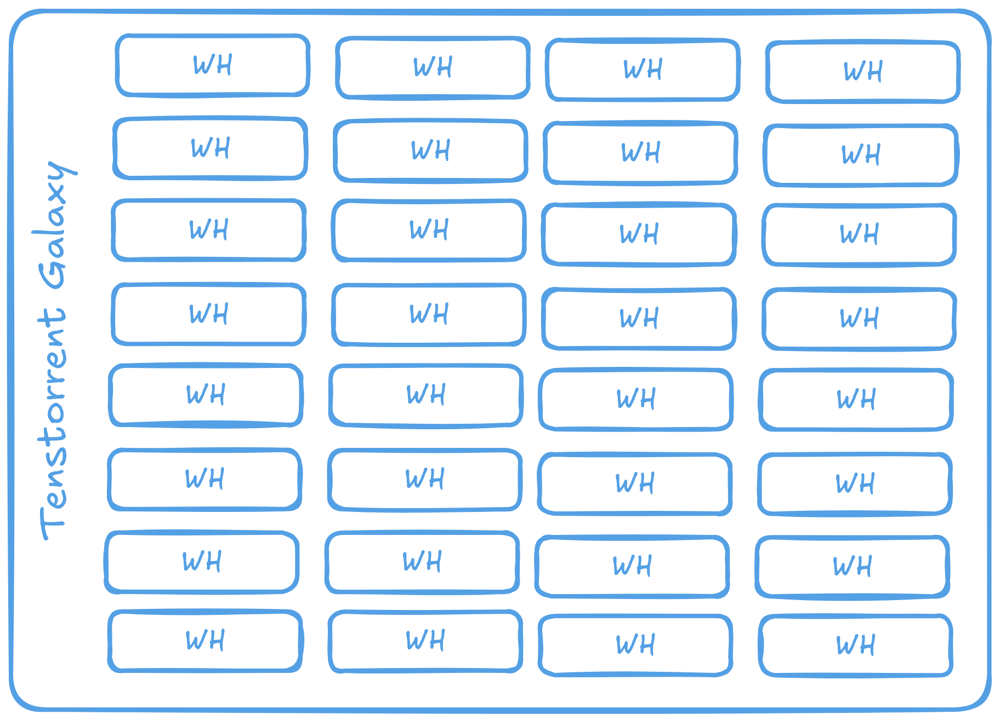

Multiple 32-chip boxes can be connected together to form a mesh spanning several hosts. These meshes can then be linked, with traffic routed between them using the tt-Fabric firmware. This approach allows scaling to data center configurations while keeping the same programming model, API, and development concerns as a single machine.

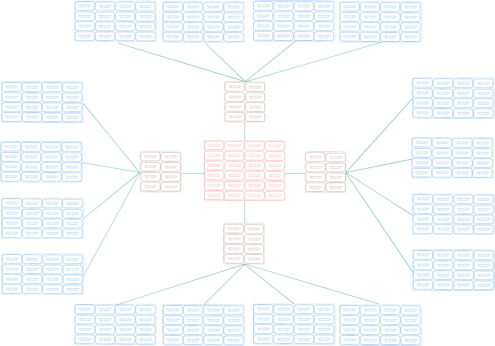

Please refer to the [tt-Fabric technical report](tech_reports/TT-Fabric/TT-Fabric-Architecture.md) for more details on the interconnect architecture and how it enables efficient scaling across multiple chips and hosts. And [Basic Ethernet Multichip](https://github.com/tenstorrent/tt-metal/blob/main/tech_reports/EthernetMultichip/BasicEthernetGuide.md) for a guide on Ethernet performance on Wormhole processors.

## TT-Metalium

Metalium is Tenstorrent's SDK for developing applications on the Tensix Processor. The full product name is TT-Metalium™, also abbreviated as tt-Metal or Metal. The API design resembles OpenCL, providing C++ interfaces for both high-level operations and direct hardware control. The kernels shown in previous sections are written using Metalium.

Metalium functions as the base layer for Tenstorrent's software stack. Higher-level tools like TTNN, tt-MLIR, and tt-Forge are built on top of Metalium. Applications can range from simple single-kernel programs running on one core to complex distributed computations spanning multiple chips.

### Running code on device

Metalium follows a similar design philosophy to OpenCL, which is reflected in its API structure. The process of executing code on a Tenstorrent device involves the following steps:

* Initialize and open a device connection
* Allocate memory buffers for input and output data
* Transfer input data to device buffers
* Compile data movement and compute kernels
* Allocate circular buffers for inter-kernel data communication
* Configure runtime parameters for kernel execution
* Enqueue kernels for execution
* Synchronize and wait for kernel completion
* Retrieve computational results from output buffers

The following example demonstrates vector addition implementation using the Metalium API. This code shows the complete workflow: device initialization, buffer allocation, kernel compilation, circular buffer configuration, program execution, and result retrieval.

First, we initialize the device connection and allocate the necessary buffers:

```c++
IDevice* device = CreateDevice(/*device_id=*/0);
CommandQueue& cq = dev->command_queue(/*cq_id=*/0);
Program program = tt::tt_metal::CreateProgram();

constexpr uint32_t n_tiles = 64;
constexpr uint32_t elements_per_tile = tt::constants::TILE_WIDTH * tt::constants::TILE_HEIGHT;
constexpr size_t tile_size_bytes = elements_per_tile * sizeof(bfloat16);
constexpr size_t buffer_size_bytes = n_tiles * tile_size_bytes;
constexpr size_t page_size_bytes = tile_size_bytes; // We choose to use one tile per page

InterleavedBufferConfig dram_buffer_config{
    .device = device,
    .size = buffer_size_bytes,
    .page_size = page_size_bytes,
    .buffer_type = BufferType::DRAM};
auto a = CreateBuffer(dram_buffer_config);
auto b = CreateBuffer(dram_buffer_config);
auto c = CreateBuffer(dram_buffer_config);

std::vector<uint32_t> a_data = create_random_vector_of_bfloat16(buffer_size_bytes, 2, 42, -1.0f);
std::vector<bfloat16> b_data(n_tiles * elements_per_tile, 3.14159f);

EnqueueWriteBuffer(cq, a, a_data, /*blocking=*/false);
EnqueueWriteBuffer(cq, b, b_data, /*blocking=*/false);
```

Next, we allocate the circular buffers required for inter-kernel communication. Each circular buffer is configured to hold two or more tiles worth of data, enabling the reader kernel to fetch new data while the compute kernel processes the previous tile. This overlapping of data movement and computation significantly improves overall throughput. While increasing the number of tiles per circular buffer can further enhance performance, developers should carefully evaluate memory usage constraints and recognize the diminishing returns associated with larger buffer sizes. The circular buffer configuration utilizes buffers 0, 1, and 16 for inter-kernel communication. These specific buffer IDs are arbitrary selections - any unique identifiers would function equivalently. The key requirement is that each circular buffer must have a distinct ID to prevent conflicts during execution.

```c++
// This example executes on a single Tensix core
constexpr CoreCoord core {0, 0};
constexpr uint32_t tiles_per_cb = 2;

// Configure source buffer A (input 0)
constexpr auto cb_in0_index = tt::CBIndex::c_0;
CBHandle cb_in0 = CreateCircularBuffer(
    program, core,
    CircularBufferConfig(
        /*total_size=*/tiles_per_cb * tile_size_bytes,
        /*data_format_spec=*/{{cb_in0_index, tt::DataFormat::Float16_b}})
        .set_page_size(cb_in0_index, tile_size_bytes));

// Configure source buffer B (input 1)
constexpr auto cb_in1_index = tt::CBIndex::c_1;
CBHandle cb_in1 = CreateCircularBuffer(
    program, core,
    CircularBufferConfig(
        /*total_size=*/tiles_per_cb * tile_size_bytes,
        /*data_format_spec=*/{{cb_in1_index, tt::DataFormat::Float16_b}})
        .set_page_size(cb_in1_index, tile_size_bytes));

// Configure destination buffer (output)
constexpr auto cb_out_index = tt::CBIndex::c_16;
CBHandle cb_out = CreateCircularBuffer(
    program, core,
    CircularBufferConfig(
        /*total_size=*/tiles_per_cb * tile_size_bytes,
        /*data_format_spec=*/{{cb_out_index, tt::DataFormat::Float16_b}})
        .set_page_size(cb_out_index, tile_size_bytes));
```

Then, we compile the kernels for data movement and computation. For simplicity, this example targets a single Tensix at coordinates (0, 0). Runtime arguments are then configured for each kernel to specify their operational parameters.

```c++
auto reader = CreateKernel(
    program,
    "path/to/reader_kernel.cpp",
    core,
    DataMovementConfig{.processor = DataMovementProcessor::RISCV_0, .noc = NOC::RISCV_0_default});
auto writer = CreateKernel(
    program,
    "path/to/writer_kernel.cpp",
    core,
    DataMovementConfig{.processor = DataMovementProcessor::RISCV_1, .noc = NOC::RISCV_1_default});
auto compute = CreateKernel(
    program,
    "path/to/compute_kernel.cpp",
    core,
    ComputeConfig{.math_approx_mode = false, .compile_args = {}, .defines = {}});
SetRuntimeArgs(program, reader, core, {a->address(), b->address(), n_tiles});
SetRuntimeArgs(program, writer, core, {c->address(), n_tiles});
SetRuntimeArgs(program, compute, core, {n_tiles});
```

Following setting the arguments, the program is enqueued for execution, synchronized for completion, and the computational results are retrieved.

```c++
EnqueueProgram(cq, program, /*blocking=*/true);
std::vector<bfloat16> c_data(n_tiles * elements_per_tile, 0.0f);
EnqueueReadBuffer(cq, c, c_data, /*blocking=*/true);
```

### Register control and Data Flow within the Compute Kernels

As described earlier, the RISC-V cores in each Tensix are mainly responsible for dispatching instructions to the hardware engines, not for performing the computations themselves. The unpack core moves data from L1 SRAM into registers, the math core issues instructions to the SFPU and FPU, and the pack core writes data back to L1. These engines are peripherals and do not share registers with the RISC-V cores or with each other. Instead, they use dedicated registers:

- **SrcA** and **SrcB**: Hold the source data for the matrix engine
- **Dst**: Holds the result for matrix and vector engine operations, also serves as input for the vector engine
- **LReg**: Holds the internal state of the vector engine

The diagram below shows the register layout and data flow for the SFPU and FPU units:

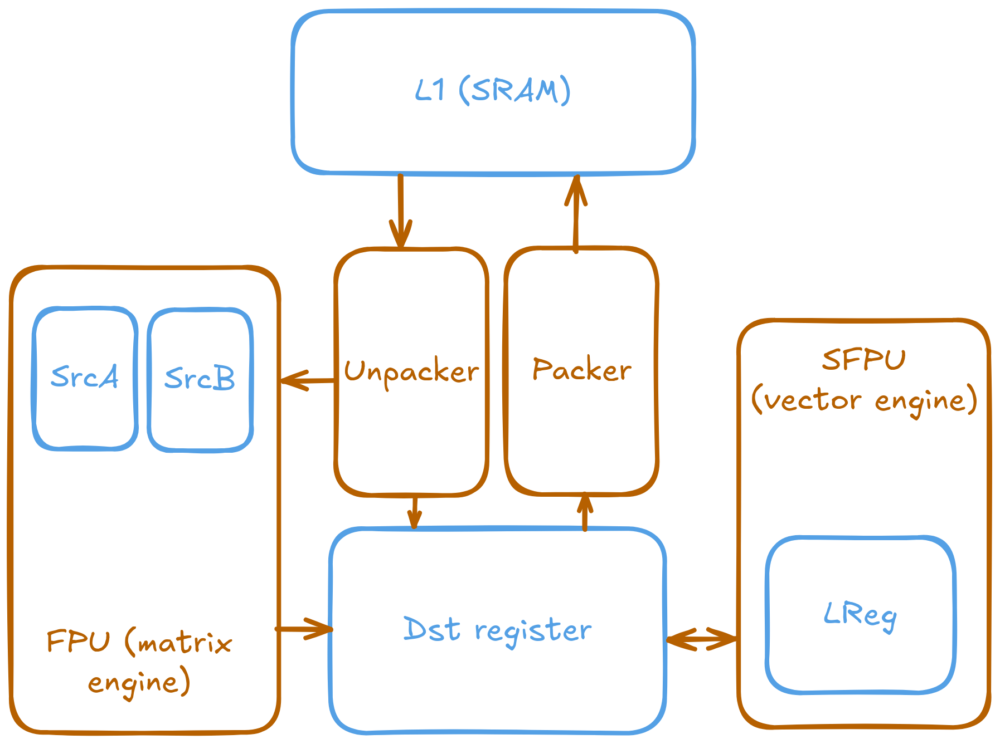

Some APIs, such as the `add_tiles` function shown earlier, operate directly on circular buffers and handle register management automatically. For other operations - like trigonometric or more complex elementwise functions - you need to explicitly move data between buffers and registers. The exact approach depends on the operation and the API you are using.

For instance, adding two tiles together using the FPU requires the following steps:

```c++
// Dst register index for the result
constexpr uint32_t dst_reg = 0;
// Add two tiles together using the FPU and store in Dst register
add_tiles(tt::CBIndex::c_0, tt::CBIndex::c_1, 0, 0, dst_reg);
// Pack the result into the result circular buffer
pack_tile(dst_reg, tt::CBIndex::c_16, /*output_tile_index=*/0);
```

For functions such as sine or cosine, you must explicitly load the input tile into the Dst register, call the relevant SFPU function, and then write the result back to the circular buffer.

```c++
// Dst register index for the result
constexpr uint32_t dst_reg = 0;
// Load the input tile into the `dst_reg`-th register.
copy_tile(tt::CBIndex::c_0, 0, dst_reg);
// Call the SFPU sine function. It overwrites original value in register
sin_tile(dst_reg);
// Write the result back to the circular buffer
pack_tile(dst_reg, tt::CBIndex::c_16, /*output_tile_index=*/0);
```

In general, FPU operations can work directly on circular buffers, while SFPU operations require data to be moved into into the Dst register before invoking the SFPU. But almost always `pack_tile` is needed to write the result back to the circular buffer, which is then pushed and the writer kernel can proceed to write the result to the output buffer.

#### Compute APIs

A natural question when encountering a new abstraction layer is, "Why is this needed?" For Metalium kernels, the Compute API abstraction layer addresses a fundamental problem: **maintaining kernel code compatibility and performance across different hardware generations.**

Tenstorrent hardware evolves between generations with significant architectural changes. Vector units, instruction sets, and data path characteristics differ - Grayskull's vector unit processes 64 elements with 19-bit floating point precision, while Wormhole and Blackhole generations use 32-element vectors with 32-bit floating point operations.

Without an abstraction like compute API, developers would need to write kernels directly for specific hardware generations. This creates several problems:
*   **Code Brittleness:** Kernels written for Grayskull (using 64-wide vector operations) won't work on Wormhole or Blackhole.
*   **Maintenance Overhead:** Each new hardware generation requires rewriting and re-validating kernels, slowing development and adoption.

Compute APIs solve this by providing a stable programming interface. When invoked from a compute kernel (e.g., `sin_tile`), the Metalium compiler automatically selects the correct implementation optimized for the target hardware's vector width, instruction set, and other capabilities. This preserves the kernel's functionality while ensuring optimal performance across hardware generations.

This abstraction ensures kernel code remains functional and efficient across hardware generations. For example, when a compute kernel invokes `sin_tile`, the compiler automatically selects the appropriate implementation optimized for the target hardware's specific vector width and computational capabilities.

```c++
sin_tile(0); // Different implementation for sin is called when compiled for
             // different generations of Tenstorrent processors.
```
When a compute kernel calls `sin_tile`, Metalium automatically selects the correct hardware-specific implementation for the target processor. For Grayskull processors, the implementation performs a phase shift transformation from the [0, 2π] range to [-π, π] and employs a MacLaurin series expansion to compute the sine function. This selection and dispatch are handled by Metalium, ensuring that the appropriate version of the sine operation is invoked for each hardware generation.

```c++
// tt_metal/hw/ckernels/grayskull/metal/llk_api/llk_sfpu/ckernel_sfpu_trigonometry.h
template <bool APPROXIMATION_MODE, int ITERATIONS>
inline void calculate_sine() {
    // SFPU microcode
    for (int d = 0; d < ITERATIONS; d++) {
        vFloat v = dst_reg[0];

        // Assume v is bound [0:2pi]
        // phase shift [0:2pi] to [-pi:pi] and multiply result by -1
        v = v - 3.14159264f;
        v = sfpu_sine_maclaurin_series<APPROXIMATION_MODE>(v);

        // Use symmetrical properties of trig
        v *= -1;

        // Write Output
        dst_reg[0] = v;
        dst_reg++;
    }
}
```

For Blackhole (and Wormhole) processors, the availability of `float_to_int16` instruction enables reliable value shifting to the [-π, π] range. The implementation then applies a MacLaurin series calculation for sine computation (utilizing the same mathematical approach but with processor-specific function naming). Additionally, the ITERATIONS parameter differs between processor generations (not shown in code here, it is set by an outside source): Grayskull requires 4 iterations, while Wormhole and Blackhole require 8 iterations to accommodate their reduced vector width of 32 elements compared to Grayskull's 64-element vectors.

```c++
// tt_metal/hw/ckernels/blackhole/metal/llk_api/llk_sfpu/ckernel_sfpu_trigonometry.h
template <bool APPROXIMATION_MODE, int ITERATIONS>
inline void calculate_sine() {
    // SFPU microcode
    for (int d = 0; d < ITERATIONS; d++) {
        vFloat v = dst_reg[0] * FRAC_1_PI;
        vInt whole_v = float_to_int16(v, 0);
        v -= int32_to_float(whole_v, 0);
        v = sfpu_sinpi<APPROXIMATION_MODE>(v);

        v_if(whole_v & 1) { v = -v; }
        v_endif;
        dst_reg[0] = v;
        dst_reg++;
    }
}
```

While Metalium supports custom vectorized computation implementations, developers should note that vector width and hardware-specific details vary between processor generations. And working implementation must be provide for the target processor. For most applications, use the provided compute APIs from the kernel library since Tenstorrent maintains these implementations for compatibility with future hardware generations. For custom vectorized computation guidance, see the [Low Level Kernels][tt_llk_doc] section in the Metalium documentation.

[tt_llk_doc]: https://docs.tenstorrent.com/tt-metal/latest/tt-metalium/tt_metal/apis/kernel_apis/sfpu/llk.html

### Fast dispatch

Fast dispatch implements asynchronous command queuing by dedicating one RISC-V core per queue on the device to process queued operations. Unlike GPUs that use specialized on-chip schedulers built into the GPU-host runtime, Tenstorrent assigns one RISC-V core per command queue for command processing. This core is typically placed on an unused Ethernet tile, which minimizes impact on computational performance while taking advantage of the architecture's ability for any core to access any other core.

When fast dispatch is disabled (by setting the `TT_METAL_SLOW_DISPATCH_MODE` environment variable to `1`), the asynchronous dispatch mechanism is bypassed. This disables command queue functionality and prevents asynchronous I/O operations between the host and device. In slow dispatch mode, the CPU must wait for each operation to complete before proceeding to the next instruction. Synchronous API calls such as `ReadFromBuffer` must be used instead of their asynchronous counterparts like `EnqueueReadBuffer`.

Fast dispatch is much faster - Slow dispatch forces the host CPU to actively manage all operations, including data transfers to and from the device. This creates significant CPU overhead and prevents the host from performing other tasks while waiting for device operations. Fast dispatch stores command sequences in host memory and allows the device to fetch and execute them independently. Freeing the CPU to handle other work (or simply idle and reduce power) while the device processes commands, resulting in better overall system utilization.

**Use fast dispatch for production workloads.** Slow dispatch should only be used for debugging when you suspect the dispatch mechanism itself is malfunctioning or when you need to determine whether issues originate from the command queuing system or kernel execution.


```c++
// Fast dispatch. Can be async or the process waits until completion
EnqueueReadBuffer(queue, buffer, host_ptr, /*blocking=*/false);

// Slow dispatch. No queue. But also CPU has to do all the job
ReadFromBuffer(buffer, host_ptr);
```

Unlike OpenCL's command queue which optionally supports out-of-order execution, Tenstorrent's command queue architecture enforces strict in-order execution due to the performance characteristics of the Baby RISC-V cores. To enable overlapping computation and data transfer operations, each device provides two dedicated command queues: By convention, queue 0 handles computational workloads while Queue 1 manages data transfer operations. Synchronization between queues is achieved through an event-based mechanism, where an event obtained from one queue can signal completion to the other queue, ensuring proper coordination and preventing race conditions such as reading from buffers that are currently being modified by concurrent operations.

```c++
// Wait for the current tail operation on queue 0 to complete
// before proceeding on command queue 1
auto event = EnqueueRecordEvent(device->command_queue(0));
EnqueueWaitForEvent(device->command_queue(1), event);
```

### SPMD in Metalium

Single Program, Multiple Data (SPMD) execution is a common parallel computing model used in frameworks like OpenMP, CUDA, and OpenCL. In SPMD, multiple processing units execute the same program but operate on different portions of data. While Metalium supports SPMD and provides the necessary infrastructure, the architecture does not enforce its use - developers can choose alternative approaches when beneficial.

For complex operations requiring specialized behavior, Metalium also supports Multiple Program, Multiple Data (MPMD) execution, where different Tensix cores run entirely different programs. An example is the data-reused matrix multiplication implementation, which places specialized kernels on specific Tensix cores to broadcast data to other cores, reducing NoC bandwidth consumption.

Unlike OpenCL's `get_global_id()`, CUDA's `threadIdx`, or OpenMP's `omp_get_thread_num()`, Metalium does not provide built-in thread and global work size identification mechanisms. Instead, developers explicitly specify the data range each Tensix core processes by passing different runtime arguments to each core before kernel execution. For example:

```c++
CoreRange core_range = {{0, 0}, {4, 4}}; // Processors from (0,0) to (4,4)
// set up the program and kernels
...

// Calculate work per core based on the range and number of tiles
uint32_t work_per_core = calculate_work_per_core(...);
for(uint32_t y = core_range.start.y; y < core_range.end.y; y++) {
    for(uint32_t x = core_range.start.x; x < core_range.end.x; x++) {
        auto core = {x, y};
        uint32_t id = y * core_range.end.x + x; // Unique ID for each core
        SetRuntimeArgs(program, reader_kernel, core, {
            a->address(),
            b->address(),
            work_per_core,
            id // Pass unique ID to each core
        });
        // In most cases, the compute kernel doesn't care about the core ID, but if needed, it can be passed as well
        SetRuntimeArgs(program, compute_kernel, core, {
            work_per_core
        });
        // Set runtime arguments for the writer kernel
        SetRuntimeArgs(program, writer_kernel, core, {
            c->address(),
            work_per_core,
            id // Pass unique ID to each core
        });
    }
}
```

Metalium provides the `tt::tt_metal::split_work_to_cores` utility function to distribute work across available cores for SPMD execution. The function takes the total number of tiles and available cores, then calculates how to divide the work when it cannot be evenly distributed. The function returns two groups of cores: a primary group that handles more tiles per core, and a secondary group that handles fewer, along with the tile count for each group. Minimizing workload imbalance between cores (if work can be evenly distributed, the secondary group will be empty.)

```c++
auto core_grid = device->compute_with_storage_grid_size();
auto [num_cores, // number of cores utilized
    all_cores, // set of all cores used
    core_group_1, // Primary core group
    core_group_2, // Secondary core group
    num_tiles_per_core_group_1, // Number of tiles each core in the primary group processes
    num_tiles_per_core_group_2 // Number of tiles each core in the secondary group processes
    ] = tt::tt_metal::split_work_to_cores(grid_size, work_size);
```

Only create kernels on cores that have been assigned work (i.e., those in `all_cores` or `core_group_*`). Avoid creating kernels on unused cores, as this can cause undefined behavior or crashes if kernels are created but runtime arguments are not set on the core. If there is not enough work, some cores may remain idle—do not assign kernels to them.

```c++
// `all_cores` is guaranteed to be the union of `core_group_1` and `core_group_2`.
for (const auto& core : all_cores) {
    // Good
    CreateKernel(program, "/path/to/reader.cpp", all_cores, DataMovementConfig{...});
    CreateKernel(program, "/path/to/compute.cpp", all_cores, ComputeConfig{...});
    CreateKernel(program, "/path/to/writer.cpp", all_cores, DataMovementConfig{...});

    // Bad - all_cores may be smaller than core_grid
    //                                               vvvvvvv
    // CreateKernel(program, "/path/to/reader.cpp", core_grid, DataMovementConfig{...});
    // CreateKernel(program, "/path/to/compute.cpp", core_grid, ComputeConfig{...});
    // CreateKernel(program, "/path/to/writer.cpp", core_grid, DataMovementConfig{...});
}
```

Developers should iterate over all cores and set the runtime arguments for each kernel according to the assigned core group and tile count. The sum of tiles processed by all cores must match the original workload. If a core is not part of either group (can happen due to not enough work or other reasons), its runtime arguments MUST be set such the kernel does nothing (a no-op). Leaving runtime arguments uninitialized will lead to undefined behavior and issues during execution.

```c++
auto work_groups = {std::make_pair(core_group_1, num_tiles_per_core_group_1),
                    std::make_pair(core_group_2, num_tiles_per_core_group_2)};
uint32_t id = 0; // Offset for the next core in the group
for(const auto& [group, work_per_core] : work_groups) {
    for (const auto& range : group) {
        for(const auto& core : range) {
            // Set runtime arguments for each kernel based on the core and tile count
            SetRuntimeArgs(program, reader, core, {/*reader parameters*/a->address(), b->address(), work_per_core, id});
            SetRuntimeArgs(program, writer, core, {/*writer parameters*/c->address(), work_per_core});
            SetRuntimeArgs(program, compute, core, {/*compute parameters*/work_per_core, id});
            id += work_per_core;
        }
    }
}

// at this point id == work_size as all cores have been assigned work
```
