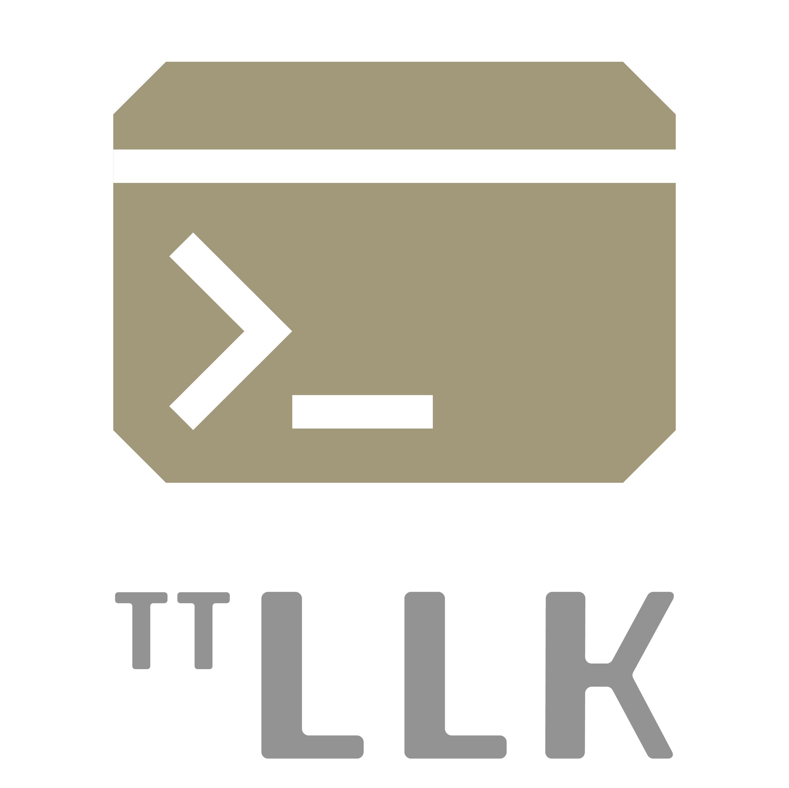

<h1>

[Bounties](https://github.com/tenstorrent/tt-llk/issues?q=is%3Aissue%20state%3Aopen%20label%3Abounty) | [Buy](https://tenstorrent.com/cards/) | [Discord](https://discord.gg/tvhGzHQwaj) | [Join Us](https://job-boards.greenhouse.io/tenstorrent)

</h1>

  
**TT-LLK** is Tenstorrent's Low Level Kernel library.

## Overview ##

This repository contains header-only low-level kernels (LLK) for Tenstorrent AI chips, including Wormhole, and Blackhole.

These kernels serve as foundational compute primitives, acting as building blocks for higher-level software stacks that implement machine learning (ML) operations.

Additionally, the repository includes a test environment designed to validate LLK APIs.

## Install ##

1. **Clone the repository**

    Clone this repository to your local computer.

2. **Set up the test environment**

    Follow the instructions in the [testing README](https://github.com/tenstorrent/tt-llk/blob/main/tests/README.md) to set up the test environment.

## Software dependencies ##

Test environment requires SFPI compiler for building, which is automatically ingested from <https://github.com/tenstorrent/sfpi>

## Documentation ##

The following documentation is available to help you understand and use low-level kernels:

1. **[Intro](docs/llk/l1/intro.md)**
   A concise introduction to LLKs, designed for both technical and non-technical audiences. This document outlines the scope of the LLK software stack and its relationship to other Tenstorrent software components.

2. **[Top-level Overview](docs/llk/l2/top_level_overview.md)**
   Provides a high-level look at the Tensix Core and Tensix Engine architecture, including data organization for efficient LLK usage and operations supported by LLKs. This document is not tied to any specific chip generation (such as Wormhole) and is aimed at engineers and technical readers who want to understand the general architecture and capabilities.

3. **[LLK Programming Model](docs/llk/l3/programming_model.md)**
   This document dives into architectural details to best explain the usage of the LLK API. It is intended for op writers and advanced users, and connects LLK concepts with our runtime stack, [tt-metal](https://github.com/tenstorrent/tt-metal), providing practical guidance on how to leverage LLKs for efficient kernel development.

## Contributing ##

We welcome contributions to improve tt-llk! Please follow these steps to get started:

1. **Read the Guidelines**

    Familiarize yourself with our [CONTRIBUTING](https://github.com/tenstorrent/tt-llk/blob/main/CONTRIBUTING.md) guide and [CODE OF CONDUCT](https://github.com/tenstorrent/tt-llk/blob/main/CODE_OF_CONDUCT.md).

2. **Create a Branch**

    Create a new branch for your changes.

3. **Make Changes**

    Implement your changes and commit them with clear and descriptive messages.

4. **Add Tests**

    If applicable, add new tests to cover your changes and ensure all existing tests pass.

5. **Submit a Pull Request**

    Open a pull request (PR) to propose your changes for review.

## Tenstorrent Bounty Program Terms and Conditions ##

This repo is a part of Tenstorrent’s bounty program. If you are interested in helping to improve tt-llk, please make sure to read the [Tenstorrent Bounty Program Terms and Conditions](https://docs.tenstorrent.com/bounty_terms.html) before heading to the issues tab. Look for the issues that are tagged with both 'bounty' and difficulty level labels!

### Note ###

Old LLK repositories:

- <https://github.com/tenstorrent/tt-llk-gs>
- <https://github.com/tenstorrent/tt-llk-wh-b0>
- <https://github.com/tenstorrent/tt-llk-bh>

have been archived. All ongoing development continues in this repository.
