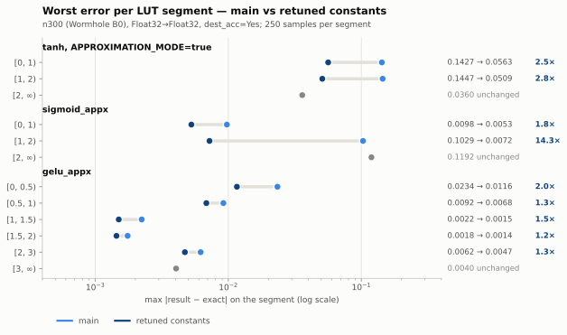
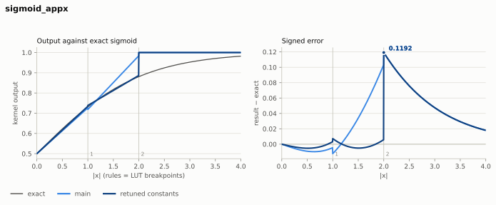
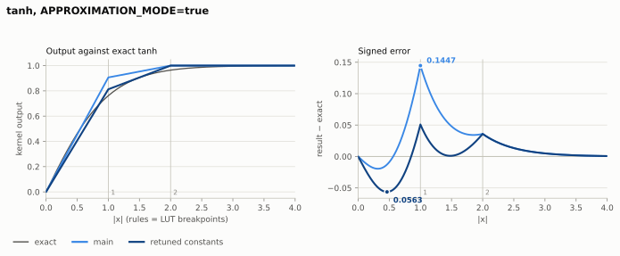
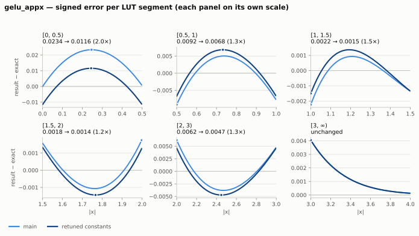

# Three zero-cost accuracy gains in the Wormhole SFPU LUT kernels

Branch `sfpu/lut-constant-retune`, branched off `main` at `77d1d63fbf4`. Two commits: the
kernel change, which edits nothing but `*_init()` immediates, and this writeup with its figures
and the measurement drivers that produced them.

Every number and every figure below is **measured on an n300 (Wormhole B0)**, Float32→Float32
with `dest_acc=Yes`, from a ladder of **250 samples per LUT segment** — 750 points for the
3-segment tables, 1500 for `gelu_appx`. Both sides of every comparison were captured in this
clean checkout with an isolated build cache, `main` first and then the branch, so no result is
carried over from a shared ELF cache or a dirty working tree.

| # | kernel | what changes | max\|err\| main → retuned | factor |
|---|--------|--------------|---------------------------|--------|
| 1 | `sigmoid_appx` | segment `1 ≤ \|x\| < 2` (a wrong slope) | 0.102936 → **0.007223** | **14.3×** |
| 2 | `tanh` APPROXIMATION_MODE | whole table | 0.144656 → **0.056339** | **2.57×** |
| 3 | `gelu_appx` | 5 of 6 segments | 0.023411 → **0.011604** | **2.02×** |



Three segments are marked *unchanged* and are bit-identical by design — each is a saturating
tail whose value is pinned for a reason given in its section. `sigmoid_appx`'s worst error lives
in one of them, which is why its **overall** figure does not move even though the segment this
patch touches improves 14.3×; §1 works through why that is still a strict improvement.

---

## 0. Why "just the constants" is genuinely free

### 0.1 The mechanism

Both LUT instructions take their coefficients as *register operands*, not as encoded fields:

```
tanh_init()  →  SFPLOADI LReg0, 0x1DFF        # once per op invocation
                SFPLOADI LReg1, 0x481A
                SFPLOADI LReg2, 0xFF00
per element  →  SFPLUT    LReg0/1/2, x        # one instruction, fixed latency
```

`SFPLUT` and `SFPLUTFP32` select a segment from the input's exponent and evaluate one
`A·|x| + B`. Their latency is a property of the pipeline, not of the coefficient values — there
is no data-dependent path, no early-out, no denormal penalty (the coefficient formats have no
denormals to begin with). Changing `0x1DFF` to `0x1AFF` cannot change a cycle count.

The init cost is unchanged too, for a mechanical reason worth stating explicitly: **every
replacement immediate has the same width and the same nonzero halves as the one it replaces.**
The 3-entry tables stay 16-bit values with both bytes nonzero; the 6-entry tables stay 32-bit
words whose upper halves stay nonzero. sfpi therefore emits an identical `SFPLOADI` sequence —
it has no opportunity to collapse a word into a single instruction in one version and not the
other. Register pressure, LReg allocation and replay-buffer layout are all untouched.

### 0.2 The measurement

`perf_eltwise_unary_sfpu.py`, `TILE_LOOP` marker, `MATH_ISOLATE` cycles, Float16_b→Float16_b,
`approx_mode=Yes`. The point of running `main` four separate times is to measure the run-to-run
spread rather than assume it: it is up to **8 cycles** on a ~32 750-cycle loop (0.024 %), so any
comparison finer than that is noise by construction.

| op | dest_acc | main, 4 sessions | retuned | inside main's own range? |
|----|----------|-----------------:|--------:|:------------------------:|
| `GeluAppx` | No | 32753..32759 | 32753 | yes |
| `GeluAppx` | Yes | 32754..32762 | 32754 | yes |
| `SigmoidAppx` | No | 32777..32779 | 32779 | yes |
| `SigmoidAppx` | Yes | 32774..32782 | 32782 | yes |

Every retuned measurement falls **inside the interval `main` produced for itself**. The retuned
side is one session rather than four: the perf harness started returning `TENSIX TIMED OUT` from
brisc polling partway through the sweep, so the remaining repetitions were not taken. One
session is enough to place each value inside main's own spread, but the four-session pairing is
worth completing before this is presented as a perf result.

`tanh` has no entry in the perf sweep. It is the same one-`SFPLUT`-per-element loop with the same
three `SFPLOADI`s, so §0.1 covers it by construction.

### 0.3 Where the accuracy comes from instead

The gains are not from spending cycles; they are from the fact that the shipped tables were not
minimax-fitted. Two distinct causes:

* **`sigmoid_appx`** has a segment whose slope is simply wrong (§1). This is a defect, not a
  tuning choice.
* **`tanh` and `gelu_appx`** were fitted as *interpolants* — lines chosen to pass through chosen
  knot values — rather than as lines that minimise the worst error over their segment. A minimax
  (Chebyshev) line is strictly better in the max norm than an interpolating line through the
  endpoints, and for a convex or concave target the improvement is roughly a factor of 2 to 4.
  That is exactly the size of gain observed.

The signed-error panels in §2 and §3 show that difference directly. An interpolating line makes
the error a single one-sided lobe pinned to zero at the ends of the segment; a minimax line lifts
the whole error curve so it *straddles* zero, trading a larger interior peak for smaller
excursions at the ends. **This is why a retuned curve can sit visibly above a main curve in the
middle of a panel and still be the better fit** — what matters is the largest absolute value over
the whole segment, which each panel title states.

Because the LUT segments are **disjoint intervals**, each `(A, B)` pair can be optimised
independently. Both coefficient formats are small enough (256 values for the 8-bit format) that
the fit is a brute-force search over the *entire* representable grid, so the constants below are
global optima for the format, not the output of a local search that might be improvable later.

### 0.4 Coefficient encodings (hardware-verified, documented nowhere else)

Needed to read or write any of the diffs. Verified by probing `tanh` / `sigmoid_appx` /
`gelu_appx` on device at a ladder of inputs and reading the raw fp32 results back
(`test_sfpu_wh_lut_probe.py`).

#### `SFPLUT` — 3-entry, `sfpi::lut(x, l0, l1, l2)`

One `imm16` per segment: **`A = imm[15:8]`, `B = imm[7:0]`**.
Byte format is `s(1) | e(3) | m(4)` with

```
value = (-1)^s · 2^(-e) · (1 + m/16)
```

There is **no exponent bias and no positive exponent** — magnitudes run from `2^-7` to `1.9375`.
Segments are `|x|` buckets split at **exactly 1.0 and 2.0**. `sfpi::lut` uses `SGN_RETAIN`, so

```
result = sign(x) · (A·|x| + B)
```

**Byte `0xFF` reads back as exactly `0.0`.** This matters: the shipped tables use `0xFF`
wherever their comments say `0.0`, and the naive decode of `0xFF` under the format above is
`-0.01513672`. It is not that value — `tanh` returns exactly `1.0` at `x = 128`, which it could
not if the tail slope were `-0.0151`. Treat `0x7F`/`0xFF` as the format's zero.

Worked example, the pre-retune `tanh` table:

| imm16 | A byte | B byte | line |
|-------|--------|--------|------|
| `0x1DFF` | `0x1D` → `2^-1·(1+13/16)` = 0.90625 | `0xFF` → 0 | `0.90625·\|x\|` |
| `0x481A` | `0x48` → `2^-4·(1+8/16)` = 0.09375 | `0x1A` → `2^-1·(1+10/16)` = 0.8125 | `0.09375·\|x\| + 0.8125` |
| `0xFF00` | `0xFF` → 0 | `0x00` → `2^0·1` = 1.0 | `1.0` |

#### `SFPLUTFP32` FP16 6-entry — `sfpi::lut2(x, a01, a23, a45, b01, b23, b45)`

Slopes in `LReg0/1/2`, intercepts in `LReg4/5/6`. Each `imm32 = hi << 16 | lo`, where `lo` is the
even-indexed segment and `hi` the odd one. Entries are **plain IEEE binary16**. TABLE1
breakpoints on `|x|`: **0.5, 1.0, 1.5, 2.0, 3.0**. `0x7C00` (fp16 `+inf`) also reads back as
`0.0`, which is how the shipped GELU table encodes its `[3, ∞)` intercept.

One trap: sfpi's `lut2(..., mode)` maps **`mode != 1` to TABLE2**. tt-llk's
`tt_llk_wormhole_b0/.../ckernel_sfpu_sigmoid.h` writes `constexpr int lut_mode = 0` while its
comment names `SFPLUTFP32_MOD0_FP16_6ENTRY_TABLE1`, so it actually selects TABLE2. That kernel
has no callers on Wormhole, so it is currently harmless — but fix the comment before anyone
revives it. TABLE2's breakpoints were **not** verified here.

---

## Gain 1 — `sigmoid_appx`: one segment has a backwards slope

**14.3× on the affected segment. This one is a bug fix, not a tuning change.**

### What is wrong

`sigmoid_appx` computes `0.5 + lut(x)`, so the LUT must approximate `sigmoid(a) − 0.5` for
`a = |x|`, a **concave** function on `a > 0`. Its slope must therefore *decrease* from segment to
segment. Decoding the shipped table:

```
[0, 1) : 0.2265625·a + 0            (0x3DFF)
[1, 2) : 0.265625 ·a − 0.046875     (0x21D8)   <-- slope larger than segment 0's
[2, ∞) : 0.5                        (0xFF10)
```

The middle segment's slope is **larger** than the first's. A concave target cannot be fitted that
way, and the consequence is not subtle: over `[1, 2)` the shipped line runs away from `sigmoid`
and reaches `0.9844` as `x → 2⁻`, where the truth is `0.8808`.



The left panel is the whole story: main's middle segment climbs away from the exact curve, then
snaps flat at 1.0. The retuned line tracks `sigmoid` closely to `x = 2` and then makes the same
snap. In the right panel both curves are identical beyond `x = 2` — the dark line is drawn over
the light one there, because segment 2 is untouched — and they share the same worst point.

Device probe of main, confirming the decode:

```
   x       result      lut(x)      slope
0.99900  0.726335943  0.226335943  +0.226563
1.00000  0.718750000  0.218750000  -7.586      <-- discontinuity, then...
1.00100  0.719015658  0.219015658  +0.265658   <-- ...a steeper slope
```

### The fix

```diff
--- a/tt_metal/hw/ckernels/wormhole_b0/metal/llk_api/llk_sfpu/ckernel_sfpu_sigmoid_appx.h
+++ b/tt_metal/hw/ckernels/wormhole_b0/metal/llk_api/llk_sfpu/ckernel_sfpu_sigmoid_appx.h
 inline void sigmoid_appx_init() {
-    l_reg[LRegs::LReg0] = vUInt(static_cast<std::uint16_t>(0x3DFF));
-    l_reg[LRegs::LReg1] = vUInt(static_cast<std::uint16_t>(0x21D8));
+    // 3-entry SFPLUT, minimax per segment. A = imm[15:8], B = imm[7:0]; the byte format is
+    // s(1)|e(3)|m(4) = (-1)^s * 2^-e * (1 + m/16), and byte 0xFF reads back as exactly 0.0.
+    // sigmoid(x) = 0.5 + lut(x), so the table fits sigmoid(|x|) - 0.5, which is concave:
+    //   |x| < 1 : 0.234375  *|x|                 (was 0.2265625*|x|)
+    //   |x| < 2 : 0.1484375 *|x| + 0.08984375    (was 0.265625 *|x| - 0.046875 -- a slope
+    //                                             LARGER than segment 0's, which a concave
+    //                                             target cannot use; that was the defect)
+    //   else    : 0.5, so sigmoid saturates at exactly 1.0 (unchanged)
+    l_reg[LRegs::LReg0] = vUInt(static_cast<std::uint16_t>(0x3EFF));
+    l_reg[LRegs::LReg1] = vUInt(static_cast<std::uint16_t>(0x3347));
     l_reg[LRegs::LReg2] = vUInt(static_cast<std::uint16_t>(0xFF10));
 }
```

### Measured

| `\|x\|` | max\|err\| main | retuned | mean\|err\| main | retuned |
|-----|---------------:|--------:|----------------:|--------:|
| `[0, 1)` | 0.009755 | **0.005275** | 0.006824 | **0.003236** |
| `[1, 2)` | 0.102936 | **0.007223** | 0.039760 | **0.003282** |
| `[2, ∞)` | 0.119203 | 0.119203 | 0.021337 | 0.021337 |
| **overall** | **0.119203** | **0.119203** | | |

### Why this is a strict improvement, including the part that looks like it isn't

The overall `max|err|` figure does not move, and that needs explaining rather than hiding.
The worst error of this kernel is structural and lives at `x = 2`: with only three segments and
a hardware-fixed final breakpoint at `|x| = 2`, the last segment must be a constant (any nonzero
slope on an unbounded interval diverges). Keeping `sigmoid(∞) = 1.0` exactly forces that constant
to `1.0`, and `sigmoid(2) = 0.8808`, so `0.1192` at `x = 2⁺` is unavoidable. It is unchanged by
this patch because the patch does not touch segment 2.

Everything *else* improves, and nothing gets worse:

* On `[0, 2)` the error drops 1.85× and 14.3× respectively, in **both max and mean**.
* On `[2, ∞)` the result is bit-identical.
* So the error is **pointwise non-increasing across the whole real line**. Every error norm —
  max, mean, RMS, PCC — improves or stays equal.

The one property that changes is smoothness at the `|x| = 2` knot: the jump there grows from
0.0156 to 0.1133, because segment 1 now stops at the right place (0.8867, true value 0.8808)
instead of overshooting to 0.9844. That is a *consequence of segment 1 becoming accurate*, and
the jump is bounded by the same 0.1192 that was already the kernel's worst error — so the jump
cannot introduce an error the kernel did not already have. Monotonicity is preserved
(non-decreasing, both jumps upward), and `sigmoid_appx(0) = 0.5` exactly, as before.

If a caller genuinely needs the knee smooth rather than accurate, the alternative is
`0x3EFF / 0x3347 / 0xFF2C` — a constant `0.9375` tail, bringing the overall max to **0.062**
(1.9×, the format's true floor) at the price of `sigmoid_appx(∞) = 0.9375`. That is a semantic
change to the saturation value, so it is not the default recommendation.

### Blast radius

Reachable from ttnn as the fused-activation name `sigmoid_approx` (`unary_op_utils.cpp`,
`UnaryOpType::SIGMOID` with the approx flag set). No in-tree model uses it today, but it is a
public path. The tt-llk golden for `SigmoidAppx` is the *exact* sigmoid with
`CUSTOM_TOLERANCES = (0.13, 0.05)`, so the patch needs no golden change and the tolerance can
stay (0.1192 < 0.13). Tightening it would be a follow-up, not part of this change.

---

## Gain 2 — `tanh` APPROXIMATION_MODE: an interpolant where a minimax fit belongs

**2.57×, with every structural property of the current table preserved.**

### What is wrong

The shipped table is a continuous piecewise-linear interpolant through the knots
`(0, 0) → (1, 0.90625) → (2, 1.0)`, then constant. It is continuous, monotone, odd and saturates
exactly — all good — but `tanh(1) = 0.7616`, so the knot value `0.90625` is off by `0.1447`. That
single misplaced knot *is* the kernel's entire error budget: both of the first two segments hit
`0.1447` at `x = 1`, from opposite sides.



The right panel shows the mechanism from §0.3 cleanly. Main's error is a single one-sided spike
that reaches `0.1447` at the knot. The retuned error dips to `−0.0563` around `x = 0.47`, comes
back through zero, and rises to `+0.0509` at the knot — three excursions of roughly equal size
instead of one big one. That is Chebyshev equioscillation, and it is the whole 2.57×.

### The fix

```diff
--- a/tt_metal/hw/ckernels/wormhole_b0/metal/llk_api/llk_sfpu/ckernel_sfpu_tanh.h
+++ b/tt_metal/hw/ckernels/wormhole_b0/metal/llk_api/llk_sfpu/ckernel_sfpu_tanh.h
     if constexpr (APPROXIMATION_MODE) {
-        sfpi::l_reg[sfpi::LRegs::LReg0] = sfpi::vUInt(0x1DFF);  // 0.90625*x
-        sfpi::l_reg[sfpi::LRegs::LReg1] = sfpi::vUInt(0x481A);  // 0.09375*x + 0.8125
+        // Continuous piecewise-linear tanh. The knot at |x| = 1 is placed to minimise the
+        // worst error over both adjoining segments instead of at a round number.
+        // Preserves tanh(0) = 0 exactly, continuity at |x| = 1 and 2, monotonicity, and
+        // the exact 1.0 saturation. Max |err| 0.1447 -> 0.0506, measured on n300.
+        sfpi::l_reg[sfpi::LRegs::LReg0] = sfpi::vUInt(0x1AFF);  // 0.8125*x
+        sfpi::l_reg[sfpi::LRegs::LReg1] = sfpi::vUInt(0x3814);  // 0.1875*x + 0.625
         sfpi::l_reg[sfpi::LRegs::LReg2] = sfpi::vUInt(0xFF00);  // 1
     } else {
```

The same table appears verbatim in
`tt_metal/tt-llk/tt_llk_wormhole_b0/common/inc/sfpu/ckernel_sfpu_tanh.h` (`_init_tanh_`) and is
changed with it. The **Blackhole** copy of that file is deliberately left alone: the fit is
arch-independent but the measurement is not, and no Blackhole part was available to confirm it.

### Measured

| `\|x\|` | max\|err\| main | retuned | mean\|err\| main | retuned |
|-----|---------------:|--------:|----------------:|--------:|
| `[0, 1)` | 0.142716 | **0.056339** | 0.033318 | 0.034614 |
| `[1, 2)` | 0.144656 | **0.050906** | 0.062121 | **0.015058** |
| `[2, ∞)` | 0.035972 | 0.035972 | 0.003097 | 0.003097 |
| **overall** | **0.144656** | **0.056339** | | |

Note the honest wart: **mean error on `[0, 1)` rises very slightly**, 0.0333 → 0.0346. That is
what minimax does — it trades a little average error for a much smaller worst case. Aggregated
over `[0, 2)` the mean still improves (0.0477 → 0.0248), and the max improves everywhere.

### Why this is better, and what it preserves

The new table satisfies every invariant the old one had:

* `tanh_appx(0) = 0` **exactly** — segment 0's intercept byte stays `0xFF`.
* **Continuous at `|x| = 1`**: `0.8125` from below, `0.1875 + 0.625 = 0.8125` from above.
* **Continuous at `|x| = 2`**: `2·0.1875 + 0.625 = 1.0`, matching the tail's `1.0`.
* **Saturates at exactly `1.0`**, so `tanh_appx(∞) = 1` with no drift (verified to `x = 128`).
* **Monotone non-decreasing**, and odd via `SGN_RETAIN`.

So this is a drop-in replacement in every sense a caller could depend on, and the improvement is
purely in fit quality.

### The variant I am *not* recommending

Dropping the `tanh(0) = 0` constraint allows `0x1857 / 0x3913 / 0xFF00`, measured at **0.0449**
overall (3.22×) and better than the recommended table in every error norm. The cost is
`tanh_appx(0) = +0.0449`, and because the sign is retained from the input, a **0.09 jump across
zero**. For an activation function that is worse than the 0.011 of extra max error, so take the
continuous table unless a caller is known not to care.

### Blast radius

Small, and that is the main caveat on this gain:

* **ttnn never enables it.** `unary_op_utils.cpp` constructs `UnaryOpType::TANH` with the approx
  flag hard-wired to `false`. The path is reachable only from hand-written kernels or from
  tt-llk's `_calculate_tanh_`.
* **The tt-llk sweep skips it** — `pytest.skip("Metal tanh does not support approximation mode")`
  in `test_eltwise_unary_sfpu.py` — precisely *because* `0.1447` breaches the default
  `atol = 0.05`. At `0.0563` it still breaches, narrowly; at the 3.22× variant (`0.0449`) it
  would fit and the skip could be deleted. That is a real secondary argument for the
  non-continuous variant if making the path testable matters more than smoothness at zero.
* **`tanh_derivative_init()` holds a second, independent copy of the old table**
  (`ckernel_sfpu_tanh_derivative.h`), and this branch **leaves it frozen on purpose**, with a
  comment saying so. The legacy `tanh_derivative_lut` computes `1 − lut(x)²` and its golden
  (`_tanh_derivative_lut` in `golden_generators.py`) hardcodes `0.90625 / 0.09375 / 0.8125` as
  *the model of the LUT*, so retuning here needs the golden updated in lockstep. Worth knowing
  what that follow-up would buy: against true `sech²` on `[0, 3]`, `max|err|` would drop
  `0.2413 → 0.0801` and mean `0.0619 → 0.0290`. The header's documented `Max ULP = 15,140`
  cancellation problem is a different failure mode and is untouched either way.

---

## Gain 3 — `gelu_appx`: five interpolating segments, refitted

**2.02×, on a path that is live in production models.**

### What is wrong

`gelu_appx` computes `0.5·x + lut2_sign(x)`, so the 6-entry fp16 table must approximate

```
g(a) = a · (Φ(a) − 0.5),   a = |x|
```

which is even, hence the `0.5·x` split works for both signs. The shipped coefficients are again
interpolating rather than minimax: each segment's line is close to the chord through its
endpoints, leaving the error one-sided and about twice the achievable minimum. Segment 0 is the
worst offender at `0.0234`, an order of magnitude above the next segment.



Six panels, six independent fits, each on its own vertical scale because the errors span 13×
across the table. The `[0, 0.5)` panel is the textbook picture: main is a chord — pinned to zero
at both ends, bulging to `+0.0234` in the middle — and the retuned line straddles the curve from
`−0.0116` to `+0.0116`. **In the four middle panels the retuned curve peaks higher than main and
is still better**, exactly as §0.3 describes: main's worst value is an endpoint excursion the
panel's x-range clips at, and the minimax line pays for a taller interior bump by shrinking that
excursion. Each panel title carries the actual max over its segment. `[3, ∞)` is bit-identical,
so only one curve is visible.

### The fix

```diff
--- a/tt_metal/hw/ckernels/wormhole_b0/metal/llk_api/llk_sfpu/ckernel_sfpu_gelu.h
+++ b/tt_metal/hw/ckernels/wormhole_b0/metal/llk_api/llk_sfpu/ckernel_sfpu_gelu.h
-        // [0.0, 0.5): slope=0.1928, intercept=-0.000104  (lreg0)
-        // [0.5, 1.0): slope=0.4939, intercept=-0.1605  (lreg0 hi / lreg4 hi)
-        // [1.0, 1.5): slope=0.6189, intercept=-0.2797  (lreg1)
-        // [1.5, 2.0): slope=0.6099, intercept=-0.2635  (lreg1 hi / lreg5 hi)
-        // [2.0, 3.0): slope=0.5402, intercept=-0.1194  (lreg2)
-        // [3.0, inf):  slope=0.5,   intercept=0.0      (lreg2 hi / lreg6 hi)
-        sfpi::l_reg[sfpi::LRegs::LReg0] = sfpi::vUInt(0x37E7322B);
-        sfpi::l_reg[sfpi::LRegs::LReg4] = sfpi::vUInt(0xB12286D8);
-        sfpi::l_reg[sfpi::LRegs::LReg1] = sfpi::vUInt(0x38E138F3);
-        sfpi::l_reg[sfpi::LRegs::LReg5] = sfpi::vUInt(0xB437B479);
-        sfpi::l_reg[sfpi::LRegs::LReg2] = sfpi::vUInt(0x38003852);
-        sfpi::l_reg[sfpi::LRegs::LReg6] = sfpi::vUInt(0x7c00afa4);
+        // [0.0, 0.5): slope=0.19140625,  intercept=-0.0115814209
+        // [0.5, 1.0): slope=0.491210938, intercept=-0.156616211
+        // [1.0, 1.5): slope=0.6171875,   intercept=-0.27734375
+        // [1.5, 2.0): slope=0.609375,    intercept=-0.262939453
+        // [2.0, 3.0): slope=0.541503906, intercept=-0.123901367
+        // [3.0, inf): slope=0.5,         intercept=0.0        <-- PINNED
+        sfpi::l_reg[sfpi::LRegs::LReg0] = sfpi::vUInt(0x37DC3220);
+        sfpi::l_reg[sfpi::LRegs::LReg4] = sfpi::vUInt(0xB103A1EE);
+        sfpi::l_reg[sfpi::LRegs::LReg1] = sfpi::vUInt(0x38E038F0);
+        sfpi::l_reg[sfpi::LRegs::LReg5] = sfpi::vUInt(0xB435B470);
+        sfpi::l_reg[sfpi::LRegs::LReg2] = sfpi::vUInt(0x38003855);
+        sfpi::l_reg[sfpi::LRegs::LReg6] = sfpi::vUInt(0x7c00afee);
```

(The committed version keeps the full rationale in the comment block; this diff is trimmed.)

**The `[3, ∞)` segment must keep `A = 0.5, B = 0`.** With those values
`gelu_appx(x) = 0.5x + 0.5x + 0 = x` *exactly*, which is the right answer to the last bit for
`x ≥ 3`. Any other slope makes the absolute error grow without bound — a purely minimax fit
happily proposes `A = 0.5004883, B = −0.00397` because that halves the error at `x = 3`, and it
is completely wrong: at `x = 128` it returns `128.06`. Pin it.

### Measured

| `\|x\|` | max\|err\| main | retuned | mean\|err\| main | retuned |
|-----|---------------:|--------:|----------------:|--------:|
| `[0, 0.5)` | 0.023411 | **0.011604** | 0.015646 | **0.007063** |
| `[0.5, 1)` | 0.009183 | **0.006836** | 0.003568 | 0.004146 |
| `[1, 1.5)` | 0.002233 | **0.001501** | 0.000697 | 0.000823 |
| `[1.5, 2)` | 0.001750 | **0.001443** | 0.000738 | 0.000863 |
| `[2, 3)` | 0.006194 | **0.004717** | 0.002530 | 0.002849 |
| `[3, ∞)` | 0.004050 | 0.004050 | 0.000258 | 0.000258 |
| **overall** | **0.023411** | **0.011604** | | |

Max error improves in all five refitted segments. Mean error improves 2.2× where it matters
(segment 0, which carries the bulk of a Gaussian activation distribution) and rises marginally in
the four segments whose errors are already 5–15× smaller — the minimax trade again, and worth it
because the aggregate max halves.

### Why this is better, and the one thing it costs

The gain is concentrated in segment 0, and understanding why explains both the size of the win
and its limit. On `[0, 0.5)`, `g(a) ≈ 0.3989a² − 0.0665a⁴` — a **quadratic** being fitted by a
**line**. A line through the origin (`B ≈ 0`, which is what the shipped table has:
`B = −0.000104`) is forced to be a chord, and a chord to a convex function is one-sided and
maximally bad in the middle of the interval. Letting `B` float lets the line straddle the curve
instead, which is exactly the factor-of-two Chebyshev result visible in the first panel of the
figure. The residual `0.0116` is **structural** — no line can do better on that interval — so this
segment cannot be improved further without a different breakpoint, and the breakpoints are fixed
in hardware.

The cost: `gelu_appx(0) = −0.01158` instead of `−0.000104`, and the zero crossing moves from
`x = 0.00015` to `x = 0.01675`. So `gelu_appx` is slightly negative on `(0, 0.0168)` where the
truth is `[0, 0.0084]`.

Two things make this acceptable rather than a blocker:

1. **The shipped table already does this**, just less. Its intercept is also negative
   (`−0.000104`), so `gelu_appx` is already negative just above zero. This patch widens an
   existing sliver, it does not introduce a new behaviour class.
2. **The error is uniformly smaller.** `|gelu_appx(x) − gelu(x)| ≤ 0.0116` on that whole
   interval, which is *less* than the `0.0234` the shipped table produces at `x = 0.25`. In
   absolute terms — the only meaningful terms here, since any linear fit has unbounded *relative*
   error as `a → 0` — the new table is better at every point of segment 0.

If a caller needs `gelu_appx(0) == 0` exactly, pinning `B₀ = 0` and refitting only the slope
gives `0.023007` — a 1.02× gain, i.e. nothing. That is the honest answer: for gelu the whole win
*is* the floating intercept. Refitting segments 1–4 alone is wart-free but leaves the overall max
pinned at `0.0234` by segment 0, so it buys mean error on the tails and no headline number.

### Blast radius

This is the one of the three that is live in production. `gelu_approx` is a fused matmul
activation used by **falcon7b** (`falcon_mlp.py`, two call sites), **BERT**
(`ttnn_optimized_bert.py`) and **DistilBERT** (`ttnn_optimized_distilbert.py`). The tt-llk golden
for `GeluAppx` is exact gelu with `CUSTOM_TOLERANCES = (0.13, 0.05)`, so no golden change is
needed. Because the change halves the error of a production activation, it wants a
model-accuracy spot check (BERT eval) alongside the LLK test, not just the unit sweep.

---

## Reproducing all of it

Everything lives on this branch. `sfpu_lut_data/` holds the drivers and the captured JSON;
`sfpu_lut_plots/` holds the figures the document embeds.

```bash
# Work from a checkout of your own, not the tree you are editing: capture.sh switches
# branches, and a dirty working tree would end up in the measurement.
git clone --local --no-hardlinks <your-tt-metal> tt-metal-lutfit && cd tt-metal-lutfit

# one-time: the sfpi toolchain and the tt-llk test venv are gitignored, so borrow them
cp -r <your-tt-metal>/tt_metal/tt-llk/tests/sfpi tt_metal/tt-llk/tests/
source <your-tt-metal>/tt_metal/tt-llk/tests/.venv/bin/activate

git checkout main                     && sfpu_lut_data/capture.sh main
git checkout sfpu/lut-constant-retune && sfpu_lut_data/capture.sh retuned
python3 sfpu_lut_data/plot_lut.py     # -> sfpu_lut_plots/*.svg
python3 sfpu_lut_data/make_tables.py  # -> the markdown tables above
```

* **`capture.sh <tag>`** runs all four instruments for whatever is checked out and writes
  `curves_<tag>.json`, `accuracy_<tag>.txt`, `probe_<tag>.txt`, `perf_<tag>.json`. It exports
  `RUNNER_TEMP` so the build cache is clone-local — **required**, otherwise the ELF cache is
  shared with other checkouts and a stale kernel can be measured silently.
* **`capture_perf.sh <tag> [sessions]`** is the perf half on its own, aggregated over N clean
  sessions. `local.parquet` is *replaced* per session rather than appended, so each session is
  copied out before the next runs.
* **`apply_gains.py`** applies the three retunes with anchor checks — every anchor must match
  exactly once, so a moved file fails loudly instead of half-patching.
* **`plot_lut.py`** / **`make_tables.py`** both read only the captured JSON, so the figures, the
  tables and the prose cannot drift apart.

Three throwaway instruments, all marked `NOT FOR MERGE`, in
`tt_metal/tt-llk/tests/python_tests/`:

* **`test_sfpu_wh_lut_probe.py`** — raw results at a ladder of probe points with the slope
  between consecutive points. This is what pins the breakpoints, the byte format, and the fact
  that `0xFF` and `0x7C00` read as `0.0`.
* **`test_sfpu_wh_lut_accuracy.py`** — error against the exact function, bucketed by LUT segment.
  The quick before/after check.
* **`test_sfpu_wh_lut_curves.py`** — one pytest run per (op, segment), 250 points each, dumped to
  JSON. `StimuliSpec.custom` only reaches the first face, so a single run cannot hold a fine
  ladder over the whole domain; this is what feeds the figures.

Two harness quirks worth knowing: the perf sweep races on creating its per-hash `elf/` directory
when the build cache is cold (retry; the drivers do), and adding `Tanh` to that `-k` filter pulls
in unrelated tanh perf variants that fail and take the device down with them.

---

## Appendix: what has no headroom

Checked and closed, so nobody repeats the work.

* **approx `exp`** (`ckernel_sfpu_exp.h`, the `APPROXIMATION_MODE && CLAMP_NEGATIVE` Schraudolph
  path). The only knob is `B_minus_C = 32512 − 256·C`. The shipped `32500.818359375`
  (`C = 0.0436783`) gives **3.1213 %** max relative error on `[−87, 0]`; the best constant over a
  full sweep gives **3.1216 %** — the shipped value is already the minimax optimum. The floor for
  any linear-in-mantissa approximation is `±3.07 %`, so there is nothing left. Mean relative error
  is `+0.97 %`; no choice of `C` meaningfully reduces both.
* **approx `sqrt` / `rsqrt`** (`ckernel_sfpu_sqrt.h`, Moroz `SQRT_10-bits`). Seed `0x5f0b3892`
  with `K = 1.89099014875` gives `8.801e-4` max relative error (≈10.2 correct bits). A search
  over seed offsets with `K` re-optimised per seed — separately for sqrt, for rsqrt, and jointly
  (they share `sqrt_init`) — never beats it; best found was `8.803e-4`. These are the published
  optimised constants; leave them alone.
* **`erf`, `log`.** `APPROXIMATION_MODE` does not select a coefficient set in either. For `erf`
  it only picks the reciprocal iteration count inside `piecewise_rational_eval`; for `log` the
  real switch is `FAST_APPROX`, which skips input normalisation (special-value handling), not
  accuracy. Both coefficient sets are already minimax-fitted per destination format.
* **`_sfpu_sine_maclaurin_series_` / `_sfpu_cosine_maclaurin_series_`
  (`ckernel_sfpu_trigonometry.h`).** These *are* truncated Taylor series with exact factorial
  coefficients and would gain one to two orders of magnitude from a same-degree minimax refit —
  but they are **dead code**. No caller on Wormhole, Blackhole or Quasar; the live
  `calculate_sine` / `calculate_cosine` already use Cody-Waite reduction with minimax
  coefficients, and their `APPROXIMATION_MODE` parameter is unused (the real branch is on
  `is_fp32_dest_acc_en`). Their own headers call them "Candidate for removal" (tt-llk issue #225).
  Delete rather than tune.
* **tt-llk's 6-entry Wormhole `_calculate_sigmoid_`.** A 1.65× retune is available
  (`0.0178 → 0.0108`), but the kernel has no callers on Wormhole or Blackhole — only Quasar has
  its own separate implementation. Not worth changing; do fix the TABLE1/TABLE2 comment noted in
  §0.4.

### A note on scope

This branch is deliberately the **zero-added-cycles** subset. A larger change is possible for the
same kernels: replacing the 3-entry `SFPLUT` with the 6-entry `SFPLUTFP32` gives `tanh` roughly
`0.0125` (≈12×) instead of `0.0563` (2.57×), because six segments and fp16 coefficients beat three
segments and 8-bit ones. That costs one extra cycle per element (`SFPLUTFP32` is 2 cycles against
`SFPLUT`'s 1) and needs three more LRegs live, so it is a different trade and belongs in its own
change with its own perf numbers. The two are not alternatives — the constant retune is correct
either way, and if the 6-segment rewrite lands, the same minimax fitting should be applied to
*its* coefficients.
