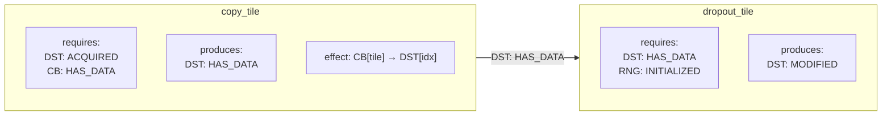
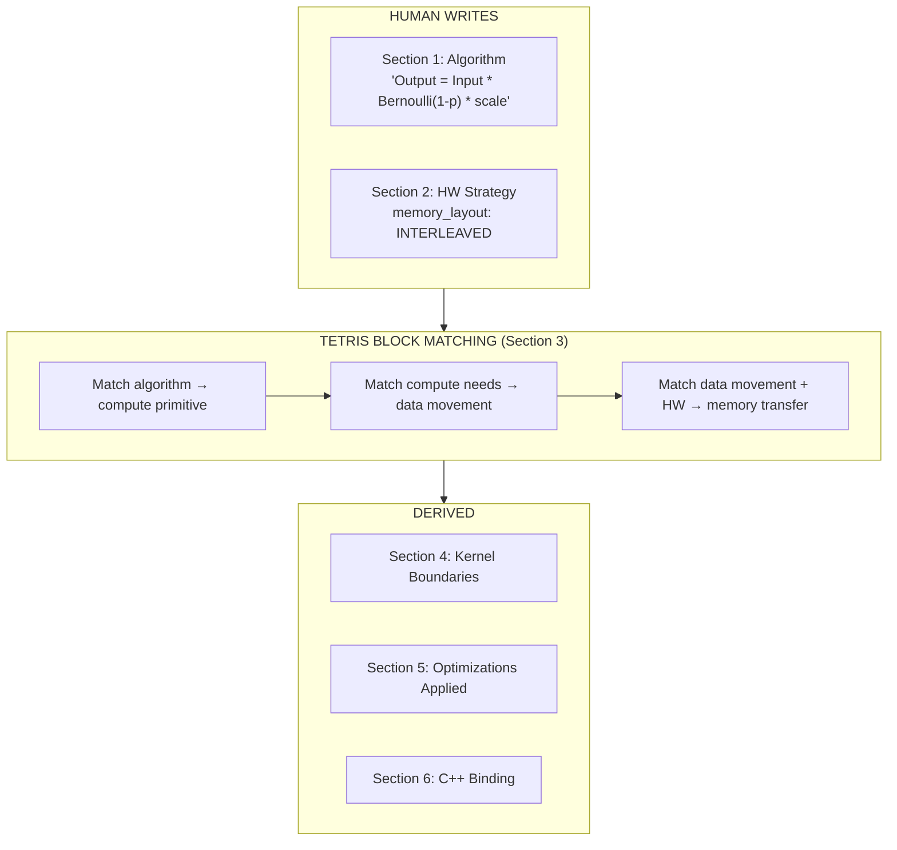
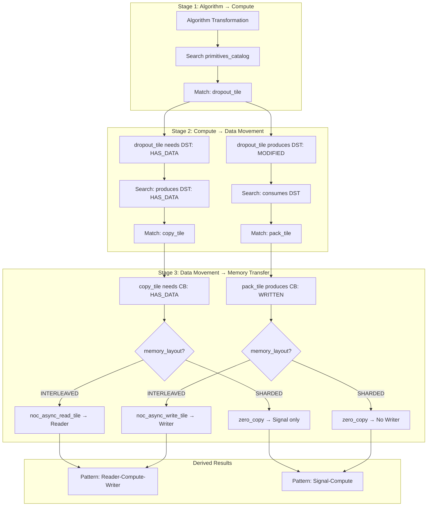
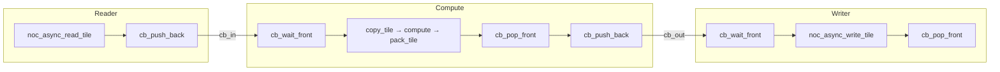
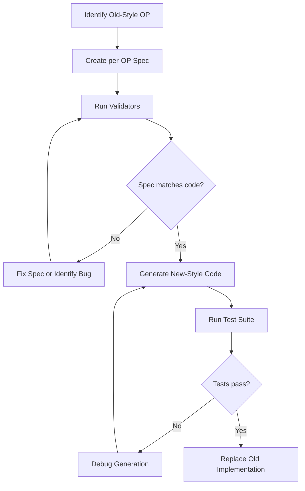

# Specification Architecture Vision

## Goal

Clean, precise specifications that are:
- Human-readable for developers
- Machine-readable for validators and future code generators
- Self-consistent through constraint derivation

**Principle**: Derive constraints, don't duplicate them.

---

## Tetris Block Model

Each LLK primitive is a "block" with typed ports. Blocks connect when their state requirements are satisfied.



**Connection rules**:
1. CB bindings match (src_cb bound to valid CB index)
2. State requirements satisfied (`DST_ACQUIRED` before `copy_tile`)
3. Data flow is coherent (CB has data before reading)

---

## Derivation Pipeline

**Core innovation**: Minimal human input → derived full implementation via Tetris block matching.



---

## What's Derived vs. What's Specified

| Item | Source | Reasoning |
|------|--------|-----------|
| `copy_tile` | DERIVED | `dropout_tile` requires `DST_HAS_DATA` → needs CB→DST move |
| `pack_tile` | DERIVED | Output pattern requires DST→CB move |
| `init_sfpu` | DERIVED | `dropout_kernel_init` requires `SFPU_INITIALIZED` |
| `tile_regs_acquire/commit/wait/release` | DERIVED | DST state machine for pattern |
| `cb_wait_front/pop_front` | DERIVED | CB consumer pattern |
| `cb_reserve_back/push_back` | DERIVED | CB producer pattern |
| `dropout_tile` | SPECIFIED | Core compute primitive (human selection) |
| `memory_layout: INTERLEAVED` | SPECIFIED | HW constraint (human decision) |

---

## Per-OP Specification Sections

| Section | Tag | Purpose |
|---------|-----|---------|
| **Section 1: Algorithm** | [HUMAN] | Pure mathematical transformation, preconditions, postconditions |
| **Section 2: HW Strategy** | [HUMAN] | Memory layout, sharding, layout constraints |
| **Section 3: LLK Selection** | [DERIVED] | Tetris block matching: find LLK primitive path from input to output |
| **Section 4: Kernel Boundaries** | [DERIVED] | Split primitives into kernels at CB sync points (`cb_push_back` → `cb_wait_front`) |
| **Section 5: Optimizations Applied** | - | Only applied optimizations with before/after diagrams |
| **Section 6: C++ Binding** | - | ER diagram of types, compile-time/runtime args with transformations |

**Section isolation principle**: Each section contains ONLY information relevant to its purpose. No forward references.

---

## LLK Selection: Graph Search

Section 3 treats primitive selection as a **graph search problem**:



**Key principle**: All LLK primitives are equal graph nodes. No distinction between "compute" and "data movement".

---

## Kernel Boundaries

Kernel boundaries occur at `cb_push_back` → `cb_wait_front` transitions:



---

## Architecture Patterns

| Pattern | Kernels | When | Example OPs |
|---------|---------|------|-------------|
| **Reader-Compute-Writer** | Reader, Compute, Writer | INTERLEAVED, input/output in DRAM | dropout, eltwise ops |
| **Signal-Compute-Writer** | Signal, Compute, Writer | Input sharded (zero-copy), output in DRAM | convert_to_chw |
| **ReaderCompute-Writer** | Compute, Writer (does reads) | Writers perform DRAM reads | convert_to_hwc |
| **Signal-Compute-Signal** | Signal, Compute, Signal | Both input and output sharded | in-place sharded ops |

---

## Compile-time vs Runtime Args

| Candidate | Typical Classification |
|-----------|----------------------|
| CB indices | compile-time (always known) |
| Data format | compile-time (usually known) |
| Block dimensions | compile-time (often fixed) |
| Probability/scale after conversion | compile-time (if constant) |
| Tensor addresses | runtime (per-core specific) |
| Start tile indices | runtime (per-core specific) |
| Seeds that vary per call | runtime |
| Dynamic dimensions | runtime |

---

## Parameter Transformations

| Transform | Description | Example |
|-----------|-------------|---------|
| `IDENTITY` | Pass through unchanged | `seed` |
| `INT_SCALE` | Scale float to integer | `(uint32_t)(prob * INT_MAX)` |
| `BIT_CAST` | Reinterpret bits | `std::bit_cast<uint32_t>(scale)` |
| `TILE_COUNT` | Convert to tile count | `div_up(value, TILE_HW)` |

---

## Key Design Decisions

1. **Minimal human input, maximum derivation**
   - Human specifies: algorithm, HW constraints
   - System derives: init sequence, loop body, data movement

2. **Derive, don't duplicate**
   - If X requires Y, express it once in primitive catalog
   - Don't manually list `copy_tile` in every eltwise_unary op

3. **States are explicit vocabulary**
   - `DST_ACQUIRED`, `SFPU_INITIALIZED`, `CB_HAS_DATA`
   - Forms a shared language between specs and validators

4. **Patterns are first-class**
   - `Reader-Compute-Writer`, `Signal-Compute-Writer` are named patterns
   - Each pattern has known kernel boundaries

5. **Validation before generation**
   - Prove the spec system works on existing code first
   - Generation comes after validation is solid

---

## File Organization

```
_dev_TODO.now/
├── Idea.md                          # This document (vision and principles)
│
├── # GLOBAL CONCEPTS
├── Global_Architecture.md           # HW overview, memory hierarchy
├── Global_Structural.md             # YAML schema reference
├── Common_Optimizations.md          # Optimization patterns (OPT_BLOCK_CB, OPT_DST_BATCH)
│
├── # LLK PRIMITIVES (Tetris blocks)
├── LLK/
│   ├── primitives_catalog.md        # All primitives with requires/produces states
│   ├── dropout_tile.md
│   ├── copy_tile.md
│   ├── pack_tile.md
│   └── ...
│
├── # PER-OP SPECIFICATIONS
└── per-OP/
    ├── dropout.md                   # Example: INTERLEAVED, Reader-Compute-Writer
    ├── convert_to_chw.md            # Example: Sharded, Signal-Compute-Writer
    └── convert_to_hwc.md            # Example: ReaderCompute-Writer pattern
```

---

## New-OP Analysis Workflow

```mermaid
flowchart LR
    subgraph PHASE1["Phase 1: Analysis"]
        A1["Existing OP"] --> A2["Extract Algorithm"]
        A2 --> A3["Identify HW Constraints"]
        A3 --> A4["Find Compute Primitives"]
    end

    subgraph PHASE2["Phase 2: Specification"]
        A4 --> B1["Write Sections 1-2"]
        B1 --> B2["Run Tetris Matching (Section 3)"]
        B2 --> B3["Derive Kernel Boundaries (Section 4)"]
        B3 --> B4["Document Optimizations (Section 5)"]
    end

    subgraph PHASE3["Phase 3: Validation"]
        B4 --> C1["Compare derived vs actual"]
        C1 --> C2["Validate CB allocation"]
        C2 --> C3["Verify init sequence"]
    end
```



For detailed analysis steps, see `.cursor/commands/tetris/analyze-golden-op.md`.

---

## Migration Path

Strategy for migrating existing OPs to new-style specifications:



**Reference**: See `ttnn/cursor/DEVICE_OPERATION_MIGRATION_GUIDE.md` for C++ interface migration.

---

## Related Documents

| Document | Purpose |
|----------|---------|
| `Global_Architecture.md` | HW overview, memory hierarchy, work distribution |
| `Global_Structural.md` | YAML schema reference for specifications |
| `Common_Optimizations.md` | Reusable optimization patterns |
| `LLK/primitives_catalog.md` | All LLK primitives with state contracts |
| `.cursor/commands/tetris/analyze-golden-op.md` | Step-by-step OP analysis guide |
