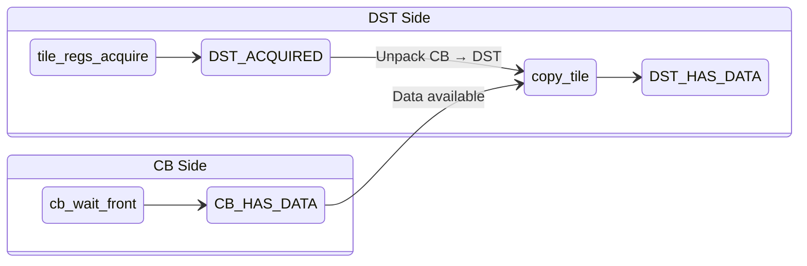

# LLK Primitive: copy_tile

Data movement primitive that unpacks a tile from Circular Buffer to DST register.

---

## Overview

```yaml
primitive:
  id: copy_tile
  category: data_movement
  header: "compute_kernel_api/tile_move_copy.h"
```

**Mathematical Effect**:
```
DST[dst_tile_index] = CB[in_cb_id][in_tile_index]
```

This is the fundamental unpack operation that moves tile data from a Circular Buffer into the DST register file where compute operations can be performed.

---

## Signature

```cpp
// Header: compute_kernel_api/tile_move_copy.h
namespace ckernel {

void copy_tile(uint32_t in_cb_id, uint32_t in_tile_index, uint32_t dst_tile_index);

void copy_tile_init(uint32_t cbid);  // Optional short init

}
```

### Parameters

| Parameter | Type | Description | Valid Range |
|-----------|------|-------------|-------------|
| `in_cb_id` | `uint32_t` | Source Circular Buffer index | 0-31 |
| `in_tile_index` | `uint32_t` | Tile index within CB's visible section | 0 to n-1 (where n = tiles from cb_wait_front) |
| `dst_tile_index` | `uint32_t` | Destination slot in DST register | 0-15 (typically 0-7 in practice) |

---

## Data Flow Effect

```yaml
data_flow:
  operation: "Unpack tile from Circular Buffer to DST register"

  inputs:
    - port: in_cb_id
      type: CB
      state: HAS_DATA
      format: "Circular Buffer containing tiles"

    - port: in_tile_index
      type: uint32_t
      desc: "Index into CB's visible tile section"

  outputs:
    - port: dst
      type: DST
      slot: dst_tile_index
      format: "32x32 tile unpacked to DST register"
      state: HAS_DATA

  effect: |
    # Unpack involves:
    # 1. Reading packed tile data from CB at L1 address
    # 2. Unpacking to internal representation in DST register
    # 3. DST[dst_tile_index] now contains tile data ready for compute
```

### Tile Indexing

```
CB visible section after cb_wait_front(cb, n):
┌───────────────────────────────────┐
│ tile[0] │ tile[1] │ ... │ tile[n-1] │
└───────────────────────────────────┘
     ▲
     └── in_tile_index references this section (FIFO order)

DST register file:
┌───────────────────────────────────────────────────┐
│ DST[0] │ DST[1] │ DST[2] │ ... │ DST[7] │ ... │ DST[15] │
└───────────────────────────────────────────────────┘
     ▲
     └── dst_tile_index writes here
```

---

## State Machine Requirements

### Required States Before Call

```yaml
requires:
  - DST_ACQUIRED    # From tile_regs_acquire()
  - CB_HAS_DATA     # From cb_wait_front()
```

### Produced States After Call

```yaml
produces:
  - DST_HAS_DATA    # DST contains unpacked tile data
```

### State Transition Diagram



---

## Initialization

### Init Function (Optional)

```yaml
init_function:
  name: copy_tile_init
  signature: "void copy_tile_init(uint32_t cbid)"
  required: false
  notes: |
    copy_tile does not require explicit init in most cases.
    Other op-specific init functions (init_sfpu, reduce_init, etc.)
    configure the unpack path as part of their setup.

    Use copy_tile_init only when:
    - copy_tile is the primary operation (no subsequent SFPU op)
    - Switching input CB and need to reconfigure unpack format
```

### Typical Usage Context

```cpp
// copy_tile is usually preceded by an op-specific init
init_sfpu(cb_in, cb_out);  // This configures unpack for cb_in

// Then used in the loop
copy_tile(cb_in, 0, 0);    // No separate copy_tile_init needed
```

---

## Parameter Transformations

### No Transformations Required

```yaml
transformations:
  - name: cb_index
    pattern: IDENTITY
    from: { name: cb_id, type: uint32_t }
    to: { name: in_cb_id, type: uint32_t }
    notes: "CB indices are direct hardware indices (0-31)"

  - name: tile_index
    pattern: IDENTITY
    from: { name: tile_offset, type: uint32_t }
    to: { name: in_tile_index, type: uint32_t }
    notes: "Tile index within CB's visible section (0-based)"

  - name: dst_slot
    pattern: IDENTITY
    from: { name: dst_idx, type: uint32_t }
    to: { name: dst_tile_index, type: uint32_t }
    notes: "DST slot (0-7 for most operations, up to 15 in full-sync)"
```

---

## Usage Patterns

### Pattern 1: Single Tile Processing (Eltwise Unary)

```cpp
// Process one tile at a time
for (uint32_t tile = 0; tile < num_tiles; ++tile) {
    tile_regs_acquire();

    cb_wait_front(cb_in, 1);
    copy_tile(cb_in, 0, 0);       // Always tile[0] from visible section

    // ... compute on DST[0] ...

    tile_regs_commit();
    cb_pop_front(cb_in, 1);       // Pop after commit (or before)

    tile_regs_wait();
    pack_tile(0, cb_out);
    tile_regs_release();
}
```

### Pattern 2: Batched Tile Processing

```cpp
constexpr uint32_t BATCH_SIZE = 8;

// Wait for multiple tiles
cb_wait_front(cb_in, BATCH_SIZE);
tile_regs_acquire();

// Copy batch to different DST slots
for (uint32_t i = 0; i < BATCH_SIZE; ++i) {
    copy_tile(cb_in, i, i);  // CB[i] → DST[i]
}

// ... compute on DST[0..7] ...

tile_regs_commit();
cb_pop_front(cb_in, BATCH_SIZE);
tile_regs_wait();

// Pack all tiles
for (uint32_t i = 0; i < BATCH_SIZE; ++i) {
    pack_tile(i, cb_out);
}

tile_regs_release();
```

### Pattern 3: Binary Operation (Two Inputs)

```cpp
// Wait for both inputs
cb_wait_front(cb_in0, 1);
cb_wait_front(cb_in1, 1);

tile_regs_acquire();

copy_tile(cb_in0, 0, 0);  // Input A → DST[0]
copy_tile(cb_in1, 0, 1);  // Input B → DST[1]

// Binary op: DST[0] = DST[0] OP DST[1]
add_tiles(0, 1);  // or mul_tiles, etc.

tile_regs_commit();
cb_pop_front(cb_in0, 1);
cb_pop_front(cb_in1, 1);

tile_regs_wait();
pack_tile(0, cb_out);
tile_regs_release();
```

---

## Invariants

```yaml
invariants:
  - id: C1
    rule: "CB must have data before copy"
    description: "cb_wait_front must be called with n >= in_tile_index + 1"
    implication: "Attempting to copy non-visible tile causes undefined behavior"

  - id: C2
    rule: "DST must be acquired before copy"
    description: "tile_regs_acquire must precede copy_tile"
    implication: "DST state transitions require proper lifecycle"

  - id: C3
    rule: "CB data remains valid until pop"
    description: "Multiple copy_tile calls can read same CB tile"
    implication: "cb_pop_front invalidates tiles, not copy_tile"

  - id: C4
    rule: "DST slot overwritten"
    description: "copy_tile completely overwrites dst_tile_index"
    implication: "Previous DST content at that slot is lost"
```

---

## Preconditions

```yaml
preconditions:
  - id: P1
    check: "in_cb_id in [0, 31]"
    reason: "Hardware supports 32 circular buffers"

  - id: P2
    check: "in_tile_index < n (from cb_wait_front(cb, n))"
    reason: "Can only access visible tiles in CB"

  - id: P3
    check: "dst_tile_index < 16 (or < 8 for half-sync)"
    reason: "DST register capacity depends on sync mode"

  - id: P4
    check: "tile_regs_acquire() was called"
    reason: "DST must be in ACQUIRED state"

  - id: P5
    check: "CB was pushed by producer (Reader kernel)"
    reason: "Data must be present in CB"
```

---

## Performance Notes

```yaml
performance:
  - note: "copy_tile is a blocking call"
    implication: "Waits for unpack hardware to complete"

  - note: "Unpack and compute can be overlapped"
    implication: "Use multiple DST slots to hide unpack latency"

  - note: "CB tile access is sequential"
    implication: "in_tile_index 0,1,2,... for streaming patterns"
```

---

## Related Primitives

| Primitive | Relationship |
|-----------|--------------|
| `cb_wait_front` | Provides CB_HAS_DATA state |
| `tile_regs_acquire` | Provides DST_ACQUIRED state |
| `pack_tile` | Inverse operation (DST → CB) |
| `transpose_wh_tile` | Alternative that transposes during copy |
| `copy_tile_init` | Optional init for standalone use |

---

## Contrast with transpose_wh_tile

| Aspect | copy_tile | transpose_wh_tile |
|--------|-----------|-------------------|
| Operation | Direct copy | Copy + 32x32 transpose |
| Output format | Same as input | Width/Height swapped |
| Init required | Usually none | transpose_wh_init |
| Typical use | Most SFPU ops | CHW↔HWC conversion |
