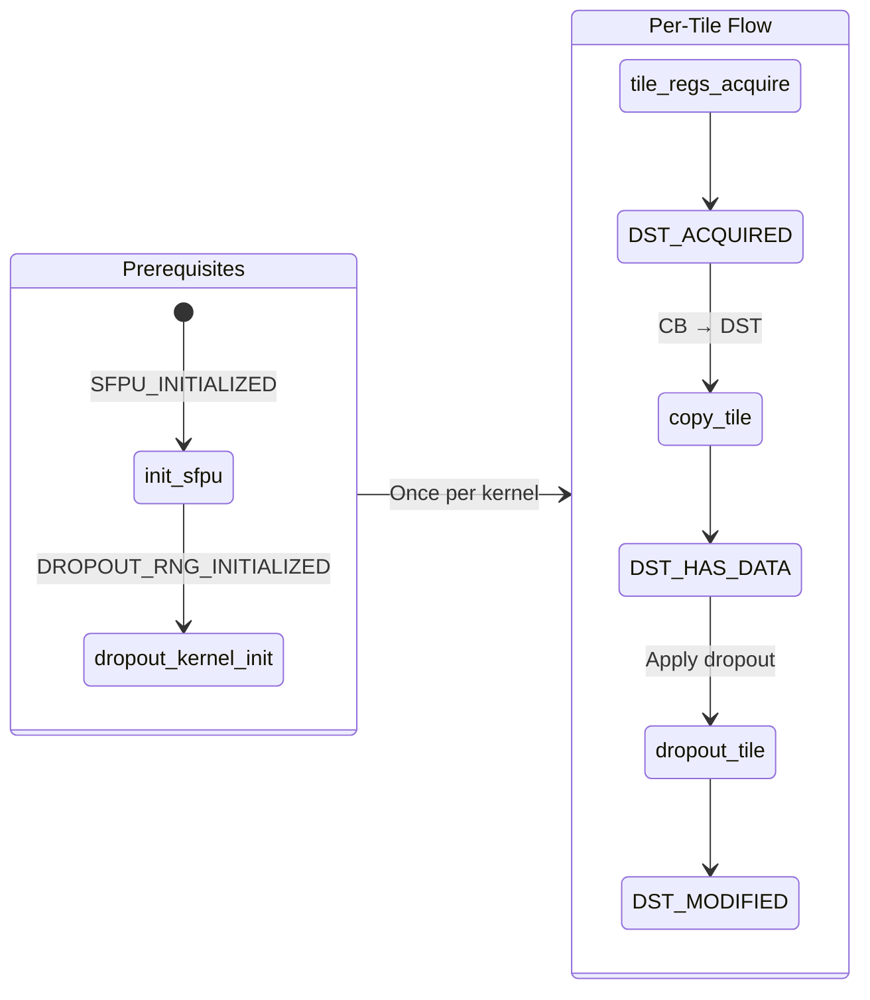

# LLK Primitive: dropout_tile

Element-wise dropout operation with Bernoulli masking and scaling.

---

## Overview

```yaml
primitive:
  id: dropout_tile
  category: sfpu_compute
  header: "compute_kernel_api/eltwise_unary/dropout.h"
```

**Mathematical Effect**:
```
Output[i] = Input[i] * Bernoulli(1 - probability) * scale_factor
```

Where:
- `Bernoulli(1-p)` generates 0 with probability `p`, 1 with probability `1-p`
- Elements are zeroed out independently
- Non-zeroed elements are scaled by `scale_factor`

---

## Signature

```cpp
// Header: compute_kernel_api/eltwise_unary/dropout.h
namespace ckernel {

void dropout_tile(uint32_t idst, uint32_t probability, uint32_t scale_factor);

void dropout_kernel_init(uint32_t seed);  // Required init

}
```

### Parameters

| Parameter | Type | Description | Valid Range |
|-----------|------|-------------|-------------|
| `idst` | `uint32_t` | DST register slot index | 0-7 |
| `probability` | `uint32_t` | Drop probability (integer-scaled) | 0 to INT_MAX |
| `scale_factor` | `uint32_t` | Scale factor (bit-cast float) | Any uint32 |

---

## Data Flow Effect

```yaml
data_flow:
  operation: "Element-wise dropout with masking and scaling"

  inputs:
    - port: dst
      type: DST
      slot: idst
      format: "32x32 tile of float values"
      state: HAS_DATA

  outputs:
    - port: dst
      type: DST
      slot: idst
      format: "32x32 tile of masked/scaled values"
      state: MODIFIED

  effect: |
    for each element e in DST[idst]:
        mask = (random() < (1 - probability)) ? 1 : 0
        e = e * mask * scale_factor
```

---

## State Machine Requirements

### Required States Before Call

```yaml
requires:
  - DST_ACQUIRED      # From tile_regs_acquire()
  - DST_HAS_DATA      # From copy_tile()
  - DROPOUT_RNG_INITIALIZED  # From dropout_kernel_init()
```

### Produced States After Call

```yaml
produces:
  - DST_MODIFIED      # DST contains computed results
```

### State Transition Diagram



---

## Initialization Sequence

### Init Dependency Chain

```yaml
init_chain:
  - function: init_sfpu
    args: [cb_in, cb_out]
    requires: []
    produces: [SFPU_INITIALIZED]
    call_once: true

  - function: dropout_kernel_init
    args: [seed]
    requires: [SFPU_INITIALIZED]
    produces: [DROPOUT_RNG_INITIALIZED]
    call_once: true
    notes: "Seeds the RNG. Same seed = deterministic dropout masks."
```

### Derived Init Sequence

```cpp
// Complete init sequence for dropout
void init_dropout(uint32_t cb_in, uint32_t cb_out, uint32_t seed) {
    init_sfpu(cb_in, cb_out);        // Step 1: SFPU setup
    dropout_kernel_init(seed);        // Step 2: RNG setup
}
```

---

## Parameter Transformations

### Probability Conversion

```yaml
transformation:
  name: probability_to_int
  pattern: INT_SCALE

  from:
    name: prob
    type: float
    range: "[0.0, 1.0)"
    semantic: "Probability of dropping each element"

  to:
    name: probability
    type: uint32_t
    range: "[0, INT_MAX]"

  expression: "(uint32_t)(prob * (double)INT_MAX)"

  examples:
    - { input: 0.0, output: 0, meaning: "Never drop" }
    - { input: 0.5, output: 1073741823, meaning: "50% drop rate" }
    - { input: 0.9, output: 1932735282, meaning: "90% drop rate" }

  cpp_implementation: |
    uint32_t probability_int = static_cast<uint32_t>(
        prob * static_cast<double>(std::numeric_limits<int32_t>::max())
    );
```

### Scale Factor Conversion

```yaml
transformation:
  name: scale_to_bits
  pattern: BIT_CAST

  from:
    name: scale
    type: float
    range: "> 0"
    semantic: "Scaling factor for non-dropped elements"
    typical_value: "1.0 / (1.0 - prob)"  # Standard dropout scaling

  to:
    name: scale_factor
    type: uint32_t

  expression: "std::bit_cast<uint32_t>(scale)"

  notes: |
    The scale factor is typically 1/(1-p) for standard dropout,
    which compensates for the reduced expected value during training.

  cpp_implementation: |
    float scale = 1.0f / (1.0f - prob);
    uint32_t scale_bits = std::bit_cast<uint32_t>(scale);
```

### Complete Transformation Example

```cpp
// Algorithm parameters
float prob = 0.3f;  // 30% dropout probability

// Transform to LLK parameters
uint32_t probability_int = static_cast<uint32_t>(prob * INT_MAX);
float scale = 1.0f / (1.0f - prob);  // = 1.428...
uint32_t scale_bits = std::bit_cast<uint32_t>(scale);

// Call primitive
dropout_tile(dst_idx, probability_int, scale_bits);
```

---

## Usage Pattern

### Eltwise Unary Pattern

```cpp
void compute_main() {
    constexpr uint32_t cb_in = 0;   // c_0
    constexpr uint32_t cb_out = 2;  // c_2

    // Get compile-time args
    uint32_t per_core_block_cnt = get_compile_time_arg_val(0);
    uint32_t per_core_block_dim = get_compile_time_arg_val(1);
    uint32_t probability_int = get_compile_time_arg_val(2);
    uint32_t scale_bits = get_compile_time_arg_val(3);

    // Get runtime args
    uint32_t seed = get_arg_val<uint32_t>(0);

    // Initialize (once per kernel)
    init_sfpu(cb_in, cb_out);
    dropout_kernel_init(seed);

    // Process tiles
    for (uint32_t block = 0; block < per_core_block_cnt; ++block) {
        cb_reserve_back(cb_out, per_core_block_dim);

        for (uint32_t tile = 0; tile < per_core_block_dim; ++tile) {
            // DST lifecycle
            tile_regs_acquire();

            cb_wait_front(cb_in, 1);
            copy_tile(cb_in, 0, 0);           // CB → DST[0]

            dropout_tile(0, probability_int, scale_bits);  // Compute

            tile_regs_commit();
            tile_regs_wait();

            pack_tile(0, cb_out);             // DST[0] → CB

            cb_pop_front(cb_in, 1);
            tile_regs_release();
        }

        cb_push_back(cb_out, per_core_block_dim);
    }
}
```

---

## Invariants

```yaml
invariants:
  - id: D1
    rule: "Deterministic with fixed seed"
    description: "Same seed + same input = same output"
    implication: "RNG state advances deterministically per tile"

  - id: D2
    rule: "Element independence"
    description: "Each element's mask is independent Bernoulli"
    implication: "No correlation between masked elements"

  - id: D3
    rule: "In-place operation"
    description: "dropout_tile modifies DST[idst] in-place"
    implication: "No additional DST slots needed"

  - id: D4
    rule: "Scale applied after mask"
    description: "output = input * mask * scale (not input * scale * mask)"
    implication: "Zeroed elements remain zero regardless of scale"
```

---

## Preconditions

```yaml
preconditions:
  - id: P1
    check: "idst <= 7"
    reason: "DST has 8 register slots (0-7)"

  - id: P2
    check: "init_sfpu() called before dropout_kernel_init()"
    reason: "SFPU must be configured first"

  - id: P3
    check: "dropout_kernel_init() called before dropout_tile()"
    reason: "RNG must be seeded"

  - id: P4
    check: "tile_regs_acquire() called before dropout_tile()"
    reason: "DST must be acquired"

  - id: P5
    check: "copy_tile() called before dropout_tile()"
    reason: "DST must contain data to operate on"
```

---

## Related Primitives

| Primitive | Relationship |
|-----------|--------------|
| `init_sfpu` | Required first init |
| `dropout_kernel_init` | Required second init (seeds RNG) |
| `copy_tile` | Provides DST_HAS_DATA |
| `pack_tile` | Outputs result from DST |
| `relu_tile` | Similar pattern (SFPU unary op) |
