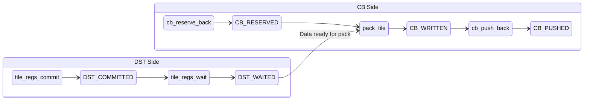

# LLK Primitive: pack_tile

Data movement primitive that packs a tile from DST register to Circular Buffer.

---

## Overview

```yaml
primitive:
  id: pack_tile
  category: data_movement
  header: "compute_kernel_api/pack.h"
```

**Mathematical Effect**:
```
CB[icb][output_tile_index] = DST[ifrom_dst]
```

This is the fundamental pack operation that moves computed tile data from the DST register file back to a Circular Buffer for consumption by the Writer kernel or subsequent compute stages.

---

## Signature

```cpp
// Header: compute_kernel_api/pack.h
namespace ckernel {

template <bool out_of_order_output = false>
void pack_tile(uint32_t ifrom_dst, uint32_t icb, uint32_t output_tile_index = 0);

void pack_tile_block(uint32_t ifrom_dst, uint32_t icb, uint32_t ntiles);

}
```

### Parameters

| Parameter | Type | Description | Valid Range |
|-----------|------|-------------|-------------|
| `ifrom_dst` | `uint32_t` | Source slot in DST register | 0-15 (typically 0-7) |
| `icb` | `uint32_t` | Destination Circular Buffer index | 0-31 |
| `output_tile_index` | `uint32_t` | Tile index within reserved CB space (optional) | 0 to n-1 |

### Template Parameters

| Parameter | Type | Default | Description |
|-----------|------|---------|-------------|
| `out_of_order_output` | `bool` | `false` | If true, use explicit output_tile_index; if false, sequential writes |

---

## Data Flow Effect

```yaml
data_flow:
  operation: "Pack tile from DST register to Circular Buffer"

  inputs:
    - port: ifrom_dst
      type: DST
      slot: ifrom_dst
      state: WAITED
      format: "32x32 tile in DST register"

    - port: icb
      type: CB
      state: RESERVED
      desc: "Circular Buffer with reserved space"

  outputs:
    - port: cb
      type: CB
      slot: output_tile_index
      state: WRITTEN
      format: "32x32 tile packed to CB"

  effect: |
    # Pack involves:
    # 1. Reading tile data from DST register
    # 2. Converting to CB storage format
    # 3. Writing to CB at reserved location
    # 4. Advancing internal write pointer (if out_of_order_output=false)
```

### Sequential vs Out-of-Order

```
Sequential mode (default, out_of_order_output=false):
┌─────────────────────────────────────────────────────┐
│ Reserved CB space after cb_reserve_back(cb, n)      │
├─────────────────────────────────────────────────────┤
│ [write_ptr→] │ slot 1 │ slot 2 │ ... │ slot n-1    │
└─────────────────────────────────────────────────────┘
Each pack_tile advances write_ptr automatically.
output_tile_index parameter is ignored.

Out-of-order mode (out_of_order_output=true):
┌─────────────────────────────────────────────────────┐
│ Reserved CB space after cb_reserve_back(cb, n)      │
├─────────────────────────────────────────────────────┤
│ slot 0 │ slot 1 │ [user controls] │ ... │ slot n-1 │
└─────────────────────────────────────────────────────┘
User explicitly specifies output_tile_index for each write.
```

---

## State Machine Requirements

### Required States Before Call

```yaml
requires:
  - DST_WAITED     # From tile_regs_wait()
  - CB_RESERVED    # From cb_reserve_back()
```

### Produced States After Call

```yaml
produces:
  - CB_WRITTEN     # CB slot now contains packed data
```

### State Transition Diagram



---

## Initialization

### No Explicit Init Required

```yaml
initialization:
  required: false
  notes: |
    pack_tile does NOT require explicit initialization.

    The packer is configured by op-specific init functions:
    - init_sfpu() for eltwise unary operations
    - reduce_init() for reduction operations
    - tilize_init() for tilize operations
    - etc.

    These init functions configure PACK thread for the output CB format.
```

### Why No Separate Init?

```
┌─────────────────────────────────────────────────────────────────┐
│ MATH and PACK threads require explicit synchronization.        │
│                                                                 │
│ To ensure this:                                                 │
│ 1. Op-specific init (init_sfpu, etc.) configures PACK thread   │
│ 2. tile_regs_commit() signals MATH → PACK handoff              │
│ 3. tile_regs_wait() synchronizes PACK thread                   │
│ 4. pack_tile() executes on configured PACK thread              │
│                                                                 │
│ Separating pack_tile from its init ensures correct sync.       │
└─────────────────────────────────────────────────────────────────┘
```

---

## Parameter Transformations

### No Transformations Required

```yaml
transformations:
  - name: dst_slot
    pattern: IDENTITY
    from: { name: dst_idx, type: uint32_t }
    to: { name: ifrom_dst, type: uint32_t }
    notes: "DST slot index is direct (0-15)"

  - name: cb_index
    pattern: IDENTITY
    from: { name: cb_id, type: uint32_t }
    to: { name: icb, type: uint32_t }
    notes: "CB indices are direct hardware indices (0-31)"
```

---

## Usage Patterns

### Pattern 1: Single Tile Processing (Eltwise Unary)

```cpp
// Standard per-tile loop
for (uint32_t tile = 0; tile < num_tiles; ++tile) {
    tile_regs_acquire();

    cb_wait_front(cb_in, 1);
    copy_tile(cb_in, 0, 0);

    // ... compute on DST[0] ...
    dropout_tile(0, prob_int, scale_bits);

    tile_regs_commit();
    tile_regs_wait();

    // Pack single tile
    pack_tile(0, cb_out);  // DST[0] → CB sequential slot

    cb_pop_front(cb_in, 1);
    tile_regs_release();
}
```

### Pattern 2: Block-Level CB Reservation

```cpp
// Reserve/push at block level for better efficiency
for (uint32_t block = 0; block < num_blocks; ++block) {
    cb_reserve_back(cb_out, block_size);  // Reserve block_size tiles

    for (uint32_t tile = 0; tile < block_size; ++tile) {
        tile_regs_acquire();
        cb_wait_front(cb_in, 1);
        copy_tile(cb_in, 0, 0);

        // ... compute ...

        tile_regs_commit();
        tile_regs_wait();

        pack_tile(0, cb_out);  // Sequential within block

        cb_pop_front(cb_in, 1);
        tile_regs_release();
    }

    cb_push_back(cb_out, block_size);  // Push entire block
}
```

### Pattern 3: Batched DST Processing

```cpp
constexpr uint32_t BATCH_SIZE = 8;

cb_reserve_back(cb_out, BATCH_SIZE);
tile_regs_acquire();

// Compute batch in DST
for (uint32_t i = 0; i < BATCH_SIZE; ++i) {
    cb_wait_front(cb_in, 1);
    copy_tile(cb_in, 0, i);  // CB → DST[i]
    // ... compute on DST[i] ...
    cb_pop_front(cb_in, 1);
}

tile_regs_commit();
tile_regs_wait();

// Pack entire batch
for (uint32_t i = 0; i < BATCH_SIZE; ++i) {
    pack_tile(i, cb_out);  // DST[i] → CB
}

tile_regs_release();
cb_push_back(cb_out, BATCH_SIZE);
```

### Pattern 4: Out-of-Order Output

```cpp
// When output order differs from compute order
cb_reserve_back(cb_out, num_tiles);
tile_regs_acquire();

// Compute and pack in custom order
pack_tile<true>(0, cb_out, 5);  // DST[0] → CB slot 5
pack_tile<true>(1, cb_out, 2);  // DST[1] → CB slot 2
pack_tile<true>(2, cb_out, 7);  // DST[2] → CB slot 7

tile_regs_release();
cb_push_back(cb_out, num_tiles);
```

---

## Invariants

```yaml
invariants:
  - id: PK1
    rule: "CB must have reserved space"
    description: "cb_reserve_back must be called before pack_tile"
    implication: "Pack without reserve causes undefined behavior"

  - id: PK2
    rule: "DST must be in WAITED state"
    description: "tile_regs_wait must precede pack_tile"
    implication: "PACK thread waits for MATH commit signal"

  - id: PK3
    rule: "Sequential writes advance pointer"
    description: "Each pack_tile (out_of_order=false) increments internal pointer"
    implication: "Pointer resets after cb_reserve_back"

  - id: PK4
    rule: "Push count must match packed count"
    description: "cb_push_back(n) requires n tiles packed"
    implication: "Pushing more than packed exposes garbage data"
```

---

## Preconditions

```yaml
preconditions:
  - id: P1
    check: "ifrom_dst < 16 (or < 8 for half-sync)"
    reason: "DST register capacity limit"

  - id: P2
    check: "icb in [0, 31]"
    reason: "Hardware supports 32 circular buffers"

  - id: P3
    check: "cb_reserve_back() was called"
    reason: "CB must have reserved space"

  - id: P4
    check: "tile_regs_wait() was called"
    reason: "DST must be in WAITED state"

  - id: P5
    check: "output_tile_index < n (from cb_reserve_back(cb, n))"
    reason: "Can only write to reserved slots"
```

---

## Block Variant: pack_tile_block

```yaml
variant:
  name: pack_tile_block
  signature: "void pack_tile_block(uint32_t ifrom_dst, uint32_t icb, uint32_t ntiles)"

  description: |
    Packs multiple consecutive tiles from DST to CB in one call.
    More efficient than multiple pack_tile calls.

  parameters:
    - { name: ifrom_dst, desc: "Starting DST slot index" }
    - { name: icb, desc: "Destination CB index" }
    - { name: ntiles, desc: "Number of tiles to pack" }

  effect: |
    for i in 0..ntiles:
        CB[icb][i] = DST[ifrom_dst + i]

  use_case: "Matmul output, batched operations"
```

---

## Related Primitives

| Primitive | Relationship |
|-----------|--------------|
| `copy_tile` | Inverse operation (CB → DST) |
| `tile_regs_wait` | Provides DST_WAITED state |
| `cb_reserve_back` | Provides CB_RESERVED state |
| `cb_push_back` | Makes packed data visible |
| `pack_tile_block` | Block variant for multiple tiles |
| `pack_untilize_dest` | Alternative for row-major output |

---

## Contrast with pack_untilize_dest

| Aspect | pack_tile | pack_untilize_dest |
|--------|-----------|-------------------|
| Output format | Tile format (32x32) | Row-major format |
| Initialization | Via op-specific init | pack_untilize_dest_init |
| Cleanup required | No | pack_untilize_uninit |
| Typical use | Standard compute output | Layout conversion (CHW→HWC) |
| Template params | out_of_order_output | block_ct_dim, full_ct_dim |
