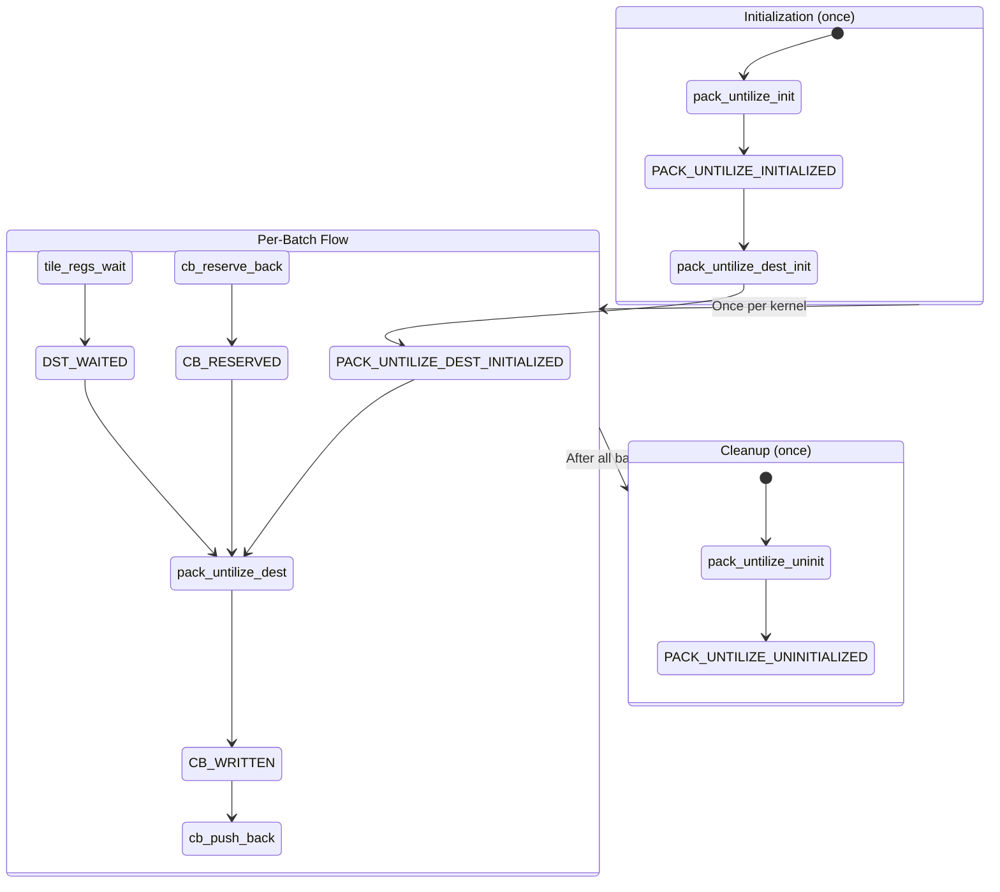

# LLK Primitive: pack_untilize_dest

Data movement primitive that packs tiles from DST to CB in row-major (untilized) format.

---

## Overview

```yaml
primitive:
  id: pack_untilize_dest
  category: data_movement
  header: "compute_kernel_api/pack_untilize.h"
```

**Mathematical Effect**:
```
CB[ocb] = untilize(DST[0..N])  # Convert tile format → row-major format
```

Converts tile-format data in DST registers to row-major format in the output Circular Buffer. This is the inverse of tilize operations and is commonly used for layout conversions (e.g., CHW to HWC).

---

## Signature

```cpp
// Header: compute_kernel_api/pack_untilize.h
namespace ckernel {

template <
    uint32_t block_ct_dim = 8,
    uint32_t full_ct_dim = block_ct_dim,
    bool diagonal = false,
    bool narrow_row = false,
    uint32_t row_num_datums = TILE_C_DIM,
    uint32_t tile_dst_ct_offset = 0
>
void pack_untilize_dest(
    uint32_t ocb,
    uint32_t block_rt_dim = 1,
    uint32_t block_c_index = 0,
    uint32_t face_r_dim = 16,
    uint32_t num_faces = 4,
    uint32_t tile_dst_rt_offset = 0
);

// Related functions
template <uint32_t block_ct_dim = 8, uint32_t full_ct_dim = block_ct_dim>
void pack_untilize_dest_init(uint32_t ocb, uint32_t face_r_dim = 16, uint32_t num_faces = 4);

template <uint32_t block_ct_dim = 8, uint32_t full_ct_dim = block_ct_dim>
void pack_untilize_init(uint32_t icb, uint32_t ocb);

void pack_untilize_uninit(uint32_t ocb);  // Required cleanup

}
```

### Template Parameters

| Parameter | Default | Description |
|-----------|---------|-------------|
| `block_ct_dim` | 8 | Width of a single block in tiles |
| `full_ct_dim` | block_ct_dim | Width of full input in tiles |
| `diagonal` | false | Whether to use diagonal packing |
| `narrow_row` | false | Whether input rows are narrow |
| `row_num_datums` | TILE_C_DIM (32) | Number of datums per row |
| `tile_dst_ct_offset` | 0 | Compile-time DST offset |

### Function Parameters

| Parameter | Type | Default | Description |
|-----------|------|---------|-------------|
| `ocb` | `uint32_t` | - | Output CB index (required) |
| `block_rt_dim` | `uint32_t` | 1 | Block height in tiles |
| `block_c_index` | `uint32_t` | 0 | Block column index |
| `face_r_dim` | `uint32_t` | 16 | Face height in rows |
| `num_faces` | `uint32_t` | 4 | Number of faces |
| `tile_dst_rt_offset` | `uint32_t` | 0 | Runtime DST offset |

---

## Data Flow Effect

```yaml
data_flow:
  operation: "Pack tiles from DST to CB with untilization"

  inputs:
    - port: dst
      type: DST
      slots: "0 to block_ct_dim-1"
      state: WAITED
      format: "Tiles in 32x32 tile format"

  outputs:
    - port: cb
      type: CB
      index: ocb
      state: WRITTEN
      format: "Row-major (untilized) data"

  effect: |
    # Untilize converts tile format to row-major:
    #
    # Tile format (32x32 with 4 faces):
    # ┌─────┬─────┐
    # │ F0  │ F1  │  16x16 each
    # ├─────┼─────┤
    # │ F2  │ F3  │
    # └─────┴─────┘
    #
    # Row-major format:
    # Row 0:  [elem0, elem1, ..., elem31]
    # Row 1:  [elem0, elem1, ..., elem31]
    # ...
    # Row 31: [elem0, elem1, ..., elem31]
```

---

## State Machine Requirements

### Required States Before Call

```yaml
requires:
  - DST_WAITED                      # From tile_regs_wait()
  - CB_RESERVED                     # From cb_reserve_back()
  - PACK_UNTILIZE_DEST_INITIALIZED  # From pack_untilize_dest_init()
```

### Produced States After Call

```yaml
produces:
  - CB_WRITTEN     # CB contains untilized data
```

### State Transition Diagram



---

## Initialization Chain

### Complete Init Sequence

```yaml
init_chain:
  - function: pack_untilize_init
    template_args: [block_ct_dim, full_ct_dim]
    args: [icb, ocb]
    requires: []
    produces: [PACK_UNTILIZE_INITIALIZED]
    notes: |
      Full initialization for untilize when data not yet in DEST.
      Configures UNPACK, MATH, and PACK threads.

  - function: pack_untilize_dest_init
    template_args: [block_ct_dim, full_ct_dim]
    args: [ocb, face_r_dim, num_faces]
    requires: [PACK_UNTILIZE_INITIALIZED]
    produces: [PACK_UNTILIZE_DEST_INITIALIZED]
    notes: |
      Initialization when data already in DEST.
      Configures PACK thread for untilize output format.
```

### Init for Transpose + Untilize Pattern

```cpp
// When using with transpose_wh_tile (e.g., convert_to_chw)
void init_transpose_untilize(uint32_t cb_in, uint32_t cb_out) {
    // Step 1: Base untilize init
    pack_untilize_init(cb_in, cb_out);

    // Step 2: Transpose init (can override some settings)
    transpose_wh_init(cb_in, cb_out);

    // Step 3: Dest init with single-tile granularity
    pack_untilize_dest_init<1>(cb_out);
}
```

---

## Required Cleanup

### pack_untilize_uninit

```yaml
cleanup:
  function: pack_untilize_uninit
  signature: "void pack_untilize_uninit(uint32_t ocb)"

  required: true
  when: "After all pack_untilize_dest calls are complete"

  reason: |
    Untilize mode changes packer configuration.
    Must be uninitialized before other pack operations.

  produces: [PACK_UNTILIZE_UNINITIALIZED]

  notes: |
    This cleanup is flagged for removal by end of 2025 (tt-metal#22904).
    Currently required for correct operation.
```

### Cleanup Position in Kernel

```cpp
void compute_main() {
    // Init
    pack_untilize_init(cb_in, cb_out);
    pack_untilize_dest_init<1>(cb_out);

    // Main processing loop
    for (...) {
        // ... transpose + untilize ...
    }

    // Cleanup MUST be after all processing
    pack_untilize_uninit(cb_out);  // <-- Required!
}
```

---

## Parameter Transformations

### Template Parameter Selection

```yaml
transformations:
  - name: block_size_selection
    pattern: COMPILE_TIME_CONST
    from: { name: tiles_per_batch, type: uint32_t }
    to: { name: block_ct_dim, template_param: true }
    constraints:
      - max_half_sync_16bit: 8
      - max_half_sync_32bit: 4
      - max_full_sync_16bit: 16
      - max_full_sync_32bit: 8
    notes: |
      block_ct_dim is typically set to DST capacity divided by 2
      for ping-pong processing, or to 1 for simple loops.

  - name: tile_count
    pattern: IDENTITY
    from: { name: n_tiles, type: uint32_t }
    to: { name: block_rt_dim, type: uint32_t }
    notes: "Number of tile rows to untilize in this call"
```

---

## Usage Patterns

### Pattern 1: Simple Tile-by-Tile

```cpp
pack_untilize_init(cb_in, cb_out);
pack_untilize_dest_init<1>(cb_out);  // block_ct_dim = 1

for (uint32_t tile = 0; tile < num_tiles; ++tile) {
    cb_wait_front(cb_in, 1);
    tile_regs_acquire();

    copy_tile(cb_in, 0, 0);  // Or transpose_wh_tile

    tile_regs_commit();
    cb_pop_front(cb_in, 1);

    cb_reserve_back(cb_out, 1);
    tile_regs_wait();

    pack_untilize_dest<1>(cb_out, 1);  // Untilize 1 tile

    tile_regs_release();
    cb_push_back(cb_out, 1);
}

pack_untilize_uninit(cb_out);
```

### Pattern 2: Batched Processing

```cpp
constexpr uint32_t BATCH_SIZE = 8;

pack_untilize_init(cb_in, cb_out);
pack_untilize_dest_init<1>(cb_out);

uint32_t num_batches = num_tiles / BATCH_SIZE;
uint32_t leftover = num_tiles % BATCH_SIZE;

// Full batches
for (uint32_t batch = 0; batch < num_batches; ++batch) {
    cb_wait_front(cb_in, BATCH_SIZE);
    tile_regs_acquire();

    for (uint32_t i = 0; i < BATCH_SIZE; ++i) {
        transpose_wh_tile(cb_in, i, i);  // CB[i] → DST[i]
    }

    tile_regs_commit();
    cb_pop_front(cb_in, BATCH_SIZE);

    cb_reserve_back(cb_out, BATCH_SIZE);
    tile_regs_wait();

    // Untilize all 8 tiles at once
    pack_untilize_dest<1>(cb_out, BATCH_SIZE);

    tile_regs_release();
    cb_push_back(cb_out, BATCH_SIZE);
}

// Leftover tiles
for (uint32_t i = 0; i < leftover; ++i) {
    cb_wait_front(cb_in, 1);
    tile_regs_acquire();
    transpose_wh_tile(cb_in, 0, 0);
    tile_regs_commit();
    cb_pop_front(cb_in, 1);

    cb_reserve_back(cb_out, 1);
    tile_regs_wait();
    pack_untilize_dest<1>(cb_out, 1);
    tile_regs_release();
    cb_push_back(cb_out, 1);
}

pack_untilize_uninit(cb_out);
```

### Pattern 3: Template Helper Function

```cpp
template <uint32_t N>
FORCE_INLINE void process_batch(uint32_t cb_in, uint32_t cb_out) {
    cb_wait_front(cb_in, N);
    tile_regs_acquire();

    for (uint32_t i = 0; i < N; ++i) {
        transpose_wh_tile(cb_in, i, i);
    }

    tile_regs_commit();
    cb_pop_front(cb_in, N);

    cb_reserve_back(cb_out, N);
    tile_regs_wait();

    pack_untilize_dest<1>(cb_out, N);

    tile_regs_release();
    cb_push_back(cb_out, N);
}

void compute_main() {
    constexpr uint32_t BATCH = 8;

    pack_untilize_init(cb_in, cb_out);
    transpose_wh_init(cb_in, cb_out);
    pack_untilize_dest_init<1>(cb_out);

    for (uint32_t i = 0; i < num_batches; ++i) {
        process_batch<BATCH>(cb_in, cb_out);
    }

    for (uint32_t i = 0; i < leftover; ++i) {
        process_batch<1>(cb_in, cb_out);
    }

    pack_untilize_uninit(cb_out);
}
```

---

## Block Size Limits

```yaml
block_size_limits:
  description: |
    Maximum block size depends on sync mode and data format.

  limits:
    - mode: "Half-sync, 16-bit"
      max_tiles: 8
      reason: "DST capacity in half mode"

    - mode: "Half-sync, 32-bit (FP32)"
      max_tiles: 4
      reason: "32-bit tiles are 2x size"

    - mode: "Full-sync, 16-bit"
      max_tiles: 16
      reason: "Full DST available"

    - mode: "Full-sync, 32-bit (FP32)"
      max_tiles: 8
      reason: "32-bit tiles are 2x size"
```

---

## Invariants

```yaml
invariants:
  - id: U1
    rule: "Init before use"
    description: "pack_untilize_dest_init must precede pack_untilize_dest"
    implication: "Packer configured for untilize mode"

  - id: U2
    rule: "Cleanup after use"
    description: "pack_untilize_uninit must follow all pack_untilize_dest calls"
    implication: "Packer restored for other operations"

  - id: U3
    rule: "Template params at compile time"
    description: "block_ct_dim is template parameter, not runtime"
    implication: "Use <1> for variable batch sizes"

  - id: U4
    rule: "DST capacity limit"
    description: "block_rt_dim * block_ct_dim <= DST capacity"
    implication: "Maximum depends on sync mode and data format"
```

---

## Preconditions

```yaml
preconditions:
  - id: P1
    check: "pack_untilize_init() called"
    reason: "Base untilize initialization required"

  - id: P2
    check: "pack_untilize_dest_init() called"
    reason: "Dest-specific untilize initialization required"

  - id: P3
    check: "tile_regs_wait() called"
    reason: "DST must be in WAITED state"

  - id: P4
    check: "cb_reserve_back() called"
    reason: "CB must have reserved space"

  - id: P5
    check: "block_rt_dim <= MAX_BLOCK_SIZE"
    reason: "DST capacity limit (mode-dependent)"
```

---

## Related Primitives

| Primitive | Relationship |
|-----------|--------------|
| `pack_untilize_init` | First init step |
| `pack_untilize_dest_init` | Second init step |
| `pack_untilize_uninit` | Required cleanup |
| `pack_tile` | Alternative (tile format output) |
| `transpose_wh_tile` | Often used together for CHW→HWC |
| `tilize_block` | Inverse operation (row-major → tile) |

---

## Contrast with pack_tile

| Aspect | pack_tile | pack_untilize_dest |
|--------|-----------|-------------------|
| Output format | Tile (32x32) | Row-major |
| Init required | None (via op init) | pack_untilize_*_init |
| Cleanup required | No | pack_untilize_uninit |
| Template params | out_of_order_output | block_ct_dim, full_ct_dim |
| Typical use | Standard output | Layout conversion |
| Performance | Single tile | Batched tiles |

---

## Use Cases

```yaml
use_cases:
  - name: "CHW to HWC conversion (convert_to_chw)"
    description: "Image layout transformation for output"
    pattern: transpose_wh_tile + pack_untilize_dest

  - name: "Activation output"
    description: "When downstream expects row-major data"
    pattern: copy_tile + pack_untilize_dest

  - name: "Final output to host"
    description: "Converting tile format to CPU-readable layout"
    pattern: pack_untilize_dest + noc_async_write
```
