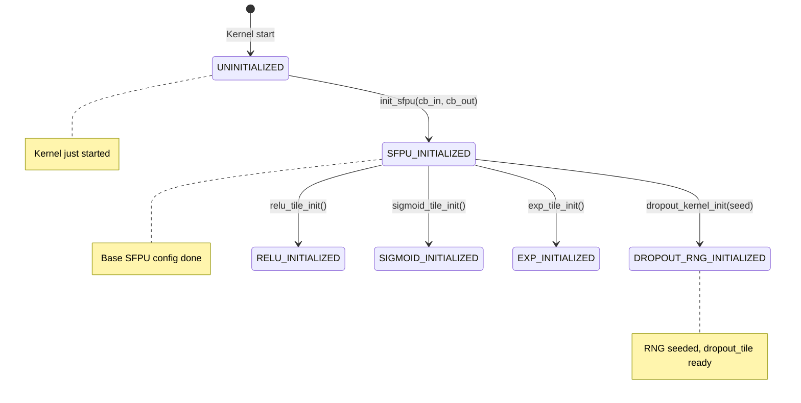
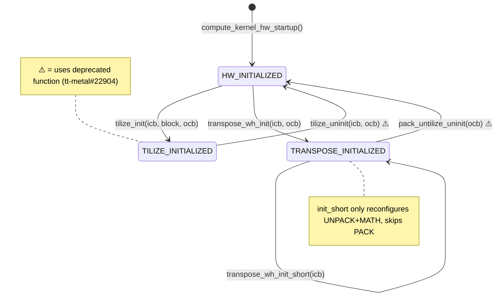
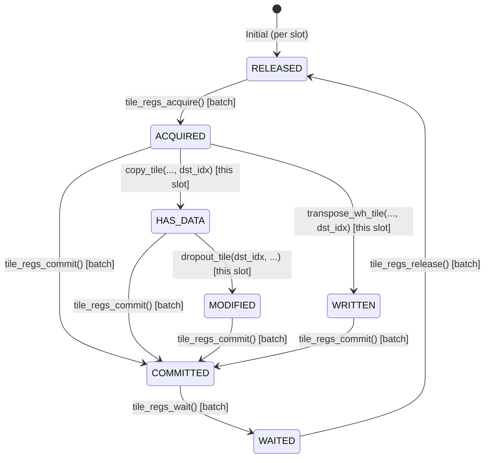
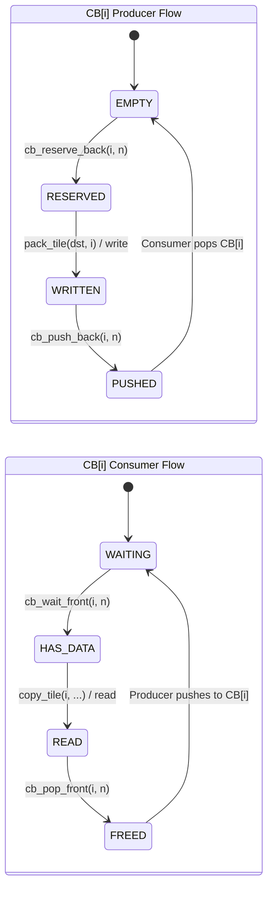
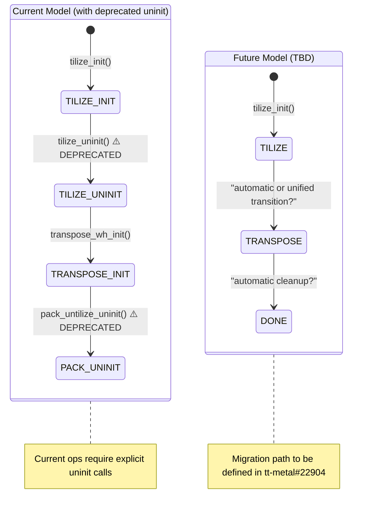

# LLK Primitives Catalog

Central glossary of Low-Level Kernel (LLK) primitives for Tenstorrent hardware.
This document enables LLM-driven selection of appropriate primitives based on data flow requirements.

**Related Documents**:
- `Global_Architecture.md` - Hardware overview, memory hierarchy, Reader-Compute-Writer pattern
- `Common_Optimizations.md` - Optimization patterns (block CB reservation, DST batching, etc.)

**Usage**: Use this catalog to:
1. Identify which primitive implements a desired data transformation
2. Understand state machine requirements and dependencies
3. Derive initialization sequences by following `requires` → `produces` chains

**Context**: LLK primitives run in **Compute kernels** (TRISC processor). They operate on:
- **Circular Buffers (CBs)**: Allocated in L1/SRAM, used for Reader↔Compute↔Writer sync
- **DST Registers**: 8 tile slots in the compute engine for intermediate results
- **SFPU**: Scalar/vector processing unit for element-wise operations

See `Global_Architecture.md` for the complete Reader[DRAM→L1] - Compute[L1] - Writer[L1→DRAM] pattern.

---

## State Machine Model

### Two Types of State Machines

LLK primitives operate on two fundamentally different types of state:

```yaml
state_machine_types:
  per_resource:
    description: "Each indexed resource has its own independent state"
    resources:
      - DST: "8 slots (DST[0]..DST[7]), each with own state"
      - CB: "32 buffers (CB[0]..CB[31]), each with own state"
    visualization: "Series of colored blocks, one per resource"

  global_kernel:
    description: "Single shared state for the entire kernel"
    resources:
      - SFPU_CONFIG: "One configuration state per kernel"
      - INIT_STATE: "Tracks which init functions have been called"
    visualization: "Single block representing kernel-wide state"
```

### Conceptual Visualization

```
┌─────────────────────────────────────────────────────────────────────────────┐
│  KERNEL STATE MODEL                                                         │
├─────────────────────────────────────────────────────────────────────────────┤
│                                                                             │
│  ┌───────────────────────────────────────────────────────────────────────┐  │
│  │  GLOBAL KERNEL STATE (one per kernel)                                 │  │
│  │  ┌─────────────────────────────────────────────────────────────────┐  │  │
│  │  │ SFPU_CONFIG: [UNINITIALIZED|SFPU_INIT|DROPOUT_INIT|RELU_INIT|...│  │  │
│  │  └─────────────────────────────────────────────────────────────────┘  │  │
│  │  • Set once via init_sfpu(), dropout_kernel_init(), etc.              │  │
│  │  • Applies to ALL subsequent SFPU operations                          │  │
│  │  • Does NOT reset between tiles                                       │  │
│  └───────────────────────────────────────────────────────────────────────┘  │
│                                                                             │
│  ┌───────────────────────────────────────────────────────────────────────┐  │
│  │  PER-RESOURCE STATES (each resource has independent state)            │  │
│  │                                                                       │  │
│  │  DST Register Slots (8 total, indexed 0-7):                          │  │
│  │  ┌──────┐ ┌──────┐ ┌──────┐ ┌──────┐ ┌──────┐ ┌──────┐ ┌──────┐ ┌──────┐│
│  │  │DST[0]│ │DST[1]│ │DST[2]│ │DST[3]│ │DST[4]│ │DST[5]│ │DST[6]│ │DST[7]││
│  │  │ ACQ  │ │ HAS  │ │ REL  │ │ REL  │ │ REL  │ │ REL  │ │ REL  │ │ REL  ││
│  │  └──────┘ └──────┘ └──────┘ └──────┘ └──────┘ └──────┘ └──────┘ └──────┘│
│  │  • Each slot can be in different state                                │  │
│  │  • copy_tile(cb, tile, 0) affects DST[0] only                        │  │
│  │  • tile_regs_acquire/release operates on ALL slots as a batch         │  │
│  │                                                                       │  │
│  │  Circular Buffers (32 total, indexed 0-31):                          │  │
│  │  ┌──────┐ ┌──────┐ ┌──────┐ ┌──────┐         ┌───────┐               │  │
│  │  │CB[0] │ │CB[1] │ │CB[2] │ │CB[3] │  ...    │CB[31] │               │  │
│  │  │ DATA │ │EMPTY │ │RSRVD │ │EMPTY │         │ EMPTY │               │  │
│  │  └──────┘ └──────┘ └──────┘ └──────┘         └───────┘               │  │
│  │  • Each CB has independent state                                      │  │
│  │  • cb_wait_front(0, n) affects CB[0] only                            │  │
│  │  • Producer/consumer roles are per-CB                                 │  │
│  └───────────────────────────────────────────────────────────────────────┘  │
│                                                                             │
└─────────────────────────────────────────────────────────────────────────────┘
```

---

## Global Kernel State Machine (SFPU Configuration)

**Scope**: One state per kernel. Set once during initialization, persists for entire kernel execution.



```yaml
global_state:
  scope: "Entire kernel lifetime"
  cardinality: 1  # Single state, not indexed

  states:
    - UNINITIALIZED
    - HW_INITIALIZED        # compute_kernel_hw_startup called
    - SFPU_INITIALIZED
    - DROPOUT_RNG_INITIALIZED
    - RELU_INITIALIZED
    - SIGMOID_INITIALIZED
    - TILIZE_INITIALIZED
    - TRANSPOSE_INITIALIZED
    - PACK_UNTILIZE_INITIALIZED
    # ... other init states

  transitions:
    - { trigger: compute_kernel_hw_startup, from: UNINITIALIZED, to: HW_INITIALIZED }
    - { trigger: init_sfpu, from: HW_INITIALIZED, to: SFPU_INITIALIZED }
    - { trigger: dropout_kernel_init, from: SFPU_INITIALIZED, to: DROPOUT_RNG_INITIALIZED }
    # ...

  invariants:
    - "Init functions called ONCE at kernel start"
    - "State persists across all tile iterations"
    - "No reset between tiles"
```

### Transpose and Tilize State Machine

**Scope**: Operations that require init → compute → uninit lifecycle for switching between modes.



```yaml
transpose_tilize_lifecycle:
  # Tilize lifecycle (requires uninit before switching)
  tilize_sequence:
    init: tilize_init
    compute: tilize_block
    cleanup: tilize_uninit  # Required before transpose_wh_init
    cleanup_note:
      deprecation: "tilize_uninit will be removed by end of 2025"
      source: "tt_metal/include/compute_kernel_api/tilize.h:289-290"
      issue: "tt-metal#22904"

  # Transpose lifecycle
  transpose_sequence:
    full_init: transpose_wh_init  # Configures UNPACK + MATH + PACK
    short_init: transpose_wh_init_short  # Only UNPACK + MATH, for use within loops
    compute: transpose_wh_tile
    cleanup: pack_untilize_uninit  # When combined with pack_untilize

  # Combined pattern (convert_to_hwc uses this)
  tilize_then_transpose:
    - compute_kernel_hw_startup
    - "tilize_init → tilize_block → tilize_uninit ⚠️"  # tilize_uninit deprecated
    - pack_untilize_init + transpose_wh_init + pack_untilize_dest_init
    - "loop: transpose_wh_init_short → transpose_wh_tile → pack_untilize_dest"
    - "pack_untilize_uninit ⚠️"  # pack_untilize_uninit deprecated
    deprecation_note: "⚠️ = deprecated function, migration path TBD (tt-metal#22904)"
```

---

## Per-Resource State Machines

### DST Register Slots (Indexed 0-7)

**Scope**: Each slot `DST[i]` has its own state. Batch operations affect all slots.

```yaml
dst_state_machine:
  scope: "Per slot (DST[0] through DST[7])"
  cardinality: 8  # Eight independent state machines

  capacity:
    slots: 8
    indices: "0 to 7"
    tile_size: "32x32 elements each"

  note_on_batch_operations: |
    tile_regs_acquire() acquires ALL slots as a batch.
    tile_regs_release() releases ALL slots as a batch.
    But copy_tile(cb, tile_idx, dst_idx) only writes to DST[dst_idx].
    SFPU ops like dropout_tile(dst_idx, ...) only modify DST[dst_idx].
```



### State Meanings

| State | Meaning | Valid Operations |
|-------|---------|------------------|
| `RELEASED` | Slot available, not owned | `tile_regs_acquire` |
| `ACQUIRED` | Owned by MATH, ready for writes | `copy_tile`, `transpose_wh_tile` |
| `HAS_DATA` | Contains data from CB unpack | SFPU ops, `tile_regs_commit` |
| `WRITTEN` | Contains transformed data | `tile_regs_commit` |
| `MODIFIED` | Contains computed results | `tile_regs_commit` |
| `COMMITTED` | MATH done, PACK can read | `tile_regs_wait` |
| `WAITED` | Pack complete | `pack_tile`, `tile_regs_release` |

### Example: Multi-Slot Usage

```cpp
// Using multiple DST slots with independent states
tile_regs_acquire();  // ALL slots → ACQUIRED

cb_wait_front(cb_in, 3);

copy_tile(cb_in, 0, 0);  // DST[0]: ACQUIRED → HAS_DATA
copy_tile(cb_in, 1, 1);  // DST[1]: ACQUIRED → HAS_DATA
copy_tile(cb_in, 2, 2);  // DST[2]: ACQUIRED → HAS_DATA
                         // DST[3..7]: still ACQUIRED (unused)

dropout_tile(0, prob, scale);  // DST[0]: HAS_DATA → MODIFIED
dropout_tile(1, prob, scale);  // DST[1]: HAS_DATA → MODIFIED
dropout_tile(2, prob, scale);  // DST[2]: HAS_DATA → MODIFIED

tile_regs_commit();  // ALL slots → COMMITTED
tile_regs_wait();    // ALL slots → WAITED

pack_tile(0, cb_out);  // Pack from DST[0]
pack_tile(1, cb_out);  // Pack from DST[1]
pack_tile(2, cb_out);  // Pack from DST[2]

tile_regs_release();  // ALL slots → RELEASED
```

---

### Circular Buffers (Indexed 0-31)

**Scope**: Each CB `CB[i]` has its own state. Operations specify which CB by index.

```yaml
cb_state_machine:
  scope: "Per buffer (CB[0] through CB[31])"
  cardinality: 32  # Thirty-two independent state machines

  typical_assignments:
    - { index: "c_0 (0)", role: "Primary input" }
    - { index: "c_1 (1)", role: "Secondary input (binary ops)" }
    - { index: "c_2 (2)", role: "Primary output" }
    - { index: "c_16 (16)", role: "Intermediate" }

  note: |
    Each CB can be in a different state.
    CB[0] might be in HAS_DATA while CB[2] is in RESERVED.
    All operations explicitly specify which CB by index.
```



### Example: Multiple CBs in Different States

```cpp
// CB[0] = input, CB[2] = output - independent states

cb_wait_front(0, 1);    // CB[0]: WAITING → HAS_DATA
                        // CB[2]: still in initial state

cb_reserve_back(2, 1);  // CB[2]: EMPTY → RESERVED
                        // CB[0]: still HAS_DATA

tile_regs_acquire();
copy_tile(0, 0, 0);     // Read from CB[0], write to DST[0]
dropout_tile(0, prob, scale);
tile_regs_commit();
tile_regs_wait();

pack_tile(0, 2);        // CB[2]: RESERVED → WRITTEN

cb_pop_front(0, 1);     // CB[0]: HAS_DATA → FREED
cb_push_back(2, 1);     // CB[2]: WRITTEN → PUSHED

tile_regs_release();
```

---

## State Annotation in Primitive Specs

When specifying primitive requirements and effects:

```yaml
state_annotation_format:
  # For per-resource states, specify which resource
  per_resource_example:
    requires:
      - "DST[idst]: ACQUIRED"      # Specific slot must be ACQUIRED
      - "CB[cb_id]: HAS_DATA"      # Specific CB must have data
    produces:
      - "DST[idst]: HAS_DATA"      # That slot now has data

  # For global states, no index needed
  global_example:
    requires:
      - "SFPU: DROPOUT_RNG_INITIALIZED"  # Global kernel state
    produces:
      - "SFPU: DROPOUT_RNG_INITIALIZED"  # No change (compute ops don't change init state)
```

---

## Parameter Transformation Patterns

Standard patterns for converting algorithm parameters to LLK parameters.

```yaml
transformation_patterns:
  - id: INT_SCALE
    description: "Scale float [0,1) to integer range for probability"
    template: "(uint32_t)({value} * INT_MAX)"
    use_case: "Probability values for dropout, threshold operations"
    example:
      from: "prob = 0.5f"
      to: "probability_int = (uint32_t)(0.5f * INT_MAX)"

  - id: BIT_CAST
    description: "Reinterpret float bits as uint32 (no conversion)"
    template: "std::bit_cast<uint32_t>({value})"
    use_case: "Scale factors, threshold values passed to SFPU"
    example:
      from: "scale = 2.0f"
      to: "scale_bits = std::bit_cast<uint32_t>(2.0f)"

  - id: IDENTITY
    description: "Pass through unchanged"
    template: "{value}"
    use_case: "Integer parameters like seed, indices"

  - id: TILE_COUNT
    description: "Convert element count to tile count"
    template: "({value} + TILE_HW - 1) / TILE_HW"
    use_case: "Batch sizes, tensor dimensions"
    constants:
      TILE_HW: 1024  # 32 * 32
```

---

## Primitives Catalog

### Init Primitives (Global Kernel State)

These primitives modify the **global kernel state**. Called once per kernel.

```yaml
primitives:
  # ===========================================================================
  # HARDWARE STARTUP (Must be called first)
  # ===========================================================================
  - id: compute_kernel_hw_startup
    category: init
    state_scope: global
    header: "compute_kernel_api/compute_kernel_hw_startup.h"
    signature: "void compute_kernel_hw_startup(uint32_t icb0, uint32_t icb1, uint32_t ocb)"
    signature_alt: "void compute_kernel_hw_startup(uint32_t icb0, uint32_t ocb)"
    effect: "Initialize UNPACK, MATH, and PACK hardware for all subsequent operations"
    inputs:
      - { port: icb0, type: uint32_t, desc: "Input CB A index (0-31)" }
      - { port: icb1, type: uint32_t, desc: "Input CB B index (0-31), optional" }
      - { port: ocb, type: uint32_t, desc: "Output CB index (0-31)" }
    outputs: []
    requires:
      - { state: "HW: RESET", scope: global, note: "Must be first call in kernel" }
    produces:
      - { state: "HW: INITIALIZED", scope: global }
    notes: |
      GLOBAL STATE: Must be called ONCE at very start of kernel, before any other API calls.
      Performs MMIO writes - unsafe to call mid-execution.
      Two-arg version sets icb1 = icb0.

  # ===========================================================================
  # SFPU INITIALIZATION (Global Kernel State)
  # ===========================================================================
  - id: init_sfpu
    category: init
    state_scope: global  # Affects entire kernel, not per-resource
    header: "compute_kernel_api/eltwise_unary/eltwise_unary.h"
    signature: "void init_sfpu(uint32_t icb, uint32_t ocb)"
    effect: "Initialize SFPU for unary element-wise operations"
    inputs:
      - { port: icb, type: uint32_t, desc: "Input CB index (for format config)" }
      - { port: ocb, type: uint32_t, desc: "Output CB index (for format config)" }
    outputs: []
    requires:
      - { state: "SFPU: UNINITIALIZED", scope: global }
    produces:
      - { state: "SFPU: INITIALIZED", scope: global }
    notes: |
      GLOBAL STATE: Called ONCE per kernel, persists for all tiles.
      Configures UNPACK, MATH, and PACK threads for eltwise unary pattern.

  # ===========================================================================
  # DST REGISTER MANAGEMENT (Batch operations on ALL slots)
  # ===========================================================================
  - id: tile_regs_acquire
    category: dst_management
    state_scope: per_resource_batch  # Operates on all DST[0..7] together
    header: "compute_kernel_api/reg_api.h"
    signature: "void tile_regs_acquire()"
    effect: "Acquire exclusive lock on ALL DST slots for MATH thread"
    inputs: []
    outputs:
      - { port: "DST[0..7]", type: DST, desc: "All 8 DST slots acquired" }
    requires:
      - { state: "DST[0..7]: RELEASED", scope: per_resource, note: "All slots must be released" }
    produces:
      - { state: "DST[0..7]: ACQUIRED", scope: per_resource, note: "All slots now acquired" }
    notes: |
      BATCH OPERATION: Acquires ALL 8 DST slots together.
      Blocking call. Must be paired with tile_regs_commit + tile_regs_wait + tile_regs_release.

  - id: tile_regs_commit
    category: dst_management
    state_scope: per_resource_batch
    header: "compute_kernel_api/reg_api.h"
    signature: "void tile_regs_commit()"
    effect: "Signal MATH thread done with ALL DST slots, allow PACK to read"
    inputs:
      - { port: "DST[0..7]", type: DST, desc: "DST slots with computed data" }
    outputs:
      - { port: "DST[0..7]", type: DST, desc: "All slots ready for packing" }
    requires:
      - { state: "DST[0..7]: ACQUIRED|HAS_DATA|MODIFIED|WRITTEN", scope: per_resource }
    produces:
      - { state: "DST[0..7]: COMMITTED", scope: per_resource }
    notes: |
      BATCH OPERATION: Commits ALL 8 DST slots together.
      Called after all MATH operations on current batch are complete.

  - id: tile_regs_wait
    category: dst_management
    state_scope: per_resource_batch
    header: "compute_kernel_api/reg_api.h"
    signature: "void tile_regs_wait()"
    effect: "PACK thread waits for MATH commit signal on ALL DST slots"
    inputs:
      - { port: "DST[0..7]", type: DST, desc: "All committed DST slots" }
    outputs:
      - { port: "DST[0..7]", type: DST, desc: "All slots ready for pack" }
    requires:
      - { state: "DST[0..7]: COMMITTED", scope: per_resource }
    produces:
      - { state: "DST[0..7]: WAITED", scope: per_resource }
    notes: |
      BATCH OPERATION: Waits on ALL 8 DST slots together.
      Blocking call. Called before pack_tile or pack_untilize_dest.

  - id: tile_regs_release
    category: dst_management
    state_scope: per_resource_batch
    header: "compute_kernel_api/reg_api.h"
    signature: "void tile_regs_release()"
    effect: "Release ALL DST slots from PACK thread"
    inputs:
      - { port: "DST[0..7]", type: DST, desc: "All packed DST slots" }
    outputs:
      - { port: "DST[0..7]", type: DST, desc: "All slots released" }
    requires:
      - { state: "DST[0..7]: WAITED", scope: per_resource }
    produces:
      - { state: "DST[0..7]: RELEASED", scope: per_resource }
    notes: |
      BATCH OPERATION: Releases ALL 8 DST slots together.
      Must be called after all pack operations on current batch.

  # ===========================================================================
  # CIRCULAR BUFFER SYNCHRONIZATION (Per-CB operations)
  # Each CB[cbid] has independent state
  # ===========================================================================
  - id: cb_wait_front
    category: cb_sync
    state_scope: per_resource  # Operates on specific CB[cbid]
    header: "compute_kernel_api/cb_api.h"
    signature: "void cb_wait_front(uint32_t cbid, uint32_t ntiles)"
    effect: "Block until ntiles are available for reading in CB[cbid]"
    inputs:
      - { port: cbid, type: uint32_t, desc: "CB index (0-31)" }
      - { port: ntiles, type: uint32_t, desc: "Number of tiles to wait for" }
    outputs:
      - { port: "CB[cbid]", type: CB, desc: "Specific CB with readable data" }
    requires:
      - { state: "CB[cbid]: any", scope: per_resource, note: "CB must exist" }
    produces:
      - { state: "CB[cbid]: HAS_DATA", scope: per_resource }
    notes: |
      PER-CB OPERATION: Only affects CB[cbid], other CBs unchanged.
      Consumer-side. Blocking until producer pushes tiles.

  - id: cb_pop_front
    category: cb_sync
    state_scope: per_resource
    header: "compute_kernel_api/cb_api.h"
    signature: "void cb_pop_front(uint32_t cbid, uint32_t ntiles)"
    effect: "Release ntiles from CB[cbid] after reading"
    inputs:
      - { port: cbid, type: uint32_t, desc: "CB index (0-31)" }
      - { port: ntiles, type: uint32_t, desc: "Number of tiles to release" }
    outputs:
      - { port: "CB[cbid]", type: CB, desc: "CB with freed space" }
    requires:
      - { state: "CB[cbid]: HAS_DATA", scope: per_resource }
    produces:
      - { state: "CB[cbid]: FREED", scope: per_resource }
    notes: |
      PER-CB OPERATION: Only affects CB[cbid].
      Consumer-side. Signals producer that space is available.

  - id: cb_reserve_back
    category: cb_sync
    state_scope: per_resource
    header: "compute_kernel_api/cb_api.h"
    signature: "void cb_reserve_back(uint32_t cbid, uint32_t ntiles)"
    effect: "Block until ntiles are free for writing in CB[cbid]"
    inputs:
      - { port: cbid, type: uint32_t, desc: "CB index (0-31)" }
      - { port: ntiles, type: uint32_t, desc: "Number of tiles to reserve" }
    outputs:
      - { port: "CB[cbid]", type: CB, desc: "CB with reserved space" }
    requires:
      - { state: "CB[cbid]: any", scope: per_resource }
    produces:
      - { state: "CB[cbid]: RESERVED", scope: per_resource }
    notes: |
      PER-CB OPERATION: Only affects CB[cbid].
      Producer-side. Blocking until consumer frees space.

  - id: cb_push_back
    category: cb_sync
    state_scope: per_resource
    header: "compute_kernel_api/cb_api.h"
    signature: "void cb_push_back(uint32_t cbid, uint32_t ntiles)"
    effect: "Make ntiles visible to consumer in CB[cbid]"
    inputs:
      - { port: cbid, type: uint32_t, desc: "CB index (0-31)" }
      - { port: ntiles, type: uint32_t, desc: "Number of tiles to push" }
    outputs:
      - { port: "CB[cbid]", type: CB, desc: "CB with visible data" }
    requires:
      - { state: "CB[cbid]: WRITTEN", scope: per_resource }
    produces:
      - { state: "CB[cbid]: PUSHED", scope: per_resource }
    notes: |
      PER-CB OPERATION: Only affects CB[cbid].
      Producer-side. Signals consumer that data is available.

  # ===========================================================================
  # DATA MOVEMENT (CB ↔ DST)
  # These operate on SPECIFIC indexed resources
  # ===========================================================================
  - id: copy_tile
    category: data_movement
    state_scope: per_resource  # Operates on specific DST[dst_idx] and CB[cb_id]
    header: "compute_kernel_api/tile_move_copy.h"
    signature: "void copy_tile(uint32_t in_cb_id, uint32_t in_tile_index, uint32_t dst_tile_index)"
    effect: "CB[in_cb_id][in_tile_index] → DST[dst_tile_index]"
    inputs:
      - { port: in_cb_id, type: uint32_t, desc: "Source CB index (0-31)" }
      - { port: in_tile_index, type: uint32_t, desc: "Tile index within CB" }
      - { port: dst_tile_index, type: uint32_t, desc: "Destination slot in DST (0-7)" }
    outputs:
      - { port: "DST[dst_tile_index]", type: DST, desc: "Specific DST slot with copied tile" }
    requires:
      - { state: "DST[dst_tile_index]: ACQUIRED", scope: per_resource, note: "This specific slot" }
      - { state: "CB[in_cb_id]: HAS_DATA", scope: per_resource, note: "This specific CB" }
    produces:
      - { state: "DST[dst_tile_index]: HAS_DATA", scope: per_resource }
    per_primitive_file: "copy_tile.md"
    notes: |
      PER-RESOURCE: Reads from CB[in_cb_id], writes to DST[dst_tile_index].
      Other DST slots and CBs are unaffected.

  - id: pack_tile
    category: data_movement
    state_scope: per_resource
    header: "compute_kernel_api/pack.h"
    signature: "void pack_tile(uint32_t ifrom_dst, uint32_t icb, uint32_t output_tile_index = 0)"
    effect: "DST[ifrom_dst] → CB[icb][output_tile_index]"
    inputs:
      - { port: ifrom_dst, type: uint32_t, desc: "Source slot in DST (0-15)" }
      - { port: icb, type: uint32_t, desc: "Destination CB index (0-31)" }
      - { port: output_tile_index, type: uint32_t, desc: "Tile index within CB", optional: true }
    outputs:
      - { port: "CB[icb]", type: CB, desc: "Specific CB with packed tile" }
    requires:
      - { state: "DST[ifrom_dst]: WAITED", scope: per_resource, note: "This specific slot" }
      - { state: "CB[icb]: RESERVED", scope: per_resource, note: "This specific CB" }
    produces:
      - { state: "CB[icb]: WRITTEN", scope: per_resource }
    per_primitive_file: "pack_tile.md"
    notes: |
      PER-RESOURCE: Reads from DST[ifrom_dst], writes to CB[icb].
      Does not require explicit init - configured by op-specific init functions.
```

### Compute Primitives (Per-Resource + Global State)

```yaml
primitives:
  # ===========================================================================
  # SFPU COMPUTE OPERATIONS
  # These require GLOBAL init state + operate on SPECIFIC DST slot
  # ===========================================================================
  - id: dropout_tile
    category: sfpu_compute
    state_scope: mixed  # Requires global init + per-resource DST
    header: "compute_kernel_api/eltwise_unary/dropout.h"
    signature: "void dropout_tile(uint32_t idst, uint32_t probability, uint32_t scale_factor)"
    effect: "DST[idst] = DST[idst] * Bernoulli(1-p) * scale"
    inputs:
      - { port: idst, type: uint32_t, desc: "DST slot index (0-7)" }
      - { port: probability, type: uint32_t, desc: "Drop probability (INT_SCALE pattern)" }
      - { port: scale_factor, type: uint32_t, desc: "Scale factor (BIT_CAST pattern)" }
    outputs:
      - { port: "DST[idst]", type: DST, desc: "Modified DST slot" }
    requires:
      - { state: "DST[idst]: ACQUIRED", scope: per_resource }
      - { state: "DST[idst]: HAS_DATA", scope: per_resource }
      - { state: "SFPU: DROPOUT_RNG_INITIALIZED", scope: global }
    produces:
      - { state: "DST[idst]: MODIFIED", scope: per_resource }
      # Note: Global SFPU state unchanged
    init_dependency: dropout_kernel_init
    per_primitive_file: "dropout_tile.md"
    notes: |
      MIXED STATE: Requires global SFPU init + operates on specific DST[idst].
      Other DST slots unaffected. Global SFPU config unchanged.

  # All SFPU ops follow same pattern: global init + per-resource DST
  - id: sigmoid_tile
    category: sfpu_compute
    state_scope: mixed
    header: "compute_kernel_api.h"
    signature: "void sigmoid_tile(uint32_t idst)"
    effect: "DST[idst] = 1 / (1 + exp(-DST[idst]))"
    inputs:
      - { port: idst, type: uint32_t, desc: "DST slot index (0-7)" }
    outputs:
      - { port: "DST[idst]", type: DST, desc: "Modified DST slot" }
    requires:
      - { state: "DST[idst]: HAS_DATA", scope: per_resource }
      - { state: "SFPU: SIGMOID_INITIALIZED", scope: global }
    produces:
      - { state: "DST[idst]: MODIFIED", scope: per_resource }
    init_dependency: sigmoid_tile_init

  - id: tanh_tile
    category: sfpu_compute
    state_scope: mixed
    header: "compute_kernel_api.h"
    signature: "void tanh_tile(uint32_t idst)"
    effect: "DST[idst] = tanh(DST[idst])"
    inputs:
      - { port: idst, type: uint32_t, desc: "DST slot index (0-7)" }
    outputs:
      - { port: "DST[idst]", type: DST, desc: "Modified DST slot" }
    requires:
      - { state: "DST[idst]: HAS_DATA", scope: per_resource }
      - { state: "SFPU: TANH_INITIALIZED", scope: global }
    produces:
      - { state: "DST[idst]: MODIFIED", scope: per_resource }
    init_dependency: tanh_tile_init

  - id: exp_tile
    category: sfpu_compute
    state_scope: mixed
    header: "compute_kernel_api/eltwise_unary/exp.h"
    signature: "void exp_tile(uint32_t idst)"
    effect: "DST[idst] = exp(DST[idst])"
    inputs:
      - { port: idst, type: uint32_t, desc: "DST slot index (0-7)" }
    outputs:
      - { port: "DST[idst]", type: DST, desc: "Modified DST slot" }
    requires:
      - { state: "DST[idst]: HAS_DATA", scope: per_resource }
      - { state: "SFPU: EXP_INITIALIZED", scope: global }
    produces:
      - { state: "DST[idst]: MODIFIED", scope: per_resource }
    init_dependency: exp_tile_init

  - id: log_tile
    category: sfpu_compute
    state_scope: mixed
    header: "compute_kernel_api.h"
    signature: "void log_tile(uint32_t idst)"
    effect: "DST[idst] = log(DST[idst])"
    inputs:
      - { port: idst, type: uint32_t, desc: "DST slot index (0-7)" }
    outputs:
      - { port: "DST[idst]", type: DST, desc: "Modified DST slot" }
    requires:
      - { state: "DST[idst]: HAS_DATA", scope: per_resource }
      - { state: "SFPU: LOG_INITIALIZED", scope: global }
    produces:
      - { state: "DST[idst]: MODIFIED", scope: per_resource }
    init_dependency: log_tile_init

  - id: sqrt_tile
    category: sfpu_compute
    state_scope: mixed
    header: "compute_kernel_api/eltwise_unary/sqrt.h"
    signature: "void sqrt_tile(uint32_t idst)"
    effect: "DST[idst] = sqrt(DST[idst])"
    inputs:
      - { port: idst, type: uint32_t, desc: "DST slot index (0-7)" }
    outputs:
      - { port: "DST[idst]", type: DST, desc: "Modified DST slot" }
    requires:
      - { state: "DST[idst]: HAS_DATA", scope: per_resource }
      - { state: "SFPU: SQRT_INITIALIZED", scope: global }
    produces:
      - { state: "DST[idst]: MODIFIED", scope: per_resource }
    init_dependency: sqrt_tile_init

  - id: recip_tile
    category: sfpu_compute
    state_scope: mixed
    header: "compute_kernel_api/eltwise_unary/recip.h"
    signature: "void recip_tile(uint32_t idst)"
    effect: "DST[idst] = 1.0 / DST[idst]"
    inputs:
      - { port: idst, type: uint32_t, desc: "DST slot index (0-7)" }
    outputs:
      - { port: "DST[idst]", type: DST, desc: "Modified DST slot" }
    requires:
      - { state: "DST[idst]: HAS_DATA", scope: per_resource }
      - { state: "SFPU: RECIP_INITIALIZED", scope: global }
    produces:
      - { state: "DST[idst]: MODIFIED", scope: per_resource }
    init_dependency: recip_tile_init

  - id: abs_tile
    category: sfpu_compute
    state_scope: mixed
    header: "compute_kernel_api.h"
    signature: "void abs_tile(uint32_t idst)"
    effect: "DST[idst] = |DST[idst]|"
    inputs:
      - { port: idst, type: uint32_t, desc: "DST slot index (0-7)" }
    outputs:
      - { port: "DST[idst]", type: DST, desc: "Modified DST slot" }
    requires:
      - { state: "DST[idst]: HAS_DATA", scope: per_resource }
      - { state: "SFPU: ABS_INITIALIZED", scope: global }
    produces:
      - { state: "DST[idst]: MODIFIED", scope: per_resource }
    init_dependency: abs_tile_init

  - id: square_tile
    category: sfpu_compute
    state_scope: mixed
    header: "compute_kernel_api.h"
    signature: "void square_tile(uint32_t idst)"
    effect: "DST[idst] = DST[idst]^2"
    inputs:
      - { port: idst, type: uint32_t, desc: "DST slot index (0-7)" }
    outputs:
      - { port: "DST[idst]", type: DST, desc: "Modified DST slot" }
    requires:
      - { state: "DST[idst]: HAS_DATA", scope: per_resource }
      - { state: "SFPU: SQUARE_INITIALIZED", scope: global }
    produces:
      - { state: "DST[idst]: MODIFIED", scope: per_resource }
    init_dependency: square_tile_init

  - id: power_tile
    category: sfpu_compute
    state_scope: mixed
    header: "compute_kernel_api.h"
    signature: "void power_tile(uint32_t idst, uint32_t exponent)"
    effect: "DST[idst] = DST[idst]^exponent"
    inputs:
      - { port: idst, type: uint32_t, desc: "DST slot index (0-7)" }
      - { port: exponent, type: uint32_t, desc: "Power exponent" }
    outputs:
      - { port: "DST[idst]", type: DST, desc: "Modified DST slot" }
    requires:
      - { state: "DST[idst]: HAS_DATA", scope: per_resource }
      - { state: "SFPU: POWER_INITIALIZED", scope: global }
    produces:
      - { state: "DST[idst]: MODIFIED", scope: per_resource }
    init_dependency: power_tile_init
```

### Transform Primitives (Per-Resource + Global State)

```yaml
primitives:
  # ===========================================================================
  # TILIZE OPERATIONS
  # Convert ROW_MAJOR → TILE format
  # ===========================================================================
  - id: tilize_block
    category: transform
    state_scope: mixed  # Global init + per-resource CB
    header: "compute_kernel_api/tilize.h"
    signature: "void tilize_block(uint32_t icb, uint32_t block, uint32_t ocb, uint32_t input_tile_index = 0, uint32_t output_tile_index = 0)"
    effect: "CB[ocb] = tilize(CB[icb])  # Row-major → Tile format"
    inputs:
      - { port: icb, type: uint32_t, desc: "Input CB index (0-31) with row-major data" }
      - { port: block, type: uint32_t, desc: "Number of tiles to tilize" }
      - { port: ocb, type: uint32_t, desc: "Output CB index (0-31)" }
      - { port: input_tile_index, type: uint32_t, desc: "Starting tile index in icb", optional: true }
      - { port: output_tile_index, type: uint32_t, desc: "Starting tile index in ocb", optional: true }
    outputs:
      - { port: "CB[ocb]", type: CB, desc: "CB with tilized data" }
    requires:
      - { state: "CB[icb]: HAS_DATA", scope: per_resource }
      - { state: "CB[ocb]: RESERVED", scope: per_resource }
      - { state: "SFPU: TILIZE_INITIALIZED", scope: global }
    produces:
      - { state: "CB[ocb]: WRITTEN", scope: per_resource }
    init_dependency: tilize_init
    cleanup_required: tilize_uninit
    notes: |
      MIXED STATE: Requires tilize_init + operates on specific CBs.
      Internally handles DST acquire/commit/wait/release for each tile in block.
      Block size should match what was passed to tilize_init.

  # ===========================================================================
  # TRANSFORM OPERATIONS
  # Require global init + operate on specific resources
  # ===========================================================================
  - id: transpose_wh_tile
    category: transform
    state_scope: mixed  # Global init + per-resource CB/DST
    header: "compute_kernel_api/transpose_wh.h"
    signature: "void transpose_wh_tile(uint32_t icb, uint32_t itile, uint32_t idst)"
    effect: "DST[idst] = transpose(CB[icb][itile])  # B[w,h] = A[h,w]"
    inputs:
      - { port: icb, type: uint32_t, desc: "Source CB index (0-31)" }
      - { port: itile, type: uint32_t, desc: "Tile index within CB" }
      - { port: idst, type: uint32_t, desc: "Destination slot in DST (0-7)" }
    outputs:
      - { port: "DST[idst]", type: DST, desc: "DST slot with transposed tile" }
    requires:
      - { state: "DST[idst]: ACQUIRED", scope: per_resource }
      - { state: "CB[icb]: HAS_DATA", scope: per_resource }
      - { state: "SFPU: TRANSPOSE_INITIALIZED", scope: global }
    produces:
      - { state: "DST[idst]: WRITTEN", scope: per_resource }
    init_dependency: transpose_wh_init
    per_primitive_file: "transpose_wh_tile.md"
    notes: |
      MIXED STATE: Requires global transpose init + operates on specific CB[icb] and DST[idst].
      Reads directly from CB (NOT via copy_tile).

  - id: pack_untilize_dest
    category: data_movement
    state_scope: mixed  # Global init + per-resource DST/CB
    header: "compute_kernel_api/pack_untilize.h"
    signature: "void pack_untilize_dest<block_ct_dim>(uint32_t ocb, uint32_t block_rt_dim)"
    effect: "CB[ocb] = untilize(DST[0..N])  # Tile format → Row-major"
    inputs:
      - { port: ocb, type: uint32_t, desc: "Output CB index (0-31)" }
      - { port: block_rt_dim, type: uint32_t, desc: "Block height in tiles" }
    outputs:
      - { port: "CB[ocb]", type: CB, desc: "CB with untilized row-major data" }
    requires:
      - { state: "DST[0..N]: WAITED", scope: per_resource, note: "N = block_rt_dim" }
      - { state: "CB[ocb]: RESERVED", scope: per_resource }
      - { state: "SFPU: PACK_UNTILIZE_DEST_INITIALIZED", scope: global }
    produces:
      - { state: "CB[ocb]: WRITTEN", scope: per_resource }
    init_dependency: pack_untilize_dest_init
    cleanup_required: pack_untilize_uninit
    per_primitive_file: "pack_untilize_dest.md"
    notes: |
      MIXED STATE: Requires global pack_untilize init + operates on specific CB[ocb].
      Reads from multiple DST slots, writes to specific CB.
```

### Init Function Dependencies (Global Kernel State)

All init functions modify the **global kernel state**. Called once per kernel, state persists for all tiles.

```yaml
init_functions:
  # ===========================================================================
  # SFPU INIT FUNCTIONS (Global Kernel State)
  # All operate on SFPU global state, called ONCE per kernel
  # ===========================================================================
  - id: dropout_kernel_init
    category: init
    state_scope: global  # Modifies global kernel state
    header: "compute_kernel_api/eltwise_unary/dropout.h"
    signature: "void dropout_kernel_init(uint32_t seed)"
    requires:
      - { state: "SFPU: INITIALIZED", scope: global }
    produces:
      - { state: "SFPU: DROPOUT_RNG_INITIALIZED", scope: global }
    call_once: true
    notes: "GLOBAL: Seeds RNG once. State persists for all dropout_tile calls."

  - id: sigmoid_tile_init
    state_scope: global
    header: "compute_kernel_api.h"
    signature: "void sigmoid_tile_init()"
    requires:
      - { state: "SFPU: INITIALIZED", scope: global }
    produces:
      - { state: "SFPU: SIGMOID_INITIALIZED", scope: global }

  - id: tanh_tile_init
    state_scope: global
    header: "compute_kernel_api.h"
    signature: "void tanh_tile_init()"
    requires:
      - { state: "SFPU: INITIALIZED", scope: global }
    produces:
      - { state: "SFPU: TANH_INITIALIZED", scope: global }

  - id: exp_tile_init
    state_scope: global
    header: "compute_kernel_api/eltwise_unary/exp.h"
    signature: "void exp_tile_init()"
    requires:
      - { state: "SFPU: INITIALIZED", scope: global }
    produces:
      - { state: "SFPU: EXP_INITIALIZED", scope: global }

  - id: log_tile_init
    state_scope: global
    header: "compute_kernel_api.h"
    signature: "void log_tile_init()"
    requires:
      - { state: "SFPU: INITIALIZED", scope: global }
    produces:
      - { state: "SFPU: LOG_INITIALIZED", scope: global }

  - id: sqrt_tile_init
    state_scope: global
    header: "compute_kernel_api/eltwise_unary/sqrt.h"
    signature: "void sqrt_tile_init()"
    requires:
      - { state: "SFPU: INITIALIZED", scope: global }
    produces:
      - { state: "SFPU: SQRT_INITIALIZED", scope: global }

  - id: recip_tile_init
    state_scope: global
    header: "compute_kernel_api/eltwise_unary/recip.h"
    signature: "void recip_tile_init()"
    requires:
      - { state: "SFPU: INITIALIZED", scope: global }
    produces:
      - { state: "SFPU: RECIP_INITIALIZED", scope: global }

  - id: abs_tile_init
    state_scope: global
    header: "compute_kernel_api.h"
    signature: "void abs_tile_init()"
    requires:
      - { state: "SFPU: INITIALIZED", scope: global }
    produces:
      - { state: "SFPU: ABS_INITIALIZED", scope: global }

  - id: square_tile_init
    state_scope: global
    header: "compute_kernel_api.h"
    signature: "void square_tile_init()"
    requires:
      - { state: "SFPU: INITIALIZED", scope: global }
    produces:
      - { state: "SFPU: SQUARE_INITIALIZED", scope: global }

  - id: power_tile_init
    state_scope: global
    header: "compute_kernel_api.h"
    signature: "void power_tile_init()"
    requires:
      - { state: "SFPU: INITIALIZED", scope: global }
    produces:
      - { state: "SFPU: POWER_INITIALIZED", scope: global }

  # ===========================================================================
  # TILIZE INIT/CLEANUP FUNCTIONS (Global Kernel State)
  # ===========================================================================
  - id: tilize_init
    category: init
    state_scope: global
    header: "compute_kernel_api/tilize.h"
    source_ref: "tt_metal/include/compute_kernel_api/tilize.h:32-43"
    signature: "void tilize_init(uint32_t icb, uint32_t block, uint32_t ocb)"
    effect: "Initialize tilize operation for converting row-major to tile format"
    deprecated: false  # NOTE: tilize_init is NOT deprecated, only *_uninit functions are
    inputs:
      - { port: icb, type: uint32_t, desc: "Input CB index (0-31)" }
      - { port: block, type: uint32_t, desc: "Block size (number of tiles)" }
      - { port: ocb, type: uint32_t, desc: "Output CB index (0-31)" }
    requires:
      - { state: "HW: INITIALIZED", scope: global }
    produces:
      - { state: "SFPU: TILIZE_INITIALIZED", scope: global }
    notes: |
      GLOBAL: Configures UNPACK for tilize, MATH for datacopy, PACK for output.
      Currently requires tilize_uninit before switching to another operation.
      NOTE: tilize_uninit is deprecated (tt-metal#22904) - future migration path TBD.

  - id: tilize_uninit
    category: cleanup
    state_scope: global
    header: "compute_kernel_api/tilize.h"
    signature: "void tilize_uninit(uint32_t icb, uint32_t ocb)"
    effect: "Cleanup tilize state before switching to another operation"
    inputs:
      - { port: icb, type: uint32_t, desc: "Input CB index (0-31)" }
      - { port: ocb, type: uint32_t, desc: "Output CB index (0-31)" }
    requires:
      - { state: "SFPU: TILIZE_INITIALIZED", scope: global }
    produces:
      - { state: "SFPU: TILIZE_UNINITIALIZED", scope: global, note: "Ready for next operation init" }
    deprecation:
      note: "Function is not in line with programming model, will be removed by end of 2025"
      source: "tt_metal/include/compute_kernel_api/tilize.h:289-290"
      issue: "tt-metal#22904"
    notes: |
      GLOBAL: Must be called after tilize operations complete, before any other init.

  # ===========================================================================
  # TRANSFORM INIT FUNCTIONS (Global Kernel State)
  # ===========================================================================
  - id: transpose_wh_init
    state_scope: global
    header: "compute_kernel_api/transpose_wh.h"
    signature: "void transpose_wh_init(uint32_t icb, uint32_t ocb)"
    requires: []
    produces:
      - { state: "SFPU: TRANSPOSE_INITIALIZED", scope: global }
    notes: "GLOBAL: Configures UNPACK, MATH, PACK threads for transpose."

  - id: transpose_wh_init_short
    category: init
    state_scope: global
    header: "compute_kernel_api/transpose_wh.h"
    signature: "void transpose_wh_init_short(uint32_t icb)"
    source_ref: "tt_metal/include/compute_kernel_api/transpose_wh.h:55-75"
    effect: "Lightweight re-initialization for transpose within a loop"
    inputs:
      - { port: icb, type: uint32_t, desc: "Input CB index (0-31)" }
    requires:
      - { state: "SFPU: TRANSPOSE_INITIALIZED", scope: global, note: "Full transpose_wh_init must be called first" }
    produces:
      - { state: "SFPU: TRANSPOSE_INITIALIZED", scope: global, note: "State unchanged, UNPACK+MATH refreshed" }
    notes: |
      GLOBAL: Lightweight version for use inside loops when transpose_wh_init was already called.
      Reconfigures UNPACK and MATH threads only - skips PACK reconfiguration.
      Use case: When alternating between tilize and transpose ops within same kernel,
      call this within the loop to refresh transpose config after tilize operations.
      See convert_to_hwc for usage pattern.

  - id: pack_untilize_init
    state_scope: global
    header: "compute_kernel_api/pack_untilize.h"
    signature: "void pack_untilize_init<block_ct_dim>(uint32_t icb, uint32_t ocb)"
    requires: []
    produces:
      - { state: "SFPU: PACK_UNTILIZE_INITIALIZED", scope: global }
    notes: "GLOBAL: Full init for untilize when data not yet in DEST."

  - id: pack_untilize_dest_init
    state_scope: global
    header: "compute_kernel_api/pack_untilize.h"
    signature: "void pack_untilize_dest_init<block_ct_dim>(uint32_t ocb)"
    requires:
      - { state: "SFPU: PACK_UNTILIZE_INITIALIZED", scope: global }
    produces:
      - { state: "SFPU: PACK_UNTILIZE_DEST_INITIALIZED", scope: global }
    notes: "GLOBAL: Init for untilize when data already in DEST."

  # ===========================================================================
  # CLEANUP FUNCTIONS (Global Kernel State)
  # ===========================================================================
  - id: pack_untilize_uninit
    state_scope: global
    header: "compute_kernel_api/pack_untilize.h"
    signature: "void pack_untilize_uninit(uint32_t ocb)"
    requires:
      - { state: "SFPU: PACK_UNTILIZE_INITIALIZED", scope: global }
    produces:
      - { state: "SFPU: UNINITIALIZED", scope: global, note: "Resets untilize state" }
    notes: "GLOBAL: Required cleanup after all pack_untilize operations."
```

---

## State Scope Summary

Quick reference for understanding which primitives operate on which scope:

| Category | State Scope | Resources | Example |
|----------|-------------|-----------|---------|
| **Init** | `global` | Single kernel-wide state | `init_sfpu`, `dropout_kernel_init` |
| **Cleanup** | `global` | Single kernel-wide state | `pack_untilize_uninit` |
| **DST batch ops** | `per_resource_batch` | All DST[0..7] together | `tile_regs_acquire/commit/wait/release` |
| **CB ops** | `per_resource` | Specific CB[cbid] | `cb_wait_front`, `cb_push_back` |
| **Data movement** | `per_resource` | Specific DST[idx] + CB[id] | `copy_tile`, `pack_tile` |
| **SFPU compute** | `mixed` | Global init + specific DST[idx] | `dropout_tile`, `sigmoid_tile` |
| **Transform** | `mixed` | Global init + specific CB + DST | `transpose_wh_tile` |

---

## Dependency Resolution Algorithm

To determine the complete initialization sequence for a compute primitive:

```python
def derive_init_sequence(target_primitive):
    """
    Given a target primitive (e.g., dropout_tile),
    derive the complete ordered init sequence.
    """
    required_states = set(CATALOG[target_primitive].requires)
    init_sequence = []
    produced_states = set()

    # Iterate until all required states are satisfied
    while required_states - produced_states:
        for init_fn in INIT_FUNCTIONS:
            # Check if this init produces a needed state
            if any(s in (required_states - produced_states)
                   for s in init_fn.produces):
                # Check if its requirements are met
                if all(s in produced_states for s in init_fn.requires):
                    init_sequence.append(init_fn)
                    produced_states.update(init_fn.produces)
                    break
        else:
            raise Error("Cannot satisfy requirements")

    return init_sequence

# Example: dropout_tile
# Required: [DST_ACQUIRED, DST_HAS_DATA, DROPOUT_RNG_INITIALIZED]
#
# Derivation:
#   1. DROPOUT_RNG_INITIALIZED needs dropout_kernel_init
#   2. dropout_kernel_init requires SFPU_INITIALIZED
#   3. SFPU_INITIALIZED needs init_sfpu
#   4. init_sfpu requires [] (nothing)
#
# Result: [init_sfpu, dropout_kernel_init]
```

---

## Quick Reference: Effect Lookup

Use this table to find the primitive for a desired mathematical operation:

| Desired Effect | Primitive | Category |
|----------------|-----------|----------|
| `y = x` (copy) | `copy_tile` | data_movement |
| `tile = row_major` | `tilize_block` | transform |
| `y = x * mask * scale` | `dropout_tile` | sfpu_compute |
| `y = 1/(1+exp(-x))` | `sigmoid_tile` | sfpu_compute |
| `y = tanh(x)` | `tanh_tile` | sfpu_compute |
| `y = exp(x)` | `exp_tile` | sfpu_compute |
| `y = log(x)` | `log_tile` | sfpu_compute |
| `y = sqrt(x)` | `sqrt_tile` | sfpu_compute |
| `y = 1/x` | `recip_tile` | sfpu_compute |
| `y = \|x\|` | `abs_tile` | sfpu_compute |
| `y = x^2` | `square_tile` | sfpu_compute |
| `y = x^n` | `power_tile` | sfpu_compute |
| `B[w,h] = A[h,w]` | `transpose_wh_tile` | transform |
| `row_major = tile` | `pack_untilize_dest` | data_movement |

---

## Execution Patterns

Named patterns that combine primitives into complete compute kernels.
Use pattern selection to match HW strategy to the appropriate pattern.

### Pattern Selection Rules

```yaml
pattern_selection:
  # Interleaved TILE layout → eltwise_unary pattern
  - id: PS1
    conditions:
      - { entity: memory_layout, rel: "==", value: INTERLEAVED }
      - { entity: input_layout, rel: "==", value: TILE }
      - { entity: output_layout, rel: "==", value: TILE }
      - { entity: operation_type, rel: "==", value: elementwise }
    selects_pattern: eltwise_unary
    implies:
      - { reader: interleaved_tile_reader }
      - { writer: interleaved_tile_writer }
      - { cb_flow: streaming }

  # TILE input + ROW_MAJOR output → transpose_untilize pattern
  - id: PS2
    conditions:
      - { entity: input_layout, rel: "==", value: TILE }
      - { entity: output_layout, rel: "==", value: ROW_MAJOR }
    selects_pattern: transpose_untilize
    implies:
      - { requires_cleanup: [pack_untilize_uninit] }
      - { supports_batching: true }

  # HEIGHT_SHARDED input → zero_copy input CB
  - id: PS3
    conditions:
      - { entity: input_memory_layout, rel: "==", value: HEIGHT_SHARDED }
    implies:
      - { input_cb_pattern: zero_copy }
      - { input_cb_allocation: globally_allocated }
      - { reader_pattern: signal_only }
```

### Pattern: eltwise_unary

```yaml
pattern:
  id: eltwise_unary
  description: "Element-wise unary operation on tiles"
  examples: [dropout, relu, exp, sqrt, gelu, sigmoid]

  cb_bindings:
    cb_in: { index: c_0, role: input, direction: consumer }
    cb_out: { index: c_2, role: output, direction: producer }

  base_init: [init_sfpu]

  loop_template:
    type: nested
    outer:
      before_inner: [cb_reserve_back]
      after_inner: [cb_push_back]
    inner:
      - tile_regs_acquire
      - cb_wait_front
      - copy_tile          # CB → DST
      - COMPUTE            # Placeholder for actual primitive
      - tile_regs_commit
      - tile_regs_wait
      - pack_tile          # DST → CB
      - cb_pop_front
      - tile_regs_release
```

### Pattern: transpose_untilize

```yaml
pattern:
  id: transpose_untilize
  description: "In-tile transpose followed by untilization to row-major"
  examples: [convert_to_chw]

  cb_bindings:
    cb_in: { index: c_0, role: input, direction: consumer, zero_copy: true }
    cb_transpose_in: { index: c_2, role: intermediate, direction: producer }
    cb_out: { index: c_1, role: output, direction: producer, zero_copy: true }

  base_init:
    - compute_kernel_hw_startup
    - pack_untilize_init
    - transpose_wh_init
    - pack_untilize_dest_init

  required_cleanup: [pack_untilize_uninit]

  loop_template:
    type: sequential
    supports_batching: true
    max_batch_size: 8

    helper_template:
      name: transpose
      template_param: N
      sequence:
        - cb_wait_front(N)
        - tile_regs_acquire
        - transpose_wh_tile(repeat N)
        - tile_regs_commit
        - cb_pop_front(N)
        - cb_reserve_back(N)
        - tile_regs_wait
        - pack_untilize_dest(N)
        - tile_regs_release
        - cb_push_back(N)
```

### Pattern: eltwise_binary

```yaml
pattern:
  id: eltwise_binary
  description: "Element-wise binary operation on two inputs"
  examples: [add, mul, sub, div]

  cb_bindings:
    cb_in0: { index: c_0, role: "input A", direction: consumer }
    cb_in1: { index: c_1, role: "input B", direction: consumer }
    cb_out: { index: c_2, role: output, direction: producer }

  base_init: [init_sfpu]

  loop_template:
    inner:
      - tile_regs_acquire
      - cb_wait_front(cb_in0)
      - cb_wait_front(cb_in1)
      - copy_tile(cb_in0, DST[0])
      - copy_tile(cb_in1, DST[1])
      - COMPUTE(DST[0], DST[1])
      - tile_regs_commit
      - tile_regs_wait
      - pack_tile
      - cb_pop_front(cb_in0)
      - cb_pop_front(cb_in1)
      - tile_regs_release
```

---

## NOC Primitives (Dataflow Kernels)

NOC (Network-on-Chip) primitives are used in **Dataflow kernels** (Reader/Writer) for memory transfers
and inter-core communication. These run on RISC-V data movement processors.

### Memory Transfer Primitives

```yaml
primitives:
  # ===========================================================================
  # ASYNCHRONOUS READ/WRITE
  # ===========================================================================
  - id: noc_async_read
    category: noc_transfer
    state_scope: per_transfer
    header: "dataflow_api.h"
    signature: "void noc_async_read(uint64_t src_noc_addr, uint32_t dst_local_l1_addr, uint32_t size)"
    effect: "Initiate async read from NOC address (DRAM/L1) to local L1"
    inputs:
      - { port: src_noc_addr, type: uint64_t, desc: "Source NOC address (from get_noc_addr)" }
      - { port: dst_local_l1_addr, type: uint32_t, desc: "Destination L1 address" }
      - { port: size, type: uint32_t, desc: "Number of bytes to transfer" }
    outputs: []
    requires:
      - { state: "L1[dst]: writable" }
    produces:
      - { state: "transfer: IN_FLIGHT" }
    notes: |
      Asynchronous operation. Must call noc_async_read_barrier before using data.

  - id: noc_async_read_barrier
    category: noc_sync
    state_scope: global
    header: "dataflow_api.h"
    signature: "void noc_async_read_barrier()"
    effect: "Block until all pending async reads complete"
    inputs: []
    outputs: []
    requires:
      - { state: "transfer: any" }
    produces:
      - { state: "transfer: COMPLETE" }
    notes: |
      Blocking call. All data from preceding noc_async_read calls is valid after this.

  - id: noc_async_write
    category: noc_transfer
    state_scope: per_transfer
    header: "dataflow_api.h"
    signature: "void noc_async_write(uint32_t src_local_l1_addr, uint64_t dst_noc_addr, uint32_t size)"
    effect: "Initiate async write from local L1 to NOC address (DRAM/L1)"
    inputs:
      - { port: src_local_l1_addr, type: uint32_t, desc: "Source L1 address" }
      - { port: dst_noc_addr, type: uint64_t, desc: "Destination NOC address" }
      - { port: size, type: uint32_t, desc: "Number of bytes to transfer" }
    outputs: []
    requires:
      - { state: "L1[src]: HAS_DATA" }
    produces:
      - { state: "transfer: IN_FLIGHT" }
    notes: |
      Asynchronous operation. Must call noc_async_write_barrier before reusing source buffer.

  - id: noc_async_write_barrier
    category: noc_sync
    state_scope: global
    header: "dataflow_api.h"
    signature: "void noc_async_write_barrier()"
    effect: "Block until all pending async writes complete"
    inputs: []
    outputs: []
    requires:
      - { state: "transfer: any" }
    produces:
      - { state: "transfer: COMPLETE" }
    notes: |
      Blocking call. Source buffers can be safely modified after this.

  # ===========================================================================
  # ADDRESS GENERATION
  # ===========================================================================
  - id: get_noc_addr
    category: noc_address
    state_scope: stateless
    header: "dataflow_api.h"
    signature: "uint64_t get_noc_addr(uint32_t id, const InterleavedAddrGen& addr_gen)"
    signature_alt: "uint64_t get_noc_addr(uint32_t x, uint32_t y, uint32_t local_addr)"
    effect: "Compute NOC address for page/tile or physical coordinates"
    inputs:
      - { port: id, type: uint32_t, desc: "Page/tile index" }
      - { port: addr_gen, type: InterleavedAddrGen, desc: "Address generator for tensor" }
    outputs:
      - { port: return, type: uint64_t, desc: "64-bit NOC address" }
    notes: |
      Two variants: interleaved tensor access or direct physical coordinates.

  - id: get_write_ptr
    category: cb_address
    state_scope: stateless
    header: "dataflow_api.h"
    signature: "uint32_t get_write_ptr(uint32_t cbid)"
    effect: "Get L1 write pointer address for circular buffer"
    inputs:
      - { port: cbid, type: uint32_t, desc: "Circular buffer index (0-31)" }
    outputs:
      - { port: return, type: uint32_t, desc: "L1 address for writing" }
    notes: |
      Returns current write position in CB. Used for direct L1 access in dataflow kernels.
```

### Semaphore Primitives (Inter-Core Synchronization)

```yaml
primitives:
  # ===========================================================================
  # SEMAPHORE OPERATIONS
  # ===========================================================================
  - id: noc_semaphore_set
    category: semaphore
    state_scope: per_semaphore
    header: "dataflow_api.h"
    signature: "void noc_semaphore_set(volatile tt_l1_ptr uint32_t* sem_addr, uint32_t val)"
    effect: "Set semaphore to specific value"
    inputs:
      - { port: sem_addr, type: "volatile tt_l1_ptr uint32_t*", desc: "Semaphore L1 address" }
      - { port: val, type: uint32_t, desc: "Value to set" }
    outputs: []
    notes: |
      Local operation. For remote cores, use noc_semaphore_set_multicast.

  - id: noc_semaphore_wait
    category: semaphore
    state_scope: per_semaphore
    header: "dataflow_api.h"
    signature: "void noc_semaphore_wait(volatile tt_l1_ptr uint32_t* sem_addr, uint32_t val)"
    effect: "Block until semaphore reaches specified value"
    inputs:
      - { port: sem_addr, type: "volatile tt_l1_ptr uint32_t*", desc: "Semaphore L1 address" }
      - { port: val, type: uint32_t, desc: "Value to wait for" }
    outputs: []
    notes: |
      Blocking call. Spins until *sem_addr == val.

  - id: noc_semaphore_inc
    category: semaphore
    state_scope: per_semaphore
    header: "dataflow_api.h"
    signature: "void noc_semaphore_inc(uint64_t sem_noc_addr, uint32_t incr)"
    effect: "Atomically increment remote semaphore"
    inputs:
      - { port: sem_noc_addr, type: uint64_t, desc: "Remote semaphore NOC address" }
      - { port: incr, type: uint32_t, desc: "Increment value (typically 1)" }
    outputs: []
    notes: |
      Atomic operation. Used by workers to signal completion to reducer.

  - id: noc_semaphore_set_multicast
    category: semaphore
    state_scope: per_semaphore
    header: "dataflow_api.h"
    signature: "void noc_semaphore_set_multicast(uint32_t src_local_l1_addr, uint64_t dst_noc_addr_multicast, uint32_t num_dests)"
    effect: "Broadcast semaphore value to range of cores"
    inputs:
      - { port: src_local_l1_addr, type: uint32_t, desc: "Local semaphore address" }
      - { port: dst_noc_addr_multicast, type: uint64_t, desc: "Multicast NOC address (from get_noc_multicast_addr)" }
      - { port: num_dests, type: uint32_t, desc: "Number of destination cores" }
    outputs: []
    notes: |
      Used by reducer core to signal all workers to start an iteration.

  - id: noc_async_atomic_barrier
    category: noc_sync
    state_scope: global
    header: "dataflow_api.h"
    signature: "void noc_async_atomic_barrier()"
    effect: "Ensure all atomic operations (semaphore inc) have completed"
    inputs: []
    outputs: []
    notes: |
      Required after noc_semaphore_inc before proceeding.

  - id: get_semaphore
    category: semaphore
    state_scope: stateless
    header: "dataflow_api.h"
    signature: "uint32_t get_semaphore(uint32_t semaphore_id)"
    effect: "Get L1 address of semaphore"
    inputs:
      - { port: semaphore_id, type: uint32_t, desc: "Semaphore index" }
    outputs:
      - { port: return, type: uint32_t, desc: "L1 address of semaphore" }
    notes: |
      Semaphores are created in program factory with CreateSemaphore.

  - id: get_noc_multicast_addr
    category: noc_address
    state_scope: stateless
    header: "dataflow_api.h"
    signature: "uint64_t get_noc_multicast_addr(uint32_t start_x, uint32_t start_y, uint32_t end_x, uint32_t end_y, uint32_t local_addr)"
    effect: "Compute multicast NOC address for core rectangle"
    inputs:
      - { port: start_x, type: uint32_t, desc: "Start core X coordinate" }
      - { port: start_y, type: uint32_t, desc: "Start core Y coordinate" }
      - { port: end_x, type: uint32_t, desc: "End core X coordinate" }
      - { port: end_y, type: uint32_t, desc: "End core Y coordinate" }
      - { port: local_addr, type: uint32_t, desc: "L1 address on each core" }
    outputs:
      - { port: return, type: uint64_t, desc: "Multicast NOC address" }
    notes: |
      Used with noc_semaphore_set_multicast for broadcast operations.
```

### Dataflow-Only Pattern

Some operations (like `argmax`) do not use compute kernels and perform all work in dataflow kernels
using scalar operations. These operations use NOC primitives for memory transfer and semaphores
for synchronization, but do not use SFPU primitives.

```yaml
dataflow_only_pattern:
  description: |
    Operations where all computation is done in dataflow kernels using
    scalar C++ code on RISC-V processor. No compute kernel is used.

  characteristics:
    - "No tile_regs_acquire/commit/wait/release"
    - "No copy_tile/pack_tile"
    - "No SFPU init functions"
    - "All computation via scalar loops and conditionals"
    - "CB used as simple L1 buffers (no CB sync primitives)"

  examples:
    - { op: argmax, reason: "Reduction requires conditional branching not supported by SFPU" }

  typical_flow:
    - { step: 1, primitive: get_write_ptr, effect: "Get CB L1 address" }
    - { step: 2, primitive: get_noc_addr, effect: "Compute source NOC address" }
    - { step: 3, primitive: noc_async_read, effect: "Read data to L1" }
    - { step: 4, primitive: noc_async_read_barrier, effect: "Wait for read" }
    - { step: 5, primitive: "scalar_loop", effect: "Process data in C++" }
    - { step: 6, primitive: noc_async_write, effect: "Write result to DRAM" }
    - { step: 7, primitive: noc_async_write_barrier, effect: "Wait for write" }
```

---

## Deprecation Tracking

Functions marked for removal by end of 2025 as part of **tt-metal#22904**.

### Deprecated Primitives

```yaml
deprecated_primitives:
  issue: "tt-metal#22904"
  removal_target: "End of 2025"
  reason: "Not in line with programming model"

  # =========================================================================
  # TILIZE CLEANUP (currently required for operation switching)
  # =========================================================================
  - id: tilize_uninit
    source: "tt_metal/include/compute_kernel_api/tilize.h:289-290"
    current_purpose: "Cleanup tilize state before switching to another operation"
    affected_ops:
      - { op: convert_to_hwc, usage: "Called after tilize_block, before transpose_wh_init" }
    migration_status: TBD
    migration_notes: |
      Currently required when switching from tilize to another operation (e.g., transpose).
      Future approach may involve automatic state management or unified init functions.

  - id: tilize_uninit_no_pack
    source: "tt_metal/include/compute_kernel_api/tilize.h:314-315"
    current_purpose: "Same as tilize_uninit but skips PACK reconfig (Blackhole)"
    affected_ops: []  # No per-OP specs currently use this
    migration_status: TBD

  - id: tilize_uninit_with_dt
    source: "tt_metal/include/compute_kernel_api/tilize.h:330-331"
    current_purpose: "Uninit tilize with data type reconfiguration"
    affected_ops: []  # No per-OP specs currently use this
    migration_status: TBD

  # =========================================================================
  # PACK_UNTILIZE CLEANUP
  # =========================================================================
  - id: pack_untilize_uninit
    source: "tt_metal/include/compute_kernel_api/pack_untilize.h:214-215"
    current_purpose: "Cleanup pack_untilize state after all pack_untilize operations"
    affected_ops:
      - { op: convert_to_hwc, usage: "Called after transpose loop completes" }
      - { op: convert_to_chw, usage: "Called after transpose loop completes" }
    migration_status: TBD

  # =========================================================================
  # OTHER DEPRECATED CLEANUP FUNCTIONS
  # =========================================================================
  - id: untilize_uninit
    source: "tt_metal/include/compute_kernel_api/untilize.h:92-93"
    current_purpose: "Cleanup untilize state"
    affected_ops: []  # TBD - need to scan more OPs
    migration_status: TBD

  - id: reduce_revert_tilize
    source: "tt_metal/include/compute_kernel_api/reduce.h:62-63"
    current_purpose: "Revert tilize configuration after reduce"
    affected_ops: []  # TBD - need to scan more OPs
    migration_status: TBD
```

### NOT Deprecated (Clarification)

```yaml
not_deprecated:
  note: "These init functions are NOT deprecated, only their *_uninit counterparts"

  - id: tilize_init
    source: "tt_metal/include/compute_kernel_api/tilize.h:32-43"
    note: "No deprecation note in source"

  - id: pack_untilize_init
    source: "tt_metal/include/compute_kernel_api/pack_untilize.h"
    note: "No deprecation note in source"

  - id: pack_untilize_dest_init
    source: "tt_metal/include/compute_kernel_api/pack_untilize.h"
    note: "No deprecation note in source"
```

### State Machine Impact



### Affected per-OP Specifications

| OP | Uses Deprecated | Functions Used |
|----|-----------------|----------------|
| `convert_to_hwc` | YES | `tilize_uninit`, `pack_untilize_uninit` |
| `convert_to_chw` | YES | `pack_untilize_uninit` |
| `dropout` | NO | - |
