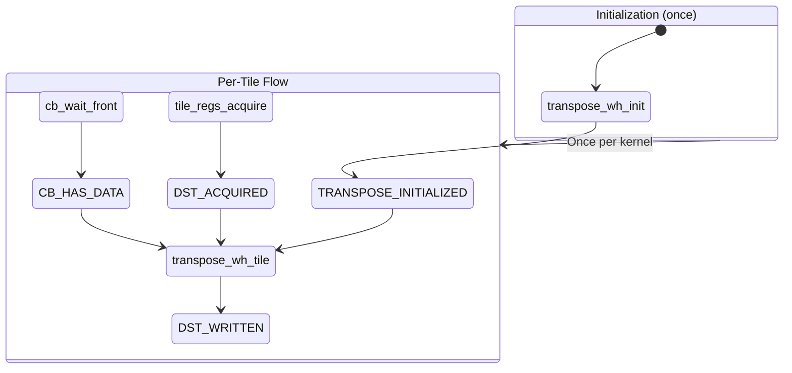

# LLK Primitive: transpose_wh_tile

Transform primitive that performs 32x32 in-tile transpose from CB to DST.

---

## Overview

```yaml
primitive:
  id: transpose_wh_tile
  category: transform
  header: "compute_kernel_api/transpose_wh.h"
```

**Mathematical Effect**:
```
DST[idst][w, h] = CB[icb][itile][h, w]
```

Performs a 32x32 transpose within a single tile, swapping width and height dimensions. Unlike `copy_tile`, this primitive reads directly from CB and transposes during the unpack operation.

---

## Signature

```cpp
// Header: compute_kernel_api/transpose_wh.h
namespace ckernel {

void transpose_wh_tile(uint32_t icb, uint32_t itile, uint32_t idst);

void transpose_wh_init(uint32_t icb, uint32_t ocb);       // Required init
void transpose_wh_init_short(uint32_t icb);               // Short init variant

}
```

### Parameters

| Parameter | Type | Description | Valid Range |
|-----------|------|-------------|-------------|
| `icb` | `uint32_t` | Source Circular Buffer index | 0-31 |
| `itile` | `uint32_t` | Tile index within CB's visible section | 0 to n-1 |
| `idst` | `uint32_t` | Destination slot in DST register | 0-7 |

---

## Data Flow Effect

```yaml
data_flow:
  operation: "Unpack with 32x32 in-tile transpose"

  inputs:
    - port: icb
      type: CB
      state: HAS_DATA
      format: "32x32 tile in row-major within tile"

    - port: itile
      type: uint32_t
      desc: "Tile index in CB"

  outputs:
    - port: dst
      type: DST
      slot: idst
      format: "32x32 tile with W/H swapped"
      state: WRITTEN

  effect: |
    # Transpose within 32x32 tile:
    for h in 0..32:
        for w in 0..32:
            DST[idst][w, h] = CB[icb][itile][h, w]
```

### Visual Representation

```
Input tile in CB:              Output tile in DST:
┌───────────────────┐          ┌───────────────────┐
│ a00 a01 a02 ... │          │ a00 a10 a20 ... │
│ a10 a11 a12 ... │   ───►   │ a01 a11 a21 ... │
│ a20 a21 a22 ... │          │ a02 a12 a22 ... │
│ ...             │          │ ...             │
└───────────────────┘          └───────────────────┘
     [h, w]                         [w, h]
```

---

## State Machine Requirements

### Required States Before Call

```yaml
requires:
  - DST_ACQUIRED           # From tile_regs_acquire()
  - CB_HAS_DATA            # From cb_wait_front()
  - TRANSPOSE_INITIALIZED  # From transpose_wh_init()
```

### Produced States After Call

```yaml
produces:
  - DST_WRITTEN    # DST contains transposed tile data
```

### State Transition Diagram



---

## Initialization

### Required Init Function

```yaml
init_function:
  name: transpose_wh_init
  signature: "void transpose_wh_init(uint32_t icb, uint32_t ocb)"
  required: true

  parameters:
    - { name: icb, desc: "Input CB index" }
    - { name: ocb, desc: "Output CB index (for PACK config)" }

  requires: []
  produces: [TRANSPOSE_INITIALIZED]

  notes: |
    Configures UNPACK, MATH, and PACK threads for transpose operation.
    Must be called once before any transpose_wh_tile calls.

    Internally:
    - Configures unpack for transpose mode
    - Sets up MATH thread for datacopy with transpose
    - Configures PACK thread for output CB
```

### Init Sequence for Transpose Patterns

```cpp
// For transpose + untilize pattern (e.g., convert_to_chw)
void init_transpose_untilize(uint32_t cb_in, uint32_t cb_transpose, uint32_t cb_out) {
    // Order matters!
    pack_untilize_init(cb_in, cb_transpose);   // Step 1
    transpose_wh_init(cb_in, cb_transpose);     // Step 2
    pack_untilize_dest_init<1>(cb_transpose);   // Step 3
}
```

### Short Init Variant

```yaml
init_variant:
  name: transpose_wh_init_short
  signature: "void transpose_wh_init_short(uint32_t icb)"

  use_case: |
    For switching between transpose and non-transpose operations
    without full reinitialization. Only reconfigures UNPACK and MATH.
```

---

## Parameter Transformations

### No Transformations Required

```yaml
transformations:
  - name: cb_index
    pattern: IDENTITY
    from: { name: cb_id, type: uint32_t }
    to: { name: icb, type: uint32_t }
    notes: "CB indices are direct hardware indices"

  - name: tile_index
    pattern: IDENTITY
    from: { name: tile_offset, type: uint32_t }
    to: { name: itile, type: uint32_t }
    notes: "Tile index within CB's visible section"

  - name: dst_slot
    pattern: IDENTITY
    from: { name: dst_idx, type: uint32_t }
    to: { name: idst, type: uint32_t }
    notes: "DST slot for transposed output"
```

---

## Usage Patterns

### Pattern 1: Simple Transpose

```cpp
// Single tile transpose
transpose_wh_init(cb_in, cb_out);

for (uint32_t tile = 0; tile < num_tiles; ++tile) {
    cb_wait_front(cb_in, 1);
    tile_regs_acquire();

    transpose_wh_tile(cb_in, 0, 0);  // Transpose CB[0] → DST[0]

    tile_regs_commit();
    cb_pop_front(cb_in, 1);

    tile_regs_wait();
    pack_tile(0, cb_out);
    tile_regs_release();
}
```

### Pattern 2: Batched Transpose (DST Batching)

```cpp
// Process multiple tiles per DST cycle
constexpr uint32_t BATCH_SIZE = 8;

transpose_wh_init(cb_in, cb_out);

uint32_t num_batches = num_tiles / BATCH_SIZE;
uint32_t leftover = num_tiles % BATCH_SIZE;

// Full batches
for (uint32_t batch = 0; batch < num_batches; ++batch) {
    cb_wait_front(cb_in, BATCH_SIZE);
    tile_regs_acquire();

    for (uint32_t i = 0; i < BATCH_SIZE; ++i) {
        transpose_wh_tile(cb_in, i, i);  // CB[i] → DST[i]
    }

    tile_regs_commit();
    cb_pop_front(cb_in, BATCH_SIZE);

    cb_reserve_back(cb_out, BATCH_SIZE);
    tile_regs_wait();

    for (uint32_t i = 0; i < BATCH_SIZE; ++i) {
        pack_tile(i, cb_out);
    }

    tile_regs_release();
    cb_push_back(cb_out, BATCH_SIZE);
}

// Leftover tiles (one at a time)
for (uint32_t i = 0; i < leftover; ++i) {
    cb_wait_front(cb_in, 1);
    tile_regs_acquire();
    transpose_wh_tile(cb_in, 0, 0);
    tile_regs_commit();
    cb_pop_front(cb_in, 1);

    cb_reserve_back(cb_out, 1);
    tile_regs_wait();
    pack_tile(0, cb_out);
    tile_regs_release();
    cb_push_back(cb_out, 1);
}
```

### Pattern 3: Transpose + Untilize (convert_to_chw)

```cpp
// Template helper for batched transpose+untilize
template <uint32_t N>
FORCE_INLINE void transpose_batch(
    uint32_t cb_in,
    uint32_t cb_out
) {
    cb_wait_front(cb_in, N);
    tile_regs_acquire();

    // Transpose N tiles to DST
    for (uint32_t i = 0; i < N; ++i) {
        transpose_wh_tile(cb_in, i, i);
    }

    tile_regs_commit();
    cb_pop_front(cb_in, N);

    cb_reserve_back(cb_out, N);
    tile_regs_wait();

    // Untilize from DST to output CB
    pack_untilize_dest<1>(cb_out, N);

    tile_regs_release();
    cb_push_back(cb_out, N);
}

void compute_main() {
    constexpr uint32_t BATCH_SIZE = 8;
    uint32_t cb_in = 0;
    uint32_t cb_out = 2;

    // Initialize
    pack_untilize_init(cb_in, cb_out);
    transpose_wh_init(cb_in, cb_out);
    pack_untilize_dest_init<1>(cb_out);

    uint32_t total_tiles = get_arg_val<uint32_t>(0);
    uint32_t num_batches = total_tiles / BATCH_SIZE;
    uint32_t leftover = total_tiles % BATCH_SIZE;

    for (uint32_t i = 0; i < num_batches; ++i) {
        transpose_batch<BATCH_SIZE>(cb_in, cb_out);
    }

    for (uint32_t i = 0; i < leftover; ++i) {
        transpose_batch<1>(cb_in, cb_out);
    }

    // Required cleanup
    pack_untilize_uninit(cb_out);
}
```

---

## Invariants

```yaml
invariants:
  - id: T1
    rule: "Transpose is within-tile only"
    description: "32x32 transpose, does not affect cross-tile layout"
    implication: "Tensor-level transpose requires multiple operations"

  - id: T2
    rule: "Direct CB read"
    description: "transpose_wh_tile reads directly from CB, not via copy_tile"
    implication: "Cannot use copy_tile + separate transpose"

  - id: T3
    rule: "Produces DST_WRITTEN not DST_HAS_DATA"
    description: "State reflects transformation, not just copy"
    implication: "Differentiates from copy_tile in state machine"

  - id: T4
    rule: "Init required before use"
    description: "transpose_wh_init must precede transpose_wh_tile"
    implication: "Unpack configured differently than copy_tile"
```

---

## Preconditions

```yaml
preconditions:
  - id: P1
    check: "icb in [0, 31]"
    reason: "Hardware supports 32 circular buffers"

  - id: P2
    check: "itile < n (from cb_wait_front(cb, n))"
    reason: "Can only access visible tiles in CB"

  - id: P3
    check: "idst <= 7"
    reason: "DST capacity for transform operations"

  - id: P4
    check: "transpose_wh_init() was called"
    reason: "Unpack must be configured for transpose"

  - id: P5
    check: "tile_regs_acquire() was called"
    reason: "DST must be in ACQUIRED state"
```

---

## Int32 Data Type Support

```yaml
int32_support:
  description: |
    transpose_wh_tile has special handling for Int32 data format.
    The implementation checks the source format and uses different
    code paths for Int32 vs float data.

  int32_path:
    - "Uses UnpackToDestEn for direct-to-dest unpack"
    - "Calls llk_math_transpose_dest for in-DST transpose"

  float_path:
    - "Standard unpack with transpose flag"
    - "No separate transpose step needed"
```

---

## Related Primitives

| Primitive | Relationship |
|-----------|--------------|
| `transpose_wh_init` | Required initialization |
| `copy_tile` | Non-transposing alternative |
| `pack_tile` | Standard output (tile format) |
| `pack_untilize_dest` | Alternative output (row-major) |
| `pack_untilize_uninit` | Cleanup if using untilize |

---

## Contrast with copy_tile

| Aspect | copy_tile | transpose_wh_tile |
|--------|-----------|-------------------|
| Transform | None (identity) | 32x32 W↔H swap |
| Init | Usually none needed | transpose_wh_init required |
| Output state | DST_HAS_DATA | DST_WRITTEN |
| Use case | Standard SFPU ops | Layout conversion |
| Header | tile_move_copy.h | transpose_wh.h |

---

## Use Cases

```yaml
use_cases:
  - name: "HWC to CHW conversion"
    description: "Image layout transformation"
    pattern: transpose_wh_tile + pack_untilize_dest

  - name: "Matrix transpose"
    description: "When tile-level transpose aligns with matrix transpose"
    pattern: transpose_wh_tile + pack_tile

  - name: "Attention key transpose"
    description: "K^T in attention mechanism"
    pattern: transpose_wh_tile in matmul prep
```
