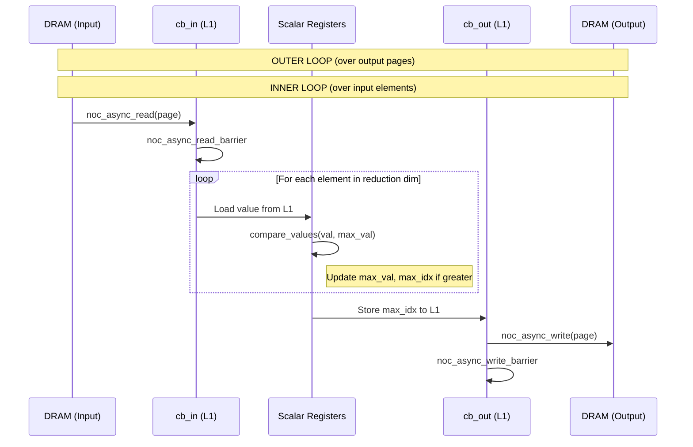
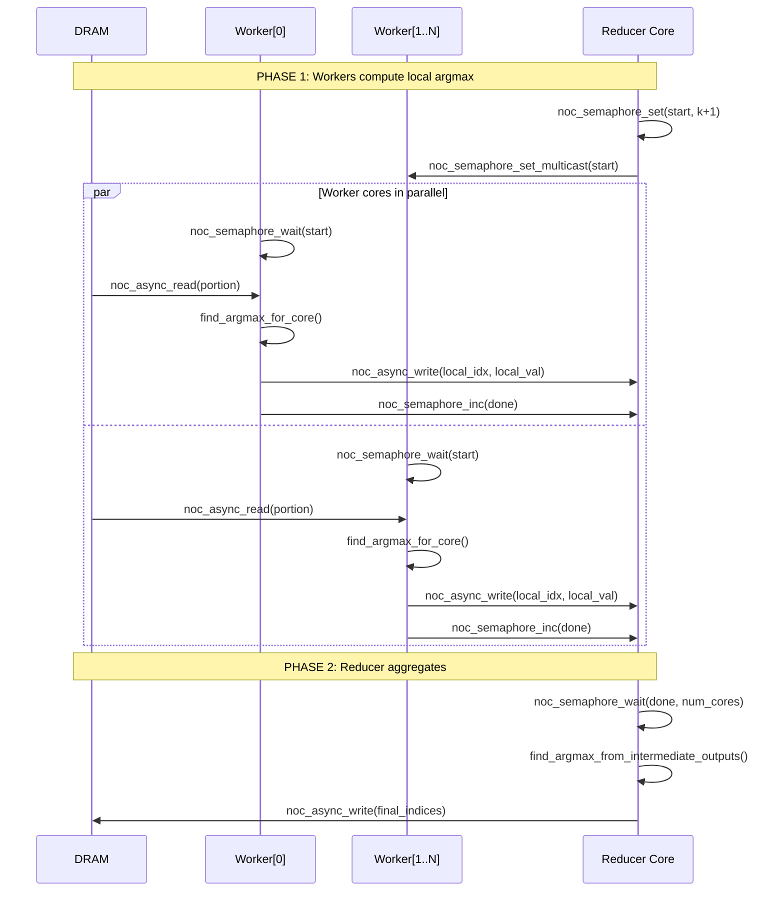
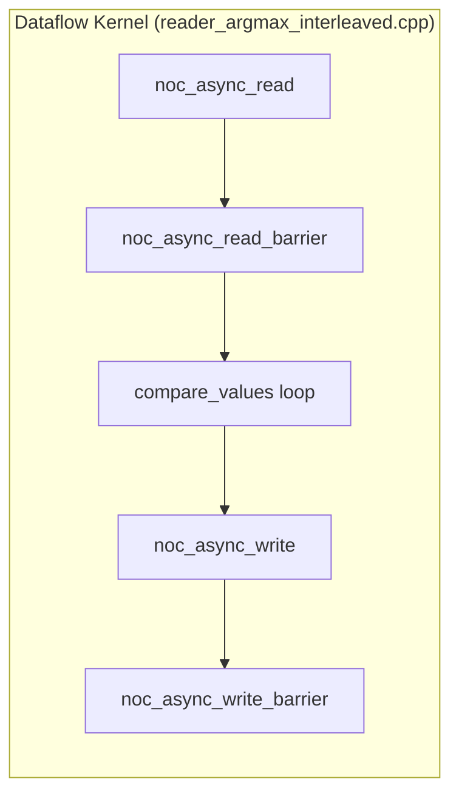
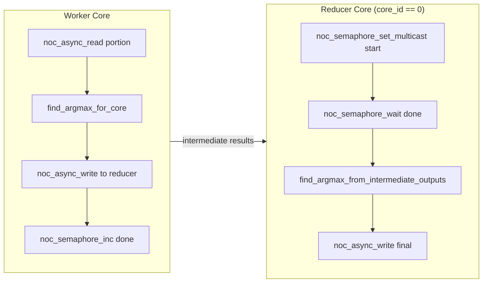
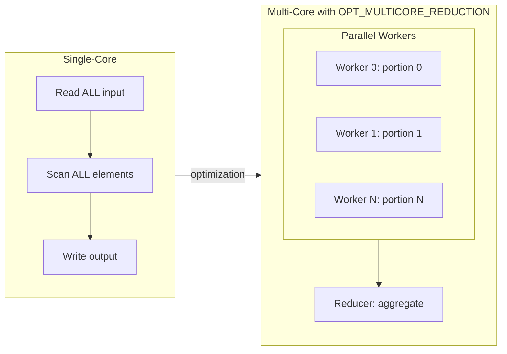
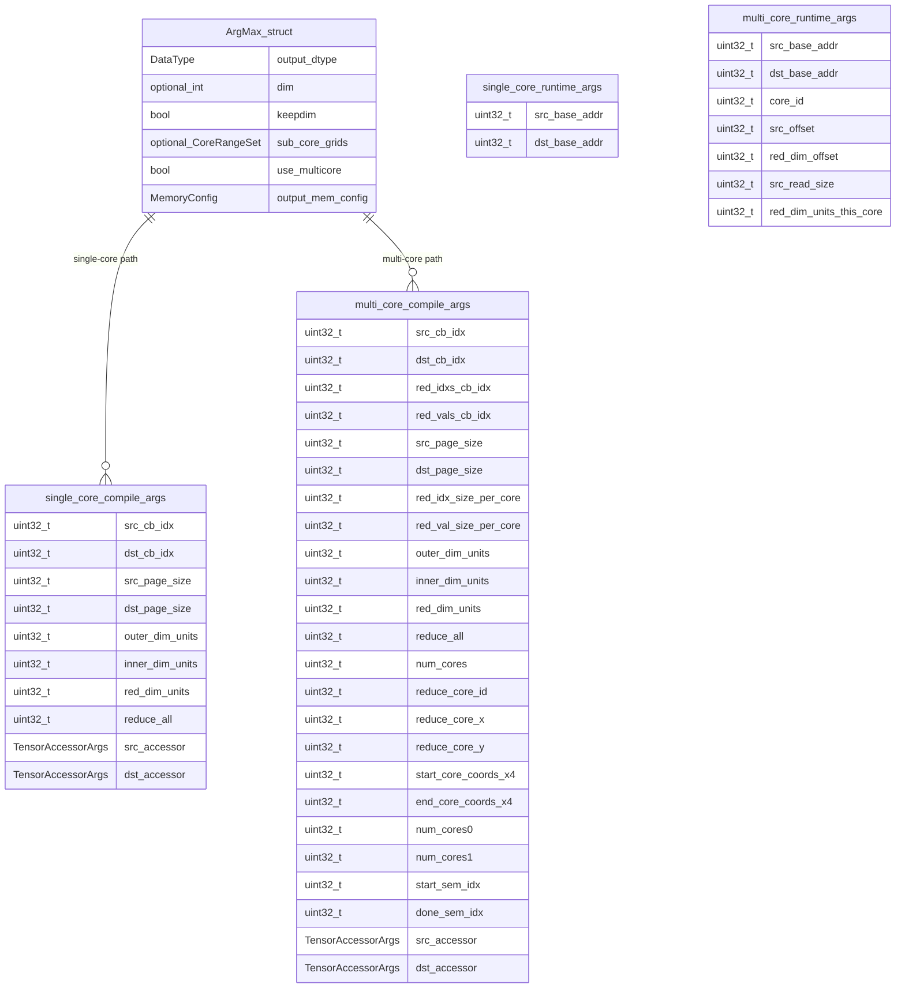

# ArgMax

Returns the indices of maximum values along a specified dimension.

---

## Section 1: Algorithm [HUMAN]

Pure mathematical transformation. No hardware details.

```yaml
algorithm:
  transformation: "Output = argmax(Input, dim)"

  preconditions:
    - { id: A1, entity: Input.memory_layout, attr: type, rel: "==", value: INTERLEAVED }
    - { id: A2, entity: Input.layout, attr: type, rel: "in", value: "[ROW_MAJOR, TILE]" }
    - { id: A3, entity: dim, attr: value, rel: "in", value: "[-rank, rank) or nullopt" }
    - { id: A4, entity: Input.dtype, rel: "in", value: "[BFLOAT16, FLOAT32, INT32, UINT32, UINT16] (ROW_MAJOR)" }
    - { id: A5, entity: Input.dtype, rel: "in", value: "[BFLOAT16, FLOAT32] (TILE)" }
    - { id: A6, entity: dim, attr: normalized, rel: "==", value: "rank-1 (only last dim supported)" }

  postconditions:
    - { id: O1, entity: Output.dtype, rel: "==", value: "UINT32" }
    - { id: O2, entity: Output.layout, rel: "==", value: "ROW_MAJOR" }
    - { id: O3, entity: Output.memory_layout, rel: "==", value: "INTERLEAVED" }
    - { id: O4, entity: Output.shape, rel: "==", expr: "keepdim ? Input.shape[dim=1] : squeeze(Input.shape, dim)" }

  attributes:
    - { name: dim, type: "optional<int>", desc: "Reduction dimension (nullopt reduces all dims)" }
    - { name: keepdim, type: bool, desc: "If true, reduced dim has size 1; if false, squeezed out" }
    - { name: use_multicore, type: bool, desc: "Enable multicore execution (ROW_MAJOR only)" }
    - { name: sub_core_grids, type: "optional<CoreRangeSet>", desc: "Custom core grid (up to 2 ranges)" }

  invariants:
    - { id: D1, rule: "For TILE layout, dim must be specified (reduce_all not supported)" }
    - { id: D2, rule: "Multicore only supported for ROW_MAJOR layout" }
    - { id: D3, rule: "Tie-breaking: smallest index wins when multiple max values exist" }
```

---

## Section 2: HW Strategy [HUMAN]

Hardware constraints. Pattern will be DERIVED in Section 3.

```yaml
hw_strategy:
  memory_layout: INTERLEAVED
  input_layout: ROW_MAJOR | TILE
  output_layout: ROW_MAJOR

  variants:
    single_core_row_major:
      conditions: ["use_multicore == false", "input_layout == ROW_MAJOR"]
      kernel: reader_argmax_interleaved.cpp

    multi_core_row_major:
      conditions: ["use_multicore == true", "input_layout == ROW_MAJOR"]
      kernel: reader_argmax_interleaved_multicore.cpp

    single_core_tile:
      conditions: ["input_layout == TILE"]
      kernel: reader_argmax_tile_layout.cpp
```

---

## Section 3: LLK Selection (Tetris Block Matching) [DERIVED]

This operation uses **NOC primitives only** - no SFPU compute primitives.
All computation is done via scalar operations in the dataflow kernel.

```yaml
llk_selection:
  # =========================================================================
  # REASONING (primitives_catalog.md search trace)
  # =========================================================================
  #
  # STAGE 1: Algorithm -> Compute Primitive
  # -------------------------------------------------------------------------
  # Search: "argmax reduction operation"
  # Query: transformation = "Output = argmax(Input, dim)"
  #
  # Result: NO SFPU primitive exists for argmax.
  # ArgMax is implemented as a scalar loop in dataflow kernel:
  #   - Read input data via NOC
  #   - Compare values using scalar comparisons (bfloat16_greater, etc.)
  #   - Track max value and index in registers
  #   - Write result indices via NOC
  #
  # This is a DATAFLOW-ONLY pattern - no compute kernel required.
  #
  # STAGE 2: Data Movement
  # -------------------------------------------------------------------------
  # No intermediate CB transfers between kernels.
  # Single dataflow kernel handles:
  #   - noc_async_read: DRAM → L1 (input CB)
  #   - Scalar comparison loop (in software)
  #   - noc_async_write: L1 (output CB) → DRAM
  #
  # STAGE 3: Memory Transfer (based on hw_strategy.memory_layout)
  # -------------------------------------------------------------------------
  # hw_strategy.memory_layout == INTERLEAVED
  #
  # For single-core:
  #   - Read input page by page
  #   - Process all elements in reduction dimension
  #   - Write output indices
  #
  # For multi-core:
  #   - Each worker reads portion of reduction dimension
  #   - Workers compute local argmax
  #   - Workers write partial results to reducer core via NOC
  #   - Reducer core aggregates and writes final output
  #   - Semaphores coordinate synchronization
  #
  # DERIVED: Pattern = DataflowOnly
  # =========================================================================

  # =========================================================================
  # BUSINESS LOGIC RESULT
  # =========================================================================
  pattern: DataflowOnly

  cb_allocation:
    single_core:
      cb_in: { index: c_0, role: "input data buffer" }
      cb_out: { index: c_1, role: "output indices buffer" }

    multi_core:
      cb_in: { index: c_0, role: "input data buffer (per-core portion)" }
      cb_out: { index: c_1, role: "final output indices (reducer core only)" }
      cb_red_idxs: { index: c_2, role: "intermediate indices from all cores" }
      cb_red_vals: { index: c_3, role: "intermediate max values from all cores" }

  init_chain: []  # No SFPU init required - dataflow only

  primitives_used:
    noc_read:
      - { fn: noc_async_read, effect: "DRAM page → L1 CB" }
      - { fn: noc_async_read_barrier, effect: "Wait for read completion" }
    noc_write:
      - { fn: noc_async_write, effect: "L1 CB → DRAM page" }
      - { fn: noc_async_write_barrier, effect: "Wait for write completion" }
    synchronization:
      - { fn: noc_semaphore_set, effect: "Initialize semaphore" }
      - { fn: noc_semaphore_wait, effect: "Block until semaphore reaches value" }
      - { fn: noc_semaphore_inc, effect: "Atomically increment semaphore" }
      - { fn: noc_semaphore_set_multicast, effect: "Broadcast semaphore to core range" }
    scalar_compute:
      - { fn: bfloat16_greater, effect: "Compare two bfloat16 values" }
      - { fn: float32_greater, effect: "Compare two float32 values" }
      - { fn: int32_greater, effect: "Compare two int32 values" }
```

### LLK Primitive Flow (Single-Core ROW_MAJOR)



### LLK Primitive Flow (Multi-Core ROW_MAJOR)



### LLK Primitive State Table (Single-Core)

| Step | Primitive | Effect |
|------|-----------|--------|
| 1 | `get_write_ptr(cb_in)` | Get L1 address for input CB |
| 2 | `get_write_ptr(cb_out)` | Get L1 address for output CB |
| 3 | `get_noc_addr(page, accessor)` | Compute DRAM address for page |
| 4 | `noc_async_read` | Read input page DRAM → L1 |
| 5 | `noc_async_read_barrier` | Wait for read completion |
| 6 | `compare_values` (loop) | Scalar max comparison |
| 7 | Store `max_idx` to cb_out | Write result to L1 |
| 8 | `noc_async_write` | Write output page L1 → DRAM |
| 9 | `noc_async_write_barrier` | Wait for write completion |

---

## Section 4: Kernel Boundaries [DERIVED]

```yaml
kernel_boundaries:
  # =========================================================================
  # ARCHITECTURE PATTERN SELECTION
  # =========================================================================
  # Pattern: DataflowOnly
  # Reason: ArgMax has no SFPU primitive. All computation done via scalar
  #         operations in dataflow kernel. No separate compute kernel.
  #
  # This differs from Reader-Compute-Writer pattern:
  # - No CB sync between kernels (cb_push_back/cb_wait_front boundaries)
  # - Single kernel handles read + compute + write
  # - All work done on RISC-V data movement processor
  # =========================================================================

  pattern: DataflowOnly

  single_core:
    kernel_count: 1
    kernel_type: ReaderDataMovementConfig
    kernel_files:
      row_major: "reader_argmax_interleaved.cpp"
      tile: "reader_argmax_tile_layout.cpp"

  multi_core:
    kernel_count: 1
    kernel_type: DataMovementConfig
    noc: NOC::RISCV_1_default
    kernel_file: "reader_argmax_interleaved_multicore.cpp"
    coordination:
      semaphore_start: "Signals workers to begin iteration"
      semaphore_done: "Workers signal completion to reducer"
      multicast: "Reducer broadcasts start signal"
```

### Kernel Boundaries Diagram (Single-Core)

No kernel boundaries - single unified dataflow kernel:



### Kernel Boundaries Diagram (Multi-Core)

All cores run same kernel with different roles:



---

## Section 5: Optimizations Applied

```yaml
optimizations_applied:
  - id: OPT_MULTICORE_REDUCTION
    brief: "Parallel reduction across cores with final aggregation"
    description: |
      Work is distributed across cores. Each core processes a portion of
      the reduction dimension, computing local argmax. Results are gathered
      on a designated reducer core which performs final aggregation.

  - id: OPT_ALIGNED_READ
    brief: "NOC-aligned read sizes for efficient transfers"
    description: |
      min_red_dim_units_per_core is calculated based on alignment requirements
      (DRAM: 32 bytes, L1: 16 bytes). Ensures each core reads aligned chunks
      to avoid unaligned NOC transactions.
```

### Optimization Diagram: Multicore Reduction



---

## Section 6: C++ Binding

### C++ Binding ER Diagram



```yaml
cpp_binding:
  namespace: "ttnn::operations::reduction"
  prim_name: "ttnn::argmax"

  files:
    device_op: "device/argmax_op"
    program_factory: "device/argmax_program_factory"
    interface: "argmax"

types:
  operation_attributes:
    - { name: output_dtype, type: DataType, value: "UINT32" }
    - { name: dim, type: "optional<int>" }
    - { name: keepdim, type: bool }
    - { name: sub_core_grids, type: "optional<CoreRangeSet>" }
    - { name: use_multicore, type: bool }
    - { name: output_mem_config, type: MemoryConfig }
  tensor_args:
    - { name: input, type: "const Tensor&" }
    - { name: optional_output, type: "optional<Tensor>" }

circular_buffers:
  single_core:
    - { name: cb_in, index: c_0, num_tiles: 1, page_size: "src_page_size" }
    - { name: cb_out, index: c_1, num_tiles: 1, page_size: "dst_page_size" }

  multi_core:
    - { name: cb_in, index: c_0, page_size: "red_dim_units * input_unit_size" }
    - { name: cb_out, index: c_1, page_size: "dst_page_size" }
    - { name: cb_red_idxs, index: c_2, page_size: "red_idx_size_per_core * num_cores" }
    - { name: cb_red_vals, index: c_3, page_size: "red_val_size_per_core * num_cores" }

kernels:
  single_core_row_major:
    path: "device/kernels/reader_argmax_interleaved.cpp"
    type: ReaderDataMovementConfig
    compile_args:
      - { idx: 0, name: src_cb_idx, value: "c_0" }
      - { idx: 1, name: dst_cb_idx, value: "c_1" }
      - { idx: 2, name: src_page_size }
      - { idx: 3, name: dst_page_size }
      - { idx: 4, name: outer_dim_units }
      - { idx: 5, name: inner_dim_units }
      - { idx: 6, name: red_dim_units }
      - { idx: 7, name: reduce_all }
      - { idx: 8+, name: TensorAccessorArgs_src }
      - { idx: N+, name: TensorAccessorArgs_dst }
    runtime_args:
      - { idx: 0, name: src_base_addr }
      - { idx: 1, name: dst_base_addr }

  single_core_tile:
    path: "device/kernels/reader_argmax_tile_layout.cpp"
    type: ReaderDataMovementConfig
    compile_args:
      - { idx: 0, name: src_cb_idx, value: "c_0" }
      - { idx: 1, name: dst_cb_idx, value: "c_1" }
      - { idx: 2, name: src_page_size }
      - { idx: 3, name: dst_page_size }
      - { idx: 4, name: tile_height, value: "TILE_HEIGHT" }
      - { idx: 5, name: tile_width, value: "TILE_WIDTH" }
      - { idx: 6, name: input_height, desc: "h_tiles" }
      - { idx: 7, name: input_width, desc: "w_tiles" }
      - { idx: 8, name: logical_height }
      - { idx: 9, name: logical_width }
      - { idx: 10, name: outer_dim_size }
      - { idx: 11, name: reduce_all }
      - { idx: 12, name: keepdim }
      - { idx: 13+, name: TensorAccessorArgs }
    runtime_args:
      - { idx: 0, name: src_base_addr }
      - { idx: 1, name: dst_base_addr }

  multi_core:
    path: "device/kernels/reader_argmax_interleaved_multicore.cpp"
    type: DataMovementConfig
    processor: RISCV_1
    noc: RISCV_1_default
    compile_args:
      - { idx: 0, name: src_cb_idx, value: "c_0" }
      - { idx: 1, name: dst_cb_idx, value: "c_1" }
      - { idx: 2, name: red_idxs_cb_idx, value: "c_2" }
      - { idx: 3, name: red_vals_cb_idx, value: "c_3" }
      - { idx: 4, name: src_page_size }
      - { idx: 5, name: dst_page_size }
      - { idx: 6, name: red_idx_size_per_core }
      - { idx: 7, name: red_val_size_per_core }
      - { idx: 8, name: outer_dim_units }
      - { idx: 9, name: inner_dim_units }
      - { idx: 10, name: red_dim_units }
      - { idx: 11, name: reduce_all }
      - { idx: 12, name: num_cores }
      - { idx: 13, name: reduce_core_id }
      - { idx: 14, name: reduce_core_x }
      - { idx: 15, name: reduce_core_y }
      - { idx: 16-19, name: "core_range_0 (end_x, end_y, start_x, start_y)" }
      - { idx: 20-23, name: "core_range_1 (end_x, end_y, start_x, start_y)" }
      - { idx: 24, name: num_cores_range0 }
      - { idx: 25, name: num_cores_range1 }
      - { idx: 26, name: start_sem_idx }
      - { idx: 27, name: done_sem_idx }
      - { idx: 28+, name: TensorAccessorArgs }
    runtime_args:
      - { idx: 0, name: src_base_addr }
      - { idx: 1, name: dst_base_addr }
      - { idx: 2, name: core_id }
      - { idx: 3, name: src_offset }
      - { idx: 4, name: red_dim_offset }
      - { idx: 5, name: src_read_size }
      - { idx: 6, name: red_dim_units_this_core }

semaphores:
  - { name: start_sem, purpose: "Reducer signals workers to start iteration" }
  - { name: done_sem, purpose: "Workers signal completion to reducer" }
```

---

## Section 7: Implementation Notes [REFERENCE]

```yaml
implementation_notes:
  kernel_sources:
    single_core_rm: "ttnn/cpp/ttnn/operations/reduction/argmax/device/kernels/reader_argmax_interleaved.cpp"
    multi_core: "ttnn/cpp/ttnn/operations/reduction/argmax/device/kernels/reader_argmax_interleaved_multicore.cpp"
    tile_layout: "ttnn/cpp/ttnn/operations/reduction/argmax/device/kernels/reader_argmax_tile_layout.cpp"
    common_header: "ttnn/cpp/ttnn/operations/reduction/argmax/device/kernels/argmax_common.hpp"
    tile_header: "ttnn/cpp/ttnn/operations/reduction/argmax/device/kernels/argmax_tile_layout.hpp"

  pre_tmp_structure:
    style: "Old operation::run pattern with struct-based API"
    migration_needed: "Convert to TMP DeviceOperation interface"
    key_differences:
      - "Uses ArgMax struct instead of operation_attributes_t/tensor_args_t"
      - "validate_with_output_tensors instead of validate_on_program_cache_miss"
      - "create_program returns ProgramWithCallbacks directly"

  dataflow_only_pattern:
    description: |
      This operation does NOT use compute kernels. All work is done in
      dataflow kernels using scalar operations on RISC-V processor.
      This is because there is no SFPU primitive for argmax - it requires
      conditional branching that SFPU does not support efficiently.
    implications:
      - "No tile_regs_acquire/commit/wait/release"
      - "No copy_tile/pack_tile"
      - "No init_sfpu or SFPU init functions"
      - "All comparison done via scalar C++ code"

  multicore_coordination:
    pattern: "Worker-Reducer with semaphore sync"
    reducer_core: "Core 0 (configurable via reduce_core_id)"
    semaphore_protocol:
      start_signal: "Reducer multicasts to workers for each outer iteration"
      done_signal: "Workers atomically increment; reducer waits for num_cores"
    data_exchange: "Workers write local (idx, val) to reducer's L1 via NOC"

  supported_data_formats:
    row_major: [BFLOAT16, FLOAT32, INT32, UINT32, UINT16]
    tile: [BFLOAT16, FLOAT32]
    comparison_functions:
      Float16_b: bfloat16_greater
      Float32: float32_greater
      Int32: int32_greater
      UInt16: "lambda: a > b"
      UInt32: "lambda: a > b"

  current_limitations:
    - "Only last dimension reduction supported (normalized_dim == rank-1)"
    - "reduce_all (dim=nullopt) not supported for TILE layout"
    - "Multicore only for ROW_MAJOR layout"
    - "sub_core_grids limited to 2 CoreRange objects"

  tile_layout_specifics:
    face_iteration: "Iterates over 4 faces per tile (16x16 each)"
    padding_handling: "Tracks tile/face remainders to skip padding data"
    output_accumulation: "Buffers output in stack array before writing"

  constants:
    face_width: 16
    face_height: 16
    face_size: 256
    tile_width: 32
    tile_height: 32
```

---

## Validation Checklist

| Item | Status | Notes |
|------|--------|-------|
| Init sequence | N/A | No SFPU init - dataflow only |
| Loop structure | Matches | outer_dim × inner_dim × red_dim |
| CB indices | Matches | c_0=in, c_1=out, c_2/c_3=intermediate |
| Compile args order | Matches | Verified against kernel source |
| Runtime args order | Matches | Verified against kernel source |
| Primitive calls | N/A | Uses NOC primitives, not LLK compute |
| Types | Matches | ArgMax struct fields verified |
