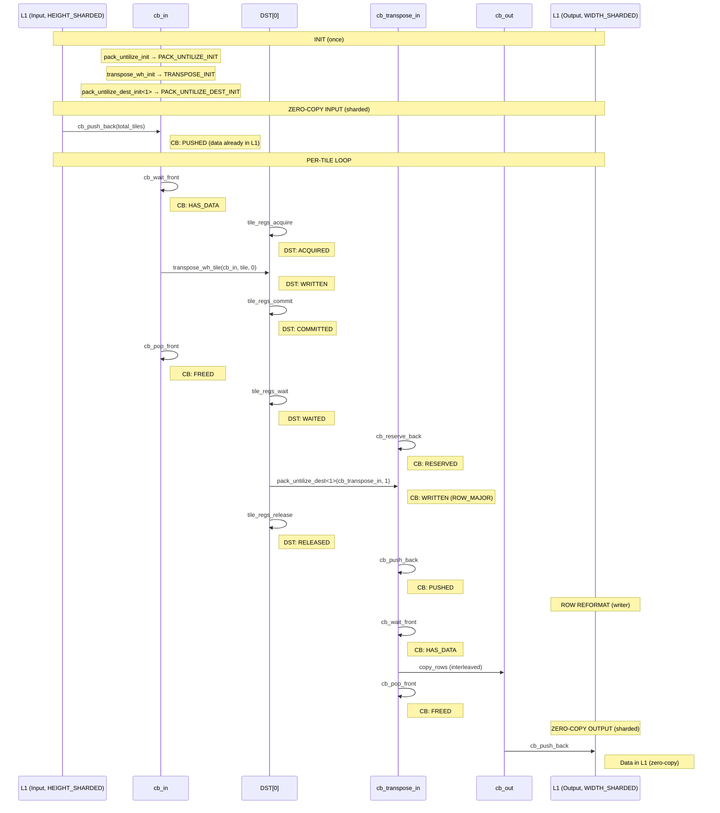
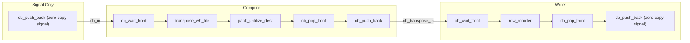
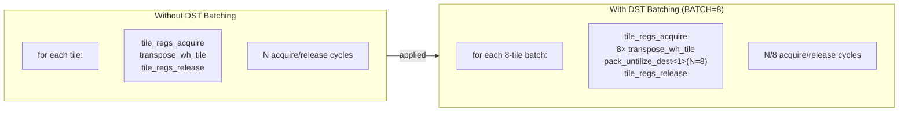
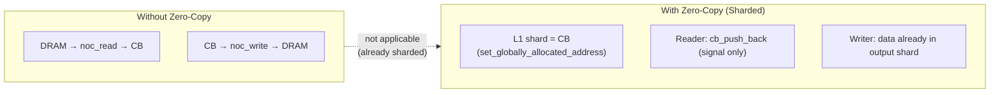
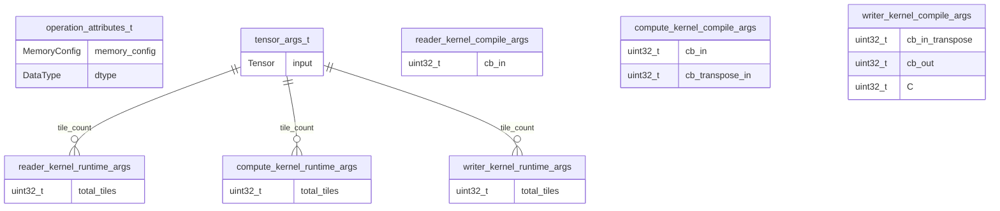

# Convert to CHW

Reorders tensor from HWC layout to CHW layout.

---

## Section 1: Algorithm [HUMAN]

Pure mathematical transformation. No hardware details.

```yaml
algorithm:
  transformation: "Output[b, 1, c, hw] = Input[b, 1, hw, c]"

  preconditions:
    - { id: A1, entity: Input.shape, attr: rank, rel: "==", value: 4 }
    - { id: A2, entity: "Input.shape[0]", attr: value, rel: "==", value: 1, desc: "Batch size must be 1" }
    - { id: A3, entity: "Input.shape[1]", attr: value, rel: "==", value: 1, desc: "Second dim must be 1" }
    - { id: A4, entity: "Input.shape[3]", attr: value, rel: "<=", value: 32, desc: "C <= TILE_HEIGHT" }
    - { id: A5, entity: "Input.shape[2]", attr: divisibility, rel: "%", value: 32, desc: "HW divisible by TILE_WIDTH" }

  postconditions:
    - { id: O1, entity: Output.shape, rel: "==", expr: "[B, 1, C, HW]" }
    - { id: O2, entity: Output.dtype, rel: "==", expr: "Input.dtype or specified" }

  invariants:
    - { id: I1, rule: "output.volume == input.volume" }
    - { id: I2, rule: "Preserves element values, only reorders" }
```

---

## Section 2: HW Strategy [HUMAN]

Hardware constraints. Pattern will be DERIVED in Section 3.

```yaml
hw_strategy:
  input_memory_layout: HEIGHT_SHARDED
  output_memory_layout: WIDTH_SHARDED
  input_layout: TILE
  output_layout: ROW_MAJOR

  preconditions:
    - { id: H1, entity: Input, attr: memory_layout, rel: "==", value: HEIGHT_SHARDED }
    - { id: H2, entity: Input, attr: layout, rel: "==", value: TILE }
    - { id: H3, entity: "Input.shard_spec.shape[0]", attr: divisibility, rel: "%", value: 32 }
    - { id: H4, entity: Output, attr: memory_layout, rel: "==", value: WIDTH_SHARDED }
    - { id: H5, entity: Output, attr: layout, rel: "==", value: ROW_MAJOR }
```

---

## Section 3: LLK Selection (Tetris Block Matching) [DERIVED]

LLK primitives selected by matching algorithm requirements to primitive effects.

```yaml
llk_selection:
  # =========================================================================
  # REASONING (primitives_catalog.md search trace)
  # =========================================================================
  #
  # STAGE 1: Algorithm -> Compute Primitives
  # -------------------------------------------------------------------------
  # The algorithm requires:
  # 1. Transpose within each tile (swap W/H dimensions)
  # 2. Convert from TILE format to ROW_MAJOR format (untilize)
  #
  # Search: "in-tile transpose, swap W/H"
  # Found: transpose_wh_tile
  #   - category: transform
  #   - signature: void transpose_wh_tile(uint32_t icb, uint32_t itile, uint32_t idst)
  #   - requires: DST[idst]: ACQUIRED, CB[icb]: HAS_DATA, SFPU: TRANSPOSE_INITIALIZED
  #   - produces: DST[idst]: WRITTEN
  #   - effect: "DST[idst] = transpose(CB[icb][itile])"
  #   - init_dependency: transpose_wh_init
  #
  # Search: "TILE -> ROW_MAJOR conversion, untilize from DST"
  # Found: pack_untilize_dest
  #   - category: data_movement
  #   - signature: void pack_untilize_dest<block_ct_dim>(uint32_t ocb, uint32_t block_rt_dim)
  #   - requires: DST[0..N]: WAITED, CB[ocb]: RESERVED, SFPU: PACK_UNTILIZE_DEST_INITIALIZED
  #   - produces: CB[ocb]: WRITTEN
  #   - effect: "CB[ocb] = untilize(DST[0..N])"
  #   - init_dependency: pack_untilize_dest_init
  #
  # Selected: transpose_wh_tile + pack_untilize_dest
  #
  # STAGE 2: Data Movement (satisfy compute primitive requirements)
  # -------------------------------------------------------------------------
  # transpose_wh_tile requires DST[idst]: ACQUIRED
  # Search: "produces DST: ACQUIRED"
  # Found: tile_regs_acquire
  #   - requires: DST[0..7]: RELEASED
  #   - produces: DST[0..7]: ACQUIRED
  #
  # transpose_wh_tile requires CB[icb]: HAS_DATA
  # Note: transpose_wh_tile reads directly from CB, NOT via copy_tile
  # Search: "produces CB: HAS_DATA" (in compute kernel context)
  # Found: cb_wait_front
  #   - requires: CB[cbid]: any (producer pushed data)
  #   - produces: CB[cbid]: HAS_DATA
  #
  # transpose_wh_tile produces DST[idst]: WRITTEN
  #
  # pack_untilize_dest requires DST[0..N]: WAITED
  # Search: "produces DST: WAITED"
  # Found: tile_regs_wait
  #   - requires: DST[0..7]: COMMITTED
  #   - produces: DST[0..7]: WAITED
  #
  # tile_regs_wait requires DST: COMMITTED
  # Search: "produces DST: COMMITTED"
  # Found: tile_regs_commit
  #   - requires: DST[0..7]: ACQUIRED|HAS_DATA|MODIFIED|WRITTEN
  #   - produces: DST[0..7]: COMMITTED
  #
  # pack_untilize_dest requires CB[ocb]: RESERVED
  # Search: "produces CB: RESERVED"
  # Found: cb_reserve_back
  #   - requires: CB[cbid]: any
  #   - produces: CB[cbid]: RESERVED
  #
  # pack_untilize_dest produces CB[ocb]: WRITTEN
  #
  # After pack_untilize_dest, signal writer: cb_push_back
  #   - requires: CB[cbid]: WRITTEN
  #   - produces: CB[cbid]: PUSHED
  #
  # After transpose_wh_tile consumes CB, release: cb_pop_front
  #   - requires: CB[cbid]: HAS_DATA
  #   - produces: CB[cbid]: FREED
  #
  # After pack_untilize_dest, release DST: tile_regs_release
  #   - requires: DST[0..7]: WAITED
  #   - produces: DST[0..7]: RELEASED
  #
  # Note: This is different from eltwise_unary pattern:
  # - transpose_wh_tile: CB -> DST (direct, not via copy_tile)
  # - pack_untilize_dest: DST -> CB (untilized format)
  #
  # STAGE 3: Memory Transfer (based on hw_strategy)
  # -------------------------------------------------------------------------
  # hw_strategy.input_memory_layout == HEIGHT_SHARDED
  # -> Input already in L1, no DRAM read needed
  # -> Zero-copy pattern: cb_in globally allocated to input.buffer()
  # -> Reader kernel only signals (cb_push_back), no data movement
  # -> Implies: Signal-Compute-Writer pattern (signal-only reader)
  #
  # hw_strategy.output_memory_layout == WIDTH_SHARDED
  # -> Output already in L1, no DRAM write needed
  # -> Zero-copy pattern: cb_out globally allocated to output.buffer()
  # -> Writer kernel reformats and signals, no DRAM write
  # -> But intermediate cb_transpose_in still needs writer to consume
  #
  # DERIVED: Pattern = Signal-Compute-Writer (sharded zero-copy)
  #
  # Init chain derivation:
  # -------------------------------------------------------------------------
  # transpose_wh_tile requires SFPU: TRANSPOSE_INITIALIZED
  #   -> needs transpose_wh_init
  #
  # pack_untilize_dest requires SFPU: PACK_UNTILIZE_DEST_INITIALIZED
  #   -> needs pack_untilize_dest_init
  #   -> pack_untilize_dest_init requires SFPU: PACK_UNTILIZE_INITIALIZED
  #   -> needs pack_untilize_init
  #
  # Cleanup required:
  #   -> pack_untilize_uninit (deprecated, tt-metal#22904)
  #
  # =========================================================================

  # =========================================================================
  # BUSINESS LOGIC RESULT
  # =========================================================================
  cb_allocation:
    cb_in: { index: c_0, direction: consumer, zero_copy: true }
    cb_transpose_in: { index: c_2, direction: producer }
    cb_out: { index: c_1, direction: producer, zero_copy: true }

  init_chain:
    - { fn: pack_untilize_init, produces: PACK_UNTILIZE_INIT }
    - { fn: transpose_wh_init, produces: TRANSPOSE_INIT }
    - { fn: pack_untilize_dest_init<1>, produces: PACK_UNTILIZE_DEST_INIT }

  cleanup_chain:
    - { fn: pack_untilize_uninit, deprecated: "tt-metal#22904" }
```

### LLK Primitive Flow (per tile)



### LLK Primitive State Table

| Step | Primitive | Requires | Produces | Effect |
|------|-----------|----------|----------|--------|
| 1 | `pack_untilize_init` | HW_INIT | PACK_UNTILIZE_INIT | Configure untilize |
| 2 | `transpose_wh_init` | HW_INIT | TRANSPOSE_INIT | Configure transpose |
| 3 | `pack_untilize_dest_init<1>` | PACK_UNTILIZE_INIT | PACK_UNTILIZE_DEST_INIT | Configure dest untilize |
| 4 | `cb_push_back` (signal) | L1 sharded | CB: PUSHED | Signal input ready (zero-copy) |
| 5 | `cb_wait_front` | CB: PUSHED | CB: HAS_DATA | Wait for cb_in |
| 6 | `tile_regs_acquire` | DST: RELEASED | DST: ACQUIRED | Lock DST |
| 7 | `transpose_wh_tile` | DST: ACQUIRED, CB: HAS_DATA, TRANSPOSE_INIT | DST: WRITTEN | cb_in→DST (transposed) |
| 8 | `tile_regs_commit` | DST: WRITTEN | DST: COMMITTED | Signal PACK |
| 9 | `cb_pop_front` | CB: HAS_DATA | CB: FREED | Release cb_in |
| 10 | `tile_regs_wait` | DST: COMMITTED | DST: WAITED | Wait for PACK |
| 11 | `cb_reserve_back` | - | CB: RESERVED | Reserve cb_transpose_in |
| 12 | `pack_untilize_dest<1>` | DST: WAITED, CB: RESERVED, PACK_UNTILIZE_DEST_INIT | CB: WRITTEN | DST→cb_transpose_in |
| 13 | `tile_regs_release` | DST: WAITED | DST: RELEASED | Unlock DST |
| 14 | `cb_push_back` | CB: WRITTEN | CB: PUSHED | Signal transpose ready |
| 15 | `cb_wait_front` | CB: PUSHED | CB: HAS_DATA | Wait for cb_transpose_in |
| 16 | `copy_rows` | CB: HAS_DATA | cb_out filled | Interleave rows |
| 17 | `cb_pop_front` | CB: HAS_DATA | CB: FREED | Release cb_transpose_in |
| 18 | `cb_push_back` | cb_out ready | L1 ready | Signal output (zero-copy) |
| 19 | `pack_untilize_uninit` | - | - | Cleanup (deprecated) |

---

## Section 4: Kernel Boundaries [DERIVED]

```yaml
kernel_boundaries:
  # =========================================================================
  # ARCHITECTURE PATTERN SELECTION
  # =========================================================================
  # Pattern: Signal-Compute-Writer (selected in reference implementation)
  # Reason: HEIGHT_SHARDED input and WIDTH_SHARDED output mean data is
  #         already in L1 (zero-copy). Reader only signals data ready,
  #         Writer reformats without DRAM access.
  #
  # Alternative patterns:
  # - Reader-Compute-Writer: Applicable (would do explicit DRAM reads)
  #   Not used because input is sharded (zero-copy).
  # - Signal-Compute-Signal: Applicable if writer only signals.
  #   Not used because writer does row reordering.
  # =========================================================================

  pattern: Signal-Compute-Writer
```

### Kernel Boundaries Diagram

Kernel boundaries are at `cb_push_back` → `cb_wait_front` transitions:



---

## Section 5: Optimizations Applied

```yaml
optimizations_applied:
  - id: OPT_DST_BATCH
    brief: "Process 8 tiles per DST acquire/release cycle"
    ref: "Common_Optimizations.md#dst-batching"

  - id: ZERO_COPY
    brief: "CBs globally allocated to sharded tensor buffers"
```

### OPT_DST_BATCH (Applied)



### ZERO_COPY (Applied - Sharded Memory)



---

## Section 6: C++ Binding

### C++ Binding ER Diagram



```yaml
cpp_binding:
  namespace: "ttnn::operations::experimental::cnn::to_chw"
  prim_name: "ttnn::prim::convert_to_chw"

types:
  operation_attributes:
    - { name: memory_config, type: MemoryConfig }
    - { name: dtype, type: DataType }
  tensor_args:
    - { name: input, type: Tensor }

circular_buffers:
  - { name: cb_in, index: c_0, zero_copy: true }
  - { name: cb_transpose_in, index: c_2 }
  - { name: cb_out, index: c_1, zero_copy: true }

kernels:
  reader:
    path: "device/kernels/reader_convert_to_chw.cpp"
    compile_args:
      - { idx: 0, name: cb_in, value: "c_0" }
    runtime_args:
      - { idx: 0, name: total_tiles }

  compute:
    path: "device/kernels/convert_to_chw.cpp"
    compile_args:
      - { idx: 0, name: cb_in, value: "c_0" }
      - { idx: 1, name: cb_transpose_in, value: "c_2" }
    runtime_args:
      - { idx: 0, name: total_tiles }

  writer:
    path: "device/kernels/writer_convert_to_chw.cpp"
    compile_args:
      - { idx: 0, name: cb_in_transpose, value: "c_2" }
      - { idx: 1, name: cb_out, value: "c_1" }
      - { idx: 2, name: C, source: "input_shape[3]" }
    runtime_args:
      - { idx: 0, name: total_tiles }
```

---

## Section 7: Implementation Notes [REFERENCE]

```yaml
implementation_notes:
  kernel_source: "ttnn/cpp/ttnn/operations/experimental/cnn/convert_to_chw/device/kernels/convert_to_chw.cpp"

  # DST batching implementation
  dst_batching:
    applied: true
    batch_size: 8
    helper_template: "transpose<N>"
    main_loop: "transpose<8> for full batches"
    leftover_loop: "transpose<1> for remaining tiles"

  # CB naming
  cb_naming:
    cb_in: "c_0 - input (zero-copy from sharded input)"
    cb_transpose_in: "c_2 - intermediate untilized data"
    cb_out: "c_1 - output (zero-copy to sharded output)"
    note: "cb_transpose_in is passed to init functions, not cb_out"

  # Writer kernel role
  writer_role:
    purpose: "Reads untilized rows from cb_transpose_in, writes in CHW order to cb_out"
    implements: "Row extraction and channel-wise reordering"
    constants:
      TILE_SIZE: 32
      ELEMENT_SIZE_BYTES: 2
      STICK_SIZE: "TILE_SIZE * ELEMENT_SIZE_BYTES = 64"

  # Zero-copy pattern
  zero_copy:
    input: "set_globally_allocated_address(cb_in, input.buffer())"
    output: "set_globally_allocated_address(cb_out, output.buffer())"
    reader_kernel: "Only calls cb_push_back(cb_in, total_tiles) - signal, no read"

  # Deprecation tracking
  deprecation:
    issue: "tt-metal#22904"
    affected: [pack_untilize_uninit]
    removal_target: "End of 2025"
```
