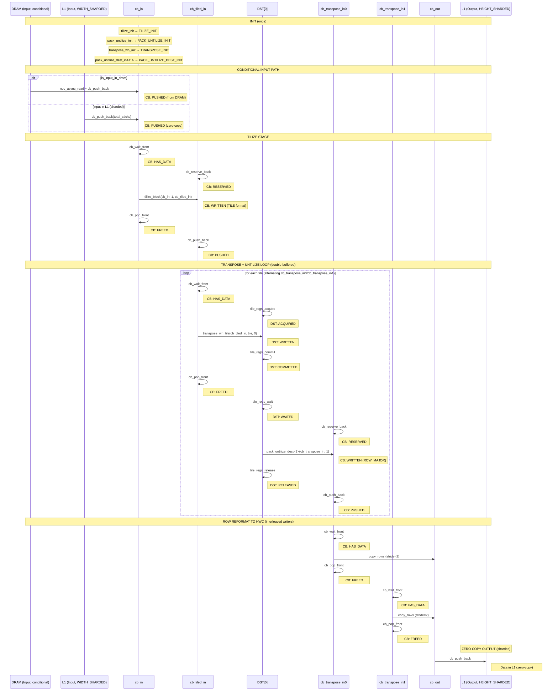
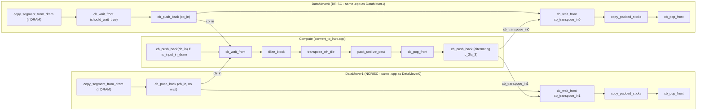
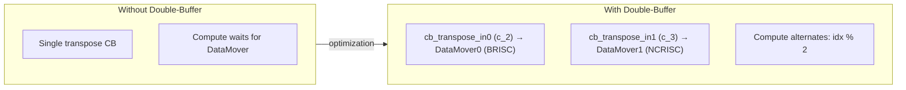
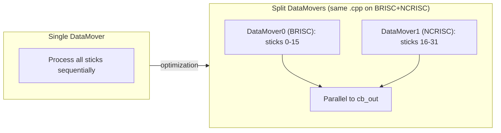
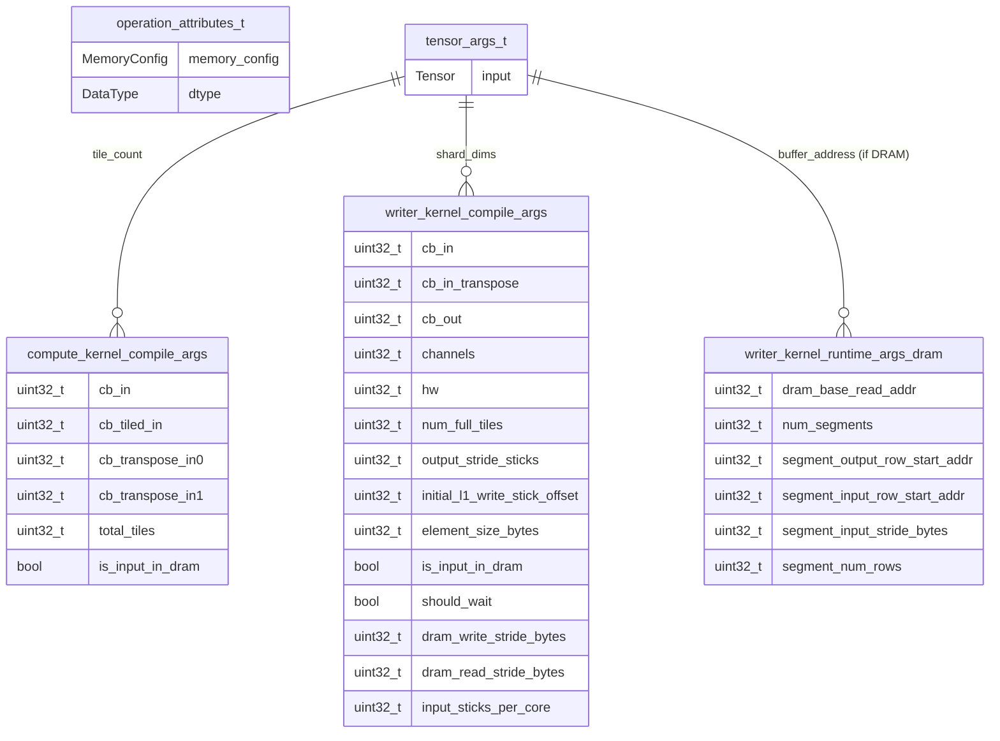

# Convert to HWC

Reorders tensor from CHW layout to HWC layout.

---

## Section 1: Algorithm [HUMAN]

Pure mathematical transformation. No hardware details.

```yaml
algorithm:
  transformation: "Output[b, 1, hw, c] = Input[b, 1, c, hw]"

  preconditions:
    - { id: A1, entity: Input.shape, attr: rank, rel: "==", value: 4 }
    - { id: A2, entity: "Input.shape[0]", attr: value, rel: "==", value: 1, desc: "Batch size must be 1" }
    - { id: A3, entity: "Input.shape[1]", attr: value, rel: "==", value: 1, desc: "Second dim must be 1" }
    - { id: A4, entity: "Input.shape[2]", attr: value, rel: "<=", value: 32, desc: "C <= TILE_HEIGHT" }
    - { id: A5, entity: "Input.shape[3]", attr: divisibility, rel: "%", value: 32, desc: "HW divisible by TILE_WIDTH" }

  postconditions:
    - { id: O1, entity: Output.shape, rel: "==", expr: "[B, 1, HW, C_padded]" }
    - { id: O2, entity: Output.dtype, rel: "==", expr: "Input.dtype or specified" }
    - { id: O3, entity: "Output.shape[3]", attr: alignment, rel: "==", expr: "round_up(C, L1_alignment)" }

  invariants:
    - { id: I1, rule: "output.volume >= input.volume (due to C padding)" }
    - { id: I2, rule: "Preserves element values, only reorders with padding" }
```

---

## Section 2: HW Strategy [HUMAN]

Hardware constraints. Pattern will be DERIVED in Section 3.

```yaml
hw_strategy:
  input_memory_layout: WIDTH_SHARDED
  output_memory_layout: HEIGHT_SHARDED
  input_layout: ROW_MAJOR
  output_layout: ROW_MAJOR

  preconditions:
    - { id: H1, entity: Input, attr: layout, rel: "==", value: ROW_MAJOR }
    - { id: H2, entity: Input, attr: sharding, rel: "==", value: WIDTH_SHARDED }
    - { id: H3, entity: Output, attr: sharding, rel: "==", value: HEIGHT_SHARDED }
    - { id: H4, entity: "l1_input_shard_height", attr: value, rel: "<=", value: 32, desc: "TILE_HEIGHT" }
    - { id: H5, entity: "l1_input_shard_width", attr: divisibility, rel: "%", value: 32, desc: "TILE_WIDTH" }

  # =========================================================================
  # CONDITIONAL PATH: DRAM vs L1 Input
  # -------------------------------------------------------------------------
  # This operation has different behavior based on input location.
  # The factory detects this and passes is_input_in_dram to kernels.
  # =========================================================================
  conditional_paths:
    - condition: "input.buffer()->core_type() == CoreType::DRAM"
      implications:
        - "Writers perform DRAM reads via copy_segment_from_dram()"
        - "cb_in NOT globally allocated (buffer = nullptr)"
        - "Runtime args include DRAM address and segment info"
        - "NO separate Reader kernel - writers do the reading"

    - condition: "input in L1 (sharded)"
      implications:
        - "Compute kernel signals cb_push_back(cb_in, total_sticks)"
        - "cb_in globally allocated to input.buffer()"
        - "Zero-copy: data already in place"
```

---

## Section 3: LLK Selection (Tetris Block Matching) [DERIVED]

LLK primitives selected by matching algorithm requirements to primitive effects.

```yaml
llk_selection:
  # =========================================================================
  # REASONING (primitives_catalog.md search trace)
  # =========================================================================
  #
  # STAGE 1: Algorithm -> Compute Primitives
  # -------------------------------------------------------------------------
  # The algorithm requires three stages:
  # 1. Convert ROW_MAJOR input to TILE format (tilize)
  # 2. Transpose within each tile (swap W/H dimensions)
  # 3. Convert from TILE format back to ROW_MAJOR format (untilize)
  #
  # Search: "ROW_MAJOR -> TILE conversion, tilize"
  # Found: tilize_block
  #   - category: transform
  #   - signature: void tilize_block(uint32_t icb, uint32_t block, uint32_t ocb, ...)
  #   - requires: CB[icb]: HAS_DATA, CB[ocb]: RESERVED, SFPU: TILIZE_INITIALIZED
  #   - produces: CB[ocb]: WRITTEN
  #   - effect: "CB[ocb] = tilize(CB[icb])"
  #   - init_dependency: tilize_init
  #   - cleanup_required: tilize_uninit (deprecated)
  #
  # Search: "in-tile transpose, swap W/H"
  # Found: transpose_wh_tile
  #   - (same as convert_to_chw)
  #   - requires: DST[idst]: ACQUIRED, CB[icb]: HAS_DATA, SFPU: TRANSPOSE_INITIALIZED
  #   - produces: DST[idst]: WRITTEN
  #
  # Search: "TILE -> ROW_MAJOR conversion, untilize from DST"
  # Found: pack_untilize_dest
  #   - (same as convert_to_chw)
  #   - requires: DST[0..N]: WAITED, CB[ocb]: RESERVED, SFPU: PACK_UNTILIZE_DEST_INITIALIZED
  #   - produces: CB[ocb]: WRITTEN
  #
  # Selected: tilize_block + transpose_wh_tile + pack_untilize_dest
  #
  # STAGE 2: Data Movement (satisfy compute primitive requirements)
  # -------------------------------------------------------------------------
  # tilize_block requires CB[icb]: HAS_DATA
  # - For L1 input: cb_push_back signal from compute kernel
  # - For DRAM input: writers read DRAM and push to cb_in
  # Search: "produces CB: HAS_DATA" (in compute kernel context)
  # Found: cb_wait_front
  #   - requires: CB[cbid]: any (producer pushed data)
  #   - produces: CB[cbid]: HAS_DATA
  #
  # tilize_block requires CB[ocb]: RESERVED
  # Search: "produces CB: RESERVED"
  # Found: cb_reserve_back
  #   - requires: CB[cbid]: any
  #   - produces: CB[cbid]: RESERVED
  #
  # tilize_block produces CB[ocb]: WRITTEN
  # After tilize_block, signal: cb_push_back
  #   - requires: CB[cbid]: WRITTEN
  #   - produces: CB[cbid]: PUSHED
  #
  # After tilize_block consumes CB, release: cb_pop_front
  #   - requires: CB[cbid]: HAS_DATA
  #   - produces: CB[cbid]: FREED
  #
  # transpose_wh_tile requires DST[idst]: ACQUIRED
  # Search: "produces DST: ACQUIRED"
  # Found: tile_regs_acquire
  #   - requires: DST[0..7]: RELEASED
  #   - produces: DST[0..7]: ACQUIRED
  #
  # transpose_wh_tile requires CB[icb]: HAS_DATA (cb_tiled_in)
  # (produced by tilize_block + cb_push_back)
  #
  # transpose_wh_tile produces DST[idst]: WRITTEN
  #
  # pack_untilize_dest requires DST[0..N]: WAITED
  # Search: "produces DST: WAITED"
  # Found: tile_regs_wait
  #   - requires: DST[0..7]: COMMITTED
  #   - produces: DST[0..7]: WAITED
  #
  # tile_regs_wait requires DST: COMMITTED
  # Search: "produces DST: COMMITTED"
  # Found: tile_regs_commit
  #   - requires: DST[0..7]: ACQUIRED|HAS_DATA|MODIFIED|WRITTEN
  #   - produces: DST[0..7]: COMMITTED
  #
  # pack_untilize_dest requires CB[ocb]: RESERVED (cb_transpose_in0/1)
  # (produced by cb_reserve_back)
  #
  # pack_untilize_dest produces CB[ocb]: WRITTEN
  # Writer reformats and writes to output CB (zero-copy)
  #
  # After pack_untilize_dest, signal writer: cb_push_back
  #   - requires: CB[cbid]: WRITTEN
  #   - produces: CB[cbid]: PUSHED
  #
  # After pack_untilize_dest, release DST: tile_regs_release
  #   - requires: DST[0..7]: WAITED
  #   - produces: DST[0..7]: RELEASED
  #
  # STAGE 3: Memory Transfer (based on hw_strategy.conditional_paths)
  # -------------------------------------------------------------------------
  # Case: input in DRAM
  # - DataMover kernels perform DRAM reads using copy_segment_from_dram()
  # - Same .cpp file runs on BRISC (ReaderDataMovementConfig) and NCRISC (WriterDataMovementConfig)
  #
  # Case: input in L1 (sharded)
  # - Compute kernel signals cb_push_back(cb_in, total_sticks)
  # - Zero-copy: data already in place
  #
  # hw_strategy.output_memory_layout == HEIGHT_SHARDED
  # - Output already in L1, no DRAM write needed
  # - Zero-copy pattern: cb_out globally allocated to output.buffer()
  #
  # DERIVED: Pattern = Dual-DataMover-Compute
  # (UNUSUAL: Same kernel .cpp instantiated on both BRISC and NCRISC)
  #
  # Init chain derivation:
  # -------------------------------------------------------------------------
  # tilize_block requires SFPU: TILIZE_INITIALIZED
  #   -> needs tilize_init
  #   -> tilize_init requires HW: INITIALIZED
  #
  # Cleanup after tilize: tilize_uninit (deprecated, tt-metal#22904)
  #
  # transpose_wh_tile requires SFPU: TRANSPOSE_INITIALIZED
  #   -> needs transpose_wh_init
  #
  # pack_untilize_dest requires SFPU: PACK_UNTILIZE_DEST_INITIALIZED
  #   -> needs pack_untilize_dest_init
  #   -> pack_untilize_dest_init requires SFPU: PACK_UNTILIZE_INITIALIZED
  #   -> needs pack_untilize_init
  #
  # Cleanup after pack_untilize: pack_untilize_uninit (deprecated, tt-metal#22904)
  #
  # =========================================================================

  # =========================================================================
  # BUSINESS LOGIC RESULT
  # =========================================================================
  cb_allocation:
    cb_in: { index: c_0, direction: consumer, zero_copy: "conditional (!is_input_in_dram)" }
    cb_tiled_in: { index: c_1, direction: producer }
    cb_transpose_in0: { index: c_2, direction: producer }
    cb_transpose_in1: { index: c_3, direction: producer, note: "double-buffer" }
    cb_out: { index: c_4, direction: producer, zero_copy: true }

  init_chain:
    - { fn: tilize_init, produces: TILIZE_INIT }
    - { fn: pack_untilize_init, produces: PACK_UNTILIZE_INIT }
    - { fn: transpose_wh_init, produces: TRANSPOSE_INIT }
    - { fn: pack_untilize_dest_init<1>, produces: PACK_UNTILIZE_DEST_INIT }

  cleanup_chain:
    - { fn: tilize_uninit, deprecated: "tt-metal#22904" }
    - { fn: pack_untilize_uninit, deprecated: "tt-metal#22904" }
```

### LLK Primitive Flow (per tile, with double-buffering)



### LLK Primitive State Table

| Step | Primitive | Requires | Produces | Effect |
|------|-----------|----------|----------|--------|
| 1 | `tilize_init` | HW_INIT | TILIZE_INIT | Configure tilize |
| 2 | `pack_untilize_init` | HW_INIT | PACK_UNTILIZE_INIT | Configure untilize |
| 3 | `transpose_wh_init` | HW_INIT | TRANSPOSE_INIT | Configure transpose |
| 4 | `pack_untilize_dest_init<1>` | PACK_UNTILIZE_INIT | PACK_UNTILIZE_DEST_INIT | Configure dest untilize |
| 5a | `noc_async_read` + `cb_push_back` | DRAM addr | CB: PUSHED | DRAM→cb_in (if DRAM) |
| 5b | `cb_push_back` (signal) | L1 sharded | CB: PUSHED | Signal cb_in (if L1) |
| 6 | `cb_wait_front` | CB: PUSHED | CB: HAS_DATA | Wait for cb_in |
| 7 | `cb_reserve_back` | - | CB: RESERVED | Reserve cb_tiled_in |
| 8 | `tilize_block` | CB: HAS_DATA, CB: RESERVED, TILIZE_INIT | CB: WRITTEN | ROW_MAJOR→TILE |
| 9 | `cb_pop_front` | CB: HAS_DATA | CB: FREED | Release cb_in |
| 10 | `cb_push_back` | CB: WRITTEN | CB: PUSHED | Signal cb_tiled_in ready |
| 11 | `cb_wait_front` | CB: PUSHED | CB: HAS_DATA | Wait for cb_tiled_in |
| 12 | `tile_regs_acquire` | DST: RELEASED | DST: ACQUIRED | Lock DST |
| 13 | `transpose_wh_tile` | DST: ACQUIRED, CB: HAS_DATA, TRANSPOSE_INIT | DST: WRITTEN | cb_tiled_in→DST |
| 14 | `tile_regs_commit` | DST: WRITTEN | DST: COMMITTED | Signal PACK |
| 15 | `cb_pop_front` | CB: HAS_DATA | CB: FREED | Release cb_tiled_in |
| 16 | `tile_regs_wait` | DST: COMMITTED | DST: WAITED | Wait for PACK |
| 17 | `cb_reserve_back` | - | CB: RESERVED | Reserve cb_transpose_in |
| 18 | `pack_untilize_dest<1>` | DST: WAITED, CB: RESERVED, PACK_UNTILIZE_DEST_INIT | CB: WRITTEN | DST→cb_transpose_in |
| 19 | `tile_regs_release` | DST: WAITED | DST: RELEASED | Unlock DST |
| 20 | `cb_push_back` | CB: WRITTEN | CB: PUSHED | Signal transpose ready |
| 21 | `cb_wait_front` | CB: PUSHED | CB: HAS_DATA | Wait for cb_transpose |
| 22 | `copy_rows` | CB: HAS_DATA | cb_out filled | Interleave to HWC |
| 23 | `cb_pop_front` | CB: HAS_DATA | CB: FREED | Release cb_transpose |
| 24 | `cb_push_back` | cb_out ready | L1 ready | Signal output (zero-copy) |
| 25 | `tilize_uninit` | - | - | Cleanup (deprecated) |
| 26 | `pack_untilize_uninit` | - | - | Cleanup (deprecated) |


---

## Section 4: Kernel Boundaries [DERIVED]

```yaml
kernel_boundaries:
  # =========================================================================
  # ARCHITECTURE PATTERN SELECTION
  # =========================================================================
  # Pattern: Dual-DataMover-Compute (actual implementation)
  #
  # UNUSUAL: Same kernel .cpp file is instantiated TWICE on different RISC-V cores:
  # - writer_kernel_id0: ReaderDataMovementConfig → runs on BRISC
  # - writer_kernel_id1: WriterDataMovementConfig → runs on NCRISC
  #
  # Both kernels run writer_convert_to_hwc.cpp and perform identical operations:
  # 1. DRAM reads (if is_input_in_dram) via copy_segment_from_dram()
  # 2. L1 data movement via copy_padded_sticks()
  #
  # Work split strategy:
  # - kernel0: first half of sticks (0 to l1_input_shard_height/2)
  # - kernel1: second half of sticks
  # - Double-buffering: kernel0 → cb_transpose_in0 (c_2), kernel1 → cb_transpose_in1 (c_3)
  #
  # Synchronization:
  # - kernel0: should_wait=true (waits for kernel1 via cb_wait_front before cb_push_back)
  # - kernel1: should_wait=false (pushes immediately)
  #
  # Evidence from convert_to_hwc_program_factory.cpp:
  # - Line 228-232: CreateKernel(..., ReaderDataMovementConfig(writer_compile_time_args0))
  # - Line 234-238: CreateKernel(..., WriterDataMovementConfig(writer_compile_time_args1))
  # - Both use same path: "device/kernels/writer_convert_to_hwc.cpp"
  # =========================================================================

  pattern: Dual-DataMover-Compute
  pattern_note: "Same kernel .cpp runs on BRISC (Reader) and NCRISC (Writer) with split work"
```

### Kernel Boundaries Diagram

Kernel boundaries are at `cb_push_back` → `cb_wait_front` transitions:



**Key Insight**: `writer_convert_to_hwc.cpp` is compiled twice:
- Once with `ReaderDataMovementConfig` → runs on BRISC (DataMover0)
- Once with `WriterDataMovementConfig` → runs on NCRISC (DataMover1)

---

## Section 5: Optimizations Applied

```yaml
optimizations_applied:
  - id: OPT_DOUBLE_BUFFER
    brief: "Alternate between two transpose output CBs (c_2, c_3)"

  - id: OPT_SPLIT_DATAMOVERS
    brief: "Same kernel .cpp runs on BRISC + NCRISC for parallel data movement"
```

### OPT_DOUBLE_BUFFER



### OPT_SPLIT_DATAMOVERS



---

## Section 6: C++ Binding

### C++ Binding ER Diagram



```yaml
cpp_binding:
  namespace: "ttnn::operations::experimental::cnn"
  prim_name: "ttnn::prim::convert_to_hwc"

types:
  operation_attributes:
    - { name: memory_config, type: MemoryConfig }
    - { name: dtype, type: DataType }
  tensor_args:
    - { name: input, type: "const Tensor&" }

circular_buffers:
  - name: cb_in
    index: c_0
    size: "l1_input_shard_height * l1_input_shard_width * element_size"
    page_size: "l1_input_shard_width * element_size"
    format: input_dtype
    zero_copy: "!is_input_in_dram"
    buffer: "is_input_in_dram ? nullptr : input.buffer()"

  - name: cb_tiled_in
    index: c_1
    size: "div_up(l1_input_shard_width, TILE_WIDTH) * tile_size(Float16_b)"
    page_size: "tile_size(Float16_b)"
    format: Float16_b

  - name: cb_transpose_in0
    index: c_2
    size: "div_up(l1_input_shard_width, TILE_WIDTH) * tile_size(Float16_b)"
    page_size: "tile_size(Float16_b)"
    format: Float16_b

  - name: cb_transpose_in1
    index: c_3
    size: "div_up(l1_input_shard_width, TILE_WIDTH) * tile_size(Float16_b)"
    page_size: "tile_size(Float16_b)"
    format: Float16_b

  - name: cb_out
    index: c_4
    size: "l1_input_shard_height * l1_input_shard_width * element_size"
    page_size: "l1_input_shard_height * element_size"
    format: output_dtype
    zero_copy: true
    buffer: "output.buffer()"

kernels:
  datamover0:
    path: "device/kernels/writer_convert_to_hwc.cpp"
    type: ReaderDataMovement
    risc: BRISC
    note: "Same .cpp as datamover1, but compiled with ReaderDataMovementConfig"
    # =========================================================================
    # COMPILE-TIME ARGUMENTS
    # =========================================================================
    compile_args:
      - { idx: 0, name: cb_in, source: "tt::CBIndex::c_0", transform: IDENTITY }
      - { idx: 1, name: cb_in_transpose, source: "tt::CBIndex::c_2", transform: IDENTITY }
      - { idx: 2, name: cb_out, source: "tt::CBIndex::c_4", transform: IDENTITY }
      - { idx: 3, name: channels, source: "output_shard_width", transform: IDENTITY }
      - { idx: 4, name: hw, source: "output_shard_height", transform: IDENTITY }
      - { idx: 5, name: num_full_tiles, source: "total_tiles_datamover0", transform: IDENTITY }
      - { idx: 6, name: output_stride_sticks, source: "TILE_WIDTH (32)", transform: IDENTITY }
      - { idx: 7, name: initial_l1_write_stick_offset, source: "0", transform: IDENTITY }
      - { idx: 8, name: element_size_bytes, source: "input_element_size", transform: IDENTITY }
      - { idx: 9, name: is_input_in_dram, source: "is_input_in_dram (bool)", transform: IDENTITY }
      - { idx: 10, name: should_wait, source: "true", transform: IDENTITY, note: "Waits for datamover1" }
      - { idx: 11, name: dram_write_stride_bytes, source: "dram_write_stride_bytes", transform: IDENTITY }
      - { idx: 12, name: dram_read_stride_bytes, source: "dram_read_stride_bytes", transform: IDENTITY }
      - { idx: 13, name: input_sticks_per_core, source: "total_num_sticks_kernel_0", transform: IDENTITY }
    # =========================================================================
    # RUNTIME ARGUMENTS (only when is_input_in_dram)
    # =========================================================================
    runtime_args:
      - { idx: 0, name: dram_base_read_addr, condition: "is_input_in_dram", transform: IDENTITY }
      - { idx: 1, name: num_segments, condition: "is_input_in_dram", transform: IDENTITY }
      # Variable-length segment array: N segments × 4 fields each
      # Each WidthShardingReshardSegment contains:
      #   field 0: output_row_start_addr (L1 address for output)
      #   field 1: input_row_start_addr (DRAM source address)
      #   field 2: input_stride_bytes (stride between rows in DRAM)
      #   field 3: num_rows (number of rows in this segment)
      - { idx: 2, name: "segment[0].output_row_start_addr", condition: "num_segments >= 1", transform: IDENTITY }
      - { idx: 3, name: "segment[0].input_row_start_addr", condition: "num_segments >= 1", transform: IDENTITY }
      - { idx: 4, name: "segment[0].input_stride_bytes", condition: "num_segments >= 1", transform: IDENTITY }
      - { idx: 5, name: "segment[0].num_rows", condition: "num_segments >= 1", transform: IDENTITY }
      # ... pattern repeats: idx = 2 + segment_idx * 4 + field_offset

  datamover1:
    path: "device/kernels/writer_convert_to_hwc.cpp"
    type: WriterDataMovement
    risc: NCRISC
    note: "Same .cpp as datamover0, but compiled with WriterDataMovementConfig"
    # =========================================================================
    # COMPILE-TIME ARGUMENTS
    # =========================================================================
    compile_args:
      - { idx: 0, name: cb_in, source: "tt::CBIndex::c_0", transform: IDENTITY }
      - { idx: 1, name: cb_in_transpose, source: "tt::CBIndex::c_3", transform: IDENTITY, note: "Uses c_3 (double-buffer for datamover1)" }
      - { idx: 2, name: cb_out, source: "tt::CBIndex::c_4", transform: IDENTITY }
      - { idx: 3, name: channels, source: "output_shard_width", transform: IDENTITY }
      - { idx: 4, name: hw, source: "output_shard_height", transform: IDENTITY }
      - { idx: 5, name: num_full_tiles, source: "total_tiles_datamover1", transform: IDENTITY }
      - { idx: 6, name: output_stride_sticks, source: "TILE_WIDTH (32)", transform: IDENTITY }
      - { idx: 7, name: initial_l1_write_stick_offset, source: "TILE_WIDTH (32)", transform: IDENTITY, note: "Offset for second datamover" }
      - { idx: 8, name: element_size_bytes, source: "input_element_size", transform: IDENTITY }
      - { idx: 9, name: is_input_in_dram, source: "is_input_in_dram (bool)", transform: IDENTITY }
      - { idx: 10, name: should_wait, source: "false", transform: IDENTITY, note: "datamover1 doesn't wait" }
      - { idx: 11, name: dram_write_stride_bytes, source: "dram_write_stride_bytes", transform: IDENTITY }
      - { idx: 12, name: dram_read_stride_bytes, source: "dram_read_stride_bytes", transform: IDENTITY }
      - { idx: 13, name: input_sticks_per_core, source: "total_num_sticks_kernel_1", transform: IDENTITY }
    # =========================================================================
    # RUNTIME ARGUMENTS (only when is_input_in_dram, with adjusted offsets)
    # =========================================================================
    runtime_args:
      - { idx: 0, name: dram_base_read_addr, condition: "is_input_in_dram", transform: IDENTITY }
      - { idx: 1, name: num_segments, condition: "is_input_in_dram", transform: IDENTITY }
      # Variable-length segment array: N segments × 4 fields each
      # Same structure as datamover0, but with adjusted read_offset and write_offset
      # to account for the first half of sticks already processed by datamover0
      # See factory lines 57-60:
      #   adjusted_read_offset = args.read_offset + (total_num_sticks_kernel_0 * dram_write_stride_bytes)
      #   adjusted_write_offset = args.write_offset + (total_num_sticks_kernel_0 * dram_read_stride_bytes)
      - { idx: 2, name: "segment[0].output_row_start_addr", condition: "num_segments >= 1", transform: IDENTITY }
      - { idx: 3, name: "segment[0].input_row_start_addr", condition: "num_segments >= 1", transform: "adjusted" }
      - { idx: 4, name: "segment[0].input_stride_bytes", condition: "num_segments >= 1", transform: IDENTITY }
      - { idx: 5, name: "segment[0].num_rows", condition: "num_segments >= 1", transform: "adjusted" }
      # ... pattern repeats: idx = 2 + segment_idx * 4 + field_offset

  compute:
    path: "device/kernels/convert_to_hwc.cpp"
    type: Compute
    config:
      math_fidelity: HiFi4
      fp32_dest_acc_en: false
      math_approx_mode: false
    # =========================================================================
    # COMPILE-TIME ARGUMENTS
    # =========================================================================
    compile_args:
      - { idx: 0, name: cb_in, source: "tt::CBIndex::c_0", transform: IDENTITY }
      - { idx: 1, name: cb_tiled_in, source: "tt::CBIndex::c_1", transform: IDENTITY }
      - { idx: 2, name: cb_transpose_in0, source: "tt::CBIndex::c_2", transform: IDENTITY }
      - { idx: 3, name: cb_transpose_in1, source: "tt::CBIndex::c_3", transform: IDENTITY }
      - { idx: 4, name: total_tiles, source: "total_tiles_per_core", transform: IDENTITY }
      - { idx: 5, name: total_sticks_per_block, source: "l1_input_shard_height", transform: IDENTITY }
      - { idx: 6, name: is_input_in_dram, source: "is_input_in_dram (bool)", transform: IDENTITY }
    # =========================================================================
    # RUNTIME ARGUMENTS - None (all compile-time)
    # =========================================================================
    runtime_args: []

derived_values:
  - { name: total_tiles_per_core, expr: "div_up(l1_input_shard_width, TILE_HEIGHT)" }
  - { name: total_tiles_datamover0, expr: "div_up(total_tiles_per_core, 2)" }
  - { name: total_tiles_datamover1, expr: "total_tiles_per_core - total_tiles_datamover0" }
  - { name: l1_input_shard_height, expr: "is_input_in_dram ? input.shape[-2] : input.shard_spec->shape[0]" }
  - { name: l1_input_shard_width, expr: "is_input_in_dram ? output_shard_height : input.shard_spec->shape[1]" }
  - { name: is_input_in_dram, expr: "input.buffer()->core_type() == CoreType::DRAM" }
```

---

## Section 7: Implementation Notes [REFERENCE]

```yaml
implementation_notes:
  kernel_source: "ttnn/cpp/ttnn/operations/experimental/cnn/convert_to_hwc/device/kernels/convert_to_hwc.cpp"

  # UNUSUAL: Same kernel .cpp used for both BRISC and NCRISC
  dual_datamover_pattern:
    observation: "Same kernel file instantiated on both BRISC and NCRISC"
    evidence:
      - "kernels directory contains 2 files: convert_to_hwc.cpp, writer_convert_to_hwc.cpp"
      - "writer_convert_to_hwc.cpp is compiled TWICE with different configs"
    factory_source_ref:
      - "Line 228-232: CreateKernel(..., ReaderDataMovementConfig) → BRISC"
      - "Line 234-238: CreateKernel(..., WriterDataMovementConfig) → NCRISC"
    pattern_name: "Dual-DataMover-Compute"
    dram_read_function: "copy_segment_from_dram() called by both DataMover kernels"
    work_split:
      datamover0_brisc: "First half of sticks (total_num_sticks_kernel_0)"
      datamover1_ncrisc: "Second half of sticks (total_num_sticks_kernel_1)"
    synchronization:
      datamover0: "should_wait=true → cb_wait_front(cb_in) before cb_push_back"
      datamover1: "should_wait=false → cb_push_back immediately"
      reason: "Prevents race condition that would trigger a hang"

  # Key difference from convert_to_chw
  vs_convert_to_chw:
    convert_to_hwc: "CHW -> HWC (input [1,1,C,HW] -> [1,1,HW,C])"
    convert_to_chw: "HWC -> CHW (input [1,1,HW,C] -> [1,1,C,HW])"
    extra_step: "convert_to_hwc requires tilize step (ROW_MAJOR -> TILE -> transpose -> untilize)"
    convert_to_chw_skips: "tilize (TILE input -> transpose -> untilize)"

  # Unusual DST management pattern
  dst_pattern:
    note: "tile_regs_wait() called immediately after tile_regs_acquire()"
    standard_pattern: "acquire -> compute -> commit -> wait -> pack -> release"
    this_pattern: "acquire -> wait -> init_short -> transpose -> reserve -> pack -> commit -> release"
    reason: "Unknown - possibly required for transpose_wh_tile to work correctly"

  # CB configuration
  cb_indices:
    c_0: "Input (row-major, zero-copy if L1)"
    c_1: "Tilized intermediate"
    c_2: "Transpose output (double-buffer 0)"
    c_3: "Transpose output (double-buffer 1)"
    c_4: "Output (row-major, zero-copy)"

  # DataMover kernel responsibilities (both use writer_convert_to_hwc.cpp)
  datamover_kernels:
    count: 2
    same_source_file: "device/kernels/writer_convert_to_hwc.cpp"
    datamover0:
      config: ReaderDataMovementConfig
      risc: BRISC
      responsibility: "First half of sticks + first half of tiles"
      should_wait: true
      cb_transpose: c_2
      initial_l1_write_stick_offset: 0
    datamover1:
      config: WriterDataMovementConfig
      risc: NCRISC
      responsibility: "Second half of sticks + second half of tiles"
      should_wait: false
      cb_transpose: c_3
      initial_l1_write_stick_offset: "TILE_WIDTH (32)"
    synchronization: "datamover0 calls cb_wait_front(cb_in) before cb_push_back to wait for datamover1"

  # DRAM vs L1 conditional path
  conditional_input:
    detection_ref: "convert_to_hwc_program_factory.cpp:90"
    is_input_in_dram: "input.buffer()->core_type() == CoreType::DRAM"
    if_dram:
      - "DataMover kernels read from DRAM using copy_segment_from_dram"
      - "cb_in is not globally allocated (buffer = nullptr)"
      - "DRAM address and segments passed as runtime args"
    if_l1:
      - "Compute kernel calls cb_push_back(cb_in, total_sticks)"
      - "cb_in is globally allocated to input.buffer()"
      - "Zero-copy: data already in place"

  # Deprecation tracking
  deprecation:
    issue: "tt-metal#22904"
    affected: [tilize_uninit, pack_untilize_uninit]
    removal_target: "End of 2025"
```
