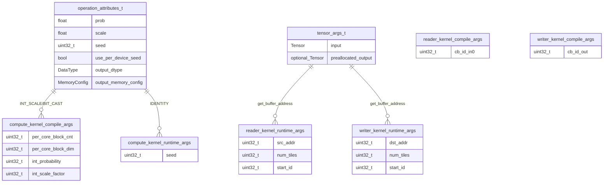

# Dropout

Applies stochastic dropout with scaling.

---

## Section 1: Algorithm [HUMAN]

Pure mathematical transformation. No hardware details.

```yaml
algorithm:
  transformation: "Output[i] = Input[i] * Bernoulli(1 - prob) * scale"

  preconditions:
    - { id: A1, entity: Input.shape, attr: rank, rel: ">=", value: 2 }
    - { id: A2, entity: prob, attr: value, rel: ">=", value: 0.0 }
    - { id: A3, entity: prob, attr: value, rel: "<", value: 1.0 }
    - { id: A4, entity: scale, attr: value, rel: ">", value: 0.0 }

  postconditions:
    - { id: O1, entity: Output.shape, rel: "==", expr: "Input.shape" }
    - { id: O2, entity: Output.dtype, rel: "==", expr: "Input.dtype" }

  attributes:
    - { name: prob, type: float, desc: "Probability of zeroing each element" }
    - { name: scale, type: float, desc: "Scale factor for surviving elements" }
    - { name: seed, type: uint32_t, desc: "RNG seed for reproducibility" }

  invariants:
    - { id: D1, rule: "Same seed + same input = same output" }
    - { id: D2, rule: "Each element mask is independent Bernoulli" }
```

---

## Section 2: HW Strategy [HUMAN]

Hardware constraints. Pattern will be DERIVED in Section 3.

```yaml
hw_strategy:
  memory_layout: INTERLEAVED
  input_layout: TILE
  output_layout: TILE
```

---

## Section 3: LLK Selection (Tetris Block Matching) [DERIVED]

LLK primitives selected by matching algorithm requirements to primitive effects.

```yaml
llk_selection:
  # =========================================================================
  # REASONING (primitives_catalog.md search trace)
  # =========================================================================
  #
  # STAGE 1: Algorithm -> Compute Primitive
  # -------------------------------------------------------------------------
  # Search: "element-wise stochastic masking with scaling"
  # Query: transformation = "Output[i] = Input[i] * Bernoulli(1-prob) * scale"
  #
  # Found in primitives_catalog.md -> dropout_tile:
  #   - category: sfpu_compute
  #   - signature: void dropout_tile(uint32_t idst, uint32_t probability, uint32_t scale_factor)
  #   - requires: DST[idst]: ACQUIRED, DST[idst]: HAS_DATA, SFPU: DROPOUT_RNG_INITIALIZED
  #   - produces: DST[idst]: MODIFIED
  #   - effect: "DST[idst] = DST[idst] * Bernoulli(1-p) * scale"
  #   - init_dependency: dropout_kernel_init
  #
  # Selected: dropout_tile
  #
  # STAGE 2: Data Movement (satisfy compute primitive requirements)
  # -------------------------------------------------------------------------
  # dropout_tile requires DST[idst]: HAS_DATA
  #
  # Search: "produces DST[idx]: HAS_DATA from CB"
  # Found: copy_tile
  #   - category: data_movement
  #   - requires: DST[dst_tile_index]: ACQUIRED, CB[in_cb_id]: HAS_DATA
  #   - produces: DST[dst_tile_index]: HAS_DATA
  #   - effect: "CB[in_cb_id][tile] -> DST[dst_tile_index]"
  #
  # Selected for input: copy_tile
  #
  # copy_tile requires DST[dst_tile_index]: ACQUIRED
  # Search: "produces DST: ACQUIRED"
  # Found: tile_regs_acquire
  #   - requires: DST[0..7]: RELEASED
  #   - produces: DST[0..7]: ACQUIRED
  #
  # copy_tile requires CB[in_cb_id]: HAS_DATA
  # Search: "produces CB: HAS_DATA" (in compute kernel context)
  # Found: cb_wait_front
  #   - requires: CB[cbid]: any (producer pushed data)
  #   - produces: CB[cbid]: HAS_DATA
  #
  # dropout_tile produces DST[idst]: MODIFIED (need to persist to output)
  #
  # Search: "produces CB: WRITTEN from DST"
  # Found: pack_tile
  #   - category: data_movement
  #   - requires: DST[ifrom_dst]: WAITED, CB[icb]: RESERVED
  #   - produces: CB[icb]: WRITTEN
  #   - effect: "DST[ifrom_dst] -> CB[icb]"
  #
  # Selected for output: pack_tile
  #
  # pack_tile requires DST[ifrom_dst]: WAITED
  # Search: "produces DST: WAITED"
  # Found: tile_regs_wait
  #   - requires: DST[0..7]: COMMITTED
  #   - produces: DST[0..7]: WAITED
  #
  # tile_regs_wait requires DST: COMMITTED
  # Search: "produces DST: COMMITTED"
  # Found: tile_regs_commit
  #   - requires: DST[0..7]: ACQUIRED|HAS_DATA|MODIFIED|WRITTEN
  #   - produces: DST[0..7]: COMMITTED
  #
  # pack_tile requires CB[icb]: RESERVED
  # Search: "produces CB: RESERVED"
  # Found: cb_reserve_back
  #   - requires: CB[cbid]: any
  #   - produces: CB[cbid]: RESERVED
  #
  # After pack_tile, CB[icb]: WRITTEN
  # To signal writer: cb_push_back
  #   - requires: CB[cbid]: WRITTEN
  #   - produces: CB[cbid]: PUSHED
  #
  # After copy_tile consumes CB, release: cb_pop_front
  #   - requires: CB[cbid]: HAS_DATA
  #   - produces: CB[cbid]: FREED
  #
  # After pack_tile, release DST: tile_regs_release
  #   - requires: DST[0..7]: WAITED
  #   - produces: DST[0..7]: RELEASED
  #
  # STAGE 3: Memory Transfer (based on hw_strategy.memory_layout)
  # -------------------------------------------------------------------------
  # hw_strategy.memory_layout == INTERLEAVED
  #
  # cb_wait_front requires producer to push data to CB
  # For INTERLEAVED layout:
  # Search: "produces CB: PUSHED from DRAM"
  # Found: noc_async_read_tile + cb_push_back (in Reader kernel)
  #   -> Implies: Reader kernel needed
  #
  # cb_push_back in compute makes data available to writer
  # For INTERLEAVED layout:
  # Search: "consumes CB: PUSHED to DRAM"
  # Found: cb_wait_front + noc_async_write_tile + cb_pop_front (in Writer kernel)
  #   -> Implies: Writer kernel needed
  #
  # DERIVED: Pattern = Reader-Compute-Writer
  # DERIVED: CB allocation from data flow:
  #   - cb_in (c_0): Reader produces, Compute consumes
  #   - cb_out (c_2): Compute produces, Writer consumes
  #
  # Init chain derivation:
  # -------------------------------------------------------------------------
  # dropout_tile requires SFPU: DROPOUT_RNG_INITIALIZED
  #   -> needs dropout_kernel_init
  #   -> dropout_kernel_init requires SFPU: INITIALIZED
  #   -> needs init_sfpu
  #   -> init_sfpu requires HW: INITIALIZED
  #   -> needs compute_kernel_hw_startup (implicit in pattern)
  #
  # =========================================================================

  # =========================================================================
  # BUSINESS LOGIC RESULT
  # =========================================================================
  cb_allocation:
    cb_in: { index: c_0, direction: consumer }
    cb_out: { index: c_2, direction: producer }

  init_chain:
    - { fn: init_sfpu, produces: SFPU_INIT }
    - { fn: dropout_kernel_init, args: [seed], produces: DROPOUT_RNG_INIT }

  param_transforms:
    - { llk: probability, algo: prob, transform: "INT_SCALE", expr: "(uint32_t)(prob * INT_MAX)" }
    - { llk: scale_factor, algo: scale, transform: "BIT_CAST", expr: "std::bit_cast<uint32_t>(scale)" }
    - { llk: idst, value: 0 }
```

### LLK Primitive Flow (per tile)


### LLK Primitive State Table

| Step | Primitive | Requires | Produces | Effect |
|------|-----------|----------|----------|--------|
| 1 | `init_sfpu` | HW_INIT | SFPU_INIT | Configure SFPU |
| 2 | `dropout_kernel_init` | SFPU_INIT | DROPOUT_RNG_INIT | Seed RNG |
| 3 | `noc_async_read_tile` | DRAM addr | CB: WRITTEN | DRAM→cb_in |
| 4 | `cb_push_back` | CB: WRITTEN | CB: PUSHED | Signal data ready |
| 5 | `cb_wait_front` | CB: PUSHED | CB: HAS_DATA | Wait for input |
| 6 | `tile_regs_acquire` | DST: RELEASED | DST: ACQUIRED | Lock DST |
| 7 | `copy_tile` | DST: ACQUIRED, CB: HAS_DATA | DST: HAS_DATA | cb_in→DST |
| 8 | `dropout_tile` | DST: HAS_DATA, DROPOUT_RNG_INIT | DST: MODIFIED | Apply dropout |
| 9 | `tile_regs_commit` | DST: MODIFIED | DST: COMMITTED | Signal PACK |
| 10 | `cb_pop_front` | CB: HAS_DATA | CB: FREED | Release cb_in |
| 11 | `tile_regs_wait` | DST: COMMITTED | DST: WAITED | Wait for PACK |
| 12 | `cb_reserve_back` | - | CB: RESERVED | Reserve cb_out |
| 13 | `pack_tile` | DST: WAITED, CB: RESERVED | CB: WRITTEN | DST→cb_out |
| 14 | `tile_regs_release` | DST: WAITED | DST: RELEASED | Unlock DST |
| 15 | `cb_push_back` | CB: WRITTEN | CB: PUSHED | Signal output ready |
| 16 | `cb_wait_front` | CB: PUSHED | CB: HAS_DATA | Wait for output |
| 17 | `noc_async_write_tile` | CB: HAS_DATA | DRAM written | cb_out→DRAM |
| 18 | `cb_pop_front` | CB: HAS_DATA | CB: FREED | Release cb_out |


---

## Section 4: Kernel Boundaries [DERIVED]

```yaml
kernel_boundaries:
  # =========================================================================
  # ARCHITECTURE PATTERN SELECTION
  # =========================================================================
  # Pattern: Reader-Compute-Writer (selected in reference implementation)
  # Reason: hw_strategy.memory_layout == INTERLEAVED requires explicit
  #         DRAM<->L1 transfers. Separate Reader and Writer kernels.
  #
  # Alternative patterns:
  # - ReaderCompute-Writer: Applicable (would merge reader+compute kernels)
  #   Reference implementation chose separate kernels.
  # - Signal-Compute-Writer: Not applicable (input not sharded)
  # =========================================================================

  pattern: Reader-Compute-Writer
```

### Kernel Boundaries Diagram

Kernel boundaries are at `cb_push_back` → `cb_wait_front` transitions:


---

## Section 5: Optimizations Applied

```yaml
optimizations_applied: []
# No special optimizations applied.
# Standard tile-by-tile processing with per_core_block_dim = 1.
```

---

## Section 6: C++ Binding

### C++ Binding ER Diagram



```yaml
cpp_binding:
  namespace: "ttnn::operations::experimental::dropout"
  prim_name: "ttnn::prim::dropout"

  files:
    device_op: "device/dropout_device_operation"
    types: "device/dropout_device_operation_types"
    program_factory: "device/dropout_program_factory"

types:
  operation_attributes:
    - { name: prob, type: float, default: 0.0 }
    - { name: scale, type: float, default: 1.0 }
    - { name: seed, type: uint32_t, default: 0 }
    - { name: use_per_device_seed, type: bool, default: false }
    - { name: output_dtype, type: DataType, default: "DataType::INVALID" }
    - { name: output_memory_config, type: MemoryConfig }
  tensor_args:
    - { name: input, type: "const Tensor&" }
    - { name: preallocated_output, type: "std::optional<Tensor>" }

circular_buffers:
  - { name: cb_in, index: c_0, num_tiles: 2 }
  - { name: cb_out, index: c_2, num_tiles: 2 }

kernels:
  reader:
    path: "device/kernels/dataflow/reader_dropout_interleaved_start_id.cpp"
    compile_args:
      - { idx: 0, name: cb_id_in0, value: "c_0" }
    runtime_args:
      - { idx: 0, name: src_addr }
      - { idx: 1, name: num_tiles }
      - { idx: 2, name: start_id }

  compute:
    path: "device/kernels/compute/dropout_kernel.cpp"
    compile_args:
      - { idx: 0, name: per_core_block_cnt, source: "num_tiles_per_core" }
      - { idx: 1, name: per_core_block_dim, value: 1 }
      - { idx: 2, name: int_probability, source: "prob", transform: INT_SCALE }
      - { idx: 3, name: int_scale_factor, source: "scale", transform: BIT_CAST }
    runtime_args:
      - { idx: 0, name: seed, source: "seed or seed+device_id" }

  writer:
    path: "device/kernels/dataflow/writer_dropout_interleaved_start_id.cpp"
    compile_args:
      - { idx: 0, name: cb_id_out, value: "c_2" }
    runtime_args:
      - { idx: 0, name: dst_addr }
      - { idx: 1, name: num_tiles }
      - { idx: 2, name: start_id }
```

---

## Section 7: Implementation Notes [REFERENCE]

```yaml
implementation_notes:
  kernel_source: "ttnn/cpp/ttnn/operations/experimental/dropout/device/kernels/compute/dropout_kernel.cpp"

  # Block optimization structure
  block_optimization:
    kernel_supports: "Variable per_core_block_dim via compile-time arg"
    factory_uses: "Hardcoded to 1"
    effect: "No actual block-level batching benefit"
    host_controllable: true
    to_enable: "Change factory to pass block_size > 1 as per_core_block_dim"

  # Multi-device support
  mesh_workload:
    factory: "DropoutMeshWorkloadFactory"
    purpose: "Per-device seed offset for different dropout masks"
    seed_calculation: "seed + device_id"
    enabled_when: "use_per_device_seed == true"

  # CB configuration constants
  constants:
    kSrc0CbIndex: "tt::CBIndex::c_0"
    kOutputCbIndex: "tt::CBIndex::c_2"
    kNumInputTiles: 2
    kNumOutputTiles: 2
```
