# Deep Investigation: How `cb_wait_front` Works

## Table of Contents
1. [Overview](#overview)
2. [Architecture Layers](#architecture-layers)
3. [Circular Buffer State Tracking](#circular-buffer-state-tracking)
4. [Producer-Consumer Synchronization](#producer-consumer-synchronization)
5. [Implementation Details](#implementation-details)
6. [Critical Constraints and Limitations](#critical-constraints-and-limitations)
7. [Known Issues and Bugs](#known-issues-and-bugs)
8. [Best Practices](#best-practices)
9. [Summary](#summary)

## Overview

`cb_wait_front` is a blocking synchronization primitive used by consumers to wait for tiles to be available in a circular buffer (CB). This function is fundamental to the TT-Metal compute kernel architecture, enabling efficient producer-consumer communication between threads on the Tensix core.

**Key Characteristics:**
- **Blocking**: Waits until specified number of tiles are available
- **Lock-free**: Uses hardware register-based synchronization
- **Low-latency**: Direct register polling for minimal overhead
- **Thread-specific**: Only executes on UNPACK thread (compute kernels)

## Architecture Layers

The `cb_wait_front` API is implemented across three distinct layers, each serving different kernel types and use cases.

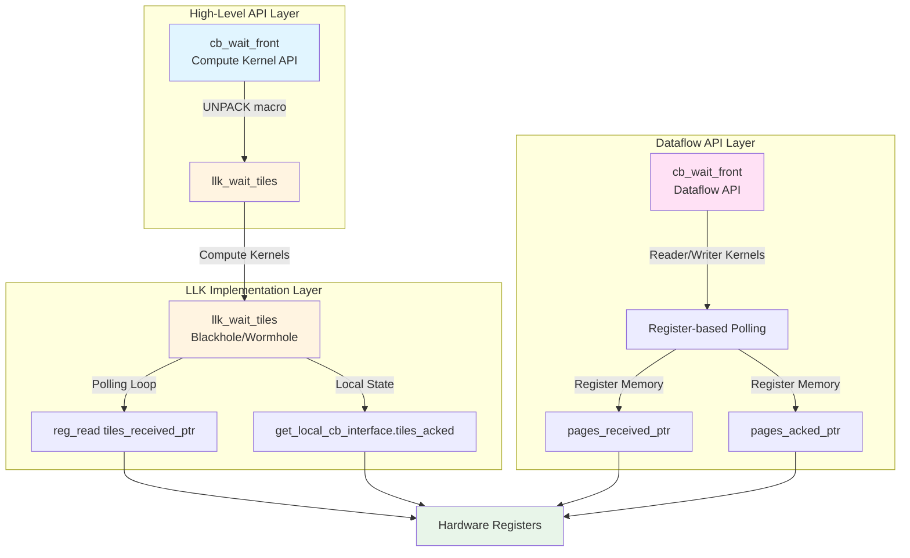

### 1. High-Level API Layer

**File**: `tt_metal/include/compute_kernel_api/cb_api.h`

```cpp
ALWI void cb_wait_front(uint32_t cbid, uint32_t ntiles) {
    UNPACK((llk_wait_tiles(cbid, ntiles)));
}
```

- **Scope**: Compute kernels only
- **Thread**: UNPACK thread (via `UNPACK` macro)
- **Purpose**: Simple, clean API for compute kernel developers

### 2. LLK (Low-Level Kernel) Implementation

**Files**:
- `tt_metal/hw/ckernels/blackhole/metal/llk_io/llk_io_unpack.h`
- `tt_metal/hw/ckernels/wormhole_b0/metal/llk_io/llk_io_unpack.h`

```cpp
inline void llk_wait_tiles(int operand, std::int32_t num_tiles) {
    DeviceZoneScopedSumN1("CB-COMPUTE-WAIT-FRONT");
    std::uint32_t input = operand;
    volatile tt_l1_ptr std::uint32_t* tiles_received_ptr = get_cb_tiles_received_ptr(operand);
    std::uint16_t num_tiles_u = (std::uint16_t)num_tiles;

    std::uint16_t tiles_received;
    uint16_t num_tiles_recv;

    do {
        tiles_received = (std::uint16_t)reg_read((std::uint32_t)tiles_received_ptr);
        num_tiles_recv = tiles_received - get_local_cb_interface(input).tiles_acked;
    } while (num_tiles_recv < num_tiles_u);
}
```

**Key Mechanism**:
- Polls `tiles_received_ptr` (updated by producer via `cb_push_back`)
- Compares against local `tiles_acked` (updated by consumer via `cb_pop_front`)
- Blocks until `num_tiles_recv >= num_tiles_u`

### 3. Dataflow API Layer

**File**: `tt_metal/hw/inc/dataflow_api.h`

```cpp
FORCE_INLINE
void cb_wait_front(int32_t operand, int32_t num_pages) {
    uint32_t pages_acked = get_cb_tiles_acked_ptr(operand)[0];
    uintptr_t pages_received_ptr = (uintptr_t)get_cb_tiles_received_ptr(operand);
    uint16_t pages_received;

    WAYPOINT("CWFW");
    do {
        pages_received = ((uint16_t)reg_read(pages_received_ptr)) - pages_acked;
    } while (pages_received < num_pages);
    WAYPOINT("CWFD");
}
```

**Differences from LLK**:
- Uses register-based `pages_acked` instead of local interface
- Includes waypoints for debugging/profiling
- Used by reader/writer kernels (dataflow)

## Circular Buffer State Tracking

The circular buffer maintains state through the `LocalCBInterface` structure, which tracks both memory pointers and tile counters.

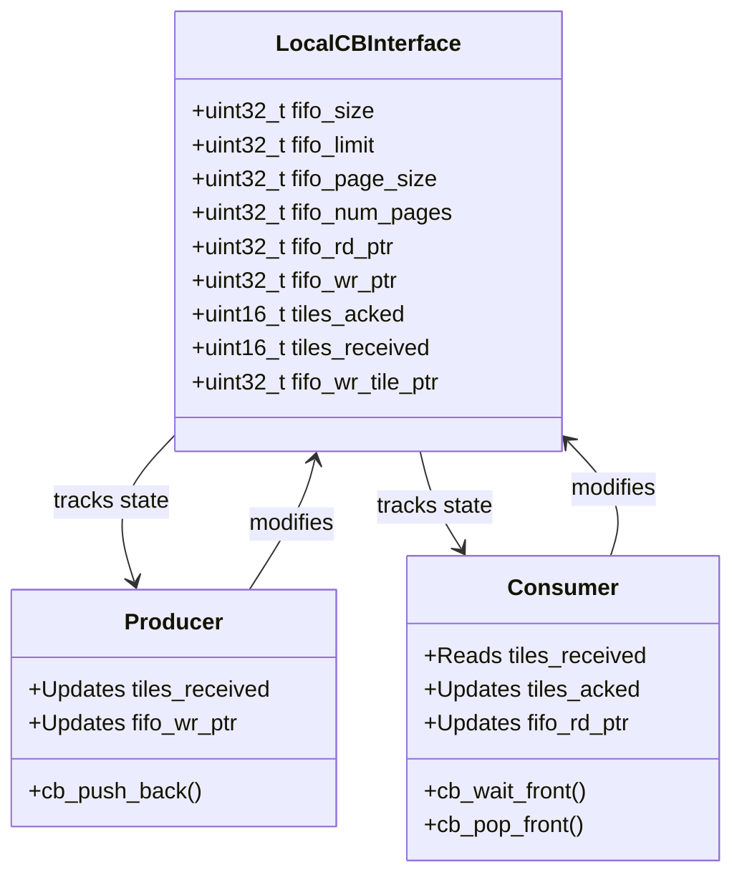

### State Structure

**File**: `tt_metal/hw/inc/circular_buffer.h`

```cpp
struct LocalCBInterface {
    uint32_t fifo_size;          // Total CB size in bytes
    uint32_t fifo_limit;          // Inclusive limit address
    uint32_t fifo_page_size;      // Size of one page/tile
    uint32_t fifo_num_pages;      // Total number of pages that fit

    uint32_t fifo_rd_ptr;         // Read pointer (consumer)
    uint32_t fifo_wr_ptr;         // Write pointer (producer)

    union {
        uint32_t tiles_acked_received_init;
        struct {
            uint16_t tiles_acked;      // Tiles consumed (consumer updates)
            uint16_t tiles_received;   // Tiles written (producer updates)
        };
    };

    uint32_t fifo_wr_tile_ptr;    // Used by packer for in-order packing
};
```

### Key State Variables

1. **`tiles_received`** (in `pages_received_ptr`):
   - **Updated by**: Producer when calling `cb_push_back()`
   - **Location**: Register memory (updated via `reg_write`)
   - **Meaning**: Total tiles written to CB by producer
   - **Visibility**: Readable by consumer via `reg_read()`

2. **`tiles_acked`** (in `pages_acked_ptr` or local interface):
   - **Updated by**: Consumer when calling `cb_pop_front()`
   - **Location**: Register memory (dataflow) or local interface (LLK)
   - **Meaning**: Tiles consumed/freed from CB
   - **Visibility**: Used by consumer to track consumption

3. **Available tiles calculation**:
   ```
   available_tiles = tiles_received - tiles_acked
   ```
   This is the core calculation that `cb_wait_front` uses to determine if enough tiles are available.

## Producer-Consumer Synchronization

The circular buffer implements a classic producer-consumer pattern with hardware-level synchronization.

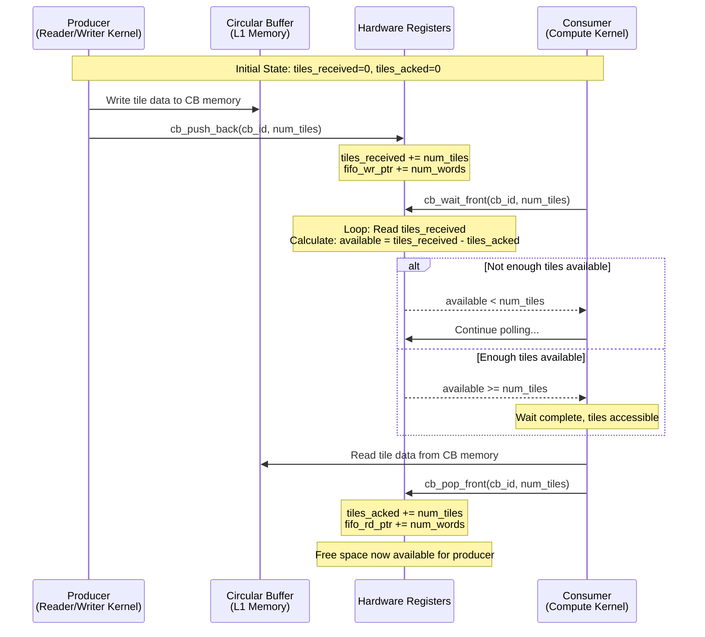

### Producer Side (Writer/Reader Kernel)

**File**: `tt_metal/hw/inc/dataflow_api.h`

```cpp
void cb_push_back(const int32_t operand, const int32_t num_pages) {
    uint32_t num_words = num_pages * get_local_cb_interface(operand).fifo_page_size;

    // Update tile counter (visible to consumer)
    volatile tt_reg_ptr uint32_t* pages_received_ptr = get_cb_tiles_received_ptr(operand);
    pages_received_ptr[0] += num_pages;

    // Update write pointer
    get_local_cb_interface(operand).fifo_wr_ptr += num_words;

    // Handle circular buffer wrapping
    if (get_local_cb_interface(operand).fifo_wr_ptr == get_local_cb_interface(operand).fifo_limit) {
        get_local_cb_interface(operand).fifo_wr_ptr -= get_local_cb_interface(operand).fifo_size;
    }
}
```

**Actions**:
1. Increments `pages_received_ptr[0]` - makes tiles visible to consumer
2. Updates `fifo_wr_ptr` - tracks write position in circular buffer
3. Handles wrapping - resets pointer when reaching buffer limit

### Consumer Side (Compute Kernel)

**Wait Phase** (`cb_wait_front`):
```cpp
// Polling loop - blocks until condition met
do {
    pages_received = ((uint16_t)reg_read(pages_received_ptr)) - pages_acked;
} while (pages_received < num_pages);
```

**Pop Phase** (`cb_pop_front`):
```cpp
void cb_pop_front(int32_t operand, int32_t num_pages) {
    // Update ack counter (signals tiles consumed)
    volatile tt_reg_ptr uint32_t* pages_acked_ptr = get_cb_tiles_acked_ptr(operand);
    pages_acked_ptr[0] += num_pages;

    // Update read pointer
    uint32_t num_words = num_pages * get_local_cb_interface(operand).fifo_page_size;
    get_local_cb_interface(operand).fifo_rd_ptr += num_words;

    // Handle wrapping
    if (get_local_cb_interface(operand).fifo_rd_ptr == get_local_cb_interface(operand).fifo_limit) {
        get_local_cb_interface(operand).fifo_rd_ptr -= get_local_cb_interface(operand).fifo_size;
    }
}
```

**Actions**:
1. Increments `pages_acked_ptr[0]` - signals tiles consumed to producer
2. Updates `fifo_rd_ptr` - tracks read position
3. Handles wrapping - resets pointer when reaching buffer limit

## Implementation Details

### Register Memory Access

The synchronization mechanism relies on hardware registers that are directly accessible by both producer and consumer:

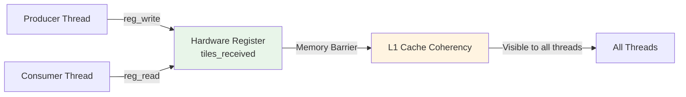

- **`reg_read()`**: Reads from register memory (hardware registers)
- **`reg_write()`**: Writes to register memory (via `pages_received_ptr[0] += ...`)
- **Memory barriers**: Hardware ensures coherency across threads
- **Low latency**: Direct register access, no cache misses

### Polling Loop Mechanism

The wait loop is a tight polling loop optimized for hardware:

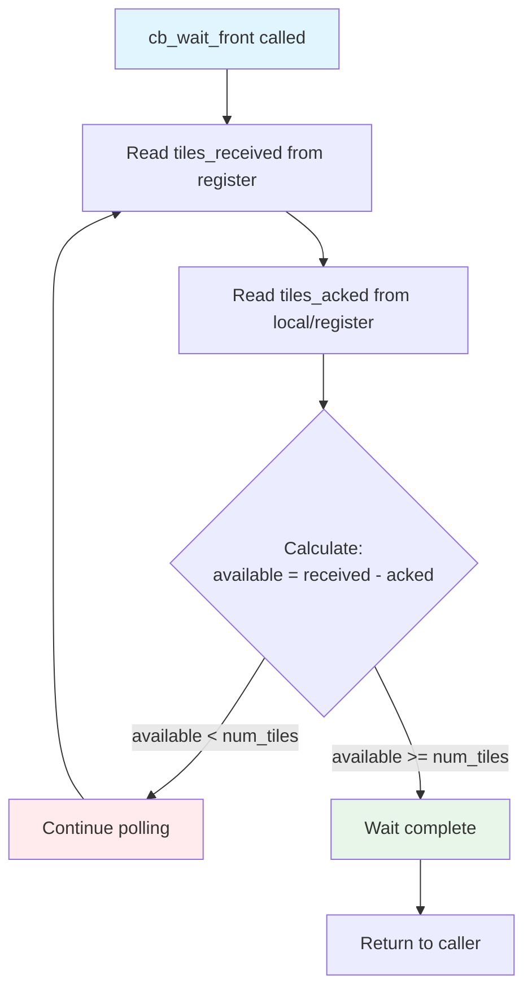

**Characteristics**:
- **Blocking**: Loop continues until condition is met
- **Efficient**: Direct register reads (low latency, ~few cycles)
- **No yielding**: Busy-waits (appropriate for hardware context)
- **Deterministic**: Predictable timing behavior

### Waypoints for Debugging

The dataflow API includes waypoints for debugging and profiling:

- `WAYPOINT("CWFW")` - Wait start (entering wait loop)
- `WAYPOINT("CWFD")` - Wait done (exiting wait loop)

These waypoints can be used with profiling tools to measure wait times and identify bottlenecks.

## Critical Constraints and Limitations

### 1. Cumulative Wait Requirement

**The Problem**: If multiple `cb_wait_front()` calls are made without an intervening `cb_pop_front()`, the wait count must be cumulative.

```mermaid
graph TB
    subgraph "❌ INCORRECT Pattern"
        A1[cb_wait_front 8] --> A2[cb_wait_front 8]
        A2 --> A3[cb_wait_front 8]
        A3 --> A4[cb_wait_front 8]
        A4 --> A5[cb_pop_front 32]
        A5 --> A6[ERROR: State mismatch]
    end

    subgraph "✅ CORRECT Pattern"
        B1[cb_wait_front 8] --> B2[cb_wait_front 16]
        B2 --> B3[cb_wait_front 24]
        B3 --> B4[cb_wait_front 32]
        B4 --> B5[cb_pop_front 32]
        B5 --> B6[SUCCESS: State consistent]
    end

    style A6 fill:#ffebee
    style B6 fill:#e8f5e9
```

**Why This Matters**:
- The wait mechanism tracks cumulative tiles received, not individual wait calls
- Each `cb_wait_front(n)` expects `n` total tiles to be available
- Non-cumulative waits cause state mismatch and hangs

**Example**:
```cpp
// ❌ WRONG
cb_wait_front(cb_id, 8);
cb_wait_front(cb_id, 8);  // Expects 8 total, but already waited for 8!
cb_wait_front(cb_id, 8);
cb_wait_front(cb_id, 8);
cb_pop_front(cb_id, 32);

// ✅ CORRECT
cb_wait_front(cb_id, 8);   // Wait for 8 tiles
cb_wait_front(cb_id, 16);   // Wait for 16 total (8 + 8)
cb_wait_front(cb_id, 24);   // Wait for 24 total (16 + 8)
cb_wait_front(cb_id, 32);   // Wait for 32 total (24 + 8)
cb_pop_front(cb_id, 32);
```

### 2. Tile Count Divisibility

**Constraint**: All tile counts must evenly divide the CB size.

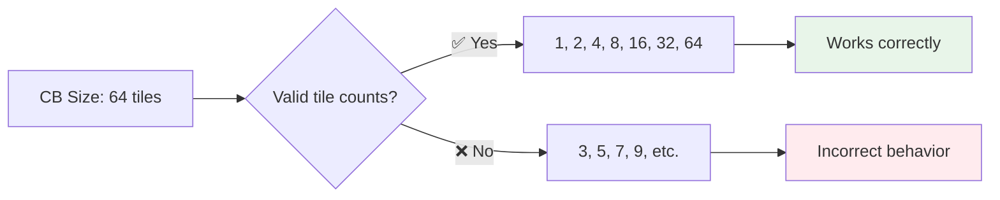

**Additional Constraint**: All `cb_wait_front()` calls in the same kernel must use the same tile count.

**Example**:
```cpp
// ❌ WRONG: Mixed tile counts
cb_wait_front(cb_id, 32);
cb_wait_front(cb_id, 40);  // Different count!
cb_pop_front(cb_id, 72);

// ❌ WRONG: Doesn't divide CB size
// CB size = 64, but using 3
cb_wait_front(cb_id, 3);

// ✅ CORRECT: Same count, divides CB size
cb_wait_front(cb_id, 32);
cb_wait_front(cb_id, 32);
cb_pop_front(cb_id, 64);
```

**Why**: Performance optimizations in CB implementation require aligned boundaries and consistent access patterns.

### 3. CB Size Requirements

- CB total size must be an even multiple of the argument passed to `cb_wait_front()`
- Example: If CB size is 64, valid arguments are: 1, 2, 4, 8, 16, 32, 64

### 4. Thread Safety

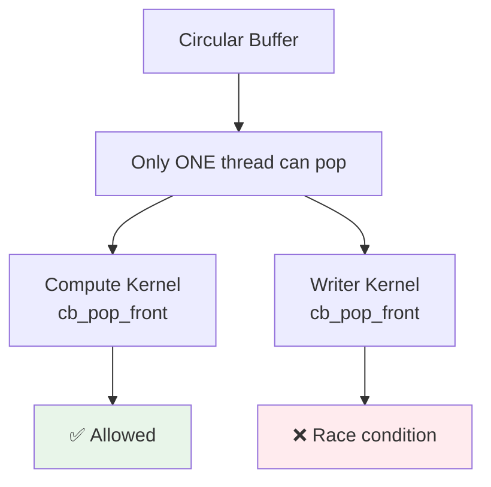

- **`cb_pop_front()` updates the read pointer** - only one thread can pop from a CB
- Multiple threads cannot safely call `cb_pop_front()` on the same CB
- This includes both compute and writer kernels - they must coordinate

### 5. 16-Bit Counter Limitation

**Critical Issue**: `tiles_acked` and `tiles_received` are stored as `uint16_t` (16-bit values).

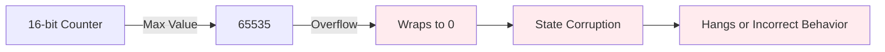

**Impact**:
- Can overflow with large tile counts (>65535 tiles)
- Causes state corruption and hangs
- Particularly problematic in matmul operations with large tensors

**Mitigation**:
- Monitor tile counts in large workloads
- Consider CB size limitations when designing kernels
- Be aware of this limitation when debugging hangs

## Known Issues and Bugs

### Issue #1: Matmul Hangs on Blackhole

**Source**: GitHub Issue #16439, Slack Thread (Stefan Krsmanovic et al.)

**Problem**: Matmul operations hang on Blackhole (13x10 and 8x8 grids) when using `cb_wait_front`.

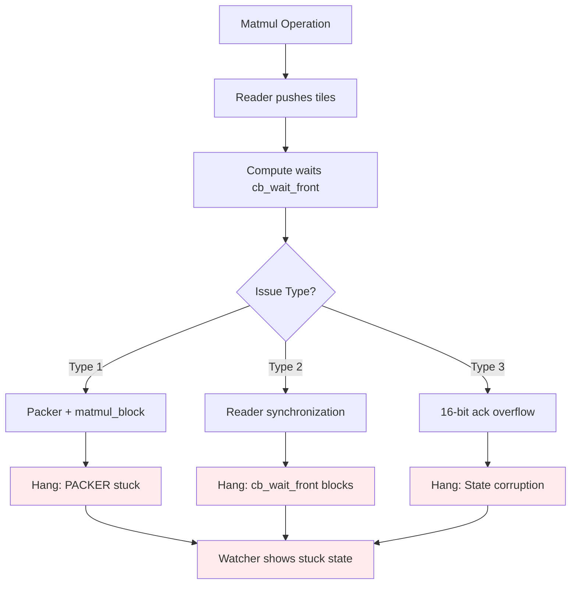

**Root Causes Identified**:

1. **Packer + matmul_block interaction**:
   - Issues with `matmul_block` combined with packer instructions causing hangs
   - Removing packer code eliminates hang (but breaks functionality)

2. **Reader synchronization**:
   - Hangs occur when reader kernel pushes tiles to compute kernel via `cb_push_back`
   - Removing `cb_wait_front` and `cb_reserve_back` eliminates hang

3. **16-bit ack pointer overflow**:
   - When `cb_reserve_back` is removed from readers, the ack pointer (16-bit) can overflow
   - Leads to incorrect synchronization state

**Symptoms**:
- Test hangs at `ttnn.synchronize_device` operation
- Watcher shows PACKER thread stuck in running state
- TRISC1 thread stuck at `matmul_block()`
- Packer thread not syncing with math thread

**Workaround**:
- Commenting out `matmul_block` or packer code can prevent hangs
- Indicates separate issues that can compound

**Status**: Active investigation, minimal repro steps available on `skrsmanovic/bh-mamtul-sweep-bug` branch

### Issue #2: Cumulative Wait Pattern Bugs

**Source**: Multiple internal reports, official documentation

**Problem**: Developers frequently misuse cumulative wait pattern, causing hangs and incorrect behavior.

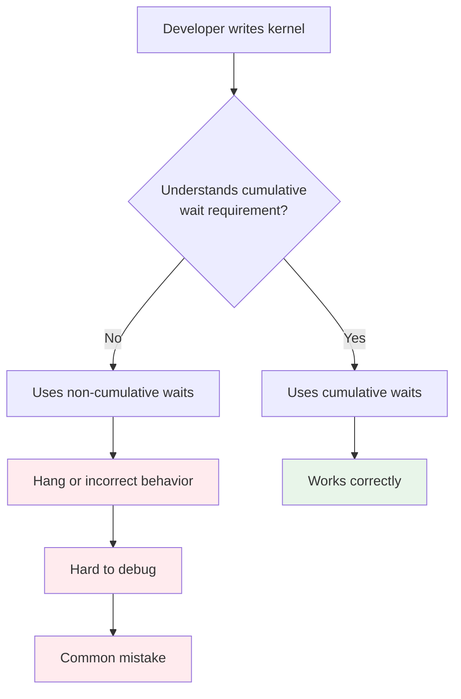

**Common Mistakes**:
- Calling `cb_wait_front(8)` four times, then `cb_pop_front(32)` - **INCORRECT**
- Not understanding that wait counts must be cumulative when no pop occurs between waits
- Assuming each `cb_wait_front()` call is independent

**Impact**:
- Hard-to-debug hangs
- Incorrect data processing
- Silent failures in some cases

**Documentation**: Well-documented in API docs, but still frequently misunderstood

### Issue #3: Thread Synchronization and Profiling Issues

**Source**: Slack Thread (Brian Liu, Stefan Krsmanovic)

**Problem**: Profiler shows PACK thread ending before MATH thread, which should not be possible.

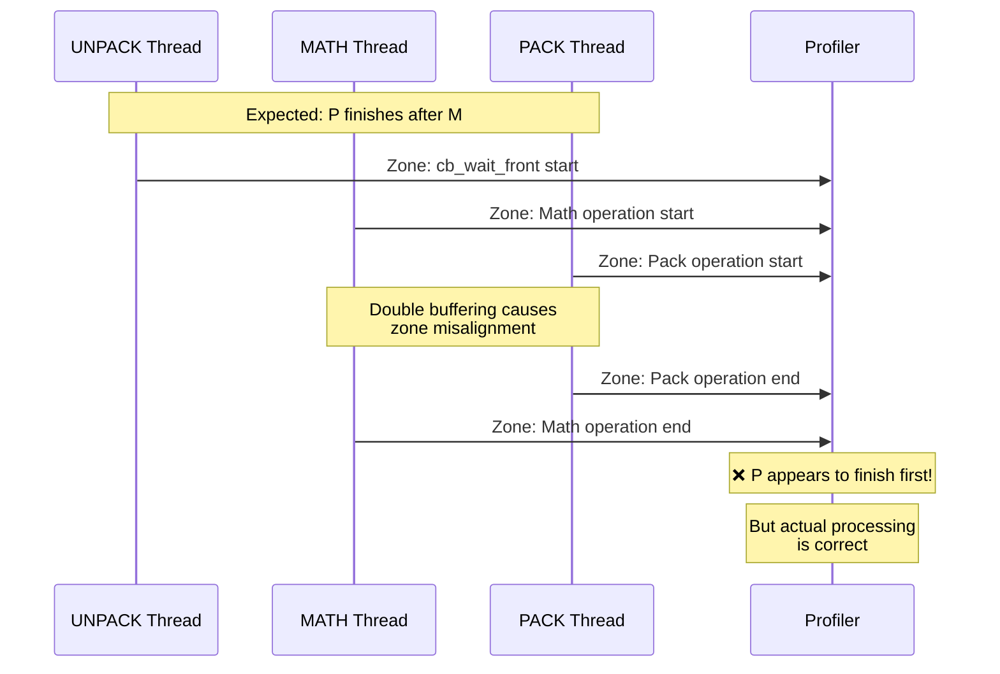

**Root Causes**:

1. **Double buffering**:
   - SRC/DST registers are double-buffered
   - While MATH processes one half, UNPACK fills the other
   - Causes zone misalignment in profiling

2. **Barrier timing**:
   - Profiler zones are placed in TRISC code
   - Actual processing happens in Tensix engine
   - Without explicit barriers, zone timing can be misleading

3. **Missing explicit barriers**:
   - `cb_wait_front()` creates explicit barrier on Unpacker core
   - Math core zone starts earlier but doesn't process until Unpacker is ready
   - Packer zone timing can appear incorrect due to buffering

**Impact**: Makes performance debugging and optimization difficult

### Issue #4: 16-Bit Counter Overflow

**Source**: Matmul hang investigation (Yu Gao)

**Problem**: `tiles_acked` and `tiles_received` are 16-bit values that can overflow.

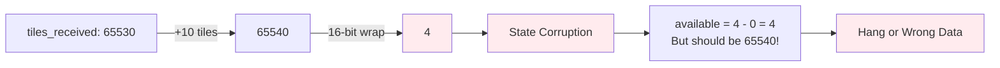

**Scenario**:
- When `cb_reserve_back` is removed from readers
- Ack pointer is only 16-bit
- Large tile counts can cause wraparound
- Leads to incorrect synchronization state

**Impact**: Can cause hangs or incorrect data processing with large workloads

### Issue #5: Matmul with Sharded Inputs

**Source**: GitHub Issue #17482

**Problem**: Matmul hangs when `in0` is block sharded and `in1` is width sharded.

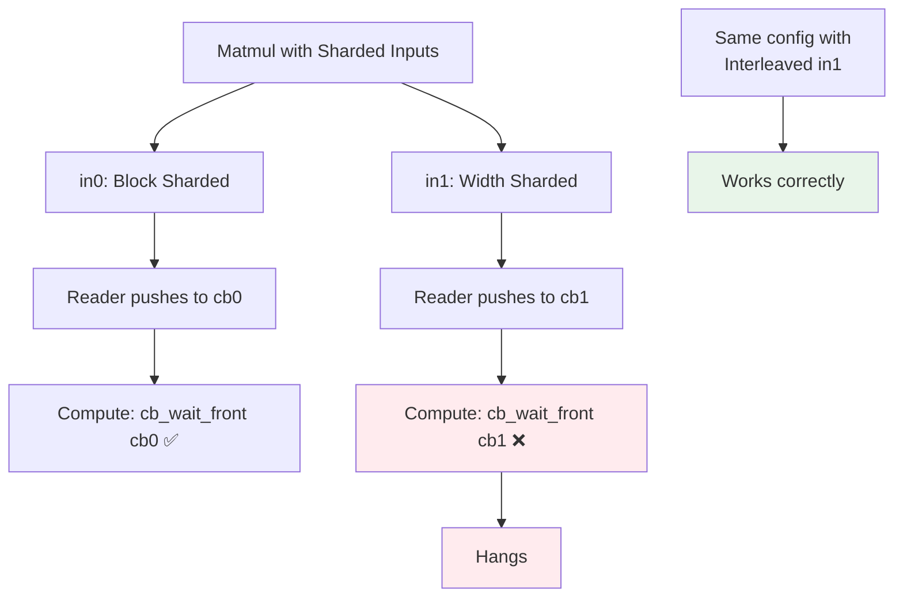

**Configuration**:
- `in0`: (8,1,224,768) - block sharded
- `in1`: (1,1,768,3072) - width sharded
- Grid: 6x8 cores

**Symptom**: `cb_wait_front(cb1)` hangs when input1 is width sharded (works fine when interleaved)

**Status**: Reported by community contributor, version v53

## Best Practices

### 1. Always Use Cumulative Waits Correctly

```cpp
// ✅ CORRECT: Cumulative waits
for (uint32_t i = 0; i < 4; i++) {
    cb_wait_front(cb_id, (i + 1) * 8);  // 8, 16, 24, 32
    // Process tiles...
}
cb_pop_front(cb_id, 32);

// ❌ WRONG: Non-cumulative waits
for (uint32_t i = 0; i < 4; i++) {
    cb_wait_front(cb_id, 8);  // Always waits for 8, not cumulative!
    // Process tiles...
}
cb_pop_front(cb_id, 32);
```

### 2. Use Consistent Tile Counts

- All `cb_wait_front()` calls in same kernel must use same tile count
- Ensure tile count evenly divides CB size
- Prefer powers of 2 for better performance

### 3. Be Aware of 16-Bit Limitations

- For large workloads, consider tile count limits
- Monitor for potential overflow scenarios
- Design kernels with CB size constraints in mind

### 4. Debug Hangs Effectively

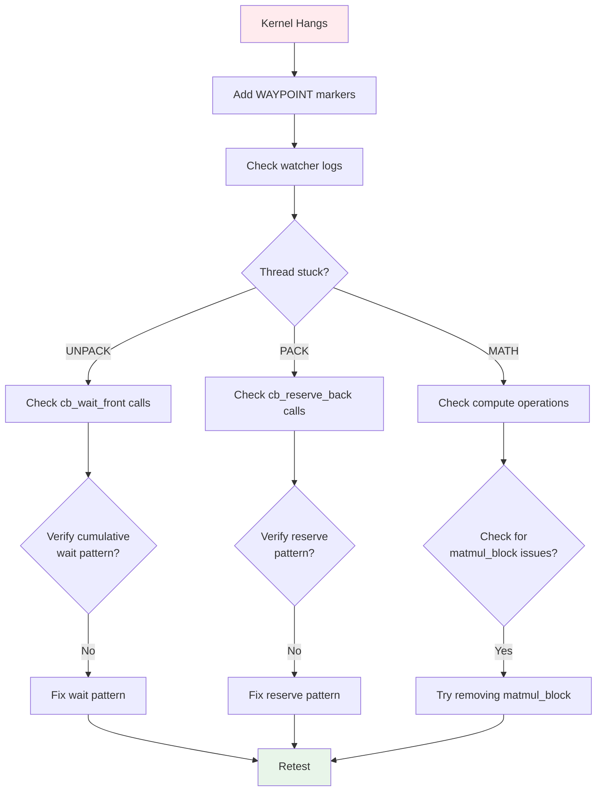

**Debugging Steps**:
1. Use waypoints (`WAYPOINT`) for debugging
2. Check watcher logs for stuck threads
3. Verify cumulative wait patterns
4. Check for 16-bit counter overflow
5. Verify thread safety (only one pop per CB)

### 5. Thread Safety Guidelines

- Only one thread should call `cb_pop_front()` per CB
- Coordinate between compute and writer kernels
- Use separate CBs if multiple threads need to consume

### 6. Performance Optimization

- Minimize number of `cb_wait_front()` calls
- Use larger tile counts when possible (fewer calls)
- Balance CB size vs. memory usage
- Consider double buffering for better throughput

## Summary

`cb_wait_front` implements a **producer-consumer synchronization mechanism** using:

1. **State tracking**: `tiles_received` (producer) vs `tiles_acked` (consumer)
2. **Polling loop**: Busy-waits on register memory until tiles available
3. **Hardware synchronization**: Register-based updates provide low-latency coordination
4. **Circular buffer management**: Handles wrapping and pointer updates

The mechanism is **lock-free** and **low-latency**, suitable for high-performance compute kernels, but requires careful adherence to documented constraints for correct operation.

### Key Takeaways

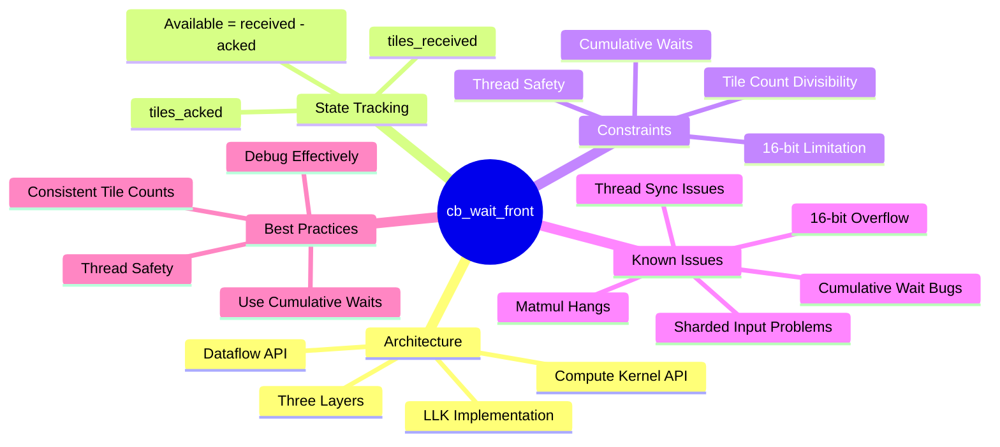

### Known Issues Summary

1. **Matmul hangs on Blackhole** (active investigation)
   - Packer + matmul_block interaction
   - Reader synchronization problems
   - 16-bit ack pointer overflow

2. **Cumulative wait pattern** frequently misunderstood
   - Common source of bugs
   - Well-documented but still problematic

3. **16-bit counter overflow** with large tile counts
   - Can cause hangs or incorrect data
   - Design consideration for large workloads

4. **Thread synchronization/profiling** challenges
   - Double buffering causes zone misalignment
   - Makes performance debugging difficult

5. **Sharded input compatibility** issues
   - Specific configurations cause hangs
   - Requires investigation

### Future Improvements

1. **LLK Sanitizer** for runtime validation
   - Catch common mistakes early
   - Better error messages
   - Reduce support burden

2. **Better error messages** for common mistakes
   - Detect cumulative wait violations
   - Warn about 16-bit overflow
   - Validate tile count constraints

3. **Enhanced debugging tools**
   - Better profiler integration
   - State visualization
   - Automatic pattern detection

4. **Documentation improvements**
   - More examples
   - Common pitfalls guide
   - Best practices cookbook

---

**Document Version**: 1.0
**Last Updated**: Based on investigation plan and Glean documentation
**Related Issues**: #16439, #17482, #26934
