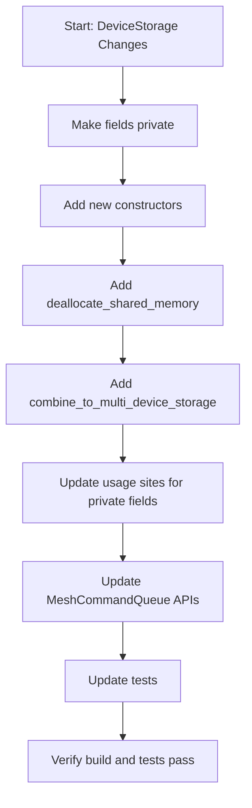

# DeviceStorage Refactoring Migration Plan

## Build Instructions

```bash
# Activate Python virtual environment
source python_env/bin/activate

# Build the repository
source ~/.bashrc && bd
```

## Summary

Migrate DeviceStorage encapsulation and API improvements from `riverwu/alt-mesh-buffer-backup` while **excluding** the `get_mesh_buffer()` return type change (keeping it as `std::shared_ptr<distributed::MeshBuffer>`).

## Tasks

- [ ] Update storage.hpp: make fields private, add constructors, methods, move internal functions
- [ ] Update storage.cpp: implement new constructors and methods
- [ ] Update tensor.cpp: use deallocate_shared_memory()
- [ ] Update tensor_ops.cpp: use new constructors
- [ ] Update distributed/api.cpp: use new combine/copy patterns
- [ ] Update tensor_impl.cpp: use simplified DeviceStorage constructor
- [ ] Update unit_mesh_utils.cpp: use simplified constructor
- [ ] Update files accessing private mesh_buffer to use get_mesh_buffer()
- [ ] Add MeshBuffer& overloads to MeshCommandQueue APIs
- [ ] Add deallocate tests and update existing tests

## Changes to Migrate

### 1. DeviceStorage Struct ([ttnn/api/ttnn/tensor/storage.hpp](ttnn/api/ttnn/tensor/storage.hpp))

**Make fields private:**

- Move `mesh_buffer` and `root_mesh_buffer` to private section
- Keep `coords` public (unchanged)

**Add new constructors:**

- Simplified constructor: `explicit DeviceStorage(std::shared_ptr<MeshBuffer>)` - auto-populates coords from mesh device shape
- View constructor: `DeviceStorage(DeviceStorage other, std::shared_ptr<MeshBuffer> surface_buffer)` - for tensor views (#38093)
- Add explicit default copy constructor/assignment declarations

**Add new methods:**

- `deallocate_shared_memory(bool force)` - encapsulates deallocation logic
- `static combine_to_multi_device_storage(std::span<std::reference_wrapper<const DeviceStorage>>)` - combines multiple storages

**NOT migrating:**

- `get_mesh_buffer()` remains returning `std::shared_ptr<MeshBuffer>` (not `const MeshBuffer&`)
- Skip `get_mesh_buffer_leak_ownership()` - unnecessary when keeping shared_ptr return

**Move to private:**

- `get_root_mesh_buffer()`, `deallocate_root_mesh_buffer()`, `reset_root_mesh_buffer()`

### 2. DeviceStorage Implementation ([ttnn/core/tensor/storage.cpp](ttnn/core/tensor/storage.cpp))

- Implement new simplified constructor (auto-populate coords from mesh device)
- Implement view constructor with root buffer management
- Implement `deallocate_shared_memory(bool force)`
- Implement `combine_to_multi_device_storage()`

### 3. Tensor Deallocation ([ttnn/core/tensor/tensor.cpp](ttnn/core/tensor/tensor.cpp))

Update `deallocate_impl()` to use new `storage.deallocate_shared_memory(force)` method.

### 4. Tensor Operations ([ttnn/core/tensor/tensor_ops.cpp](ttnn/core/tensor/tensor_ops.cpp))

- Update `allocate_tensor_on_device()` to use simplified constructor
- Update `view()` to use new view constructor pattern

### 5. Distributed API ([ttnn/core/distributed/api.cpp](ttnn/core/distributed/api.cpp))

- Update `get_device_tensors()` to use copy constructor pattern for creating shard views
- Update `combine_device_tensors()` to use `DeviceStorage::combine_to_multi_device_storage()`

### 6. Tensor Implementation ([ttnn/core/tensor/tensor_impl.cpp](ttnn/core/tensor/tensor_impl.cpp))

- Update `to_device_mesh_buffer()` signature to take `const DistributedHostBuffer&`
- Use simplified DeviceStorage constructor in `to_device()`
- Update internal functions to use `storage.get_device()` instead of `storage.mesh_buffer->device()`

### 7. Unit Mesh Utils ([ttnn/core/tensor/unit_mesh/unit_mesh_utils.cpp](ttnn/core/tensor/unit_mesh/unit_mesh_utils.cpp))

- Update `aggregate()` and `disaggregate()` to use simplified constructor

### 8. Other Files (Adjust for private mesh_buffer)

These files access `storage.mesh_buffer` directly and need to use `storage.get_mesh_buffer()` instead:

- [ttnn/api/ttnn/mesh_device_operation_utils.hpp](ttnn/api/ttnn/mesh_device_operation_utils.hpp)
- [ttnn/core/graph/graph_processor.cpp](ttnn/core/graph/graph_processor.cpp)
- [ttnn/core/tensor/to_string.cpp](ttnn/core/tensor/to_string.cpp)
- [ttnn/cpp/ttnn-nanobind/pytensor.cpp](ttnn/cpp/ttnn-nanobind/pytensor.cpp)

### 9. MeshCommandQueue APIs (Add reference overloads)

Add `const MeshBuffer&` overloads to support both shared_ptr and reference usage:

- [tt_metal/api/tt-metalium/mesh_command_queue.hpp](tt_metal/api/tt-metalium/mesh_command_queue.hpp)
- [tt_metal/distributed/mesh_command_queue_base.cpp](tt_metal/distributed/mesh_command_queue_base.cpp)
- [tt_metal/distributed/mesh_command_queue_base.hpp](tt_metal/distributed/mesh_command_queue_base.hpp)
- [tt_metal/api/tt-metalium/distributed.hpp](tt_metal/api/tt-metalium/distributed.hpp)

### 10. Tests

- Add new test file: [tests/ttnn/unit_tests/gtests/tensor/test_tensor_deallocate.cpp](tests/ttnn/unit_tests/gtests/tensor/test_tensor_deallocate.cpp)
- Update [tests/ttnn/unit_tests/gtests/sources.cmake](tests/ttnn/unit_tests/gtests/sources.cmake)
- Update existing tests to use `get_mesh_buffer()` instead of `storage.mesh_buffer`

## Key Differences from Backup Branch

Since we keep `get_mesh_buffer()` returning `shared_ptr`:

- Do NOT change `Tensor::mesh_buffer()` return type
- Keep using `->` operator for mesh_buffer access (e.g., `mesh_buffer->address()`)
- Do NOT add `get_mesh_buffer_leak_ownership()`

## Migration Strategy


