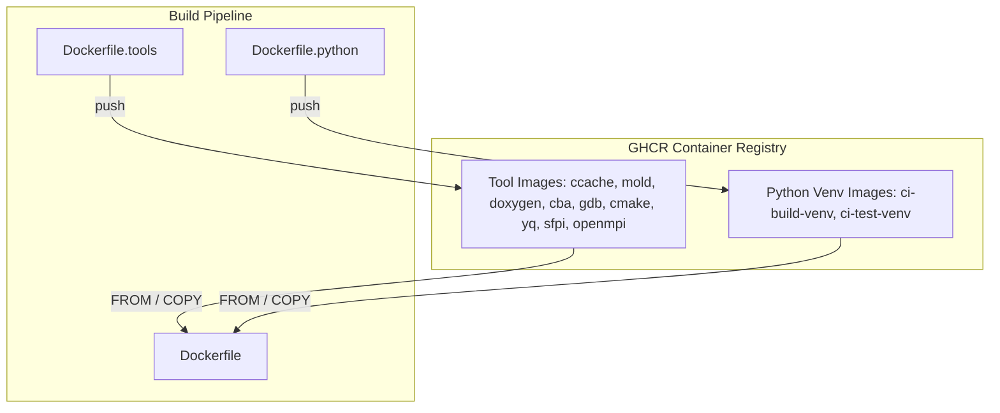

# TT-Metalium Docker Build System

This directory contains the Docker build system for TT-Metalium, including multi-stage Dockerfiles, tool installation scripts, and local build automation.

## Architecture



- **Tool images** are built by `Dockerfile.tools` and pushed to GHCR. They contain pre-built binaries (ccache, mold, doxygen, etc.) to avoid repeated downloads.
- **Python venv images** are built by `Dockerfile.python` and pushed to GHCR. They contain pre-installed Python dependencies for ci-build and ci-test environments.
- **Main Dockerfile** pulls these pre-built layers via `FROM` and `COPY --from=` instead of building from scratch.

## When to Use CI vs Local Builds

- **CI (GitHub Actions)**: The `build-docker-artifact.yaml` workflow builds tool images, Python venv images, and main images automatically. Used by merge-gate, pr-gate, and build-artifact.
- **Local development**: Use `build-local.sh` when you need to build or rebuild images on your machine. It builds missing tool and venv images first, then the main image.

## Quick Start

```bash
# Build the development image (default)
./dockerfile/build-local.sh dev

# Build for Ubuntu 24.04
./dockerfile/build-local.sh --ubuntu 24.04 dev

# Build CI test image
./dockerfile/build-local.sh ci-test

# Show all options
./dockerfile/build-local.sh --help
```

## Dockerfiles

| Dockerfile | Purpose |
|------------|---------|
| `Dockerfile` | Main CI/build/dev images (ci-build, ci-test, dev, release, release-models) |
| `Dockerfile.basic-dev` | Minimal dev environment (base, basic-ttnn-runtime) |
| `Dockerfile.evaluation` | Evaluation builds |
| `Dockerfile.manylinux` | ManyLinux wheel builds |
| `Dockerfile.python` | Python venv images (ci-build-venv, ci-test-venv) |
| `Dockerfile.tools` | Tool images (ccache, mold, doxygen, cba, gdb, cmake, yq, sfpi, openmpi) |

## Scripts

See [scripts/README.md](scripts/README.md) for:
- Tool installation scripts (install-ccache.sh, install-mold.sh, etc.)
- How to update tool versions
- Hash verification and compute-hashes.sh
