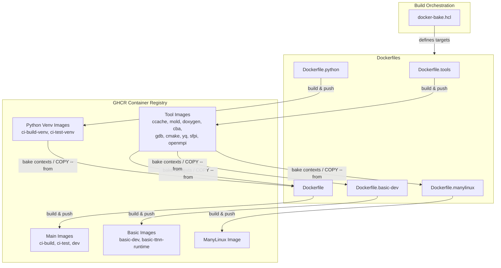
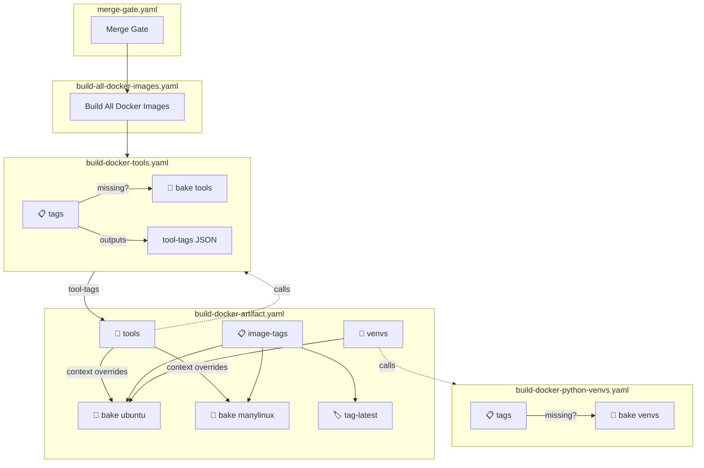

# TT-Metalium Docker Build System

This directory contains the Docker build system for TT-Metalium, including multi-stage Dockerfiles, tool installation scripts, and a Bake file for build orchestration.

## Architecture Overview

### Docker Image Layers


```mermaid
flowchart TB
    subgraph GHCR [GHCR Container Registry]
        ToolImages[Tool Images<br/>ccache, mold, doxygen, cba,<br/>gdb, cmake, yq, sfpi, openmpi]
        VenvImages[Python Venv Images<br/>ci-build-venv, ci-test-venv]
        MainImages[Main Images<br/>ci-build, ci-test, dev]
        BasicImages[Basic Images<br/>basic-dev, basic-ttnn-runtime]
        ManylinuxImage[ManyLinux Image]
    end

    subgraph Dockerfiles [Dockerfiles]
        DockerfileTools[Dockerfile.tools]
        DockerfilePython[Dockerfile.python]
        DockerfileMain[Dockerfile]
        DockerfileBasic[Dockerfile.basic-dev]
        DockerfileManylinux[Dockerfile.manylinux]
    end

    subgraph Orchestration [Build Orchestration]
        BakeFile[docker-bake.hcl]
    end

    BakeFile -->|defines targets| Dockerfiles
    DockerfileTools -->|build & push| ToolImages
    DockerfilePython -->|build & push| VenvImages
    ToolImages -->|"bake contexts / COPY --from"| DockerfileMain
    ToolImages -->|"bake contexts / COPY --from"| DockerfileBasic
    ToolImages -->|"bake contexts / COPY --from"| DockerfileManylinux
    VenvImages -->|"bake contexts / COPY --from"| DockerfileMain
    DockerfileMain -->|build & push| MainImages
    DockerfileBasic -->|build & push| BasicImages
    DockerfileManylinux -->|build & push| ManylinuxImage
```

- **Tool images** are built once by `Dockerfile.tools` and pushed to GHCR. They contain pre-built binaries (ccache, mold, doxygen, etc.) to avoid repeated downloads and compilations.
- **Python venv images** are built by `Dockerfile.python` and contain pre-installed Python dependencies for ci-build and ci-test environments.
- **Main images** pull these pre-built layers via Bake `contexts` which resolve to either local builds or GHCR images, dramatically reducing build times.
- **docker-bake.hcl** is the single source of truth for all build targets, dependencies, and configuration.

### How Bake Contexts Work

Tool and venv layers are injected into Dockerfiles via [Docker Buildx Bake contexts](https://docs.docker.com/build/bake/). Each downstream Dockerfile declares stub stages (`FROM scratch AS ccache-layer`, etc.) that Bake overrides:

- **Locally:** `"target:ccache"` -- Bake builds the `ccache` target from `Dockerfile.tools` first, then wires its output into the main build.
- **In CI:** `"docker-image://ghcr.io/.../ccache:tag"` -- Bake uses the pre-built GHCR image directly via `--set` overrides.

This eliminates the need for `--build-arg TOOL_X_IMAGE=...` plumbing between Dockerfiles, shell scripts, and workflows.

### CI Workflow Architecture


```mermaid
flowchart TD
    subgraph MergeGate [merge-gate.yaml]
        MG[Merge Gate]
    end

    subgraph AllDocker [build-all-docker-images.yaml]
        AD[Build All Docker Images]
    end

    subgraph Tools [build-docker-tools.yaml]
        ToolTags[📋 tags]
        ToolBuild[🔧 bake tools]
        ToolTags -->|missing?| ToolBuild
        ToolTags -->|outputs| TT[tool-tags JSON]
    end

    subgraph Venvs [build-docker-python-venvs.yaml]
        VenvTags[📋 tags]
        VenvBuild[🐍 bake venvs]
        VenvTags -->|missing?| VenvBuild
    end

    subgraph DockerArtifact [build-docker-artifact.yaml]
        DATools[🔧 tools]
        DAVenvs[🐍 venvs]
        ImgTags[📋 image-tags]
        Ubuntu[🐳 bake ubuntu]
        ML[🐳 bake manylinux]
        TagLatest[🏷️ tag-latest]
    end

    MG --> AD
    AD --> Tools
    Tools -->|tool-tags| DATools
    DATools -.->|calls| Tools
    DAVenvs -.->|calls| Venvs
    DATools -->|"context overrides"| Ubuntu
    DATools -->|"context overrides"| ML
    ImgTags --> Ubuntu
    ImgTags --> ML
    ImgTags --> TagLatest
    DAVenvs --> Ubuntu
```

**Job naming convention:** Short job IDs (e.g., `tags`, `ubuntu`) with descriptive `name:` fields for the GitHub UI (e.g., "📋 Compute image tags").

| Emoji | Meaning |
|-------|---------|
| 📋 | Compute tags / check existence |
| 🔧 | Build tools |
| 🐍 | Python-related |
| 🐳 | Docker image builds |
| 🏷️ | Tagging / labeling |

### Tool Tags JSON Bundle

Tool image tags are passed between workflows as a single JSON bundle instead of 9 individual parameters. In CI, the JSON is parsed to generate Bake `--set` context overrides.

**JSON bundle format:**
```json
{
  "ccache-tag": "ghcr.io/.../tools/ccache:4.10.2-abc12345",
  "mold-tag": "ghcr.io/.../tools/mold:2.35.1-def67890",
  "doxygen-tag": "ghcr.io/.../tools/doxygen:1.12.0-...",
  "cba-tag": "ghcr.io/.../tools/cba:1.6.0-...",
  "gdb-tag": "ghcr.io/.../tools/gdb:16.2-...",
  "cmake-tag": "ghcr.io/.../tools/cmake:3.31.6-...",
  "yq-tag": "ghcr.io/.../tools/yq:4.44.3-...",
  "sfpi-tag": "ghcr.io/.../tools/sfpi:v2025.03.03-...",
  "openmpi-tag": "ghcr.io/.../tools/openmpi:v5.0.7-ulfm-..."
}
```

## When to Use CI vs Local Builds

- **CI (GitHub Actions)**: The `build-docker-artifact.yaml` workflow builds tool images, Python venv images, and main images automatically using `docker buildx bake` with GHCR context overrides. Used by merge-gate, pr-gate, and build-artifact.
- **Local development**: Use `docker buildx bake` (directly or via `build-local.sh`) to build images locally. Bake automatically builds tool and venv dependencies first.

## Local Builds

### Quick Start (bake directly)

```bash
# Build the development image (tools+venvs built automatically)
docker buildx bake -f dockerfile/docker-bake.hcl dev

# Build for Ubuntu 24.04
UBUNTU_VERSION=24.04 PYTHON_VERSION=3.12 docker buildx bake -f dockerfile/docker-bake.hcl dev

# Build CI test image
docker buildx bake -f dockerfile/docker-bake.hcl ci-test

# Dry run (show what would be built)
docker buildx bake -f dockerfile/docker-bake.hcl --print dev

# Force rebuild with no cache
docker buildx bake -f dockerfile/docker-bake.hcl --no-cache dev
```

### Using the wrapper script

```bash
./dockerfile/build-local.sh dev
./dockerfile/build-local.sh --ubuntu 24.04 ci-test
./dockerfile/build-local.sh --no-cache dev
./dockerfile/build-local.sh --help
```

### Options

| Option | Description |
|--------|-------------|
| `--ubuntu VERSION` | Ubuntu version (default: 22.04) |
| `--tag TAG` | Output image tag override |
| `--no-cache` | Build without Docker cache |
| `--print` | Dry run: show what would be built |

### Targets

| Target | Description |
|--------|-------------|
| `dev` | Development image (default) |
| `ci-build` | CI build image |
| `ci-test` | CI test image |
| `release` | Release image |
| `release-models` | Release models image |
| `basic-dev` | Basic dev image |
| `basic-ttnn-runtime` | Basic TTNN runtime image |
| `manylinux` | ManyLinux wheel build image |
| `tools` | All tool images only |
| `venvs` | All Python venv images only |
| `all` | Everything |

## Dockerfiles

| Dockerfile | Purpose | Targets |
|------------|---------|---------|
| `Dockerfile` | Main CI/build/dev images | ci-build, ci-test, dev, release, release-models |
| `Dockerfile.basic-dev` | Minimal dev environment | base, basic-ttnn-runtime |
| `Dockerfile.evaluation` | Evaluation builds | - |
| `Dockerfile.manylinux` | ManyLinux wheel builds | - |
| `Dockerfile.python` | Python venv images | ci-build-venv, ci-test-venv |
| `Dockerfile.tools` | Tool images | ccache, mold, doxygen, cba, gdb, cmake, yq, sfpi, openmpi |

## Key Files

| File | Purpose |
|------|---------|
| `docker-bake.hcl` | Single source of truth for all build targets and dependencies |
| `build-local.sh` | Thin wrapper around `docker buildx bake` for local builds |
| `Dockerfile.tools` | Tool versions, hashes, and install stages |

## Workflow Files

| Workflow | Purpose |
|----------|---------|
| `build-all-docker-images.yaml` | Orchestrates tool + platform builds, outputs all image tags |
| `build-docker-artifact.yaml` | Builds images for a single platform (Ubuntu 22.04 or 24.04) |
| `build-docker-tools.yaml` | Builds tool images, outputs `tool-tags` JSON |
| `build-docker-python-venvs.yaml` | Builds Python venv images |

## Adding a New Tool

1. **Add to `Dockerfile.tools`:**
   - Add `ARG TOOL_VERSION=x.y.z` and `ARG TOOL_SHA256=...`
   - Add build stage with install script
   - Add `FROM scratch AS <tool>` final stage

2. **Create install script:** `scripts/install-tool.sh`

3. **Add to `docker-bake.hcl`:**
   - Add a new tool target
   - Add to the `tools` group
   - Add to the relevant `contexts` in `_main-common`, `_basic-common`, or `manylinux`

4. **Add `FROM scratch AS <tool>-layer`** stub to consuming Dockerfiles (Dockerfile, Dockerfile.basic-dev, etc.)

5. **Update JSON bundle generation** in `build-docker-tools.yaml` (tags job)

## Scripts

See [scripts/README.md](scripts/README.md) for:
- Tool installation scripts (install-ccache.sh, install-mold.sh, etc.)
- How to update tool versions
- Hash verification and compute-hashes.sh
