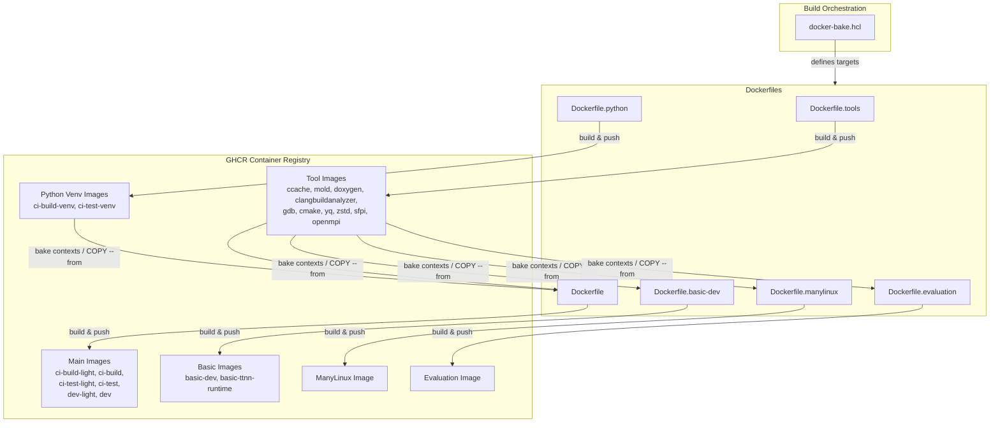
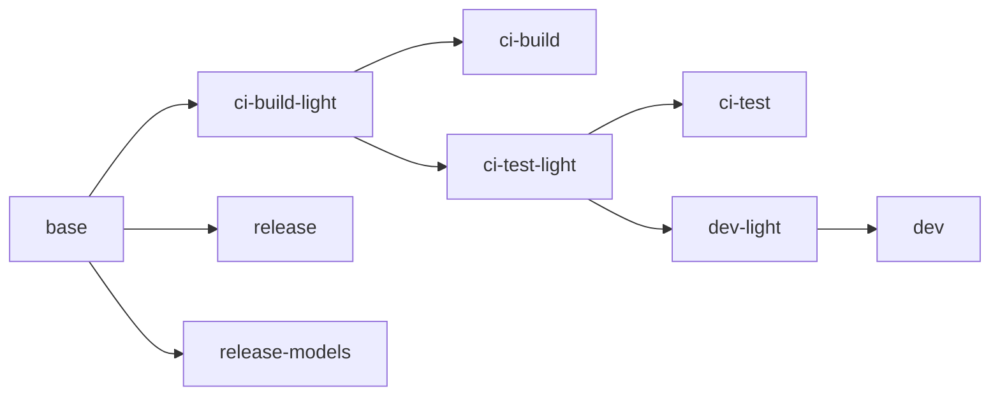
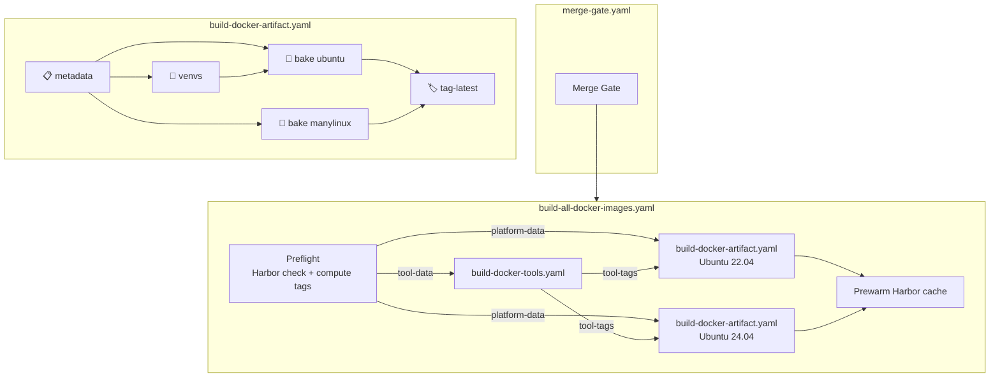

# TT-Metalium Docker Build System

This directory contains the Docker build system for TT-Metalium, including multi-stage Dockerfiles, tool installation scripts, and a Bake file for build orchestration.

## Architecture Overview

### Docker Image Layers


```mermaid
flowchart TB
    subgraph GHCR [GHCR Container Registry]
        ToolImages[Tool Images<br/>ccache, mold, doxygen, clangbuildanalyzer,<br/>gdb, cmake, yq, zstd, sfpi, openmpi]
        VenvImages[Python Venv Images<br/>ci-build-venv, ci-test-venv]
        MainImages[Main Images<br/>ci-build-light, ci-build,<br/>ci-test-light, ci-test,<br/>dev-light, dev]
        BasicImages[Basic Images<br/>basic-dev, basic-ttnn-runtime]
        ManylinuxImage[ManyLinux Image]
        EvalImage[Evaluation Image]
    end

    subgraph Dockerfiles [Dockerfiles]
        DockerfileTools[Dockerfile.tools]
        DockerfilePython[Dockerfile.python]
        DockerfileMain[Dockerfile]
        DockerfileBasic[Dockerfile.basic-dev]
        DockerfileManylinux[Dockerfile.manylinux]
        DockerfileEval[Dockerfile.evaluation]
    end

    subgraph Orchestration [Build Orchestration]
        BakeFile[docker-bake.hcl]
    end

    BakeFile -->|defines targets| Dockerfiles
    DockerfileTools -->|build & push| ToolImages
    DockerfilePython -->|build & push| VenvImages
    ToolImages -->|"bake contexts / COPY --from"| DockerfileMain
    ToolImages -->|"bake contexts / COPY --from"| DockerfileBasic
    ToolImages -->|"bake contexts / COPY --from"| DockerfileManylinux
    ToolImages -->|"bake contexts / COPY --from"| DockerfileEval
    VenvImages -->|"bake contexts / COPY --from"| DockerfileMain
    DockerfileMain -->|build & push| MainImages
    DockerfileBasic -->|build & push| BasicImages
    DockerfileManylinux -->|build & push| ManylinuxImage
    DockerfileEval -->|build & push| EvalImage
```

- **Tool images** are built once by `Dockerfile.tools` and pushed to GHCR. They contain pre-built binaries (ccache, mold, doxygen, etc.) to avoid repeated downloads and compilations.
- **Python venv images** are built by `Dockerfile.python` and contain pre-installed Python dependencies for ci-build, ci-test, and the full dev environment.
- **Main images** pull pre-built layers via Bake `contexts` which resolve to either local builds or GHCR images, dramatically reducing build times. The `*-light` images intentionally consume only tool contexts and skip venv contexts; their non-light counterparts add the matching pre-built venv layer.
- **Final image tags are dependency-aware.** Platform image hashes include the canonical tool tag bundle and any consumed venv hash. The `dev` tag also includes the preceding main image hashes, making the `dev` image a registry canary for the main Docker image chain.
- **docker-bake.hcl** is the **true** single source of truth for all build targets, dependencies, and configuration — not just for local builds, but also for CI. CI scripts and workflows derive tool lists from `docker buildx bake --print` at runtime rather than maintaining parallel hardcoded lists.

Main `Dockerfile` stage inheritance:


```mermaid
flowchart LR
    base --> ci-build-light
    ci-build-light --> ci-build
    ci-build-light --> ci-test-light
    ci-test-light --> ci-test
    ci-test-light --> dev-light
    dev-light --> dev
    base --> release
    base --> release-models
```

### How Bake Contexts Work

Tool and venv layers are injected into Dockerfiles via [Docker Buildx Bake contexts](https://docs.docker.com/build/bake/). Each downstream Dockerfile declares stub stages (`FROM scratch AS ccache-layer`, etc.) that Bake overrides:

- **Locally:** `"target:ccache"` -- Bake builds the `ccache` target from `Dockerfile.tools` first, then wires its output into the main build.
- **In CI:** `"docker-image://ghcr.io/.../ccache:tag"` -- workflows pass context overrides to manual `docker buildx bake` CLI invocations.

This eliminates the need for `--build-arg TOOL_X_IMAGE=...` plumbing between Dockerfiles, shell scripts, and workflows.

### CI Workflow Architecture


```mermaid
flowchart TD
    subgraph MergeGate [merge-gate.yaml]
        MG[Merge Gate]
    end

    subgraph AllDocker [build-all-docker-images.yaml]
        Preflight["Preflight<br/>Harbor check + compute tags"]
        BuildTools[build-docker-tools.yaml]
        Build2204["build-docker-artifact.yaml<br/>Ubuntu 22.04"]
        Build2404["build-docker-artifact.yaml<br/>Ubuntu 24.04"]
        PrewarmCache["Prewarm Harbor cache"]

        Preflight -->|tool-data| BuildTools
        Preflight -->|platform-data| Build2204
        Preflight -->|platform-data| Build2404
        BuildTools -->|tool-tags| Build2204
        BuildTools -->|tool-tags| Build2404
        Build2204 --> PrewarmCache
        Build2404 --> PrewarmCache
    end

    subgraph DockerArtifact [build-docker-artifact.yaml]
        Metadata[📋 metadata]
        DAVenvs[🐍 venvs]
        Ubuntu[🐳 bake ubuntu]
        ML[🐳 bake manylinux]
        TagLatest[🏷️ tag-latest]

        Metadata --> DAVenvs
        Metadata --> Ubuntu
        Metadata --> ML
        DAVenvs --> Ubuntu
        Ubuntu --> TagLatest
        ML --> TagLatest
    end

    MG --> AllDocker
```

**Job naming convention:** Short job IDs (e.g., `tags`, `ubuntu`) with descriptive `name:` fields for the GitHub UI (e.g., "📋 Compute image tags").

| Emoji | Meaning |
|-------|---------|
| 📋 | Compute tags / check existence |
| 🔧 | Build tools |
| 🐍 | Python-related |
| 🐳 | Docker image builds |
| 🏷️ | Tagging / labeling |

### Why CI Uses Manual Bake

CI intentionally runs `docker buildx bake` through shell commands (wrapped by `.github/actions/manual-docker-bake`) instead of `docker/bake-action`.

- `docker/bake-action` consistently failed in this repository with registry metadata resolution timeouts during `HEAD` requests.
- The observed failures triggered after a short timeout window that is not configurable through the action inputs.
- Manual CLI invocation with explicit retries and host-builder selection proved reliable on the same runners.

The result is: same Bake targets and contexts, but a more controllable execution path.

### Manual Bake Command Pattern (CI)

Workflows build a newline-delimited `set` payload, then run bake manually. Venv
contexts are added per target: `ci-build` uses `ci-build-venv-layer`, `ci-test`
and `dev` use `ci-test-venv-layer`, and `ci-build-light`, `ci-test-light`,
and `dev-light` use no venv layer.

```bash
docker buildx bake -f dockerfile/docker-bake.hcl \
  --set "ci-build.contexts.cmake-layer=docker-image://ghcr.io/.../tools/cmake:tag" \
  --set "ci-build.contexts.ci-build-venv-layer=docker-image://ghcr.io/.../python-venv/ci-build:tag" \
  --set "ci-build.tags=ghcr.io/.../ubuntu-22.04-ci-build-amd64:<hash>" \
  --set "ci-build.output=type=image,push=true,compression=zstd,compression-level=22,force-compression=true,oci-mediatypes=true" \
  ci-build

docker buildx bake -f dockerfile/docker-bake.hcl \
  --set "dev-light.contexts.cmake-layer=docker-image://ghcr.io/.../tools/cmake:tag" \
  --set "dev-light.tags=ghcr.io/.../ubuntu-22.04-dev-light-amd64:<hash>" \
  --set "dev-light.output=type=image,push=true,compression=zstd,compression-level=22,force-compression=true,oci-mediatypes=true" \
  dev-light

docker buildx bake -f dockerfile/docker-bake.hcl \
  --set "dev.contexts.cmake-layer=docker-image://ghcr.io/.../tools/cmake:tag" \
  --set "dev.contexts.ci-test-venv-layer=docker-image://ghcr.io/.../python-venv/ci-test:tag" \
  --set "dev.tags=ghcr.io/.../ubuntu-22.04-dev-amd64:<hash>" \
  --set "dev.output=type=image,push=true,compression=zstd,compression-level=22,force-compression=true,oci-mediatypes=true" \
  dev
```

The same pattern is used for tools, venvs, main images, basic images, and manylinux.

### Tool Tags JSON Bundle

Tool image tags are passed between workflows as a single JSON bundle instead of 9 individual parameters. In CI, the JSON is parsed to generate Bake `--set` context overrides for manual `docker buildx bake` invocations.

**JSON bundle format:**
```json
{
  "ccache-tag": "ghcr.io/.../tools/ccache:4.10.2-<hash>",
  "mold-tag": "ghcr.io/.../tools/mold:2.40.4-<hash>",
  "doxygen-tag": "ghcr.io/.../tools/doxygen:1.16.1-<hash>",
  "clangbuildanalyzer-tag": "ghcr.io/.../tools/clangbuildanalyzer:1.6.0-<hash>",
  "gdb-tag": "ghcr.io/.../tools/gdb:14.2-<hash>",
  "cmake-tag": "ghcr.io/.../tools/cmake:4.2.3-<hash>",
  "yq-tag": "ghcr.io/.../tools/yq:v4.44.6-<hash>",
  "zstd-tag": "ghcr.io/.../tools/zstd:1.5.7-<hash>",
  "sfpi-tag": "ghcr.io/.../tools/sfpi:<version>-<hash>",
  "openmpi-tag": "ghcr.io/.../tools/openmpi:v5.0.7-<hash>"
}
```

## When to Use CI vs Local Builds

- **CI (GitHub Actions)**: The `build-docker-artifact.yaml` workflow builds tool images, Python venv images, and main images automatically using manual `docker buildx bake` with GHCR context overrides. Used by merge-gate, pr-gate, and build-artifact.
- **Local development**: Use `docker buildx bake -f dockerfile/docker-bake.hcl <target>` directly. Bake automatically builds required tool and venv dependencies first.

## Local Builds

### Quick Start

```bash
# Build the development image (tools+venvs built automatically)
docker buildx bake -f dockerfile/docker-bake.hcl dev

# Build the development image without pre-built venv layers
docker buildx bake -f dockerfile/docker-bake.hcl dev-light

# Ubuntu 24.04 variant — PYTHON_VERSION must match: 22.04→3.10, 24.04→3.12
UBUNTU_VERSION=24.04 PYTHON_VERSION=3.12 docker buildx bake -f dockerfile/docker-bake.hcl dev

# Build CI test image
docker buildx bake -f dockerfile/docker-bake.hcl ci-test

# Dry run (show what would be built)
docker buildx bake -f dockerfile/docker-bake.hcl --print dev

# Force rebuild with no cache
docker buildx bake -f dockerfile/docker-bake.hcl --no-cache dev
```

### Targets

| Target | Description |
|--------|-------------|
| `dev` | Development image (default), built from `dev-light` plus `ci-test-venv-layer` |
| `dev-light` | Development image without pre-built Python venv layers |
| `ci-build` | CI build image, built from `ci-build-light` plus `ci-build-venv-layer` |
| `ci-build-light` | CI build image without pre-built Python venv layers |
| `ci-test` | CI test image, built from `ci-test-light` plus `ci-test-venv-layer` |
| `ci-test-light` | CI test image without pre-built Python venv layers |
| `release` | Release image |
| `release-models` | Release models image |
| `basic-dev` | Basic dev image |
| `basic-ttnn-runtime` | Basic TTNN runtime image |
| `manylinux` | ManyLinux wheel build image |
| `evaluation` | Evaluation build image |
| `tools` | All tool images only |
| `venvs` | All Python venv images only |
| `all` | Everything |

## Dockerfiles

| Dockerfile | Purpose | Targets |
|------------|---------|---------|
| `Dockerfile` | Main CI/build/dev images | ci-build-light, ci-build, ci-test-light, ci-test, dev-light, dev, release, release-models |
| `Dockerfile.basic-dev` | Minimal dev environment | base, basic-ttnn-runtime |
| `Dockerfile.evaluation` | Evaluation builds | evaluation |
| `Dockerfile.manylinux` | ManyLinux wheel builds | manylinux |
| `Dockerfile.python` | Python venv images | ci-build-venv, ci-test-venv |
| `Dockerfile.tools` | Tool images | ccache, mold, doxygen, clangbuildanalyzer, gdb, cmake, yq, zstd, sfpi, openmpi |

## Key Files

| File | Purpose |
|------|---------|
| `docker-bake.hcl` | Single source of truth for all build targets and dependencies |
| `Dockerfile.tools` | Tool versions, hashes, and install stages |

## Workflow Files

| Workflow | Purpose |
|----------|---------|
| `build-all-docker-images.yaml` | Orchestrates preflight, tool, and platform builds; outputs all image tags |
| `build-docker-artifact.yaml` | Builds images for a single platform (Ubuntu 22.04 or 24.04) |
| `build-docker-tools.yaml` | Builds tool images, outputs `tool-tags` JSON |
| `build-docker-python-venvs.yaml` | Builds Python venv images |
| `build-evaluation-image.yaml` | Builds the evaluation image with explicit tool layer build-contexts |
| `check-harbor.yaml` | Checks Harbor registry availability, outputs `harbor-prefix` |

## Utility Scripts And Actions

These utilities are part of the build architecture even though they are not Dockerfiles or top-level workflows. They explain why adding a tool touches more than just `Dockerfile.tools`.

| Utility | Purpose | Why it is separate |
|---------|---------|--------------------|
| `.github/scripts/compute-tool-tags.sh` | Computes deterministic `tool-tags` JSON such as `ccache-tag` or `sfpi-tag` from the tool version source of truth plus install-script content hashes | This script is pure tag computation. It does not check the registry. Keeping it pure makes the tag format reusable anywhere a workflow needs the canonical tag values |
| `.github/scripts/compute-tool-data.sh` | Wraps `compute-tool-tags.sh`, checks whether each tool image already exists, and emits `*_exists` booleans plus `any_missing` | CI needs both the tag values and the build/no-build decision. Separating this from `compute-tool-tags.sh` avoids duplicating tag logic while keeping registry access optional |
| `.github/scripts/compute-platform-data.sh` | Computes tags, existence metadata, and venv required flags for platform images and Python venv images, including all `*-light` images | Tool and venv changes affect downstream image hashes. This script checks the dependency-aware `dev` image first as a canary, then inspects light image manifests and only checks dependency manifests when a missing final image needs them |
| `.github/scripts/dockerfile-hash.sh` | Hashes a Dockerfile together with its `COPY` inputs and selected extra files | This is the cache-drift guardrail for content-addressed image tags. When tool-related files change, downstream image tags change automatically |
| `.github/actions/manual-docker-bake` | Shared wrapper that runs `docker buildx bake` via CLI with retries, env setup, and post-build validation | CI intentionally uses manual Bake instead of `docker/bake-action`, so this action centralizes the reliable invocation pattern in one place |
| `.github/scripts/get-target-tools.sh` | Queries `docker buildx bake --print <target>` and returns space-separated tool names by extracting `-layer` context keys. For groups (e.g. `tools`), returns the group's targets array. Used by workflows to derive tool lists without hardcoding them | Centralizes the bake `--print` query pattern so all callers (`build-docker-artifact.yaml`, `build-docker-tools.yaml`, `validate-docker-bake-ci.py`) get tool lists from the same source |
| `.github/actions/prewarm-images` | Pulls images through Harbor or GHCR to warm caches after builds | `tool-tags` is consumed as structured JSON outside the build steps themselves, so adding a new `"<tool>-tag"` key may require updating explicit key lists in callers such as `build-all-docker-images.yaml` |

### Why both `compute-tool-tags` and `compute-tool-data` exist

- `compute-tool-tags.sh` answers: "What should the tag be for this tool image?"
- `compute-tool-data.sh` answers: "What should the tags be, and which of those images are already present in the registry?"
- The split matters because some callers only need canonical tags, while others also need existence checks to decide whether to skip or trigger builds.
- It also keeps local validation easy: you can run `compute-tool-tags.sh` without requiring registry access, and only use `compute-tool-data.sh` when you want the CI-style missing-image decision.

## Adding a New Tool

Use this checklist when adding a new tool. All listed files must be updated to avoid build failures or cache drift.

| # | File | Change |
|---|------|--------|
| 1 | `dockerfile/Dockerfile.tools` | Add version metadata (`ARG <TOOL>_VERSION` or `ARG <TOOL>_TAG`, plus `ARG <TOOL>_SHA256` when applicable) unless the tool already has an external single source of truth like `sfpi`. Add a builder stage that installs into `/install`, then add `FROM scratch AS <tool>` as the exported tool target |
| 2 | `dockerfile/scripts/install-<tool>.sh` | Create or reuse an install script unless the tool is copied directly from an official pinned image. Follow existing script conventions: `set -euo pipefail`, SHA256 verification, and install into `/install` or `/install/...` |
| 3 | `dockerfile/docker-bake.hcl` | Add `target "<tool>"`, add it to group `tools`, and wire `<tool>-layer = "target:<tool>"` into every consumer target that should receive it: `_main-common`, `_basic-common`, `manylinux`, and/or `evaluation` |
| 4 | Consuming Dockerfiles (`dockerfile/Dockerfile`, `dockerfile/Dockerfile.basic-dev`, `dockerfile/Dockerfile.manylinux`, `dockerfile/Dockerfile.evaluation`) | For each image that uses the tool, add `FROM scratch AS <tool>-layer` and the actual `COPY --from=<tool>-layer ...` or `RUN --mount=from=<tool>-layer ...` usage. Do not add only the stub; the tool must also be consumed in the build stage |
| 5 | `.github/scripts/compute-tool-tags.sh` | Add version extraction from the real source of truth, compute the content hash from the install script and any version file(s), then add the new `--arg` and `"<tool>-tag"` JSON entry |
| 6 | `.github/scripts/compute-tool-data.sh` | **No changes needed.** The `TOOLS` list and per-tool existence flags are now derived automatically from `docker buildx bake --print tools` |
| 7 | `.github/workflows/build-docker-tools.yaml` | **No changes needed.** The `add_if_missing` loop now iterates over bake group targets automatically |
| 8 | `.github/workflows/build-docker-artifact.yaml` | **No changes needed for tool-only additions.** `ALL_TOOLS`, `BASIC_TOOLS`, and the manylinux tool loop are derived automatically from `docker buildx bake --print` via `get-target-tools.sh`. Update this workflow when adding/removing image targets or changing per-target venv context wiring |
| 9 | `.github/scripts/get-target-tools.sh` | **No changes needed for tool-only additions.** Tool lists are derived from bake at runtime. Update comments/examples if target names or groups change |
| 10 | `.github/workflows/build-evaluation-image.yaml` | If `dockerfile/Dockerfile.evaluation` uses the tool, expose `<tool>-tag` from `check-tool-images` and add `<tool>-layer=docker-image://...` to `build-contexts` |
| 11 | Other explicit `tool-tags` consumers (currently `build-all-docker-images.yaml`) | If a workflow enumerates JSON keys explicitly, add the new `"<tool>-tag"` key there too so prewarming/reporting includes the new image |

### Validation steps

Before considering the change complete, validate all of the following:

1. `docker buildx bake -f dockerfile/docker-bake.hcl --print tools` shows the new tool target.
2. `docker buildx bake -f dockerfile/docker-bake.hcl --print <consumer-target>` shows the new `<tool>-layer` context for each image that should consume it.
3. `.github/scripts/compute-tool-tags.sh <repo>` emits a `"<tool>-tag"` entry.
4. `.github/scripts/compute-tool-data.sh <repo> --no-check-exists` emits a `<tool>_exists` field.

Optional but recommended follow-up docs:

- Add the new script to `dockerfile/scripts/README.md` if you created one.
- Update any comments or tool lists in Dockerfiles that enumerate the available tools.

### AI agent prompt

Use this prompt when asking an AI to add a new tool:

```
Add a new tool "<tool-name>" to the TT-Metalium Docker build system.

Requirements:
- First inspect the existing patterns in `dockerfile/Dockerfile.tools`, `dockerfile/docker-bake.hcl`, `.github/scripts/compute-tool-tags.sh`, and `.github/workflows/build-evaluation-image.yaml`.
- Determine which images should consume the tool: main (`dockerfile/Dockerfile`), basic (`dockerfile/Dockerfile.basic-dev`), manylinux (`dockerfile/Dockerfile.manylinux`), and/or evaluation (`dockerfile/Dockerfile.evaluation`).
- Update every required file from the "Adding a New Tool" checklist in `dockerfile/README.md`.
- In `Dockerfile.tools`, add the builder stage and exported `FROM scratch AS <tool>` stage. Install into `/install`. If the tool follows a special source-of-truth pattern like `sfpi` or `openmpi`, preserve that pattern instead of forcing a generic `<TOOL>_VERSION`/`<TOOL>_SHA256` layout.
- Create or reuse `dockerfile/scripts/install-<tool>.sh` unless the tool can be copied from an official pinned image.
- In `docker-bake.hcl`, add the target, add it to the `tools` group, and wire `<tool>-layer` into the contexts of every consumer target that should receive it.
- In consumer Dockerfiles, add both the `FROM scratch AS <tool>-layer` stub and the actual `COPY --from` or `RUN --mount=from` usage.
- In `.github/scripts/compute-tool-tags.sh`, add version extraction and hash computation for the new tool.
- If evaluation uses the tool, update `.github/workflows/build-evaluation-image.yaml`.
- If `build-all-docker-images.yaml` enumerates tool-tags keys explicitly, add the new key there.
- For tool-only additions, do not edit `build-docker-artifact.yaml`, `build-docker-tools.yaml`, `compute-tool-data.sh`, `validate-docker-bake-ci.py`, or `get-target-tools.sh` unless validation shows a mismatch; these derive tool lists automatically from `docker buildx bake --print` at runtime. For image target or venv wiring changes, update the affected workflow and validation logic explicitly.
- Match the style of existing tools such as `ccache`, `cmake`, `openmpi`, or `sfpi`, whichever is structurally closest.

Validation:
- Run `docker buildx bake -f dockerfile/docker-bake.hcl --print tools`
- Run `docker buildx bake -f dockerfile/docker-bake.hcl --print <each consumer target you changed>`
- Run `.github/scripts/compute-tool-tags.sh <repo>`
- Run `.github/scripts/compute-tool-data.sh <repo> --no-check-exists`

After editing, summarize:
1. which files changed,
2. which images now consume the tool,
3. the generated JSON key name (`<tool>-tag`),
4. any special cases or assumptions.
```

## Scripts

See [scripts/README.md](scripts/README.md) for:
- Tool installation scripts (install-ccache.sh, install-mold.sh, etc.)
- How to update tool versions
- Hash verification and compute-hashes.sh
