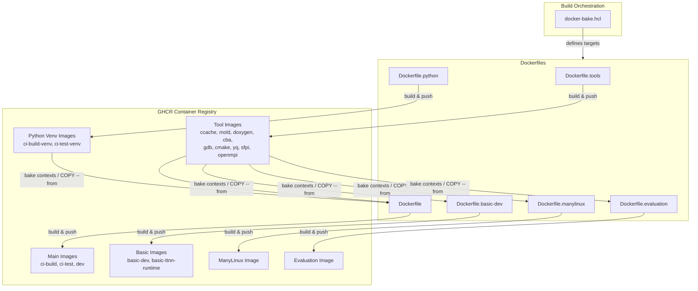
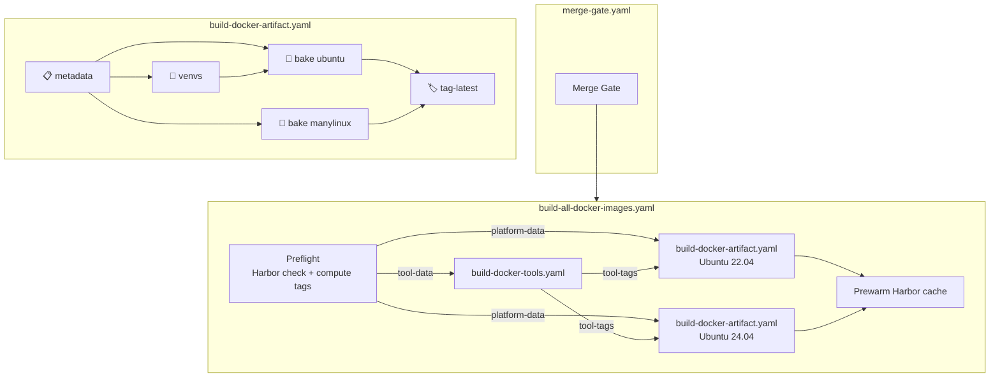

# TT-Metalium Docker Build System

This directory contains the Docker build system for TT-Metalium, including multi-stage Dockerfiles, tool installation scripts, and a Bake file for build orchestration.

## Architecture Overview

### Docker Image Layers


```mermaid
flowchart TB
    subgraph GHCR [GHCR Container Registry]
        ToolImages[Tool Images<br/>ccache, mold, doxygen, cba,<br/>gdb, cmake, yq, sfpi, openmpi]
        VenvImages[Python Venv Images<br/>ci-build-venv, ci-test-venv]
        MainImages[Main Images<br/>ci-build, ci-test, dev]
        BasicImages[Basic Images<br/>basic-dev, basic-ttnn-runtime]
        ManylinuxImage[ManyLinux Image]
        EvalImage[Evaluation Image]
    end

    subgraph Dockerfiles [Dockerfiles]
        DockerfileTools[Dockerfile.tools]
        DockerfilePython[Dockerfile.python]
        DockerfileMain[Dockerfile]
        DockerfileBasic[Dockerfile.basic-dev]
        DockerfileManylinux[Dockerfile.manylinux]
        DockerfileEval[Dockerfile.evaluation]
    end

    subgraph Orchestration [Build Orchestration]
        BakeFile[docker-bake.hcl]
    end

    BakeFile -->|defines targets| Dockerfiles
    DockerfileTools -->|build & push| ToolImages
    DockerfilePython -->|build & push| VenvImages
    ToolImages -->|"bake contexts / COPY --from"| DockerfileMain
    ToolImages -->|"bake contexts / COPY --from"| DockerfileBasic
    ToolImages -->|"bake contexts / COPY --from"| DockerfileManylinux
    ToolImages -->|"bake contexts / COPY --from"| DockerfileEval
    VenvImages -->|"bake contexts / COPY --from"| DockerfileMain
    DockerfileMain -->|build & push| MainImages
    DockerfileBasic -->|build & push| BasicImages
    DockerfileManylinux -->|build & push| ManylinuxImage
    DockerfileEval -->|build & push| EvalImage
```

- **Tool images** are built once by `Dockerfile.tools` and pushed to GHCR. They contain pre-built binaries (ccache, mold, doxygen, etc.) to avoid repeated downloads and compilations.
- **Python venv images** are built by `Dockerfile.python` and contain pre-installed Python dependencies for ci-build and ci-test environments.
- **Main images** pull these pre-built layers via Bake `contexts` which resolve to either local builds or GHCR images, dramatically reducing build times.
- **docker-bake.hcl** is the single source of truth for all build targets, dependencies, and configuration.

### How Bake Contexts Work

Tool and venv layers are injected into Dockerfiles via [Docker Buildx Bake contexts](https://docs.docker.com/build/bake/). Each downstream Dockerfile declares stub stages (`FROM scratch AS ccache-layer`, etc.) that Bake overrides:

- **Locally:** `"target:ccache"` -- Bake builds the `ccache` target from `Dockerfile.tools` first, then wires its output into the main build.
- **In CI:** `"docker-image://ghcr.io/.../ccache:tag"` -- workflows pass context overrides to manual `docker buildx bake` CLI invocations.

This eliminates the need for `--build-arg TOOL_X_IMAGE=...` plumbing between Dockerfiles, shell scripts, and workflows.

### CI Workflow Architecture


```mermaid
flowchart TD
    subgraph MergeGate [merge-gate.yaml]
        MG[Merge Gate]
    end

    subgraph AllDocker [build-all-docker-images.yaml]
        Preflight["Preflight<br/>Harbor check + compute tags"]
        BuildTools[build-docker-tools.yaml]
        Build2204["build-docker-artifact.yaml<br/>Ubuntu 22.04"]
        Build2404["build-docker-artifact.yaml<br/>Ubuntu 24.04"]
        PrewarmCache["Prewarm Harbor cache"]

        Preflight -->|tool-data| BuildTools
        Preflight -->|platform-data| Build2204
        Preflight -->|platform-data| Build2404
        BuildTools -->|tool-tags| Build2204
        BuildTools -->|tool-tags| Build2404
        Build2204 --> PrewarmCache
        Build2404 --> PrewarmCache
    end

    subgraph DockerArtifact [build-docker-artifact.yaml]
        Metadata[📋 metadata]
        DAVenvs[🐍 venvs]
        Ubuntu[🐳 bake ubuntu]
        ML[🐳 bake manylinux]
        TagLatest[🏷️ tag-latest]

        Metadata --> DAVenvs
        Metadata --> Ubuntu
        Metadata --> ML
        DAVenvs --> Ubuntu
        Ubuntu --> TagLatest
        ML --> TagLatest
    end

    MG --> AllDocker
```

**Job naming convention:** Short job IDs (e.g., `tags`, `ubuntu`) with descriptive `name:` fields for the GitHub UI (e.g., "📋 Compute image tags").

| Emoji | Meaning |
|-------|---------|
| 📋 | Compute tags / check existence |
| 🔧 | Build tools |
| 🐍 | Python-related |
| 🐳 | Docker image builds |
| 🏷️ | Tagging / labeling |

### Why CI Uses Manual Bake

CI intentionally runs `docker buildx bake` through shell commands (wrapped by `.github/actions/manual-docker-bake`) instead of `docker/bake-action`.

- `docker/bake-action` consistently failed in this repository with registry metadata resolution timeouts during `HEAD` requests.
- The observed failures triggered after a short timeout window that is not configurable through the action inputs.
- Manual CLI invocation with explicit retries and host-builder selection proved reliable on the same runners.

The result is: same Bake targets and contexts, but a more controllable execution path.

### Manual Bake Command Pattern (CI)

Workflows build a newline-delimited `set` payload, then run bake manually:

```bash
docker buildx bake -f dockerfile/docker-bake.hcl \
  --set "ci-build.contexts.cmake-layer=docker-image://ghcr.io/.../tools/cmake:tag" \
  --set "ci-build.contexts.ci-build-venv-layer=docker-image://ghcr.io/.../python-venv/ci-build:tag" \
  --set "ci-build.tags=ghcr.io/.../ubuntu-22.04-ci-build-amd64:<hash>" \
  --set "ci-build.output=type=image,push=true,compression=zstd,compression-level=22,force-compression=true,oci-mediatypes=true" \
  ci-build
```

The same pattern is used for tools, venvs, main images, basic images, and manylinux.

### Tool Tags JSON Bundle

Tool image tags are passed between workflows as a single JSON bundle instead of 9 individual parameters. In CI, the JSON is parsed to generate Bake `--set` context overrides for manual `docker buildx bake` invocations.

**JSON bundle format:**
```json
{
  "ccache-tag": "ghcr.io/.../tools/ccache:4.10.2-<hash>",
  "mold-tag": "ghcr.io/.../tools/mold:2.40.4-<hash>",
  "doxygen-tag": "ghcr.io/.../tools/doxygen:1.16.1-<hash>",
  "cba-tag": "ghcr.io/.../tools/cba:1.6.0-<hash>",
  "gdb-tag": "ghcr.io/.../tools/gdb:14.2-<hash>",
  "cmake-tag": "ghcr.io/.../tools/cmake:4.2.3-<hash>",
  "yq-tag": "ghcr.io/.../tools/yq:v4.44.6-<hash>",
  "sfpi-tag": "ghcr.io/.../tools/sfpi:<version>-<hash>",
  "openmpi-tag": "ghcr.io/.../tools/openmpi:v5.0.7-<hash>"
}
```

## When to Use CI vs Local Builds

- **CI (GitHub Actions)**: The `build-docker-artifact.yaml` workflow builds tool images, Python venv images, and main images automatically using manual `docker buildx bake` with GHCR context overrides. Used by merge-gate, pr-gate, and build-artifact.
- **Local development**: Use `docker buildx bake` (directly or via `build-local.sh`) to build images locally. Bake automatically builds tool and venv dependencies first.

## Local Builds

### Quick Start (bake directly)

```bash
# Build the development image (tools+venvs built automatically)
docker buildx bake -f dockerfile/docker-bake.hcl dev

# Build for Ubuntu 24.04
UBUNTU_VERSION=24.04 PYTHON_VERSION=3.12 docker buildx bake -f dockerfile/docker-bake.hcl dev

# Build CI test image
docker buildx bake -f dockerfile/docker-bake.hcl ci-test

# Dry run (show what would be built)
docker buildx bake -f dockerfile/docker-bake.hcl --print dev

# Force rebuild with no cache
docker buildx bake -f dockerfile/docker-bake.hcl --no-cache dev
```

### Using the wrapper script

```bash
./dockerfile/build-local.sh dev
./dockerfile/build-local.sh --ubuntu 24.04 ci-test
./dockerfile/build-local.sh --set ci-build.output=type=docker ci-build
./dockerfile/build-local.sh --no-cache dev
./dockerfile/build-local.sh --help
```

### Options

| Option | Description |
|--------|-------------|
| `--ubuntu VERSION` | Ubuntu version (default: 22.04) |
| `--tag TAG` | Output image tag override |
| `--set KEY=VALUE` | Extra Bake override; repeatable |
| `--no-cache` | Build without Docker cache |
| `--print` | Dry run: show what would be built |

### Targets

| Target | Description |
|--------|-------------|
| `dev` | Development image (default) |
| `ci-build` | CI build image |
| `ci-test` | CI test image |
| `release` | Release image |
| `release-models` | Release models image |
| `basic-dev` | Basic dev image |
| `basic-ttnn-runtime` | Basic TTNN runtime image |
| `manylinux` | ManyLinux wheel build image |
| `evaluation` | Evaluation build image |
| `tools` | All tool images only |
| `venvs` | All Python venv images only |
| `all` | Everything |

## Dockerfiles

| Dockerfile | Purpose | Targets |
|------------|---------|---------|
| `Dockerfile` | Main CI/build/dev images | ci-build, ci-test, dev, release, release-models |
| `Dockerfile.basic-dev` | Minimal dev environment | base, basic-ttnn-runtime |
| `Dockerfile.evaluation` | Evaluation builds | evaluation |
| `Dockerfile.manylinux` | ManyLinux wheel builds | manylinux |
| `Dockerfile.python` | Python venv images | ci-build-venv, ci-test-venv |
| `Dockerfile.tools` | Tool images | ccache, mold, doxygen, cba, gdb, cmake, yq, sfpi, openmpi |

## Key Files

| File | Purpose |
|------|---------|
| `docker-bake.hcl` | Single source of truth for all build targets and dependencies |
| `build-local.sh` | Thin wrapper around `docker buildx bake` for local builds |
| `Dockerfile.tools` | Tool versions, hashes, and install stages |

## Workflow Files

| Workflow | Purpose |
|----------|---------|
| `build-all-docker-images.yaml` | Orchestrates preflight, tool, and platform builds; outputs all image tags |
| `build-docker-artifact.yaml` | Builds images for a single platform (Ubuntu 22.04 or 24.04) |
| `build-docker-tools.yaml` | Builds tool images, outputs `tool-tags` JSON |
| `build-docker-python-venvs.yaml` | Builds Python venv images |
| `check-harbor.yaml` | Checks Harbor registry availability, outputs `harbor-prefix` |

## Adding a New Tool

Use this checklist when adding a new tool. All listed files must be updated to avoid build failures or cache drift.

| # | File | Change |
|---|------|--------|
| 1 | `dockerfile/Dockerfile.tools` | Add `ARG TOOL_VERSION=x.y.z` (or `ARG TOOL_TAG=...` for tag-style versions), `ARG TOOL_SHA256=...`, build stage with install script, and `FROM scratch AS <tool>` final stage |
| 2 | `dockerfile/scripts/install-<tool>.sh` | Create install script if a Docker artifact (e.g. uv) is unavailable |
| 3 | `dockerfile/docker-bake.hcl` | Add `target "<tool>"` block, add to `tools` group, add to `contexts` in `_main-common`, `_basic-common`, and/or `manylinux` as appropriate |
| 4 | Consuming Dockerfiles (e.g. `dockerfile/Dockerfile`) | Add `FROM scratch AS <tool>-layer` stub to each Dockerfile that uses the tool |
| 5 | `.github/scripts/compute-tool-tags.sh` | Add version extraction (from Dockerfile.tools or version file), hash computation, and `--arg` + JSON key in `jq -n` output |
| 6 | `.github/workflows/build-docker-tools.yaml` | Add `<tool>` to the `for key in` loop in "Check if tool images exist" step; add `add_if_missing <tool> ...` in "Prepare bake overrides" step |
| 7 | `.github/workflows/build-docker-artifact.yaml` | Add to `ALL_TOOLS` (main images), `BASIC_TOOLS` (basic-dev, basic-ttnn-runtime), or manylinux `for tool in` list as appropriate |

### AI agent prompt

Use this prompt when asking an AI to add a new tool:

```
Add a new tool "<tool-name>" to the TT-Metalium Docker build system. Follow the "Adding a New Tool" checklist in dockerfile/README.md: update Dockerfile.tools, create install-<tool>.sh, update docker-bake.hcl, add FROM scratch stubs to consuming Dockerfiles (check which images use the tool—main, basic, manylinux, evaluation), update compute-tool-tags.sh, build-docker-tools.yaml, and build-docker-artifact.yaml. Match the patterns used by existing tools like ccache or sfpi.
```

## Scripts

See [scripts/README.md](scripts/README.md) for:
- Tool installation scripts (install-ccache.sh, install-mold.sh, etc.)
- How to update tool versions
- Hash verification and compute-hashes.sh
