# TT-Metalium Docker Build System

This directory contains the Docker build system for TT-Metalium, including multi-stage Dockerfiles, tool installation scripts, and local build automation.

## Architecture Overview

### Docker Image Layers


- **Tool images** are built once by `Dockerfile.tools` and pushed to GHCR. They contain pre-built binaries (ccache, mold, doxygen, etc.) to avoid repeated downloads and compilations.
- **Python venv images** are built by `Dockerfile.python` and contain pre-installed Python dependencies for ci-build and ci-test environments.
- **Main images** pull these pre-built layers via `COPY --from=` instead of building from scratch, dramatically reducing build times.

### CI Workflow Architecture

```mermaid
flowchart TD
    subgraph MergeGate [merge-gate.yaml]
        MG[Merge Gate]
    end

    subgraph AllDocker [build-all-docker-images.yaml]
        AD[Build All Docker Images]
    end

    subgraph Tools [build-docker-tools.yaml]
        ToolTags[📋 tags]
        ToolBuild[🔧 build]
        ToolTags -->|missing?| ToolBuild
        ToolTags -->|outputs| TT[tool-tags JSON]
    end

    subgraph Venvs [build-docker-python-venvs.yaml]
        VenvTags[📋 tags]
        VenvBuild[🐍 build]
        VenvTags -->|missing?| VenvBuild
    end

    subgraph DockerArtifact [build-docker-artifact.yaml]
        DATools[🔧 tools]
        DAVenvs[🐍 venvs]
        ImgTags[📋 image-tags]
        Ubuntu[🐳 ubuntu]
        ML[🐳 manylinux]
        TagLatest[🏷️ tag-latest]
    end

    subgraph CompositeAction [setup-tool-buildargs action]
        CA[Extract tool tags<br/>from JSON bundle]
    end

    MG --> AD
    AD --> Tools
    Tools -->|tool-tags| DATools
    DATools -.->|calls| Tools
    DAVenvs -.->|calls| Venvs
    DATools -->|tool-tags| Ubuntu
    DATools -->|tool-tags| ML
    ImgTags --> Ubuntu
    ImgTags --> ML
    ImgTags --> TagLatest
    DAVenvs --> Ubuntu
    Ubuntu -.->|uses| CA
    ML -.->|uses| CA
```



**Job naming convention:** Short job IDs (e.g., `tags`, `ubuntu`) with descriptive `name:` fields for the GitHub UI (e.g., "📋 Compute image tags").

| Emoji | Meaning |
|-------|---------|
| 📋 | Compute tags / check existence |
| 🔧 | Build tools |
| 🐍 | Python-related |
| 🐳 | Docker image builds |
| 🏷️ | Tagging / labeling |

### Tool Tags JSON Bundle

Tool image tags are passed between workflows as a single JSON bundle instead of 9 individual parameters. This simplifies maintenance and reduces boilerplate.


**JSON bundle format:**
```json
{
  "ccache-tag": "ghcr.io/.../tools/ccache:4.10.2-abc12345",
  "mold-tag": "ghcr.io/.../tools/mold:2.35.1-def67890",
  "doxygen-tag": "ghcr.io/.../tools/doxygen:1.12.0-...",
  "cba-tag": "ghcr.io/.../tools/cba:1.6.0-...",
  "gdb-tag": "ghcr.io/.../tools/gdb:16.2-...",
  "cmake-tag": "ghcr.io/.../tools/cmake:3.31.6-...",
  "yq-tag": "ghcr.io/.../tools/yq:4.44.3-...",
  "sfpi-tag": "ghcr.io/.../tools/sfpi:v2025.03.03-...",
  "openmpi-tag": "ghcr.io/.../tools/openmpi:v5.0.7-ulfm-..."
}
```

## Composite Action: setup-tool-buildargs

The `.github/actions/setup-tool-buildargs` action extracts individual tool tags from the JSON bundle and formats them for Docker builds.

**Usage:**
```yaml
- uses: ./.github/actions/setup-tool-buildargs
  id: tool-args
  with:
    # Resolve from input (if provided) or from tools job output
    tool-tags: ${{ inputs.tool-tags || needs.tools.outputs.tool-tags }}
    include: ccache,mold,sfpi,openmpi  # Optional: filter to specific tools

- uses: docker/build-push-action@v6
  with:
    build-args: ${{ steps.tool-args.outputs.build-args }}
```

**Outputs:**
- `build-args`: Multi-line string ready for `docker/build-push-action`
- Individual tags: `ccache-tag`, `mold-tag`, etc. for direct access

## When to Use CI vs Local Builds

- **CI (GitHub Actions)**: The `build-docker-artifact.yaml` workflow builds tool images, Python venv images, and main images automatically. Used by merge-gate, pr-gate, and build-artifact.
- **Local development**: Use `build-local.sh` when you need to build or rebuild images on your machine. It builds missing tool and venv images first, then the main image.

## Quick Start

```bash
# Build the development image (default)
./dockerfile/build-local.sh dev

# Build for Ubuntu 24.04
./dockerfile/build-local.sh --ubuntu 24.04 dev

# Build CI test image
./dockerfile/build-local.sh ci-test

# Show all options
./dockerfile/build-local.sh --help
```

## Dockerfiles

| Dockerfile | Purpose | Targets |
|------------|---------|---------|
| `Dockerfile` | Main CI/build/dev images | ci-build, ci-test, dev, release, release-models |
| `Dockerfile.basic-dev` | Minimal dev environment | base, basic-ttnn-runtime |
| `Dockerfile.evaluation` | Evaluation builds | - |
| `Dockerfile.manylinux` | ManyLinux wheel builds | - |
| `Dockerfile.python` | Python venv images | ci-build-venv, ci-test-venv |
| `Dockerfile.tools` | Tool images | ccache, mold, doxygen, cba, gdb, cmake, yq, sfpi, openmpi |

## Workflow Files

| Workflow | Purpose |
|----------|---------|
| `build-all-docker-images.yaml` | Orchestrates tool + platform builds, outputs all image tags |
| `build-docker-artifact.yaml` | Builds images for a single platform (Ubuntu 22.04 or 24.04) |
| `build-docker-tools.yaml` | Builds tool images, outputs `tool-tags` JSON |
| `build-docker-python-venvs.yaml` | Builds Python venv images |

## Adding a New Tool

1. **Add to `Dockerfile.tools`:**
   - Add `ARG TOOL_VERSION=x.y.z`
   - Add build stage with install script
   - Add to multi-stage targets

2. **Create install script:** `scripts/install-tool.sh`

3. **Update composite action:** `.github/actions/setup-tool-buildargs/action.yml`
   - Add extraction for new tool in the `extract` step
   - Add to `build-args` generation

4. **Update JSON bundle generation** in `build-docker-tools.yaml`

## Scripts

See [scripts/README.md](scripts/README.md) for:
- Tool installation scripts (install-ccache.sh, install-mold.sh, etc.)
- How to update tool versions
- Hash verification and compute-hashes.sh
