# L1 Accumulation with FP32 Destination Registers: Deep Analysis

## Executive Summary

This document provides a deep analysis of the issue where **L1 accumulation mode does not work with FP32 destination registers**. The root cause is related to the **order of operations** between format conversion and accumulation, combined with state machine interactions across packer, math, and unpacker threads.

**Key Finding**: The issue is not simply a missing feature, but a fundamental conflict in the packer pipeline's order of operations when `fp32_dest_acc_en=true` and `packer_l1_acc=true` are both enabled simultaneously.

## Table of Contents

1. [Problem Statement](#problem-statement)
2. [Packer Pipeline Architecture](#packer-pipeline-architecture)
3. [Normal Packer Flow](#normal-packer-flow)
4. [L1 Accumulation Flow](#l1-accumulation-flow)
5. [Order of Operations Issue](#order-of-operations-issue)
6. [State Machine Interactions](#state-machine-interactions)
7. [Thread Synchronization Issues](#thread-synchronization-issues)
8. [Code Evidence](#code-evidence)
9. [Root Cause Analysis](#root-cause-analysis)
10. [Workarounds and Solutions](#workarounds-and-solutions)

---

## Problem Statement

### Known Issue

From `sdpa_fw_program_factory.cpp` (TODO #28800):
```cpp
// TODO(vmelnykov): #28800 - Enable L1 accumulation when fp32_dest_acc_en = true.
// Currently, this define is only used to support L1 accumulation when fp32_dest_acc_en = false.
// It should be removed once L1 accumulation is properly fixed for fp32_dest_acc_en = true.
```

### Current Behavior

- **When `FP32_DEST_ACC_EN` is NOT defined**: L1 accumulation works correctly
- **When `FP32_DEST_ACC_EN` IS defined**: L1 accumulation is disabled, uses alternative implementation

### Impact

- Prevents efficient high-precision accumulation (FP32 in L1) when using FP32 destination registers
- Forces workarounds that use intermediate buffers and additional memory operations
- Limits performance optimization opportunities in matmul and reduction operations

---

## Packer Pipeline Architecture

The packer pipeline consists of multiple stages that process data from destination registers to L1 memory:

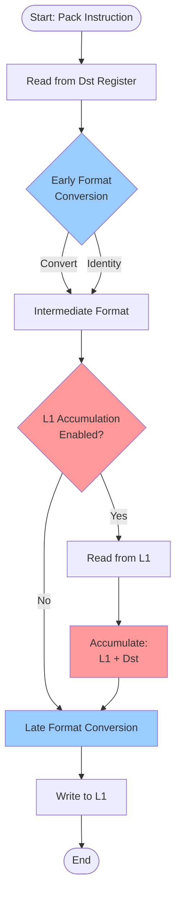

### Key Pipeline Stages

1. **Input Address Generator**: Determines which rows/columns to read from Dst
2. **Early Format Conversion**: Converts data format immediately after reading from Dst
3. **L1 Accumulation Logic**: Reads existing L1 values and accumulates (if enabled)
4. **Late Format Conversion**: Converts to final output format before writing to L1
5. **Output Address Generator**: Determines L1 destination address

---

## Normal Packer Flow

When L1 accumulation is **disabled**, the packer follows a straightforward path:

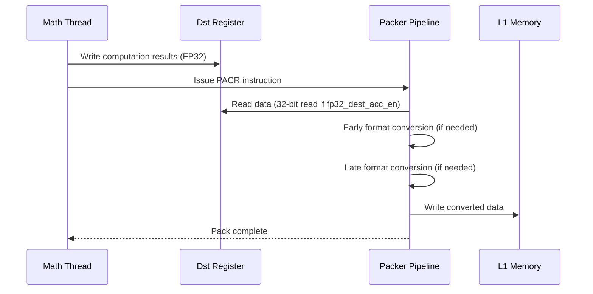

### Format Conversion in Normal Flow

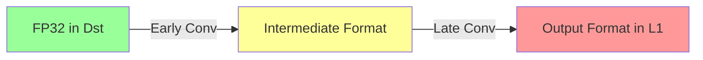

**Key Point**: Format conversion happens **before** writing to L1, so L1 always contains data in the final output format.

---

## L1 Accumulation Flow

When L1 accumulation is **enabled**, the packer must read existing L1 values, accumulate, and write back:

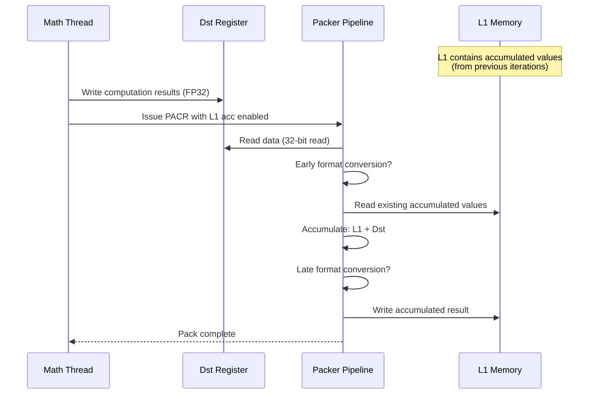

### The Critical Question: Format Conversion Order

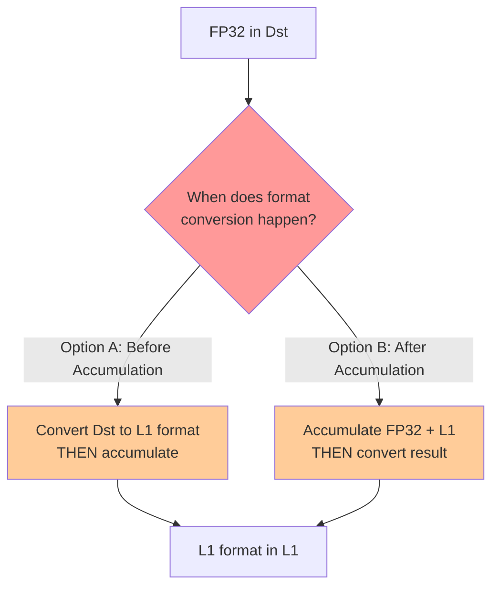

**The Problem**: The hardware may be doing format conversion at the wrong stage relative to accumulation, causing format mismatches.

---

## Order of Operations Issue

### Expected Order (Correct)

For L1 accumulation to work correctly with FP32 destination registers:

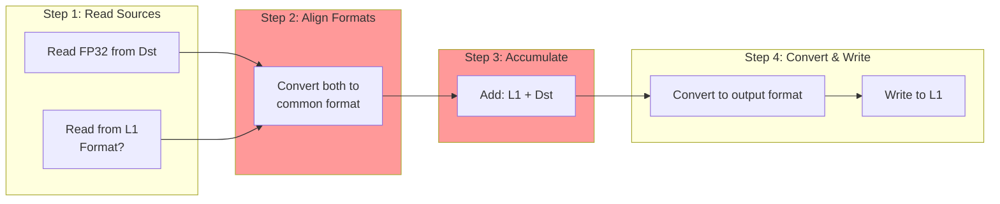

### Actual Order (Problematic)

The hardware may be executing:

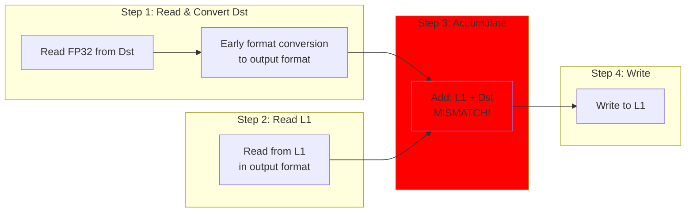

**The Issue**: If Dst is converted to output format (e.g., FP16) before accumulation, but L1 contains FP32 from previous accumulation, the formats don't match for addition.

---

## State Machine Interactions

### Packer Configuration State

The packer maintains state across multiple configuration fields:

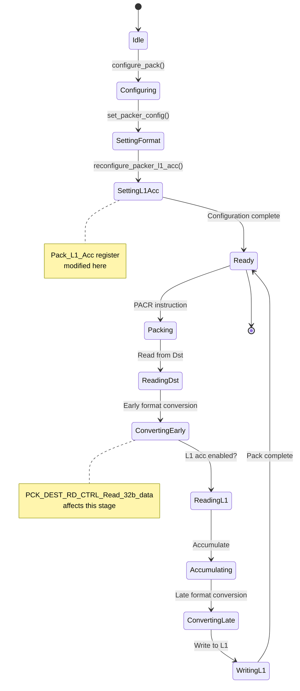

### State Conflict

When `fp32_dest_acc_en=true`, the `Read_32b_data` flag is set:

```cpp
dest_rd_ctrl.f.PCK_DEST_RD_CTRL_Read_32b_data = is_32b_format || is_fp32_dest_acc_en;
```

This affects the **early format conversion** stage, but the L1 accumulation logic may expect a different format:

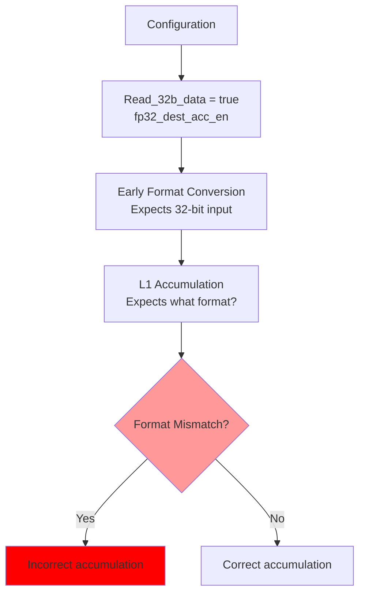

---

## Thread Synchronization Issues

The packer, math unit, and unpacker operate as separate threads with synchronization points:

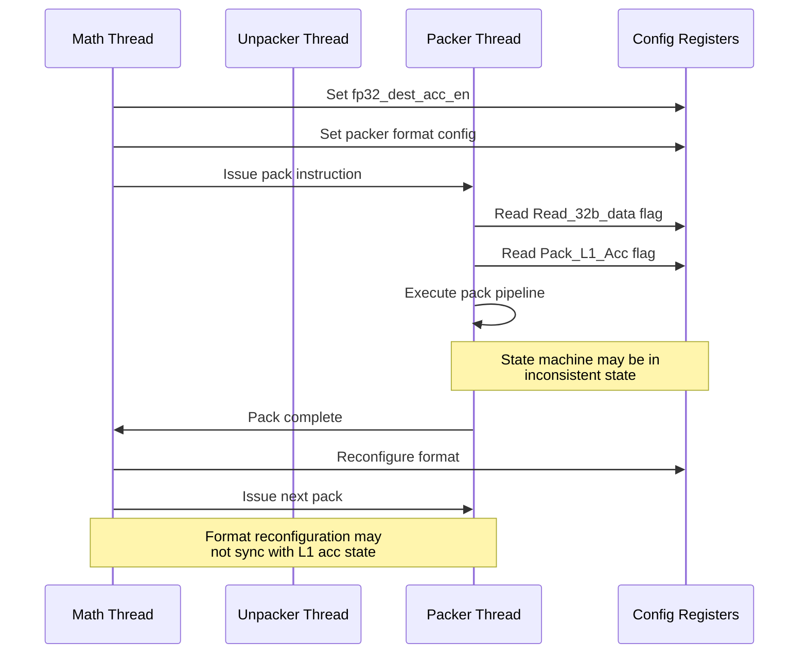

### Synchronization Points

From `configure_pack()`:
```cpp
if (pack_src_format != pack_dst_format)
{
    TTI_STALLWAIT(p_stall::STALL_PACK, p_stall::PACK);
    tensix_sync();
}
```

This stalls the packer when formats differ, but **does not account for L1 accumulation state**:

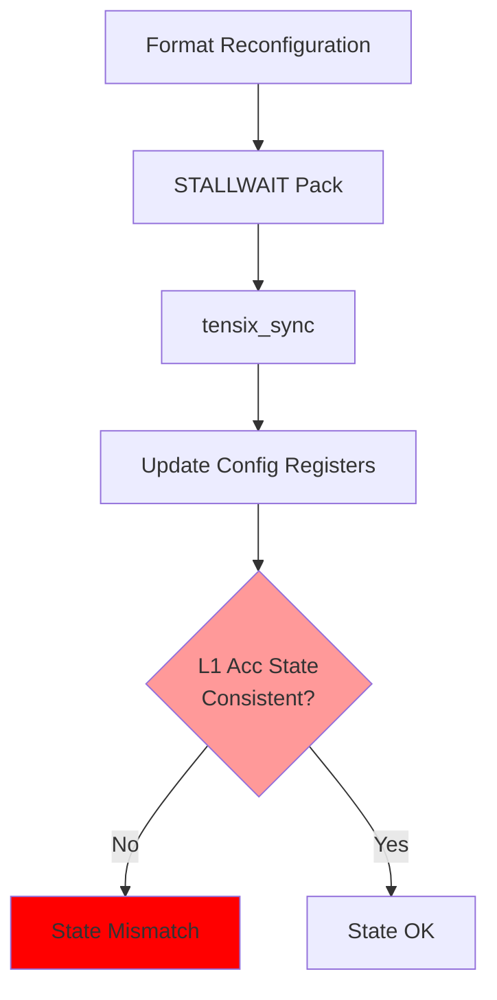

---

## Code Evidence

### Evidence 1: Conditional Implementation

From `sdpa_compute_utils.hpp`:

```cpp
#ifndef FP32_DEST_ACC_EN
/*This uses L1 accumulation to accumulate onto cb_cur_mm_out*/
void update_cur_mm_out(...) {
    PACK((llk_pack_reconfig_l1_acc(true)));  // enable L1 accumulation
    pack_reconfig_data_format(cb_cur_mm_out);
    // ... pack with L1 accumulation ...
    PACK((llk_pack_reconfig_l1_acc(false)));
}
#else
// Alternative implementation WITHOUT L1 accumulation
void update_cur_mm_out(...) {
    // Uses intermediate buffers instead
}
#endif
```

**Key Observation**: The order is:
1. Enable L1 accumulation
2. Reconfigure data format
3. Pack

This suggests format reconfiguration happens **after** enabling L1 accumulation, which may cause state conflicts.

### Evidence 2: Format Configuration Logic

From `set_packer_config()`:

```cpp
dest_rd_ctrl.f.PCK_DEST_RD_CTRL_Read_32b_data = is_32b_format || is_fp32_dest_acc_en;
```

When `fp32_dest_acc_en=true`, this forces 32-bit reads from Dst, which affects early format conversion.

### Evidence 3: Matmul Workaround

From `matmul_op_multi_core_reuse_mcast_1d_program_factory.cpp`:

```cpp
// if fp32 enabled then we pack fp32 in l1, if not, then we pack fp16 in l1
tt::DataFormat interm0_data_format = packer_l1_acc_en
    ? (fp32_dest_acc_en ? tt::DataFormat::Float32 : tt::DataFormat::Float16_b)
    : (fp32_dest_acc_en ? tt::DataFormat::Float32 : output_data_format);
```

**Key Insight**: When L1 accumulation is enabled with FP32 dest, the code **intentionally stores FP32 in L1** to avoid format conversion issues. This suggests the problem is format conversion during accumulation.

---

## Root Cause Analysis

### Hypothesis

The root cause is a **fundamental conflict in the packer pipeline's order of operations**:

1. **Early Format Conversion** is configured based on `Read_32b_data`, which is set when `fp32_dest_acc_en=true`
2. **L1 Accumulation** reads from L1, which may contain data in a different format than what early conversion produces
3. **The accumulation operation** expects both operands in the same format, but they may be in different formats
4. **Late Format Conversion** happens after accumulation, but by then the damage is done

### Detailed Flow Analysis

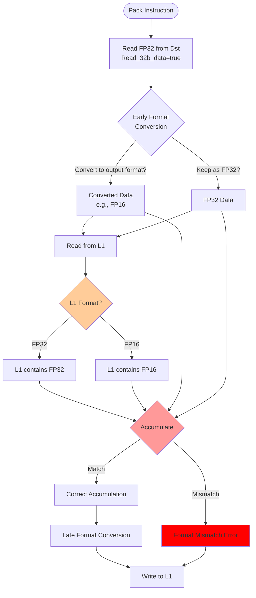

### The Critical Path

The issue occurs when:

1. **Dst contains FP32** (because `fp32_dest_acc_en=true`)
2. **Early conversion may convert to output format** (e.g., FP16) before accumulation
3. **L1 contains FP32** (from previous accumulation iterations)
4. **Accumulation tries to add FP16 + FP32** → **Format mismatch**

OR:

1. **Dst contains FP32**
2. **Early conversion keeps FP32**
3. **L1 contains FP16** (from previous pack without L1 acc, or initial state)
4. **Accumulation tries to add FP32 + FP16** → **Format mismatch**

---

## Workarounds and Solutions

### Current Workaround

The codebase currently avoids the issue by:

1. **Disabling L1 accumulation when `fp32_dest_acc_en=true`**
2. **Using intermediate buffers** to manually accumulate
3. **Ensuring L1 format matches** when L1 accumulation is used (e.g., storing FP32 in L1 when FP32 dest is enabled)

### Potential Solutions

#### Solution 1: Ensure Format Consistency

Ensure L1 always contains data in the same format as what will be read from Dst:

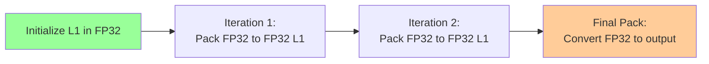

**Requirement**: All intermediate L1 accumulation must use FP32 format.

#### Solution 2: Hardware Fix

Modify the packer pipeline to:
1. Read both Dst and L1 in their native formats
2. Convert both to a common format (e.g., FP32) before accumulation
3. Perform accumulation
4. Convert result to output format

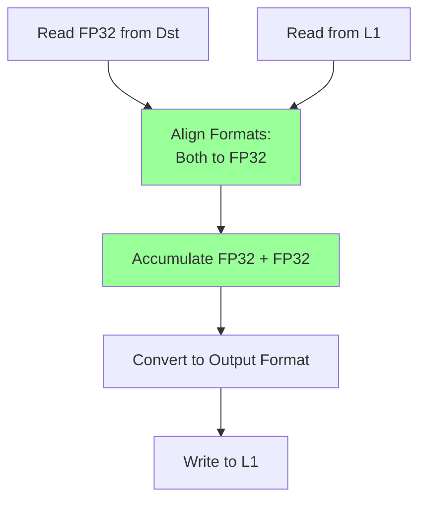

#### Solution 3: Software Workaround

Use the current approach but with explicit format management:

```cpp
// Ensure L1 format matches Dst format when L1 acc is enabled
if (packer_l1_acc_en && fp32_dest_acc_en) {
    // Force intermediate format to FP32
    interm_data_format = DataFormat::Float32;
    // Only convert to output format in final pack
}
```

---

## Conclusion

The issue with L1 accumulation and FP32 destination registers is fundamentally an **order of operations problem** in the packer pipeline. The hardware's format conversion stages (early and late) are not properly coordinated with the L1 accumulation logic when FP32 destination registers are enabled.

The root cause is that:
1. Format conversion may happen at the wrong stage relative to accumulation
2. State machine interactions between format configuration and L1 accumulation are not properly synchronized
3. The packer pipeline assumes format consistency that may not exist when `fp32_dest_acc_en=true`

**Recommendation**: This requires either a hardware fix to properly handle format conversion during L1 accumulation, or careful software management to ensure format consistency throughout the accumulation process.

---

## References

- Issue #28800: Enable L1 accumulation when fp32_dest_acc_en = true
- `tt-train/sources/ttml/metal/ops/sdpa_fw/device/sdpa_fw_program_factory.cpp`
- `tt-train/sources/ttml/metal/ops/sdpa_fw/device/kernels/compute/sdpa_compute_utils.hpp`
- `tt_metal/third_party/tt_llk/tt_llk_wormhole_b0/common/inc/cpack_common.h`
- `ttnn/cpp/ttnn/operations/matmul/device/matmul_op_multi_core_reuse_mcast_1d_program_factory.cpp`
