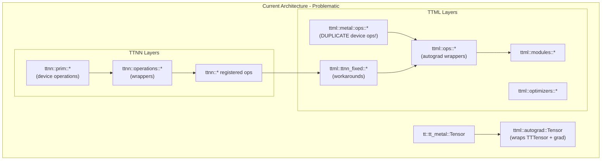
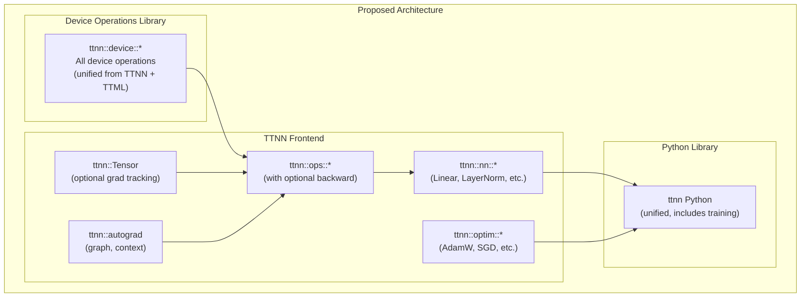

# TTNN and TTML Architecture Restructuring Plan

> **Overview**: Restructure TTNN and TTML into a cleaner architecture: a device operations library and a unified frontend with autograd, modules, and training support integrated into TTNN.

## Phases

| Phase | Description | Status |
|-------|-------------|--------|
| 1 | Migrate TTML device operations to ttnn/cpp/ttnn/operations/ | Pending |
| 1 | Review and fix TTNN operations to eliminate ttml/ttnn_fixed workarounds | Pending |
| 2 | Extend tt::tt_metal::Tensor with optional gradient tracking | Pending |
| 2 | Move autograd infrastructure (graph, context) from ttml to ttnn::autograd | Pending |
| 3 | Add backward functions to TTNN operations and autograd-aware wrappers | Pending |
| 4 | Create ttnn::nn module system (Module base, Linear, LayerNorm, etc.) | Pending |
| 5 | Create ttnn::optim (Optimizer base, AdamW, SGD) | Pending |
| 6 | Extend ttnn Python with nn, optim, autograd submodules and deprecate ttml | Pending |

---

## Current Architecture Problems

The codebase has significant duplication and layering issues:



### Identified Issues

| Problem | Location | Impact |
|---------|----------|--------|
| Duplicate tensor types | `tt::tt_metal::Tensor` vs `ttml::autograd::Tensor` | Complexity, conversion overhead |
| TTML has own device ops | `ttml/metal/ops/` (cross_entropy, layernorm_bw, rmsnorm, sdpa, silu_bw, swiglu, softmax) | Code duplication, maintenance burden |
| Workaround layer | `ttml/ttnn_fixed/` | Indicates TTNN API gaps |
| Separate Python libs | `ttnn/ttnn/` and `ttml/ttml/` | User confusion, integration issues |
| No autograd in TTNN | Training requires separate library | Fragmented ecosystem |

## Proposed Architecture



## Phase 1: Consolidate Device Operations

Move all TTML device operations into TTNN's device operation infrastructure.

### 1.1 Migrate TTML Metal Ops to TTNN

Operations to migrate from `tt-train/sources/ttml/metal/ops/`:

- `cross_entropy_fw/` and `cross_entropy_bw/` -> `ttnn/cpp/ttnn/operations/loss/`
- `layernorm_fw/` and `layernorm_bw/` -> `ttnn/cpp/ttnn/operations/normalization/`
- `rmsnorm_fw/` and `rmsnorm_bw/` -> `ttnn/cpp/ttnn/operations/normalization/`
- `sdpa_fw/` -> `ttnn/cpp/ttnn/operations/transformer/sdpa/`
- `silu_bw/` -> `ttnn/cpp/ttnn/operations/eltwise/`
- `swiglu_fw/` -> `ttnn/cpp/ttnn/operations/eltwise/`
- `softmax/` -> merge with existing `ttnn/cpp/ttnn/operations/normalization/softmax/`
- `profiler_no_op/` -> `ttnn/cpp/ttnn/operations/debug/`

Each migration follows the pattern in `ttnn/cpp/ttnn/operations/experimental/dropout/device/dropout_device_operation.cpp`:
- Device operation struct with `operation_attributes_t`, `tensor_args_t`
- `ttnn::prim::*` function in the device operation file
- Wrapper in parent directory

### 1.2 Merge SGD Fused Optimizer

Move `tt-train/sources/ttml/metal/optimizers/sgd_fused/` to `ttnn/cpp/ttnn/operations/optimizers/` following moreh_sgd pattern.

### 1.3 Absorb ttnn_fixed Workarounds

Review and fix TTNN operations that `ttml/ttnn_fixed/` works around:
- `sum_over_dim`, `sum_over_batch` - improve `ttnn::sum`
- `log_softmax`, `softmax` with dim - improve existing ops
- `divide` - check `ttnn::divide`
- `mean_moreh`, `sum_moreh` - ensure proper API
- `matmul` with transpose flags - check `ttnn::matmul`

## Phase 2: Unified Tensor with Optional Autograd

### 2.1 Add Gradient Support to ttnn::Tensor

Extend `tt::tt_metal::Tensor` (in `ttnn/api/ttnn/tensor/tensor.hpp`) with optional gradient tracking:

```cpp
class Tensor {
    // ... existing members ...

    // New: Optional autograd support
    std::shared_ptr<Tensor> grad_ = nullptr;
    bool requires_grad_ = false;
    std::optional<autograd::NodeId> node_id_;

public:
    // Gradient API
    void set_requires_grad(bool requires);
    bool requires_grad() const;
    Tensor& grad();
    const Tensor& grad() const;
    void backward();
};
```

### 2.2 Move Autograd Infrastructure to TTNN

Migrate from `tt-train/sources/ttml/autograd/`:
- `graph.hpp/cpp` -> `ttnn/core/autograd/graph.hpp`
- `auto_context.hpp/cpp` -> `ttnn/core/autograd/context.hpp`
- Graph building and backward pass logic

New namespace: `ttnn::autograd`

## Phase 3: Unified Operations with Backward Support

### 3.1 Operation Pattern with Optional Backward

For each operation, follow this pattern:

```cpp
namespace ttnn::ops {

// Forward operation (calls device op)
Tensor linear(const Tensor& input, const Tensor& weight,
              const std::optional<Tensor>& bias = std::nullopt);

// Backward operation (for autograd)
std::tuple<Tensor, Tensor, std::optional<Tensor>>
linear_backward(const Tensor& grad_output, const Tensor& input,
                const Tensor& weight, const std::optional<Tensor>& bias);

} // namespace ttnn::ops
```

### 3.2 Autograd-Aware Operation Wrappers

Operations automatically record backward when `requires_grad=true`:

```cpp
Tensor linear(const Tensor& input, const Tensor& weight, ...) {
    auto output = ttnn::prim::linear(input, weight, ...);

    if (input.requires_grad() || weight.requires_grad()) {
        autograd::ctx().record_backward([=](const Tensor& grad) {
            return linear_backward(grad, input, weight, bias);
        });
    }
    return output;
}
```

## Phase 4: Module System in TTNN

### 4.1 Module Base Class

Move module infrastructure to `ttnn/cpp/ttnn/nn/`:

```cpp
namespace ttnn::nn {

class Module {
protected:
    std::map<std::string, Tensor> parameters_;
    std::map<std::string, std::shared_ptr<Module>> children_;
    bool training_ = true;

public:
    virtual Tensor forward(const Tensor& input) = 0;

    void train(bool mode = true);
    void eval() { train(false); }

    std::vector<Tensor> parameters();
    void register_parameter(const std::string& name, Tensor param);
    void register_module(const std::string& name, std::shared_ptr<Module> module);
};

} // namespace ttnn::nn
```

### 4.2 Standard Modules

Migrate from `ttml/modules/`:
- `Linear` (from `linear_module.hpp`)
- `LayerNorm` (from `layer_norm_module.hpp`)
- `RMSNorm` (from `rms_norm_module.hpp`)
- `Embedding` (from `embedding_module.hpp`)
- `Dropout` (from `dropout_module.hpp`)
- `MultiHeadAttention`, `GroupedQueryAttention`
- `GPTBlock`, `LlamaBlock`

## Phase 5: Optimizers in TTNN

### 5.1 Optimizer Base and Implementations

Move to `ttnn/cpp/ttnn/optim/`:

```cpp
namespace ttnn::optim {

class Optimizer {
protected:
    std::vector<Tensor> parameters_;
public:
    virtual void step() = 0;
    virtual void zero_grad() = 0;
};

class AdamW : public Optimizer { ... };
class SGD : public Optimizer { ... };

} // namespace ttnn::optim
```

Migrate from `ttml/optimizers/`.

## Phase 6: Unified Python Library

### 6.1 Extend ttnn Python

Add training modules to `ttnn/ttnn/`:
- `ttnn.nn` - Modules (Linear, LayerNorm, etc.)
- `ttnn.optim` - Optimizers (AdamW, SGD)
- `ttnn.autograd` - Autograd utilities

### 6.2 Deprecate ttml Python

- Add deprecation warnings to `ttml` Python imports
- Provide migration guide
- Eventually remove `tt-train/sources/ttml/ttml/`

## Directory Structure After Restructuring

```
ttnn/
  cpp/ttnn/
    operations/           # Device operations (Phase 1)
      loss/
        cross_entropy/    # Migrated from TTML
      normalization/
        layernorm/        # Forward + Backward
        rmsnorm/          # Migrated from TTML
      eltwise/
        silu_backward/    # Migrated from TTML
        swiglu/           # Migrated from TTML
      optimizers/
        sgd_fused/        # Migrated from TTML
        adamw/
    autograd/             # Phase 2
      graph.hpp
      context.hpp
    nn/                   # Phase 4
      module.hpp
      linear.hpp
      layer_norm.hpp
      ...
    optim/                # Phase 5
      optimizer.hpp
      adamw.hpp
      sgd.hpp
  ttnn/                   # Python
    nn/                   # Phase 6
    optim/
    autograd/
```

## Migration Strategy

1. **Parallel Development**: Keep TTML working during migration
2. **Feature Flags**: Use compile-time flags to enable new architecture
3. **Incremental Migration**: Move one component at a time
4. **Compatibility Layer**: Provide TTML compatibility shims during transition
5. **Testing**: Ensure training tests pass with new architecture

## Risk Assessment

| Risk | Mitigation |
|------|------------|
| Breaking existing TTML users | Provide compatibility layer and migration guide |
| Performance regression | Benchmark each migration step |
| Large scope | Phase the work, deliver incrementally |
| API design decisions | Review with stakeholders before implementation |

## Success Criteria

- Single tensor type with optional autograd
- All device operations in TTNN
- No `ttnn_fixed` workarounds needed
- Single Python library for inference and training
- Training examples work with `ttnn` imports only
- TTML deprecated and eventually removed
