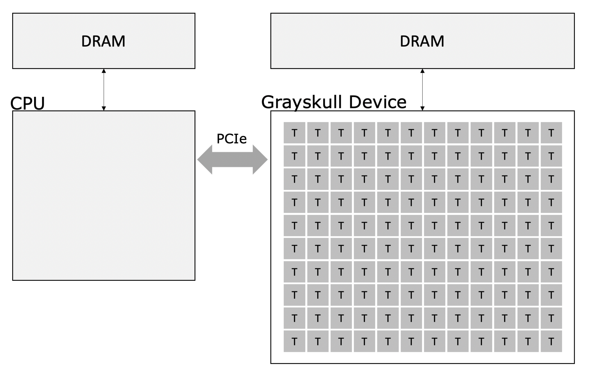
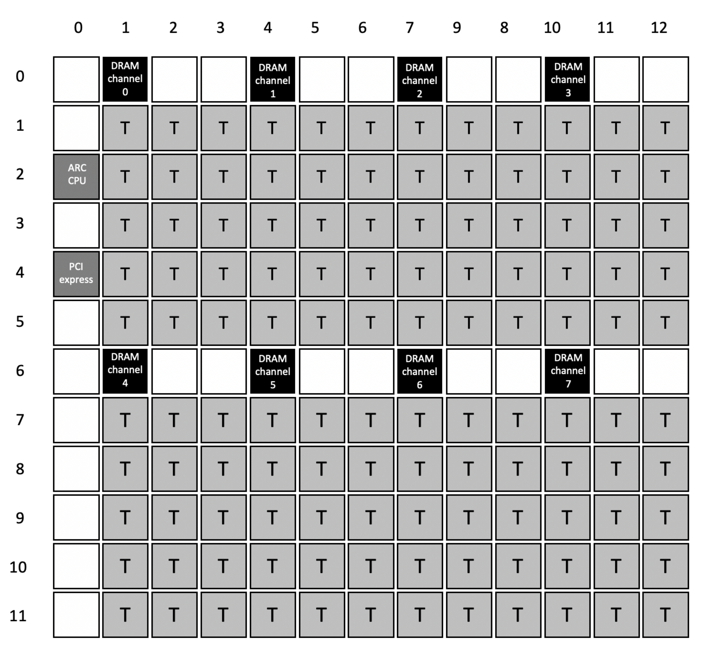
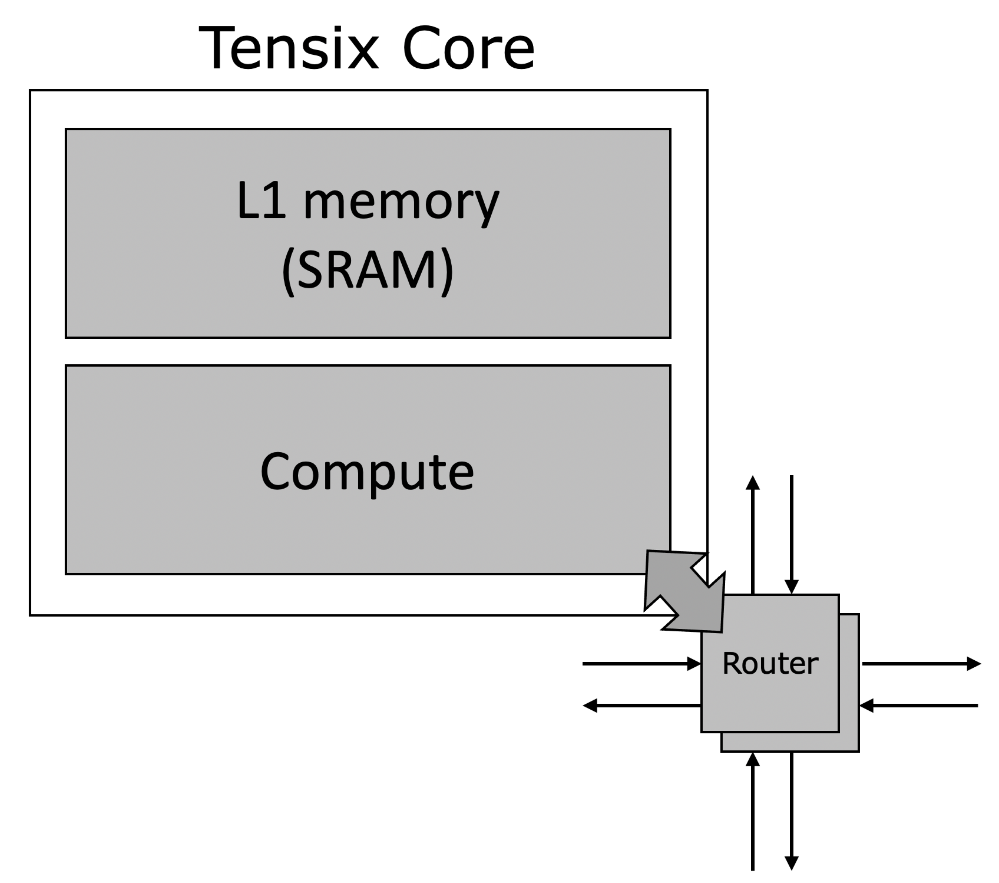
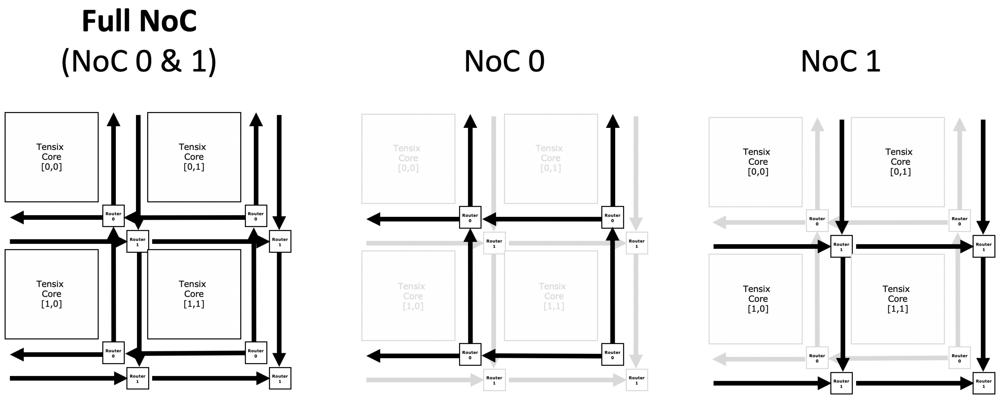

Grayskull
####################

The CPU Host & Grayskull Accelerator
****************************************

In this programming model, the host (a CPU) works with an accelerator (the Grayskull device)
to perform tasks. The user defines and creates the kernels, or small programs, that will run
on the Grayskull device within the host code. These kernels are then compiled and their binary
files are transferred to the device to be executed.

Grayskull Accelerator Device
*********************************

The figure below shows the physical layout of the Grayskull Device.
The Grayskull device contains 120 Tensix cores, arranged in a 10x12 grid.
The off-chip DRAM memory is accessable via 8 independent DRAM channels, located in rows 0 and 6 in the figure.
The PCIexpress channel is located on row 4, col 0.
The Tensix cores, DRAM channels and PCIexpress core, are connected via a Network on Chip, described in the next section.

Tensix Core
*********************************

The Tensix core is composed of L1 memory (1 MB of SRAM), and a compute engine,
capable of matrix and vector math.
Each core has a dedicated router that connects it to
other cores using the network-on-chip.

Network-on-Chip
*********************************

The Network-on-Chip (NoC) is composed of 2 uni-directional torus, NoC 0 and NoC 1.
Data on NoC 0 can travel up and the left.
Data on NoC 1 can travel down and to the right.
NoC 0 and NoC 1 are not directly connected to each other,
however data can be moved from NoC 0 to NoC 1 by going through the L1 memory first.
The NoC links have a bandwidth of 32 Bytes / clock cycle.

