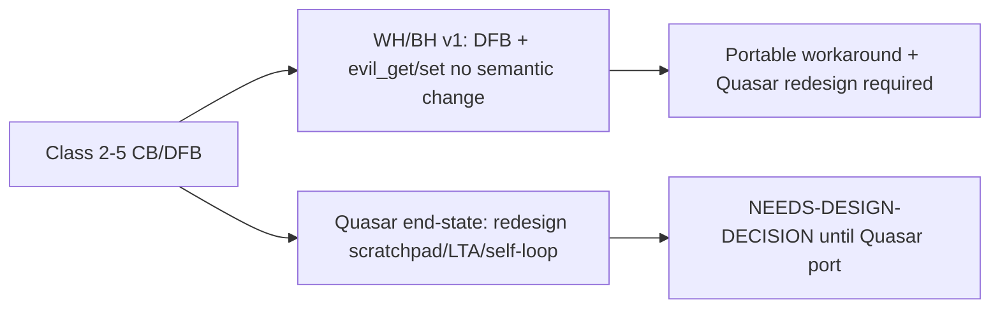
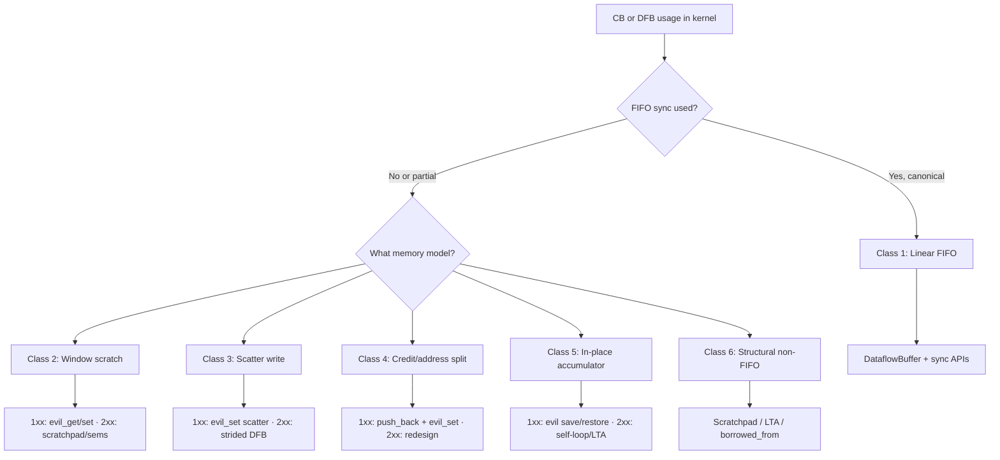

# CB / DFB Kernel Audit (Quasar uplift)

> **Status:** Living document (2026-07-20). **Standalone device-side audit** — classifies **kernel** `CircularBuffer` **or** `DataflowBuffer` usage (same Classes 1–6) per op or ProgramFactory for Quasar-uplift readiness. On WH/BH, an unported op still has CBs; a Metal 2.0–ported op already has DFBs (often with `evil_`* mechanical parity). **Type name does not change the class** — classify by usage pattern. Mechanical CB→DFB on WH/BH does not block; redesign debt is deferred to the **Quasar uplift** step. Does **not** audit host `ProgramSpec`, binding multiplicity, or factory refactors (`[audit/metal2_audit.md](metal2_audit.md)` covers host/spec). **Scope is machine-discovered** from program factories and PR diffs — see [Automated scope discovery](#automated-scope-discovery).
>
> **Companion docs:** [CB→DFB API whitelist](../shared/cb_dfb_api_whitelist.md) (CB API → DFB / evil_get|set mapping), [CB→DFB flowchart](../../human/CB-to-DFB-flowchart.svg).

---

## How to use this doc

**What this is.** A **kernel-only** auditor: given an op or factory slice, discover in-scope device kernels, scan for illegal / weird FIFO / pointer patterns, classify **every in-scope buffer** — whether it is still a `CircularBuffer` or already a `DataflowBuffer` on WH/BH — and produce a **buffer portability** report with **1xx** and **2xx** status columns. Classes 1–6 are usage-based; do not skip buffers just because the kernel already says `DataflowBuffer`.

**Inventory unit.** One report row per logical buffer handle / id (`cb_`*, `dfb::`*, or `DataflowBuffer` local). After a Metal 2.0 port, **1xx** is usually already done (**Portable** or **Portable (workaround)** if `evil_`* remains); **2xx** is the Quasar gate that matters.

**Scope caveat — vanilla single-pipeline port only.** This audit targets the **vanilla** Quasar uplift of a **single DM reader → compute → single DM writer** pipeline. It does **not** cover parallelizing kernels (multi-DM readers/writers, multi-producer/consumer access patterns, strided/blocked fan-out across DMs). Flag multi-endpoint / parallel-DM patterns as out of scope for this procedure and escalate separately.

**What this is not.** Host-side Metal 2.0 feasibility (SPSC, endpoint counts, `DataflowBufferSpec` legality, tensor binding cases). Do not block or roll up on host issues here — cross-reference `[audit/metal2_audit.md](metal2_audit.md)` separately when doing a full op port.

**When to run.**


| Trigger                   | Example                                                               |
| ------------------------- | --------------------------------------------------------------------- |
| Quasar-uplift readiness   | "Audit layernorm kernels for Quasar" (CBs **or** post–Metal 2.0 DFBs) |
| PR touching `*/kernels/`* | Diff-driven scope from changed kernel or factory file                 |
| Port planning             | Before rewriting `CircularBuffer` → `DataflowBuffer` in device code   |
| Post–Metal 2.0 re-audit   | Op already on DFB; classify DFBs for Quasar redesign debt             |


**Procedure (5 steps).**

1. **[Scope discovery](#automated-scope-discovery)** (Steps 0–3) — resolve op/factory → `KERNEL_FILES` → `SCAN_FILES` (kernels + `#include` closure). Uses factory files only to **find** kernel paths; does not edit or audit host factory code.
2. **[Classification scans](#step-4--classification-scans-on-scan_files-only)** — run `rg` on `SCAN_FILES` only.
3. **[Classify](#step-5--classify-cbs-and-dfbs)** — every CB **or** DFB gets a class (1–6), verdict, and device port strategy (canonical DFB / LTA / scratchpad / workaround / Quasar redesign).
4. **[Report template](#report-template)** — one row per logical buffer; **1xx** and **2xx** portable status + Notes.
5. **Deliver** — write `CB_DFB_KERNEL_AUDIT.md` in the op directory, paste into a PR comment, or append as the kernel section of `METAL2_PREPORT_AUDIT.md` if a full op port is in flight.

**Rollup (device kernel port).**


| Verdict    | Meaning                                                                           |
| ---------- | --------------------------------------------------------------------------------- |
| **GREEN**  | All buffers **Portable** or **Portable (workaround)** (flag ptr hacks in Notes)   |
| **YELLOW** | Any **Portable (prereq: LTA)** and/or **Blocked (runtime)** on 2xx with 1xx clear |
| **RED**    | Any **Blocked**, unresolved **GATE**, or NEEDS-DESIGN without v1 strategy         |


**Quick links:** [Verdict legend](#verdict-legend) · [Explicit vs implicit sync](#explicit-vs-implicit-sync) · [Sync-free and single-ended](#sync-free-and-single-ended-buffers-interim-binding) · [Issue taxonomy](#issue-taxonomy-kernel-side) · [LTA vs scratchpad rollup](#port-recipe-rollup-lta-vs-scratchpad) · [CB→DFB API whitelist](../shared/cb_dfb_api_whitelist.md) · [Example report (layernorm)](#example-audit-report-layernorm-sharded-welford-path)

---

## Read this first

**Why this exists.** Legacy gave kernel authors essentially **one** primitive for “a chunk of L1 the kernel touches”: the CircularBuffer. So they used it for everything — genuine producer→consumer FIFOs, private scratch, base-pointer windows onto resident tensors, and output staging nothing ever drains. On Gen1 (WH/BH), kernels could also treat `LocalCBInterface` as a mutable struct (`fifo_page_size`, rewrite `fifo_rd_ptr`, skip credits). That interface is meant to be private; touching `get_local_cb_interface(...).<field>` may compile on Gen1 but is **un-portable** or **silent-wrong** on Quasar (different fields). Metal 2.0 splits the CB kitchen-sink apart (`DataflowBuffer`, scratchpad, local `TensorAccessor`), so the auditor must decide **what each legacy “CB” actually is**.

**Audience:** Humans and AI agents auditing **device kernels** (`*/kernels/`*, `kernel_util/`) for Metal 2.0 / Quasar readiness — whether buffers are still `CircularBuffer` or already `DataflowBuffer` on WH/BH. Run **standalone** — no host audit prerequisite.

**Operating principle:** Classify each CB/DFB usage along axes that **must not be fused**:

1. **Synchronized vs sync-free** — does the kernel form a real FIFO handoff? Synchronized may be **explicit** (`reserve_back` / `push_back` / `wait_front` / `pop_front`) or **implicit** (DM NOC + txn-id credit exchange — see [Explicit vs implicit sync](#explicit-vs-implicit-sync)). Sync-free means **no** FIFO credits at all (base-pointer grab + walk the bytes — really scratch or a tensor view, not a CB).
2. **Memory model** — **linear FIFO**, **windowed/scatter L1**, **pointer-only bookkeeping**, or **in-place accumulator**?
3. **Endpoint multiplicity (orthogonal)** — how many FIFO producers/consumers per node? That is the SPSC / binding-legality axis, audited on the **host** side, not by fusing it into “sync-free.”

> **Don't fuse sync with endpoint count.** “Single-ended” (one FIFO endpoint — e.g. compute packer `OUT` into a resident shard with no drain) is a **count** property. Sync-free (no FIFO ops) is a **sync** property. A packer `OUT` is **synchronized but single-ended**; a reciprocal LUT read by base pointer is **sync-free**. Both may need interim binding bridges, but they have different end-states (see [Sync-free and single-ended](#sync-free-and-single-ended-buffers-interim-binding)).

Do not assume “it's a CB, so use DFB + push_back.” Many legacy CBs were **pinned L1** or **credit/decoupled** patterns. On Quasar Class 1 DM paths, prefer **implicit sync** (issue one NOC transfer per entry; no FIFO calls) when the handoff is canonical.

**Three Metal 2.0 memory/sync primitives** (classify which one applies):

- `**DataflowBuffer`** — canonical cross-kernel FIFO (Class 1), or interim self-loop / fabricated-endpoint bridge (see below).
- `**LocalTensorAccessor`** — sync-free **borrowed** tensor view (Class 6 borrowed; some Class 2/5 pointer-only).
- **Scratchpad + semaphores** — private L1 with **explicit** sync when FIFO credits would lie (Classes 2–4 window/ring/staging; Class 6 scratch; Quasar DM self-loop replacement). See [Scratchpad + semaphores](#scratchpad--semaphores-explicit-sync).

### Explicit vs implicit sync

DFB credits live in Gen1 stream registers / Quasar **tile counters** (posted / acked). Kernels either drive those credits themselves (**explicit**) or let DM NOC completion do it (**implicit**). Background: [DataflowBuffer design doc](https://docs.google.com/document/d/1J55PCzS1VQKbNoSmKvwgPZ_siu04aqnS5DAsDw0vj1Q) (Implicit vs. Explicit Synchronization).


| Mode         | Who posts/acks credits                                   | Kernel pattern                                                                                                                                                                                                  | Where                         |
| ------------ | -------------------------------------------------------- | --------------------------------------------------------------------------------------------------------------------------------------------------------------------------------------------------------------- | ----------------------------- |
| **Explicit** | Kernel software                                          | Producer: `reserve_back` → NOC (or local write) → `push_back`. Consumer: `wait_front` → use data → `pop_front`.                                                                                                 | WH/BH and Quasar              |
| **Implicit** | Runtime ISR on NOC **txn-id** thresholds → tile counters | DM issues **one NOC transfer per entry** with the DFB as endpoint (`Noc::async_read` / `async_write` from `noc.h`). **Do not** call `reserve_back` / `push_back` / `wait_front` / `pop_front` for that handoff. | **Quasar DM only** (not Gen1) |


**Implicit sync — what auditors need to know:**

- Regions of the DFB FIFO are assigned transaction IDs. When enough reads land / writes complete for a txn id, an ISR fires and posts or acks the tile counter. Txn-id assignment is runtime-managed; kernels do not program it.
- V1 is **entry-by-entry**: one NOC transaction ↔ one DFB entry. Do not invent batch FIFO calls on the implicit path.
- For a vanilla Quasar DM reader (or writer), Class 1 porting often collapses to: construct the DFB, then loop `noc.async_read(tensor, dfb, entry_size, …)` / `noc.async_write(dfb, tensor, …)` — **no** explicit FIFO ops.
- Opt out per DFB / all DFBs on a DM kernel via Gen2 `disable_dfb_implicit_sync_for` / `disable_dfb_implicit_sync_for_all` when credits must stay software-driven (e.g. evil ptr surgery, non-canonical patterns). See Class 4 callout below.

```cpp
// Explicit (WH/BH always; Quasar when opted out of implicit sync)
dfb.reserve_back(1);
noc.async_read(src, dfb, entry_size, {.page_id = i}, {});
noc.async_read_barrier();
dfb.push_back(1);

// Implicit (Quasar DM default for canonical Class 1) — just the NOC txn
noc.async_read<NocOptions::TXN_ID>(src, dfb, entry_size, {.page_id = i}, {});
```

**Audit default (dual-track for Classes 2–5):**




| Track                      | Strategy                                                                                                                                                                                                                                                                                                    | Report                                                                                               |
| -------------------------- | ----------------------------------------------------------------------------------------------------------------------------------------------------------------------------------------------------------------------------------------------------------------------------------------------------------- | ---------------------------------------------------------------------------------------------------- |
| **1xx / WH-BH**            | Unported: mechanical `CircularBuffer` → `DataflowBuffer` (`evil_set_`* / `evil_get_`* for ptr surgery; `cb_push_back_hold_wr_ptr` → `push_back` + `evil_set_write_ptr`). Already Metal 2.0: buffer is already a DFB — record `1xx_port: already_DFB` (still **Portable (workaround)** if `evil_`* remains). | **Portable** / **Portable (workaround)** — Notes: hack + **Quasar redesign required** when Class 2–5 |
| **2xx / Quasar end-state** | Prefer **scratchpad + semaphores**, **LocalTensorAccessor**, compute self-loop, or strided DFB. **Do not** treat `evil_`* as the lasting Quasar fix.                                                                                                                                                        | **NEEDS-DESIGN-DECISION** until redesign lands                                                       |


Record status and workaround in the **buffer portability** table for every CB or DFB (see [Report template](#report-template)). API names: `[cb_dfb_api_whitelist.md](../shared/cb_dfb_api_whitelist.md)`.

### Port-recipe rollup (LTA vs scratchpad)


| End-state                                  | Port recipe treatment                                                                   | Report status              | Op rollup                                    |
| ------------------------------------------ | --------------------------------------------------------------------------------------- | -------------------------- | -------------------------------------------- |
| `**ScratchpadSpec` + semaphores**          | **Autoportable** Quasar / redesign end-state                                            | **Portable**               | **GREEN**                                    |
| `**LocalTensorAccessor`**                  | **Port prerequisite** — kernel must use LTA (host binding out of scope)             | **Portable (prereq: LTA)** | **YELLOW**                                   |
| DFB + `evil_get_`* / `evil_set_`* (1xx v1) | Documented WH/BH mechanical hack — **undesirable but OK**; opens Quasar design debt     | **Portable (workaround)**  | **GREEN** (flag hack + Quasar debt in Notes) |


**What is already portable (do not churn):**

- Class 1 DM transfers via `**Noc` from `noc.h`** (`async_read` / `async_write` + `offset_bytes`) — kernel must **not** call `get_*_ptr` or use `dataflow_api.h` `noc_async_`* with a grabbed L1 addr ([whitelist access control](../shared/cb_dfb_api_whitelist.md#access-control-get_ptr-vs-evil)).
- Canonical producer/consumer FIFO (Pattern A/B in the audit) — on Quasar DM prefer **implicit sync** (single-entry NOC to the DFB; no FIFO calls); on WH/BH use **explicit** `reserve`/`push`/`wait`/`pop`.
- Classes 2–5 pointer surgery → map to **evil_get/set** ([whitelist](../shared/cb_dfb_api_whitelist.md)), not leave `LocalCBInterface` field writes — and **not** blessed `get_*_ptr`.

**What is rewrite debt (do not treat as OK on Device 2.0 ports):**

- Kernel `dfb.get_*_ptr()` + `noc_async`_* from `dataflow_api.h` (~many Class 1 sites) → rewrite to `noc.h`.
- Public `get_*_ptr` remaining on DFB until that migration + privatize/`friend` lands.

**What is the litmus for illegal/un-portable** (run on [auto-discovered scope](#step-4--classification-scans-on-scan_files-only), not the whole repo, when auditing one op):

```bash
# GATE — any field read/write via get_local_cb_interface blocks Metal 2.0 port
rg 'get_local_cb_interface' $SCAN_GLOB

# QUASAR-BLOCKED / WH read APIs — see Runtime fixes
rg 'read_tile_value|get_tile_address' $SCAN_GLOB

# NEEDS-FIX — migrate sync-free borrowed reads to LocalTensorAccessor (Portable prereq: LTA → YELLOW)
rg 'get_pointer_to_cb_data' $SCAN_GLOB

# Wrong on Quasar
rg 'get_cb_tiles_acked_ptr|get_cb_tiles_received_ptr' $SCAN_GLOB
```

---

## Audit scope (device kernels only)

Kernel discovery follows the same **follow factory references, not directory boundaries** rule as the host audit, but **this audit scans and gates on device code only**:

- **Follow kernel references, not directory boundaries.** Every path assigned to `KernelDescriptor::kernel_source` (or equivalent string literal / helper that builds a kernel path) in the op's program factories is in scope — including cross-op donor kernels. Factory `.cpp` files are read **only to extract kernel paths**, not audited for host/spec legality.
- *Unreferenced files under `*/kernels/` in the op tree are out of scope.** List them in the report as *unreferenced* only if their presence could confuse a reader; do not scan or RED-gate on them.
- **Multiple `DeviceOperation` types** in one directory: one combined report when they share factories/kernels; separate reports when independent (ask user only if bundling is ambiguous).
- **Atomic unit:** one **ProgramFactory** (or factory helper bundle) at a time when the op has several factories.

**Path exclusions (mark OUT-OF-SCOPE, never RED-roll up):**


| Pattern                      | Reason                               |
| ---------------------------- | ------------------------------------ |
| `**/deepseek_moe_gate/`**    | Firmware-style CB reconfig           |
| `**/generalized_moe_gate/`** | Same                                 |
| `**/deepseek_prefill/`**     | Combine/dispatch/post_combine_reduce |


These need separate device/framework design (firmware-style reinit, expert routing, etc.) and should not block or gate other op ports tracked by this audit.

---

## Automated scope discovery

### Step 0 — Resolve target and discover factories

Pick **one** trigger; derive `OP_ROOT`(s), `FACTORY_FILES`, and optional `FACTORY_FILTER` without asking the user to paste paths.


| Trigger                                           | How to resolve                                                                                                                                                                                                                                                                                                                             |
| ------------------------------------------------- | ------------------------------------------------------------------------------------------------------------------------------------------------------------------------------------------------------------------------------------------------------------------------------------------------------------------------------------------ |
| **User names an op** (e.g. "layernorm", "conv2d") | `find ttnn/cpp/ttnn/operations -type d -name '<slug>'` or `rg -l 'DeviceOperation' ttnn/cpp/ttnn/operations`                                                                                                                                                                                                                               |
| **PR / branch diff**                              | `git diff --name-only "${BASE_REF:-origin/main}...HEAD"` → keep paths under `ttnn/cpp/ttnn/operations/` → collapse to op roots: `ttnn/cpp/ttnn/operations/<family>/<op>/` (first six path segments after `operations/`). Audit **each** changed op root; if the diff only touches one factory file, set `FACTORY_FILTER` to that basename. |
| **Prior audit / plan doc**                        | Read `CB_DFB_KERNEL_AUDIT.md`, `METAL2_PORT_PLAN.md`, or a PR description for op root, factory names, and donor kernels — re-run kernel closure below to verify.                                                                                                                                                                           |
| **Kernel port PR** (only `.cpp` under `kernels/`) | Walk up to op root from the changed kernel path; find **all factories that reference that kernel** (factory enumeration below) so sibling factory paths are not missed.                                                                                                                                                                    |


```bash
REPO_ROOT="$(git rev-parse --show-toplevel)"
cd "$REPO_ROOT"
OP_ROOT=ttnn/cpp/ttnn/operations/normalization/layernorm

# Example: op roots from a PR diff
git diff --name-only origin/main...HEAD \
  | rg '^ttnn/cpp/ttnn/operations/[^/]+/[^/]+/' \
  | sed -E 's|(ttnn/cpp/ttnn/operations/[^/]+/[^/]+/).*|\1|' \
  | sort -u

# Factory / program-build hosts (used only to locate kernel paths)
FACTORY_FILES="$(find "$OP_ROOT" \( -name '*.cpp' -o -name '*.hpp' \) \
  | rg -l 'ProgramFactory|program_factory|KernelDescriptor|CreateKernel|create_program|ProgramSpec' \
  | rg 'program_factory|factory_helpers|_op_.*\.cpp|ProgramFactory')"
```

If `FACTORY_FILTER` is set, restrict `FACTORY_FILES` to paths matching that substring.

### Step 1 — Extract in-scope kernel paths from factories

Run on `FACTORY_FILES` from Step 0. Collect **repo-relative** paths (prefix `ttnn/cpp/ttnn/operations/...` when factories use `base_path` + suffix).

```bash
# FACTORY_FILES set in Step 0

# String literals pointing at kernel sources
rg -oN '"ttnn/cpp/ttnn/operations/[^"]+\.(cpp|hpp|h)"' $FACTORY_FILES | sort -u

# Relative kernel paths (resolve against OP_ROOT/device/)
rg -oN '"[^"]*device/kernels/[^"]+\.(cpp|hpp|h)"' $FACTORY_FILES | sort -u

# kernel_source assignments (trace variables — read the helper that sets compute_path / reader_path)
rg -n 'kernel_source\s*=' $FACTORY_FILES
```

**Variable `kernel_source`:** When the RHS is not a string literal (e.g. `kernel_config.compute_path`, ternary on `use_welford`), read the helper struct / function that populates it and expand **all reachable paths** for the factory variant under audit. Do not audit only the default branch.

**Cross-op donors:** Any extracted path outside `OP_ROOT` stays in scope; note *donor op* in the report.

Write the result to `KERNEL_FILES` (absolute or repo-relative). This is the **only** kernel set Step 2 scans.

### Step 2 — Transitive `#include` closure

For each file in `KERNEL_FILES`, pull shared headers (often `kernel_util/`, sibling op headers):

```bash
for k in $KERNEL_FILES; do
  rg -oN '#include "([^"]+)"' "$k"
done
```

Resolve includes relative to the including file and to known kernel include roots (`ttnn/`, `tt_metal/`). Add headers to `SCAN_FILES = KERNEL_FILES + included headers`. Deduplicate.

### Step 3 — Unreferenced kernel inventory (informational)

```bash
find "$OP_ROOT" -path '*/kernels/*' \( -name '*.cpp' -o -name '*.hpp' -o -name '*.h' \) | sort \
  > /tmp/all_kernels.txt
# KERNEL_FILES minus all_kernels → unreferenced (ignore in scans)
comm -23 /tmp/all_kernels.txt <(printf '%s\n' $KERNEL_FILES | sort)
```

### Step 4 — Classification scans (on `SCAN_FILES` only)

Do **not** scan the whole op tree unless re-discovering factories. Apply OUT-OF-SCOPE path filter before counting hits.

```bash
SCAN_GLOB=$(printf '%s ' $SCAN_FILES)   # or xargs file list

# GATE — hard blocker: LocalCBInterface field access
rg -n 'get_local_cb_interface\s*\([^)]*\)\s*\.|cb_interface\.' $SCAN_GLOB

# Silent-wrong on Quasar
rg -n 'get_cb_tiles_acked_ptr|get_cb_tiles_received_ptr' $SCAN_GLOB

# QUASAR-BLOCKED / WH read APIs — see Runtime fixes
rg -n 'read_tile_value|get_tile_address' $SCAN_GLOB

# NEEDS-FIX — migrate sync-free borrowed reads to LocalTensorAccessor (Portable prereq: LTA → YELLOW)
rg -n 'get_pointer_to_cb_data' $SCAN_GLOB

# Portable pointer use (WEIRD-OK candidates — classify, do not auto-fail)
rg -n 'get_read_ptr\s*\(|get_write_ptr\s*\(' $SCAN_GLOB

# Pointer surgery / credit hacks (Classes 2–5)
rg -n 'fifo_wr_ptr|fifo_rd_ptr|push_back_hold|llk_push_pages' $SCAN_GLOB

# Mechanical field reads (NEEDS-FIX — use DFB getters)
rg -n 'fifo_page_size|fifo_num_pages' $SCAN_GLOB

# Buffer inventory signals (CB and DFB — one row per logical handle)
rg -n 'CircularBuffer\s+\w+|DataflowBuffer\s+\w+|cb_[a-zA-Z0-9_]+\s*\(|dfb::|get_compile_time_arg.*cb|#define\s+cb_' $SCAN_GLOB
```

### Step 5 — Classify CBs and DFBs

Use scan hits + short context (±5 lines) to assign verdicts per the [Issue taxonomy](#issue-taxonomy-kernel-side). **List every in-scope buffer** from Step 4 inventory signals across `SCAN_FILES` — `CircularBuffer` **and** `DataflowBuffer` locals / `dfb::`* ids — **one row per logical buffer** in the report. Do not treat “already a DFB” as Class 1 by default; re-classify from usage (`evil_`*, sync-free peeks, hold-wr, etc.).


| Scan match                                                                          | Default class | Default verdict                                                | Override when                                                                                                                                                     |
| ----------------------------------------------------------------------------------- | ------------- | -------------------------------------------------------------- | ----------------------------------------------------------------------------------------------------------------------------------------------------------------- |
| `get_local_cb_interface(...).`                                                      | —             | **GATE**                                                       | Never WEIRD-OK                                                                                                                                                    |
| `get_cb_tiles_*_ptr`                                                                | —             | **NEEDS-FIX** (silent-wrong)                                   | —                                                                                                                                                                 |
| `get_pointer_to_cb_data`                                                            | 6             | **NEEDS-FIX**                                                  | Migrate to **LocalTensorAccessor** — report **Portable (prereq: LTA)** → op **YELLOW**                                                                            |
| `read_tile_value` / `get_tile_address` on DFB                                       | 6             | **QUASAR-BLOCKED** on Quasar until DFB read API lands          | Use **LocalTensorAccessor** when access is sync-free borrowed L1; DFB read API when LLK/DFB id required                                                           |
| `get_read_ptr` / `get_write_ptr` used for NOC addr + `dataflow_api.h` `noc_async_`* | 1             | **NEEDS-FIX**                                                  | Rewrite to `Noc` from `**noc.h`** — not OK to keep                                                                                                                |
| `get_read_ptr` / `get_write_ptr` used for save/jump/rewind                          | 2–5           | **WEIRD-OK** (1xx) after → `evil_get_`*                        | Do not leave blessed getters for surgery                                                                                                                          |
| `fifo_wr_ptr` / `fifo_rd_ptr` jumps / `get_local_cb_interface` ptr assign           | 2–5           | **WEIRD-OK** (1xx) / **NEEDS-DESIGN-DECISION** (2xx end-state) | **1xx:** map to `[evil_get/set](../shared/cb_dfb_api_whitelist.md)`. **2xx:** redesign scratchpad/LTA/self-loop/strided — do not treat evil_* as Quasar end-state |
| `push_back_hold` / `cb_push_back_hold_wr_ptr` / partial save-restore on **compute** | 4–5           | **WEIRD-OK** (1xx) / **NEEDS-DESIGN-DECISION** (2xx)           | **No** hold DFB API — `push_back` + `evil_set_write_ptr`. Quasar + canonical PACK→UNPACK → also flag **SELF-LOOP-CANDIDATE**                                      |
| Compute · sync-free or single-ended · **Quasar target**                             | 5–6           | **SELF-LOOP-CANDIDATE** (audit annotation)                     | WH/BH: evil_get/set workaround, LTA, or scratchpad — not self-loop                                                                                                |
| `fifo_page_size` / `fifo_num_pages`                                                 | 1             | **NEEDS-FIX**                                                  | Use DFB getters                                                                                                                                                   |
| FIFO sync calls only, no hits above                                                 | 1             | **PORTABLE**                                                   | —                                                                                                                                                                 |
| Path matches OUT-OF-SCOPE table                                                     | —             | **OUT-OF-SCOPE**                                               | Exclude from rollup                                                                                                                                               |


**Overall rollup:** Same as [Verdict legend](#verdict-legend) — compute from classified hits across `SCAN_FILES`.

---

## Workflow at a glance

For each factory slice under audit:

1. **Run [scope discovery](#automated-scope-discovery)** (Steps 0–3) — derive `KERNEL_FILES` and `SCAN_FILES`.
2. **Run classification scans** on `SCAN_FILES` only (Step 4).
3. **Classify** each CB **or** DFB in the [Issue taxonomy](#issue-taxonomy-kernel-side) (classes 1–6).
4. **Assign verdict** and device port strategy — dual-track for Classes 2–5: [CB→DFB API whitelist](../shared/cb_dfb_api_whitelist.md) (`evil_get/set` on 1xx; already present after mechanical Metal 2.0 port) vs [Scratchpad + semaphores](#scratchpad--semaphores-explicit-sync) / [LTA](#localtensoraccessor-lta) / [compute self-loop](#quasar-only-compute-self-loop-self-loop-candidate) / [strided DFB](#architecture-fork-strided-scatter-class-3) (Quasar end-state).
5. **Fill the [report template](#report-template)** — one row per logical buffer with **1xx** / **2xx** portable status → `CB_DFB_KERNEL_AUDIT.md` or PR comment. Notes: `1xx_port: evil_DFB` / `1xx_port: already_DFB` / `2xx_endstate: scratchpad|LTA|self-loop|strided` when Class 2–5.




---

## GATE: `get_local_cb_interface` field access

**Policy (settled):** Any **read or write** of `get_local_cb_interface(cb).<field>` in an op's in-scope kernels **blocks the kernel CB→DFB port**. This is a hard **GATE** on the device side. The kernel port does not proceed until every hit is resolved.

**What counts as a violation:**

- Any `get_local_cb_interface(...).fifo_`* field read or write
- Any `get_local_cb_interface(...).tiles_acked` / `tiles_received` access
- Indirect access that still reaches `LocalCBInterface` fields (e.g. `cb_interface.fifo_page_size` after grabbing the struct)

**What does *not* count (not a GATE):**

- Bare `get_read_ptr()` / `get_write_ptr()` on `CircularBuffer` or `DataflowBuffer` — **not** a GATE by itself, but Class 1 Device 2.0 ports **must rewrite** to `noc.h` (see whitelist); Classes 2–5 surgery → `evil_`*
- Official DFB getters (`get_entry_size()`, `get_total_num_entries()`, etc.)
- `get_pointer_to_cb_data` — **NEEDS-FIX** (migrate to **LocalTensorAccessor**)
- `read_tile_value` / `get_tile_address` via sanctioned DFB APIs (QUASAR-BLOCKED until API lands, not GATE)

**Resolution paths** — for each GATE hit, pick exactly one:


| Situation                                             | Action                                                                                                                                                                                               |
| ----------------------------------------------------- | ---------------------------------------------------------------------------------------------------------------------------------------------------------------------------------------------------- |
| Known field → existing DFB getter                     | **NEEDS-FIX** — rewrite before port merges (e.g. `fifo_page_size` → `get_entry_size()`)                                                                                                              |
| Known field                                           | **BLOCKED** — port waits for API; track in audit report                                                                                                                                              |
| Field has no getter yet                               | **File issue to Almeet** — see below; port BLOCKED until getter exists or pattern is redesigned away                                                                                                 |
| `fifo_wr_ptr` / `fifo_rd_ptr` *written* (Classes 2–5) | **WEIRD-OK** on 1xx — uplift to `dfb.evil_set_`* / `evil_get_`*; report **Portable (workaround)** + **Quasar redesign required**. Leaving raw `LocalCBInterface` field writes = unresolved **GATE**. |


### Filing a missing-getter issue (→ Almeet)

When a field read cannot be replaced by an existing getter, **do not invent a workaround in the port PR**. File an issue to **Almeet** with:

1. **Op + kernel file** (path, line numbers)
2. **Field accessed** (e.g. `fifo_size`, `fifo_limit`)
3. **What the kernel is doing** (one paragraph — ring wrap, zero-fill span, debug ASSERT, etc.)
4. **Proposed getter name + semantics**
5. **Class** (from taxonomy below) and whether a **non-getter redesign** is also viable (Scratchpad, disable opt, etc.)

Almeet owns the DFB getter API surface. The port stays RED until the issue is triaged: getter added, or the op owner picks an approved redesign that eliminates the field read.

**Audit report routing:** Record each GATE hit in **GATE hits** (file:line, field, fix). Every in-scope CB **or** DFB gets a row in **Buffer portability** with **1xx** and **2xx** status. A non-empty unresolved GATE list → audit **RED** for Metal 2.0 port (on already-ported ops, GATE usually means leftover `get_local_cb_interface` or missing Quasar redesign).

---

## Verdict legend


| Verdict                   | Meaning                                                                                                                                                | Blocks Metal 2.0 port?               |
| ------------------------- | ------------------------------------------------------------------------------------------------------------------------------------------------------ | ------------------------------------ |
| **PORTABLE**              | Class 1 linear FIFO — mechanical CB→DFB, or already a canonical DFB                                                                                    | No                                   |
| **WEIRD-OK**              | Non-canonical pattern (ptr offset, manual credits, etc.) but **known workaround** exists; port can proceed with documented hack                        | No (if strategy recorded)            |
| **NEEDS-FIX**             | Mechanical fix only (getter swap, delete duplicate mailbox block, include `memory.h` once)                                                             | Yes until fixed                      |
| **QUASAR-BLOCKED**        | Needs runtime API (`read_tile_value`, `get_tile_address` on DFB, typed read)                                                                           | Yes on Quasar until API lands        |
| **NEEDS-DESIGN-DECISION** | Classes 2–5 structural pattern; pick scratchpad + semaphores / LTA / compute self-loop (Quasar) / strided DFB (2xx) / disable opt                      | Yes until strategy chosen            |
| **SELF-LOOP-CANDIDATE**   | **Quasar only** — compute kernel may bind same DFB as PRODUCER+CONSUMER (canonical PACK→UNPACK on one kernel). Audit annotation, not a WH/BH strategy. | No (informational; record in report) |
| **GATE**                  | `get_local_cb_interface(...).<field>` read or write                                                                                                    | **Yes — hard stop**                  |
| **STRUCTURAL**            | Class 6 — never a real FIFO; needs scratchpad / LTA / borrowed DFB                                                                                     | Yes until kernel strategy chosen     |
| **OUT-OF-SCOPE**          | MOE gate / DeepSeek — track elsewhere                                                                                                                  | No (for this op audit)               |


**Overall op rollup:**


| Rollup     | Condition                                                                                                                                                                                                        |
| ---------- | ---------------------------------------------------------------------------------------------------------------------------------------------------------------------------------------------------------------- |
| **GREEN**  | No unresolved GATE; no **Blocked** rows; no **Portable (prereq: LTA)** — **Portable** and **Portable (workaround)** both count as GREEN (workaround CBs must be flagged in Notes as **undesirable but OK hack**) |
| **YELLOW** | Any **Portable (prereq: LTA)**; and/or mechanical **NEEDS-FIX** (non-LTA); and/or **Blocked (runtime)** on 2xx with 1xx path clear                                                                               |
| **RED**    | Any unresolved GATE, SILENT-WRONG, **Blocked**, or NEEDS-DESIGN-DECISION without v1 strategy                                                                                                                     |


**WEIRD-OK examples (highlight in report, do not treat as GATE):**

- `get_write_ptr() + byte_offset` + `dataflow_api.h` NOC — **NEEDS-FIX** → `noc.h` (not WEIRD-OK)
- Kernel `get_read_ptr()` / `get_write_ptr()` for Class 1 transfers — **NEEDS-FIX** → `Noc::async`_* (~many op files = rewrite debt)
- `get_pointer_to_cb_data` — **NEEDS-FIX** → **Portable (prereq: LTA)**; op rollup **YELLOW**
- sanctioned `read_tile_value` / `get_tile_address` on DFB (QUASAR-BLOCKED until API, not GATE)
- Manual `fifo_wr_ptr` assignment → uplift to `evil_set_write_ptr` — **Portable (workaround)**; Notes: **undesirable but OK hack:** … + **Quasar redesign required** (rollup stays **GREEN**)

**GATE (never WEIRD-OK):** Any `get_local_cb_interface(cb).<field>` read or write.

**Mapping classification → report status:**


| Classification verdict                                                                 | Report status (per arch)                                                                                                               | Op rollup                                |
| -------------------------------------------------------------------------------------- | -------------------------------------------------------------------------------------------------------------------------------------- | ---------------------------------------- |
| **PORTABLE** (Class 1, scratchpad end-state)                                           | **Portable**                                                                                                                           | GREEN                                    |
| **NEEDS-FIX** → **LocalTensorAccessor** (`get_pointer_to_cb_data`, sync-free borrowed) | **Portable (prereq: LTA)**                                                                                                             | YELLOW                                   |
| **NEEDS-FIX** (other mechanical: DFB getters, etc.)                                    | **Portable** — note fix in Notes                                                                                                       | YELLOW                                   |
| **WEIRD-OK**, **SELF-LOOP-CANDIDATE**                                                  | **Portable (workaround)** — Notes: **undesirable but OK hack:** + `evil_get/set` uplift + **Quasar redesign required** for Classes 2–5 | GREEN                                    |
| **NEEDS-DESIGN-DECISION**, **STRUCTURAL** (no strategy)                                | **Blocked**                                                                                                                            | RED                                      |
| **QUASAR-BLOCKED**                                                                     | **Blocked (runtime)** on **2xx**; **Portable (workaround)** on **1xx** if ptr hack documented                                          | YELLOW (2xx blocked) or GREEN (1xx only) |
| **GATE**                                                                               | **Blocked** on both arches                                                                                                             | RED                                      |


---

## Runtime fixes in flight

**Quasar note:** `read_tile_value` / `get_tile_address` are **not available on Quasar as they are under debug**. Treat kernels that need those APIs as **QUASAR-BLOCKED** until Quasar support lands.

---

## Sync-free and single-ended buffers (interim binding)

Kernel-side recognition for buffers that **never form a real cross-kernel FIFO** (or have FIFO ops on only one side). Host how-to bind / fabricate endpoints is **out of scope** for this audit — flag the pattern and end-state; leave host work to the host audit / port.

**Recognition:** Two shapes land here (do not fuse them):


| Shape            | Sync?                           | Signal                                                                                                                                     | Examples                                                        |
| ---------------- | ------------------------------- | ------------------------------------------------------------------------------------------------------------------------------------------ | --------------------------------------------------------------- |
| **Sync-free**    | No                              | Base-pointer grab (`get_read_ptr` / `get_write_ptr` / `get_pointer_to_cb_data`) + direct L1 access; **zero** `reserve`/`push`/`wait`/`pop` | Reciprocal LUT, private alignment scratch                       |
| **Single-ended** | Yes (real FIFO ops on one side) | Producer with no consumer (or vice versa)                                                                                                  | Compute packer `OUT` → resident output shard; pool `out_idx_cb` |


**Decision — forks by touching kernel type.** On **compute**, a same-kernel PRODUCER+CONSUMER (self-loop) DFB can be a Quasar end-state when PACK→UNPACK fits. On **DM**, same-kernel PRODUCER+CONSUMER is rejected on Quasar — do not treat DM self-loop as a lasting fix.


| Case                                                                      | Audit resolution / flag                                                                                                                                                                 |
| ------------------------------------------------------------------------- | --------------------------------------------------------------------------------------------------------------------------------------------------------------------------------------- |
| **Compute** · sync-free scratch/view, accumulator, or single-ended packer | Flag **SELF-LOOP-CANDIDATE** when Quasar PACK→UNPACK fits ([below](#quasar-only-compute-self-loop-self-loop-candidate)); else LTA / scratchpad by backing.                              |
| **DM** · sync-free (pure scratch / pointer-only, **no FIFO ops**)         | Interim: fabricated peer endpoint is a known host hack — **do not design it here**. Prefer end-state **scratchpad** or **LTA** by backing. Confirm zero FIFO ops before any interim. |
| **DM** · single-ended **producer** (real `reserve`/`push`, no consumer)   | **STOP** — surface to API owner. Do not self-loop; do not enshrine fabricate-consumer for a real producer. Prefer writing the tensor directly.                                         |
| **DM** · waits to receive (`wait_front`/`pop_front`, no real producer)    | **STOP** — fabricating a producer hangs forever.                                                                                                                                        |


> ⚠ **Cardinal safety rule (for auditors / porters).** Only ever fabricate the **consumer**, and only when the real kernel never blocks waiting on it — i.e. the CB drives **no FIFO synchronization at all**. Confirm zero `reserve_back` / `push_back` / `wait_front` / `pop_front` before calling a DM buffer “sync-free interim.” **If you are not certain it is 100% pure scratchpad, STOP.**

**Classify it (backing first, then access).** *Borrowed-from-a-tensor backing is a tensor view, never scratch.*


| Pattern                                     | End-state                                                                                                                                                               |
| ------------------------------------------- | ----------------------------------------------------------------------------------------------------------------------------------------------------------------------- |
| Sync-free · **regular-backed** (private L1) | **Scratchpad** (+ semaphores if needed)                                                                                                                                 |
| Sync-free · **borrowed** · read-only        | **LocalTensorAccessor**                                                                                                                                                 |
| Sync-free · **borrowed** · read-write       | Read-write **LocalTensorAccessor** (e.g. conv2d `MATMUL_PARTIALS` when `partials_cb_uses_output`)                                                                       |
| Synchronized · single-ended                 | Ordinary **borrowed_from DFB** once the missing endpoint is real — or compute **self-loop** interim for sole-toucher packer. **DM** sole-toucher producer → **STOP**. |


**Document interim hacks** in the audit Notes (compute self-loop candidate, DM fabricated consumer naming the bystander kernel). Fabricated endpoints are validator devices, **not** genuine FIFOs — host construction is out of this doc.

**Classify per instantiation, not per buffer name.** The same `buffer_index` / `dfb::*` id can be sync-free scratch under one sharding and a real FIFO under another. **Canonical confuser:** conv2d `ACT_TILIZED` — height-sharded → sync-free scratchpad (self-loop); block/width-sharded → real FIFO.

**Orthogonal — SPSC.** 2+ FIFO endpoints of one kind on a node is an SPSC violation, audited on the **host** side — not a self-loop case here.

## Quasar-only: compute self-loop (self-loop candidate)

> **Scope:** **Quasar (Gen2) only** for the PACK→UNPACK *hardware* story below. WH/BH ports must **not** plan on compute self-loop as the lasting fix — use `**evil_get/set`** ([whitelist](../shared/cb_dfb_api_whitelist.md)), scratchpad + semaphores, LTA, or canonical cross-kernel DFBs instead. The [interim binding](#sync-free-and-single-ended-buffers-interim-binding) Decision still applies for missing endpoints.
>
> **Audit terminology:** Mark matching buffers `**SELF-LOOP-CANDIDATE`**. On Quasar this means “this buffer on **compute** could use a **self-loop DFB** (same compute kernel as both PRODUCER and CONSUMER) when the tile stream is canonical PACK→UNPACK on that kernel.” Host how to bind that is **out of scope** here.

When a **compute kernel** uses the same DFB as both producer and consumer, Metal 2.0 can use Quasar tile-counter hardware for PACK→UNPACK credits within the same Neo. Credits flow through canonical `push_back` / `wait_front` — not manual `LocalCBInterface` pointer surgery.

```cpp
// Kernel: one handle, both directions (host PRODUCER+CONSUMER bind is out of this audit)
DataflowBuffer cb_acc(dfb::acc);
```

**Where to flag `SELF-LOOP-CANDIDATE` on Quasar** (prefer compute self-loop over ptr hacks when the pattern fits):


| Audit class / pattern                                                                            | Self-loop candidate on Quasar? | Notes                                                                                                                                                                                                                        |
| ------------------------------------------------------------------------------------------------ | ------------------------------ | ---------------------------------------------------------------------------------------------------------------------------------------------------------------------------------------------------------------------------- |
| **Class 5** — compute accumulator with real pack→unpack loop                                     | **Yes**                        | Compute self-loop replaces “fake FIFO + save/restore rd/wr” when PACK produces tiles UNPACK reads back in canonical order. LLK partials paths that bypass tile-counter posting → **DFB ptr/credit surgery** (**WEIRD-OK**).  |
| **Class 6** — sync-free compute scratch / tensor view                                            | **No**                         | Prefer **LocalTensorAccessor** (borrowed) or **scratchpad** (private L1) — see [LocalTensorAccessor](#localtensoraccessor-lta). Use [interim binding](#sync-free-and-single-ended-buffers-interim-binding) until those land. |
| **Single-ended compute packer** (`OUT` → resident output shard)                                  | **Yes**                        | Synchronized producer with no drain kernel → self-loop on compute.                                                                                                                                                           |
| **Class 1** — BRISC reader → TRISC compute                                                       | **No** (use ordinary DFB)      | Cross-**kernel** PRODUCER on reader, CONSUMER on compute — not compute self-loop.                                                                                                                                            |
| **Class 4** — credit decoupled from address (`cb_push_back_hold_wr_ptr`, bilinear pack-untilize) | **No**                         | Self-loop assumes aligned pack/unpack credits. Decoupled ptr/credit hacks remain for v1.                                                                                                                                     |
| **UNPACK ↔ MATH ↔ PACK** engine handoff inside compute                                           | **No**                         | Self-loop is PACK↔UNPACK only. Use **program semaphores**, **mailbox** scalars, or **STALLWAIT** — not DFB.                                                                                                                  |
| **DM self-loop** (same BRISC kernel PRODUCER+CONSUMER)                                           | **No**                         | Quasar runtime rejects DM self-loop DFB. Use [interim DM fabricate](#sync-free-and-single-ended-buffers-interim-binding) only for sync-free; else scratchpad + semaphores.                                                   |


**Audit heuristic:** On **Quasar**, before defaulting to Class 4/5 ptr workarounds inside a **compute** kernel, ask: “Is this a PACK-produced / UNPACK-consumed tile stream on one kernel?” If yes → flag `**SELF-LOOP-CANDIDATE`** and plan **compute self-loop** binding. If credits are decoupled from addresses or MATH sits in the handoff → not a candidate; use semaphores or ptr hacks per Class 4/5.

**See also:** [Sync-free and single-ended](#sync-free-and-single-ended-buffers-interim-binding).

---

## LocalTensorAccessor (LTA)

> **Scope:** `LocalTensorAccessor` is the **local-L1, typed** counterpart to `TensorAccessor`. It works on **both DM and compute** kernels (TRISC-safe — no NoC machinery). It replaces the legacy **“pinned CB as L1 pointer”** idiom: `get_pointer_to_cb_data`, sync-free `get_read_ptr()` / `get_write_ptr()` on a **borrowed** tensor CB, or Case-2 `TensorAccessor::get_bank_base_address()` when access stays on the node-local shard.
>
> **Port recipe:** LTA is a **port prerequisite**, not autoportable — audit as **Portable (prereq: LTA)** → op rollup **YELLOW** until the kernel uses `LocalTensorAccessor` (host `TensorBinding` is out of this audit; see [Port-recipe rollup](#port-recipe-rollup-lta-vs-scratchpad)).

**Litmus:** Does the kernel touch resident tensor L1 **without** FIFO sync that another kernel waits on (`push_back` / `wait_front` never form a real hand-off)? If yes **and** backing is **borrowed from a tensor** → target **LTA**, not a DFB. If backing is **private** (non-borrowed) L1 → use **scratchpad**, not LTA.

**Kernel end-state:** construct `LocalTensorAccessor<T>(tensor::name)` (see `[local_tensor_accessor.h](../../../../../../../../../tt_metal/hw/inc/api/tensor/local_tensor_accessor.h)`). For Case-2a ports, prefer `**get_bank_base_address()` / `get_unsafe_ptr()`** and keep legacy byte arithmetic — do not rewrite into `operator[]` iteration during the port.

**Where LTA applies** (by audit class):


| Audit class / pattern                                                       | LTA?             | Notes                                                                                                                                                                                                             |
| --------------------------------------------------------------------------- | ---------------- | ----------------------------------------------------------------------------------------------------------------------------------------------------------------------------------------------------------------- |
| **Class 6** — sync-free · **borrowed** · read-only                          | **Yes (target)** | Tensor view by base pointer only. Example: Welford reciprocal LUT (`get_pointer_to_cb_data` on `cb_reciprocals` in six normalization kernels).                                                                    |
| **Class 6** — sync-free · **borrowed** · read-write                         | **Yes (target)** | In-place RMW on a resident shard. Example: conv2d `MATMUL_PARTIALS` when `partials_cb_uses_output` aliases the output buffer.                                                                                     |
| **Class 6** — sync-free · **regular-backed** (private scratch)              | **No**           | `**ScratchpadSpec`** — not tensor-backed.                                                                                                                                                                         |
| **Class 2** — sync-free borrowed lookup / mailbox read                      | **Yes (target)** | Light pointer-only cases (e.g. fused_swiglu scratch CBs used as address sources) once `read_tile_value` is not required.                                                                                          |
| **Class 2** — window reuse with pipelined FIFO credits                      | **No (LTA)**     | **Prefer scratchpad + semaphores** for window layout — not DFB ptr jumps. LTA only for sync-free borrowed pointer-only reads.                                                                                     |
| **Class 4** — LLK tile-stream / credit decoupling                           | **No**           | LLK still targets **CB/DFB ids** (`pack_tile`, `cb_push_back_hold_wr_ptr`). LTA does not substitute until LLK accepts non-FIFO L1 views.                                                                          |
| **Class 4** — tensor-backed output, **raw L1 + offset only** (no LLK cb id) | **Maybe**        | Prefer LTA over `borrowed_from` DFB when there are zero FIFO ops. If `reserve_back`/`push_back` still run → `borrowed_from` DFB or compute self-loop (Quasar — flag **SELF-LOOP-CANDIDATE**)                      |
| **Class 5** — partials RMW via base ptr only                                | **Maybe**        | When partials are pure pointer RMW on an output shard, not LLK tile streams — LTA or read-write LTA. LLK-driven partials stay on ptr workarounds; on Quasar flag **SELF-LOOP-CANDIDATE** if PACK→UNPACK loop fits |
| **Single-ended synchronized packer** (`OUT`)                                | **No**           | Genuine `push_back` into resident output → `borrowed_from` DFB; on Quasar use compute self-loop (**SELF-LOOP-CANDIDATE**)                                                                                         |
| **Class 1** — cross-kernel producer→consumer FIFO                           | **No**           | Ordinary **DFB** (+ implicit sync on Quasar when canonical).                                                                                                                                                      |
| **Class 3** — scatter write into reserved region                            | **No**           | Strided/multi-DFB or disable split reader.                                                                                                                                                                        |
| Remote / NoC tensor access                                                  | **No**           | Use `**TensorAccessor`**, not LTA.                                                                                                                                                                                |


**LTA vs `borrowed_from` DFB vs compute self-loop:**


| Pattern                                            | End state                                                                      |
| -------------------------------------------------- | ------------------------------------------------------------------------------ |
| Sync-free borrowed · pointer-only                  | `**LocalTensorAccessor`**                                                      |
| Sync-free · private L1                             | `**ScratchpadSpec`**                                                           |
| Synchronized single-ended pack into resident shard | `borrowed_from` DFB (or compute self-loop on Quasar — **SELF-LOOP-CANDIDATE**) |
| Cross-kernel FIFO hand-off                         | **Ordinary DFB**                                                               |


**Porting heuristic:** When classifying a sync-free CB/DFB, ask **backing first**: borrowed tensor → **LTA**; private L1 → **scratchpad**. Do not keep a fabricated self-loop or DFB binding once LTA (or scratchpad) can replace it — record interim hacks in the port report for rollback ([Sync-free and single-ended](#sync-free-and-single-ended-buffers-interim-binding)).

**See also:** [Sync-free and single-ended](#sync-free-and-single-ended-buffers-interim-binding); [Scratchpad + semaphores](#scratchpad--semaphores-explicit-sync) when sync is real but not FIFO-shaped.

---

## Scratchpad + semaphores (explicit sync)

> **Scope:** **Scratchpad** is **private L1** that is **not** a DFB — no FIFO credits, no canonical producer/consumer endpoint model. Pair it with **semaphores** (`sem::name` in kernel) when kernels must coordinate who may read or write a region **without** pretending the handoff is `push_back` / `wait_front` on a linear FIFO. Host `ScratchpadSpec` / `SemaphoreSpec` construction is **out of scope** here.
>
> **Port recipe:** Scratchpad + semaphores is **autoportable** — audit as **Portable** → op rollup stays **GREEN**.

**Litmus:** Would expressing this buffer as a DFB force pointer surgery, fake FIFO credits, window jumps, or a fabricated self-loop endpoint? If yes → classify the **memory** as scratchpad and the **handshake** as semaphores (or program semaphores + stallwait inside compute), not as a hacked DFB.

**Why this matters for the audit:** Scratchpad + semaphores (or LTA where backing is borrowed) is the **preferred Quasar end-state** for Classes 2 and 4 ring/window/staging — **not** lasting DFB `evil_*` ptr surgery. On **WH/BH v1**, mechanical `evil_get/set` is allowed as **Portable (workaround)** with **Quasar redesign required**. The report must state which track was chosen.

**Where scratchpad + semaphores helps** (by class):


| Class | Pattern                               | Scratchpad role                                                                                                                | Semaphore role                                                                                                            |
| ----- | ------------------------------------- | ------------------------------------------------------------------------------------------------------------------------------ | ------------------------------------------------------------------------------------------------------------------------- |
| **2** | Window / stripe reuse                 | Reader (or compute) writes activation stripes at fixed layout offsets in scratchpad — **not** a sliding `fifo_wr_ptr` on a DFB | Reader signals “stripe N ready”; compute waits before consuming; reverse for pipelined reuse                              |
| **3** | Scatter staging before linear handoff | Multi-writer scatter lands in scratchpad first                                                                                 | Per-phase or per-writer semaphores before compute reads into a **separate** linear DFB                                    |
| **4** | Ring / packet staging                 | Staging buffer is scratchpad (e.g. ring_attention packet slots)                                                                | Per-packet or per-slot sems replace manual CB ring credits + `push_back` bookkeeping                                      |
| **5** | Non-LLK partials / spill buffer       | Named partials region without FIFO semantics                                                                                   | Phase sem between pack/spill/accumulate steps; on Quasar flag **SELF-LOOP-CANDIDATE** if canonical PACK→UNPACK on compute |
| **6** | Private scratch, alignment, temp      | Direct replacement for “CB that never FIFO’d” (`interleaved_to_sharded`, alignment padding)                                    | Usually none, or single barrier sem between setup and use                                                                 |
| **6** | **DM self-loop on Quasar**            | Runtime rejects DM PRODUCER+CONSUMER on same DFB — use scratchpad instead of self-loop DFB                                     | Cross-kernel or reader↔writer sems for the real producer/consumer                                                         |


**Scratchpad vs LTA vs DFB** (pick one end state):


| Backing                                | Synchronization                                    | End state                                             |
| -------------------------------------- | -------------------------------------------------- | ----------------------------------------------------- |
| Private (non-borrowed) L1              | Explicit cross-kernel or pipelined                 | **Scratchpad + semaphores**                       |
| Borrowed tensor shard                  | Sync-free pointer access                           | **LocalTensorAccessor**                           |
| Borrowed or linear L1                  | Canonical tile FIFO between kernels                | **Ordinary DFB**                                  |
| Compute-only PACK→UNPACK loop (Quasar) | Tile-counter credits via compute self-loop         | **SELF-LOOP-CANDIDATE** → compute self-loop on Quasar |


**What scratchpad does *not* replace:**

- **LLK tile streams** that still call `pack_tile(cb_id)` / expect a CB/DFB id — when LLK coupling cannot be avoided, audit recommends **DFB ptr/credit surgery** (**WEIRD-OK**) instead of scratchpad. On Quasar, flag **SELF-LOOP-CANDIDATE** only when PACK→UNPACK on compute fits without decoupled credits.
- **Cross-kernel canonical FIFO** — if the pattern is genuinely linear producer→consumer, use DFB (Class 1), not scratchpad.

**Kernel sketch:** scratchpad base via scratchpad accessor API; `sem::foo.wait()` / `sem::foo.post()` (or legacy equivalent during migration) at phase boundaries — **no** `get_local_cb_interface` field access on a fake CB.

**Audit report:** Class 2–5 CBs with **1xx `evil_get/set`** → **Portable (workaround)** (GREEN) — Notes: **undesirable but OK hack:** + **Quasar redesign required** + cite [whitelist](../shared/cb_dfb_api_whitelist.md). **Scratchpad + sems** Quasar end-state → **Portable** (GREEN). **LTA** end-state → **Portable (prereq: LTA)** (YELLOW).

**See also:** [Sync-free and single-ended](#sync-free-and-single-ended-buffers-interim-binding).

---

## Architecture fork: strided scatter (Class 3)

Legacy **split-reader / multi-producer scatter** (e.g. conv2d tilize) often simulates a **2xx strided producer** by writing at computed offsets inside one CB backing store (`fifo_wr_ptr` jumps, scatter after `reserve_back`).

**The audit must branch on target architecture:**


| Target            | Port strategy                                                                                                                                                                                                                                                                                                                | Verdict                                                                                                  |
| ----------------- | ---------------------------------------------------------------------------------------------------------------------------------------------------------------------------------------------------------------------------------------------------------------------------------------------------------------------------- | -------------------------------------------------------------------------------------------------------- |
| **WH / BH (1xx)** | **Keep pointer scatter via DFB** `evil_set_write_ptr` **/** `evil_get`_* — same layout conventions as Gen1. **1xx has no native strided DFB producer**. Linear FIFO regions use mechanical CB→DFB; scatter paths stay pointer-driven through evil setters.                                                                   | **WEIRD-OK** / **Portable (workaround)** — Quasar redesign required                                      |
| **Quasar (2xx)**  | **Prefer 2xx strided multi-producer DFB** when split-reader is retained — replaces ptr surgery with first-class strided producer semantics (host `stride_in_entries` / related fields are port work, not this audit). | **NEEDS-DESIGN-DECISION** until factory chooses strided DFB vs multi-DFB combine vs disable split reader |


**Alternatives on either arch:** separate DFBs per producer + combine in compute; disable split reader (simplest); scratchpad staging + semaphores then linear DFB push (see [Scratchpad + semaphores](#scratchpad--semaphores-explicit-sync)).

**Flagship op:** **conv2d** `tilize_in_reuse_split_reader`, `tilize_single_block_with_out_cb_update`.

**Audit report (Class 3 — record, do not leave open):**


| Target arch       | What to record in report                                                                                                                              |
| ----------------- | ----------------------------------------------------------------------------------------------------------------------------------------------------- |
| **WH / BH (1xx)** | Split-reader scatter → `**evil_set_write_ptr`** (**Portable (workaround)**). Note: no strided DFB on 1xx; Quasar redesign required.                   |
| **Quasar (2xx)**  | If split-reader kept: note **strided multi-producer DFB** as preferred end state, or document alternative (multi-DFB combine / disable split reader). |


---

## Issue taxonomy (kernel-side)

Six categories cover essentially all illegal audit findings. Map flowchart red boxes and audit verdicts here.

### Class 1 — Linear FIFO (canonical) ✅

**Recognition:** Cross-kernel producer→consumer FIFO with contiguous front/back semantics. No kernel `get_*_ptr` for Class 1 transfers; no `get_local_cb_interface` field access.

Two equivalent sync shapes (see [Explicit vs implicit sync](#explicit-vs-implicit-sync)):


| Sync                     | Producer (DM)                                                                                                        | Consumer (DM or compute)                          |
| ------------------------ | -------------------------------------------------------------------------------------------------------------------- | ------------------------------------------------- |
| **Explicit**             | `reserve_back` → `Noc::async_read`/`async_write` (or local fill) → `push_back`                                       | `wait_front` → use / `Noc::async`_* → `pop_front` |
| **Implicit (Quasar DM)** | Loop: one `Noc::async_read`/`async_write` **per entry** with the DFB endpoint — **no** `reserve`/`push`/`wait`/`pop` | Same on the draining DM side                      |


**Verdict:** `PORTABLE` once ids become `DataflowBuffer` / `dfb::name`.

**Port strategy:**

- Kernel: `DataflowBuffer dfb(dfb::foo)`; replace `cb_foo_id` CTAs with binding token where needed for LLK.
- Mechanical field reads only: `fifo_page_size` → `get_entry_size()`; `fifo_num_pages` → `get_total_num_entries()`.
- Quasar DM Class 1: prefer **implicit sync** (issue the single-entry NOC txn; credits via txn id / ISR). Keep explicit FIFO ops on WH/BH, or on Quasar when `disable_dfb_implicit_sync_for`* is set.
- Host PRODUCER/CONSUMER binds are **out of scope** (host audit / port).

**Examples:** Most matmul readers/writers, sdpa dataflow, index_fill reader path, ring_attention **writer** (consumer only).

---

### Class 2 — Window scratch (sliding logical view) 🔴

**Recognition:** Fixed-size CB reused as a **stripe/window**; reader and/or compute **jump** to offsets inside backing store (`fifo_wr_ptr` / `fifo_rd_ptr` assignment, `window_reuse_offset`). FIFO credits may still run, but **addresses are not FIFO-linear**.

**Verdict:** `NEEDS-DESIGN-DECISION`

**Why CB is wrong:** Producer/consumer credits imply contiguous front/back semantics; this pattern uses CB L1 as a **ring/window** with a shared layout convention.

**Port strategy (pick one — dual-track):**


| Option                               | When                                                   | Notes                                                                                                                                                 |
| ------------------------------------ | ------------------------------------------------------ | ----------------------------------------------------------------------------------------------------------------------------------------------------- |
| **DFB + `evil_get/set` (1xx v1)**    | WH/BH mechanical port — no semantic change             | **Initial WH/BH default.** Map `fifo_*_ptr` jumps to `dfb.evil_set`** / `evil_get`**. **Portable (workaround)**; Notes: **Quasar redesign required**. |
| **Scratchpad + semaphores**          | Quasar / redesign end-state; window with explicit sync | Preferred **2xx** end-state. See [Scratchpad + semaphores](#scratchpad--semaphores-explicit-sync).                                                    |
| **LocalTensorAccessor + semaphores** | Sync-free **borrowed** stripe/LUT reads only           | Pointer-only views on tensor-backed L1 — not live pipelined window reuse with credits.                                                                |
| **Disable optimization**             | Simplest v1 bring-up                                   | Larger linear DFB, no reuse — back to Class 1                                                                                                         |


**Flagship ops:** **conv2d** activation reuse (`conv_reader_common.hpp`, `conv_bmm_tilize.cpp` reader paths), **fused_swiglu** (scratch CBs — use `read_tile_value` once #49617 lands, not field reads).

---

### Class 3 — Scatter write into reserved region 🔴

**Recognition:** `reserve_back(N)` then writes at **computed offsets** within the region (not contiguous from `get_write_ptr()`). Often paired with Class 2.

**Verdict:** `NEEDS-DESIGN-DECISION` on Quasar when choosing strided DFB vs alternatives; **WEIRD-OK** / **Portable (workaround)** on WH/BH with `evil_set_write_ptr` scatter (see [Architecture fork](#architecture-fork-strided-scatter-class-3)).

**Port strategy (dual-track):**


| Option                                                           | When                    | Notes                                                                                                                     |
| ---------------------------------------------------------------- | ----------------------- | ------------------------------------------------------------------------------------------------------------------------- |
| **Raw pointer scatter via `evil_set_write_ptr` (WH / BH / 1xx)** | **1xx** split-reader    | **Initial WH/BH default** — keep Gen1 ptr pattern on DFB; **Portable (workaround)** + Quasar redesign required            |
| **Strided DFB (Quasar / 2xx only)**                              | Split reader on **2xx** | **Preferred Quasar** when split-reader is retained — see [Architecture fork](#architecture-fork-strided-scatter-class-3). |
| **Scratchpad + semaphores → linear DFB**                         | Scatter is staging      | Writers scatter into scratchpad; sem handshake; push linearly into a separate DFB                                         |
| **Separate DFBs per producer**                                   | Two readers             | Document in report if chosen over strided DFB                                                                             |
| **Disable split reader**                                         | Simplest v1             | Document in report if chosen                                                                                              |


**Flagship op:** **conv2d** `tilize_in_reuse_split_reader`, `tilize_single_block_with_out_cb_update` (scatter `fifo_wr_ptr` on `tilized_in0_cb`).

---

### Class 4 — Credit / address decoupling 🔴

**Recognition:** FIFO **credits** posted (`push_back`) but **write pointer** does not match where data was written — or pointer advanced without credits (pack-untilize bookkeeping).

**Sub-patterns:**


| Pattern                                                     | Example                                  |
| ----------------------------------------------------------- | ---------------------------------------- |
| Push then rewind `wr_ptr`                                   | SDPA `cb_push_back_hold_wr_ptr`          |
| Pack writes L1, manual `wr_ptr +=` without `tiles_received` | Bilinear `llk_push_pages_bilinear`       |
| Manual ring wrap + per-packet `push_back`                   | `ring_attention_all_gather_async` reader |


**Verdict:** **WEIRD-OK** / **Portable (workaround)** on 1xx with DFB evil setters; `NEEDS-DESIGN-DECISION` for Quasar end-state.

**Important:** `push_back` is not a drop-in for bilinear's `llk_push_pages_bilinear`. `llk_push_tiles` also bumps `tiles_received` via `llk_push_to_brisc`; the bilinear helper only advances `fifo_wr_ptr` because nothing waits on those credits.

**No `*_hold_wr_ptr` DFB API.** SDPA uplift:

```cpp
dfb.push_back(n);
dfb.evil_set_write_ptr(/* rewound base */);  // wrap in kernel
```

**Audit scope for Class 4:** The audit **does not** track long-term LLK interface changes. For WH/BH v1, map to `**evil_set_`* / `evil_get_`***. When LLK coupling forces ptr surgery, verdict `**WEIRD-OK`**. Quasar: redesign — we are **not** pursuing `advance_write_ptr` / `push_back_credits_only` as near-term DFB APIs beyond evil setters.

> **Quasar: disable implicit sync on DFB ptr surgery.** When the audit records **DFB evil ptr manipulation** (1xx fallback still used on Quasar bring-up), **do not use Gen2 implicit sync** on that DFB. Use **explicit** FIFO ops or semaphores and opt out via Gen2 `disable_dfb_implicit_sync_for`. Prefer redesign so this callout is not needed.


| Option                               | Fits                                                                                                                              |
| ------------------------------------ | --------------------------------------------------------------------------------------------------------------------------------- |
| **DFB + `evil_get/set` (1xx v1)**    | **Initial WH/BH default** — SDPA hold-wr, bilinear wr advance, ring staging — **Portable (workaround)**; Quasar redesign required |
| **Scratchpad + semaphores**          | Preferred **2xx** for ring/window/staging (ring_attention, non-LLK pipes)                                                         |
| **LocalTensorAccessor + semaphores** | Borrowed tensor, pointer-only, no LLK `pack_tile(cb_id)`                                                                          |
| **Compute self-loop (Quasar only)**  | Canonical PACK→UNPACK on one compute kernel — **not** decoupled ptr/credit. Flag **SELF-LOOP-CANDIDATE**.                         |
| `**borrowed_from` DFB**              | Synchronized pack into resident shard still using LLK `pack_tile(cb_id)`                                                          |


**Flagship ops:** **sdpa** (`compute_streaming.hpp`), **pool/upsample bilinear** (`bilinear.cpp`), **ring_attention_all_gather_async** (reader).

---

### Class 5 — In-place accumulator (L1-backed RMW) 🔴

**Recognition:** Same CB tiles read/modified/written across K or subblocks; save/restore `fifo_rd_ptr`/`fifo_wr_ptr` around `packer_l1_acc` / spill / bias paths.

**Verdict:** **WEIRD-OK** on 1xx with evil get/set; `NEEDS-DESIGN-DECISION` retained for Quasar classification.

**Not fixable by semaphores alone when LLK drives tile streams** — accumulator RMW across K may still require `**evil_get/set`** on WH/BH (**Portable (workaround)**) or Quasar redesign.

**Port gating:** **Not gated** on any LLK redesign. For v1 the audit records: **DFB evil save/restore** (1xx), **SELF-LOOP-CANDIDATE** (Quasar, canonical PACK→UNPACK), **LTA** (output-alias pointer-only), **scratchpad + semaphores** (non-LLK spill), or **disable `packer_l1_acc` / spill**.

**Port strategy (dual-track):**


| Option                                                 | Notes                                                                                                                          |
| ------------------------------------------------------ | ------------------------------------------------------------------------------------------------------------------------------ |
| **DFB + `evil_get/set` save/restore (1xx v1)**         | **Initial WH/BH default** — replace `get_local_cb_interface(...).fifo_*_ptr =` with `dfb.evil_set`_*. Quasar redesign required |
| **Compute self-loop (Quasar only)**                    | True PACK→UNPACK tile loop on one compute kernel — flag **SELF-LOOP-CANDIDATE**                                                |
| **LocalTensorAccessor (read-write)**                   | Partials alias output shard; **pointer-only** RMW (e.g. `partials_cb_uses_output`)                                             |
| **Scratchpad + semaphores**                            | Non-LLK phased partials / spill tiles                                                                                          |
| **Dest-only accumulation**                             | When K fits in dest registers                                                                                                  |
| **Disable `packer_l1_acc` / spill / fused bias paths** | v1 fallback if workarounds are too fragile                                                                                     |


**Flagship op:** **conv2d** `conv_bmm_tilize.cpp` (`matmul_partials_cb` save/restore throughout inner dim).

---

### Class 6 — Structural non-FIFO 🔴

**Recognition:** Buffer allocated as CB/DFB but **never** forms a real FIFO: sync-free pointer-only use, `reserve_back` without `push_back`, single-ended with no peer, or DM self-loop on Gen2. See [Sync-free and single-ended](#sync-free-and-single-ended-buffers-interim-binding).

**Verdict:** `STRUCTURAL`

**Port strategy:**


| Pattern                                          | Fix                                                                                                                        |
| ------------------------------------------------ | -------------------------------------------------------------------------------------------------------------------------- |
| Alignment / temp scratch                         | `**ScratchpadSpec`** — cannot overlay DFB/CB memory                                                                        |
| Tensor-resident shard · sync-free · pointer-only | `**LocalTensorAccessor`** — see [LTA](#localtensoraccessor-lta)                                                            |
| Tensor-resident shard · synchronized pack/drain  | `borrowed_from` DFB (or compute self-loop on Quasar — **SELF-LOOP-CANDIDATE**)                                             |
| Sync-free on **compute** · borrowed              | `**LocalTensorAccessor`** (read-only or read-write)                                                                        |
| Sync-free on **compute** · private L1            | `**ScratchpadSpec` + semaphores**                                                                                          |
| DM · sync-free scratch                           | Interim: [fabricate consumer](#sync-free-and-single-ended-buffers-interim-binding); end-state scratchpad or LTA by backing |
| DM self-loop / DM single-ended producer          | Quasar rejects DM self-loop; single-ended DM producer → **STOP**. Prefer scratchpad + semaphores or direct tensor write    |
| Pipelined scratch with cross-kernel handoff      | **Scratchpad + semaphores** — when both sides touch private L1 but sync is not FIFO-shaped                                 |


**Flagship ops:** **interleaved_to_sharded** scratch CB; **index_fill** in-place edit is **WEIRD-OK** (Class 1-ish with `wait_front` + `get_read_ptr` mutate) — optional hardening via `CoreLocalMem` + `scoped_lock`.

---

### Special cases

#### `SILENT-WRONG` — stream register pointer writes (out of scope)

**Op:** `deepseek_moe_gate` / `generalized_moe_gate` — `reconfig_cbs_for_mask` rewrites entire `LocalCBInterface` + `get_cb_tiles_*_ptr` writes.

**Port strategy:** **Out of scope** for this audit and for CB→DFB port-readiness gating. Needs a firmware-style reinit story on Quasar; do not block other op ports on moe gate resolution.

#### `QUASAR-BLOCKED` → `DOABLE` (post API)

**Ops (in scope):** Normalization Welford (`memory.h` + 6 kernels), sdpa/sdpa_decode, manual_seed, embedding_backward, moe_compute/gpt.

**Ops (out of scope — see above):** `deepseek_moe_gate` / `generalized_moe_gate`; **DeepSeek** `deepseek_prefill` combine/dispatch/post_combine_reduce and related kernels — track separately, not under this audit's GATE.

**Port strategy (in-scope ops):** Replace `CircularBuffer::read_tile_value` / `get_tile_address` with `DataflowBuffer` methods on WH/BH; Quasar follow-up after that. Fix `memory.h` once, unblock six kernels. Separate GATE from field reads — these APIs are not `get_local_cb_interface` access.

#### `NEEDS-FIX` (mechanical, post-getters)


| Op                                        | Change                                                                            |
| ----------------------------------------- | --------------------------------------------------------------------------------- |
| **fused_swiglu**                          | `read_tile_value(cb, 0, idx)` ×2 — delete manual `fifo_rd_ptr << 4` mailbox block |
| **pool_kernels_common**                   | `get_entry_size()`, `get_total_num_entries()`, `get_backing_size_bytes()`         |
| **quasar/** `*_interleaved_start_id*.cpp` | `dfb.get_entry_size()` instead of `fifo_page_size`                                |


---

## Op severity callouts

Use this table to prioritize kernel work across the repo (optional — not part of the per-op procedure in [How to use this doc](#how-to-use-this-doc)).


| Priority | Op / area                                                                         | Classes                          | Notes                                                                          |
| -------- | --------------------------------------------------------------------------------- | -------------------------------- | ------------------------------------------------------------------------------ |
| ⬜ N/A    | **deepseek_moe_gate / generalized_moe_gate**                                      | Firmware reconfig + SILENT-WRONG | **Out of scope** for this audit — not a port gate for other ops                |
| ⬜ N/A    | **deepseek_prefill** (combine, dispatch, post_combine_reduce)                     | QUASAR-BLOCKED + uint16          | **Out of scope** for this audit — track separately                             |
| 🔴 P0    | **conv2d** (+ `experimental/quasar/conv2d`)                                       | 2, 3, 4, 5                       | **Worst in-scope kernel-side offender** — Class 5/3 not port-gated on new APIs |
| 🔴 P1    | **sdpa** + sparse SDPA                                                            | 4 + QUASAR-BLOCKED               | Class 4: ptr/credit workarounds; `read_tile_value` on ctrl CB                  |
| 🔴 P1    | **pool/upsample bilinear**                                                        | 4                                | `llk_push_pages_bilinear` — ptr/credit workarounds (LLK/CB coupling)           |
| 🟠 P2    | **unified_routed_expert_ffn (fused_swiglu)**                                      | 2 (light)                        | → `read_tile_value` (NEEDS-FIX)                                                |
| 🟠 P2    | **normalization Welford family**                                                  | QUASAR-BLOCKED                   | Single `memory.h` fix                                                          |
| 🟡 P3    | **ring_attention_all_gather_async**                                               | 4 + field reads                  | Staging pipe; writer is clean                                                  |
| 🟡 P3    | **interleaved_to_sharded**                                                        | 6                                | Scratchpad migration                                                           |
| 🟢 P4    | **eltwise, bernoulli, uniform, reduction/generic, padded_slice, sharded readers** | 1 + GATE (field read)            | Mechanical getter swap — **must clear GATE before port merges**                |


### conv2d — why it is the reference bad example

One fused compute kernel (`conv_bmm_tilize.cpp`) combines:


| Case                                 | Mechanism                                         | Class |
| ------------------------------------ | ------------------------------------------------- | ----- |
| Activation reuse window              | `pass_to_the_next_image_width` sets `fifo_wr_ptr` | 2     |
| Split-reader scatter tilize          | `tilize_single_block_with_out_cb_update`          | 3     |
| Held-base restore before `push_back` | End of `tilize_in_reuse_split_reader`             | 4     |
| Partials L1 acc                      | Save/restore `matmul_partials_cb` rd/wr           | 5     |


**WH/BH v1 vs Quasar end-state:** WH/BH Class 2–5 → `**evil_get/set`**, **Portable (workaround)** + Quasar redesign required. Quasar: prefer **scratchpad + semaphores** for Class 2 window reuse; Class 3 — **strided DFB**; Class 4/5 — redesign (self-loop / LTA / scratchpad) — do **not** treat evil_* as Quasar end-state.

---

## Report template

The agent fills this block after Steps 0–5. **List every in-scope buffer** (from Step 4 inventory + Step 5 classification) — `CircularBuffer` **or** `DataflowBuffer` / `dfb::`*. One row per logical buffer — do not split by kernel subsection. Include **Kernel(s)** so readers can find the usage; omit scan dumps, hit-line inventories, and other noise.

**Portable status** (use exactly one per arch column):


| Status                     | Meaning                                                                                                                                                                                         | Op rollup                 |
| -------------------------- | ----------------------------------------------------------------------------------------------------------------------------------------------------------------------------------------------- | ------------------------- |
| **Portable**               | Good on this track — Class 1 linear FIFO (CB→DFB or already DFB), or **ScratchpadSpec + semaphores** Quasar end-state (**autoportable**)                                                        | GREEN                     |
| **Portable (prereq: LTA)** | Sync-free borrowed tensor view — **LocalTensorAccessor** must land in the port (host binding + kernel ctor)                                                                                     | YELLOW                    |
| **Portable (workaround)**  | Non-canonical class — WH/BH uses `**evil_get/set`** (mechanical port or already-DFB debt); Notes **must** lead with **undesirable but OK hack:** + **Quasar redesign required** for Classes 2–5 | GREEN                     |
| **Blocked**                | Cannot port — GATE, unresolved design, or STRUCTURAL without end-state                                                                                                                          | RED                       |
| **Blocked (runtime)**      | Waiting on a [Runtime fix](#runtime-fixes-in-flight) (usually **2xx**; also WH until #49617 merges for scalar reads)                                                                            | YELLOW (1xx clear) or RED |


**Overall rollup:** **GREEN** when no **Blocked**, no **Portable (prereq: LTA)**, and no unresolved GATE — **Portable (workaround)** rows are GREEN but must flag ptr hacks in Notes. **YELLOW** for LTA prereqs or 2xx runtime blocks with 1xx clear. **RED** for **Blocked** or GATE.

For every **Portable (workaround)** Class 2–5 row: Notes must include **undesirable but OK hack**, name the uplift (`evil_set_write_ptr`, `push_back` + `evil_set_write_ptr` for former `cb_push_back_hold_wr_ptr`, etc.), cite [cb_dfb_api_whitelist.md](../shared/cb_dfb_api_whitelist.md), and state **Quasar redesign required** with intended `2xx_endstate: scratchpad|LTA|self-loop|strided`. On post–Metal 2.0 Quasar audits, prefer `1xx_port: already_DFB` (+ workaround tag if `evil`_* present) and focus Notes on **2xx**.

```markdown
# CB/DFB Kernel Audit: `<op_name>` [factory: `<FactoryClass>` if not whole op]

**Date:** YYYY-MM-DD
**Op root:** `ttnn/cpp/ttnn/operations/<family>/<op>/`

**Scope:** `<factory helper or ProgramFactory>` → kernels: `path/to/kernel_a.cpp`, `path/to/kernel_b.cpp`, …
**Buffer surface:** CB (pre–Metal 2.0) | DFB (post–Metal 2.0) | mixed

## Overall verdict: GREEN | YELLOW | RED

**Summary (1–2 sentences):** …

## Buffer portability (CB / DFB)

| Buffer | Class | Kernel(s) | 1xx status | 1xx notes | 2xx status | 2xx notes |
|--------|-------|-----------|------------|-----------|------------|-----------|
| `cb_in` / `dfb::in` | 1 | `reader.cpp`, `compute.cpp` | Portable | linear FIFO; `1xx_port: already_DFB` or CB→DFB | Portable | — |
| `cb_lut` | 6 | `compute.cpp` | Portable (prereq: LTA) | sync-free borrowed read → **LocalTensorAccessor** | Portable (prereq: LTA) | same |
| `cb_scratch` | 2 | `reader.cpp` | Portable (workaround) | **undesirable but OK hack:** Class 2 → `evil_set_write_ptr`; **Quasar redesign required**; `2xx_endstate: scratchpad` | NEEDS-DESIGN until redesign | scratchpad+sems |
| `cb_x` | 6 | `compute.cpp` | Portable (prereq: LTA) | — | Blocked (runtime) | needs `read_tile_value` on DFB (#49617 Quasar follow-up) |
| `cb_y` | 2 | `reader.cpp` | Portable (workaround) | **undesirable but OK hack:** Class 2 `fifo_wr_ptr` jump → `evil_set`; Quasar redesign required | Portable (after redesign) | strided DFB or scratchpad |
| `cb_hold` | 4 | `compute_streaming.hpp` | Portable (workaround) | **undesirable but OK hack:** was `cb_push_back_hold_wr_ptr` → `push_back` + `evil_set_write_ptr`; Quasar redesign required | NEEDS-DESIGN | — |
| `cb_z` | 4 | `compute.cpp` | Blocked | GATE: still `get_local_cb_interface(cb_z).fifo_wr_ptr` write — uplift to `evil_set_write_ptr` before merge | Blocked | same |

## GATE hits (must be empty to merge)

- (none | `file:line` — `get_local_cb_interface(...).<field>` — fix)

## Blocked on runtime (2xx rollup)

- (none | API + buffers affected, e.g. `read_tile_value` → `cb_x`)
```

---

## Example audit report: `layernorm` (sharded Welford path)

Filled example for the sharded Welford factory slice (`sharded_layernorm_factory_helpers.cpp`, `use_welford=True`).

```markdown
# CB/DFB Kernel Audit: `layernorm` [factory: sharded / Welford]

**Date:** 2026-07-09
**Op root:** `ttnn/cpp/ttnn/operations/normalization/layernorm/`

**Scope:** `sharded_layernorm_factory_helpers.cpp` (Welford branch) → kernels: `layernorm_sharded_welford.cpp`, `reader_mcast_sender_unary_sharded_ln.cpp`, `writer_unary_sharded_ln_rm_gb.cpp`, `writer_unary_sharded_ln.cpp`, `combine_welford.h`

## Overall verdict: YELLOW

Class 1 buffers with canonical FIFO are **Portable** once transfers use **`noc.h`**. Sites still on `get_*_ptr` + `dataflow_api.h` NOC are **NEEDS-FIX**. `cb_reciprocals` is **Portable (prereq: LTA)**.

## Buffer portability (CB / DFB)

| Buffer | Class | Kernel(s) | 1xx status | 1xx notes | 2xx status | 2xx notes |
|--------|-------|-----------|------------|-----------|------------|-----------|
| `cb_in0`, `cb_in1` | 1 | `layernorm_sharded_welford.cpp` | Portable | pre-add inputs, linear FIFO | Portable | — |
| `cb_in`, `cb_x_welford` | 1 | `layernorm_sharded_welford.cpp` | Portable | fp32 alias; two bindings or alias CTA | Portable | — |
| `cb_ex_partial` | 1 | `layernorm_sharded_welford.cpp` | Portable | partial mean/var | Portable | — |
| `cb_ex_external` | 1 | `layernorm_sharded_welford.cpp` | Portable | multicast partials | Portable | — |
| `cb_ex`, `cb_ex_global` | 1 | `layernorm_sharded_welford.cpp`, `combine_welford.h` | Portable | `combine_welford_partials` helper | Portable | — |
| `cb_transpose` | 1 | `layernorm_sharded_welford.cpp` | Portable | column layout workaround | Portable | — |
| `cb_xmm`, `cb_im`, `cb_out` | 1 | `layernorm_sharded_welford.cpp` | Portable | normalize pipeline | Portable | — |
| `cb_gamma`, `cb_beta` | 1 | `layernorm_sharded_welford.cpp`, `writer_unary_sharded_ln_rm_gb.cpp` | NEEDS-FIX | Class 1: rewrite `get_write_ptr() + offset` + legacy NOC → `Noc` from `noc.h` | NEEDS-FIX | same |
| `cb_reciprocals` | 6 | `layernorm_sharded_welford.cpp` | Portable (prereq: LTA) | sync-free LUT → **LocalTensorAccessor** (replaces `get_pointer_to_cb_data`) | Portable (prereq: LTA) | same |
| `cb_out` | 1 | `writer_unary_sharded_ln_rm_gb.cpp` | Portable | pack → output | Portable | — |
| `cb_partial` (+ reduce stage) | 1 | `reader_mcast_sender_unary_sharded_ln.cpp` | NEEDS-FIX | rewrite `get_read_ptr()` as NOC source → `noc.h` | NEEDS-FIX | same |

## GATE hits (must be empty to merge)

- (none)

## Blocked on runtime (2xx rollup)

- (none)
```

---

## Recommended triage order (kernel fixes)

1. **GATE scan first** — zero unresolved `get_local_cb_interface` field access in op scope (hard port blocker)
2. **Out of scope (do not gate other ports):** moe gate, DeepSeek prefill kernels — see [Audit scope](#audit-scope-device-kernels-only)
3. **Mechanical GATE clears:** `fifo_page_size` / `fifo_num_pages` → existing DFB getters (~25 files)
4. **File to Almeet:** any remaining field read with no getter (`fifo_size`, `fifo_limit`, etc.) before port proceeds
5. **Runtime APIs:** land `read_tile_value` / `get_tile_address` on Quasar DFB → unblock in-scope compute kernels + Welford
6. **Quick wins:** fused_swiglu → `read_tile_value`
7. **Class 2–5 (1xx):** map ptr/credit reach-arounds to `**evil_get/set`** ([whitelist](../shared/cb_dfb_api_whitelist.md)); Notes: **undesirable but OK hack** + **Quasar redesign required** (`2xx_endstate: scratchpad|LTA|self-loop|strided`)
8. **Class 3:** record arch fork — **1xx:** `evil_set_write_ptr` scatter; **Quasar:** strided DFB if split-reader kept
9. **Quasar end-state (Classes 2–5):** redesign to scratchpad + sems / LTA / self-loop / strided — do **not** treat `evil`_* as lasting fix

---

## Scan commands (repo-wide metrics)

Use these for **inventory / prioritization** across the whole tree. Per-op audits use [Step 4](#step-4--classification-scans-on-scan_files-only) on `SCAN_FILES` only.

```bash
# Portable ptr accessors — do NOT mass-refactor
rg -l 'get_read_ptr\(|get_write_ptr\(|\.get_read_ptr\(\)|\.get_write_ptr\(\)' \
  ttnn/cpp/ttnn/operations --glob '*.{cpp,h,hpp}' | wc -l

# Illegal field access
rg -l 'get_local_cb_interface' ttnn/cpp/ttnn/operations --glob '*.{cpp,h,hpp}' | wc -l

# Tile scalar reads (blocked until DFB API on Quasar)
rg -l 'read_tile_value|get_tile_address|get_pointer_to_cb_data' ttnn/cpp/ttnn/operations --glob '*.{cpp,h,hpp}' | wc -l

# Silent-wrong
rg -l 'get_cb_tiles_acked_ptr|get_cb_tiles_received_ptr' \
  ttnn/cpp/ttnn/operations --glob '*.{cpp,h,hpp}'
```

---

## Relationship to other docs


| Concern                            | Host/spec (`[audit/metal2_audit.md](metal2_audit.md)`) | This audit (device kernels)                                                         |
| ---------------------------------- | ------------------------------------------------------ | ----------------------------------------------------------------------------------- |
| SPSC / endpoint legality           | **In scope**                                           | Cross-ref only — not gated here                                                     |
| Self-loop / sync-free CB           | Out of scope (host binding)                            | Class 6 + DM vs compute fork; [interim binding](#sync-free-and-single-ended-buffers-interim-binding) |
| `borrowed_from` / aliased DFB      | Out of scope (host binding)                            | Class 4/6 — synchronized pack into resident shard                                   |
| Scratchpad + semaphores            | Out of scope (host `ScratchpadSpec` / `SemaphoreSpec`) | Classes 2–6 — explicit sync without FIFO lies; DM self-loop replacement on Quasar ([scratchpad](#scratchpad--semaphores-explicit-sync)) |
| LocalTensorAccessor                | Out of scope (host binding)                            | Class 2/6 sync-free borrowed views; Class 5 output-alias partials when pointer-only |
| `get_local_cb_interface` in kernel | —                                                      | **GATE**                                                                            |
| `fifo_`* field R/W in kernel       | —                                                      | **GATE** — blocks port                                                              |
| Ptr offsets / scatter / partials   | —                                                      | Classes 2–5 → `evil_get/set` (1xx) + Quasar redesign flag                           |
| Self-loop / LTA / borrowed         | Out of scope (host binding)                            | Class 4/6 strategies ([self-loop](#quasar-only-compute-self-loop-self-loop-candidate), [LTA](#localtensoraccessor-lta)) |


**Rule of thumb:** Host binding legality → `[audit/metal2_audit.md](metal2_audit.md)`. Kernel `LocalCBInterface` / CB memory model → **this doc**.

---

## References

- [How to use this doc](#how-to-use-this-doc) — start here
- [Explicit vs implicit sync](#explicit-vs-implicit-sync) — Quasar DM txn-id credits vs `reserve`/`push`/`wait`/`pop`
- [Sync-free and single-ended](#sync-free-and-single-ended-buffers-interim-binding) — interim binding Decision fork (absorbed from temp reference)
- [DataflowBuffer design doc](https://docs.google.com/document/d/1J55PCzS1VQKbNoSmKvwgPZ_siu04aqnS5DAsDw0vj1Q) — Implicit vs. Explicit Synchronization (source)
- [Metal 2.0 op-porting recipe README](../../README.md) — full op port workflow (host audit + recipe)
- [audit/metal2_audit.md](metal2_audit.md) — host/spec feasibility (separate from this kernel audit)
- [port/metal2_port.md](../port/metal2_port.md) — port execution after audit
- [CB-to-DFB-flowchart.svg](../../human/CB-to-DFB-flowchart.svg) — decision flowchart
- DFB getters: [PR #49197](https://github.com/tenstorrent/tt-metal/pull/49197) (`get_total_num_entries`)
