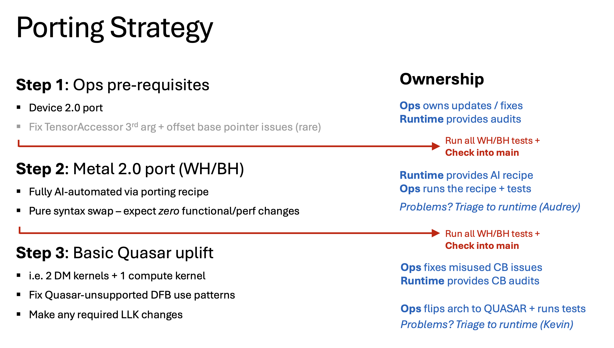

# Orientation: Metal 2.0 Porting

> _This is a human-facing document!_
>
> **Humans**: Please read this before attempting any Metal 2.0 ports.
>
> **AI Agents**: Ignore; this document does not contain any info that you need.
>

## Introduction

**Metal 2.0** is the new Metalium runtime API. It differs from legacy APIs in two ways:
 - All-new host APIs (replacing the legacy APIs in `host_api.hpp` or `program_descriptors.hpp`)
 - DataflowBuffer (replacing the legacy CircularBuffer)

Metal 2.0 builds on top of an earlier, device-side Metalium API refactor called **Device 2.0**.

All **existing TTNN ops must now be ported to Metal 2.0**. The figure below outlines the process for porting ops to Metal 2.0, then uplifting them to Quasar.

This document covers Steps 1 and 2 only.

<p align="left">
  
</p>


## Before You Begin

### Pre-Requisite Reading (for humans)

Although Metal 2.0 porting is largely AI-automated, it's important to familiarize yourself with the basics before undertaking any ports.

Please read all of the following:
 - This document (obviously!)
 - **Intro to Metal 2.0**: `intro_to_metal_2.0.md` -- this document is a work in progress, apologies, as it's messy at the moment. Better orientation resources coming soon.
- **Metal 2.0 headers** (extensively commented)**: `tt_metal/api/tt-metalium/experimental/metal2_host_api/*`
 - **Device 2.0 guide**: `docs/source/tt-metalium/tt_metal/apis/kernel_apis/data_movement/device_api_migration_guide.md`


### Google Drive MCP setup

The porting recipe relies on TTNN op data stored in Google Sheets. In order for your Claude to access it, you must first authorize the Google Drive MCP.

 1. Go to the claude.ai website.
 2. Open Settings (click the bottom-left Tenstorrent logo).
 3. Connectors → Google Drive → Connect.

### Workspace setup

You must supply the `tt-metal` workspace for op porting. You'll launch the AI recipes from the root of your checkout.

To setup your workspace:
 1. Create a branch off `akertesz/op-porting-recipe` (to get the recipes).
 2. Merge main into your branch (to ensure you have the latest main).

Run **only one op port per workspace**. (Trust me... trying to run simultaneous ports within the same workspace will end in tears.) Never commit directly to `akertesz/op-porting-recipe`.

You will **delete** all of the op-porting recipes and intermediate porting artifacts from your branch before merging a port back to main.

## How to Port to Metal 2.0

A Metal 2.0 port is done in three steps:
 1. Audit (evaluate the op's porting readiness)
 2. Port the op to Metal 2.0 (basic port)
 3. Post-port style fixups

The porting recipes are available on the branch `akertesz/op-porting-recipe`, in the directory `docs/source/tt-metalium/tt_metal/apis/host_apis/metal_2.0/ai/`. The recipes are designed to be AI-facing, not human-friendly. These recipes are **not** checked into main (nor will they be). This is by design; it facilitates rapid iteration on the recipes, and it keeps the recipes internal (not customer-facing).

### Audit step
The audit step should be done by **Claude Opus 1M with Max effort**, as some audits are quite complex. It is recommended to begin with a fresh Claude with full context available.

The audit produces two outputs:
 - **METAL2_PREPORT_AUDIT.md** provides the result of the audit. (GREEN = proceed with the port; RED = cannot port yet).
 - **METAL2_PORT_BRIEF.md** provides information required by the subsequent porting step. It's only produced if the audit was successful.


#### Audit launch AI prompt

```
Please audit the TTNN op <OP RELATIVE PATH HERE> for Metal 2.0 portability.

Read and follow `docs/source/tt-metalium/tt_metal/apis/host_apis/metal_2.0/ai/audit/metal2_audit.md`.

Produce METAL2_PREPORT_AUDIT.md (and METAL2_PORT_BRIEF.md if the audit clears) in the op directory, then stop. Please leave these uncommitted for easy in-editor review.

Do not begin the port itself — that runs as a separate session after I review the audit.
```

#### Interpreting a RED audit

A Metal 2.0 porting audit may return RED for multiple reasons. (Could be more than one of the below.)

| Category | Reason | Action |
|--|--|--|
| Op issue | Op is not Device 2.0 compliant | Fix the op |
| Op issue | Op has TensorAccessor 3rd arg violation (rare) | Fix the op |
| Op issue | Op has base pointer offset violation (rare) | Fix the op |
| TTNN issue | Op was unsafely ported to ProgramDescriptor | Await TTNN fix |
| TTNN issue | Missing feature in TTNN's Metal 2.0 FactoryConcept | Await TTNN fix |
| Metal 2.0 issue | Missing Metal 2.0 feature blocks the port | Await Metal 2.0 fix |
| Porting recipe | The op-porting recipe cannot yet handle this op port | Await recipe upgrade |

#### Fixing op issues

If the op audit is blocked on an op issue, you must fix all of the flagged problems before you can port to Metal 2.0.

> **IMPORTANT!** You _must_ check in any prereq changes as a **separate PR**, and **fully test those changes** before attempting a Metal 2.0 port. Do NOT combine the pre-port fixes and the Metal 2.0 port in a single PR!

A Metal 2.0 port produces _no functional changes to the op_. It should be structurally impossible for a successful Metal 2.0 port to alter an op's behavior, change an op's L1 footprint, introduce a new hang, etc.

However, some required op fixups _do_ introduce semantic/functional changes. These are applied at the discretion of the ops team. Entangling the pre-port fixup step with the Metal 2.0 port makes any problems virtually impossible to debug.

### Basic Porting step
The porting step requires a capable AI model with **full context availability**. To ensure a good result, it is *essential* that you do the following:
 - Use **Claude Opus 1M** (with Max effort)
 - Launch the port as your **primary session**. You cannot use a subagent for the main port. Subagents cannot spawn helper subagents, and are limited in their ability to handle long-running background tasks; the porter needs both capabilities.
 - Launch the port in a **fresh instance**. Do not reuse the same session that you used for the audit, or that you used for a previous port. You need to have the full context window available to ensure peak AI performance.
 - If the AI agent reports that it can only port a subset of ProgramFactories for the op within its context budget, respect this and launch the remaining ones from another fresh instance.

Experiments have demonstrated that porting quality falls off significantly if you don't follow these guidelines. Please be very conscious of context window size for Metal 2.0 ports.

#### Basic port launch AI prompt

```
Please port the TTNN op <OP RELATIVE PATH HERE> to Metal 2.0.
The feasibility audit cleared GREEN and I'm asking you to proceed.

Read and follow `docs/source/tt-metalium/tt_metal/apis/host_apis/metal_2.0/ai/port/metal2_port.md`.

Here is the additional info you will need:

Audit report:  METAL2_PREPORT_AUDIT.md in the op directory (GREEN)
Audit brief:   METAL2_PORT_BRIEF.md in the op directory

Please commit METAL2_PREPORT_AUDIT.md, METAL2_PORT_BRIEF.md, METAL2_PORT_PLAN.md and METAL2_PORT_REPORT.md alongside the port.
```

The first thing that Claude will do is to seek out the tests for your op. You will be asked to confirm that the tests identified are correct. **Please vet carefully that no critical tests are omitted, and that no expensive, unnecessary tests are included.**

For large, complex ops, Claude will port only one `ProgramFactory` at a time. If Claude has less than 50% context window remaining when he reports status, you should either trigger a compaction or use a fresh Claude for the next `ProgramFactory`.

#### Check the port report

After a successful port, be sure to read at least the headline findings of the porting report. Claude will sometimes tell you things that you really need to know! (e.g. "I hacked a workaround to this issue I found instead of reporting failure; the result is likely buggy.")

Make sure to check in the reports so that they are part of your porting branch's commit history. You'll probably want to delete them before merging to main.

### Style fixup porting step

The basic Metal 2.0 porting recipe was designed to be as minimal as possible, both to minimize the burden on the porter and to make the diff easier to inspect. However, there are a number of Metal 2.0 style improvements than should be applied to a basic port. Most are primarily cosmetic, but some are beneficial to the downstream Quasar uplift.

This phase of the port applies the style changes stepwise, each as a separate commit.

#### Audit launch AI prompt

```
(Not yet available; coming soon!)
```

### Post-port testing

After a successful Metal 2.0 port, you are responsible for comprehensively testing the result before merging to main. The expected result is _absolutely no change_ in behavior or performance pre- and post-port.

The porter-Claude will already have run the tests you recommended as part of the port.

If you find an unexpected change in op behavior post-port, please contact Audrey Kertesz.
