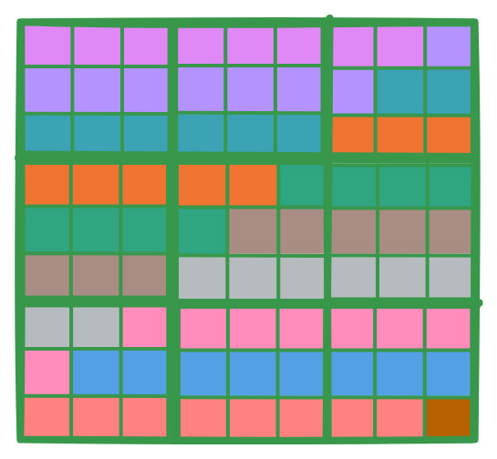

Lab 2: Multi Core Matrix Multiplication
#######################################

Introduction
************

In Lab 1, you reviewed the standard matrix multiplication algorithm, implemented a tiled CPU version, and then mapped
the same computation to a single Tensix core using TT‑Metalium.
In this lab, you will learn how to ake advantage of the parallelism of the Tensix core architecture and extend your
matrix multiplication implementation to multiple Tensix cores.
Then you will introduce a data reuse optimization that reduces traffic to device memory by keeping partial results in on-chip SRAM.

From Single Core to Multi Core Matrix Multiplication
****************************************************

The single-core TT‑Metalium matmul implementation from Lab 1 created tiled tensors in the device DRAM and used two dataflow kernels
to transfer data between the device DRAM and on-chip circular buffers, and a compute kernel to perform the matrix multiplication.
In this lab, you will keep the same basic structure, but instead of running on a single core, you will:

* Create circular buffers and kernels on a **set of cores**.
* Divide the output tiles among those cores.
* Ensure that each core receives appropriate runtime arguments so that it processes the correct subset of output tiles.

Work Distribution for Multi Core Programs
=========================================

The key idea in multi-core programs is **work distribution**: a large problem is broken up into smaller,
ideally independent pieces, and those pieces are assigned to different cores so they can run in parallel.
In a Single Program, Multiple Data (SPMD) computational model, each core executes the same code but operates on
a different subset of the data. Achieving optimal performance generally requires keping all cores busy
(i.e. minimize idle time), and avoiding unnecessary communication.

Applying this principle to matrix multiplication, the computation itself is unchanged: we still multiply
an ``MxK`` matrix ``A`` with a ``KxN`` matrix ``B`` to produce an ``MxN`` matrix ``C``, and we still
process data in tiles. However, instead of a single core computing all of ``C``, the tiles of ``C``
are divided among multiple cores, and each core is responsible for computing a subset of those tiles
in parallel with the others.

At a high level, the host code for multi core matrix multiplication needs to perform the following steps:

#. **Determine number of available (or desired) cores**

   To distribute work among the cores, we need to know how many cores are available and how many of
   these cores we want to use. If the dataset is large enough and we only have one computational task,
   we may use all available cores. If we have multiple computational steps to perform, we may partition
   the work so that each step is performed on a subset of the cores.

#. **Determine amount of parallelizable work**

   The amount of parallelizable work is specific to a given problem, and there may be multiple ways
   to partition the work. For the case of matrix multiplication, one way to partition the work is
   to observe that the computation is independent for each tile of the output matrix.

#. **Partition work among cores**

   If the amount of parallelizable work is larger than the number of cores, we need to split the work
   among the cores as evenly as possible. For matrix multiplication, each tile of the output takes the
   same amount of computation, so we can simply divide the number of tiles by the number of cores.
   In more complex cases, different parallelizable parts of the computation may require different amounts
   of work, so a more sophisticated method of splitting the work may be needed.

#. **Configure each core**

   For each core, we need to configure it to perform the correct subset of the work.
   While each core will execute the same code, the code is usually parameterizable, so we can pass
   different parameters to each core, identifying the subset of work that each core should perform.
   For matrix multiplication, the parameters will include the output tiles that each core should process,
   and depending on exact implementation details, may also include the input tiles that each core should process.

Work Distribution in TT-Metalium
================================

In this section, we describe TT-Metalium APIs for work distribution, and how they can be used to distribute work
needed to perform matrix multiplication on multiple cores.

In Tenstorrent architecture, the cores are organized into a 2D grid with each core uniquely identified
by an index ``(x, y)`` in this grid.

TODO: Insert a figure showing a grid of cores with core indices ``(x, y)`` labeled.

Determine Number of Available Tensix Cores
------------------------------------------

TT-Metalium provides a utility function ``compute_with_storage_grid_size()`` that returns the dimensions
of the core grid as a ``CoreCoord`` object with elements ``x`` and ``y``, representing the number of
Tensix cores along the horizontal and vertical dimensions, respectively.

.. code-block:: cpp

   CoreCoord core_grid = device->compute_with_storage_grid_size();
   uint32_t compute_cores = core_grid.x * core_grid.y;

Split Work Among Tensix Cores
-----------------------------

Tenstorrent devices support multiple parallelization strategies. The grid structure of the Tensix processor
enables various approaches to distributing work. In this lab, we will use a simple SPMD computational model
similar to GPU programming to implement matrix multiplication on multiple cores. Each core will be responsible
for producing ``num_output_tiles/num_cores`` output tiles.

We will use a simple strategy of dividing the work evenly among the cores. We will also make a simplifying assumption
that matrix dimensions are divisible by the tile size.
For example, if the matrix dimensions are ``288x288`` and the tile size is ``32x32``, then the number of output
tiles is ``9 * 9 = 81``. If we choose to implement the matrix multiplication on 11 cores (assuming other cores are
needed for other tasks), then each core will be responsible for producing ``81 / 11 = 7.36`` output tiles.
Since the number of output tiles must be an integer, we will round this up to ``8`` output tiles per core.
As a result, ``10`` cores are assigned ``8`` output tiles each, and the ``11``th core processes the remaining one tile.
The diagram below shows how the output tiles are distributed among the cores. Each square represents a tile, and the
color of the square corresponds to the core that is responsible for producing that tile.

TT-Metalium includes utilities to simplify work distribution across cores.
The ``tt::tt_metal::split_work_to_cores(core_grid, num_work)`` function calculates how many tiles each core should process, based on the total amount of work and the number of available cores. It distributes the work as evenly as possible, even if the number of tiles does not divide evenly among the cores. The function returns several values:

- ``num_cores``: Number of cores used for the operation.
- ``all_cores``: Set of all cores assigned to the operation.
- ``core_group_1``: Primary group of cores, each handling more work.
- ``core_group_2``: Secondary group of cores, each handling less work (empty if the work divides evenly).
- ``work_per_core1``: Number of output tiles each core in the primary group processes.
- ``work_per_core2``: Number of output tiles each core in the secondary group processes (0 if the work divides evenly).

For example, if you need to split 81 output tiles across 11 cores, ``split_work_to_cores`` may distribute the work as follows:

* ``num_cores`` = 11 (all 11 cores are used)
* ``all_cores`` = all 11 cores
* ``core_group_1`` = first 10 cores (each processes 8 tiles)
* ``core_group_2`` = last core (processes 1 tile)
* ``work_per_core1`` = 8 (tiles per core in the primary group)
* ``work_per_core2`` = 1 (tiles for the secondary group core)

.. code-block:: cpp

    auto core_grid = device->compute_with_storage_grid_size();
    uint32_t num_output_tiles = (M * N) / TILE_HW; // number of output tiles

    auto [num_cores, all_cores, core_group_1, core_group_2, work_per_core1, work_per_core2] =
        tt::tt_metal::split_work_to_cores(core_grid, num_output_tiles);

.. note::

    The following properties describe the output of ``tt::tt_metal::split_work_to_cores``:

    - ``all_cores`` is the set of cores assigned work for this operation.
    - If there is not enough work, ``all_cores`` may be smaller than the total number of cores in ``core_grid``.
    - ``all_cores`` contains exactly ``num_cores`` cores.
    - ``all_cores`` is always the union of ``core_group_1`` and ``core_group_2``.
    - The total amount of work (``num_work``) is always fully assigned: ``work_per_core1 * num_cores_in_core_group_1 + work_per_core2 * num_cores_in_core_group_2 == num_work``.
    - The function automatically handles uneven work distribution; you do not need to manage edge cases manually.

You now split ``num_output_tiles`` among a subset of the available cores.
A helper function such as

.. code-block:: cpp

    auto [num_cores,
        all_cores,
        core_group_1,
        core_group_2,
        work_per_core1,
        work_per_core2] =
        tt::tt_metal::split_work_to_cores(core_grid, num_output_tiles);

can be used to divide the work as evenly as possible across the grid.
Conceptually, this call returns:

* ``all_cores``: the set of cores that will actually participate in the operation.

* One or two groups of cores (for example, ``core_group_1`` and ``core_group_2``) when the division of tiles is not perfectly even, along with the number of tiles each core in the group should process.

The important invariants are that:

* The union of the groups equals ``all_cores``.

* The total number of tiles assigned across all cores equals ``num_output_tiles``.

Create Circular Buffers and Kernels on Multiple Cores
-----------------------------------------------------

Circular buffers are now created on **all cores in ``all_cores``** rather than on a single core.
Each participating core gets circular buffers for tiles of ``A``, tiles of ``B``, and tiles of ``C``.

You then create reader, compute, and writer kernels on these cores, using compile-time arguments to pass tensor layout information (for example, via ``TensorAccessorArgs`` built from your ``Tensor`` objects).

Set Per-Core Runtime Arguments
------------------------------

For each participating core, you set runtime arguments that specify:

* Device addresses of the ``Tensor`` objects representing ``A``, ``B``, and ``C``.

* The starting output-tile index (an integer in ``[0, num_output_tiles)``) for that core.

* The number of output tiles assigned to that core.

* The number of tiles along the inner dimension ``K`` in tiles (for example, ``Kt = K / TILE_WIDTH``), which determines how many tile-pairs need to be processed for each output tile.

The reader and writer kernels use these parameters to generate the correct tile indices into the underlying tensors, while the compute kernel uses them to loop over the correct number of output tiles and inner-dimension tiles.

Once this is in place, the rest of the program (enqueuing, execution, reading back the output tensor, untilizing, and verifying against the CPU reference) follows the same pattern as in Lab 1.

Inspecting and Choosing Cores
*****************************

Inspecting Device Core Count
============================

Before you can decide how to distribute work, you need to know how many compute cores your device has.

One option is to use Tenstorrent command-line tools.
On many systems, the ``tt-smi`` utility prints per-device information, including core counts.
For example:

.. code-block:: bash

   tt-smi
   # or, on some systems:
   tt-smi info

should display information about the installed device(s), including the number of compute cores.
If this command is not available or does not show core counts, consult your local installation documentation or system administrator.

As shown earlier, you can also obtain this information directly from your TT‑Metalium C++ program using:

.. code-block:: cpp

   auto core_grid = device->compute_with_storage_grid_size();
   uint32_t total_compute_cores = core_grid.x * core_grid.y;

Here, ``total_compute_cores`` is the maximum number of Tensix cores you can use for matrix multiplication on that device.

Using All Cores or a Subset of Cores
====================================

In this lab, you will run matrix multiplication with:

* Work distributed over **half** of the available cores.

* Work distributed over **all** available cores.

The number of cores actually used is entirely controlled by:

1. Which cores you include in your core sets when creating circular buffers and kernels.

2. Which cores you pass to ``SetRuntimeArgs`` for the reader, compute, and writer kernels.

Cores that are not in these sets will remain idle for that program.

To use **all** available compute cores, you can pass the full compute grid to the work-splitting helper, obtain ``all_cores``, and then:

* Create circular buffers on all cores in ``all_cores``.

* Create kernels on all cores in ``all_cores``.

* Set runtime arguments on all those cores.

To use only **half** the cores, you can proceed as follows:

1. Compute ``total_compute_cores`` as above, and define a target count:

   .. code-block:: cpp

      uint32_t target_cores = std::max(1u, total_compute_cores / 2);

2. Construct a set of exactly ``target_cores`` core coordinates, for example by taking the first several cores in row-major order across the grid.

3. Use this smaller set wherever you previously used ``all_cores`` when creating circular buffers, creating kernels, and setting runtime arguments.

4. Adjust the work distribution so that the same total number of output tiles is spread across this reduced set of cores, with each tile still computed exactly once.

The most important constraint is that **every core on which you create a kernel must also receive runtime arguments for that kernel**.
Creating a kernel on a core without setting runtime arguments can lead to undefined behavior, including crashes or hangs.

Exercise 1: Multi Core Matrix Multiplication
============================================

In this exercise, you will:

1. Implement matrix multiplication on multiple Tensix cores by modifying your Lab 1 solution.

2. Run the same workload using:

   * Work distributed over **half** of the compute cores.

   * Work distributed over **all** available compute cores.

3. Profile and compare the performance of the two runs using the device profiler introduced in Lab 1.

You will **not** start from any existing multi-core example.
Instead, you will extend your own single-core matmul program from Lab 1 to multiple cores, while continuing to use the ``Tensor`` class to represent matrices on the device.

Steps
-----

1. **Start from your Lab 1 single-core matmul program**

   Begin with your solution to Exercise 7 in Lab 1.
   This program should already:

   * Allocate tiled tensors for ``A``, ``B``, and ``C`` in device memory using the ``Tensor`` class.

   * Create circular buffers and reader, compute, and writer kernels on a single core.

   * Perform matrix multiplication on the device and compare the result against a CPU reference implementation.

2. **Choose matrix dimensions consistent with Lab 1**

   Use the same shapes as in Lab 1:

   * ``A`` of size ``640x320`` and ``B`` of size ``320x640``, producing ``C`` of size ``640x640``, or

   * A square ``640x640`` by ``640x640`` matmul, as long as all dimensions are multiples of the tile size.

   Assert (using ``TT_FATAL``) that matrix dimensions are divisible by the tile size, just as you did in Lab 1.

3. **Extend the host code to multiple cores**

   Modify your host program as follows:

   * Open a device and obtain the compute-with-storage grid size using ``compute_with_storage_grid_size()``.

   * Compute the total number of output tiles ``num_output_tiles = Mt * Nt``.

   * Call the work-splitting helper to divide these tiles among cores, and obtain a set of participating cores (for example, ``all_cores``) and per-core tile counts.

   * Create circular buffers for tiles of ``A``, ``B``, and ``C`` on all participating cores, instead of only on a single core.

   * Create reader, compute, and writer kernels on all participating cores.
     Use compile-time arguments built from your ``Tensor`` objects (for example, via ``TensorAccessorArgs``) to pass tensor layout information, as in Lab 1.

4. **Implement the all-cores version**

   First implement a version that uses all cores in your chosen core set:

   * For each participating core, set reader runtime arguments that include:

     - Device addresses of the tensors representing ``A`` and ``B``.

     - Tile-grid dimensions (``Mt``, ``Kt``, ``Nt``).

     - The starting output-tile index and the number of output tiles assigned to this core.

   * Set writer runtime arguments that include:

     - The device address of the output tensor representing ``C``.

     - The number of tiles to write and the starting tile index for this core.

   * Set compute kernel runtime arguments that include:

     - The number of output tiles to produce for this core.

     - The number of tiles along the inner dimension (``Kt``).

   Execute the program, read the output tensor back into a host vector, untilize it, and compare against the CPU reference.
   Verify that the results are numerically close to the golden result, as in Lab 1.

5. **Implement the half-cores version**

   Next, modify the work distribution so that **only half** of the available compute cores are used:

   * Determine ``total_compute_cores`` using ``compute_with_storage_grid_size()`` (or cross-check with ``tt-smi``).

   * Construct a set of exactly half that many cores (rounding down to at least one core), for example by taking the first several cores in row-major order.

   * Recompute the mapping from output tiles to cores using this reduced set.
     Every output tile must still be produced exactly once, and the sum of per-core tile counts must equal ``num_output_tiles``.

   * Create circular buffers and kernels only on this reduced core set, and set runtime arguments only for these cores.

   Run the program and again compare the result against the CPU golden implementation for correctness.

6. **Profile both versions**

   Use the device profiler from Lab 1 to profile both the all-cores and half-cores versions:

   * Ensure that you build in Release mode and that DPRINT is disabled.

   * For each version, run your program with

     .. code-block:: bash

        TT_METAL_DEVICE_PROFILER=1

     set, and examine the generated ``profile_log_device.csv`` file.

   * For each run, compute the total firmware time by subtracting the minimum cycle count from the maximum cycle count and multiplying by the clock period, as you did in Lab 1.

7. **Compare performance**

   Compare the firmware times of the two versions.
   Comment on:

   * How close the all-cores version comes to ideal scaling compared to the half-cores version.

   * How evenly work appears to be distributed across cores.

   * Any differences you observe in kernel or firmware execution patterns.

Background: Data Reuse in Multi Core Matmul
*******************************************

Motivation
==========

In the multi-core SPMD implementation above, each core processes a subset of the output tiles.
For each output tile, the reader kernel streams in all required tiles of ``A`` and ``B`` across the inner dimension ``K``, and the compute kernel accumulates the results.
Once a tile’s contribution is computed, intermediate results are written to the output tensor and no longer reside in on-chip buffers.

However, matrix multiplication has significant structure that allows **partial results and inputs to be reused**.
Repeatedly writing intermediate results to device memory and reading them back is expensive in both time and bandwidth.
An optimized multi-core matmul can reduce this overhead by:

* Grouping tiles into **blocks** and **subblocks**.

* Keeping partial results for a subblock in an **intermediate circular buffer** in L1.

* Reloading and updating those partial results while iterating over blocks along the inner dimension.

In this section, we briefly outline these ideas so that you can implement a data reuse optimization in Exercise 2.

Blocks, Subblocks, and Parameter Utilities
==========================================

So far, we have thought in terms of tiles only.
For data reuse, it is useful to introduce two higher-level concepts:

* A **block**, which groups multiple tiles together for a portion of the matmul.

* A **subblock**, which further partitions a block into smaller regions that map conveniently to the core grid and to circular buffer capacity.

Helper utilities (for example, in a ``bmm_op`` header) can compute an efficient block and subblock layout based on:

* The number of tiles in the output matrix (``Mt`` and ``Nt``).

* The number of cores in each dimension of the compute grid.

* A chosen block width along the inner dimension.

A function such as

.. code-block:: cpp

   auto matmul_params =
       bmm_op_utils::get_large_matmul_params(Mt, Nt, num_cores_y, num_cores_x, in0_block_w);

can return values such as:

* The number of output tiles per core in each dimension.

* The height and width of each output subblock (in tiles).

* The number of tiles in each subblock and the number of blocks along the inner dimension.

You can then choose subblock shapes from a small set of well-performing choices, or let the helper select appropriate shapes for you.
The goal is to ensure that each core:

* Owns a well-defined region (in terms of subblocks) of the output tensor.

* Processes that region by iterating over blocks along the inner dimension, reusing input tiles and partial results as much as possible.

Intermediate Circular Buffer for Partial Results
================================================

The central idea in the data reuse optimization is to maintain **partial results** on-chip while processing multiple blocks along the inner dimension.
To do this, you introduce an additional circular buffer in L1 that serves as an **intermediate results buffer**.

The configuration is as follows:

* Both the final output circular buffer (for example, indexed by ``c_16``) and the intermediate buffer (for example, indexed by another index such as ``c_24``) are created on all participating cores.

* Each buffer uses the same data format and tile size, and the capacity is chosen to hold all tiles needed for one subblock of partial or final results.

During computation, the compute kernel uses this intermediate buffer in three phases:

1. When a subblock of output tiles is processed for the **first** block along ``K``, partial results are computed with ``matmul_tiles`` and stored into the intermediate circular buffer using ``pack_tile`` and ``cb_push_back``.

2. For subsequent blocks along ``K``, the kernel reloads those partial results from the intermediate buffer using ``cb_wait_front`` and ``copy_tile``, and then continues to accumulate additional contributions using ``matmul_tiles``.

3. After all blocks for that subblock have been processed, the final results are either written from the intermediate buffer to the output buffer or packed directly from the destination registers into the output buffer, and the space in the intermediate buffer is freed using ``cb_pop_front``.

A Boolean flag in the compute kernel can control whether partial results are reloaded and reused.
This approach avoids repeatedly writing intermediate results to device memory and reading them back, relying instead on circular buffers in L1 to hold partial sums.

Kernel Structure with Data Reuse
================================

A multi-core matmul with data reuse typically uses three kinds of kernels, as before:

* A **reader kernel** that reads tiles of ``A`` and ``B`` from device memory into L1 based on block and subblock parameters.
  Its runtime arguments encode tensor device addresses (obtained from ``Tensor`` objects on the host), starting tile indices, strides, and block sizes.

* A **writer kernel** that writes tiles from L1 to the output tensor in device memory for the appropriate subblocks of the output matrix, also using tensor addresses and stride information supplied at runtime.

* A **compute kernel** that initializes the matmul engine, uses an intermediate circular buffer to reload and update partial results, and calls ``matmul_tiles`` for each pair of input tiles in a block/subblock.

On the host side, compile-time arguments for the compute kernel specify block and subblock sizes and counts, while runtime arguments for reader and writer kernels specify concrete tensor addresses, strides, and output regions.
The device-side behavior still follows the reader–compute–writer pattern from Lab 1, but now each core:

* Owns a region of the output tensor defined in terms of blocks and subblocks.

* Iterates over blocks in the inner dimension, reusing partial results stored in the intermediate buffer.

Exercise 2: Multi Core Matrix Multiplication with Data Reuse
============================================================

In this exercise, you will implement a multi-core matrix multiplication that uses **data reuse** on the device, based on the block/subblock and intermediate-buffer ideas described above.
You will use **all available compute cores** and compare performance to the best multi-core implementation from Exercise 1.
As before, device data for ``A``, ``B``, and ``C`` should be represented with the ``Tensor`` class; you should not introduce low-level raw buffer objects on the host.

Steps
-----

1. **Create a new program for data reuse**

   Starting from your multi-core matmul host program from Exercise 1, create a new directory (for example, ``lab2_matmul_multicore_reuse``) and copy your code into it under a new executable name.
   You will extend this program to add block/subblock structure and an intermediate circular buffer.

2. **Reuse matrix dimensions and tensors**

   Use the same matrix sizes as in Exercise 1 so that you can compare performance directly.
   Continue to construct ``Tensor`` objects for ``A``, ``B``, and ``C`` in tiled layout from host vectors, and compute a CPU golden result.

3. **Introduce blocks and subblocks**

   Integrate a parameter utility that, given ``Mt``, ``Nt``, and the number of cores in each dimension, computes:

   * The number of output tiles per core.

   * The subblock height and width (in tiles).

   * The number of tiles in each subblock and the number of blocks along the inner dimension.

   Adjust your core assignment so that each core is responsible for a set of output subblocks rather than individual tiles.

4. **Configure circular buffers, including an intermediate buffer**

   On all participating cores, create circular buffers for:

   * Input tiles of ``A`` and ``B``.

   * Output tiles of ``C``.

   * An **intermediate** circular buffer for partial results, with capacity sufficient for all tiles in a subblock.

   Ensure that the data format and tile size of the intermediate buffer match those of the output buffer.

5. **Implement kernels with data reuse**

   Modify or replace your reader, compute, and writer kernels so that:

   * The reader kernel reads tiles of ``A`` and ``B`` according to block and subblock parameters and places them into circular buffers.

   * The compute kernel:

     - For the first block along the inner dimension, computes partial results for a subblock with ``matmul_tiles`` and writes them into the intermediate buffer.

     - For subsequent blocks, reloads partial results from the intermediate buffer, adds new contributions with ``matmul_tiles``, and writes updated partial results back into the intermediate buffer.

     - After processing the last block for a subblock, writes final results into the output circular buffer.

   * The writer kernel writes tiles from the output circular buffer into the correct region of the output tensor in device memory.

   Use compile-time arguments for the compute kernel to specify block and subblock properties, and runtime arguments (including tensor addresses) for reader and writer kernels to specify where the data resides and where results should go.

6. **Verify correctness**

   Run your data reuse implementation and compare the output tensor to the CPU golden matrix multiplication.
   Read the result tensor back into a host vector, untilize it, and confirm that differences are within the expected range for computations using ``bfloat16`` and 32-bit accumulation.

7. **Profile and compare performance**

   Finally, profile your data reuse implementation using the device profiler:

   * Build in Release mode, with DPRINT disabled.

   * Run your program with the profiler enabled and compute the total firmware time from the log, as in Lab 1 and Exercise 1.

   Compare the firmware time of the data reuse implementation against:

   * The all-cores SPMD implementation from Exercise 1.

   * (Optionally) the half-cores SPMD implementation.

   Comment on how much performance improvement, if any, you observe from data reuse, and relate this to the reduction in device memory traffic and the additional complexity of managing blocks, subblocks, intermediate buffers, and per-core parameters.

Conclusion
**********

In this lab you extended your understanding of matrix multiplication on Tenstorrent devices beyond a single core.
You saw how:

* The same reader–compute–writer kernel structure from Lab 1 can be reused in a **multi-core** setting by carefully distributing output tiles among cores, while continuing to use high-level ``Tensor`` objects to represent device-resident matrices.

* TT‑Metalium’s static parallelism model requires you to **explicitly choose which cores participate** and how many tiles each core processes, and to ensure that every core with kernels also receives runtime arguments derived from tensor metadata.

* Introducing **data reuse** through blocks, subblocks, and intermediate circular buffers allows partial results to remain on-chip across multiple passes over the inner dimension, reducing traffic to device memory and often improving performance.

The concepts introduced here—multi-core work distribution and data reuse—are fundamental when scaling workloads on Tenstorrent devices.
They also provide a foundation for more advanced topics such as data multicast and fused kernels.
For further details and advanced examples, you can refer to the TT‑Metalium documentation and associated programming examples in the TT‑Metalium repository.
