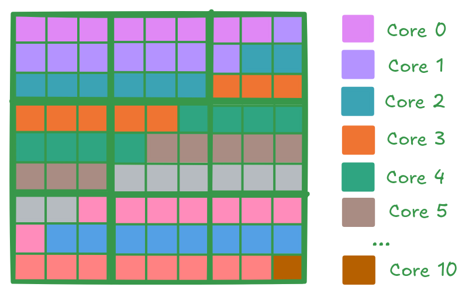

Lab 2: Multi Core Matrix Multiplication
#######################################

Introduction
************

In Lab 1, you reviewed the standard matrix multiplication algorithm, implemented a tiled CPU version, and then mapped
the same computation to a single Tensix core using TT-Metalium.
In this lab, you will learn how to take advantage of the parallelism of the Tensix core architecture and extend your
matrix multiplication implementation to multiple Tensix cores.
Then you will introduce a data reuse optimization that reduces traffic to device memory by keeping partial results in on-chip SRAM.

From Single Core to Multi Core Matrix Multiplication
****************************************************

The single-core TT-Metalium matmul implementation from Lab 1 created tiled tensors in the device DRAM and used two dataflow kernels
to transfer data between the device DRAM and on-chip circular buffers, and a compute kernel to perform the matrix multiplication.
In this lab, you will keep the same basic structure, but instead of running on a single core, you will:

* Create circular buffers and kernels on a **set of cores**.
* Divide the output tiles among those cores.
* Ensure that each core receives appropriate runtime arguments so that it processes the correct subset of output tiles.

Work Distribution for Multi Core Programs
=========================================

The key idea in multi-core programs is **work distribution**: a large problem is broken up into smaller,
ideally independent pieces, and those pieces are assigned to different cores so they can run in parallel.
In a Single Program, Multiple Data (SPMD) computational model, each core executes the same code but operates on
a different subset of the data. Achieving optimal performance generally requires keeping all cores busy
(i.e. minimize idle time), and avoiding unnecessary communication.

Applying this principle to matrix multiplication, the computation itself is unchanged: we still multiply
an ``MxK`` matrix ``A`` with a ``KxN`` matrix ``B`` to produce an ``MxN`` matrix ``C``, and we still
process data in tiles. However, instead of a single core computing all of ``C``, the tiles of ``C``
are divided among multiple cores, and each core is responsible for computing a subset of those tiles
in parallel with the others.

At a high level, the host code for multi core matrix multiplication needs to perform the following steps:

#. **Determine number of available (or desired) cores**

   To distribute work among the cores, we need to know how many cores are available and how many of
   these cores we want to use. If the dataset is large enough and we only have one computational task,
   we may use all available cores. If we have multiple computational steps to perform, we may partition
   the work so that each step is performed on a subset of the cores.

#. **Determine amount of parallelizable work**

   The amount of parallelizable work is specific to a given problem, and there may be multiple ways
   to partition the work. For the case of matrix multiplication, one way to partition the work is
   to observe that the computation is independent for each tile of the output matrix.

#. **Partition work among cores**

   If the amount of parallelizable work is larger than the number of cores, we need to split the work
   among the cores as evenly as possible. For matrix multiplication, each tile of the output takes the
   same amount of computation, so we can simply divide the number of tiles by the number of cores.
   In more complex cases, different parallelizable parts of the computation may require different amounts
   of work, so a more sophisticated method of splitting the work may be needed.

#. **Configure each core**

   For each core, we need to configure it to perform the correct subset of the work.
   While each core will execute the same code, the code usually needs to be parameterizable so each
   core can be configured to perform the correct subset of the work.
   For matrix multiplication, the parameters will include the output tiles that each core should process,
   and depending on exact implementation details, may also include the input tiles that each core should process.

Work Distribution in TT-Metalium
================================

In this section, we describe TT-Metalium APIs for work distribution, and how they can be used to distribute work
needed to perform matrix multiplication on multiple cores.

In Tenstorrent architecture, the cores are organized into a 2D grid with each core uniquely identified
by an index ``(x, y)`` in this grid.

.. figure:: images/tensix_core_grid.png
   :width: 900
   :alt: Tensix Core Grid
   :align: center

   Figure 1: Tensix Core Grid

As shown in Figure 1, core coordinates use the ``x`` and ``y`` dimensions of the grid, rather than the
``row`` and ``column`` dimensions. This is something to be cognizant of when interpreting the coordinates.
While the exact coordinates are not important in many cases, they are useful when examining logs and debug
messages. They also become relevant when examining performance in more detail.

Determine Number of Available Tensix Cores
------------------------------------------

TT-Metalium provides a utility function ``compute_with_storage_grid_size()`` that returns the dimensions
of the core grid as a ``CoreCoord`` object with elements ``x`` and ``y``, representing the number of
Tensix cores along the horizontal and vertical dimensions, respectively.

.. code-block:: cpp

   CoreCoord core_grid = device->compute_with_storage_grid_size();
   uint32_t compute_cores = core_grid.x * core_grid.y;

Split Work Among Tensix Cores
-----------------------------

Tenstorrent devices support multiple parallelization strategies. The grid structure of the Tensix processor
enables various approaches to distributing work. In this lab, we will use a simple SPMD computational model
similar to GPU programming to implement matrix multiplication on multiple cores. Each core will be responsible
for producing ``num_output_tiles/num_cores`` output tiles.

We will use a simple strategy of dividing the work evenly among the cores. We will also make a simplifying assumption
that matrix dimensions are divisible by the tile size.
For example, if the matrix dimensions are ``288x288`` and the tile size is ``32x32``, then the number of output
tiles is ``9 * 9 = 81``. If we choose to implement the matrix multiplication on 11 cores (assuming other cores are
needed for other tasks), then each core will be responsible for producing ``81 / 11 = 7.36`` output tiles.
Since the number of output tiles must be an integer, we will round this up to ``8`` output tiles per core.
As a result, ``10`` cores are assigned ``8`` output tiles each, and the ``11``th core processes the remaining one tile.
The diagram below shows how the output tiles are distributed among the cores. Each square represents a tile, and the
color of the square corresponds to the core that is responsible for producing that tile.

TT-Metalium includes utilities to simplify work distribution across cores.
This is done in two steps:

#. Determine the **amount** of work each core should do.
#. Assign **specific instances of work** to specific cores, based on the amount of work each core should do|
   determined in the first step.

TT-Metalium provides a utility function ``tt::tt_metal::split_work_to_cores(core_grid, work_units)``,
which can be used to determine the amount of work each core should do.
The function calculates how many work units each core should process, based on the total amount of work units
and the number of available cores. The function distributes the work as evenly as possible,
even if the number of work units does not divide evenly among the cores.

``work_units`` is simply an integer that represents the total amount of work to be distributed.
The meaning of ``work_units`` is determined by the specific problem being solved and the parallelization
strategy being used. For example, for matrix multiplication, ``work_units`` could be any of the following:

* Number of elements in the output matrix. Since each output element can be computed in paraller,
  we could choose to assign individual elements to cores.
* Number of tiles in the output matrix. Similar to the above, we could choose to assign individual
  tiles to cores.
* Number of larger blocks in the output matrix. We could choose larger tiles, or even entire blocks
  of tiles in the output matrix as units of work to be assigned to cores.

If we assume that work units are the output tiles, the function may be called as follows:

.. code-block:: cpp

   #include <tt-metalium/work_split.hpp>

   auto core_grid = device->compute_with_storage_grid_size();
   uint32_t work_units = (M * N) / (TILE_HEIGHT * TILE_WIDTH);

   auto [num_cores, all_cores, core_group_1, core_group_2, work_per_core_1, work_per_core_2] =
       tt::tt_metal::split_work_to_cores(core_grid, work_units);

The function returns a tuple containing several values:

- ``uint32_t num_cores``: Number of cores used for the operation.
- ``CoreRangeSet all_cores``: Set of all cores assigned to the operation.
- ``CoreRangeSet core_group_1``: Primary group of cores, each handling more work.
- ``CoreRangeSet core_group_2``: Secondary group of cores, each handling less work
  (empty if the work divides evenly).
- ``uint32_t work_per_core_1``: Number of work units (e.g. output tiles) each core
  in the primary group processes.
- ``uint32_t work_per_core_2``: Number of work units (e.g. output tiles) each core
  in the secondary group processes (0 if the work divides evenly).

A ``CoreRangeSet`` is a compact representation of an arbitrary set of logical cores, implemented as a collection
of rectangular ``CoreRange`` objects. For example, ``all_cores`` contains every core that will do work, while
``core_group_1`` and ``core_group_2`` are disjoint subsets of those same cores. Rather than storing every core
individually, each ``CoreRangeSet`` stores a vector of ``CoreRange`` objects.

Each ``CoreRange`` object is itself defined by two ``CoreCoord`` objects, ``start_coord`` and ``end_coord``, each containing
``x`` and ``y`` coordinates of the opposite corners of an inclusive rectangle of cores (every ``(x, y)`` with
``start_coord.x <= x <= end_coord.x`` and ``start_coord.y <= y <= end_coord.y`` is in the range).
A ``CoreCoord`` is just a pair of integer coordinates ``(x, y)`` naming a single core on the device grid.

``CoreRangeSet`` class exposes a number of helpers, including:

* ``num_cores()``: Returns the total number of logical cores covered by the ``CoreRangeSet``.

* ``ranges()``: Returns a const reference to ``std::vector<CoreRange>`` to allow iterating over all ``CoreRange`` objects in the set. 

* ``contains(CoreCoord)``: Returns ``true`` if and only if the given ``(x, y)`` core lies inside at least
  one of the ``CoreRange`` rectangles in the set, and ``false`` otherwise.

.. note::

    The following properties describe the output of ``tt::tt_metal::split_work_to_cores``:

    - ``all_cores`` is the set of cores assigned work for this operation, containing exactly ``num_cores`` cores.
    -  If there are more cores than work units, ``all_cores`` may contain fewer cores than ``core_grid``.
    - ``all_cores`` is always the union of ``core_group_1`` and ``core_group_2``.
    - The total amount of work ``work_units``  is always fully assigned:
      ``work_per_core_1 * num_cores_in_core_group_1 + work_per_core_2 * num_cores_in_core_group_2 == work_units``.
    - The function automatically handles uneven work distribution; there is no need to manage edge cases manually.

Given the earlier example of splitting 81 output tiles across 11 cores, ``split_work_to_cores`` may distribute the work as follows:

* ``num_cores`` = 11 (all 11 cores are used)
* ``all_cores`` = all 11 cores
* ``core_group_1`` = Set containing coordinates of the first 10 cores (each processes 8 tiles)
* ``core_group_2`` = Set containing a single coordinate of the last core (processes 1 tile)
* ``work_per_core_1`` = 8 (tiles per core in the primary group)
* ``work_per_core_2`` = 1 (tiles for the secondary group core)

It is important to only create kernels on cores that have been assigned work (i.e., those in `all_cores` or `core_group_*`,
and **not** over all cores in ``core_grid``).
Creating kernels on unused cores can cause undefined behavior or crashes if kernels are created but runtime arguments are not
set on the core.

Create Circular Buffers and Kernels on Multiple Cores
-----------------------------------------------------

Circular buffers (CBs) have to be created on each core participating in computation, which can be achieved simply by passing
``all_cores`` to the function creating circular buffers.
Each participating core will use its CBs to store required tiles of matrices ``A``, ``B`` and ``C``.

Similarly, reader, compute, and writer kernels need to be created on all cores, and this is also achieved simply by passing
``all_cores`` to the function creating kernels.

Set Per-Core Runtime Arguments
------------------------------

The way to assign **specific instances of work** to specific cores is through runtime arguments for each kernel instance.
We need to determine what arguments are needed for each kernel instance so that kernel on each core has sufficient
information to perform only those operations that are needed for the tiles assigned to that core.
The reader and writer kernels need to generate correct tile indices into the underlying tensors, while the compute kernel
needs to loop over the correct number of output tiles and inner-dimension tiles.

All kernel arguments that need to be different between cores must be passed as runtime arguments and set for each core differently.
Arguments that are the same for all cores can be passed as either compile-time arguments or runtime arguments.
As discussed in Lab 1, the decision to use compile-time arguments vs. runtime arguments is based on a tradeoff between potential
performance benefit from using compile-time arguments vs. kernels having to be recompiled for each core.

Inspecting and Choosing Cores
*****************************

As shown earlier, the number of compute cores on the device can be obtained using the
``compute_with_storage_grid_size()`` TT-Metalium C++ API:

.. code-block:: cpp

   auto core_grid = device->compute_with_storage_grid_size();
   uint32_t total_compute_cores = core_grid.x * core_grid.y;

In this lab, you will run matrix multiplication with varying number of cores.
The number of cores actually used is entirely controlled by which cores you include in your core sets when creating circular buffers and kernels.
Any cores without kernels created on them will remain idle for that program. In real applications, they would be allocated to other tasks.

To use **all** available compute cores, you can pass the full compute grid to the work-splitting helper, obtain ``all_cores``, and then
create CBs and kernels on all cores in ``all_cores``, passing appropriate runtime arguments to the kernels.
To use fewer cores, you can modify core grid by selecting only a subset of cores. For example, to use only half the cores, you could simply
selecting only the first half of the cores in the ``y`` dimension and pass that modified core grid to the work-splitting helper.
The rest of the code can usually remain the same, because the work-splitting helper automatically distributes the work evenly among
the smaller set of cores.
As a result, the same total number of output tiles ends up spread across this reduced set of cores, with each tile still computed exactly once.
It is important to remember that **every core on which you create a kernel must also receive appropriate runtime arguments for that kernel**.
Creating a kernel on a core without setting runtime arguments can lead to undefined behavior, including crashes or hangs.

Exercise 1: Multi Core Matrix Multiplication
============================================

In this exercise, you will:

#. Implement matrix multiplication on multiple Tensix cores by modifying your Lab 1 solution.
#. Verify correctness by comparing the result against the CPU reference implementation.
#. Run the same workload using:

   * Work distributed over **all** available compute cores.
   * Work distributed over **half** of the available compute cores.
   * Work distributed over **one fifth** of the available compute cores.
   
   Note that depending on device type, you may not be able to use precisely one fifth of the cores.
   If the number of cores is not divisible by 5, simply round down to the nearest integer.
#. Profile and compare the performance of the three runs using the device profiler introduced in Lab 1.
#. Plot a speedup plot comparing the performance of the three runs relative to the single core implementation from Lab 1.

Additional details
------------------

To call the ``compute_with_storage_grid_size()`` API, you need to get the ``device`` object,
which can be obtained from the program state object (i.e. ``prog_state.mesh_device.get()``).

You will need to create circular buffers for tiles of ``A``, ``B``, and ``C`` on all participating cores,
instead of only on a single core.
Note that the ``create_cb`` helper function needs to be updated to accept a ``CoreRangeSet`` of cores,
which can then be passed on to the ``CreateCircularBuffer`` function.
Alternatively, you could update ``create_cb`` to take a variant argument similar to the ``CreateCircularBuffer`` function.

When profiling, you can use the device profiler from Lab 1. Ensure that you build in Release mode and that DPRINT is disabled.

Background: Data Reuse in Multi Core Matmul
*******************************************

Motivation
==========

In the basic multi-core implementation, each core computes one output tile at a time.
For each output tile ``C[i,j]``, the reader kernel fetches **all** tiles along the
inner dimension ``K`` for both the corresponding row of ``A`` and column of ``B``.
This approach has a critical inefficiency: **tiles from input matrices are re-fetched
from DRAM multiple times**.

Consider a concrete example with matrices A (4x4 tiles), B (4x4 tiles), producing
C (4x4 tiles). To compute output tiles ``C[0,0]`` and ``C[0,1]``:

+----------------+----------------------------------------+----------------------------------------+
| Output Tile    | Tiles Read from A                      | Tiles Read from B                      |
+================+========================================+========================================+
| C[0,0]         | A[0,0], A[0,1], A[0,2], A[0,3]         | B[0,0], B[1,0], B[2,0], B[3,0]         |
+----------------+----------------------------------------+----------------------------------------+
| C[0,1]         | A[0,0], A[0,1], A[0,2], A[0,3]         | B[0,1], B[1,1], B[2,1], B[3,1]         |
+----------------+----------------------------------------+----------------------------------------+

Notice that **the entire row 0 of A is read twice** -- once for C[0,0] and once for C[0,1].
In general, for an MxK @ KxN matmul producing MxN output tiles:

- Each row of A is read N times (once per column of C in that row)
- Each column of B is read M times (once per row of C in that column)

This redundant DRAM traffic becomes the performance bottleneck, especially as matrix
dimensions grow.
A simple optimization would be to store the whole row of A in a temporary on-chip buffer, and then
use that buffer to compute all the output tiles in the row. However, this naive approach doesn't scale
well to large matrices because the amount of on-chip memory is limited.

Multi-Step Optimization: Blocking and Subblocking
=================================================

A more general approach is to group output tiles into blocks, and then reuse the data within the blocks.
The blocking implementation requires computation of partial results for each block. Storing these partial
results in off-chip DRAM would result in poor perfromance. Therefore, they should ideally be stored in on-chip
SRAM, as long as the amount of on-chip SRAM is sufficient.
While this approach is also limited by the amount of on-chip SRAM, it breaks up data into smaller chunks
than the naive approach, thus supporting larger matrices.

There are two distinct ways in which Tenstorrent architecture allows storing partial results in on-chip memory:

* Using a **circular buffer** in on-chip SRAM.
  As discussed in Lab 1, kernels can read from and write to the same CB, allowing the CB to be used as
  temporary storage for partial results.
* Using **destination registers** in Tensix cores.
  As discussed in Lab 1, destination register array in the Tensix core can hold multiple tiles of data.
  Specifically, the destination register array can hold 8 tiles of data.
  Previously we only used a single tile in the destination register array.
  However, in blocked matrix multiplication, we can use the destination register array to hold
  a subset of partial results.

Visualizing the Data Reuse Opportunity
======================================

The following diagram illustrates the basic approach versus the optimized approach
for a 4x4 output tile matrix with K=4 inner dimension tiles::

    BASIC APPROACH: Process output tiles one at a time (high DRAM traffic)
    ======================================================================

         K tiles (inner dimension)
         <---------------------->
       +----+----+----+----+
    M  | A0 | A1 | A2 | A3 |  Row 0 of A read for EACH output tile in row 0 of C
    t  +----+----+----+----+
    i  | A4 | A5 | A6 | A7 |  Row 1 of A read for EACH output tile in row 1 of C
    l  +----+----+----+----+
    e  | A8 | A9 |A10 |A11 |  ...
    s  +----+----+----+----+
       |A12 |A13 |A14 |A15 |
       +----+----+----+----+

    For C[0,0]: Read A row 0 (4 tiles) + B col 0 (4 tiles) = 8 DRAM reads
    For C[0,1]: Read A row 0 (4 tiles) + B col 1 (4 tiles) = 8 DRAM reads
    ...
    Total for row 0 of C: 4 outputs x 8 reads = 32 DRAM reads
    But A row 0 could be reused! Wasted: 3 x 4 = 12 redundant reads of A row 0

    OPTIMIZED APPROACH: Group outputs into blocks, reuse data within blocks
    =======================================================================

    Assign a BLOCK of output tiles to each core (e.g., 2x2 tiles per core):

       +----+----+----+----+
       | C0 | C0 | C1 | C1 |   <- Core 0 computes top-left 2x2 block
       +----+----+----+----+      Core 1 computes top-right 2x2 block
       | C0 | C0 | C1 | C1 |
       +----+----+----+----+
       | C2 | C2 | C3 | C3 |   <- Core 2 computes bottom-left 2x2 block
       +----+----+----+----+      Core 3 computes bottom-right 2x2 block
       | C2 | C2 | C3 | C3 |
       +----+----+----+----+

    Now Core 0 can:
    1. Read A rows 0-1 once (a "block" of A)
    2. Read B columns 0-1 once (a "block" of B)
    3. Compute partial products for **all 4 output tiles** simultaneously
    4. Accumulate partial results in L1 (intermediate buffer)
    5. Repeat for next block along K dimension
    6. Write final results only once

This blocking strategy reduces DRAM traffic by reusing input tiles across multiple
output tiles computed by the same core.

An optimized multi-core matmul can reduce this overhead by:

* Grouping tiles into **blocks** and **subblocks**.

* Keeping partial results for a subblock in an **intermediate circular buffer** in L1.

* Reloading and updating those partial results while iterating over blocks along the inner dimension.

In this section, we briefly outline these ideas so that you can implement a data reuse optimization in Exercise 2.

Blocks, Subblocks, and Parameter Utilities
==========================================

So far, we have thought in terms of tiles only.
For data reuse, it is useful to introduce two higher-level concepts:

* A **block**, which groups multiple tiles together for a portion of the matmul.

* A **subblock**, which further partitions a block into smaller regions that map conveniently to the core grid and to circular buffer capacity.

Helper utilities (for example, in a ``bmm_op`` header) can compute an efficient block and subblock layout based on:

* The number of tiles in the output matrix (``Mt`` and ``Nt``).

* The number of cores in each dimension of the compute grid.

* A chosen block width along the inner dimension.

A function such as

.. code-block:: cpp

   auto matmul_params =
       bmm_op_utils::get_large_matmul_params(Mt, Nt, num_cores_y, num_cores_x, in0_block_w);

can return values such as:

* The number of output tiles per core in each dimension.

* The height and width of each output subblock (in tiles).

* The number of tiles in each subblock and the number of blocks along the inner dimension.

You can then choose subblock shapes from a small set of well-performing choices, or let the helper select appropriate shapes for you.
The goal is to ensure that each core:

* Owns a well-defined region (in terms of subblocks) of the output tensor.

* Processes that region by iterating over blocks along the inner dimension, reusing input tiles and partial results as much as possible.

Intermediate Circular Buffer for Partial Results
================================================

The central idea in the data reuse optimization is to maintain **partial results** on-chip while processing multiple blocks along the inner dimension.
To do this, you introduce an additional circular buffer in L1 that serves as an **intermediate results buffer**.

The configuration is as follows:

* Both the final output circular buffer (for example, indexed by ``c_16``) and the intermediate buffer (for example, indexed by another index such as ``c_24``) are created on all participating cores.

* Each buffer uses the same data format and tile size, and the capacity is chosen to hold all tiles needed for one subblock of partial or final results.

During computation, the compute kernel uses this intermediate buffer in three phases:

1. When a subblock of output tiles is processed for the **first** block along ``K``, partial results are computed with ``matmul_tiles`` and stored into the intermediate circular buffer using ``pack_tile`` and ``cb_push_back``.

2. For subsequent blocks along ``K``, the kernel reloads those partial results from the intermediate buffer using ``cb_wait_front`` and ``copy_tile``, and then continues to accumulate additional contributions using ``matmul_tiles``.

3. After all blocks for that subblock have been processed, the final results are either written from the intermediate buffer to the output buffer or packed directly from the destination registers into the output buffer, and the space in the intermediate buffer is freed using ``cb_pop_front``.

A Boolean flag in the compute kernel can control whether partial results are reloaded and reused.
This approach avoids repeatedly writing intermediate results to device memory and reading them back, relying instead on circular buffers in L1 to hold partial sums.

Kernel Structure with Data Reuse
================================

A multi-core matmul with data reuse typically uses three kinds of kernels, as before:

* A **reader kernel** that reads tiles of ``A`` and ``B`` from device memory into L1 based on block and subblock parameters.
  Its runtime arguments encode tensor device addresses (obtained from ``Tensor`` objects on the host), starting tile indices, strides, and block sizes.

* A **writer kernel** that writes tiles from L1 to the output tensor in device memory for the appropriate subblocks of the output matrix, also using tensor addresses and stride information supplied at runtime.

* A **compute kernel** that initializes the matmul engine, uses an intermediate circular buffer to reload and update partial results, and calls ``matmul_tiles`` for each pair of input tiles in a block/subblock.

On the host side, compile-time arguments for the compute kernel specify block and subblock sizes and counts, while runtime arguments for reader and writer kernels specify concrete tensor addresses, strides, and output regions.
The device-side behavior still follows the reader-compute-writer pattern from Lab 1, but now each core:

* Owns a region of the output tensor defined in terms of blocks and subblocks.

* Iterates over blocks in the inner dimension, reusing partial results stored in the intermediate buffer.

Exercise 2: Multi Core Matrix Multiplication with Data Reuse
============================================================

In this exercise, you will implement a multi-core matrix multiplication that uses **data reuse** on the device, based on the block/subblock and intermediate-buffer ideas described above.
You will use **all available compute cores** and compare performance to the best multi-core implementation from Exercise 1.
As before, device data for ``A``, ``B``, and ``C`` should be represented with the ``Tensor`` class; you should not introduce low-level raw buffer objects on the host.

Steps
-----

1. **Create a new program for data reuse**

   Starting from your multi-core matmul host program from Exercise 1, create a new directory (for example, ``lab2_matmul_multicore_reuse``) and copy your code into it under a new executable name.
   You will extend this program to add block/subblock structure and an intermediate circular buffer.

2. **Reuse matrix dimensions and tensors**

   Use the same matrix sizes as in Exercise 1 so that you can compare performance directly.
   Continue to construct ``Tensor`` objects for ``A``, ``B``, and ``C`` in tiled layout from host vectors, and compute a CPU golden result.

3. **Introduce blocks and subblocks**

   Integrate a parameter utility that, given ``Mt``, ``Nt``, and the number of cores in each dimension, computes:

   * The number of output tiles per core.

   * The subblock height and width (in tiles).

   * The number of tiles in each subblock and the number of blocks along the inner dimension.

   Adjust your core assignment so that each core is responsible for a set of output subblocks rather than individual tiles.

4. **Configure circular buffers, including an intermediate buffer**

   On all participating cores, create circular buffers for:

   * Input tiles of ``A`` and ``B``.

   * Output tiles of ``C``.

   * An **intermediate** circular buffer for partial results, with capacity sufficient for all tiles in a subblock.

   Ensure that the data format and tile size of the intermediate buffer match those of the output buffer.

5. **Implement kernels with data reuse**

   Modify or replace your reader, compute, and writer kernels so that:

   * The reader kernel reads tiles of ``A`` and ``B`` according to block and subblock parameters and places them into circular buffers.

   * The compute kernel:

     - For the first block along the inner dimension, computes partial results for a subblock with ``matmul_tiles`` and writes them into the intermediate buffer.

     - For subsequent blocks, reloads partial results from the intermediate buffer, adds new contributions with ``matmul_tiles``, and writes updated partial results back into the intermediate buffer.

     - After processing the last block for a subblock, writes final results into the output circular buffer.

   * The writer kernel writes tiles from the output circular buffer into the correct region of the output tensor in device memory.

   Use compile-time arguments for the compute kernel to specify block and subblock properties, and runtime arguments (including tensor addresses) for reader and writer kernels to specify where the data resides and where results should go.

6. **Verify correctness**

   Run your data reuse implementation and compare the output tensor to the CPU golden matrix multiplication.
   Read the result tensor back into a host vector, untilize it, and confirm that differences are within the expected range for computations using ``bfloat16`` and 32-bit accumulation.

7. **Profile and compare performance**

   Finally, profile your data reuse implementation using the device profiler:

   * Build in Release mode, with DPRINT disabled.

   * Run your program with the profiler enabled and compute the total firmware time from the log, as in Lab 1 and Exercise 1.

   Compare the firmware time of the data reuse implementation against:

   * The all-cores SPMD implementation from Exercise 1.

   * (Optionally) the half-cores SPMD implementation.

   Comment on how much performance improvement, if any, you observe from data reuse, and relate this to the reduction in device memory traffic and the additional complexity of managing blocks, subblocks, intermediate buffers, and per-core parameters.

Conclusion
**********

In this lab you extended your understanding of matrix multiplication on Tenstorrent devices beyond a single core.
You saw how:

* The same reader-compute-writer kernel structure from Lab 1 can be reused in a **multi-core** setting by carefully distributing output tiles among cores, while continuing to use high-level ``Tensor`` objects to represent device-resident matrices.

* TT-Metalium's static parallelism model requires you to **explicitly choose which cores participate** and how many tiles each core processes, and to ensure that every core with kernels also receives runtime arguments derived from tensor metadata.

* Introducing **data reuse** through blocks, subblocks, and intermediate circular buffers allows partial results to remain on-chip across multiple passes over the inner dimension, reducing traffic to device memory and often improving performance.

The concepts introduced here, multi-core work distribution and data reuse, are fundamental when scaling workloads on Tenstorrent devices.
They also provide a foundation for more advanced topics such as data multicast and fused kernels.
For further details and advanced examples, you can refer to the TT-Metalium documentation and associated programming examples in the TT-Metalium repository.
