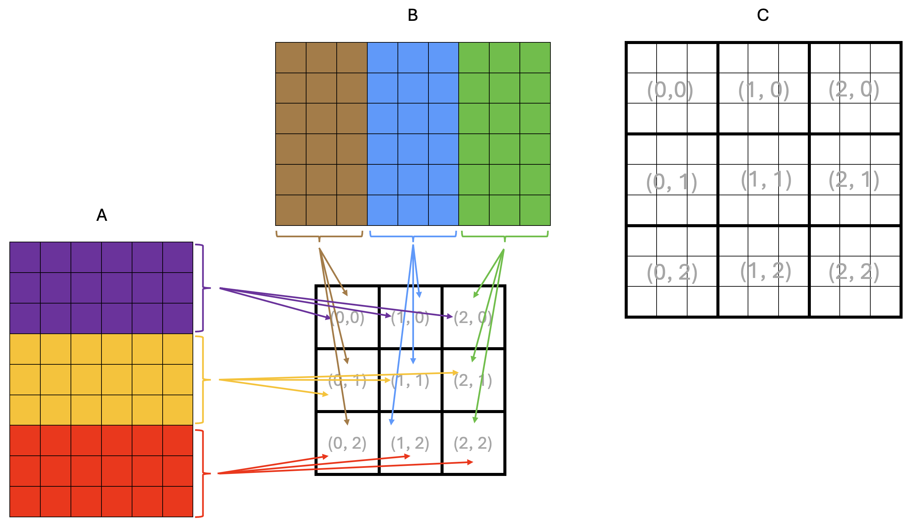
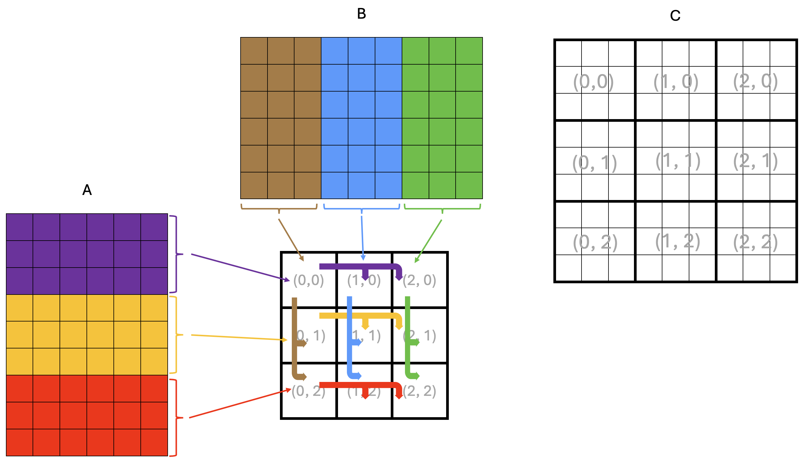
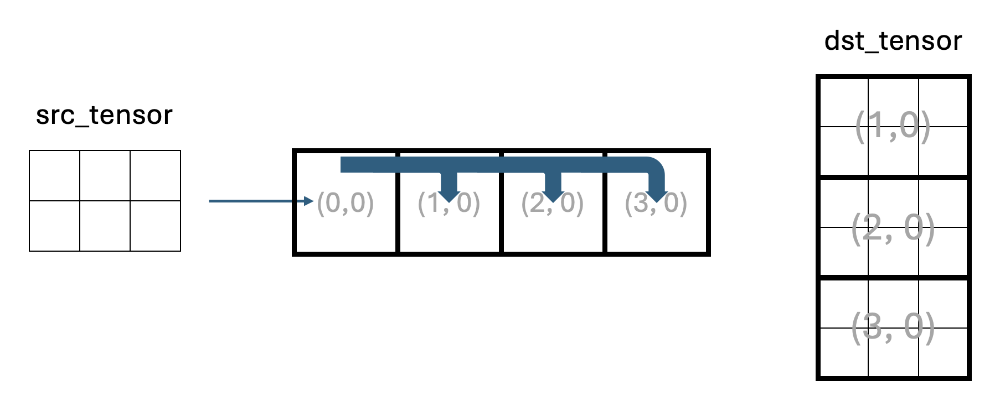
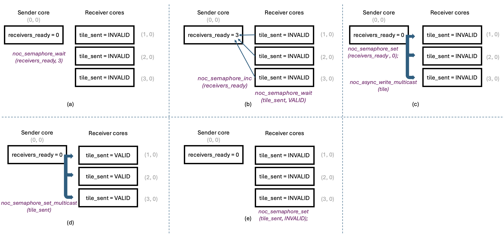
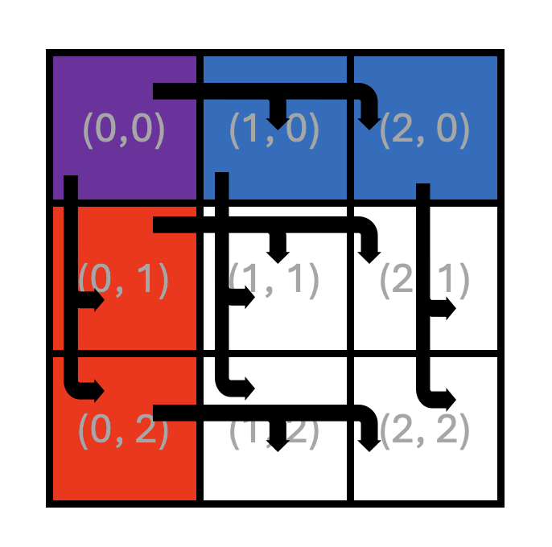

Lab 3: Multicast for Improved Data Reuse in Multi Core Matrix Multiplication
############################################################################

Introduction
************

In Lab 2, you implemented multi core matrix multiplication with data reuse within each core.
Each core read tiles of input matrices from DRAM into its own circular buffers (CBs) and
reused them locally across multiple multiply-accumulate steps. However, data was not reused across cores:
each core read its own tiles from DRAM, even when neighboring cores needed the same data.

Ideally, each piece of data should be fetched from DRAM only once and then reused by all cores that need it.
On Tenstorrent devices, cores do not have direct access to each other's circular buffers (CBs), but they are
connected by a 2D **Network on Chip (NoC)** that allows them to pass data to each other.
While sending data over the NoC is more efficient than reading data from DRAM multiple times,
it still introduces overhead that we would like to minimize.
The NoC supports **unicast** and **multicast** operations.
Unicast allows a sender core to write data to a single destination core.
Multicast allows a sender core to write the same data to multiple destination cores in a single NoC operation,
minimizing the overhead when the same data needs to be sent to multiple cores.

In this lab, you will:

* Learn how to use simple multicast to send tiles from one sender core to multiple receiver cores.
* Understand how semaphores, device coordinates, and multicast addressing work together.
* Apply multicast to your Lab 2 multi core matrix multiplication so that tiles of ``A`` and ``B`` are reused across cores,
  not just within a single core.

High-Level Motivation
=====================

Consider the example matrix multiplication shown in Figure 1.

   Figure 1: Example matrix multiplication on a 3x3 core grid

Each square in Figure 1 represents a tile, and the dimensions of the matrices are ``9x6`` tiles
for ``A`` and ``6x9`` tiles for ``B``, resulting in a ``9x9`` tile output matrix ``C``.
The squares in the middle of the figure represent the core grid, with each square labeled
with its core coordinates ``(x, y)``. The core coordinates are also shown over the output
matrix ``C`` to indicate the core that computes the corresponding rectangular block of tiles.

From the basic matrix multiplication algorithm, we know that computing an element of the output matrix ``C``
requires all elements of the corresponding row of ``A`` and the corresponding column of ``B``.
The same applies when computing tiles or rectangular blocks of tiles of ``C``.
This means that all cores in the same row need the same tile rows of ``A``,
and all cores in the same column need the same tile columns of ``B``.

Arrows in Figure 1 show tiles being read from DRAM into the cores' on-chip SRAM:
all cores in the same row read the same tile rows of ``A``, and all cores in the same
column read the same tile columns of ``B``.

Since DRAM bandwidth is limited, this is inefficient because the same data is read multiple times from DRAM.
Instead, we would like to load a tile from DRAM once and share it across all cores that need it through the NoC.
A possible way to achieve this is shown in Figure 2.

   Figure 2: Example matrix multiplication on a 3x3 core grid with multicast

In the example in Figure 2, only the leftmost core in each grid row reads tiles of ``A`` from DRAM,
depicted by thin arrows in the figure.
Each leftmost core stores the tiles of ``A`` into its own CBs for its own computation, just as it did in Lab 2.
However, it now also multicasts the tiles of ``A`` it read from DRAM to all the other cores in the same row.
Similarly, only the topmost core in each grid column reads tiles of ``B`` from DRAM, storing them into
its own CBs for its own computation, and multicasts these tiles to all the other cores in the same column.
The multicast operations are depicted by thick arrows in the figure.

In the rest of this lab, you will first work through a simple example program demonstrating NoC and
multicast features, and then retrofit your Lab 2 matrix multiplication with data reuse solution
to use multicast.

Background: Tenstorrent NoC and Multicast
*****************************************

The Network on Chip (NoC) is a high-bandwidth 2D torus interconnect (often visualized as a 2D grid)
that connects:

* All Tensix cores
* DRAM controllers
* PCIe interfaces
* Ethernet cores (for multi-device systems)

The NoC transfers data between components of the device, including between DRAM and on-chip SRAM.
As you have seen in earlier labs, a TT-Metalium programmer does not need to understand all of the
hardware details to use the NoC.
In this lab, we will expand our use of the NoC to include multicast operations to transfer data between cores.
For more detailed information about the NoC, refer to the resources listed in the Additional Information
section at the end of this lab.

In TT-Metalium, NoC multicast is a data movement operation where one core writes directly into the
on-chip SRAM of multiple other cores with a single command. The sender core specifies a group of
destination cores and a destination memory address, and the NoC hardware delivers the data to that
address on every destination core.
Unlike a "pull" model where receivers issue read requests, multicast is a "push" model: the sender
pushes the data into the receivers' on-chip memories.

From the receiving core's point of view, a multicast operation writes tiles straight into its on-chip SRAM,
typically into a location it has already set aside in a circular buffer (CB). The receiver does not
need to perform any explicit read or copy for the data itself; it only needs to prepare space and
indicate that it is ready to accept a tile (for example, by reserving a CB slot). Once the multicast
completes, the tile is simply present in the CB, ready to be consumed by the compute or writer
kernels just like any other locally produced data.

We will illustrate the multicast operation with a simple example program in the next section.

Example Multicast Program
*************************

The main host program for the multicast example is ``ttnn/examples/lab_multicast/lab_multicast.cpp``.
The program creates a 2D tensor and fills it with random data.
One **sender core** uses a reader kernel to read tiles of this tensor from DRAM and also multicasts them to three **receiver cores**.
The flow of data is shown in Figure 3.

   Figure 3: Data flow in the multicast example program

Core ``(0,0)`` is the **sender core** and cores ``(1,0)``, ``(2,0)``, and ``(3,0)`` are **receiver cores**.
Receiver cores do not read the input tensor from DRAM, but receive tiles via multicast from the sender.
Each receiver core has three kernels:

* A reader kernel that manages the CB and signals to the sender core when it is ready for the next tile.
* A compute kernel, which simply copies each tile to the output CB. In a real application, this is where computation would happen.
* A writer kernel that writes each tile into an appropriate region of the output tensor in DRAM.

The host reads back all receiver outputs and verifies that the output tensor contains three
copies of the original tensor stacked vertically.
Note that the number of tiles in Figure 3 is symbolic and does not accurately represent
the number of tiles in the actual program.

Synchronization with Semaphores
===============================

Given that multicast uses a "push" model in which the sender writes data directly into the receivers' on-chip SRAM,
it is important to coordinate execution between the sender and receivers to avoid data corruption and
race conditions. This coordination is done using semaphores.
In general, a semaphore is a small shared variable used to coordinate concurrently running code.
For example, one semaphore can signal that receivers are ready for data (for example, after reserving
a CB slot for an incoming tile), and another can signal that data has been sent
(i.e., written to receivers' memory).

In TT-Metalium, a semaphore is an integer value stored in on-chip SRAM that multiple cores can read and update.
Typical use cases for semaphores include:

* A core **increments or sets** a semaphore to signal that some condition is now true
  (for example, "a receiver is ready" or "a tile has been sent").
* A core **waits until the semaphore reaches a target value** before proceeding, ensuring it does not
  read data or start an action too early (e.g., before the data has been written to memory).

A semaphore can be created on one or more Tensix cores using the ``CreateSemaphore`` host-side API,
which allocates and initializes a semaphore in on-chip SRAM and returns a semaphore ID.
For example, in ``lab_multicast.cpp``, there are two semaphores created:

.. code-block:: cpp

   uint32_t receivers_ready_semaphore = CreateSemaphore(prog_state.program, all_cores_logical, 0);
   uint32_t tile_sent_semaphore = CreateSemaphore(prog_state.program, all_cores_logical, INVALID);

where ``prog_state.program`` is the TT-Metalium ``Program`` that these semaphores belong to,
and ``all_cores_logical`` is the logical core range on which to create the semaphore
(in this example, all four cores). Finally, the last argument is the initial value of the
semaphore on each core. In this example, ``0`` is used for the ``receivers_ready_semaphore``
to indicate that none of the receivers are ready to receive a tile.
Similarly, ``tile_sent_semaphore`` is initialized to the ``INVALID`` value because initially the sender
core has not sent any tiles. ``INVALID`` and ``VALID`` are constant integer values defined in the
TT-Metalium API to make the code more readable.

The IDs returned by ``CreateSemaphore`` are then passed as kernel arguments so that kernels can use
them to access the semaphore on the core they are running on.

High-Level Multicast Protocol
=============================

Before looking at the code, it is helpful to describe the multicast protocol at a high level,
as shown in Figure 4.

   Figure 4: Multicast Protocol

Figure 4(a) shows the multicast protocol near the beginning of kernel code execution,
with all semaphores at their initial values.
The sender core has just read a tile from DRAM into its input CB, and is ready to multicast it
to other cores. However, it must wait until all receivers signal that they are ready for the tile.
The sender does this by waiting for the ``receivers_ready`` semaphore, which resides
**in the sender's on-chip SRAM**, to reach the number of receivers (three in our example program).
Waiting on a semaphore is a blocking call and does **not** involve any NoC traffic since the
semaphore is in the local on-chip SRAM.

Receivers, for their part, must allocate space in their input CBs for the incoming tile and then
signal that they are ready to receive the next tile. They do so by calling ``noc_semaphore_inc``
on the ``receivers_ready`` semaphore **in the sender's on-chip SRAM**, to increment it by 1.
This is shown in Figure 4(b).
Note that this increment **does** require a NoC transaction, since the ``receivers_ready``
semaphore is in the sender's on-chip SRAM. These transactions are **unicast transactions**:
each receiver core sends an independent increment transaction to the sender core, so the order
of increments is not guaranteed. However, incrementing a semaphore is an atomic operation, so
the sender will eventually see the correct number of receivers ready for the tile.
The sender core does not send the tile until all receivers have indicated they are ready.
After indicating readiness, each receiver core waits for the sender to multicast the tile to it.
This is done by waiting on the ``tile_sent`` semaphore **in the receiver's on-chip SRAM**.
This wait operation also does not involve any NoC traffic since the semaphore is in the local on-chip SRAM.

Once the sender core has seen the correct number of receivers ready for the tile,
it can **multicast** the tile to all receiver cores in one operation, using the ``noc_async_write_multicast``
function. This is illustrated in Figure 4(c).
The sender core also resets the ``receivers_ready`` semaphore to ``0`` to avoid accidental reuse of
the same semaphore value, and in preparation for the next tile.
Since the ``receivers_ready`` semaphore is in the sender's on-chip SRAM, this does not require any NoC traffic.

Having sent the tile to all receiver cores, the sender core must signal to the receivers that the tile has been sent.
This is done by calling ``noc_semaphore_set_multicast`` on the ``tile_sent`` semaphore **in the receiver's on-chip SRAM**,
to set it to ``VALID``. This is illustrated in Figure 4(d).
Since we wish to update the ``tile_sent`` semaphore on **all receiver cores**, this requires a NoC **multicast transaction**.

Finally, once a receiver core observes that its ``tile_sent`` semaphore has been set to ``VALID``,
it can proceed to consume the tile. Once the tile has been consumed, the receiver core calls ``noc_semaphore_set``
on the ``tile_sent`` semaphore in its own on-chip SRAM, to set it to ``INVALID`` to prepare for the next tile.
Similar to the earlier ``noc_semaphore_set`` call, this does **not** require any NoC traffic since the
semaphore is in the local on-chip SRAM. This is illustrated in Figure 4(e).
As can be seen, the state of all the semaphores is now the same as at the beginning of the protocol,
ready for the next tile to be multicast.

This high-level protocol helps explain the overall flow of the multicast operation.
The following sections describe TT-Metalium APIs used to implement it.

Overview of Provided Files
==========================

The example multicast program located in ``ttnn/examples/lab_multicast/`` contains the following files:

* Host program:

  * ``lab_multicast.cpp`` - Creates kernels, CBs, and semaphores on appropriate cores and launches kernel execution.

* Dataflow kernels:

  * ``kernels/dataflow/mcast_sender.cpp`` - Reads tiles from DRAM and multicasts them to receiver cores.
    This kernel runs only on the sender core.

  * ``kernels/dataflow/mcast_receiver.cpp`` - Receives tiles via multicast into its input CB.
    This kernel runs only on the receiver cores.

  * ``kernels/dataflow/write_tiles.cpp`` - Writes tiles to DRAM at this receiver's region of the output tensor.
    This kernel runs only on the receiver cores.

* Compute kernel:

  * ``kernels/compute/tiles_copy.cpp`` - Copies tiles from input CB to output CB.
    This kernel runs only on the receiver cores.

Logical vs. Device Coordinates
==============================

The example multicast program uses **device coordinates**, a new concept not previously seen in Labs 1 and 2.
So far, we have been using logical coordinates to describe how you want to assign work to cores in a program.
Logical coordinates assume that the physical layout of Tensix cores is a contiguous grid of compute cores.
However, a typical Tensix device also contains multiple DRAM controllers, multiple Ethernet cores and a PCIe interface.
Since the NoC interconnects all these components, it needs a coordinate system that includes all components, not just compute cores.

The Tenstorrent architecture defines more than two coordinate systems, but
for the purposes of TT-Metalium programming for this lab, we only need to consider logical and device coordinates.
Note that device coordinates are also referred to as *virtual coordinates* in the Tenstorrent architecture documentation.

The host code always uses logical coordinates (e.g., when creating kernels and CBs), and the compiler takes care of converting
them to device coordinates when needed, making the program easier to write and understand.
However, to maximize performance, we want to avoid performing such coordinate conversions in device kernels.
Therefore, device kernels must use device coordinates when performing NoC operations.
To facilitate this, TT-Metalium provides the ``worker_core_from_logical_core`` function that is called on the host to
convert logical coordinates to device coordinates before passing them to the device kernels as either compile-time or runtime arguments.
For example, to convert the logical coordinates of the sender core to device coordinates, you can use the following code:

.. code-block:: cpp

   CoreCoord sender_core_device =
       mesh_device->worker_core_from_logical_core(sender_core_logical);

This conversion allows TT-Metalium programmers to write host code using device-independent logical coordinates, while still
supplying correct NoC addresses to the kernels, which use device coordinates internally when performing NoC operations.
Remember that host code must pass logical coordinates to all host APIs, such as ``CreateKernel``, ``CreateCircularBuffer``,
``SetRuntimeArgs``, etc.
On the other hand, device kernels must use device coordinates when calling NoC APIs that address other cores (e.g., multicast).

Data Movement Processors and NoC Selection
==========================================

When creating kernels using ``CreateKernel`` in Labs 1 and 2, we always assigned reader kernels to
``DataMovementProcessor::RISCV_0`` and writer kernels to ``DataMovementProcessor::RISCV_1``.
We also set the ``noc`` field of ``DataMovementConfig`` to its default value for the corresponding RISC-V processor,
without discussing it in detail.
On each Tensix core, there are two NoC instances, ``NOC0`` and ``NOC1``. The default mapping used by TT-Metalium assigns
``DataMovementProcessor::RISCV_0`` to ``NOC0`` and ``DataMovementProcessor::RISCV_1`` to ``NOC1``.
As a result, our simple choice of processor index had an implicit effect: all reader kernels (on ``RISCV_0``) used ``NOC0``,
and all writer kernels (on ``RISCV_1``) used ``NOC1``. We will continue to use this pattern in Lab 3, so that all reader kernels
use ``NOC0`` and all writer kernels use ``NOC1``.

This default assignment is convenient and works well for many examples, but it is not always optimal. If there is significantly
more NoC traffic on readers than on writers (or vice versa), it may be beneficial to rebalance which kernels use ``NOC0`` vs. ``NOC1``,
or to route specific high-traffic kernels through a particular NoC. TT-Metalium allows more complex assignments by explicitly
setting the ``noc`` field in ``DataMovementConfig``, but exploring alternative NoC mappings is beyond the scope of this lab.

Receiver Kernel Overview
========================

The multicast receiver kernel plays a role analogous to a reader kernel that reads tiles from DRAM
into a circular buffer. In a DRAM reader kernel, the basic pattern is:

* Reserve space in the CB with ``cb_reserve_back``.
* Initiate an asynchronous DRAM read into the CB write pointer.
* Wait for the read to complete.
* Mark the tile as available with ``cb_push_back``.

The multicast receiver kernel follows the same CB protocol, but instead of initiating a DRAM read,
it relies on the sender to write the tile into its on-chip SRAM via the NoC. For each tile, the receiver:

#. Calls ``cb_reserve_back`` to reserve space in the input CB for the incoming tile.
   This ensures that the CB has a free slot at the write pointer.
#. Resets its local ``tile_sent`` semaphore to ``INVALID`` using ``noc_semaphore_set``.
   This clears any previous state so the kernel can reliably detect when the next tile arrives.
#. Signals to the sender that it is ready for the next tile by incrementing the sender's
   ``receivers_ready`` semaphore by calling ``noc_semaphore_inc``.
#. Waits for the sender to multicast the tile and then mark it as valid by calling
   ``noc_semaphore_wait(tile_sent_sem_ptr, VALID)``. This blocks until the sender has both issued the
   multicast and updated the ``tile_sent`` semaphore.
#. At that point, the tile has been written into the reserved CB slot in on-chip SRAM by the sender's NoC multicast
   operation. The receiver then calls ``cb_push_back`` to mark this tile as available to downstream
   compute kernels, exactly as if it had been read from DRAM locally.

Semaphores: Local vs. Remote Access
-----------------------------------

This kernel also illustrates two ways semaphores are referenced depending on whether they are local or remote.

As discussed earlier, the host passes a semaphore ID (integer) as a kernel argument.
Inside the kernel, ``get_semaphore()`` converts this semaphore ID into a concrete on-chip SRAM address
on the current core, represented by a ``uint32_t`` value.
The next step depends on whether we wish to access the semaphore in local memory or the semaphore on another core.

* To access a **local semaphore** (such as the ``tile_sent`` semaphore on the receiver core), the kernel casts
  this on-chip SRAM address to a pointer:

  .. code-block:: cpp

     volatile tt_l1_ptr uint32_t* tile_sent_sem_ptr =
         reinterpret_cast<volatile tt_l1_ptr uint32_t*>(tile_sent_semaphore_addr);

  The kernel can now use ``tile_sent_sem_ptr`` with local semaphore APIs such as
  ``noc_semaphore_set`` and ``noc_semaphore_wait`` to manipulate and observe the semaphore value on this core.
  The ``tt_l1_ptr`` qualifier tells the compiler that this pointer refers to a specific section of on-chip SRAM memory.
  This qualifier does not change program semantics, but it enables better compiler optimizations.

* To access a **remote semaphore** (such as the sender's ``receivers_ready`` semaphore), the kernel does not need
  to cast the address into a pointer. Rather, it is used to compute the NoC address that points to the remote core's on-chip SRAM.
  To compute the NoC address, the kernel calls ``get_noc_addr``. For example:

  .. code-block:: cpp

     uint64_t receivers_ready_sem_noc_addr =
         get_noc_addr(sender_x, sender_y, receivers_ready_semaphore_addr);

  Here, ``sender_x`` and ``sender_y`` identify the sender core in device coordinates, and
  ``receivers_ready_semaphore_addr`` is the on-chip SRAM address of the semaphore obtained from ``get_semaphore()``.
  It may seem counterintuitive to use the local semaphore address to compute the NoC address of a remote semaphore.
  This is possible because ``CreateSemaphore`` guarantees that the same semaphore
  ID will always map to the same local on-chip SRAM address on all cores created by one ``CreateSemaphore`` call.
  Therefore, the receiver core can use the local semaphore address, knowing that the same address is used by all cores.
  This convention avoids the need for different cores to pass their local addresses to each other.
  This is the main reason why both semaphores are created on all cores; although the receiver kernel never reads or writes
  its local ``receivers_ready`` semaphore, it needs it to determine its on-chip SRAM address.
  It is worth noting that the overhead of creating a semaphore is minimal.

  ``get_noc_addr`` combines the sender's core coordinates with the semaphore's on-chip SRAM address
  to produce a 64-bit NoC address, which can be used to directly access the same semaphore in a remote core.
  In our example program, the receiver then uses this NoC address with APIs such as ``noc_semaphore_inc`` to update
  the sender's semaphore over the NoC.

Sender Kernel Overview
======================

The multicast sender kernel builds directly on the standard reader pattern you saw in earlier labs.
A regular reader kernel reserves space in a circular buffer (CB), reads a tile from device DRAM into
the CB using an asynchronous NoC read, waits for the read to complete, and then calls ``cb_push_back``
to mark the tile as present in the CB.
The main difference from a standard reader is that the sender kernel in the multicast example program
does not feed a local compute kernel directly; instead, it uses NoC multicast to send the tile to multiple
remote cores.

After loading a tile from DRAM and pushing it into the CB, the sender waits until all receivers have
indicated that they are ready to receive the next tile. It does this by calling ``noc_semaphore_wait``
on its local ``receivers_ready`` semaphore.
Once the semaphore reaches the expected value, indicating that all receivers are ready,
the sender resets it to zero with ``noc_semaphore_set`` so it can later be used for the next tile.

The multicast operation is performed by calling ``noc_async_write_multicast``, which generally requires
the following:

#. The memory address where the source data is located in local memory.
#. The NoC address of the memory in the destination cores.
   To make the process efficient, multicast implicitly assumes that destination memory addresses are
   the same on all destination cores.
#. The number of bytes of data to be multicast. In our example program, this is the number of bytes in a tile.
#. The number of destination cores.
   While this value could technically be decoded from the NoC destination address, it is more efficient to pass it as an argument since this value is known to the code issuing the ``noc_async_write_multicast`` command.

The memory address of source data is simply the CB read pointer obtained by calling ``get_read_ptr``
after calling ``cb_wait_front``, since the tile has just been pushed into the CB.
The NoC address of the destination memory is more complex to understand, so we discuss it in more detail below.

CB Address Synchronization
--------------------------

To multicast data, the NoC needs to know **where** in each receiver's on-chip SRAM to write the data and what
cores to multicast the data to.
Both types of information are encoded into one 64-bit value by the ``get_noc_multicast_addr`` function:

.. code-block:: cpp

   uint64_t mcast_addr = get_noc_multicast_addr(
       uint32_t noc_x_start,
       uint32_t noc_y_start,
       uint32_t noc_x_end,
       uint32_t noc_y_end,
       uint32_t dest_mem_addr);

The first four arguments specify the coordinates of the opposite corners of a rectangle of cores, which are
the destination for the multicast. To use ``noc_async_write_multicast`` or ``noc_semaphore_set_multicast``,
the destination must be a rectangular grid of cores.

The ``dest_mem_addr`` argument is an **on-chip SRAM address in the destination cores** where the data will be written.
As noted above, it is assumed that all destination cores use the same on-chip SRAM address to receive data.
This is possible because ``CreateCircularBuffer`` guarantees that the same CB index
will always map to the same local on-chip SRAM addresses on all cores created by one ``CreateCircularBuffer`` call.
While the range of addresses is guaranteed to be the same, CBs often have room for multiple tiles, so the
read/write pointers change as tiles are pushed and popped from the CB.
Therefore, all receiver cores must issue their CB push and pop operations in the same order so that their CB read/write pointers,
when used as multicast source or destination addresses, always point to the same on-chip SRAM addresses when they receive a tile via multicast.
Furthermore, if the sender also synchronizes its own CB push and pop operations with receivers, its own CB read/write pointers
will be in sync with the receivers' pointers. Note that different cores only need to synchronize the order of their CB push and
pop operations, not their precise timing, which would be difficult to achieve given that they run on separate cores.
The semaphore handshake protocol ensures that the timing of the operations achieves the desired outcome.

This synchronized CB push and pop approach avoids the need for receiver cores to pass their local addresses to the sender;
the sender can simply use its own CB read/write pointer as the destination address in ``get_noc_multicast_addr`` because it is
guaranteed to be in sync with the receivers' CB read/write pointers.
This can be seen in the example multicast program, where the sender uses its own ``cb_read_addr`` in a call to
``get_noc_multicast_addr``.

Multicast Operation
-------------------

Once the sender kernel has obtained the encoded destination address via ``get_noc_multicast_addr``,
it issues ``noc_async_write_multicast`` to send the data to all receivers using the NoC.
``noc_async_write_multicast`` is a **non-blocking** operation. It enqueues a multicast transfer on the NoC,
then returns control to the kernel immediately, while the hardware performs the tile transfer in the background.

After issuing the tile multicast operation, the sender needs to inform receivers that the tile has been sent and is valid.
To do this, it performs another multicast operation to update the receivers' ``tile_sent`` semaphore to
``VALID`` by calling ``noc_semaphore_set_multicast``.
On some architectures, NoC operations may be issued to separate command buffer FIFOs and may not be
issued in the order they are called. To ensure the commands are issued in the program order,
the sender calls ``noc_async_writes_flushed()`` before calling ``noc_semaphore_set_multicast``.
This ensures that the tile multicast command has been sent into the NoC before the ``noc_semaphore_set_multicast``
command that sets ``tile_sent``.

While this ensures commands are **issued** in the program order, multicast protocol correctness also requires
that they **complete** in the same order.
Because TT-Metalium routes both the tile multicast and the semaphore multicast over the same NoC instance
(we specified the interface to use when creating the kernels), and the hardware guarantees that writes from
a single core on one NoC are delivered in program order, any ``noc_semaphore_set_multicast`` issued after a
``noc_async_write_multicast`` from the same core is guaranteed to complete only after the corresponding tile data.

Finally, the sender calls ``noc_async_write_barrier()`` to wait until the multicast data transfer completes before reusing the CB slot.
After this barrier the sender calls ``cb_pop_front`` to free the CB entry for the next tile.
This preserves the usual CB producer-consumer protocol by ensuring that multicast data has been sent before any
tile data is overwritten.

Note that ``noc_semaphore_set_multicast`` takes a pointer to a value to be multicast.
The NoC hardware does a 4-byte read from that address and multicasts those 4 bytes to the receiver cores.
We could pass a pointer to any memory location that holds ``VALID`` (e.g., a pointer to a ``uint32_t``) and
pass that as the source. Instead of using an arbitrary value, we use the ``tile_sent`` semaphore, which is
already allocated and otherwise unused on the sender. This avoids the need for an additional variable and
makes the code more resilient to any future changes to the semaphore's internal representation (e.g., if in the
future semaphores hold more than 4 bytes).

It is worth noting that NoC supports other more complex modes of operation, where the order of completion of commands may not match
the order of their issuance. In such cases, it may be necessary to add an additional ``noc_async_write_barrier()`` after the tile
multicast to ensure that the data transfer completes before the semaphore set command is issued.

Compute and Writer Kernels
==========================

Compute and writer kernels are similar to the ones used in Labs 1 and 2.
Because they use CBs for their data, they do not need to know whether the data was received via multicast or DRAM read.

Multicast and Double Buffering
==============================

In the multicast example program, multicast is combined with **double buffering** in the CBs.
On each receiver, double buffering allows overlapping:

* Receiving a tile via multicast into its input CB.
* Computing on previously received tiles.

Double buffering still works with multicast as long as:

* You do not reuse a CB slot until all NoC operations that read or write the memory occupied by the slot have completed.
* You maintain a consistent pattern of ``cb_reserve_back``, ``cb_push_back``, ``cb_wait_front``,
  and ``cb_pop_front`` across sender and receivers, so that senders and receivers consistently use
  the same memory addresses for the same tiles.

Multicast Exclusions
====================

When calling ``noc_async_write_multicast`` or ``noc_semaphore_set_multicast``, the core initiating these operations
is excluded from the multicast operation by default.
This means that the number of destination cores and the destination NoC address passed to these functions should not
include the core initiating the operation.
While we will not require it for this lab, separate functions exist that do include the core
initiating the operation in the multicast operation. These functions are ``noc_async_write_multicast_loopback_src`` and
``noc_semaphore_set_multicast_loopback_src``.

Debugging Hangs with Watcher
****************************

Because multicast is relatively complex, it is possible to introduce bugs that are difficult to debug.
For example, forgetting to update a semaphore, updating semaphores at the wrong points in the code, or passing incorrect
coordinates to NoC APIs can lead to the program hanging indefinitely.
While such issues can be debugged using debug features introduced in Lab 1, there is another tool that is particularly
useful for debugging NoC issues and hangs.

The **Watcher** tool in TT-Metalium is a debug facility that instruments firmware and kernels and runs a
host-side monitoring thread to catch common programming errors and hangs.
On a fatal error, Watcher stops the program and reports a clear message.
On a hang, the log shows which kernels and cores were active at the time of the hang.

Watcher can be enabled by setting an environment variable before running your program::

    # Enable Watcher with a 10 second polling interval
    export TT_METAL_WATCHER=10

The numeric value is the interval, in seconds, between Watcher status dumps. Small values like 1 give very frequent snapshots and
are convenient while debugging a hang, but they introduce a significant performance overhead.
Larger values like 10 or 60 are less intrusive and are a better starting point when doing initial debugging.

When enabled, Watcher will print messages such as "Watcher checking device 0" to the terminal and write a log file
to ``generated/watcher/watcher.log``, which summarizes the kernel IDs that were running, as well as the
last **waypoint** string hit on each RISC-V. Waypoints are short markers (up to 4 characters long) that can be inserted into kernel code to tag key
positions like "entered main loop" or "finished writing". Various TT-Metalium APIs already encode waypoints into their code.
For example, if you examine the code for ``noc_semaphore_wait`` in ``tt_metal/hw/inc/api/dataflow/dataflow_api.h``,
you can observe that it encodes the waypoint "NSW" (for "NoC Semaphore Wait") before waiting on a semaphore and "NSD" (for "NoC Semaphore Done") after.
You can also add your own waypoints to the code to tag key positions simply by adding the ``#include "api/debug/waypoint.h"``
and then using the ``WAYPOINT`` macro at the desired points in the code.

.. code-block:: cpp

   #include "api/debug/waypoint.h"

   void kernel_main() {
      WAYPOINT("MYWY");
   }

Ensure that you use unique waypoint strings for each key position in the code, otherwise the Watcher output may be misleading.

Because Watcher adds extra checking and bookkeeping, it increases both runtime and code size.
It should be disabled for performance benchmarking or production runs.
In some cases, Watcher can significantly prolong execution time, making a valid program run appear to hang.
For these labs, it is best to disable Watcher by default and enable it only when debugging.

For more information about Watcher, refer to the Additional Information section at the end of this lab.

Exercise 1: Debugging Multicast Issues Using Watcher
====================================================

In this exercise, you will intentionally introduce errors into the multicast sender and receiver kernels
and use the Watcher and DPRINT to help diagnose the problem.
This exercise gives you hands-on experience with debugging tools for distributed NoC and semaphore issues
in a controlled environment with a well-defined problem.

Perform the following steps to complete the exercise:

#. If you have not already done so, from the root of the ``tt-metal`` repository, run the build script ``./build_metal.sh``.

#. Run the multicast example (``./build/ttnn/examples/example_lab_multicast``) and
   verify that it completes successfully and prints a "Test Passed" message on the host.

#. Next, introduce an error in the multicast sender kernel by modifying the destination core range.
   Open ``ttnn/examples/lab_multicast/kernels/dataflow/mcast_sender.cpp`` and find the line where the sender
   precomputes the multicast address for the ``tile_sent`` semaphore:

   .. code-block:: cpp

      uint64_t tile_sent_mcast_addr = get_noc_multicast_addr(
          receiver_start_x, receiver_start_y, receiver_end_x, receiver_end_y, tile_sent_semaphore_addr);

   Change ``receiver_start_x`` to a constant that is outside the valid core coordinate range on your device, such as ``100``.
   This makes the sender attempt to multicast to a non-existent core along the ``x`` dimension.
   Because this is a change in kernel code only, you do not need to rebuild the program;
   the updated kernel will be JIT-compiled the next time the program is run.

#. Run the multicast example again:
   The program should now hang, running indefinitely without printing a final result or explicit error.
   This kind of hang is typical for incorrect NoC addressing or synchronization errors.

#. Terminate the program (using ``Ctrl + C``) and execute the ``tt-smi -r`` command from the command line to reset the device.
   It is always a good idea to reset the device after a hang to ensure that the device is in a known good state.

#. Rerun the program with Watcher enabled with a period of 10 seconds:

   .. code-block:: bash

      TT_METAL_WATCHER=10 ./build/ttnn/examples/example_lab_multicast

   Watcher will periodically inspect the device state. After some time it should detect that the program is not
   making progress and report an error. The error should indicate the logical (e.g., ``core(x= 0,y= 0)``) and
   device (e.g., ``virtual(x= 1,y= 2)``) coordinates of the core that caused the erroneous NoC operation,
   along with a message indicating the type of error. Note that the exact error messages may vary depending on the
   type of error.

#. Revert the sender change by putting ``receiver_start_x`` back into the ``get_noc_multicast_addr`` call
   in ``mcast_sender.cpp``. Reset the device using ``tt-smi -r``, then rerun the multicast example
   with Watcher disabled and confirm that it completes successfully without hanging.

#. Next, introduce a synchronization bug in the receiver kernel by removing a key semaphore update.
   Open ``ttnn/examples/lab_multicast/kernels/dataflow/mcast_receiver.cpp`` and comment the ``noc_semaphore_inc``
   line that signals the sender that this receiver is ready for the next tile.
   Rerun the multicast example once more with Watcher disabled.
   The sender kernel will hang waiting on the ``receivers_ready`` semaphore, because receivers no longer
   increment that semaphore.

#. Terminate the program, reset the device using ``tt-smi -r``, then rerun the multicast example, this time
   with Watcher **enabled** with a period of 10 seconds.

   .. code-block:: bash

      TT_METAL_WATCHER=10 ./build/ttnn/examples/example_lab_multicast

   Once the program starts, Watcher should activate every 10 seconds and log the state of the device to
   its log file. A major difference from the previous hang is that in this case the Watcher does not report an error.
   This is because the program has not performed any invalid operations; the hang occurs because the program logic
   is broken, which is not something that the Watcher can detect.
   After several Watcher status messages, terminate the program (using ``Ctrl + C``) and inspect
   the log file in ``generated/watcher/watcher.log``.

   The log file contains a lot of diagnostic information useful for troubleshooting.
   You can find the detailed explanation of the format of the log file in Appendix A of this lab.

   To help us identify the source of the hang, we analyze the **first column of the status** (BRISC status) for the
   cores running our kernels and observe that they are all stuck at ``NSW`` (**N**\ OC **S**\ emaphore **W**\ ait).
   Of course, we need to verify that this is actually a hang and not just a slow operation, which we can do by observing
   that the program state in multiple dumps does not change.

   With simple bugs like the one we introduced, this information may be sufficient to diagnose the problem.
   However, in more complex cases, we may need to add additional instrumentation to the kernels to help us diagnose the problem.
   This could be done either by adding additional waypoints, or by adding DPRINT statements to the code.

#. Revert the receiver change by uncommenting the ``noc_semaphore_inc`` line in ``mcast_receiver.cpp``.
   Reset the device using ``tt-smi -r``, then rerun the multicast example
   with Watcher disabled and confirm that it completes successfully without hanging.

In this exercise, you have intentionally introduced NoC issues and then used Watcher to analyze the resulting behavior.
Taken together, Watcher, waypoints, and DPRINTs provide a powerful set of tools for debugging NoC-related bugs
in TT-Metalium multicast and multi core programs.

Exercise 2: Extending the Standalone Multicast Example
******************************************************

You may have noticed that the sender core in the multicast example program does not specify any compute or writer kernels.
While this is acceptable, it is not an efficient use of the sender core's resources, as most of the core is idle.
In a real application, the sender core would also perform computation and writeback.
In this exercise, you will extend the example program so that the sender core also participates in the same computation
as the receiver cores.

Perform the following steps to complete the exercise:

#. Start by copying the files from the ``lab_multicast`` directory into a new directory (e.g., ``lab3_ex2``),
   and rename the copied ``lab_multicast.cpp`` file to match the directory name (e.g., ``lab3_ex2.cpp``).

#. Update all ``CreateKernel`` calls to point to kernel source files in the new directory.

#. Update ``CMakeLists.txt`` files in the new directory and in the parent directory to include the new executable,
   then build and run the new program to confirm that it works the same as the original.
   This is a good practice to ensure that you are starting with a working program before making any changes.

#. Update the host program to include the sender core in the core range when creating the compute and writer kernels.
   Do not forget to also pass runtime arguments for all cores where the kernels are created, including the sender core.
   Observe that the compute and writer kernels themselves do not need to change at all.

#. Update ``output_data`` and related variables to account for the additional copy from the sender core.
   After the change, the output of the program should be a tensor that contains four copies of the input tensor;
   one from the sender core and three from the receiver cores.
   Make sure that each core writes to a unique region of the output tensor.

#. Update the ``mcast_sender`` kernel code.
   The sender acting as a "local receiver" for compute does **not** require the introduction of
   any additional semaphores. This is because the sender already knows when a tile is in its
   local CB immediately after the DRAM read completes. However, there is one change that needs
   to be made to the sender kernel: it should not perform any ``cb_wait_front`` or ``cb_pop_front``
   operations, because the compute kernel will be doing this work.
   This also means that the sender kernel should not call ``get_read_ptr``, since the read pointer
   is valid only between ``cb_wait_front`` and ``cb_pop_front`` calls.
   Instead, the source address for multicast should be the same address that was used for
   writing the tile to the CB, and multicast should be performed **after** the data has been
   read from DRAM (i.e., after the first ``noc_async_read_barrier``).
   Similarly, the CB write address can be used to determine the destination address for multicast,
   because all receiver cores use the same CB write address.

#. Ensure that result verification code on the host now also verifies the sender's output.

#. Build and run your program and verify that it completes successfully.
   Make sure that the output indicates the correct number of receiver cores and output tiles.

#. Profile your program using the device profiler you learned about in previous labs.
   Ensure that you built the program with the Release option and that DPRINTs and Watcher are both
   disabled when profiling.
   Record the firmware time of this program as a reference point for the next exercise.

In case you encounter any hangs, do not forget to use the ``tt-smi -r`` command to reset the device
before running the program again.

In this exercise, you extended the multicast example program to include the sender core in the computation.
This is a common pattern in real applications, where we wish to maximize the utilization of the sender core.

Exercise 3: Batched Multicast for Improved Throughput
*****************************************************

The multicast protocol used in the multicast example program involves a full semaphore handshake
for every tile that is multicast: each receiver must signal readiness, the sender must wait for all
receivers, perform the multicast, and then signal completion. While this protocol ensures correctness,
the synchronization overhead is non-trivial. When tiles are transferred one at a time, this overhead is
incurred for every single tile, which can significantly limit throughput.

A straightforward way to reduce this overhead is to transfer multiple tiles per semaphore handshake.
Instead of multicasting one tile and then performing the full synchronization protocol, the sender reads
a **batch** of tiles from DRAM, multicasts the entire batch in a single ``noc_async_write_multicast``
call, and only then performs the semaphore signaling. Receivers similarly reserve space for the entire
batch and perform a single semaphore exchange per batch rather than per tile. This reduces the number of
synchronization rounds by a factor equal to the batch size, while the NoC hardware efficiently transfers
the larger payload.

In this exercise, you will modify your solution for Exercise 2 to multicast ten tiles per batch instead of
one tile at a time, and then compare the performance of the two versions using the device profiler.

Perform the following steps to complete the exercise:

#. Start by copying the files from the Exercise 2 solution directory into a new directory
   (e.g., ``lab3_ex3``) and rename the copied ``.cpp`` file with the main host program
   to match the directory name.

#. Update all ``CreateKernel`` calls to point to kernel source files in the new directory.

#. Update ``CMakeLists.txt`` files in the new directory and in the parent directory to include
   the new executable, then build and run the new program to confirm that it works the same as the original.

#. Define a compile-time constant ``tiles_per_batch`` with a value of ``10`` in the host program.
   This constant represents the number of tiles that will be transferred in each multicast batch.
   Add an assertion to verify that the total number of tiles is divisible by ``tiles_per_batch``.

#. Update the circular buffer setup in the host program. The input CB (``c_0``) must now be large
   enough to hold a full batch of tiles on each side of the double buffer to ensure that an entire
   batch can be loaded into one half of the double buffer while the previous batch is being consumed
   from the other half.

#. Pass ``tiles_per_batch`` as a compile-time argument to both the sender and receiver kernels.

#. Update the sender kernel to operate on batches of tiles rather than individual tiles by
   reserving ``tiles_per_batch`` tiles in the CB at once using ``cb_reserve_back``.
   You can still read tiles from DRAM one at a time in an inner loop.
   Since you will need to update the CB write address in the inner loop, make sure to preserve
   the starting address of the batch (i.e., the starting CB write address) in a variable,
   so it can be used as the multicast address for the batch.
   Perform the semaphore handshake once per batch using the same semaphore handshake protocol
   as before, but transferring ``tiles_per_batch`` tiles at once.

#. Update the receiver kernel to receive one batch at a time rather than one tile at a time by
   reserving ``tiles_per_batch`` tiles in the CB at once using ``cb_reserve_back``, performing
   the semaphore handshake once per batch, and pushing ``tiles_per_batch`` tiles at once.

   Note that the compute and writer kernels do not need to change. The compute kernel still processes
   tiles individually from the CB, and the CB abstraction hides whether tiles were loaded one at a time
   or in batches.

#. Build and run your modified program. Verify that it completes successfully.

#. Profile your batched multicast program, then compare the firmware times of the batched version
   and the non-batched solution of Exercise 2. You should observe that the batched version is
   noticeably faster due to the reduced number of synchronization rounds.
   Ensure that you built the program with the Release option and that DPRINTs and Watcher are both
   disabled when profiling.

In this exercise, you have seen that the semaphore handshake protocol has measurable overhead,
and that batching multiple tiles per handshake is an effective way to amortize this cost.
This principle of minimizing synchronization overhead by increasing the granularity of data transfers
is broadly applicable to multicast-based communication patterns in TT-Metalium programs.

Applying Multicast to Multi Core Matrix Multiplication
******************************************************

You now have sufficient understanding of the multicast protocol to apply it to the matrix multiplication problem.
In the introductory sections of this lab, we already described the high-level idea of using multicast to reduce DRAM traffic.
As shown in Figure 2, the idea is to have only one core read tiles of ``A`` and ``B`` from DRAM and multicast them to all other cores in
the same row and column. As discussed earlier, to use ``noc_async_write_multicast`` or ``noc_semaphore_set_multicast``,
the destination must be a rectangular grid of cores. One way to meet this requirement is to have cores in the leftmost column
read tiles of ``A`` from DRAM and multicast them to all other cores in the same row, and have cores in the topmost row
read tiles of ``B`` from DRAM and multicast them to all other cores in the same column.
With this arrangement, all the receiving cores for every multicast operation form a rectangular grid.
This is shown in Figure 5.

   Figure 5: Core roles in Matrix Multiplication with Multicast

As a reminder, each square in Figure 5 represents a Tensix core labeled with its ``(x, y)`` core coordinates.
The thick arrows in the figure represent multicast operations.
While this figure shows a ``3x3`` core grid, the same pattern and analysis below apply to a grid of any size with four or more cores.

While computation remains the same on all cores, with each core computing its own output block ``C_block(x, y)``,
the multicast approach involves four distinct roles that cores play, indicated by different colors in the figure.

Recall that in Lab 2, data was divided into slabs to allow data to fit into limited on-chip SRAM.
With multicast, this approach stays the same. CB capacities, division of data into slabs and the slab
organization inside CBs remain the same. The main change that is required is for reader kernels to read
slabs of tiles of ``A`` and ``B`` differently depending on their role:

* **Interior cores** (white background) with coordinates ``(x, y)``, where ``x > 0`` and ``y > 0``:
  These cores never read slabs of ``A`` or ``B`` directly from DRAM, but always receive them via multicast.

* **Left column A-source cores** (red background) with coordinates ``(0, y)``, where ``y > 0``:
  Each of these cores:
  * Reads slabs of ``A`` it needs for its own computation from DRAM and multicasts them across their row ``y``.
  * Receives slabs of ``B`` from the topmost core in its column via multicast.

* **Top row B-source cores** (blue background) with coordinates ``(x, 0)``, where ``x > 0``:
  Each of these cores:
  * Reads slabs of ``B`` it needs for its own computation from DRAM and multicasts them down their column ``x``.
  * Receives slabs of ``A`` from the leftmost core in its row via multicast.

* **Top-left core** (purple background) with coordinates ``(0, 0)``:
  This core reads slabs of both ``A`` and ``B`` it needs for its own computation from DRAM.
  It also multicasts slabs of ``A`` it read from DRAM to all the other cores in row ``0``,
  and slabs of ``B`` to all the other cores in column ``0``.

What this translates to is that a matrix multiplication implementation with multicast will require
four different types of reader kernels, corresponding to the four different roles identified above.

Similar to Exercises 2 and 3, we observe that the compute and writer kernels do not need to change at all.
The compute kernel uses CBs for its data, without any awareness of whether the data was received via multicast or DRAM read.
The writer kernel reads tiles from the output of the compute kernel, and also does not require any changes.

Exercise 4: Multi Core Matrix Multiplication with Multicast
***********************************************************

In this exercise, you will start from your **Exercise 2 solution from Lab 2** (multi core matrix multiplication with
data reuse) and extend it to:

* Use slab-level multicast for ``A`` slabs across rows,
* Use slab-level multicast for ``B`` slabs down columns,
* Retain the same blocked compute kernel and writer kernel,
* Preserve correctness and then compare performance to the Lab 2 version.
  For this, you will use the same matrix sizes and core grid sizes as in Lab 2.

Perform the following steps to complete the exercise:

#. **Set up a new project directory**

   Copy your Lab 2 Exercise 2 solution files into a new directory (e.g., ``lab3_ex4``).
   Update the ``CMakeLists.txt`` files in the new directory and in the parent directory to
   include the new executable. Build and run the program to confirm that it still produces
   correct results before making any changes.

#. **Define core ranges for the four different roles**

   As described in Figure 5 and the accompanying text, the core grid is divided into four
   roles based on each core's logical coordinates:

   Define ``CoreRange`` objects in your host code that contain **logical**
   coordinates for four core groups corresponding to the four different roles.
   These ranges should be used when calling ``CreateKernel`` to assign the correct reader
   kernel to each core group.

#. **Create semaphores for multicast synchronization**

   For A-slab multicast, create two semaphores on all cores: one "receivers ready" semaphore
   for receivers to signal readiness to the row's A-source core, and one "slab sent" semaphore
   for the A-source core to signal that the slab has been multicast. Create an analogous pair
   of semaphores for B-slab multicast, for a total of four semaphores.

   Although not every core will use every semaphore locally, creating all four semaphores on
   all cores ensures that ``get_semaphore`` returns the same on-chip SRAM address on every core
   for a given semaphore ID. This is required for the multicast protocol to work correctly,
   as described in the *Semaphores: Local vs. Remote Access* section earlier in this lab.

#. **Replace the single reader kernel with four role-specific reader kernels**

   In Lab 2, all cores used the same reader kernel that read both ``A`` and ``B`` slabs from DRAM.
   Replace this with four separate reader kernels, one for each core role defined above. Each
   kernel implements a different combination of DRAM reads and multicast send/receive operations
   for ``A`` and ``B`` slabs. Use ``CreateKernel`` to create each kernel on the corresponding
   ``CoreRange`` defined for the four core groups.

   The compute and writer kernels remain identical to Lab 2 and should continue to be created
   on all cores, just as before.

#. **Implement the top-left core reader kernel**

   This kernel reads slabs of both ``A`` and ``B`` matrices from DRAM the same way as it did in Lab 2.
   However, it also needs to multicast slabs of ``A`` and ``B`` to all other cores in the
   same row and column, respectively. To achieve this, it needs to take as kernel arguments
   the ranges of core coordinates to multicast to. Remember that these coordinates must be
   device coordinates, obtained via ``worker_core_from_logical_core``.
   It also needs to take as kernel arguments the IDs of the semaphores to use for the multicast
   operations. Then it needs to implement the sender side of the multicast protocol for both
   ``A`` and ``B`` slabs, similar to the one described earlier in this lab.

   **IMPORTANT**:
   When forming the multicast destination address using ``get_noc_multicast_addr``, make sure
   to pass device coordinates in an order such that the "start" coordinates are always
   lower than the end coordinates. This is a requirement for the ``NOC0`` instance used by all
   reader kernels when using the default NoC mapping, as specified earlier in the lab.
   This applies to all the ranges of device coordinates that you will need to form in this exercise.
   While you technically do not know the values of the device coordinates, only logical coordinates,
   you can safely assume that relative ordering of values of device coordinates will correspond
   to the relative ordering of values of logical coordinates.
   For example, if the logical coordinates of the first and last receiver cores
   in a range are ``(0, 0)`` and ``(2, 2)``, the corresponding device coordinates will have some
   values ``(x0, y0)`` and ``(x1, y1)``. You can safely assume that ``x0 < x1`` and ``y0 < y1``.
   Thus, ``x0`` and ``y0`` should be passed as the start coordinates and ``x1`` and ``y1`` should
   be passed as the end coordinates.

#. **Implement the left-column core reader kernel**

   This kernel behaves differently with respect to slabs of the ``A`` and ``B`` matrices:

   * **Sends A slabs:** reads slabs of ``A`` from DRAM the same way as it did in Lab 2.
     However, it also needs to multicast slabs of ``A`` to all other cores in the
     same row. This behavior is just a subset of the behavior of the top-left core described in the
     previous step.

   * **Receives B slab:** Rather than reading ``B`` slabs from DRAM, this kernel receives the
     ``B`` slabs via multicast from the topmost core in its column. To achieve this, it needs to
     take as kernel arguments the device coordinates of the sender kernel (the topmost core in its column).
     It also needs to take as kernel arguments the IDs of the semaphores to use for the multicast
     operations. Then it needs to implement the receiver side of the multicast protocol for the
     ``B`` slabs, similar to the one described earlier in this lab.

#. **Implement the top-row core reader kernel**

   This kernel mirrors the left-column kernel with ``A`` and ``B`` roles swapped. All requirements
   are otherwise identical.

#. **Implement the interior core reader kernel**

   This is the simplest reader kernel. Rather than reading slabs of ``A`` and ``B`` from DRAM,
   it receives both the ``A`` and ``B`` slabs via multicast from the corresponding source cores.
   If you already implemented the left-column and top-row kernels, you can reuse the code for these.
   Consider refactoring common code into helper functions to reduce the risk of copy-paste
   errors.

#. **Create appropriate reader kernels on appropriate core groups**

   Create the four reader kernels on the appropriate core groups using ``CreateKernel``.
   Use the ``CoreRange`` objects defined for the four core groups earlier in this exercise.
   Define ``KernelHandle`` objects for the four reader kernel groups to be used to set runtime
   arguments below.

#. **Set per-core runtime arguments**

   Update the host code to iterate over all logical core coordinates in the grid. For each
   core, determine its role based on its ``(x, y)`` position and call ``SetRuntimeArgs``
   with the appropriate arguments for that core's reader kernel.

   In addition to runtime arguments used in Lab 2, sender kernels need:

   * Device coordinates of the first and last receiver cores in the multicast destination
     range (for use with ``get_noc_multicast_addr`` in the kernel).
   * Semaphore IDs for the relevant "receivers ready" and "slab sent" semaphores.
   * The number of receiver cores in the destination range.

   Similarly, receiver kernels need:

   * Device coordinates of their source core (for use with ``noc_semaphore_inc``).
   * Semaphore IDs for the relevant "receivers ready" and "slab sent" semaphores.

   Be careful with coordinate systems: ``SetRuntimeArgs`` is a host API that takes
   **logical** coordinates to identify which core receives the arguments, but any coordinates
   passed **as** runtime argument values must be **device** coordinates, obtained via
   ``worker_core_from_logical_core``. Perform all coordinate arithmetic (e.g., determining
   the core one position to the right or below, or the last core in a row) in logical coordinate space,
   then convert the final result to device coordinates. This is important because adjacent
   logical cores may not be adjacent in device coordinates due to non-compute cores in the
   physical layout (e.g., DRAM or Ethernet cores).

   Also keep in mind that ``worker_core_from_logical_core`` accepts only valid logical coordinates.
   For example, it is not legal to pass in a logical coordinate outside the grid size or a negative
   coordinate, so make sure you structure all your computations to only result in legal logical coordinates.
   Finally, ``worker_core_from_logical_core`` converts only a single logical coordinate at a time,
   so if you need to convert a range of logical coordinates, you need to convert coordinates of
   the start and end of the range individually.

   It is a good practice to include "logical" or "device" in the names of all coordinate
   variables to avoid accidental misuse.

#. **Build and verify correctness**

   Build and run your program and verify correctness in the same manner as in Lab 2.

   If you encounter hangs, use the Watcher (as practiced in Exercise 1) and DPRINT statements
   to diagnose the issue. Common causes include incorrect semaphore updates, mismatched
   semaphore IDs between sender and receiver kernels, and incorrect device coordinates in
   multicast addresses. When debugging, consider reducing matrix and core grid sizes to
   simplify the problem while respecting divisibility constraints.
   Do not forget that you can debug host code using the usual debugger tools like ``gdb``.
   Remember to reset the device with ``tt-smi -r`` after any hang.

   If the program runs but produces incorrect results, common causes include incorrect slab
   tile indexing, accidentally using ``A``-related addresses or semaphores for ``B``
   (or vice versa), and incorrect runtime argument ordering. Use DPRINT statements to print
   runtime argument values and CB contents to identify the source of the mismatch.
   Remember that the output of DPRINT automatically indicates ``(x, y)`` logical coordinates of the core,
   but it does not automatically indicate the name of the kernel. Therefore, make sure to include a
   brief kernel name if the text of the DPRINT statement does not uniquely identify the kernel,
   while avoiding very long DPRINT messages, particularly in inner loops.

   If you are copy-pasting code segments between kernels, take extra care to update all variable
   names and parameters used in the copied code.
   Consider refactoring common code into helper functions to reduce the risk of copy-paste
   errors.

#. **Profile performance**

   Once correctness is verified, profile both your Lab 2 implementation and your new
   multicast-enabled implementation using the device profiler.
   Ensure that you built the program with the Release option and that DPRINTs and Watcher are both
   disabled when profiling.
   Compare firmware times for the same matrix sizes and core grid configurations.
   Plot firmware time or speedup versus the number of cores and compare against:

   * Your single-core baseline from Lab 1,
   * Your multi core with data reuse implementation from Lab 2 (no multicast),
   * Your multicast-enabled implementation from this exercise.

   You should observe that the multicast version reduces overall DRAM read traffic and can
   yield a measurable performance improvement.

   **Important Note**
   If you observe that the multicast implementation performs worse than the data reuse implementation,
   it is likely because you are multicasting one tile at a time, rather than a slab at a time.
   In Lab 2, you had a choice of pushing one tile at a time or a slab at a time into the CB.
   If you pushed one tile at a time and simply added multicast to that solution, you would
   experience the handshake overhead we explored in Exercise 3. To achieve performance
   improvement, update your code to push a slab at a time into the CBs and also multicast the slab
   rather than individual tiles, similarly to how you modified your code in Exercise 3.

In this exercise, you have applied slab-level multicast to multi core matrix multiplication,
combining the blocked compute structure from Lab 2 with the NoC multicast protocols practiced
earlier in this lab. By reading each slab from DRAM only once per row or column and distributing
it to all cores via multicast, you have reduced redundant DRAM traffic and demonstrated how
cross-core data reuse can improve performance on Tenstorrent hardware.

Conclusion
**********

In this lab, you refined the multi core matrix multiplication with reuse implementation from Lab 2 by adding
**cross-core reuse of data via multicast**, taking advantage of the regular pattern of data use across cores.
This was possible because all cores in the same row need the same data from the ``A`` matrix
and all cores in the same column need the same data from the ``B`` matrix.
Multicast is perfectly suited for this use case because it allows a sender core to write the same data
to multiple destination cores efficiently, in a single NoC operation.

This lab shows how higher-level algorithmic structure (blocked matrix multiplication with slabs) can
be combined with low-level architectural features (NoC multicast and semaphores) to further reduce
DRAM traffic and improve performance, without changing the core mathematical computation.

Additional information about the features used in this lab can be found in the following resources:

* NoC (Network on Chip) Readme: https://github.com/tenstorrent/tt-isa-documentation/blob/main/BlackholeA0/NoC/README.md
* Networks and Communication Lesson: https://github.com/tenstorrent/tt-vscode-toolkit/blob/main/content/lessons/cs-fundamentals-04-networks.md
* Introduction to Data Movement in TT-Metal: https://github.com/tenstorrent/tt-low-level-documentation/blob/main/data_movement_doc/general/intro_to_dm.md
* Watcher Documentation: https://docs.tenstorrent.com/tt-metal/latest/tt-metalium/tools/watcher.html

Appendix A: Watcher Log File Format
***********************************

The Watcher log file contains information about each Tensix core and its RISC-V processors.
Each Tensix core has 5 RISC-V processors: BRISC, NCRISC, TRISC0, TRISC1, TRISC2, corresponding to
RISC-V 0 through RISC-V 4 in the Tensix Core figure in Lab 1.
BRISC is referred to as the primary processor, and the other RISC-V processors are referred
to as subordinate processors.

The format is best explained by analyzing an example line:

.. code-block:: text

   Device 0 worker core(x= 1,y= 0) virtual(x= 2,y= 2):  NSW,CWFW,   K,MWDD,   K  rmsg:D0G|BNT h_id:  0 smsg:GGGG k_ids:  5|  6|  7|  7|  7

The meaning of the fields is as follows:

* The first field identifies the device number (some systems may have multiple devices),
  and the logical and device (a.k.a. virtual) coordinates of the core.

* State of each RISC-V processor is indicated either through a single-character code
  (e.g., ``W`` = Waiting, ``R`` = Running, ``D`` = Done), or through a multi-character code
  (e.g., ``NRW`` = "NoC Read Wait", ``NSW`` = "NoC Semaphore Wait").
  These codes correspond to the last waypoint string encountered in that core's execution.
  If you're unsure what some of the codes mean, you can `grep` for the corresponding
  waypoint string in the source code. For example:

  .. code-block:: bash

     grep -rn "." --include=\*.{cpp,h,hpp} -e 'WAYPOINT("CWFW")'

     ./tt_metal/hw/inc/api/dataflow/dataflow_api.h:476:    WAYPOINT("CWFW");

  You can then examine the code around line ``476`` to better understand the ``CWFW`` waypoint.

* The ``rmsg`` field shows basic info about the state of the Tensix core with respect to code being dispatched to this core.
  The first field indicates whether the kernels were dispatched to this Tensix core
  by the host (H) or by another core on the device (D). The second field indicates the NoC ID used by the
  primary processor (BRISC). Note that NCRISC uses the other NoC by convention.
  The third field indicates the state of the Tensix core with respect to code being dispatched to it:
  initialization (``I``), running/go (``G``) or done (``D``). This is followed by the ``|`` separator and then codes
  for different parts of the core being enabled/disabled. Uppercase letters mean a component is enabled (i.e., there
  is a kernel running on it), while lowercase letters mean it is disabled (i.e., there is no kernel running on it).
  For example, ``BNT`` means that BRISC, NCRISC, and TRISCs are all enabled, whereas ``Bnt`` means that only BRISC is enabled.
* The ``smsg`` field shows the run state of the subordinate processors, using the same ``I/G/D`` codes mentioned above.
* The ``k_ids`` field shows the ID of the kernel (by ID) loaded on each of the five processors on this core.
  The five values correspond to BRISC, NCRISC, TRISC0, TRISC1, and TRISC2, respectively.

Based on this, we can summarize the above line in the following table:

+----------------------------+----------------------------+------------------------------------------------------------------+
| Field                      | Value                      | Meaning                                                          |
+----------------------------+----------------------------+------------------------------------------------------------------+
| ``core(x= 1,y= 0)``        | Logical coordinates        | This is logical core ``(1,0)``                                   |
+----------------------------+----------------------------+------------------------------------------------------------------+
| ``virtual(x= 2,y= 2)``     | Device/Virtual coordinates | Used for NoC addressing                                          |
+----------------------------+----------------------------+------------------------------------------------------------------+
| ``NSW``                    | BRISC status               | **N**\ OC **S**\ emaphore **W**\ ait                             |
+----------------------------+----------------------------+------------------------------------------------------------------+
| ``CWFW``                   | NCRISC status              | **C**\ B **W**\ ait **F**\ or **W**\ rite                        |
+----------------------------+----------------------------+------------------------------------------------------------------+
| ``K``                      | TRISC0 status              | In **K**\ ernel                                                  |
+----------------------------+----------------------------+------------------------------------------------------------------+
| ``MWDD``                   | TRISC1 status              | **M**\ ath **W**\ ait **D**\ ata **D**\ ependency                |
+----------------------------+----------------------------+------------------------------------------------------------------+
| ``K``                      | TRISC2 status              | In **K**\ ernel                                                  |
+----------------------------+----------------------------+------------------------------------------------------------------+
| ``rmsg:D0G\|BNT``          | Run message                | Device dispatch, ``NOC0``, Go state; BRISC/NCRISC/TRISCs enabled |
+----------------------------+----------------------------+------------------------------------------------------------------+
| ``h_id:  0``               | Host assigned ID           | Internal ID used for profiling                                   |
+----------------------------+----------------------------+------------------------------------------------------------------+
| ``smsg:GGGG``              | Subordinate message        | NCRISC, TRISC0, TRISC1, TRISC2 in **G**\ o state (running)       |
+----------------------------+----------------------------+------------------------------------------------------------------+
| ``k_ids: 5\|6\|7\|7\|7``   | Kernel IDs                 | BRISC=5, NCRISC=6, TRISC0/1/2=7                                  |
+----------------------------+----------------------------+------------------------------------------------------------------+

Kernels are identified by their IDs (``k_ids``). The mapping from kernel ID to source file name for a given section
is listed at the end of that section. For example:

.. code-block:: text

   k_id[  0]: blank
   k_id[  1]: tt_metal/impl/dispatch/kernels/cq_prefetch.cpp
   k_id[  2]: tt_metal/impl/dispatch/kernels/cq_dispatch.cpp
   k_id[  3]: tt_metal/impl/dispatch/kernels/cq_dispatch_subordinate.cpp
   k_id[  4]: ttnn/examples/lab_multicast/kernels/dataflow/mcast_sender.cpp
   k_id[  5]: ttnn/examples/lab_multicast/kernels/dataflow/mcast_receiver.cpp
   k_id[  6]: ttnn/examples/lab_multicast/kernels/dataflow/write_tiles.cpp
   k_id[  7]: ttnn/examples/lab_multicast/kernels/compute/tiles_copy.cpp

Idle cores, where the program has not created any kernels, can easily be identified by their ``k_ids`` fields all set to 0.

Together with waypoints, asserts, and DPRINTs, this log format turns Watcher into a practical tool for quickly pinpointing
the cores, kernels, and code locations involved in hangs and other hard-to-debug issues.
