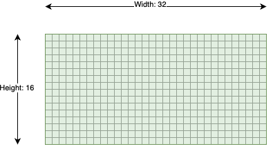
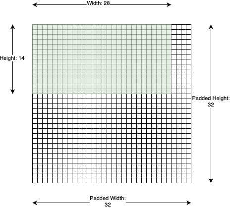
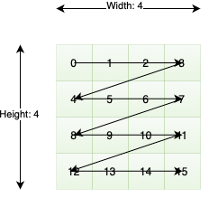
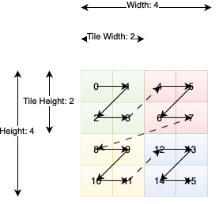
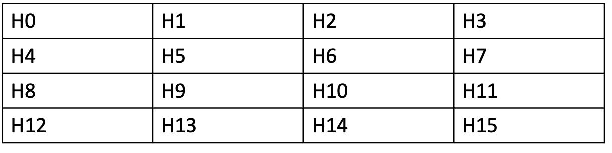
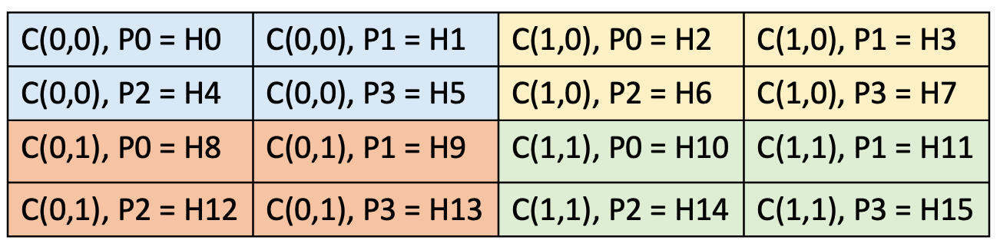

Tensor
######

A :class:`ttnn.Tensor` is a multi-dimensional matrix containing elements of a single data type.

Shape
*****

:class:`ttnn.Tensor` uses :class:`ttnn.Shape` to store its shape.

:class:`ttnn.Shape` can be used to store dimensions for a tensor of rank 1 to rank 8 (inclusive).

:class:`ttnn.Shape` stores the shape of both the actual data and the data padded to tile dimensions. Which can be different due to hardware requirements.

:class:`ttnn.Shape([16, 32])` is a shape of 2D tensor with 16 rows and 32 columns. Where the number of actual rows and columns is 16 and 32 respectively.
And the padded dimensions match the actual dimensions. The tensor of this shape has 16 * 32 elements in the storage.

    Tensor with 16 rows and 32 columns.

Printing the shape would show the actual shape:

.. code-block:: python

    >>> print(ttnn.Shape([16, 32]))
    ttnn.Shape([16, 32])

:class:`ttnn.Shape([14, 28], [32, 32])` is a shape of 2D tensor with 14 rows and 28 columns.
Where the number of actual rows and columns is 14 and 28 respectively and the number of padded rows and columns is 32 and 32 respectively.
The tensor of this shape has 32 * 32 elements in the storage.

    Tensor with 14 rows and 28 columns and padded to 32x32 tile.

Printing the shape would show the actual shape with the padded shape next to it in the square brackets:

.. code-block:: python

    >>> print(ttnn.Shape([14, 28], [32, 32]))
    ttnn.Shape([14[32], 28[32]])

Shape with tile padding can be obtained by calling `with_tile_padding()` method of :class:`ttnn.Shape`

.. code-block:: python

    >>> print(ttnn.Shape([14, 28], [32, 32]).with_tile_padding())
    ttnn.Shape([32, 32])

.. _ttnn.Layout:

Layout
******

.. _ttnn.ROW_MAJOR_LAYOUT:

**ttnn.ROW_MAJOR_LAYOUT**

Row major layout has the consecutive elements of a row next to each other.

    4x4 tensor with a row-major layout.

.. _ttnn.TILE_LAYOUT:

**ttnn.TILE_LAYOUT**

In tile layout, the elements themselves are placed within a 32x32 square called a tile.
The tiles themselves are then still stored in a row-major order. In order to transition to TILE_LAYOUT, :ref:`ttnn.to_layout<ttnn.to_layout>` can be used.
When the height or width of the tensor are not divisible by 32, padding is automatically provided.

    4x4 tensor stored using 2x2 tiles. Note that ttnn Tensors can only have 32x32 tiles. This image is for illustrative purposes only.

.. _ttnn.DataType:

Data Type
*********

ttnn supports the following data types:

- **uint16**
- **uint32**
- **float32**
- **bfloat16**
- **bfloat8_b**

.. note::
    :class:`ttnn.Tensor` uses a minimum of 4 bytes to store a row of the tensor in :ref:`ttnn.ROW_MAJOR_LAYOUT<ttnn.ROW_MAJOR_LAYOUT>` on the device.
    That means that the width of a tensor on the device must be a multiple of `4 / sizeof(dtype)`. The exact numbers are shown below:

    .. list-table:: Required Width Multiples for Data Types
        :widths: 25 25
        :header-rows: 1

        * - Data Type
          - Required Width Multiple
        * - ttnn.uint16
          - 2
        * - ttnn.uint32
          - 1
        * - ttnn.float32
          - 1
        * - ttnn.bfloat16
          - 2
        * - ttnn.bfloat8_b
          - 32 (Special case because the tensor has to be in tile layout)

.. _bfloat8_b_limitations:

Limitation of BFLOAT8_B
***********************

The BFLOAT8_B format utilizes a block-floating point (BFP) representation, where 16 consecutive numbers share a single exponent, determined by the largest value in the group.

This shared exponent introduces specific behaviors and limitations, as observed during operations like reciprocal:

- When the group contains numbers with large magnitude differences, smaller values may be flushed to zero, resulting in inaccurate reciprocal results or numerical instability.
- Inputs with extreme values (e.g., infinities) can dominate the shared exponent, causing other numbers in the group to lose precision or be rounded off to zero.

For inputs that include zero, the reciprocal result is a large constant value: 1.7014118346046923e+38.

.. note::

    - Avoid using the BFLOAT8_B format for operations like reciprocal on datasets with high variance in magnitude or frequent occurrences of zero.
    - Preprocess data to ensure a more uniform distribution of magnitudes within groups of 16.
    - Validate the outputs using higher precision formats when dealing with critical applications.

    The BFLOAT8_B format is optimized for scenarios with homogeneous values across groups but is unsuitable for operations that expand the range, such as reciprocal, due to inherent precision constraints.

.. _ttnn.Storage:

Storage
*******

**OWNED_HOST_STORAGE**

    The buffer of the tensor is on the host and its allocation/deallocation is owned by ttnn.

**BORROWED_HOST_STORAGE**

    The buffer of the tensor is on the host and it was borrowed from ``torch`` / ``numpy`` / an external buffer.

**DEVICE_STORAGE**

    The buffer of the tensor is on a ttnn device. And its allocation/deallocation is owned by ttnn.

Tensor Sharding
***************

Sharding refers to a tensor that is split across a distributed memory space, with that distribution ideally being abstracted away.
Currently we support L1 sharding, which refers to the distribution of a tensor across the L1 memory space of different cores.

Sharded tensors are represented in two dimensions, we compress a higher rank tensor into two-dims by compressing all upper dims in dim 0 and keeping the last dimension the same.
For example a [1,2,3,4] tensor will be represented as a [6,4] 2D tensor before sharding.
Data in a :class:`ttnn.Tensor` is organized in tiles, and these tiles are typically in row-major order.
The size of the tile depends on the :class:`ttnn.Layout` and :class:`ttnn.Shape` of the tensor.
Refer to the section about :ref:`Layout<ttnn.Layout>` to learn more.

**Data Organization on Host**

A sharded tensor's tiles are organized in sharded order on the device which we will highlight with an example.
A tensor is only sharded on device and on the host the tiles remain in row-major order.
Below is an example of a tensor on the host, with each tile labelled.

    A tensor in 4x4 tiles in row-major order. Each tile is 32x32 elements making this tensor 128x128 tensor.

There are a few key attributes that needs to be defined with respect to sharding (specifically in L1):

- **Core Grid**: Represents the cores who's L1 will have a shard of a tensor. Each core will have a single shard.
- **Shard Shape**: The shape in elements of a single shard, this is the subset of the tensor that will be on each core.
- **Sharding Strategy**: Represents how the tensor will be split. Height sharded represents splitting a tensor in rows. Width sharding represents splitting a tensor in columns. Block sharding represents splitting a tensor along a 2D grid.
- **Shard Orientation**: Represents the order of the cores in the 2D shard grid that we read and write our shards to. This can be either row-major or column-major.

**Data Organization on Device**

Now that we know the key attributes and understand how an unsharded 2D tensor looks like.
Lets shard this tensor.
Using the :ref:`ttnn.to_memory_config<ttnn.to_memory_config>` we can take an unsharded host tensor and write it to a sharded device tensor.
In the example below we have a 2x2 core grid, a shard shape of [64,64] ([2,2] in tiles), a sharding strategy of block sharding, and a sharded orientation of row-major.

    A 4x4 (in tiles) tensor sharded across 4 cores. The C(x,y) represents the coordinates (which are in row-major order due to shard orientation). The P<number> represents the tile in each core's L1. The H<number> represents the equivalent row-major unsharded host tensors tiles.

.. _ttnn.MemoryConfig:

Memory Config
*************
**ttnn.DRAM_MEMORY_CONFIG**

    The buffer of the tensor is interleaved and is stored in DRAM.

**ttnn.L1_MEMORY_CONFIG**

    The buffer of the tensor is interleaved and is stored in the the local cache of a core

**ttnn.create_sharded_memory_config**

    The buffer of the tensor is sharded (physically distributed). Currently the tensor can only be physically distributed across different cores' L1.
    Use :ref:`ttnn.create_sharded_memory_config<ttnn.create_sharded_memory_config>` to create a sharded memory config.

APIs
****

.. autoclass:: ttnn.Shape
    :members:
    :undoc-members:
    :show-inheritance:
    :inherited-members:
    :exclude-members: value
