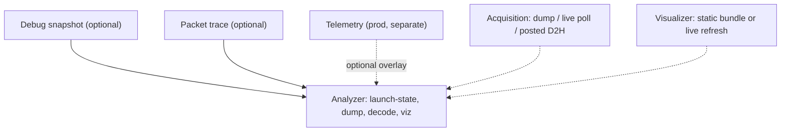
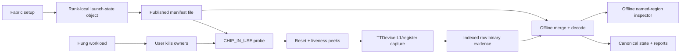

# Fabric Debug Infrastructure Design
Status: architecture is analyzer + optional debug snapshot + optional packet trace; telemetry stays a separate prod view.
Implementation milestone 1 (internal name **V0**): kill-then-collect analyzer over production ERISC L1.
Initial qualification target: Blackhole
Companion reference: [`fabric_architecture_overview.md`](fabric_architecture_overview.md)

**V0** in this document is a tracking name for milestone 1, not a permanent product mode.
Once the analyzer ships, dump/decode/viz are shared by every later region (debug counters, scratchpad, connection-event rings, packet-trace rings).
Do not read “V0” as a peer of packet trace.

Locked product constraints (later sections do not relax these):
- **V0 acquisition** is kill-then-collect after the user kills host owners. It is not owner polling or live sideband attach. As a leading default, the collector peeks one shared hardcoded heartbeat word per selected Ethernet core **3 times, 1 s apart** before the L1 image (§3.5, §6.1); that is still post-kill UMD peek, not a live Metal attach.
- **Launch-manifest file** is env-var opt-in and **off by default**. Kill-then-collect needs that file; a hang on a job that never set the env var cannot be dumped this way.
- **Debug-snapshot leftover** is allocator-owned. Default does not steal the mesh spare-slot gift. Insufficient leftover produces warnings and `requested vs effective`, not automatic slot cuts. An optional env var may disable that gift (§4.4).

## 1. Purpose and users
### 1.1 Purpose
This document defines one fabric-debug architecture: a dump analyzer plus optional router instrumentation.
It is intended to guide implementation without making users learn physical core coordinates, L1 layouts, stream IDs, or router compile-time arguments.

It diagnoses hung or misbehaving fabric after init/setup has succeeded (`READY_FOR_TRAFFIC`) and the workload has launched.
Milestone 1 does that by capturing device state after the host owners are killed, not by polling a live Metal process.
Routers may still be executing on device; the dump is post-kill salvage, not a coherent hang-time snapshot.
Discovery, routing-table configuration, compile, handshake, and `READY_FOR_TRAFFIC` failures
remain with existing control-plane and [`FabricFirmwareInitializer`](tt_metal/impl/device/firmware/fabric_firmware_initializer.cpp) logging.
Tensix extensions (mux, relay, UDM) are out of scope for now; the first analyzer is ERISC-router L1 and overlay registers only.

This document is not a delivery schedule.
Instrumentation modes are optional compile-in depth, not a required build order.
Packet tracing does not need debug-snapshot counters first if kernel, L1, egress, and perturbation budgets are admitted.

### 1.2 Users
**Non-fabric first responders** need a fabric-wide capture and ranked observations without knowing:
- physical chip IDs or Ethernet coordinates;
- L1 addresses or stream-register indices;
- router compile arguments; or
- ERISC TX/RX ownership.

**Fabric developers** need raw bytes, exact configuration, timing, loss, consistency, and provenance
so later decoders can reinterpret evidence.

**Automation and health systems** need stable machine-readable schemas, explicit confidence, and distinct:
- unhealthy;
- unreadable;
- unsupported;
- stale;
- inconsistent; and
- unknown states.

### 1.3 Target workflows
The analyzer does **not** cover fabric launch or setup failure
(topology mapping, Ethernet reservation, compile, router handshake, `READY_FOR_TRAFFIC`).
Those paths already log through the control plane and firmware initializer.

Tensix extensions (mux, relay, UDM) are out of scope for now.
The launch snapshot may still record the Tensix mode flag so a mux-enabled run is labeled, not silently treated as ERISC-only.

#### Runtime hang or backpressure
Infrastructure target (instrumentation may add fields):
- expected route or multicast traversal and paired endpoint state;
- sender/receiver queue and pointer state;
- acknowledgements, completions, credits, and free slots;
- last-progress and blocked-reason indicators;
- ERISC router state; and
- capture timing, skew, and consistency.

**Milestone 1** can show whatever of that already lives in dumped ERISC L1, HAL-fixed
regions, overlay/stream registers, and L1 credit counters, plus capture
timing/status. It does not add blocked-reason history, source intent, or a
coherent failure-time snapshot.

#### Incorrect routing or delivery
Infrastructure target:
- source intent and expected route/tree;
- observed forwarding/local-delivery actions;
- router direction/channel mapping;
- selected header fields or invalid-header evidence;
- local versus forwarded completion state; and
- invalid-route or first-fault reason.

**Milestone 1** can dump direction/channel mapping, device routing tables (including
multicast path blobs in L1), occupancy-aware channel buffer slots (header/payload slices), and paired endpoint
L1. Source intent, per-packet forwarding actions, and packet-identified
completion need packet trace (and/or debug counters). Channel-slot bytes remain inspectable
salvage, not a coherent packet trace.

#### Performance regression
Infrastructure target:
- bandwidth and active/total-cycle deltas;
- queue occupancy or starvation indicators;
- code-region profiling where enabled;
- instrumentation mode and measured overhead; and
- comparable build, topology, and runtime configuration.

**Milestone 1** can overlay occupancy and any already-enabled telemetry/profiling slices
in the dump. It does not enable profiling or promise cycle-accurate deltas.

#### Post-mortem escalation
Captures must remain useful after workload exit or loss of progress.
They include raw device bytes, decoded output, topology, versions, collection failures,
and enough metadata to reproduce decoder interpretation.

## 2. Architecture
### 2.1 Layers (not a build pyramid)
```text
Telemetry            prod router view; do not grow for debug; viz may overlay
Analyzer (always)    launch-state, dump, decode, reports, visualizer
Instrumentation      optional compile-in; still parsed by the analyzer
  Debug snapshot       leftover-only tiers: core counters (incl. extrema),
                       optional duration blob, optional connection-event ring,
                       plus a developer scratchpad
  Packet trace         per-packet identity + action; ERISC local banks;
                       intended drain is posted D2H (optional tensix/DRAM pump);
                       dump of banks is fallback, not the feature
Acquisition / viz    orthogonal bindings: static dump (default) or live poll/display (option)
```



What the router **writes** is not the same as how the host **gets** or **shows** it.
Default capture for the analyzer L1 path is a static dump.
Live display is an admitted option. Debug-snapshot counters may use owner poll.
**Packet trace** is intended as a streamed drain (posted D2H, optional tensix/DRAM/DRISC pump), not UMD L1 peek (§5.2).
Dump of ERISC banks is fallback/salvage, not the packet-trace product.
If live drain is infeasible or too hot, fall back to dump.

Expert tools (DPRINT, watcher, assertions, custom probes) are adjacent; they may attach to the same artifacts and inspector.

### 2.2 Telemetry boundary
[`FabricTelemetry`](tt_metal/hw/inc/hostdev/fabric_telemetry_msgs.h) is the production health surface:
safe, compact, low-cardinality, balanced against router hot-path cost.
**Do not extend it for debug** (no extra per-VC drop reasons, connection history, or packet identity).

The analyzer may dump the existing HAL-fixed telemetry region because it is already in L1.
The visualizer may show it as a sibling provider.
Enablement, schema, and cadence stay separate from debug snapshot and packet trace.

Detailed limitations (torn dual-ERISC updates, init `memset`, copied `router_state`) are Appendix D.
They explain why telemetry is not the debug ABI; they are not a feature list for debug.

### 2.3 Routing authority and identity
Fabric remains authoritative for expected routing.
Control-plane queries supply unicast paths (`get_fabric_route`,
`get_forwarding_direction`).
Multicast traversal is **not** fully exposed as rich host queries;
captured device routing tables and L1 path blobs (`routing_l1_info_t`,
`intra_mesh_routing_path_t`) may be required.
Debug code must not reproduce routing algorithms or packet-header bit manipulation.
Observed paths are evidence.
Source-intent, expected-traversal, and observation mismatches are reported rather than guessed away.

Users select semantic fabric nodes, worker connections, routes, links/directions/channels/VCs, or packets/sessions.
The launch-state / manifest resolves them to physical chips, cores, registers, buffers, writers, and schemas.
Host-local chip IDs address devices; stable ASIC/fabric identity merges results.

### 2.4 Invariants
1. **Unknown is not failed.** Unsupported, disabled, stale, inconsistent, unreadable, reset, unhealthy, and unknown remain distinct.
2. **Raw evidence survives decoding.** Unknown fields and undecoded bytes remain available.
3. **No silent degradation.** Requested/effective configurations, fallback reasons, and accounting are recorded.
4. **Collection failure is evidence.** Missing routers, short reads, reset cores, and timeouts are explicit.
5. **Every structure is versioned.** Lengths, units, widths, validity, reset/discontinuity, and generation are defined.
6. **Topology accompanies every result.** Coordinates alone are insufficient.
7. **Capabilities, enabled state, and validity are separate.** Allocation does not prove activity.
8. **Normal workflows are allowlisted.** No arbitrary-address access is required.
9. **Capture cost is bounded and measured.** Admit L1, instructions, reads, duration, rate, and storage.
10. **Debug and recovery control are separate.** Diagnosis does not authorize pause, drain, retrain, reset, or termination.
11. **Fabric-wide capture is coordinated, not claimed atomic.**
12. **Disabled instrumentation is genuinely cheap.** Packet-hot-path compile-out remains available.

## 3. Analyzer (always)
The analyzer is launch-state + allowlisted capture + decode + reports + visualizer.
Every later named region (debug counters, connection-event ring, packet-trace ring) is another slice of the same map.
There is no second parser or second inspector.

### 3.1 Contract family
First versions include:
- launch-state object and optional machine-readable manifest snapshot;
- provider/schema descriptors;
- identity and target resolution;
- artifact indexes and status/consistency/checksums;
- rank-local commit/merge;
- decoded state, reports, and static visualization.

Later instrumentation adds providers, session bindings, controls, frames, events, generations, and loss metadata.
They extend these contracts; they do not fork artifact or decoder architectures.
Rule packs, saved/user-defined compare sessions, live refresh, and packet histories are
post-M1 analyzer extensions over the same contracts.

A request may select instrumentation and refine providers, selectors, budgets, backend, transport, triggers, and loss policy.
Admission resolves it against actual resources. Both forms are published:
```text
requested: packet_trace
effective: analyzer dump of production L1
reason: trace L1 reservation unavailable
```
Unavailable required features fail.
Optional features degrade only under explicit policy, with reasons and accounting.

### 3.2 Launch-state object and manifest
The canonical record is a rank-local **launch-state object** (leading name `FabricDebugLaunchState`).
Ownership is `ControlPlane` → `FabricContext` → launch-state object, the same nesting as
[`FabricBuilderContext`](tt_metal/fabric/fabric_builder_context.hpp):
`ControlPlane` owns `FabricContext`; `FabricContext` owns the object as a member
(same shape as `builder_context_`).
It is **not** a new immutable topology API on `FabricContext`, and it is **not** owned by
`MetalContext`. `MetalContext` outlives fabric generations (`set_fabric_config` can
`teardown_fabric_config` and re-init); putting launch-state there would invite history.
Active generation only: once [`ControlPlane::clear_fabric_context`](tt_metal/fabric/control_plane.cpp)
destroys `FabricContext`, the object is reconstructed with the next generation. Destruction can be
deferred while devices remain open; `set_fabric_config(DISABLED)` does not always clear it immediately.
There is no previous-generation archive.

The object caches copied, serializable snapshots as fabric setup proceeds.
It does not hold live pointers into `ControlPlane`, `FabricContext`, or `FabricEriscDatamoverConfig`.
Host routing tables, when added, are **copied** onto this object after
`configure_routing_tables_for_fabric_ethernet_channels`. Those copies are unicast
control-plane decisions; they do not invert routing authority and do not replace
captured device tables for multicast.

The on-disk launch manifest is one serialization of that object.
Kill-then-collect uses only the file (the in-memory object is gone after kill).
In-process consumers (owner polling, host tests) query the object directly
and do not require a file.
Object schema and file schema are the same records; there is no second dialect.

File publication is **opt-in**, gated behind an environment variable that names a run-artifact directory.
The exact name is open. Publication is **not** on by default.
Env var unset: the in-memory object may still fill for in-process use; **no file** is written.
Kill-then-collect (§6.1) uses only the file, so a hang on a job that never set the env var cannot be dumped this way.
An explicitly invalid destination fails setup.
Publication must not expose a partially committed manifest or let concurrent launches clobber one another.
Exact artifact identifiers, paths, and publication/commit protocol remain implementation-contract open.

The object records configuration and **region-tree** authority, not captured device state.
It is the memory map: collectors choose reads; decoders parse bytes; the visualizer groups L1 without showing addresses.
Offline tools never depend on transient builders, compile-argument positions, or inferred layouts.
New debug counters, connection-event rings, and packet-trace buffers appear as additional named regions
with schemas; they do not fork the inspector.

Fill order matches init:

```text
topology mapper ready
  → record topology + checksums of existing generated/fabric mappings
FabricContext constructed
  → record fabric_packet_spec (header family, sizes, ROUTING_MODE defines)
configure_routing_tables_for_fabric_ethernet_channels
  → record host routing tables          # later; not milestone-1-required
parallel compile_fabric() per device
  → record_device(asic, routers, region tree)   # chip-private; mutex only for internment
join (same thread that then configure_fabric)
  → intern layout_catalog; mark layout_complete
FabricFirmwareInitializer::configure()
  → wait_for_fabric_router_sync succeeds; mark traffic_ready/publication_complete
  → if publication is enabled, publish the manifest
```

[`FabricFirmwareInitializer::compile_and_configure_fabric`](tt_metal/impl/device/firmware/fabric_firmware_initializer.cpp)
already compiles devices concurrently via `detail::async`.
Compile workers must not serialize the rank file.
They may only call `record_device` with a chip-private payload,
the same isolation as `num_initialized_routers_[chip_id]`.
Layout internment is locked or deferred until join.

The object may fill during setup; that is not a diagnosis of a failed launch.
If setup never succeeds, the analyzer does not apply and existing initializer logs remain the record.

When the env var is set, publish the file **once only after
`FabricFirmwareInitializer::configure()` and `wait_for_fabric_router_sync` succeed**, when the workload can run.
Compile, `configure_fabric`, layout internment, or `layout_complete` alone are insufficient.
Do not serialize a “ready” snapshot before handshake/`READY_FOR_TRAFFIC` succeeds.
Do not write the file when the env var is unset.

Packet-header family, 1D extension words or 2D route-buffer size, header size,
max payload, and channel-buffer/slot stride live once under `fabric_context`.
They are launch-time `FabricContext` decisions, common to every router on the rank,
not per-`layout_id` and not kernel runtime.

Snapshot contents (leading, not a frozen ABI):
```text
schema major/minor
launch: launch_id, time, rank, world, host, build, publication completeness
topology: fabric_config, architecture, local nodes (asic, FabricNodeId, host-local chip),
          checksums/paths of generated/fabric mapping files
fabric_context: topology, ROUTING_MODE, tensix/udm/erisc, packet spec and kernel defines
host_routing: omitted | expected direction/channel/peer and route-query results
hal: UNRESERVED interval and fixed-provider bases/sizes
layout_catalog: interned region trees keyed by layout_id,
                including resolved overlay stream-register allowlists (read-safe only)
                fixed_l1 liveness provider, and leftover debug regions
debug_snapshot: requested/effective tier, fabric-wide-min leftover, spare-slot donation on/off,
                warning if counters omitted
routers: instance rows binding (asic, FabricNodeId, eth_channel) to layout_id
         plus peer, direction, master role, logical/translated coords, ERISC ownership,
         PCI device id, and translated/logical coords for device reads
```

Exact on-disk spelling of the C++ type name is open.
Assemble must include launch, topology, fabric_context, hal, layout_catalog, and routers.
`host_routing` may be `omitted`.
`debug_snapshot` is omitted when debug instrumentation is off; when present it records requested/effective tier and donation on/off.
Device `routing_l1_info_t` (and L1 routing-path blobs) are observed capture, not launch state.

### 3.3 Region tree
Treat the `UNRESERVED` sweep as a router core image: retain the bytes, interpret them later.
Channel rings, including packet headers and payloads, are most of that image and are in-scope for inspection.

Users never supply or read addresses.
The visualizer groups L1 by named regions exported from finalized
[`FabricEriscDatamoverConfig`](tt_metal/fabric/erisc_datamover_builder.hpp)
and HAL, not by reconstructing compile-argument positions.
It is inspection of captured router state, not diagnosis.
YAML/Markdown reports remain siblings and may rank observations;
the inspector must not promote torn or free-slot bytes into root cause.

The builder is a bump allocator plus a channel-buffer split.
Do **not** extend [`FabricRouterDiagnosticBufferMap`](tt_metal/fabric/erisc_datamover_builder.hpp)
into the debug ABI. That type is the telemetry/instrumentation view:
three `{address, size}` slots (legacy 32-byte perf buffer, code profiling, trimming)
used by trimming export and tests. On BH the performance slot is always allocated and therefore
address ≠ 0 is not enablement; code profiling and trimming remain conditional.

Debug uses a **separate** region-tree type (leading name `FabricRouterDebugLayout`)
produced from the same finalized [`FabricEriscDatamoverConfig`](tt_metal/fabric/erisc_datamover_builder.hpp)
and channel allocator, plus HAL-fixed and overlay siblings.
Same producer, two views. Launch-state, collector, and visualizer consume only the debug layout.
They must not call `get_telemetry_and_metadata_buffer_map()` and infer the rest.
Addresses are generated from the allocation walk so the two views cannot drift
from a second handwritten table.

The three diagnostic buffers appear as rows under a `diagnostics` parent in the debug tree;
they are not the tree. HAL `FabricTelemetry` (160 bytes on Blackhole) is a HAL-fixed sibling,
not an entry in `FabricRouterDiagnosticBufferMap`.
On Blackhole, the 32-byte performance region is always reserved at the **front** of the
builder allocation, starting at the `UNRESERVED` base. It is not leftover, and its reservation
does not prove that performance telemetry is enabled.

Publication emits the debug layout at finalize time.
Identical layouts intern under a `layout_id`; each router binds identity, peer, role,
and that id. Control blocks may be reserved for max sender channels while rings exist
only for used channels. Unused-but-allocated regions and alignment gaps are named
`unused` or `padding`, not live channels and not collection failures.

Regions inside `UNRESERVED` are **slices of one sweep**, not extra device reads.
HAL-fixed telemetry/routing and overlay stream/link registers are **sibling backings**
with their own reads. Tensix mux/relay/UDM are out of scope for now.
When later admitted, they are another producer’s region tree in the same inspector, not ERISC L1.

Slot overlay is occupancy-aware. The **named type** is the channel’s buffer ring
(`count`, `stride = channel_buffer_size`), not packet-header fields and not payload fields.

Each slot is two slices from `fabric_context.packet` (header family and size; stride is
channel-buffer size). Rings do not store a second `PACKET_HEADER_TYPE`.

```text
[0, header_size)              header
[header_size, slot_stride)    payload
```

- **occupied:** pointers/streams say the slot is live; classify the header/payload split as live,
  but do not decode or display payload by default;
- **free/stale:** prior packet bytes may remain; do not present as live;
- **in-flight/torn:** pre/post movement or dual-ERISC writers make the slot unknown;
- **unknown:** missing pointers, short reads, or reset.

Decode applies the debug layout: every named region the builder/HAL/overlay tree records
is sliced and presented by that region’s schema
(lifecycle, telemetry, stream/link registers, channel control, occupancy-aware
channel buffer slots, diagnostics, unused/padding, later debug counters, scratchpad, and rings).
The full `UNRESERVED` raw image necessarily captures channel payload bytes.
By default, payload is not decoded, displayed, reported, or exported as a separate artifact;
it is available only through an on-demand expert raw view and is not a coherent packet trace.
Later redaction policy remains open.
A display-only header-bit overlay may exist later. It does not enter the named-field catalogue
unless selected fields are explicitly promoted.

Leading region record (not a frozen ABI):
```text
id, parent, source (hal | builder | channel_allocator | overlay)
backing (unreserved_l1 | fixed_l1 | stream_reg | link_reg)
allocated / enabled / valid
writer
address, size [, count, stride]
schema / decoder
```
Ring overlay uses `fabric_context.packet` (header family and size, slot stride = channel_buffer_size).
Routers bind `(asic_id, FabricNodeId, Ethernet channel)` to a `layout_id` plus instance fields.

### 3.4 Provider descriptors
Each descriptor contains:
- provider name and schema major/minor;
- producer type and writer identity;
- architecture and build association;
- supported, enabled, and valid capabilities;
- allocated versus used versus valid (allocation does not prove a live channel);
- grouping parent for visualization (lifecycle, per-sender, per-receiver, diagnostics, HAL-fixed, overlay);
- target/address resolution and allocation source (`hal`, `builder`, `channel_allocator`, `overlay`);
- backing store (`unreserved_l1` slice, separate fixed read, stream/register file, later host chunk);
- address, size, count, and stride;
- slot count/stride where the region is a ring; each slot is a header/payload slice using the fabric-wide packet spec, not named header/payload field types;
- **field catalogue:** stable field id, type, grouping parent, optional enum-table id; its layout distinguishes worker connection/stream state, single-TXQ Ethernet response credits in stream registers, and Blackhole multi-TXQ/dual-ERISC packed L1 ACK/completion counters. Stream free-slot state can coexist with those counters; backing is configuration-specific. This identified name set is what the later rule pack validates against (§3.7);
- **enum tables:** versioned name/value maps exported from host/device headers (`EDMStatus`, `RouterState`, `RouterCommand`, connection unused/open/close_request, occupancy, capture status). Use the device enums, not the public telemetry 0–3 `Standby/Active` mapping;
- **instance validity:** `ok | unknown | unreadable | torn` on each decoded instance so a missing/torn value is not a successful match;
- consistency method, generation, expected cost, and safe-read restrictions;
- decoder identity; and
- loss/reset/clock/discontinuity semantics.

Providers may cover lifecycle/status, telemetry, stream/link registers, routing tables,
debug snapshot counters, developer scratchpad, connection-event rings, packet-trace rings,
profiling, trimming, and later mux/relay state.

### 3.5 `UNRESERVED` interval and sibling reads
The L1 sweep is:
```text
[HAL ACTIVE_ETH UNRESERVED base,
 HAL ACTIVE_ETH UNRESERVED base + HAL ACTIVE_ETH UNRESERVED size)
```
The active HAL supplies and the manifest persists both values;
collectors never re-derive them.
On Blackhole, host access to every chip is PCIe/MMIO.
The analyzer does not read remote chips through Ethernet tunnels.
On Blackhole, `UNRESERVED` intentionally ends at `MEM_ERISC_MAX_SIZE`.
It does not sweep all 512 KiB or firmware/binary space merely because it is physically present.

Builder lifecycle words, diagnostic buffers, channel rings, L1 credit counters,
and later debug-snapshot / scratchpad / trace regions live **inside** this interval
when they were allocated (debug snapshot and scratchpad only from post-channel leftover; §4.4).
The dump collector reads the interval once per selected router.
The manifest names sub-regions as slices of that blob.

Allowlisted providers **outside** the interval are separately read:
- fabric telemetry and postcode bytes;
- the shared fixed-L1 router-liveness word;
- routing-table state (`routing_l1_info_t` and multicast path blobs where present);
- read-safe link, training, PCS, mailbox, and reset evidence; and
- configuration-specific stream registers.

The credit decoder cannot use a coarse worker=L1 / Ethernet=stream rule.
It must distinguish worker connection/stream state, single-TXQ Ethernet response credits
backed by stream registers, and Blackhole multi-TXQ/dual-ERISC packed L1 ACK/completion counters.
Stream free-slot state may coexist with the packed counters; the backing is configuration-specific
and comes from the finalized layout.

`EDMStatus`, synchronization, termination, and builder-declared performance,
profiling, and trimming regions are not extra L1 sweeps;
they are named slices of `UNRESERVED`.

Builder-relative addresses come from finalized configuration, never compile-argument positions.
Stream IDs 30/31 carry active configuration meanings, not unconditional labels.
Do not include increment-on-write registers such as `BUF_SPACE_UPDATE`.
Allocation does not imply enablement.

Typical dump recipe per selected router:
1. **Reset / mailbox / status before the image.** `TTDevice::get_risc_reset_state`; if asserted, do not treat L1 as a live kernel (still dump bytes, label the core). Then `EDMStatus` magic, termination-signal word, Metal `go_messages` (`RUN_MSG_GO` vs `RUN_MSG_DONE`). Syseng `ETH_FW_MAILBOX` is Ethernet firmware, not fabric-kernel liveness. `RUN_MSG_DONE` is `0` and collides with a wiped mailbox — read it only after reset is clear and `EDMStatus` still looks like a device enum.
2. **Liveness samples** of the allowlisted shared fixed-L1 word (§3.7), captured in `liveness_samples.yaml`. Leading default: **3 peeks, 1 s apart** (configurable). Do this **before** the full `UNRESERVED` sweep, not as a second dump of the image. Occupancy may drain during this window; that is already salvage. One sample round peeks each selected Ethernet core/router once, then waits; do not serialize a full cadence per router.
3. allowlisted stream registers immediately before provider reads;
4. the complete declared `UNRESERVED` interval;
5. every declared fixed provider outside it;
6. the same stream registers immediately afterward; and
7. remaining reset/read/link evidence (read status; optional AICLK vs idle as provenance).

Killing the host process does **not** write the fabric termination signal. That word is `close_device` / teardown. The common V0 hang dump is still `READY_FOR_TRAFFIC` with routers spinning. `TERMINATED` means orderly kernel exit, not “user SIGKILL.”

Live poll of a **subset** of that allowlist (telemetry-sized, or named debug counters only) is an acquisition option, not a second region tree. The V0 liveness peeks are a bounded prefix of kill-then-collect, not that live-poll option.

### 3.6 Artifacts and identity
Every raw read or stream chunk records capture/session/producer generation, stable and host-local target identity, provider/schema/decoder identity, source address and size, collector/backend identity, start/end time, read order, retries, requested/returned size, read/reset/consistency/stale status, sequence/loss/wrap/validation metadata, checksum, and launch/session manifest references.

Device bytes remain unchanged.
Metadata is YAML; raw structures and registers remain binary.

Router merge identity is:
```text
(stable ASIC ID, FabricNodeId, Ethernet channel)
```
Local chip ID is acquisition provenance, not a global key.
Duplicates retain provenance; conflicts are reported.

The bundle contains a capture index, rank-local launch manifests and commits, per-target raw
`UNRESERVED`/fixed-provider/register/liveness evidence, decoded state, and merged reports.
Exact artifact IDs, directory paths, filenames, and rank-local commit protocol remain open.
These invariants do not:
- every raw file is independently indexed;
- index records backend, target, schema, address/size, time, status, consistency, and checksum;
- manifest/decoded state bind by launch identity, versions, and checksums;
- partial files, unreadable routers, reset cores, stale manifests, and mismatches remain explicit;
- raw bytes survive absent/failed decoding;
- incompatible major versions are rejected, not guessed;
- commits are rank-local and collective-free; and
- host storage marks committed boundaries.

### 3.7 Decode and reports
Offline merge and decode are one process, no MPI, and need no device.
Copied launch manifests supply the region tree.
The canonical decoded-state artifact contains observed overlays and derived fields.
Raw files remain the core image; the decoder slices them by the tree.

Initial reports include coverage/missing/mismatch, topology and neighbor context, lifecycle/synchronization/telemetry, declared pointers and connection state, credits/ACKs/completions/free slots, pre/post registers and skew, expected-versus-observed endpoint/peer relationships available from launch state plus captured device tables, confidence/consistency/reset/unsupported/missing labels, and raw references.
Full expected-route comparison is available only when host-routing authority was captured;
otherwise it is marked unavailable/unknown and routes are not inferred.

Reports are observations and invariant violations before possible causes.
They never turn torn/incomplete evidence into definitive diagnosis.
Reports are siblings of the visualizer, not its input schema.

Static occupancy in one `UNRESERVED` blob cannot tell idle-healthy from hung-backpressure.
Pre/post stream registers show only movement **during** the image copy (capture skew).
Router **liveness evidence** (shared-word samples vs reset vs exited) is a separate probe, taken before that image.

#### Router liveness
Liveness is not a single snapshot property. Host kill is not an ERISC kill. The existing
hardcoded location is one shared word per active Ethernet core/router, not an independently
readable word per ERISC. A **static** sample means no observed shared-word progress during the
bounded sampling window, not “the RISC is halted.”

Check in order:

1. **Hardware reset** (`get_risc_reset_state`). If asserted: skip occupancy decode; L1 may be zero/junk.
2. **`EDMStatus` magic** (`READY_FOR_TRAFFIC` `0xA3B3C3D3`, `TERMINATED` `0xA4B4C4D4`, handshake/init postcodes). Zero or a non-enum value is wiped or never-ran, not a quiet healthy kernel.
3. **Termination-signal word.** Set + `TERMINATED`: orderly exit. Set + still `READY`: teardown stuck. Unset + `READY`: V0 kill without `close_device`.
4. **Metal `go_messages`.** `RUN_MSG_GO` vs `RUN_MSG_DONE`, only after reset is clear. Do not treat `0` as done if `EDMStatus` is also zero.
5. **Shared fixed-L1 heartbeat**, sampled **3 times, 1 s apart as a leading default** (N and gap configurable) before the image.

**Do not use telemetry TX/RX heartbeats as that tick.** They increment only on progress or idle-empty (`tx_progress || sender_idle`). A backpressured router with occupied slots and no TX progress **does not** tick while still in the main loop — the hang first responders care about. They are compile-gated, dual-ERISC-torn, and are not the debug ABI (Appendix D). `elapsed_cycles` is closer but the same gates and still updates only after the inner burst returns.

Production fabric loops write `0xDCBA0000 | counter` every 64 iterations at a hardcoded
L1 address in [`fabric_erisc_router.cpp`](tt_metal/fabric/impl/kernels/edm_fabric/fabric_erisc_router.cpp):
BH `0x7CC70`, WH `0x1F80`. On BH, `0x7CC70` aliases
`eth_status_t.heartbeat[0]`; both fabric ERISCs share/write the same L1 location, and Ethernet
firmware may own/write it during context switching. WH `0x1F80` is likewise outside
`UNRESERVED`. V0 models this as an allowlisted `fixed_l1` sibling and captures it in
`liveness_samples.yaml`, not as an `UNRESERVED` slice.

A changing value in the `0xDCBA` form is evidence that at least one fabric-loop writer advanced,
but it cannot distinguish TX from RX ERISC. Other value formats or movement may be Ethernet
firmware activity and must be labeled as such. A static value is only “no observed shared-word
progress” during the sample window. Independent per-ERISC liveness requires new instrumentation
later and is not V0.

The shared heartbeat and telemetry TX/RX progress remain separate catalogue fields.
A later rule may rank “no observed shared-word progress” after reset/wipe are excluded;
it must not call that “RISC halted.”

Coverage holes (missing rank evidence, unreadable/reset cores, stale manifests) are already this section’s report output and a reason a finding is `unknown`. They are not a separate hints product. `CHIP_IN_USE` abort and a missing launch-manifest file never produce a dump to inspect.

#### Rule pack (post-M1 analyzer extension)
Rule-pack evaluation is not required for milestone 1. It remains a data-driven extension
to the shared analyzer unless explicitly pulled into a later milestone revision.

Hints are **conservation predicates** over decoded named fields, not a healthy-busy occupancy model and not hardcoded checks in the analyzer.

The useful healthy state is **silent / ledger-closed**: no error branches, and every credit / ack / connect ledger is closed — or exactly one live worker connection. Idle-healthy, busy-healthy, and hung-backpressure can look the same in one occupancy snapshot; do not invert the catalogue into “perfectly healthy field values.”

Two classes:

- **`never`:** always a violation when it fires, including mid-traffic. Unexpected `switch` / invalid opcode / `is_valid` failure (`count + last_code` when snapshot T1 exists). Out-of-range pointers. Connection word not in `{unused, open, close_request}`. Handshake neighbor mesh/device ≠ launch-state Ethernet peer.
- **`quiescent`:** true violations only when the dump claimed idle (drain / close / user-asserted silence). On a hang of a launched workload they are ranked “still in flight” observations, not auto-called root cause. Credits returned (`free_slots == depth` on used send and recv, both ends of a peer pair). Unprocessed first-level acks and completions == 0 when that ledger is compiled in and is not the same backing as slot credits (`ENABLE_FIRST_LEVEL_ACK_*`). Worker connect/disconnect counts balance, or handshake still `open`. Handshake `close_request` is not silent.

Two silent substates, both healthy: **disconnected-idle** (`opens == closes`, handshake unused) and **connected-idle** (`opens == closes + 1`, handshake open). A live hang is usually connected and not idle: the connect ledger holds, the credit/ack ledgers do not, and those failures are the first-responder ranking.

Unexpected-drop `never` covers some header corruption (opcodes that hit `default`). Legal-looking wrong dest / extra hop is the packet-tab join, not this pack. Production L1 has no leftover drop counter until T1; the idea is the invariant, the manifestation is the named field when it exists.

The analyzer is a **predicate engine**. It does not hardcode fabric field names or “if `EDMStatus`.” Decode remains fabric-specific (bytes → named instances). Rules are data.

Rule pack (leading shape, not a frozen ABI):
```text
id, schema_min/max, enabled
class: never | quiescent
requires: field ids and/or capabilities
forall: schema grain (router, used channel, worker channel, peer pair)
expect: comparisons over catalogue fields (same comparators as search)
```

Boolean `all_of` / `any_of` is enough. No arithmetic, routing, plugins, or diagnosis text in rules. If a check needs `opens - closes`, publish a **derived named field** in the schema; the engine only compares. Packet-tab exception-first is a **second pack** over history instances (`packet_id` grain), not extra router-catalogue rows.

Reports record the identity, version, and hash of the rule pack used. Re-running a newer
pack is an explicit reinterpretation that produces distinguishable/new findings.
An optional overlay may add, replace, or disable rules by id and still validates all-or-nothing.

Two name sets:

1. **Canonical** — field catalogue, identity keys, grains, capabilities, enum tables from provider schema. Every name a rule mentions must be in this set.
2. **Dump** — the subset this launch-state allocated/enabled (T0 vs T1, acks compiled out, unused channels).

Unknown id (typo, junk, comparator the engine does not have) → **reject the pack or overlay**; do not start view. Known id absent on this dump → **skip** that rule. Torn/unreadable/missing peer on a referenced instance → `unknown`, not a value match. Overlay merge is all-or-nothing: invalid overlay fails loud, no half-apply.

Load validation (CI on the in-tree pack; again on overlay at `view`): unique `id`, `class` and `forall` in the schema’s sets, only search comparators, enum tokens in that field’s table, and caps on rule count, predicates per rule, and `any_of` depth so a junk overlay cannot explode the engine. Semantic mistakes with valid names (`free_slots == 0` as `never`) are pack review, not an analyzer special case.

Findings: rule `id`, grain instances, `ok | violation | unknown`, skip/unknown reason. The visualizer lists them and apply-as-filter is the existing named-field search (pair findings open compare on that peer set). HTML does not own the rules.

### 3.8 Visualizer
This inspector will grow. Later acquisition (live poll, packet-trace stream) and later regions (debug counters, connection events) extend it; they do not fork a second product. Packet trace is a **second tab** in the same inspector, not more rows on the per-router catalogue.

Static vs live is a **session binding**, not a different product:
- **Static (V0 / milestone 1):** collectors write files and exit; the viewer loads one bundle. This is the only V0 acquisition.
- **Live (post-M1 option):** owner poll refreshes decoded fields in the same named-region UI. Feasibility and perturbation are measured; fallback is dump.

The viewer never opens `TTDevice` itself in the static path, never talks MPI, and never waits on hosts.
The decoder holds fabric overlay knowledge; presentation does not. Decoder, server, and
frontend implementation languages remain open.

#### Field catalogue and search (M1)
The viewer is generic. It does not hardcode fabric field names, stream IDs, or enum integers.
New debug counters and connection-event fields appear as additional catalogue rows; the viewer does not change.
Packet-trace records do **not** join this catalogue. They have their own tab and join key (§3.8 packet histories).

Two catalogues:

1. **Schema** (launch-state / provider descriptors): named regions and fields, types, grouping, enum tables, identity keys, peer pairs.
2. **Instances** (canonical decoded state): those fields bound to a router, with value, occupancy class, and validity.

M1 includes static named-region inspection, a field catalogue, basic search/filter over instances,
raw provenance links, and visible coverage/unknown/unreadable/torn labels. Search starts with:

- identity first: `FabricNodeId`, ASIC, Ethernet channel, direction, VC, sender/receiver, peer pair, capture status;
- then named fields: `id` + comparator + value, only if the schema marks the field comparable.

Raw overlay stream indices (including 30/31) are not default search keys. Layout resolves backing; an expert overlay of register indices may exist but is not the catalogue.

**Enums.** The contract exports tables; the viewer maps raw → name for display. Conversion does not replace the raw word in the artifact. Unknown raw → **raw + unknown**, never a nearby name. Tables are versioned with the schema.

**Slots.** Catalogue names are ring-level (`channel`, `slot_index`, occupancy). Header and payload are byte slices of that slot, not named types. Filtering “packets destined to node X” is out of scope for channel-slot salvage.

**Unknown is not a value.** A torn or unreadable instance must not match `free_slots == 0`.

Rule-pack findings (§3.7), when that post-M1 extension exists, are extra rows in this inspector,
not a second UI. The viewer does not load a pack that failed name-set validation.

#### Compare sessions (post-M1 analyzer extension)
Saved or user-defined compare sessions are not required for M1. In this extension, the user may
pick a set of routers (same device, an ad-hoc “path,” or any other grouping) and a set of catalogue
fields, and the viewer pivots those instances into a compare table. The viewer does not resolve
fabric routes, call `get_fabric_route`, or decide which routers belong together.

The set may be a bag or an ordered list (order is display-only, so a user-chosen sequence can read left-to-right). Convenience ways to *build* the set (current search hits, all routers on one ASIC, an Ethernet peer pair) are identity filters; they are not a routing engine.

Compare named fields (credits, pointers, connection, occupancy, lifecycle, later snapshot counters). Do not side-by-side whole `UNRESERVED` blobs or treat `slot[i]` as packet identity across routers. Torn/unreadable cells stay unmatched. The scratchpad `word[i]` mesh table is the same pivot, not a second UI.

#### Packet histories (post-M1 analyzer extension)
The packet-history tab is not required for M1.
Packet trace is not a per-router named-region view. It is a second inspector binding in the same viewer: **join on `packet_id`**, then filter.

The intended acquisition is a **stream** of postcard records from routers (posted D2H, optionally pumped through tensix L1 or DRAM/DRISC). Dump of the ERISC dual-banks is fallback/salvage: the same record schema and the same tab, but only a short tail, so many hops are `unknown`. Kill-then-collect is not the packet-trace product.

Host decoder (not HTML) joins records by `packet_id` (`source_id` + per-source sequence). Router location comes from launch-state / drain map (which ring or host chunk produced the record). Each history is an ordered hop list plus intent/expected route when present, local actions, optional receiver disposition, and loss/cookie flags.

History state (mutually exclusive enough to filter on):
- **in-flight:** expected hops or sink not yet seen; no loss cookie
- **ok:** observed hops and actions match intent/expected route (and sink disposition when that contract exists)
- **violation:** extra hop, missing expected hop while the stream was healthy, wrong action, no sink when identity was still available, invalid-header first-fault, source sequence gap
- **unknown:** wrap/drop/torn bank, missing rank, or incomplete dump-of-banks tail — **not** “vanished”

Default view is **exception-first**: show `violation` (and list `unknown` separately). Collapse or drop `ok` histories after join so they do not dominate the tab or host retention. All-packet capture remains admissible under measurement; lookup of one `packet_id` or one source connection still includes packets that traveled fine. That exception-first filter is a **second rule pack** over history instances, same engine as §3.7, different grain.

Do not treat a hop missing from a wrapped bank or a kill-collect tail as a violation. Cookies and coverage holes are `unknown`.

Static flow:
```text
Collector     device reads → rank-local raw evidence + index
Decoder       manifests + raw evidence → canonical decoded state
Viewer        local read-only serving → named-region inspection
```

```text
host A collector  →  host/rank-local evidence
host B collector  →  host/rank-local evidence
        ↓ copy or shared filesystem
merged capture bundle
        ↓ offline merge + decode (one process, no MPI)
static viewer invocation
```

If the original `tt-run` artifact root is already shared storage, collectors may write into that tree.
That is still files, not a device stream.

The viewer presents **fabric identity**, not hosts. Hosts are provenance (`launch.host`).
A link between chips on different hosts is a peer pair in the manifests, backed by the two routers’ raw `UNRESERVED` images.
Missing host/rank evidence is reported as a coverage hole.

The exact viewer command and artifact paths remain implementation-contract open.
The viewer validates the capture index, manifests, and decoded state.
Read-only loopback HTTP; no device access. Remote use: one SSH-forwarded HTTP port.
Milestone 1 needs no WebSocket.

M1’s click path is named region → decoded field → raw provenance. Undecoded bytes and channel
payload are available only through an explicit expert raw view, never decoded or displayed by
default. UI grouping covers fabric/rank overview, chip/channel/direction, per-router named trees,
paired endpoints, occupancy-labeled slot rings, and failed/unreadable/unknown coverage.

When post-M1 features are present, the same inspector can add compare sessions, rule-pack findings,
live refresh, scratchpad pivots, and a packet-history tab. These are not M1 completion criteria.
[`ttnn.graph_report`](ttnn/ttnn/graph_report.py) and
[`serve_wasm.py`](tools/tracy/serve_wasm.py) are structural import/serving precedents only.
Tracy uses WebSocket; M1 does not require WebSocket. Frontend framework and implementation
languages remain open.

## 4. Debug snapshot (optional instrumentation)
This is **new router debug state** in the debug layout, not a telemetry revision and not a live-only mode.
It does **not** steal channel-buffer slots. Named counters, the optional connection-event ring,
and the developer scratchpad all come from leftover bytes **after** the channel allocator has
chosen depths (including the mesh/torus spare-slot gift to the worker injection channel).

Datapath loop (packets, unexpected `switch` hits, occupancy scars) is **latest-wins counters**
plus **extrema**, not a copy of production occupancy.
Rare ordered control (worker connect/disconnect/handshake, optionally pause/drain/retrain) is a **small per-ERISC connection-event ring**, not a separate “flight recorder” mode.
Ad-hoc kernel experiments use a **typed scratchpad** of `uint32_t` words, not telemetry `scratch[7]` and not a raw L1 address.

### 4.1 Counters and occupancy (leading, not a frozen ABI)
Compile-in fields such as:
- packets seen per VC / sender / receiver as allocated;
- packets locally delivered;
- unexpected-command / unexpected-`switch` drops, with **count + last_code** (opcode/path that hit `default`);
- **extrema** per used channel: `min_free_slots` since init (or last discontinuity). Optional `max_free_slots`. Update only when a new extreme is observed; ignore out-of-range samples. Each ERISC writes only its own channels.
- **duration** (later blob): `cycles_while_full` per used channel — cumulative inner-loop cycles (or every-N) spent at `free_slots == 0`. This is not `cycles_at_min` (min can move) and not an `ever_full` flag (`min_free_slots == 0` is derived).

Do **not** copy current pointers, free slots, or credit counters into leftover. Those already live in production L1 (stream registers and/or L1 counters) and are in the `UNRESERVED` dump. After kill, current occupancy can drain; extrema are the scar that dump-time current cannot provide.

A count-only unexpected-branch counter is not enough to see *what* fell through.
Last-N codes may share the connection-event ring later; they are not a fourth mode.
Blocked-reason-over-time and per-packet history are out of this snapshot.
`cycles_while_full` is not blocked-reason-over-time: it answers how long the channel was exhausted, not why.

Exact field list, widths, and which channels are counted remain open.
Those fields are grouped into a few **frozen tier blobs** (§4.4), not enabled one field at a time.

### 4.2 Connection-event ring
Optional named region: bounded per-ERISC ring of connection request/transition events
(open/close/handshake fail, maybe `RouterCommand` / `RouterState`).
Overwrite oldest; count wraps/drops. Fixed records; strings on the host.
One ring per ERISC; not fabric-wide.

This is the use case that counters cannot cover: flaps between polls, order of failures.
Polling connection flags is not a substitute if the requirement is “requests over time.”
The ring is a higher leftover tier than the core and duration blobs; it is not carved from the scratchpad.

### 4.3 Developer scratchpad
Escape hatch when named counters are absent or insufficient.
A builder-named region at the tail of `UNRESERVED`: a flat array of `uint32_t` words whose
**length is whatever leftover remains** after placing the chosen counter/ring tier (including length 0).

Kernel API (leading name `FabricDebugScratchPad`): a small structured object over that array.
Typical operations: `word_count()`, `set(i, v)`, `get(i)`, `add(i, d)` (or `operator[]`).
Do **not** expose a raw address to call sites. Size 0 is a valid empty object (no-op or bounds-fail), not a missing pointer.
Do **not** use [`FabricTelemetry::scratch[7]`](tt_metal/hw/inc/hostdev/fabric_telemetry_msgs.h) (28 bytes, shared, dual-ERISC `memset`).
Do **not** use overlay stream scratch registers (retrain/teardown sync).

The infrastructure guarantees a flat buffer and a length, nothing else.
A developer may overlay a ring or a struct on the words; wrap, drop, and generation are **not** provided,
and the analyzer/visualizer still present a fabric-wide table of `word[i]` (only where `i < that router’s word_count`).
If ring semantics are required, that is the connection-event region, not this pad.

Shard per ERISC (each object sees only its half of the tail). Init zeros **own** words only.

Visualizer: automatic fabric-wide view of the words; unlabeled `w0…wN` is enough for v1.
Optional names in launch-state are later. Scratch `word_count` may differ per router; that is a region length, not a second counter schema.

### 4.4 Leftover allocation and tiers
Do not perturb the builder’s channel-slot choice **by default**. Debug sits at the **end**, after
[`FabricStaticSizedChannelsAllocator`](tt_metal/fabric/builder/fabric_static_sized_channels_allocator.cpp)
has packed rings. Leftover is allocator-owned; debug infrastructure does not control how many
slots the builder keeps. On mesh/torus with Tensix disabled, leftover **whole slots** are already
donated to the worker injection channel (`spare_slots`). Taking those for debug **would**
cut worker depth. With the gift in place, true free space is only:

```text
leftover = available_channel_buffering_space − allocated_slots × channel_buffer_size
```

Only for that mesh/torus, Tensix-disabled layout after spare-slot donation, the remainder is
strictly less than one slot (`0 … channel_buffer_size−1` bytes). Linear, ring,
neighbor-exchange, and Tensix-enabled layouts may retain whole slots; their leftover must be
computed from their finalized allocation rather than inferred from this remainder formula.

**Tiers are discrete all-or-nothing blobs**, not a shrinking field set. Leading (sizes and field lists open):

```text
T0   scratch only (word_count may be 0)
T1   core blob: packet counts, last_code, extrema (min_free per used channel)
     + scratch from the remainder
T1d  T1 + duration blob (cycles_while_full per used channel) + scratch
T2   T1d + min-size connection-event ring + scratch from the remainder
```

Fill leftover in that order. If the next blob does not fit, stop; do not emit a subset of T1/T1d/T2 fields.
Extrema sit in T1: a few bytes per used channel and a store only on a new min. Duration is a later blob because of leftover **and** inner-loop increment tax, not because extrema need their own fabric-wide-minimum gate.
Occupancy that already lives in production L1 (pointers, stream regs, L1 credits) is not a leftover tax.

**One fabric-wide tier**, so the decoder has one counter schema.
Leftover can differ by router (Z vs interior, intermesh, channel counts). Compute leftover from a
host dry-run of the allocator over **every** fabric Ethernet channel the control plane knows
(not just local chips). Choose the highest tier that fits that **minimum**. Extra leftover on a
richer router becomes a **larger scratch**, not extra counter fields.
Pick the tier **before** kernel compile (CT args and stores). Join-time internment is too late.
Parallel `compile_fabric()` cannot discover a fabric-wide minimum after some devices have already compiled.

The tax: one tight router can force T0 on the whole fabric. That is preferred to per-router counter ABIs.
Per-`layout_id` tiers in the manifest are a last-resort explicit policy, not the default.

**Admission.** Debug requested and chosen tier `< T1`:
loud **warning**, `requested vs effective`, leftover bytes, and that a scratchpad of N words is still
present (N may be 0). Do **not** auto-drop slots and do **not** auto-disable the spare-slot gift.
Do **not** fail launch unless a specific tier was **required**.
Empty leftover is `unsupported` / `unallocated`, not a fake zeroed counter block.
For the mesh/torus, Tensix-disabled post-donation case, shrinking `channel_buffer_size`
can make the sub-slot remainder smaller. No such sub-slot bound is asserted for other layouts.

**Operator lever (optional, never automatic).** An environment variable (exact name open) may
**disable the mesh/torus spare-slot gift** so leftover becomes
`spare_slots × channel_buffer_size` plus the `< 1` slot remainder. That can fit T1/T1d/T2 where the
default gift leaves only the remainder. Effects:
- worker injection depth is shallower than the production gift; forwarding and receive depths stay unchanged;
- this is a datapath change: a debug rebuild, not a matched perf or hang-reproduction run;
- it must be **fabric-wide and compile-time**. The gift also updates `num_remote_sender_buffer_slots`
  for the worker channel; mixed ranks would disagree on peer buffer depth over Ethernet;
- Tensix mux already skips this gift; the env var only matters for ERISC-only mesh/torus.
Launch-state records donation on/off, leftover, and chosen tier.

Packet-trace rings and diagnostic-header growth are a **separate** admission (§5). They are not
this leftover sponge.

### 4.5 How it is captured
The analyzer dumps these regions if they were allocated in `UNRESERVED`.
**Static dump is enough** for the first snapshot-enabled release using the shared analyzer.
**Live owner-poll + live viz refresh** is a later option for latest-wins counters, extrema, duration words, and scratch
(small allowlist, rate-limited). It is not V0. Live is not required for the snapshot mode to exist,
and is not assumed performant.

## 5. Packet trace (optional instrumentation)
Packet trace is a peer capability, not a sequel to debug snapshot.
Implement it whenever launch capability, L1, instructions, egress, storage, and perturbation fit.

Semantic controls are source connection/operation, optional destination/multicast intent, next-N or sequence range, and optional deterministic sampling.
They are controls, not architecture. All-packet tracing is valid under measured admission.

Working contract:
1. Use a compact session-local source ID plus per-source sequence.
   A full 64-bit identity **plus** action bits does not fit in an 8-byte record.
   Planning must pick a smaller identity, a wider record (16 bytes is the
   Appendix A sensitivity case), or keep action bits out of the identity word.
   The split is not frozen.
2. Manifest maps source ID to node, worker, kernel/connection, launch generation, and epoch.
3. Keep stable routing intent in connection metadata; publish dynamic intent once per packet only when needed.
4. Preserve intended header/destination outside the corruption path.
5. Let ring identity provide router location; records carry identity plus minimum accept/forward/local/local-plus-remote action.
6. Host joins records by `packet_id` into a hop history. Compare intent, expected route, router observations, next-router observation, and receiver disposition. The visualizer packet tab is that join, not a per-router ring dump (§3.8). Default display is exception-first (`violation` / `unknown`); `ok` histories may be dropped after join. A missing hop is `unknown` when cookies or coverage say the stream wrapped or the capture was a bank dump, not automatically a violation.

The intended packet-trace acquisition is **streamed drain** (§5.2). Dump of ERISC banks is fallback/salvage, not the feature.

Never arm only expected routers: corrupted paths would become invisible. Any trace-capable router observing a marked packet records its local action. Invalid-header first-fault capture complements path records, and identity/intent must remain diagnosable when other header fields corrupt.

Prefer one receiver disposition/completion event while identity is available. Current ACK/completion paths are aggregate counters, not packet-identified; direct ACK-to-trace-ID correlation needs a separate ordered-outstanding contract.

```text
extra footprint = aligned(header growth) × total channel buffer slots
```
Budget stores as two 32-bit ERISC writes per 8-byte word unless generated code proves otherwise.
An 8-byte record is a bandwidth sketch, not a proven encoding of identity plus action.

### 5.1 ERISC producer (fixed)
One producer contract for every drain backend. The router only does **local stores** into a small dual-bank (or overwrite ring) plus a generation/cookie, then optionally a **posted** NOC write of a filled bank. It never waits for the host, never calls `socket_reserve_pages`, and never shares the datapath write cmd buf/VC.

Cookies (seqlock-style start/end generation on the bank, and on the destination FIFO) make overwrite and torn banks visible. Loss is counted. “Clean” means a measured drop rate, not a lossless stream.

Dual-buffer is required so a posted copy’s **source** bank is not reused while the NOC still reads it. Packet-trace banks are an **explicit reservation** (or a stolen slot), not opportunistic snapshot leftover. Header growth remains `aligned(growth) × total channel slots`.

Identity of which router produced a host chunk comes from the launch-state map (per-device pinned region, fixed offsets per `(Ethernet channel, ERISC)`), not from 28 `D2HSocket`s.

### 5.2 Streamed drain (Blackhole MMIO; resource-gated)
This is the **intended** packet-trace acquisition, not a second mode. Same ERISC records as §5.1. More spare cores / DRAM / PCIe raise the odds of a continuous trace. Dump of the local banks through the analyzer is **fallback/salvage** (kill-collect tail, no pump, or failed ERISC-PCIe experiments). It is not the packet-trace product: the packet tab expects a stream so histories can complete.

**UMD host peek is not the live path.** Peek is a PCIe read (completions, TLBs, a thread chasing many small banks). It is the kill-collect analyzer path. It cannot be the all-packet drain.

**Device posted write beats UMD for live drain.** Issue cost is NOC cmd setup plus a copy proportional to bank size (~800 B–1 KiB per ~100 records). Posted means no completion wait. That should still beat host polls; the path from **active ERISC to pinned hugepage** is **unproven** and needs BH experiments before it is the leading direct drain:
1. posted write from active ERISC to IOMMU/hugepage (same 64-bit PCIe constraint as the real-time profiler);
2. inner-loop cycle delta with a **separate** cmd buf/VC, no `noc` barrier, vs compile-out;
3. dual-ERISC both posting; bank A not reused while the NOC still reads it;
4. host thread vs wrap: cookies actually flag overflow.

The long tail that can still hurt the **router** is **PCIe**, not the 8-byte store. Dual-buffer covers the normal case (a 1 KiB write should finish in well under ~21 µs bank fill at Appendix A’s per-link rate). A p99 PCIe stall (host cache, IOMMU, other DMA) can fill cmd bufs or force source reuse. That is when a local hop helps.

**Local hop absorbs PCIe tail.** A posted NOC write to a nearby tensix L1 (or DRAM) completes when data is on-chip, not when it has crossed PCIe. The pump RISC then sits on the PCIe tail with deep buffering. The ERISC still does not wait: if the local slot fills, it overwrites and bumps the cookie.

```text
ERISC  --posted, local, dual-bank+cookies-->  tensix L1 and/or DRAM
pump   --posted PCIe, deep FIFO, overwrite+generation-->  host thread per device
```

Do not stack DRAM **and** tensix by default (two copies). Leading admission:

```text
intended   streamed drain (posted D2H) when a path is admitted
if claimed service tensix
           ERISC → per-router slots in tensix L1 (~1.5 MiB);
           tensix coalesces posted PCIe (RT-profiler shape: fill vs push split)
if DRAM / DRISC available and tensix gone or seconds of retention wanted
           ERISC → DRAM ring (stripe by ETH channel); DRISC is the pump
           (DRISC L1 is 128 KiB — buffer is DRAM, not that L1)
if no spare RISC and ERISC-PCIe experiments pass
           ERISC posted PCIe directly into the per-device host map
fallback   dump ERISC banks through the analyzer (zero extra cores; tail only)
```

[`ServiceCoreManager`](tt_metal/api/internal/service/service_core_manager.hpp) claims leftover FD dispatch-column tensix; `get_claimable_cores` fails if the pool is empty (fabric mux and the real-time profiler already compete). Give each `(channel, ERISC)` its own tensix slot; do not mux 28 writers into one shared ring. Tensor-prefetcher DRISCs may already be taken — same `requested vs effective`.

Leading host drain shape: one thread **per device** draining one pinned region. This is an
optimization to validate under packet-trace admission, not a product constraint. Overwrite oldest
in the host FIFO; do not credit-stall the device. The decoder joins arriving records by `packet_id`
as they stream; it may drop completed-`ok` histories to bound retention (Appendix A). The real-time
profiler is a **pattern** (dedicated pump, posted PCIe, host thread) and a **bad bandwidth analog**
(64 B per program, not 8 B per packet).

The packet-tab display of decoded histories is the intended viz binding. If the pump cannot be claimed or experiments fail, effective drain is dump of ERISC banks: same tab, many more `unknown` hops.

## 6. Acquisition (orthogonal)
Provider semantics do not depend on collector placement.
All backends emit the common envelope; streaming adds session/producer generation and chunk sequence.

**Milestone 1 acquisition is static kill-then-collect only.**
V0 does not include owner polling, live sideband attach, or D2H.
A few collector peeks of a **named liveness word** after `CHIP_IN_USE` is held are part of that dump, not owner poll and not live viz.
Owner polling of snapshot counters and D2H remain later options, with measured perturbation and explicit fallback to dump.

### 6.1 Kill-then-collect (milestone 1)
Post-owner-death. V0 does not poll a live Metal process. Collection starts after the user has killed the owners.
The collector never kills owners. Exact CLI spelling remains open.



The target is a workload that launched after fabric setup succeeded and then hung while routers still run.
If any targeted chip still holds UMD `CHIP_IN_USE`,
the invocation aborts with a loud error (owner PID/TID) and writes no dump.
The result is whatever remains observable after a clean ownership release:
no coherent failure-time snapshot or complete root-cause guarantee.

Workflow:
1. Launch every rank with the publication env var set so the launch-state object is filled **and**
   the rank serializes a launch manifest (this path requires the file; unset env var means no dump).
2. On hang, the user kills every participating workload rank without normal teardown.
   Never mix `close_device` on some ranks with preserved ranks.
3. Run one collector per host against that host’s manifests.
4. Before any device read, construct and `initialize()` one UMD `CHIP_IN_USE`
   `RobustMutex` for every distinct PCI device named in the union of those manifests,
   then call [`RobustMutex::probe_lock`](tt_metal/third_party/umd/device/api/umd/device/utils/robust_mutex.hpp).
   Retain every successfully acquired mutex object.
5. If **any** targeted chip is still held: print a warning with owner PID/TID,
   explicitly `unlock()` every mutex already acquired, abort the **entire** invocation,
   and write no dump. The user kills the leftover
   process and re-runs. No wait loop, no partial chip dump, no live-attach fallback.
   The same explicit release-before-abort rule applies if any later pre-capture gate fails.
6. If every probe succeeds (lock free or `EOWNERDEAD` recovered): **hold**
   `CHIP_IN_USE` for the dump duration so a new Metal job cannot `start_device`
   mid-capture; then open UMD `TTDevice`s.
7. Per selected device: reset/status/`go_msg` checks, then the liveness cadence
   (3 peeks, 1 s apart as a leading configurable default) once per selected Ethernet
   core/router per round, then the
   `UNRESERVED` + provider recipe (§3.5).
   Do not wait on a “kernel becomes healthy” loop; record the shared-word interpretation and continue.
8. After all successful rank-local commits, explicitly `unlock()` every retained mutex;
   merge/decode remains offline.

`CHIP_IN_USE` is the Metal `LocalChip::start_device` gate, not “someone has
`/dev/tenstorrent` open.” `TTDevice::create` does not take it.
A successful `probe_lock` **acquires** the mutex; do not call
`LockManager::acquire_mutex`, which waits forever after a short warning.
The C++ collector can call `probe_lock` directly
(same pattern as [`lock_virus`](tt_metal/third_party/umd/tools/lock_virus.cpp)).
`RobustMutex` destruction and `close_mutex()` only close/unmap resources; they do **not**
unlock. Every success, failure, and exception path must explicitly release each acquired mutex.

Attach is a Metal-side UMD sidecar, not ttexalens and not `MetalContext`.
Precedent:
- [`dispatch_telemetry_dump.cpp`](tt_metal/tools/dispatch_telemetry_dump/dispatch_telemetry_dump.cpp)
  demonstrates sidecar PCI enumeration, `TTDevice::create`, `init_tt_device`, and reads
  without a Metal cluster. It is not a kill-collect lifecycle or mutex precedent.
- [`ReadInfoFromSeparateProcessWhileDeviceInUse`](tests/tt_metal/tt_metal/dispatch/dispatch_util/test_dispatch_telemetry.cpp)
  does the same `TTDevice::create` from a child process while Metal still owns the chip.
  Milestone 1 dump is stricter: owners must already be dead.
- [`tools/scaleout/node/node.cpp`](tools/scaleout/node/node.cpp) uses the same open for a board-id query.

Per PCI device named in the manifest:
```text
TTDevice::create(pci_id, IODeviceType::PCIe, /*use_safe_api=*/true)
init_tt_device()
read_from_device(core, addr, size)   # manifest allowlist; one TTDevice per chip
```

**One host thread per distinct PCI device** is a leading capture optimization for liveness
peeks and the L1/register image, not a product constraint. A sequential implementation remains
valid if all attachment and reads are bounded. UMD supports distinct-device local-MMIO
parallelism: each `TTDevice` owns its PCI fd, TLBs, and `PcieProtocol::io_lock_`; DMA locks are
per `communication_device_id`; SIGBUS recovery is `thread_local`.

Do **not** share one `TTDevice` across threads (BH ARC message queues are explicitly not
thread-safe on a single device). Do **not** use this for remote/Ethernet-tunneled reads.
If parallelized, each thread owns a device object for a distinct PCI id.
`CHIP_IN_USE` stays all-or-nothing before any open. Per-device threads can overlap the
leading liveness cadence; sequential capture is also valid.

`dispatch_telemetry_dump` currently calls `TTDevice::create(pci_id)` and therefore
gets `use_safe_api = false`. Kill-then-collect should pass `true` so a SIGBUS from
an invalidated mapping is caught instead of killing the collector.
`use_safe_api` does **not** change hang detection or hang recovery;
`init_tt_device` still runs PCIe/NOC hang checks independently.
`init_tt_device()` performs those hang checks, waits for ARC, constructs ARC
messenger/telemetry/firmware-info, and builds the SoC descriptor.
It is required for the `CoreCoord` read overload.
Attach and every read attempt must be bounded. The exact timeout policy remains
implementation-contract open; this must account for `init_tt_device` ARC waits, which can
otherwise be long, without selecting a value in this design.
On Blackhole the telemetry constructor is ARC/BAR reads; it does not send ARC
messages, reset RISCs, write ETH/tensix L1 membars, pin sysmem, program iATU, or
take `CHIP_IN_USE`. Those live on `LocalChip::start_device`.
`llrt::Cluster::start_driver` is disqualified: it forces `init_device = true` and
`assert_risc_reset`.
The collector must not halt ERISCs.
Existing [`tt_metal/fabric/debug`](tt_metal/fabric/debug) ttexalens scripts remain
expert CLIs; they are not this collector.

UMD NOC/PCIe hang check (`HANG_READ_VALUE`) is a hard attach failure for that
PCI device: if that path is wedged, ERISC L1 cannot be read. Throw/abort
the pre-capture invocation after explicitly releasing all acquired mutexes, write no dump,
and do not reset, retrain, or retry.
That is **not** a fabric-protocol hang. A stuck router with a healthy NOC
should pass `init_tt_device` and dump.
First `read_from_device` allocating a KMD TLB is the same class of error:
if it is part of the pre-capture access gate, abort with explicit mutex release and no dump.
After capture begins, bounded per-target/provider read failures are indexed rather than hidden.

KMD dropping the dead owner's fd is expected **not** to clobber ERISC L1.
That is independent of `init_tt_device` and is a qualification check:
sidecar-peek a known region while the owner is still alive, kill without `close_device`,
peek again, and compare.
Routers keep running after `SIGKILL`, so bytes may still change; the check
is “not reset/zeroed/membar-clobbered,” not bitwise identity of a live
channel. `close_device` remains non-preserving.

File publication is required for this path (env var must have been set at launch).
Match devices by stable ASIC id, not Metal `chip_id`.
`SIGKILL` bypasses host cleanup but does not freeze device kernels.
Every capture is best-effort and potentially torn.

Normal Metal shutdown is not preserving:
- fabric teardown signals termination;
- firmware teardown changes or resets state; and
- the normal [`LocalChip::close_device`](tt_metal/third_party/umd/device/chip/local_chip.cpp)
  path can assert RISC reset **and** drop `CHIP_IN_USE`.
Lock-free therefore does not prove hang-time L1.

The kill-then-collect collector must not:
- create/start a Metal device or context (`MetalContext`, `llrt::Cluster`);
- call `LocalChip::start_device` or otherwise take the Metal cluster path;
- call `LockManager::acquire_mutex` (it waits); use `RobustMutex::probe_lock` only;
- kill, reset, reconfigure, pause, drain, retrain, terminate, halt, or recover fabric;
- continue if any targeted chip still holds `CHIP_IN_USE` (abort the invocation);
- dump a subset of chips when another targeted chip is still owned;
- infer routers from every active Ethernet core;
- read arbitrary user addresses outside manifest allowlists;
- read increment-on-write overlay registers; or
- suppress failed targets/providers.

Ownership probe is all-or-nothing for one collector invocation.
Once the gate passes, per-router read failures remain indexed.
Each attempt preserves target, provider, address, sizes, unmodified bytes, times, status, pre/post registers, consistency, and checksum.
Unread bytes are never replaced by decoded values.

#### Multi-rank and `tt-run`
Every rank publishes a launch manifest before traffic.
Device reads are **local MMIO**. A process on host A cannot dump host B’s chips.
Multi-host collection **must** place a collector on every host that owned PCI devices.
`tt-run` is only the process placer, using the cached original Phase-2 rankfile/bindings:
no Phase-1 discovery, no `MetalContext`, and no `start_device`.

There is one logical collector invocation per host over the union of that host’s local-rank
manifests. It may internally capture one distinct PCI device per thread. Arbitrary
one-process-per-rank fan-out is not equivalent: ranks can name overlapping PCI targets and
conflict at the `CHIP_IN_USE` gates. Exact host-leader and process-dedup mechanics remain
implementation-contract open.

A `CHIP_IN_USE` abort is per host collector invocation.
Independent hosts are separate; offline merge reports missing ranks.
Inside one host, one thread per distinct PCI device is a leading optimization, not required (§6.1).
[`tt-run-triage`](tools/tt-run-triage.py) is a cached rank-binding/fan-out precedent,
not a drop-in mesh-graph-descriptor collector.

```text
tt-run launch with manifest publication
workload hangs
user kills owners
tt-run collector fan-out (original rankfile, no rediscovery)
  one logical invocation per host over local manifest union
  probe CHIP_IN_USE; release acquired locks and abort if any local chip held
  bounded provider attempts and rank-local commits
fan-out exits; copy/merge follows offline
one visualizer loads the merged bundle
```
Unreachable hosts appear as missing ranks.
A second `tt-run` must not run Phase-1 discovery or start devices.

### 6.2 Owner polling (live option, not V0)
Not milestone 1. V0 has no sideband or owner-poll path.
This section is a later option, not a closed choice.
The rank that already called `start_device` reads its own chips through the owned cluster,
using the in-memory launch-state object as the allowlist.

- read only rank-owned devices; batch/rate-limit per chip;
- avoid MPI and mutable builders; feed a bounded host queue;
- commit independent chunks and stop before reconfiguration/teardown;
- never depend on `atexit`, uncertain destructors, or signal handlers;
- do not automatically freeze/retrain/recover.

This is the natural binding for **live debug-snapshot counters** (small reads, latest-wins)
and optionally draining a connection-event ring.
It is **not** the live packet-trace drain (UMD peek vs posted write: §5.2).
It is not a second `TTDevice::create` sidecar while `CHIP_IN_USE` is held for kill-collect salvage.
Queue-full coalescing/drop and losses are explicit.
Host polling perturbs; admit cadence.

### 6.3 Service core / DRISC + posted D2H (packet-trace pump)
Packet-trace streamed drain is §5.2 (the intended acquisition). A claimed service tensix or DRISC is an optional **pump**, not a second collector architecture.
[`ServiceCoreManager`](tt_metal/api/internal/service/service_core_manager.hpp) is a placement candidate; claim can fail.
**D2H must never backpressure ERISC** (no `socket_reserve_pages` on the router).
This section’s BH assumption is MMIO on every chip. Remote-chip D2H remains a later problem; host peek of ERISC banks is dump/qualification, not the live pipe.
[`D2HSocket`](tt_metal/api/tt-metalium/experimental/sockets/d2h_socket.hpp) and [`socket_api`](tt_metal/hw/inc/api/socket_api.h) are transport primitives for the **pump**, not 28 per-ERISC sockets.

### 6.4 Compile capability and admission
Compile capability determines diagnostic header extension, worker token stamping, router snapshot/ring code, reserved L1/control blocks, and provider schemas.
A running non-capable workload cannot become end-to-end packet trace through attachment; existing state remains readable.

Admitted builds may arm session/epoch, recording policy, selectors, and buffer generation.
Complex selectors resolve on host; workers receive compact connection policy; routers test an admitted marker/policy.
Runtime-off overhead is measured and is not compile-out.
ABI, code, and reservation are launch-time; runtime only refines admitted capability.
Debug-snapshot **tier** is chosen from the fabric-wide minimum leftover before router kernels compile (§4.4).

### 6.5 Expert tools
Watcher, DPRINT, assertions, custom probes, targeted profiling, and packet/header dumps remain expert-directed.
The infrastructure may attach their output to common artifacts and the inspector; it does not author those probes.

## 7. Implementation milestone 1 (V0)
**Tracking name only.** Analyzer + kill-then-collect over **production** ERISC L1 (no new debug counters or rings required).
If a later debug build already allocated extra regions in `UNRESERVED`, this collector dumps them too.
The launch-manifest **file** is env-var opt-in and off by default; this dump path requires the env var to have been set at launch so the file exists after kill.

Includes:
1. rank-local launch-state object and safely published manifest (required for this dump path);
2. manifest-driven C++ capture (`TTDevice::create` + `init_tt_device` + allowlisted reads);
3. raw binaries plus a machine-readable capture index, including liveness samples;
4. offline multi-rank merge and machine-readable decoded state;
5. machine-readable/human-readable reports and the M1 static visualizer (§3.8);
6. Blackhole-first decoding with explicit architecture capabilities; and
7. host-only validation of manifests, merge, decoders, and visualization input.

The concrete manifest/index/report schemas, artifact identifiers and paths, commit protocol,
CLI/environment names, exact attach/read timeouts, exact stream allowlists, and decoder/frontend
languages remain implementation-contract open.

Assumes fabric init completed and the workload launched.
Not an initializer debugger.

Excludes for this milestone:
- Tensix mux, relay, and UDM capture or decode;
- new router-kernel debug counters, scratchpad, connection rings, or packet-header stamps
  (naming the existing shared fixed-L1 heartbeat provider in the region tree is allowed);
- owner polling of a live Metal process, live sideband attach, or live viz (later options, not V0);
  bounded liveness peeks after owners are dead are in V0 (§3.7);
- rule-pack evaluation, saved/user-defined compare sessions, and the packet-history tab;
- ERISC-to-pinned-host writes;
- a service-core collector;
- `std::atexit`, destructor, or signal-handler capture;
- collector-driven kill or live attach while Metal holds `CHIP_IN_USE`;
- pause, drain, retrain, reset, or recovery actions;
- MPI inside collectors or MPI-dependent commit/merge; and
- treating dumped channel-slot bytes as a coherent packet trace.

Complete when:
1. every rank fills a launch-state object and, when file publication is enabled, publishes only after `FabricFirmwareInitializer::configure()` / router sync succeeds; its region tree is sufficient for offline overlay of `UNRESERVED`, fixed-L1 providers, and stream registers without compile-arg inference;
2. the C++ collector captures only selected targets without Metal creation, `start_device`, mutation, or hidden failures;
3. exact `UNRESERVED`, fixed providers, liveness samples, and pre/post registers are indexed raw evidence;
4. captures merge by stable identity without MPI;
5. Blackhole decoding covers every named region in the debug layout; other architectures are capabilities;
6. one bundle drives canonical state, reports, and a static named-region inspector with a field catalogue, basic search/filter, raw provenance, and coverage/unknown labels;
7. torn reads, stale manifests, reset cores, `CHIP_IN_USE` aborts, incomplete captures, and shared-liveness evidence/unknown labels are explicit;
8. post-kill L1 retention is qualified by a before-kill sidecar peek vs after-kill peek (no `close_device` / `start_device`); and
9. parsing, identity, checksums, truncation, version rejection, reports, and visualization input are host-fixture verifiable; and
10. all acquired `CHIP_IN_USE` mutexes are explicitly released on pre-capture abort and after successful rank-local commits.

## 8. Cross-cutting device contracts
### 8.1 Snapshot consistency
These mechanisms apply only to newly instrumented diagnostic regions.
M1’s production-L1 image remains potentially torn and does not acquire this consistency.

Exactly one writer publishes each consistency domain. One shared sequence cannot bracket independent ERISCs. Blackhole therefore uses independent per-ERISC shards/sequences or one designated publisher with explicit handoff.

Options: sequence-protected odd/even, double-buffered slots, or triggered freeze/copy of **diagnostic** buffers.
Leading direction is protected per-ERISC shards plus optional diagnostic-buffer freeze.
Never freeze datapath merely for debug coherence.
Independently accepted shards are not cross-ERISC atomic.

### 8.2 Schema/versioning
Provider-specific device ABIs plus a canonical host envelope around unmodified bytes.
Existing telemetry/profiling/trimming/register owners keep their layouts.
New snapshot counters/rings should define magic, major/minor, lengths, producer/architecture/identity, boot generation, capability/enabled/valid masks, consistency sequence, flags, clock identity, and drop/overwrite/wrap/incomplete state.

Major means incompatible; minor appends under a stable prefix.
Unsupported/disabled/invalid/reset/zero differ. Hosts preserve unknown fields/raw bytes.

### 8.3 L1 ownership/allocation
Debug memory participates in the channel/diagnostic allocation model; no ad hoc free-L1 reuse.
- **Fixed HAL:** bootstrap/health (telemetry); hardens ABI if overused. Telemetry `scratch[7]` is not the debug pad.
- **Channel rings first:** the static channel allocator chooses slot depths; mesh/torus spare whole slots go to the worker injection channel **by default**. Debug must not change that choice automatically. An optional compile-time env var may disable the gift (§4.4); that is operator-selected, fabric-wide, and a debug rebuild.
- **Post-channel leftover:** debug-snapshot tiers (T1 core including extrema, optional T1d `cycles_while_full`, optional T2 connection-event ring) and the developer scratchpad (§4.3–4.4). Never steal a packet slot automatically. Current occupancy is production L1, not leftover.
- **Packet-trace banks / header growth:** separate admission (§5.1–5.2); not the leftover sponge. Dual-banks are explicit. Tensix L1 / DRAM are pump buffers, not ERISC leftover.
- **Telemetry scratch / overlay stream scratch:** unsuitable.

[`FabricRouterDiagnosticBufferMap`](tt_metal/fabric/erisc_datamover_builder.hpp) remains trimming/profiling/perf lookup.
Leading: leftover-only snapshot with a fabric-wide tier; warn and keep T0+scratch when counters do not fit; do not silently emit a partial counter struct.

### 8.4 Compile controls, perturbation, and safety
Compare matched builds with instrumentation compiled out, debug snapshot compiled in, trace-capable/runtime-off, and trace-on at admitted rates.
Measure throughput/latency, cycles, code size, L1, NoC/Ethernet/PCIe, host read shape, skew, and loss.
Host polling perturbs too. Low overhead is measured, never inferred.

Safety: allowlisted reads; the raw `UNRESERVED` image includes payload bytes but payload is not
decoded, displayed, reported, or exported separately by default; diagnosis does not authorize
recovery; bounded memory/rate/duration; blocked collectors time out, never block ERISC.

### 8.5 Blackhole-first concerns
Qualification accounts for dual-ERISC TX/RX ownership; worker connection/stream state;
single-TXQ Ethernet response credits in stream registers; multi-TXQ/dual-ERISC packed L1
ACK/completion counters (possibly alongside stream free-slot state); 160-byte telemetry and
dual-ERISC init `memset`; the always-reserved 32-byte performance region at the front of
the builder’s `UNRESERVED` allocation (reservation does not prove enablement);
mux/relay/UDM out of scope; stream IDs 30-31 reuse; and posted credit/update paths.
Dual ERISC requires Blackhole, two dispatchable active-Ethernet RISCs, no Tensix extensions,
and no `rtoptions.disable_fabric_2_erisc_mode` runtime force-disable. Qualification also covers
independent rejection of current `DM_DYNAMIC_NOC`, every chip MMIO, 14 ETH channels,
DRISC L1 128 KiB, service-core claims from leftover dispatch-column tensix, and 64-bit PCIe
posted writes needing IOMMU/hugepage (same class as the real-time profiler).

Host schema is architecture-neutral; Wormhole/Quasar differences are explicit capabilities.

## 9. Decisions, open questions, and exit criteria
### 9.1 Decisions and leading directions
Selected:
- Architecture is analyzer (always) + optional debug snapshot + optional packet trace. Telemetry is prod and is not grown for debug.
- “V0” tracks milestone 1 (kill-then-collect analyzer on production L1), not a permanent mode name.
- There is no separate flight-recorder mode. Connection transitions over time are an optional ring inside debug snapshot. Datapath loop state is counts + `count+last_code` + occupancy **extrema** (`min_free_slots`). Current occupancy stays in production L1. Optional later blob: `cycles_while_full`. Not blocked-reason-over-time. `ever_full` is derived (`min_free_slots == 0`), not a field.
- Debug snapshot and the developer scratchpad are **leftover-only** after channel packing. They do not steal packet slots automatically. Only mesh/torus with Tensix disabled and the spare-slot gift enabled guarantees a sub-slot remainder; linear/ring/neighbor-exchange and Tensix-enabled layouts may retain whole slots. Named counters use fabric-wide **all-or-nothing tiers** (`T0` / `T1` / `T1d` / `T2`), chosen from the fabric-wide minimum before kernel compile. Extra leftover becomes a larger scratch, not extra counter fields. Leftover is allocator-owned; debug infra warns when T1 does not fit. T1 includes extrema; duration (`cycles_while_full`) is `T1d`; the connection-event ring is `T2`.
- Scratchpad is a typed kernel object over a flat `uint32_t` array (leading name `FabricDebugScratchPad`), not a raw address, not telemetry scratch, not a ring ABI. Size 0 is valid. Viz shows `word[i]` fabric-wide where the word exists.
- Debug requested but leftover cannot fit T1: loud warning, `requested vs effective`, scratch still published (N may be 0). Never auto-drop slots or auto-disable the spare-slot gift. Optional env var may disable that gift (fabric-wide, compile-time); that shallows worker injection vs production and is recorded in launch-state. Per-`layout_id` counter schemas are last-resort, not default.
- Acquisition and viz session are orthogonal. **V0 acquisition is kill-then-collect only** (no owner poll of a live Metal process, no live sideband). The collector samples one shared fixed-L1 word per selected Ethernet core/router before the L1 image; **3 samples, 1 s apart** is the leading configurable default. Live poll/display of snapshot fields is a later option with measured perturbation and dump fallback.
- Same-host capture may use **one thread per distinct PCI device** for local MMIO as a leading optimization; bounded sequential capture remains valid. Do not share one `TTDevice` across threads and do not use this path for remote Ethernet reads.
- Raw L1/register evidence stays binary; exact machine-readable schemas and report formats remain open. The data-driven rule pack is a post-M1 extension.
- Launch-state ownership is `ControlPlane` → `FabricContext` → object. Active generation only. `MetalContext` is not the owner.
- Host routing copies, when added, are unicast control-plane snapshots. Multicast may require captured `routing_l1_info_t` / path blobs.
- Compile workers record chip-private state; they do not write the rank file.
- Not a fabric-launch debugger. Tensix mux/relay/UDM out of scope for now.
- Launch-manifest **file** is env-var opt-in and **off by default**. Unset: object may fill; no file. Kill-then-collect requires the file, so publication must be enabled at launch. Publish only after `FabricFirmwareInitializer::configure()` / `wait_for_fabric_router_sync` succeeds, not at layout completion.
- Packet-header family and sizes are fabric-wide `FabricContext` state.
- The `UNRESERVED` sweep is a router core image, including channel-slot headers and payload bytes. Payload is not decoded, displayed, reported, or exported separately by default; it is expert raw-view only.
- Milestone 1 capture is kill-then-collect: the user kills owners; the collector does not. There is no live attach while Metal holds `CHIP_IN_USE`; any held target or failed pre-capture gate causes explicit release of all acquired mutexes, abort-all, and no dump.
- Attach is C++ `TTDevice::create` + `init_tt_device` + allowlisted reads. [`dispatch_telemetry_dump`](tt_metal/tools/dispatch_telemetry_dump/dispatch_telemetry_dump.cpp) is only a sidecar-open/read precedent, not a kill/lock lifecycle precedent. Not ttexalens, not `start_device`.
- `init_tt_device` does hang checks and ARC setup but is not `start_device`. `use_safe_api=true` is SIGBUS protection, not hang recovery.
- Attach and reads are bounded; exact timeouts are open, including policy for potentially long `init_tt_device` ARC waits. Pre-capture attach failure aborts the host invocation after explicit mutex release; bounded read failures after capture starts are indexed. A fabric-protocol hang with a healthy NOC should still dump.
- KMD fd release after kill is expected not to clobber ERISC L1; qualify with before/after peek (no `close_device`).
- Multi-host dump uses `tt-run` only as a process placer with cached original Phase-2 rankfile/bindings and no Phase-1 discovery. Each host has one logical collector invocation over its local manifest union; exact leader/dedup mechanics are open. No arbitrary one-process-per-rank equivalence and no MPI merge.
- The region tree is the decode and visualization ABI. Channel rings are the named slot type (`count` / `stride`). Header vs payload is a slice using `fabric_context` header size. Packet-header fields and payloads are not named catalogue types. Payloads are expert raw-view only, not a packet trace.
- Debug layout is a separate type from `FabricRouterDiagnosticBufferMap`.
- M1 visualizer scope is static named-region inspection, field catalogue, basic search/filter, raw provenance, and coverage/unknown labels. Rule-pack evaluation, saved/user-defined compare sessions, live refresh, and packet-history tab are post-M1 shared-analyzer extensions unless explicitly added later.
- The post-M1 hints engine is a **data rule pack** over the catalogue, not hardcoded analyzer checks. Reports record pack identity/version/hash. A newer pack is an explicit reinterpretation with distinguishable findings; optional overlays validate all-or-nothing.
- Router liveness is a **pre-image shared-word probe**, not occupancy or independent ERISC liveness. Order: RISC reset → `EDMStatus` magic → termination word → `go_msg` → fixed-L1 heartbeat samples. A changing `0xDCBA` form means at least one fabric-loop writer advanced; other formats/movement may be firmware and are labeled. Static means no observed shared-word progress, not “RISC halted.” Independent TX/RX ERISC liveness needs later instrumentation and is not V0.
- Exported, versioned enums from host/device headers; display maps raw → name; unknown raw stays unknown. Do not use the public telemetry state mapping.
- Credit layout distinguishes worker connection/stream state, single-TXQ Ethernet response credits in stream registers, and BH multi-TXQ/dual-ERISC packed L1 ACK/completion counters; stream free-slot state may coexist.
- An 8-byte packet-trace record is a bandwidth sketch, not identity-plus-action encoding.
- Packet trace is one producer (ERISC dual-bank + cookies, never wait) plus a **resource-gated streamed drain**, not three modes. The **intended** acquisition is posted device write (optional tensix/DRAM pump), not UMD peek and not kill-collect of the banks. Dump of ERISC banks is fallback/salvage (tail). Host joins by `packet_id`; the packet tab is exception-first (`violation` / `unknown` / `in-flight` / `ok`). `unknown` (wrap, hole, dump tail) is not a missing-hop violation. `ok` histories may be dropped after join. Direct ERISC→PCIe is pending BH experiments. No `socket_reserve_pages` on the router; one pinned host map per device.
- User-instrumented investigations are adjacent expert tools.
- Compile capability, activation, acquisition, transport, and harness are orthogonal.
- Requested/effective/fallback are explicit.
- All-packet trace is admissible under measurement.

Leading:
- decide C++ names (`FabricDebugLaunchState` / `FabricRouterDebugLayout` are placeholders, not ABI);
- export `FabricRouterDebugLayout` from finalized EDM config;
- first field-id taxonomy, grouping parents, and enum-table set for the M1 catalogue; rule-pack grains/comparators remain post-M1;
- name the existing shared heartbeat address as a `fixed_l1` sibling and capture one sample per selected Ethernet core/router per round;
- first debug-snapshot field list, T1 / T1d / T2 blob sizes, extrema/duration widths, and scratchpad C++ name;
- exact env var names (launch-manifest directory; optional spare-slot-donation disable);
- host dry-run of leftover over every control-plane Ethernet channel before `compile_fabric`;
- owner polling as first **snapshot** live backend after V0 (not packet-trace drain, not V0);
- BH ERISC posted-PCIe experiments (§5.2) before treating direct ERISC→host as leading live drain;
- source intent once plus compact router-local actions for packet trace.

### 9.2 Consolidated open questions and risks
**Product / milestone 1**
- Which first-release workflows and Metal API/CLI spelling are required?
- Exact artifact IDs/paths and rank-local publication/commit protocol?
- Concrete manifest, capture-index, decoded-state, report, and liveness YAML schemas?
- Exact collector/viewer CLI and environment-variable names?
- Exact bounded attach/read timeout policy, including `init_tt_device` ARC wait?
- Exact read-safe stream-register allowlists?
- Decoder, local server, and frontend implementation languages/framework?
- Exact one-logical-collector-per-host leader/dedup mechanics over cached Phase-2 bindings?
- Run the before-kill sidecar vs after-kill peek compare (no `close_device`) and record whether ERISC L1 is intact vs reset/zeroed.

**Debug snapshot**
- Exact counters, widths, and per-VC vs per-channel? Frozen sizes of T1 / T1d / T2 blobs?
- `cycles_while_full`: per inner loop vs every-N? `uint32` vs `uint64`? Sampled AICLK vs loop count?
- Connection-event record fields; does pause/drain/retrain share that ring?
- Is `count+last_code` enough for unexpected `switch`, or last-N on the same ring?
- Guaranteed scratch API (`set`/`get`/`add` vs `operator[]`); optional word names in launch-state?
- When one tight router forces T0, is a per-`layout_id` tier policy ever admitted?

**Admission/lifecycle**
- Multi-rank partial admission when some ranks omit the manifest env var or cannot publish?
- Who admits ERISC/worker L1, service cores, D2H, host memory, and persistence?

**Acquisition**
- Live poll cadence and which allowlist subsets are cheap enough (post-V0)?
- Tensix-safe stream-reg reads; stuck NoC/D2H/teardown behavior; remote-chip D2H?

**Packet trace**
- Source-ID/counter split; 8 vs 16 byte records; commit per record/batch/bank; crash tail?
- Receiver event vs aggregate ACK; identity under corruption; bank size / dual-bank bytes?
- ERISC posted-PCIe experiment results (cycle tax, cmd-buf stall, dual-ERISC, cookie wrap)?
- In-flight timeout / how long to wait before a history is `unknown` vs still open?
- Fallback drain when both service tensix and DRISC are unavailable: ERISC→PCIe if experiments pass, else dump-of-banks tail?

**Schema/diagnosis/validation**
- Exact C++ type names and region-id taxonomy / `layout_id` key?
- Exact field-id taxonomy and grouping parents for the catalogue?
- Which enum tables ship first, and do any packet-header fields ever get promoted into the catalogue?
- How a dump claims idle (drain/close vs hang) so `quiescent` rules promote to violations vs ranking?
- First in-tree rule list and overlay CLI spelling; numeric caps on pack/overlay size?
- Which connect-balance / unprocessed-ack fields are derived in schema vs raw?
- Compare-view UI: bag vs ordered list as the default; how a user-picked set is saved in a session?
- CTF/Perfetto later, after the decoded-state format is selected?
- Decoder association, payload redaction, host-fixture vs hardware qualification?

### 9.3 Exit criteria
Milestone 1 proceeds under Section 7.
A later instrumentation mode is implementation-ready when it has:
1. versioned provider/session schema and explicit writer/consistency domains;
2. admitted code/L1/core/egress/persistence budgets;
3. bounded overwrite/drop/backpressure and requested/effective fallback;
4. analyzer-compatible topology, identity, artifacts, decoder, and visualization;
5. explicit failure/reset/loss/crash-tail semantics;
6. matched-build perturbation qualification; and
7. host schema/artifact validation plus target hardware qualification plans.
Live poll/display, if offered, has a measured cadence and a dump fallback.

## Appendix A. Checked packet-trace arithmetic
This Blackhole feasibility point is not an accepted budget and does **not** claim
that an 8-byte record holds a 64-bit identity plus action bits (see §5).
It is a large-packet, one-event, 10-link sketch of **device posted D2H** payload.
It is **not** a UMD-peek budget. `2.5 GB/s` is a planning slice of PCIe, not a measured
`D2HSocket` or ERISC-PCIe result. BH has 14 ETH channels (10 is a round “typical links”
figure). Default fabric payload is 4352 B plus header, not 4096 B (4096 slightly
overstates event rate for full-size packets; small packets go the other way — see the
scale formula). Ten-bank drain `4.096 us` ignores notify/ack and host-thread cost.
Live drain backends and PCIe-tail absorption are §5.2, not this appendix.
The 25 GB/s/link assumption matches the current Blackhole value in
[`lookup_fabric_link_bw`](ttnn/cpp/ttnn/operations/ccl/ccl_common.cpp).
```text
Assumptions:
10 links/chip × 25 GB/s/link = 250 GB/s = 250,000,000,000 B/s
average packet = 4096 B
record = 8 B
sustained debug D2H = 2.5 GB/s

event rate = 250,000,000,000 / 4096
           = 61,035,156.25 events/s

trace rate = 61,035,156.25 × 8
           = 488,281,250 B/s
           = 0.48828125 GB/s ≈ 0.488 GB/s

D2H fraction = 488,281,250 / 2,500,000,000
             = 0.1953125 = 19.53125% ≈ 19.53%

per-link rate = 25,000,000,000 / 4096
              = 6,103,515.625 events/s

1 KiB bank = 1024 / 8 = 128 records
fill = 128 / 6,103,515.625
     = 0.00002097152 s = 20.97152 us ≈ 20.97 us

ten-bank ideal drain = 10,240 / 2,500,000,000
                     = 0.000004096 s = 4.096 us

trace_BW = 0.48828125 GB/s
           × events_per_observed_packet
           × record_size / 8
           × 4096 / average_packet_size
```
With two 1 KiB banks per ERISC, the inactive bank drains or is declared lost before reuse; double buffering never permits blocking.

The 250 GB/s base assumes one ingress/disposition event per observed packet per chip. Full-duplex outbound traffic appears as ingress at its peer. Recording local ingress and egress doubles events. A 16-byte record yields `0.9765625 GB/s`; both 16-byte records and two events yield `1.953125 GB/s`. An 8-byte event at 1024-byte average also yields `1.953125 GB/s`.

Retention:
```text
0.48828125 GB/s × 60 = 29.296875 GB/min/chip ≈ 29.3 GB/min/chip
29.296875 × 32 = 937.5 GB/min ≈ 938 GB/min for 32 chips
```
Framing/storage overhead is additional. Bounded duration, loss accounting, host-memory, and durable-storage admission remain necessary even when PCIe fits.

## Appendix B. Existing foundations and research
### B.1 Repository foundations
- [`ControlPlane`](tt_metal/api/tt-metalium/experimental/fabric/control_plane.hpp) resolves nodes, chips, routes, directions, peers, and channels.
- [`FabricBuilderContext`](tt_metal/fabric/fabric_builder_context.hpp) exposes finalized build state and builder-relative diagnostics.
- [`FabricFirmwareInitializer`](tt_metal/impl/device/firmware/fabric_firmware_initializer.cpp) provides lifecycle synchronization/timeout diagnostics.
- [`FabricRouterDiagnosticBufferMap`](tt_metal/fabric/erisc_datamover_builder.cpp) reports allocated profiling/trimming/perf regions for those consumers; allocation is not enablement. It is not the debug region tree.
- [`EthCoreBufferReadback`](tests/tt_metal/tt_fabric/test_infra/tt_fabric_test_eth_readback.hpp) demonstrates topology-tagged L1 collection.
- [`dispatch_telemetry_dump`](tt_metal/tools/dispatch_telemetry_dump/dispatch_telemetry_dump.cpp) is only a TTDevice sidecar-open/read precedent: PCI enumerate, `TTDevice::create`, `init_tt_device`, read, no Metal cluster. It is not a kill-collect lifecycle or lock precedent. The same open appears in [`node.cpp`](tools/scaleout/node/node.cpp) and [`test_dispatch_telemetry.cpp`](tests/tt_metal/tt_metal/dispatch/dispatch_util/test_dispatch_telemetry.cpp).
- [`RobustMutex::probe_lock`](tt_metal/third_party/umd/device/api/umd/device/utils/robust_mutex.hpp) / [`lock_virus`](tt_metal/third_party/umd/tools/lock_virus.cpp) is the `CHIP_IN_USE` probe pattern. A successful probe acquires; the initialized object must be retained and explicitly unlocked because destruction/`close_mutex()` does not unlock.
- [`ttnn.graph_report`](ttnn/ttnn/graph_report.py) and [`serve_wasm.py`](tools/tracy/serve_wasm.py) are structural import/serving precedents only. Tracy uses WebSocket; M1 does not require it.
- [`tt-run-triage`](tools/tt-run-triage.py) is a cached rank-binding/fan-out precedent, not a drop-in mesh-graph-descriptor collector.

Current signals include `EDMStatus`, configuration-dependent postcodes, `RouterStateManager`,
telemetry, worker connection/stream state, single-TXQ Ethernet stream response credits,
BH multi-TXQ packed L1 ACK/completion counters, stream free-slot state, the shared fixed-L1
heartbeat word, legacy performance data, profiling, trimming, watcher/assertions, and DPRINT.
Telemetry TX/RX heartbeats are per-ERISC; telemetry `router_state` is copied from the shared `RouterStateManager`.
The hardcoded word is one shared location per Ethernet core/router. On BH, `0x7CC70`
aliases `eth_status_t.heartbeat[0]`; both fabric ERISCs write it, and Ethernet firmware may
own/write it during context switching. WH `0x1F80` is also outside `UNRESERVED`.
V0 keeps it as a `fixed_l1` sibling. Changing `0xDCBA0000 | counter` evidence means at least
one fabric-loop writer advanced, not which ERISC; other formats/movement may be firmware.
The always-reserved BH 32-byte performance region begins the builder’s `UNRESERVED`
allocation and does not prove telemetry enablement.
Many postcodes compile out under `FABRIC_2D_VC1_ACTIVE`.
Each ERISC’s `initialize_fabric_telemetry()` `memset`s the whole telemetry region, so dual-ERISC startup can clear the earliest postcode.
Fabric launch/setup failures are diagnosed from these initializer and control-plane logs; they are not the analyzer workflow.

[`tt_metal/fabric/debug`](tt_metal/fabric/debug) remains an expert ttexalens CLI. It is not the analyzer collector.

Other provider candidates: [`tools/triage/check_eth_status.py`](tools/triage/check_eth_status.py), [`LLRT` Ethernet diagnostics](tt_metal/llrt/llrt.cpp), [`watcher_device_reader.cpp`](tt_metal/impl/debug/watcher_device_reader.cpp), and [`profiler.cpp`](tt_metal/impl/profiler/profiler.cpp).

### B.2 Research patterns
External systems support separate health/capture/diagnosis/recovery, sequence counters, bounded producer-local traces, compile-out of fast-path instrumentation, compact device records joined with host metadata, and explicit counter width/units/validity/reset. Their CPU overhead figures do not transfer to Blackhole; they inform structure, not budgets.

## Appendix C. Source index
### C.1 Repository
- [`fabric_architecture_overview.md`](fabric_architecture_overview.md)
- [`tt_metal/fabric/debug/README.md`](tt_metal/fabric/debug/README.md)
- [`ControlPlane`](tt_metal/api/tt-metalium/experimental/fabric/control_plane.hpp)
- [`FabricBuilderContext`](tt_metal/fabric/fabric_builder_context.hpp)
- [`FabricFirmwareInitializer`](tt_metal/impl/device/firmware/fabric_firmware_initializer.cpp)
- [`fabric_telemetry_msgs.h`](tt_metal/hw/inc/hostdev/fabric_telemetry_msgs.h)
- [`fabric_telemetry.hpp`](tt_metal/api/tt-metalium/experimental/fabric/fabric_telemetry.hpp)
- [`fabric_telemetry_reader.cpp`](tt_metal/fabric/fabric_telemetry_reader.cpp)
- [`fabric_erisc_router.cpp`](tt_metal/fabric/impl/kernels/edm_fabric/fabric_erisc_router.cpp)
- [`fabric_erisc_router_ct_args.hpp`](tt_metal/fabric/hw/inc/edm_fabric/fabric_erisc_router_ct_args.hpp)
- [`fabric_edm_packet_header.hpp`](tt_metal/fabric/fabric_edm_packet_header.hpp)
- [`fabric_packet_recorder.hpp`](tt_metal/fabric/hw/inc/edm_fabric/fabric_packet_recorder.hpp)
- [`fabric_router_flow_control.hpp`](tt_metal/fabric/hw/inc/edm_fabric/fabric_router_flow_control.hpp)
- [`erisc_datamover_builder.cpp`](tt_metal/fabric/erisc_datamover_builder.cpp)
- [`fabric_common.h`](tt_metal/hostdevcommon/api/hostdevcommon/fabric_common.h)
- [`blackhole/dev_mem_map.h`](tt_metal/hw/inc/internal/tt-1xx/blackhole/dev_mem_map.h)
- [`tt_fabric_test_eth_readback.hpp`](tests/tt_metal/tt_fabric/test_infra/tt_fabric_test_eth_readback.hpp)
- [`tools/triage/check_eth_status.py`](tools/triage/check_eth_status.py)
- [`LLRT` Ethernet diagnostics](tt_metal/llrt/llrt.cpp)
- [`LocalChip::close_device`](tt_metal/third_party/umd/device/chip/local_chip.cpp)
- [`watcher_device_reader.cpp`](tt_metal/impl/debug/watcher_device_reader.cpp)
- [`profiler.cpp`](tt_metal/impl/profiler/profiler.cpp)
- [`D2HSocket`](tt_metal/api/tt-metalium/experimental/sockets/d2h_socket.hpp)
- [`socket_api.h`](tt_metal/hw/inc/api/socket_api.h)
- [`ServiceCoreManager`](tt_metal/api/internal/service/service_core_manager.hpp)
- [`Tracy WASM build`](tools/tracy/WASM_BUILD.md)
- [`Tracy WASM server`](tools/tracy/serve_wasm.py)
- [`TTNN offline graph-report import`](ttnn/ttnn/graph_report.py)
- [`CCL fabric link-bandwidth lookup`](ttnn/cpp/ttnn/operations/ccl/ccl_common.cpp)
- [`tt-run`](ttnn/ttnn/distributed/ttrun.py)
- [`tt-run-triage`](tools/tt-run-triage.py)
- [`dispatch_telemetry_dump`](tt_metal/tools/dispatch_telemetry_dump/dispatch_telemetry_dump.cpp)
- [`dispatch telemetry sidecar test`](tests/tt_metal/tt_metal/dispatch/dispatch_util/test_dispatch_telemetry.cpp)
- [`scaleout node`](tools/scaleout/node/node.cpp)
- [`RobustMutex`](tt_metal/third_party/umd/device/api/umd/device/utils/robust_mutex.hpp)
- [`lock_virus`](tt_metal/third_party/umd/tools/lock_virus.cpp)

### C.2 External research
- [Linux devlink health](https://docs.kernel.org/networking/devlink/devlink-health.html)
- [Linux sequence counters and sequential locks](https://docs.kernel.org/locking/seqlock.html)
- [DPDK trace library](https://doc.dpdk.org/guides-23.11/prog_guide/trace_lib.html)
- [NVIDIA CUPTI](https://docs.nvidia.com/cupti/main/main.html)
- [RFC 2863: The Interfaces Group MIB](https://www.rfc-editor.org/rfc/rfc2863)
- [DPDK Ethernet device statistics API](https://doc.dpdk.org/api/rte__ethdev_8h.html)
- [Linux network interface statistics](https://docs.kernel.org/networking/statistics.html)
- [Common Trace Format](https://diamon.org/ctf/)

## Appendix D. `FabricTelemetry` limitations
This appendix is why telemetry is not the debug ABI. Debug snapshot and packet trace do not extend this structure.

[`fabric_telemetry_msgs.h`](tt_metal/hw/inc/hostdev/fabric_telemetry_msgs.h) contains mesh/device/neighbor/direction identity, schema version and a supported-statistics mask, TX/RX bandwidth counters, per-ERISC router-state slots, and per-ERISC TX/RX heartbeats.

TX/RX heartbeats are per-ERISC (`erisc[MY_ERISC_ID]`).
Telemetry `router_state` is **copied** from the shared
[`RouterStateManager`](tt_metal/hostdevcommon/api/hostdevcommon/fabric_common.h)
in `routing_l1_info_t`; it is not an independent per-ERISC state machine.

On Blackhole, the region is **160 bytes**: 16 static, 112 dynamic, 4 postcode, 28 scratch.
`MEM_AERISC_FABRIC_TELEMETRY_SIZE` in [`blackhole/dev_mem_map.h`](tt_metal/hw/inc/internal/tt-1xx/blackhole/dev_mem_map.h) confirms this health/status footprint.
It is not a general debug-state budget.

Material limitations:
1. **No coherent snapshot.** State, heartbeat halves, and bandwidth fields update independently.
2. **Dual-ERISC ownership.** Both touch a shared region without shared consistency.
3. **Supported-versus-enabled ambiguity.** Compile arguments gate four statistics; initialization advertises all four supported.
4. **State-enum mismatch.** Device `INITIALIZING/RUNNING/PAUSED/DRAINING/RETRAINING` vs public 0-3 `Standby/Active` and an omitted 4.
5. **Insufficient root-cause detail.** No channel pointers, drop reasons, routing decisions, event history, or mux state.
6. **Dual-ERISC init wipe.** Each ERISC `kernel_main` calls `initialize_fabric_telemetry()`, which `memset`s the **entire** region, including the other’s fields and the earliest postcode.

[`read_fabric_telemetry`](tt_metal/fabric/fabric_telemetry_reader.cpp)
and [`fabric_telemetry.hpp`](tt_metal/api/tt-metalium/experimental/fabric/fabric_telemetry.hpp)
remain useful adapters. Their output needs explicit capability, validity, consistency, and provenance.
