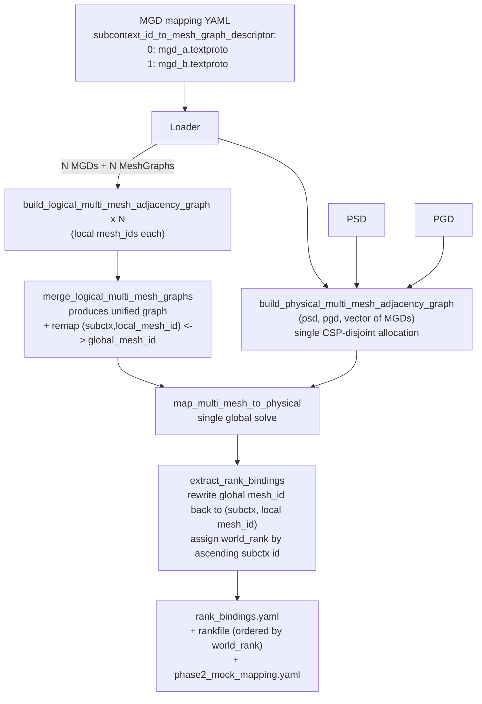

## Goal

Today [tools/scaleout/src/generate_rank_bindings.cpp](tools/scaleout/src/generate_rank_bindings.cpp) loads exactly one MGD, builds one `LogicalMultiMeshGraph` and one `PhysicalMultiMeshGraph` (lines 222 / 230) and runs `map_multi_mesh_to_physical` once. We want it to accept N MGDs (sub-context id → MGD path), build N logical graphs, **merge** them into one logical graph for the CSP, build a **single** physical graph that aggregates all MGDs' groupings on the same PSD, and emit a single `rank_bindings.yaml` carrying both global (world) and local (sub-context-relative) coordinates.

## Backwards compatibility (hard requirement)

**[topology_mapper_utils.hpp](tt_metal/api/tt-metalium/experimental/fabric/topology_mapper_utils.hpp) public API — append-only, no edits in place:**

- Every currently-declared function, struct, type alias, and template stays exactly as written. Nothing is renamed, removed, deprecated, made `inline`, marked `[[deprecated]]`, or moved between namespaces.
- The existing 3-arg overload `build_physical_multi_mesh_adjacency_graph(psd, pgd, mgd)` keeps its declaration, its definition body, and its observable behavior unchanged. Its `.cpp` implementation at [topology_mapper_utils.cpp:472](tt_metal/fabric/topology_mapper_utils.cpp#L472) is **not refactored** — we do NOT turn it into a thin wrapper around the new overload.
- Both other existing overloads — `build_physical_multi_mesh_adjacency_graph(psd, asic_id_to_mesh_rank)` ([topology_mapper_utils.cpp:527](tt_metal/fabric/topology_mapper_utils.cpp#L527)) and the two `build_logical_multi_mesh_adjacency_graph` variants — are untouched.
- All other public symbols in this header (`map_mesh_to_physical`, `map_multi_mesh_to_physical`, `build_adjacency_map_logical`, `build_adjacency_map_physical`, `build_flat_adjacency_map_from_psd`, `build_hierarchical_from_flat_graph`, `LogicalMultiMeshGraph`, `PhysicalMultiMeshGraph`, `LogicalExitNode`, `PhysicalExitNode`, `TopologyMappingConfig`, `TopologyMappingResult`, the formatters) are untouched.
- New functions are added at the bottom of the existing public surface (additive only), in the same `tt::tt_metal::experimental::tt_fabric` namespace.
- ABI: We may safely add new free functions and a new struct (`LogicalMeshIdRemap`); we do NOT add fields to existing structs (`PhysicalMultiMeshGraph`, `LogicalMultiMeshGraph`, `TopologyMappingConfig`, `TopologyMappingResult`) so layout-sensitive consumers are unaffected.

**Tool / CLI public surface — append-only:**

- Existing CLI flag `-m`/`--mesh-graph-descriptor` still accepts a single `.textproto` and produces the SAME artifacts as today (same fields, same ordering, same rank semantics).
- `RankBindingConfig` ([generate_rank_bindings_helpers.hpp](tools/scaleout/src/generate_rank_bindings_helpers.hpp)) keeps every existing field (`rank`, `psd_mpi_rank`, `mesh_id`, `mesh_host_rank`, `hostname`, `slot`, `env_overrides`) with the SAME meaning. New fields are appended at the end with sentinel defaults that mean "single-MGD mode" and trigger no schema changes in YAML output.
- `write_rank_bindings_yaml(bindings, mesh_graph_desc_path, output_file)`, `write_rankfile(bindings, path, mock)`, `write_phase2_mock_mapping_yaml(...)` keep their signatures, default behavior, and emitted YAML schema when called with single-MGD bindings.
- Existing tests ([tools/tests/scaleout/test_generate_rank_bindings.cpp](tools/tests/scaleout/test_generate_rank_bindings.cpp), all 12+ call sites of the 3-arg `build_physical_multi_mesh_adjacency_graph` in [tests/tt_metal/tt_fabric/fabric_router/test_topology_mapper_utils.cpp](tests/tt_metal/tt_fabric/fabric_router/test_topology_mapper_utils.cpp), and the consumer in [tt_metal/fabric/topology_mapper.cpp:453](tt_metal/fabric/topology_mapper.cpp#L453)) compile and pass unmodified.

Multi-MGD output schema (only when the new flag is used):

- `rank` = local rank within the sub-context (0..n_i-1, matches `distributed_context_get_rank()` after `MPI_Comm_split`).
- `world_rank` = global MPI rank used by `mpirun`'s rankfile, contiguous per sub-context in ascending id order.
- `subcontext_id` = key from the MGD mapping.
- `mesh_id`, `mesh_host_rank` = local within that sub-context's MGD.
- `env_overrides`: `TT_RUN_SUBCONTEXT_ID`, `TT_RUN_SUBCONTEXT_SIZES`, `TT_MESH_GRAPH_DESC_PATH`, `TT_VISIBLE_DEVICES`.
- `rankfile` lines are ordered by `world_rank`.

---

## Architecture diagram




---

## Step-by-step

### 1. CLI: add a NEW optional flag, leave `-m` alone

In `parse_arguments` ([tools/scaleout/src/generate_rank_bindings.cpp:542](tools/scaleout/src/generate_rank_bindings.cpp#L542)):

- `-m`/`--mesh-graph-descriptor` keeps its current behavior: takes one `.textproto` path, populates `args.mesh_graph_descriptor_path` exactly as today.
- Add a NEW optional flag `-M`/`--mesh-graph-descriptor-mapping` (`std::string`) that points at a YAML mapping. Validate exactly one of `-m` or `-M` is supplied (current behavior of "`-m` required" becomes "exactly one of `-m`/`-M` required").
- Update `ProgramArgs` additively (existing field unchanged):

```cpp
struct ProgramArgs {
    std::string mesh_graph_descriptor_path;                  // unchanged
    std::optional<std::string> mesh_graph_descriptor_mapping_path;  // NEW
    std::optional<std::string> physical_grouping_descriptor_path;   // unchanged
    std::optional<std::string> output_dir;                          // unchanged
};
```

- When `-M` is given, parse the YAML mapping (key: sub-context id, value: MGD path). Example:

```yaml
subcontext_id_to_mesh_graph_descriptor:
  0: tests/tt_metal/tt_fabric/custom_mesh_descriptors/bh_galaxy_single_4x4_mesh.textproto
  1: tests/tt_metal/tt_fabric/custom_mesh_descriptors/bh_galaxy_dual_2x4_intermesh.textproto
```

- Parse with `yaml-cpp` (already a dep, see [generate_rank_bindings_helpers.hpp](tools/scaleout/src/generate_rank_bindings_helpers.hpp)). Validate: keys are non-negative ints, values are existing files, dense `0..N-1`.
- Internally, the code converts `-m` into a 1-entry mapping `{0: <path>}` so the downstream code path is uniform — but the CLI surface and YAML-output schema for that case stay unchanged.

### 2. Add a NEW `vector<MGD>` overload — do not touch the existing one

Goal: extend [topology_mapper_utils.hpp](tt_metal/api/tt-metalium/experimental/fabric/topology_mapper_utils.hpp) additively. Existing declarations keep their exact text and ordering; new declarations are appended at the bottom of the public surface, in the same namespace.

NEW declaration appended to the header:

```cpp
// Multi-MGD overload. Aggregates groupings from every MGD on the same PSD/PGD
// and runs find_all_in_psd ONCE so all sub-contexts get disjoint ASIC allocations.
//
// `out_subctx_to_global_mesh_ids[i]` (when non-null) receives the list of
// MeshIds in the returned PhysicalMultiMeshGraph that came from `mgds[i]`,
// in the same order as `pgd.get_valid_groupings_for_mgd(mgds[i], psd)`.
//
// This is purely additive; the existing 3-arg overload above is unchanged.
PhysicalMultiMeshGraph build_physical_multi_mesh_adjacency_graph(
    const tt::tt_metal::PhysicalSystemDescriptor& psd,
    const tt::tt_fabric::PhysicalGroupingDescriptor& pgd,
    const std::vector<std::reference_wrapper<const tt::tt_fabric::MeshGraphDescriptor>>& mgds,
    std::vector<std::vector<MeshId>>* out_subctx_to_global_mesh_ids = nullptr);
```

In [topology_mapper_utils.cpp](tt_metal/fabric/topology_mapper_utils.cpp):

- The body of the existing 3-arg overload at [line 472](tt_metal/fabric/topology_mapper_utils.cpp#L472) is **left untouched** (no refactor, no extraction). This guarantees byte-identical behavior for existing callers and avoids any risk of subtly changing log lines, error messages, or grouping iteration order.
- Implement the new vector overload as an independent function whose body parallels the existing one: build the flat graph from the PSD, call `pgd.get_valid_groupings_for_mgd(mgd_i, psd)` for each MGD in input order while remembering the per-sub-context index range, accumulate `all_mesh_grouping_infos`, call `find_all_in_psd` once, then `build_hierarchical_from_flat_graph`. Populate `out_subctx_to_global_mesh_ids` from the remembered ranges (the i'th entry of `all_mesh_groupings` becomes `MeshId{i}` after `build_hierarchical_from_flat_graph`).
- A small amount of code is duplicated between the two overloads. That is the price of the "do not refactor" rule and is acceptable for a single ~50-line function. If we later decide to deduplicate, the public API stays stable.

Result: every existing caller — [tools/scaleout/src/generate_rank_bindings.cpp:222](tools/scaleout/src/generate_rank_bindings.cpp#L222), [tt_metal/fabric/topology_mapper.cpp:453](tt_metal/fabric/topology_mapper.cpp#L453), and the 12+ test cases in [tests/tt_metal/tt_fabric/fabric_router/test_topology_mapper_utils.cpp](tests/tt_metal/tt_fabric/fabric_router/test_topology_mapper_utils.cpp) — keeps using the unchanged 3-arg overload byte-for-byte.

### 3. New helper: merge N logical multi-mesh graphs (additive)

Add a NEW struct and NEW free function appended to [topology_mapper_utils.hpp](tt_metal/api/tt-metalium/experimental/fabric/topology_mapper_utils.hpp). Existing types and functions are untouched:

```cpp
// Purely additive; does not modify LogicalMultiMeshGraph layout.
struct LogicalMeshIdRemap {
    // (subcontext_id, local mesh_id) -> global mesh_id used in merged graph
    std::map<std::pair<int, MeshId>, MeshId> local_to_global;
    // Inverse for round-trip after topology mapping
    std::map<MeshId, std::pair<int, MeshId>> global_to_local;
};

std::pair<LogicalMultiMeshGraph, LogicalMeshIdRemap>
merge_logical_multi_mesh_graphs(
    const std::vector<LogicalMultiMeshGraph>& per_subctx_graphs);
```

If we want to keep the public header even leaner, this helper can live entirely inside the tool's directory ([tools/scaleout/src/generate_rank_bindings_helpers.hpp](tools/scaleout/src/generate_rank_bindings_helpers.hpp) or a new `generate_rank_bindings_multi_mgd.hpp`). Either location is fine; both are additive. Default plan: put it in `topology_mapper_utils.hpp` so it can be unit-tested next to the existing helpers, but ONLY by appending — no edits to existing declarations.

Implementation:

- Walk sub-contexts in ascending id order; assign a fresh global `MeshId` for every local mesh, populate the remap table.
- Translate each `AdjacencyGraph<FabricNodeId>` (intra-mesh) by rewriting every `FabricNodeId{mesh_id, chip_id}` to use the new global mesh_id (chip_id stays).
- Concatenate `mesh_level_graph`_ and `mesh_exit_node_graphs`_ with translated keys. Inter-mesh edges only exist within a single sub-context's graph (different MGDs cannot reference each other), so no edges are dropped.

### 4. Wire mapping/loading in `main`

Replace the single `MeshGraphDescriptor mgd(...)` block ([generate_rank_bindings.cpp:619-625](tools/scaleout/src/generate_rank_bindings.cpp#L619)) with a loop:

```cpp
std::vector<int> ordered_subctx_ids;          // ascending
std::vector<MeshGraphDescriptor> mgds;        // owns
std::vector<std::filesystem::path> mgd_paths; // for env vars
std::vector<MeshGraph> mesh_graphs;           // for rank/host lookup
for (auto& [id, path] : args.subcontext_id_to_mgd_path) { ... }
```

`MeshGraph` construction stays per-MGD because `MeshGraph::get_host_rank_for_chip` is keyed by the MGD's local mesh_id — we resolve mesh-host ranks BEFORE remapping to global ids.

### 5. Add a multi-MGD `run_topology_mapping_multi`; keep the existing one

Keep `[run_topology_mapping](tools/scaleout/src/generate_rank_bindings.cpp#L215)` exactly as it is today (same signature, same behavior — it is a file-local function but external behavior should remain the same when `-m` is used). ADD a new sibling that takes vectors:

```cpp
TopologyMappingResult run_topology_mapping_multi(
    const PhysicalSystemDescriptor& psd,
    const PhysicalGroupingDescriptor& pgd,
    const std::vector<std::reference_wrapper<const MeshGraphDescriptor>>& mgds,
    const std::vector<MeshGraph>& mesh_graphs,
    const std::vector<int>& ordered_subctx_ids,
    LogicalMeshIdRemap& out_remap,
    std::vector<std::vector<MeshId>>& out_subctx_to_global_phys_mesh_ids);
```

To avoid duplication we can have the original call this new one with a 1-element vector internally, but the original signature stays public/unchanged.

Inside `run_topology_mapping_multi`:

- Build N `LogicalMultiMeshGraph`s with `build_logical_multi_mesh_adjacency_graph(mesh_graph_i)`.
- Call `merge_logical_multi_mesh_graphs` to get the unified logical graph + `out_remap`.
- Build the physical graph with the new vector overload (step 2).
- Build `fabric_node_id_to_mesh_rank` per sub-context using the local `MeshGraph`, then translate each `FabricNodeId` to the global mesh_id via `out_remap.local_to_global` before inserting into the merged map. Same translation for `pinnings` (MGD-supplied positions are local).
- Build `mesh_validation_modes` and `inter_mesh_validation_mode` from the PER-SUBCONTEXT mesh graphs, keyed by the global mesh_id. If sub-contexts disagree on the inter-mesh policy, fail loudly with a clear error (no implicit policy choice).
- Call `map_multi_mesh_to_physical` once.

### 6. Add `extract_rank_bindings_multi`; keep the existing `extract_rank_bindings`

Keep `[extract_rank_bindings](tools/scaleout/src/generate_rank_bindings.cpp#L323)` byte-identical so single-MGD output is unchanged. ADD `extract_rank_bindings_multi` for the multi-MGD path:

- For each `(global_fabric_node, asic)` in `mapping_result.fabric_node_to_asic`, look up `(subctx_id, local_mesh_id) = remap.global_to_local[global_fabric_node.mesh_id]`. Use the per-subctx `MeshGraph` to fetch `mesh_host_rank` for that LOCAL mesh_id + chip_id.
- Bucket by `(subctx_id, local_mesh_id, hostname, mesh_host_rank)` instead of `(mesh_id, hostname, mesh_host_rank)`.
- Sort entries by: PSD rank, sub-context id, local mesh_id, mesh_host_rank, hostname (so all rows of sub-context 0 come before sub-context 1 — required so `MPI_Comm_split` keys align with local rank).
- Walk sorted entries:
  - `binding.world_rank = i` (global, contiguous).
  - `binding.rank = local_rank` (running counter that resets at every sub-context boundary).
  - `binding.subcontext_id = subctx_id`.
  - `binding.mesh_id = local_mesh_id` (LOCAL — preserves the per-overlay namespace).
  - Per-row `slot` counter still keyed by hostname (single rankfile).
  - Build `env_overrides` (step 7).

### 7. Per-row env overrides

Compute `subctx_sizes` (`vector<int>`, length N, indexed by sub-context id) by counting bound rows per sub-context. Then for every row:


| Variable                  | Value                                                       |
| ------------------------- | ----------------------------------------------------------- |
| `TT_RUN_SUBCONTEXT_ID`    | `std::to_string(subctx_id)`                                 |
| `TT_RUN_SUBCONTEXT_SIZES` | comma-joined `subctx_sizes` (identical on all rows)         |
| `TT_MESH_GRAPH_DESC_PATH` | absolute path of that row's MGD                             |
| `TT_VISIBLE_DEVICES`      | unchanged from today (MMIO devices for that row's chip_ids) |


### 8. Additively extend `RankBindingConfig` and the YAML writer

In [tools/scaleout/src/generate_rank_bindings_helpers.hpp](tools/scaleout/src/generate_rank_bindings_helpers.hpp), add new optional fields with sentinel defaults; do NOT modify existing field meanings:

```cpp
struct RankBindingConfig {
    int rank;                         // unchanged: single-MGD => global rank; multi-MGD => local rank
    int psd_mpi_rank = -1;            // unchanged
    int mesh_id;                      // unchanged: in multi-MGD this is the LOCAL mesh_id
    int mesh_host_rank = 0;           // unchanged
    std::string hostname;             // unchanged
    int slot;                         // unchanged
    std::map<std::string, std::string> env_overrides;  // unchanged

    // NEW: only set in multi-MGD mode. Sentinel = -1 means "unused / single-MGD".
    int world_rank = -1;
    int subcontext_id = -1;
};
```

YAML writers stay backwards-compatible: the existing functions keep their signatures, and only emit the new fields when `subcontext_id >= 0`.

- `[write_rank_bindings_yaml](tools/scaleout/src/generate_rank_bindings_helpers.hpp#L42)` (signature unchanged: `(bindings, mesh_graph_desc_path, output_file)`):
  - Always emit `rank`, `mesh_id`, `mesh_host_rank`, `env_overrides` exactly as today.
  - Always emit top-level `mesh_graph_desc_path` exactly as today.
  - For each binding, additionally emit `world_rank` and `subcontext_id` ONLY if `binding.subcontext_id >= 0`. Single-MGD callers (and the existing test [WriteRankBindingsYaml_ContainsMeshGraphPathAndRanks](tools/tests/scaleout/test_generate_rank_bindings.cpp#L44)) see no schema change.
- `[write_rankfile](tools/scaleout/src/generate_rank_bindings_helpers.hpp#L130)` (signature unchanged): sort key is `world_rank` if `world_rank >= 0` for any binding, else falls back to `rank` as today. Emitted `rank K=` uses `world_rank` in multi-MGD mode and `rank` otherwise. Same semantics for single-MGD.
- `[write_phase2_mock_mapping_yaml](tools/scaleout/src/generate_rank_bindings_helpers.hpp#L78)` (signature unchanged): map key is `world_rank` if `world_rank >= 0`, else `rank` as today.

Optionally add a new convenience writer `write_subcontext_id_to_rank_bindings_mapping_yaml(...)` if a separate top-level mapping file is also wanted, but the user's chosen output is "one rank_bindings.yaml that contains everything", so this is not required.

### 9. Single-MGD path: byte-for-byte unchanged

When `-m` is used (no `-M`):

- `main` calls the existing `run_topology_mapping(psd, pgd, mgd, mgd_path)` and `extract_rank_bindings(psd, mapping_result, mesh_graph)` — both unchanged.
- `RankBindingConfig::subcontext_id` stays at its sentinel `-1`, so `write_rank_bindings_yaml` / `write_rankfile` / `write_phase2_mock_mapping_yaml` emit exactly the same fields and ordering as today.
- All call sites of the 3-arg `build_physical_multi_mesh_adjacency_graph(psd, pgd, mgd)` continue to compile and produce identical output (the function now just delegates to the vector overload with one entry).
- Existing tests in [tools/tests/scaleout/test_generate_rank_bindings.cpp](tools/tests/scaleout/test_generate_rank_bindings.cpp) and [tests/tt_metal/tt_fabric/fabric_router/test_topology_mapper_utils.cpp](tests/tt_metal/tt_fabric/fabric_router/test_topology_mapper_utils.cpp) require no edits.

### 10. Validation / error paths

- Reject duplicate or non-dense sub-context ids.
- Reject if total bound rows from topology mapping does not equal `sum(subctx_sizes)` derived from MGDs (would indicate the CSP failed to allocate one sub-context).
- Reject if any MGD's required hosts cannot be satisfied disjointly on the PSD (surface `find_all_in_psd` errors, which the existing single-MGD path already collects into `errors`).
- Fail clearly when sub-contexts have conflicting inter-mesh policies.

---

## Files touched

- [tools/scaleout/src/generate_rank_bindings.cpp](tools/scaleout/src/generate_rank_bindings.cpp): add `-M` parsing and a multi-MGD branch in `main`. Existing `run_topology_mapping`, `extract_rank_bindings`, and the single-MGD branch are not modified.
- [tools/scaleout/src/generate_rank_bindings_helpers.hpp](tools/scaleout/src/generate_rank_bindings_helpers.hpp): append `world_rank` and `subcontext_id` (with `-1` sentinel defaults) to `RankBindingConfig`; teach `write_rank_bindings_yaml` / `write_rankfile` / `write_phase2_mock_mapping_yaml` to emit/use them ONLY when `subcontext_id >= 0`. Signatures and single-MGD output unchanged.
- [tt_metal/api/tt-metalium/experimental/fabric/topology_mapper_utils.hpp](tt_metal/api/tt-metalium/experimental/fabric/topology_mapper_utils.hpp): **append-only.** Add the new `vector<MGD>` overload of `build_physical_multi_mesh_adjacency_graph` and the new `LogicalMeshIdRemap` struct + `merge_logical_multi_mesh_graphs` declaration. No existing declaration is renamed, removed, modified, or reordered.
- [tt_metal/fabric/topology_mapper_utils.cpp](tt_metal/fabric/topology_mapper_utils.cpp): **append-only for existing functions.** Add the new vector-overload implementation as an independent function alongside (not replacing) the existing 3-arg `build_physical_multi_mesh_adjacency_graph` body. Add `merge_logical_multi_mesh_graphs` implementation if declared in the public header.
