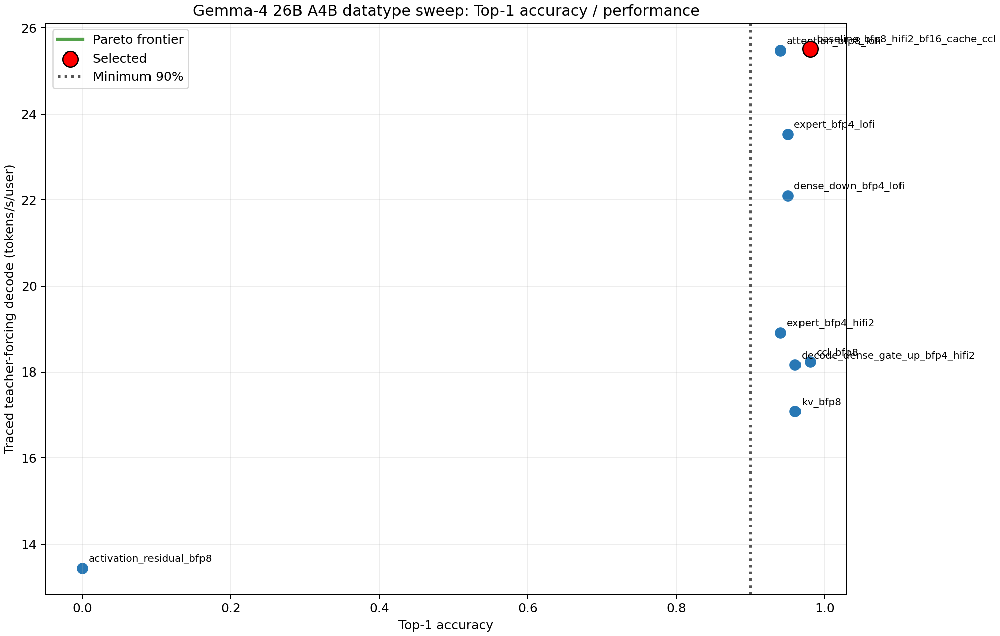
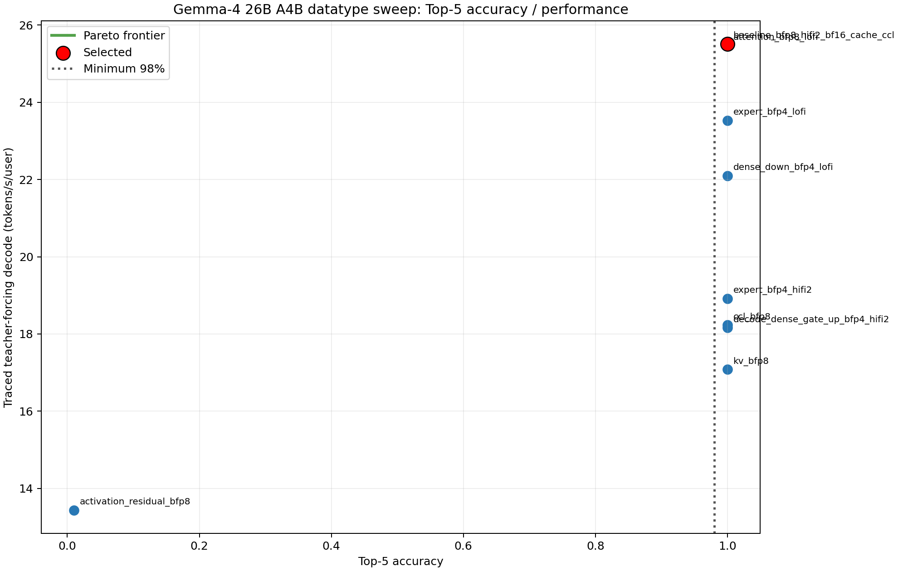

# Gemma-4 26B A4B datatype sweep

Selected: `baseline_bfp8_hifi2_bf16_cache_ccl`. It is the fastest evaluated
configuration satisfying top-1 >= 90% and top-5 >= 98% under trace-verified
AIME24 teacher forcing.

| Selected result | Value |
| --- | ---: |
| AIME24 chat-template top-1 / top-5 / top-100 | 98% / 100% / 100% |
| TTFT, warmed policy-path run, batch 1 | 382.99 ms |
| Traced teacher-forcing decode, 100 tokens, batch 1 | **25.51 t/s/u** |
| Post-selection token-out, 5 warmups + 128 no-readback replays | **28.0302 t/s/u** |
| Post-selection token-out latency | 35.6759 ms/token |

The selected policy uses BF16 norms, residuals, activations, CCL, KV cache,
logits, and sampling parameters; BFP8 attention/dense/expert weights; FP32
routing; and a decode-only BFP4 packed dense gate/up weight. Sliding attention
uses HiFi2; full attention, dense MLP, and expert matmuls use LoFi. The full
mechanical policy is in `selected_precision_config.json` and is loaded by
`build_generator`/`Gemma4FullModel` by default. `GEMMA4_PRECISION_CONFIG` or the
`precision_config_path` constructor argument provides the safe override path.

## Pareto interpretation

The closest challenger is BFP8 attention with LoFi at 25.47 t/s/u, but it is
slower and loses four top-1 points. BFP8 KV and CCL reduce storage/transfer
precision yet are substantially slower (17.08 and 18.23 t/s/u). BFP4 expert
LoFi passes accuracy but reaches 23.53 t/s/u; HiFi2 for the same group reaches
18.92. BFP4 dense-down LoFi reaches 22.10. The selected decode-only BFP4 packed
dense gate/up LoFi policy is directly controlled by the dense MLP fidelity; its
HiFi2 control reaches only 18.16 t/s/u. BFP8 activation/residual fails accuracy
at 0%/1% top-1/top-5 and is slower.

## Capability and runtime evidence

`doc/context_contract.json` was recomputed for BF16 and BFP8 KV candidates.
Both retain 262,144 tokens; BFP8 changes the conservative per-device total from
22.2853 GiB to 21.0109 GiB. Its fixed-slot mixed 33/47 non-aligned prompt test
passes after the cache fill/update dtype-boundary repair. No context capability
was reduced.

`artifacts/selected_token_out.log` prints the measured runtime summary for all
30 layers. It proves the default selected artifact supplied BFP8 weights,
HiFi2/LoFi role fidelities, BF16 activation/residual/KV/CCL/logits, and the
sampling assumptions to the token-out construction path. The same run reports
zero token readbacks, zero refreshes, zero timed synchronizations, and 134 trace
replays. The main readiness reference is
`doc/full_model/readiness_aime24_chat.refpt`, generated with the checkpoint chat
template and 100 generated tokens.

The selected config reran the six shared chat-template qualitative prompts at
64 greedy tokens with rendered token IDs and same-checkpoint HF controls under
`shared_qualitative/`. Outputs are coherent and on-topic; the machine audit in
`shared_qualitative_degeneracy.json` reports no degeneracy.

Exact candidate commands, measurement regimes, hardware, policies, logs, and
pass/fail rows are in `sweep_results.json` and `sweep_results.csv`. Detailed
commands and limitations are in `work_log.md`.
