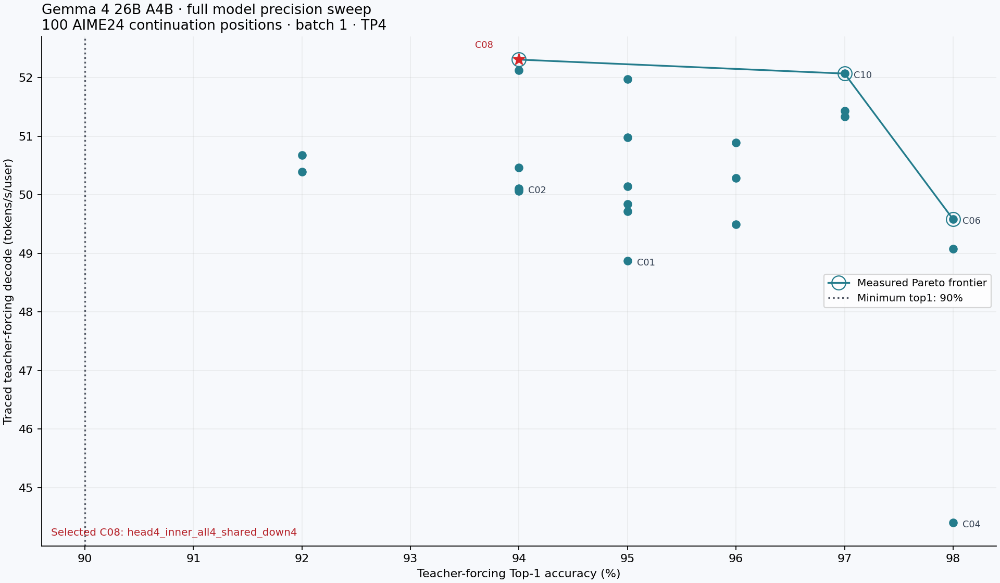
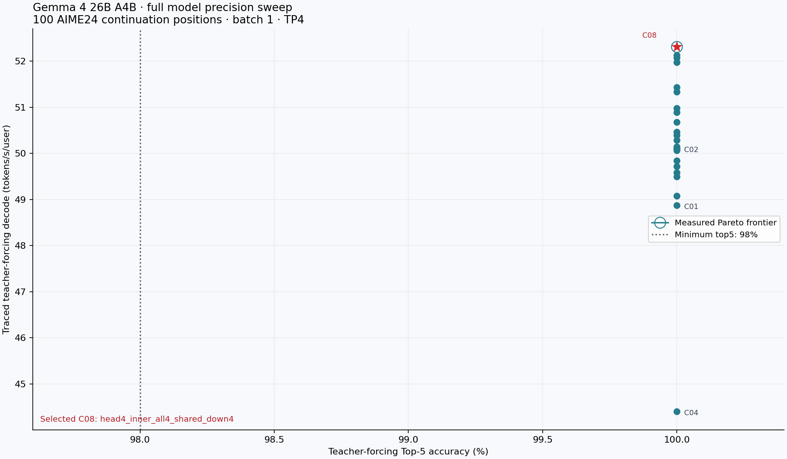

# Gemma 4 26B A4B datatype sweep

Selected: **`head4_inner_all4_shared_down4`**, consumed by default from
`selected_precision_config.json`. Full-model traced teacher forcing reaches
**52.30588 tokens/s/user**, median warmed TTFT **149.2466 ms**,
and top-1/top-5/top-100 **94%/100%/100%**. Prefill is **97%/100%/100%**.
Acceptance is **90%/98%/100%** in both phases. This is the fastest passing
configuration among 23 evaluated full-model policies.

Post-selection **autoregressive token-out** through the normal default factory:
**51.64728 tokens/s/user**, **2115.2477 ms TTFT**, exactly **4096 input / 128
output tokens, batch1, concurrency1**, median of three warmed requests. This is
the performance number later reports and serving comparisons should use.
Decode improves4.65% over the refreshed49.35446 baseline; TTFT is unchanged
within measurement variation. All final capability checks pass. Independent stage review: **clean-pass**
(`stage_review.md`), with no required work.

The refreshed baseline is 94%/100%/100% decode and96%/100%/100% prefill.
Its candidate-regime median is50.10865 traced teacher-forcing tokens/s/user.
Separately, its warmed **autoregressive token-out** benchmark is49.35446
 tokens/s/user and2115.2172 ms TTFT at **4096 input/128 output, B1, C1**.
The selected teacher-forcing gain is4.38%;
it is not a serving throughput claim. The token-out measurement above uses the same4096/128 benchmark and normal
default construction; `selected/performance.json` records127 model/sampling/output
replays, one final token readback, zero per-token refreshes and zero full-logit
readbacks. Streaming and buffered output tokens match exactly.

## Selected policy and capacity

The LM head uses BFP4/LoFi. Layers1–28 use BFP4/LoFi for QKV, attention output
and expert gate/up; layers0 and29 keep their prior choices for those three groups. Expert
 down and shared gate/up remain BFP4/LoFi; shared down now uses BFP4/LoFi for
both layer types. Prefill weights and sensitive norm/router choices remain the
explicit fixed policy. KV cache remains BFP8. Attention CCL remains BF16 for
sliding layers/BFP8 for full layers, and MoE CCL remains BFP8/BF16 respectively.
Residual/activation streams remain BF16 with FP32 post-attention residual;
QKV input remains FP32, expert input BFP8 and other decode matmul inputs BF16.
Logits and sampling inputs remain BF16.

At the unchanged262144-token context, source-derived conservative peak DRAM is
26,652,351,488 bytes/device, a reduction of
1,815,621,632 bytes from the baseline. Cache payload
remains8,556,380,160 bytes/device. `memory_candidates.json` includes all evaluated
policies; `precision_memory.md` explains retained copies and reserve assumptions.
A conservative BF16-cache bound above32GB is not physical impossibility evidence
and did not authorize a capability reduction. BF16 cache is unselected because
it is slower. Actual selected maximum-context execution passes at262143/262144 tokens
across all30 layers (`selected_capacity/capacity.json`), including final-position
decode after nonaligned prefill. `selected_trace_batch32.json` preserves32 short
requests with mixed31/127-token lengths; isolated slots0 and31 have PCC1.0 for
prefill and two decode steps. The recomputed `../context_contract.json` retains
262144 context and requires no logical prompt-length alignment.

## Evaluated full-model configurations

Every row below passed both accuracy phases; all unselected rows are rejected
for slower measured throughput. `sweep_results.json` and `.csv` retain full
policies, prefill metrics, TTFT, commands, hardware, trace status and source hashes.
The raw per-config JSON includes actual runtime tensor/kernel summaries.

| Plot | Config | Decode top-1/top-5/top-100 (%) | Traced TF t/s/u | Selection |
| --- | --- | --- | ---: | --- |
| C01 | `activation_bfp8` | 95/100/100 | 48.86880 | slower |
| C02 | `baseline_mixed_lofi` | 94/100/100 | 50.10865 | slower |
| C03 | `ccl_bfp8` | 95/100/100 | 49.71355 | slower |
| C04 | `decode_bf16_hifi4` | 98/100/100 | 44.40083 | slower |
| C05 | `decode_bfp8_hifi2` | 98/100/100 | 49.07410 | slower |
| C06 | `decode_bfp8_lofi` | 98/100/100 | 49.58027 | slower |
| C07 | `head4_inner_all4` | 94/100/100 | 52.12325 | slower |
| C08 | `head4_inner_all4_shared_down4` | 94/100/100 | 52.30588 | selected |
| C09 | `head4_inner_gate4` | 95/100/100 | 51.97184 | slower |
| C10 | `head4_inner_qkv_gate4` | 97/100/100 | 52.06739 | slower |
| C11 | `head_bfp4_hifi2` | 97/100/100 | 51.33303 | slower |
| C12 | `head_bfp4_lofi` | 97/100/100 | 51.42739 | slower |
| C13 | `head_bfp8_hifi2` | 95/100/100 | 50.97971 | slower |
| C14 | `head_bfp8_lofi` | 96/100/100 | 50.88881 | slower |
| C15 | `inner_bfp4_hifi2` | 92/100/100 | 50.39578 | slower |
| C16 | `inner_bfp4_lofi` | 92/100/100 | 50.67938 | slower |
| C17 | `inner_expert_gate_bfp4_lofi` | 94/100/100 | 50.46543 | slower |
| C18 | `inner_output_bfp4_lofi` | 94/100/100 | 50.08888 | slower |
| C19 | `inner_qkv_bfp4_lofi` | 96/100/100 | 50.28868 | slower |
| C20 | `kv_bf16` | 94/100/100 | 50.06457 | slower |
| C21 | `mixed_hifi2` | 96/100/100 | 49.49273 | slower |
| C22 | `shared_down_bfp4_hifi2` | 95/100/100 | 49.84240 | slower |
| C23 | `shared_down_bfp4_lofi` | 95/100/100 | 50.14369 | slower |

## Policy construction and scope

`tt/precision_policy.py` resolves the complete selected JSON by default in
`build_generator` → `Generator` → `Model` → each decoder. An explicit
`precision_config={}` restores the safe pre-sweep baseline; a JSON path selects
an evaluated alternative. Unknown fields and unsupported fixed assumptions fail
closed. The actual tensor dtypes and kernel compute configurations are checked
by `Model.precision_summary()` in every candidate and the final default run.
Layer overrides take precedence over layer-type defaults. Upward precision
recovery reloads the original checkpoint weights, rather than widening already
quantized values.

The policy records all weight groups, activation and residual types, attention
and MoE CCL types, KV-cache type, logits and sampling types, fidelities and
accumulator assumptions. Fixed prefill/router/norm policies retain the accepted
optimized architecture and reject incompatible changes. Shared prefill's
`library_default` is the existing BF16 `ttnn.linear` signature: source resolution
in `matmul_device_operation.cpp:create_matmul_attributes` selects HiFi2,
approximation=false, FP32 accumulation=false and L1 accumulation=true. Decode
fidelities are explicit runtime kernel configurations. The active sparse MoE
path uses eight experts per token; it is not a dense all-expert substitute.

There is no vLLM adapter in this stage. The shared generator factory now consumes
the selected artifact by default; later serving construction must use that same
factory/policy. No vLLM integration or serving performance is claimed.

## Search and interpretation

The canonical precision table has no entry for this target. Uniform BFP8
LoFi/HiFi2 and BF16/HiFi4 decode controls provide recovery comparisons under the
accepted EP4-prefill/TP4-decode architecture. Inner-layer BFP4 trials exclude
layers 0 and 29; the JSON files describe all exceptions explicitly. QKV,
attention output, expert gate/up, expert down, shared gate/up, shared down and
LM-head groups all have BFP4+LoFi full-model evidence. Matching HiFi2 controls
cover these groups; uniform BFP8 LoFi/HiFi2 controls cover dominant same-dtype
fidelity choices. Router and norm precision remain protected.

Each candidate uses a separate process and mesh lifecycle, one warmup and three
measured readiness requests. Ranking uses the median traced teacher-forcing
throughput, requiring 99 model and sampling replays for 100 continuation
positions. Accuracy is the minimum across measured repetitions. Both prefill
and decode must pass top-1 ≥90%, top-5 ≥98%, and top-100 =100%. No eager,
allocation-tracked, Watcher or profiler timings enter the Pareto ranking.

The plots show every measured full-model candidate. The frontier is the set of
non-dominated accuracy/throughput points; the selected point is red and the
vertical dotted lines mark the accuracy gates. Plot IDs map to the table below.
All evaluated configurations passed accuracy, so rejected policies are rejected
for measured speed, not mislabeled as numerical failures. Small timing
separations should not be interpreted as statistically established advantages;
selection is limited to the evaluated matrix and workload.

## Material matmul fidelity comparisons

These are whole-model policy comparisons; where a control changes several groups,
the measured speed is not attributed to one isolated operation.

| Groups | BFP4 LoFi evidence: t/s/u, top-1 | BFP4 HiFi2 evidence: t/s/u, top-1 | Decision |
| --- | --- | --- | --- |
| LM head | `head_bfp4_lofi`:51.42739,97% | `head_bfp4_hifi2`:51.33303,97% | Keep LoFi in final combination. |
| Inner QKV / attention output / expert gate+up | `inner_bfp4_lofi`:50.67938,92% | `inner_bfp4_hifi2`:50.39578,92% | Keep LoFi; final combination passes94%. |
| Expert down / existing full-attention QKV and expert gate / shared gate+up | `baseline_mixed_lofi`:50.10865,94% | `mixed_hifi2`:49.49273,96% | Baseline's BFP4 groups retain LoFi; joint fidelity recovery is slower. |
| Shared down | `shared_down_bfp4_lofi`:50.14369,95% | `shared_down_bfp4_hifi2`:49.84240,95% | BFP4/LoFi included in the fastest final combination. |
| All decode groups at BFP8 | `decode_bfp8_lofi`:49.58027,98% | `decode_bfp8_hifi2`:49.07410,98% | Both pass, both slower than selected mixed/BFP4 policy. |

All comparisons have100% top-5/top-100. Individual QKV, attention-output and
expert-gate BFP4/LoFi trials also appear in the full candidate table, as do the
BFP8-head same-dtype fidelity pair and BF16/HiFi4 recovery control. Baseline EP
prefill expert-down BFP4/LoFi is exercised by every full-model prefill check.

## Repairs and geometry evidence

A BF16-cache smoke exposed a long-prefill SDPA L1 overflow for 512-wide heads:
1,590,848 bytes exceeded the 1,572,864-byte limit. AutoFix selects the existing
Q64/K128 boundary program for this dtype/head combination, lowering the static
bound to 1,033,792 bytes. It leaves BFP8 program selection and logical chunking
unchanged. `AUTODEBUG_bf16_cache.md`, `AUTOFIX_bf16_cache.md`, before/after host
lowering artifacts and `smoke_kv_bf16_fixed.json` record diagnosis and successful
31/32/33, 1023/1024/1025, 2047/2048/2049 and 4095/4096/4097 checks.

`head_bfp4_lofi_geometry.json` compares 18 geometries plus the helper control
under actual BFP4/LoFi weights and recorded target-model inputs. The production
11×10 grid with K-block 4 remains fastest (389.785 µs), versus 399.207 µs for
K-block 8; larger legal divisors and smaller grids were tested. These isolated
host-wall trace timings are geometry evidence only, not full-model device time.

The first allocation-tracked diagnostic passed one full 100-position request,
then exposed an accuracy-collector reuse error in the runner. A fresh collector
per request fixes it. Tracker overhead excludes that diagnostic from ranking.
The baseline's split-trace allocation warnings are controlled by the successful
allocation-tracked request; final prompt/trace checks supply additional lifecycle
evidence. See `AUTODEBUG_precision.md` and `AUTOFIX_precision.md` for the policy
plumbing and redundant-cast repair.

## Reproduction and limitations

Commands, source hashes, hardware, mesh, policy and raw runtime summaries are in
`results/<config_id>.json`; matching logs retain console evidence. Run candidates
with `OMP_NUM_THREADS=8 python -m
models.autoports.google_gemma_4_26b_a4b_it.tests.run_datatype_candidate --config
<config.json> --output <result.json>`. Generate the CSV and pyplot charts with
`python -m models.autoports.google_gemma_4_26b_a4b_it.tests.summarize_datatype_sweep`.
The complete command history and verification paths are in `work_log.md`.

Accuracy is full-model execution on one AIME24 chat-template prompt, 161 input
tokens and 100 continuation positions, not the whole AIME24 dataset. Reference
SHA256: `9b792e83314a35e9619e58434f11f4d3c4b1e1edb9f18d14f1799495ff7c4e69`.
HF revision: `4d7ae4984b7db7de8f8457170b3f1a419ee76d52`. Hardware is four Blackhole
P300c ASICs on mesh `[1,4]`. No new full-model device-time/roofline measurement
exists; host-wall timings and reduced-model geometry results do not populate
those telemetry fields. Batch-32 short requests do not imply 32 simultaneous
maximum-context requests.

## Selected default-path evidence

`selected/readiness.json` independently reproduces97/100/100% prefill and
94/100/100% decode through the default policy. Its first-request teacher-forcing
throughput is52.18254 t/s/u; initial TTFT1002.7102 ms includes trace preparation
and is not the warmed149.2466 ms candidate TTFT. The52.30588 selection median
and the default replay rate agree within ordinary run variation.

`selected/qualitative_verdict.md` records the manual comparison of all six shared
chat-template prompts against HF and baseline controls. All outputs are coherent;
they differ from baseline after precision changes. The shared suite and separate
sky explanation stop at the same128-token budget as their controls. The
existing degeneration checker reports no findings. `selected_nonaligned.json`
passes all12 tile/chunk boundaries under `TT_METAL_TRACE_ALLOC_TRACKING=1`;
those instrumented timings are excluded from performance claims.

The throughput prompt deliberately repeats a document sentence to exactly4096
tokens. Its128-token completion repeats a nine-token phrase and is identical
to the refreshed baseline completion (`selected/performance_output_control.json`).
This controlled synthetic continuation is performance evidence only; quality
verdicts use the separate chat-template suite and sky explanation above.

Initialization logs for three candidates report AICLK1343MHz versus requested
1350MHz. The runtime accepts this within5%; no sustained clock measurement is
available. This adds to the uncertainty of sub-percent timing differences.
The selected result remains the fastest observed passing median, not a claim
of statistically resolved ordering among close candidates.

## Verification and stage records

`host_verification.json`:8 policy tests passed; all16 stage Python files compile;
`git diff --check` and repository pre-commit hooks pass. Python/docs-only changes
require no C++ build. The local evidence packet is
`/workspace/tt-metal/bringup/artifacts/multigoal-runs/20260925T171711Z/telemetry/packets/ca0657b9-2c9e-4aea-8f29-86abae93b938.json`.
It records the actual post-selection4096/128 autoregressive result and leaves
unmeasured device-time/roofline fields unknown. Local checkpoint provenance is
recorded in `work_log.md` after independent stage review; no push is authorized.
