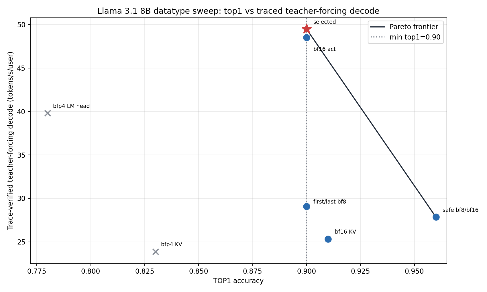
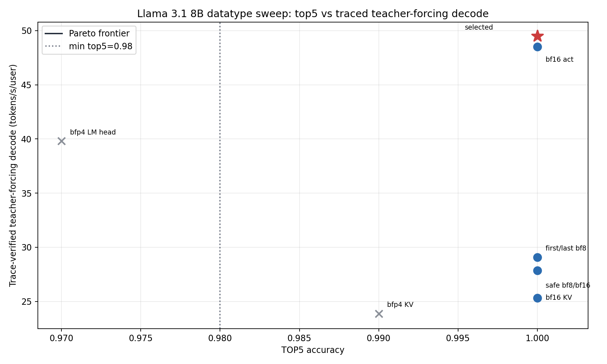

# Llama 3.1 8B Instruct Datatype Sweep

Selected config: `selected_precision_config` (`baseline_default`). It is the fastest evaluated full-model policy that satisfies top-1 >= 0.90 and top-5 >= 0.98 on the refreshed AIME24 chat-template readiness reference with 100 generated tokens.

## Selected Result

| Metric | Value |
| --- | ---: |
| Teacher-forcing top-1 / top-5 / top-100 | 0.900 / 1.000 / 1.000 |
| Teacher-forcing TTFT | 646.52 ms |
| Trace-verified teacher-forcing decode | 49.49 t/s/u |
| Post-selection token-out TTFT | 635.27 ms |
| Post-selection token-out no-readback decode | 70.55 t/s/u |
| Post-selection sampled-token readbacks | 0 |

Selected dtype policy: attention weights BFP4, MLP gate/up/down BFP4, activation/residual/CCL tensors BFP8, KV cache BFP8, MLP multiply BFP8, LM head BFP8, embedding/norm BF16, MLP compute LoFi, attention and LM-head compute HiFi2. Logits are consumed by split sampling on device, and readiness accuracy converts logits to host float32 for comparison.

`build_generator()` and `Llama31_8B_InstructFullModel.from_pretrained()` now load `doc/datatype_sweep/selected_precision_config.json` by default when present. Use `LLAMA31_8B_PRECISION_CONFIG=baseline` to force the hardcoded code-default path, or set `LLAMA31_8B_PRECISION_CONFIG=doc/datatype_sweep/configs/<id>.json` to reproduce a candidate.

## Sweep Results

| Config | Status | Top-1 | Top-5 | Top-100 | TTFT ms | TF decode t/s/u | Decision |
| --- | --- | ---: | ---: | ---: | ---: | ---: | --- |
| `baseline_default` | pass | 0.900 | 1.000 | 1.000 | 646.52 | 49.49 | selected |
| `safe_bfp8_bf16_act_hifi2` | pass | 0.960 | 1.000 | 1.000 | 790.51 | 27.84 | passing but slower |
| `bf16_activation_current_weights` | pass | 0.900 | 1.000 | 1.000 | 615.08 | 48.52 | passing but slower |
| `bf16_kv_current_weights` | pass | 0.910 | 1.000 | 1.000 | 1055.82 | 25.31 | passing but slower |
| `bfp4_kv_current_weights` | fail | 0.830 | 0.990 | 1.000 | 1066.06 | 23.88 | top1 0.830 < 0.90 |
| `bfp4_lm_head_current_weights` | fail | 0.780 | 0.970 | 1.000 | 628.45 | 39.80 | top1 0.780 < 0.90; top5 0.970 < 0.98 |
| `first_last_bfp8_guardrails` | pass | 0.900 | 1.000 | 1.000 | 672.67 | 29.08 | passing but slower |

Teacher-forcing decode performance is from `models.common.readiness_check.run_teacher_forcing`, which requires `generate(..., enable_trace=True)`. Eager or untraced decode numbers were not used for ranking.

## Pareto Interpretation





For top-1, the selected point sits exactly on the minimum allowed accuracy line and has the highest traced teacher-forcing decode throughput among passing candidates. The safer BFP8/BF16 policy improves top-1 to `0.960`, but slows traced teacher-forcing decode to `27.84 t/s/u`. BFP4 KV and BFP4 LM-head were useful lower-precision checks, but both miss the top-1 gate; BFP4 LM-head also misses top-5.

For top-5, the selected point dominates all evaluated passing configs because every passing config achieved top-5 `1.000`, and the selected config is fastest. The BFP4 LM-head trial lands below the top-5 threshold at `0.970`.

## Commands

Reference generation:

```bash
timeout 7200s python_env/bin/python -u -m models.common.readiness_check.generate --hf-model meta-llama/Llama-3.1-8B-Instruct --prompt-source aime24 --chat-template --gen-len 100 --top-k 100 --output models/autoports/meta_llama_llama_3_1_8b_instruct/doc/datatype_sweep/aime24_chat_template_100_top100.refpt
```

Baseline and candidates used:

```bash
LLAMA31_8B_PRECISION_CONFIG=doc/datatype_sweep/configs/<config_id>.json timeout 7200s python_env/bin/python -u -m models.common.readiness_check.run_prefill_check --model-dir models/autoports/meta_llama_llama_3_1_8b_instruct --reference models/autoports/meta_llama_llama_3_1_8b_instruct/doc/datatype_sweep/aime24_chat_template_100_top100.refpt --mesh-device T3K --fabric-config FABRIC_1D_RING
LLAMA31_8B_PRECISION_CONFIG=doc/datatype_sweep/configs/<config_id>.json timeout 7200s python_env/bin/python -u -m models.common.readiness_check.run_teacher_forcing --model-dir models/autoports/meta_llama_llama_3_1_8b_instruct --reference models/autoports/meta_llama_llama_3_1_8b_instruct/doc/datatype_sweep/aime24_chat_template_100_top100.refpt --mesh-device T3K --fabric-config FABRIC_1D_RING
```

Post-selection token-out no-readback:

```bash
timeout 7200s python_env/bin/python -u models/autoports/meta_llama_llama_3_1_8b_instruct/doc/full_model/token_out_trace_evidence.py --model-dir models/autoports/meta_llama_llama_3_1_8b_instruct --prompt-file models/autoports/meta_llama_llama_3_1_8b_instruct/doc/optimized_full_model/prompt_128.txt --mesh-device T3K --fabric-config FABRIC_1D_RING --max-new-tokens 128 --output-json models/autoports/meta_llama_llama_3_1_8b_instruct/doc/datatype_sweep/post_selection_token_out_trace_evidence.json
```

## Artifacts

- `sweep_results.json`
- `sweep_results.csv`
- `selected_precision_config.json`
- `top1_perf_pareto.png`
- `top5_perf_pareto.png`
- `post_selection_token_out_trace_evidence.json`
- `autoregressive_degenerate_report.json`
- `runs/` logs for reference generation, prefill, teacher forcing, token-out, propagation, and qualitative generation

## Limitations

The selected policy is accuracy-gated on one AIME24 chat-template prompt with 100 generated tokens. Full-model top-1 is exactly at the `0.90` threshold, so broader prompt coverage would be useful before raising the accuracy bar. No vLLM adapter exists in this autoport yet, and vLLM integration was intentionally not started.
