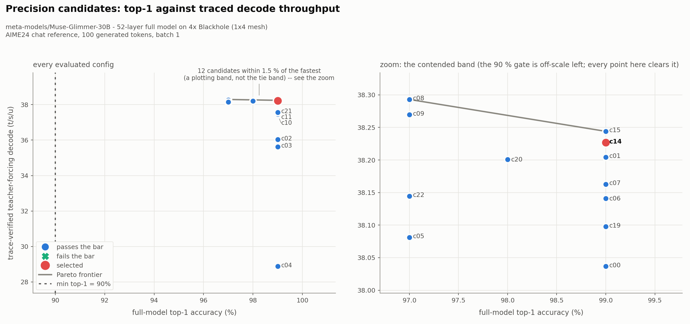
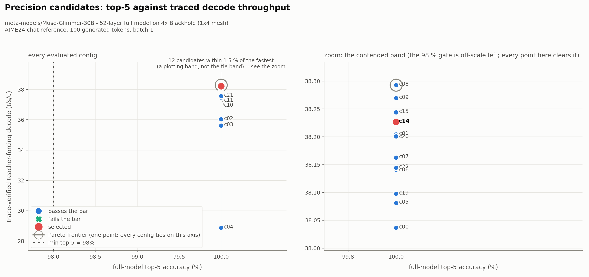

# Datatype sweep — `meta-models/Muse-Glimmer-30B`

A precision Pareto sweep over the [optimized full model](../optimized_full_model/README.md),
on the same four Blackhole dies, with the same public contract and the same 131072-token
capability. **Twenty-three candidates evaluated, eighteen measured on the full 52-layer model**,
and the winner is **0.99 % faster decode at identical full-model accuracy** — with the
selected policy now living in a file the build is *required* to read rather than in a
module constant.

## Selected config

**`c14-attn4-cclbfp8-kv8`** — [`selected_precision_config.json`](selected_precision_config.json).
Two changes against the carried-forward policy: the three attention projections move from
BFP8 to **BFP4** (still LoFi), and the decode reduce-scatter/all-gather payload moves from
the BF16 activation dtype to **BFP8**. Everything else is unchanged.

| | value | gate |
| --- | --- | --- |
| **top-1** | **0.990** (99/100) | ≥ 0.90 |
| **top-5** | **1.000** (100/100) | ≥ 0.98 |
| **top-100** | **1.000** (100/100) | ≥ 1.00 (carried forward) |
| **trace-verified teacher-forcing decode** | **38.227 t/s/u** (median of 11; 38.151–38.303) | ranking metric |
| TTFT, teacher-forcing prefill + first token, prompt 204 | 63.85 ms (min of 11) | — |
| **post-selection token-out decode** | **23.078 ms/token · 43.33 t/s/u** | the serving headline |
| post-selection TTFT, prompt 128 | 64.17 ms (min of 3) | — |
| traced logits-only decode | 22.434 ms/token · 44.58 t/s/u | cross-check |
| context | **131072**, unreduced — [`../context_contract.json`](../context_contract.json) | — |

Against the optimized full model, measured by the **same** benchmark on the same host
([`evidence_perf.json`](evidence_perf.json) against
[`../optimized_full_model/evidence_perf.json`](../optimized_full_model/evidence_perf.json)) —
except the teacher-forcing row, which neither file contains: that one is this stage's own
`c14` and `c00` sweep rows ([`sweep_results.json`](sweep_results.json)), measured by the
readiness runner rather than by the token-out benchmark:

| | before | **after** | delta |
| --- | --- | --- | --- |
| **token-out decode** | 23.298 ms/token · 42.92 t/s/u | **23.078 ms/token · 43.33 t/s/u** | **−0.94 %** |
| **traced logits-only decode** | 22.656 ms/token · 44.14 t/s/u | **22.434 ms/token · 44.58 t/s/u** | **−0.98 %** |
| teacher-forcing decode | 38.037 t/s/u | **38.227 t/s/u** | **+0.50 %** |
| TTFT, prompt 128 | 63.68 ms | 64.17 ms | inside the documented ~61–70 ms process spread |
| sampling trace | 0.632 ms | 0.632 ms | unchanged |
| top-1 / top-5 / top-100 | 0.990 / 1.000 / 1.000 | **0.990 / 1.000 / 1.000** | unchanged |
| per-device long-lived DRAM | 7.179 GB | **6.603 GB** | **−576 MB** (BFP4 attention weights) |

Which is the whole result in one line: **the decode step got 1 % cheaper and 576 MB/device
lighter, and not one of the three accuracy numbers moved.**





## The two charts, read

Left panel: every evaluated config, with the accuracy gate as the dotted line. Right panel:
the same points at the scale the selection is actually made on. Points are blue when they
clear the bar, red for the selection; the grey line is the non-dominated frontier.

Three things fall out of them that the raw table does not show as directly:

* **Nothing is anywhere near the accuracy gate.** The bar is top-1 ≥ 90 % and the worst
  candidate that ran is 97 %. The gate is not what shaped this sweep — the throughput axis
  is.
* **The top-5 frontier is a single point**, because every candidate scores 1.000. Top-5 does
  not discriminate anything here, which is worth knowing before anyone tunes against it.
* **The frontier has exactly two points on the top-1 chart, and the selected point is not one
  of them** — the frontier is `c08` at (97.0, 38.293) and `c15` at (99.0, 38.244), while the
  red `c14` sits 0.017 t/s/u below `c15` at the same accuracy. That is not a mistake in the
  chart and it is not hidden: `c14` and `c15` are separated by less than the measurement
  resolves on either metric, and the tie-break took `c14`. The pair that *is* the real
  tradeoff — accuracy against throughput rather than two indistinguishable neighbours — is
  `c08` against `c14`/`c15`, and [Why not the fastest one](#why-not-the-fastest-one) is that
  decision; limitation 3 is the `c14`-versus-`c15` one.

## What was swept

Twenty-three candidate artifacts, each a complete precision policy in
[`configs/`](configs/), each handed to the build through the same required-artifact path
the shipped default uses. Eighteen produced full-model numbers; five died on exact op
contracts (§ [What is blocked](#what-is-blocked)). The counts, and which candidate is in
which set, are asserted against the artifacts by the figure gate rather than typed.

| id | change against the baseline policy | top-1 | teacher-forcing t/s/u | logits-only t/s/u | verdict |
| --- | --- | --- | --- | --- | --- |
| `c00` | *(baseline: attention BFP8, MLP BFP4, KV BFP8, BF16 activations, LoFi, BFP4 LM head)* | 0.990 | 38.037 | 44.139 | the arm to beat |
| `c01` | attention weights → **BFP4**, LoFi | 0.990 | 38.204 | 44.382 | kept, and half of the selection |
| `c02` | attention BFP4 at **HiFi2** | 0.990 | 36.032 | 41.393 | rejected: 6.7 % slower, bit-identical |
| `c03` | attention BFP8 at **HiFi2** | 0.990 | 35.626 | 41.124 | rejected: 6.8 % slower for +0.0007 PCC |
| `c04` | MLP BFP4 at **HiFi2** | 0.990 | 28.879 | 32.453 | rejected: **26 % slower**, bit-identical |
| `c05` | KV cache → **BFP4** | **0.970** | 38.081 | 44.103 | rejected: costs top-1, worth ~0 here |
| `c06` | decode CCL payload → **BFP8** | 0.990 | 38.141 | 44.341 | kept, the other half of the selection |
| `c07` | attention BFP4 except layers 0 and 51 | 0.990 | 38.163 | 44.371 | dominated by `c01` |
| `c08` | attention BFP4 + KV BFP4 + decode CCL BFP8 | **0.970** | **38.293** | **44.661** | fastest; rejected on top-1 |
| `c09` | KV BFP4 + decode CCL BFP8 | **0.970** | 38.269 | 44.421 | rejected on top-1 |
| `c10` | LM head → **BFP8**, `in0_block_w=1` | 0.990 | 37.421 | 43.302 | rejected: 1.9 % slower than `c00`, no accuracy gain |
| `c11` | LM head BFP4 at `in0_block_w=1` | 0.990 | 37.463 | 43.355 | the geometry control for `c10` |
| `c14` | **attention BFP4 + decode CCL BFP8** | 0.990 | 38.227 | 44.578 | **selected** |
| `c15` | `c14` except layers 0 and 51 | 0.990 | 38.244 | 44.564 | inside `c14`'s spread; more complex |
| `c19` | prefill CCL BFP8 with the fractured norm off | 0.990 | 38.098 | 44.141 | the layout control for `c18` |
| `c20` | `c14` + KV BFP4 on the 39 sliding layers only | **0.980** | 38.201 | 44.639 | rejected on top-1; see below |
| `c21` | `c14` with the BFP4 **LM head at HiFi2** | 0.990 | 37.565 | 43.576 | rejected: 2.2 % slower, no accuracy gain |
| `c22` | `c14` + KV BFP4 on the 13 full-attention layers only | **0.970** | 38.145 | 44.598 | rejected on top-1; see below |

Full rows, with every dtype and fidelity field, the round-by-round spreads, the exact
commands, the hardware and the mesh, are in [`sweep_results.json`](sweep_results.json) and
[`sweep_results.csv`](sweep_results.csv).

### Why not the fastest one

`c08` is the fastest config that satisfies the acceptance bar, on both the ranking metric
and the cross-check. It is not selected, and the reason is a measurement rather than a
preference.

**It is not separated from `c14` by the ranking metric.** Over 11 rounds each, `c08` spans
**38.186–38.351** t/s/u and `c14` spans **38.151–38.303**. The ranges overlap across most of
their width; the medians differ by 0.17 %. `$datatype-sweep`'s tie rule is explicit about
what to do there — *"if two configs are within measurement noise, prefer the simpler and
safer one"* — and the two are within measurement noise.

The rule `bench/analyse.py::select` applies has three steps, in order: **safer**, drop anything
that regresses measured full-model top-1 against the best in the tied set; then **separated**,
drop anything the traced logits-only cross-check puts more than *its own measured resolution*
below its best — the resolution being how well that metric's two good rounds agree across all
candidates (0.038 %), not a fixed band, because a fixed 0.5 % band would swallow real 0.4 %
differences in a metric that repeats to 0.04 %; then **simplest**, among what survives, the
policy with fewest departures from the carried-forward baseline. Here step 1 drops the five
KV-BFP4 candidates, step 2 leaves `c14` and `c15` (44.578 and 44.564, 0.033 % apart), and step
3 takes `c14`. Every intermediate set is in `sweep_results.json:selected`.

**And `c08` is not the safer one.** Its BFP4 KV cache is the only change in the whole sweep
that moves full-model accuracy: **top-1 0.990 → 0.970**, reproducibly, on real weights, on
every one of its 11 rounds and on both the BF16 and FP32 references.

Being precise about what is and is not resolved, because the two metrics disagree: the
**ranking metric** does not separate them — 0.17 % of median inside overlapping 11-round
ranges — but the **cross-check does**, putting `c08` 0.19 % ahead against its own measured
resolution of 0.038 %, i.e. five times over. So this is not "a difference the measurement
cannot see". It is a difference one instrument sees and the mandated one does not, against two
top-1 points in every hundred that both see exactly. The skill's tie rule is written for the
mandated metric, `c08` and `c14` are tied on it, and *safer* is what it says to prefer there.
That is the whole argument, and the 0.19 % is in the candidate table rather than left out of
it.

The rule that encodes this is in [`bench/analyse.py`](bench/analyse.py) (`select`), and it
is applied by the script rather than by hand — the selection JSON records the tied set,
each member's round range, the cross-check values, and the sentence that decided it.

**What declining `c08` costs, stated rather than skipped.** A BFP4 KV cache halves the
paged cache from 1.854 GB/device to 0.981 GB, which takes the number of full-context
sequences that fit from **15 to 28**
([`../context_contract.json`](../context_contract.json)`:kv_cache_dtype_capacity`). That is a
real capability *gain* left on the table, not a reduction taken — the advertised 131072-token
context is supported at either dtype. A later serving stage that needs concurrency more than
it needs those two top-1 points can switch by copying
[`configs/c08-attn4-kv4-cclbfp8.json`](configs/c08-attn4-kv4-cclbfp8.json) over the selected
artifact, and the cost of doing so is measured here rather than left to be rediscovered.

### The KV cache is worth nothing here and 0.7 % at the advertised context

The full-model sweep decodes at 128–256 positions. At that context the paged SDPA reads
almost nothing, so `c05` measures a BFP4 cache at **44.103** t/s/u against the baseline's
**44.139** — i.e. worth zero. Rejecting a cache dtype on that number alone would be hiding
the fact that the decoder stage measured the *same* lever at 10 % once the SDPA chunking was
fixed, at context 131071.

So it was measured at both ends, on the decoder stage's own per-layer harness
([`bench/layer_ab.py`](bench/layer_ab.py), [`logs/layer_ab.log`](logs/layer_ab.log)):

| decode context | layer kind | BFP8 cache | BFP4 cache | delta |
| --- | --- | --- | --- | --- |
| 256 | sliding ×39 | 0.4345 ms | — | — |
| 131071 | sliding ×39 | 0.4416 ms | 0.4416 ms | **0.0 %** |
| 131071 | full ×13 | 0.5149 ms | **0.5027 ms** | **−2.4 %** |

The sliding layers do not move because they read a bounded window whatever the context; only
the 13 full-attention layers read the whole cache. Over the 52-layer stack that is
13 × 0.0122 = **0.159 ms** of a ~22.4 ms step — **0.71 %** at the advertised context, against
~0 % at the benchmark's. So the honest statement is: *a BFP4 KV cache is worth up to 0.7 % of
the step at full context and nothing at short context, and costs 2 top-1 points at both.*
Both numbers are on the record; the selection is made on the full-model metric the skill
mandates, which is measured at the reference's own context.

**The two effects separate by layer, and `c20` measures the split.** Round 1 of the stage
review pointed out that the schema takes `kv_cache_dtype` as a *layer* exception and nothing
had used it: the cache's decode win lives entirely in the 13 full-attention layers, while its
capacity saving is per layer and therefore mostly in the 39 sliding ones. `c20` is `c14` with
BFP4 on the sliding layers only, and it lands exactly between:

| config | KV policy | cache/device | full-context seqs | top-1 | teacher-forcing |
| --- | --- | --- | --- | --- | --- |
| `c14` **(selected)** | BFP8 ×52 | 1.854 GB | 15 | **0.990** | 38.227 |
| `c20` | BFP4 ×39 **sliding**, BFP8 ×13 full | 1.200 GB | 24 | 0.980 | 38.201 |
| `c22` | BFP8 ×39 sliding, BFP4 ×13 **full** | 1.636 GB | 17 | **0.970** | 38.145 |
| `c08` | BFP4 ×52 | 0.981 GB | 28 | 0.970 | 38.293 |

**The accuracy cost is not spread evenly over the layers — it is almost entirely in the 13
full-attention ones.** `c22` puts BFP4 on those 13 alone and lands at **0.970**, the same
top-1 as putting it on all 52; `c20` puts it on the other 39 and only reaches 0.980. Those are
the two layer kinds that differ in what they read: a sliding layer reads a bounded window, a
full-attention layer reads the whole cache, so a full-attention layer's SDPA sums over ~131k
BFP4-quantised keys where a sliding one sums over a few thousand. The same split runs the
other way for capacity — the saving is per layer, so the 39 sliding layers hold three quarters
of it — which is why `c20` buys 65 % of `c08`'s capacity for half its accuracy cost while
`c22` buys 25 % of the capacity for all of it.

**A serving stage that wants cache headroom should therefore take `c20`, not `c08`.** Neither
is selected here — both are top-1 regressions against `c14`, and the same rule rejects them —
but the two candidates together price each half of the lever separately instead of leaving the
next stage to rediscover it. Their per-layer readbacks (39 or 13 layers at one dtype and the
rest at the other, as 14 distinct groups in
`runs/c2{0,2}-*.json:realised_precision.layer_groups`) are also the strongest propagation
evidence in the stage for layer exceptions.

### The compute-fidelity answer is unusually clean

`$datatype-sweep` asks for BFP4+LoFi against BFP4+HiFi2 for every material BFP4 group, and
BFP8+LoFi against BFP8+HiFi2 for the dominant decode projections. All four arms ran, and the
BFP4 pair came back **bit-identical**:

| group | dtype | LoFi | HiFi2 | numerically |
| --- | --- | --- | --- | --- |
| attention projections | BFP4 | `c01` 44.382 | `c02` 41.393 (**−6.7 %**) | identical tokens, identical prefill PCC |
| MLP projections | BFP4 | `c00` 44.139 | `c04` 32.453 (**−26.5 %**) | identical tokens, identical prefill PCC |
| attention projections | BFP8 | `c00` 44.139 | `c03` 41.124 (**−6.8 %**) | *not* identical: prefill PCC 1.000 → 0.99929 |
| LM head | BFP4 | `c14` 44.578 | `c21` 43.576 (**−2.2 %**) | identical tokens, identical prefill PCC |

The LM head's pair (`c14`/`c21`) is the one the skill names that the matrix did not originally
contain — the head is 190 MB/device of BFP4 weight and the largest single matmul in the decode
step, so it is a material BFP4 group — and it answers the same way: HiFi2 changes nothing
numerically and costs 2.2 %.

BFP4 carries a 4-bit mantissa, which fits inside what LoFi already multiplies, so HiFi2 buys
nothing and costs the fidelity's throughput ratio. BFP8 does not fit, so HiFi2 changes the
numbers — by an amount that moves no full-model accuracy digit while costing 6.8 %. The
canonical guidance says the same thing from the other side (*"Use HiFi2 for BFP8 weights to
drop the least-significant bit... Use LoFi for BFP4 weights"*,
`tech_reports/LLMs/llms.md`); this is the measurement behind it, on this model.

The bit-identity is from the two-layer smoketest ([`smoketest.json`](smoketest.json)), where
`c01`/`c02` and `c00`/`c04` return the same six greedy tokens and the same prefill PCC to
every digit. The throughput numbers are from the 52-layer runs.

### The per-layer PCC that would have rejected the winner

The decoder stage measured BFP4 attention weights as 3.1 % faster at **PCC 0.977** on real
weights, and declined them on that PCC. This stage re-measured the same thing
([`logs/tests.log.gz`](logs/tests.log.gz), `layer_ab.py --real-weights`):

| arm | prefill PCC | decode PCC | ms/layer @256 (sliding) |
| --- | --- | --- | --- |
| baseline | 0.997450 | 0.997222 | 0.4390 |
| **selected** | **0.977068** | **0.985285** | **0.4345** |

0.977 is exactly the number that looked disqualifying one stage ago. On the full model it
costs **nothing**: top-1 0.990, top-5 1.000, top-100 1.000, both references, and a
qualitative suite that is clean against the HF control. That is the case for making this
decision on full-model accuracy rather than on layer PCC, and it is the reason the stage
exists.

## What is blocked, exactly

Five candidates produced no *decode* number. Every one of them is an **exact op contract**, not
a first API error, and each was retried through the adaptation available to it.

**Three of the five got further than "blocked" suggests, and it matters.** `c12`, `c16` and
`c17` each completed a full 100-token AIME24 **prefill** accuracy pass — all three at
**top-1 0.990, top-5 1.000, top-100 1.000**, i.e. indistinguishable from the baseline — and then
failed at *decode-trace capture*. `c13` and `c18` fail inside prefill itself and have no
accuracy number at all.

| id | fails in | prefill top-1/top-5/top-100 | op |
| --- | --- | --- | --- |
| `c12` | decode-trace capture | 0.990 / 1.000 / 1.000 | `nlp_create_qkv_heads_decode` |
| `c13` | prefill | — | `layernorm_pre_all_gather` |
| `c16` | decode-trace capture | 0.990 / 1.000 / 1.000 | `layernorm` |
| `c17` | decode-trace capture | 0.990 / 1.000 / 1.000 | `layernorm` |
| `c18` | prefill | — | `layernorm` |

That table is the reason limitation 5 is worded the way it is: the prefill halves of these
policies are not merely legal, they are measured and accuracy-neutral.

**BFP8 activations / residual stream** (`c12`):

```
TT_FATAL nlp_create_qkv_heads_decode_device_operation.cpp:41:
  input_tensor.dtype() == FLOAT32 || input_tensor.dtype() == BFLOAT16
info: Unsupported data format
```

The decoder stage recorded this; it is reproduced here first-hand rather than inherited. The
op takes FP32 or BF16 only, and the decode QKV projection's output is its input. What a BFP8
activation would have bought — a narrower payload on the two decode collectives — is
available directly and independently as `decode_ccl_dtype`, which is `c06`, which is
measured, passes, and is half the selection.

**BFP4 anywhere on a collective payload** (`c13`, `c16`, `c17`, `c18`). Two different norm
ops reject it, depending on which one the payload lands in — `c13` hits the *fractured* prefill
norm's op and the other three hit the ordinary one:

```
c13:  TT_FATAL layernorm_pre_all_gather_device_operation.cpp:44:
        input.dtype() == BFLOAT16 || input.dtype() == BFLOAT8_B || input.dtype() == FLOAT32
      info: Input data format not supported.

c16, c17, c18:  TT_FATAL layernorm_device_operation.cpp:52:
        a.dtype() == FLOAT32 or a.dtype() == BFLOAT16 or a.dtype() == BFLOAT8_B
      info: Input tensor must be FLOAT32, BFLOAT16, or BFLOAT8_B, got: DataType::BFLOAT4_B
```

Every collective in this model is consumed by an RMSNorm — that is the whole point of the
layer's structure — and **no norm op in TTNN accepts BFP4**, which is why moving between the
two of them changes the file name and not the answer. The adaptation was tried: `c18`
disables the fractured prefill norm, which moves the payload from
`layernorm_pre_all_gather` to `layernorm`, and hits the identical restriction. `c19` is its
layout control, so "the fractured norm is off" is not confounded with "the payload is BFP4".

The remaining workaround would be a typecast between the collective and the norm, and it is
self-defeating by this model's own numbers. The decode step runs **two collectives per layer
× 52 layers = 104** of them; the committed decode profile
([`../optimized_full_model/tracy/decode_sliding_perf_report.csv`](../optimized_full_model/tracy/decode_sliding_perf_report.csv))
prices a 6656-wide elementwise op on this grid at ~5.05 µs, so 104 typecasts is **~0.5 ms of
a 22.4 ms step — over 2 %** — against the ≤ 0.45 % that the whole BF16 → BFP8 payload change
was worth. The point of asking the row-parallel matmul for the payload dtype directly is that
the reduced precision costs *no extra op*; a typecast gives that back with interest.
**BFP8 is the floor for a collective payload in this model, and the selection takes it.**

## The policy is a file the build must read

`$datatype-sweep`: *"If a field appears in `selected_precision_config.json` but the code path
ignores it or hard-codes a different value, the sweep is incomplete."* Three things were
built so that cannot happen here.

**1. The artifact is a required build input.** `tt/generator.py::build_generator` reads
[`selected_precision_config.json`](selected_precision_config.json) on **every** build. A
missing or malformed file raises; there is no fall-back to a module constant, because a
fall-back is exactly how a selected policy stops being the one that runs. A caller that
passes an explicit knob overrides that one field and the generator records
`precision_config_id = "<id>+override(<fields>)"`, so an evidence file can never claim
"selected policy" about an overridden build
(`test_a_caller_override_is_recorded_rather_than_silently_applied`).

**2. Every field is consumed, and the three kinds are consumed differently.**

| kind | fields | mechanism |
| --- | --- | --- |
| plumbed | weight dtypes per group · layer exceptions · per-role decode and prefill math fidelity · activation dtype · KV-cache dtype · CCL payload dtypes · LM-head dtype, fidelity, FP32 accumulation, output dtype **and geometry** | constructor arguments |
| structural | embedding table dtype · norm weight dtype · residual dtype | **validated**; a wrong value raises. No knob exists (the embedding table must be ROW\_MAJOR BF16 for `ttnn.embedding`; the residual stream *is* the activation tensor) |
| provenance | the measured numbers and the run that produced them | not consumed |

The LM-head **geometry** is in the artifact because it has to be: the head's static
circular-buffer budget is dtype-scaled, and the shipped `in0_block_w=2` overflows L1 at BFP8
(1,821,824 B against 1,572,864 B). A dtype field without the geometry that makes it legal is
not a configuration, which is why `c10` carries `in0_block_w=1` and `c11` is its control.

**3. The realised policy is read back off the device.**
`MuseGlimmerModel.precision_report()` reports, per role, the **packed weight tensor's** dtype
and the **compute-kernel config's** `math_fidelity` — what the matmul was handed, not what was
asked for — plus the collective payload dtypes (by calling `_row_parallel_dtype`, not by
restating it), the LM head, the embedding, the norms and the logits/sampling dtypes.
`precision_config.check_propagation()` diffs request against reality, and **`sweep.py`
refuses to record a measurement when the diff is non-empty**: a candidate whose policy did
not propagate is not a measurement. All eighteen measured candidates propagated with zero
mismatches.

The check is only worth running if it can fail, so
`test_check_propagation_catches_a_field_the_build_ignored` feeds it a realised report in
which the build ignored the BFP4 request and asserts it reports exactly the three attention
roles.

**Downstream consumers get it through the same door.** The readiness runners — and, by the
same contract, the vLLM adapter — do not import `tt.generator`; they load
`<model_dir>/tt/generator.py` **by path** and call its `build_generator(model_dir,
mesh_device)` with no knobs. `test_the_readiness_factory_path_builds_the_selected_config`
builds through *that* path and asserts the realised policy is the selected artifact, because
"the config reaches `build_generator`" has to be shown through the door the consumers use.

Every accuracy and performance number in this document was produced by a build with **no
precision knobs passed at all** — `evidence_accuracy.json`'s `build_kwargs` is `{}` and its
`capacity.precision_config_id` is `c14-attn4-cclbfp8-kv8`.

## Measurement regimes, named

Three different decode numbers appear above and they are not interchangeable.

| number | what it measures | why it is here |
| --- | --- | --- |
| **teacher-forcing decode t/s/u** | the readiness runner over 100 generated tokens of the AIME24 chat reference, prompt 204, batch 1, traced decode, one token restaged per step | the metric `$datatype-sweep` mandates for ranking. Median of 11 rounds |
| **token-out decode t/s/u** | the optimized-full-model stage's warmed benchmark: prompt 128 / generate 128, end to end through the public generator, device-side token feedback, one 32-uint32 readback per step | the post-selection serving headline. **Later reports and vLLM comparisons should use this number** |
| **traced logits-only decode t/s/u** | the decode trace replayed alone, no sampling, no readback, 64 replays × 3 rounds, min | the cross-check. Its **third round is systematically 1.50–2.31 % slower** in every one of the measured candidates; the first two agree to **0.024–0.038 %**, and the metric takes the min. See below |

"Traced" is a counter, not a claim: the readiness runner requires `enable_trace` to be an
explicit keyword and passes it, and the generator's own `trace_replays` counter reads **99**
for the 100-token entry on every round of every measured candidate
(`sweep_results.json`:`performance.trace_replays_per_round`). No eager or untraced decode
number appears anywhere in this stage's ranking, charts or selection.

**The cross-check's third round is systematically slow, and this is what its resolution
actually is.** In *every* measured candidate the third of the three 64-replay rounds comes back
1.50–2.31 % slower than the first two (`c14`: 22.4325 / 22.4407 / **22.9047** ms), which is far
too uniform to be per-candidate noise — it is a property of sustained replay in that loop, and
it is absent from `evidence_perf.json`, whose rounds are 32 replays and agree to 0.006 %. The
metric takes the **min**, so the systematic cannot bias the ranking; what it means is that the
cross-check's honest resolution is the **0.024–0.038 %** the first two rounds agree to, not
something smaller. The `c14`-versus-`c15` margin it decided is **0.033 %** — the same size —
which is exactly why limitation 3 says that pair is not resolved by any measured metric. It
comfortably separates the things it is used to separate: `c14` leads `c00` by 0.99 % and `c19`
by 0.99 %. Teacher forcing, excluding round 0, spans 0.10–0.86 % per candidate.

**Round 0 of every candidate is a warm-up and is excluded from the quoted spreads.** It is the
first run after the 52-layer build, so it pays program compilation and trace capture: 37.19
against a 38.02–38.08 steady state for the baseline, with a TTFT of 156 ms against 65 ms. The
median over 11 rounds is unaffected either way; the *ranges* would be misleading with it in.

**Why 11 rounds.** The first pass ran 5 and could not separate the leading candidates: `c00`
and `c01` came out at 38.060 and 38.046, i.e. inverted relative to their true order. At 11
rounds they are 38.037 [37.986–38.159] and 38.204 [38.145–38.266] — non-overlapping, and in
the order the logits-only cross-check independently gives. The 5-round pass is kept at
[`runs_pass1_rounds5/`](runs_pass1_rounds5/) rather than deleted; every number quoted in this
document is from the uniform 11-round pass in [`runs/`](runs/).

## Accuracy evidence

| check | reference | top-1 | top-5 | top-100 |
| --- | --- | --- | --- | --- |
| `run_prefill_check` | `readiness_aime24_chat.refpt` | 0.990 | 1.000 | 1.000 |
| `run_prefill_check` | `readiness_aime24_chat_fp32.refpt` | 0.990 | 1.000 | 1.000 |
| `run_teacher_forcing` | `readiness_aime24_chat.refpt` | 0.990 | 1.000 | 1.000 |
| `run_teacher_forcing` | `readiness_aime24_chat_fp32.refpt` | 0.990 | 1.000 | 1.000 |

The reference is the main AIME24 chat-template one at **100 generated tokens**
(`readiness_aime24_chat.metadata.json`: `gen_len: 100`, `chat_template: true`), regenerated
by the full-model stage and unchanged here.

**The single top-1 miss is a near-tie, not a drift.** `evidence_accuracy.json:prefill_misses`
locates it exactly: generation index 64, absolute position 268, and the TT token is HF's
**rank 1** — its second choice — with the two candidates 1.69 logits apart out of a 202048-wide
vocab. `outside_top_k_positions` is 0. It is the same single position the optimized full model
missed.

**Accuracy is stable across rounds.** All 11 teacher-forcing rounds of every measured
candidate return the same accuracy triple (`sweep_results.json`:`accuracy.stable_across_rounds`),
so a candidate's accuracy is a property of the candidate rather than of the run.

### Qualitative suite

`$qualitative-check`, chat mode, the shared six-prompt suite, 128 greedy tokens each, against
the full-model stage's committed HF control (CPU bf16, same checkpoint, tokenizer, prompt set
and generation parameters — the copied `qualitative_prompt_format.json` is the proof).
Artifacts in [`qualitative/`](qualitative/).

**Which policy generated the TT arm.** The qualitative harness writes no
`precision_config_id` into its output — every other post-selection evidence file does, and the
figure gate asserts those — so the attribution here is by construction and by measurement
rather than by a field: the `tt` arm calls `build_generator(ROOT, mesh, ...)` with no precision
knobs, which reads the selected artifact; and the margin probe independently reproduces this
run's `p1` decode argmax (` to=user`) under `c14` while `c00` gives ` to=self`, which no other
evaluated policy does.

**Both arms run the same prompt token ids, and that took a fix.** The suite's system message
embeds the current date, so `apply_chat_template` renders a one-token-different prompt on a
different day — and the parent harness re-renders unconditionally, so reusing a control
generated earlier put the two arms on different inputs. Round 2 of the stage review caught it.
`--reuse-hf-control` now **pins** the prompt token ids to the control's own and says so
(`QUAL pinned 6 prompt(s) …`, [`logs/round2_runs.log`](logs/round2_runs.log)); the numbers
below are from the pinned re-run, and the earlier, confounded ones are withdrawn.

| | worst across the six prompts |
| --- | --- |
| adjacent token duplication | **0.0000** (critical threshold 0.10; HF control also 0.0000) |
| trigram loop coverage | 0.1406 TT against 0.0938 HF on the same prompt |
| non-ASCII fraction | 0.0018 TT, 0.0017 HF |
| first divergence from the HF control | tokens 13, 1, 34, 28, 44, 32 |

Five of the six diverge late with both texts coherent, which is ordinary
bf16-versus-bf16 reduction-order numerics. The sixth is `p1` at **token 1**, which is the
position an early-divergence rule flags as a wrapper bug — so it was measured rather than
explained away.

**`p1`: the chat channel, and the 0.0625-logit tie behind it.** At token 1 the HF control and
the previous stage's TT output emit ` to=self` (token 19669) and the selected config emits
` to=user` (76976). Those are the two arms of this checkpoint's template recipient slot:
`self` opens the model's internal reasoning channel, `user` opens a direct answer. Both
continuations are coherent and on-topic — the HF one reasons about how to explain supervised
versus unsupervised learning, the TT one gives a well-formatted direct answer to the same
question — so neither is wrong output; they are different channels.

[`bench/channel_margin_probe.py`](bench/channel_margin_probe.py) measures what decides it, by
scoring exactly that position on the pinned prompt plus the control's own first token — on
**both numeric paths**, because the qualitative run generates on the traced decode path and
`decode_ccl_dtype` is consumed *only* there (`_row_parallel_dtype(role, prefill=False)`), so a
prefill-only probe would report it as having no effect by construction
([`channel_margin_probe.json`](channel_margin_probe.json)):

| config | changes against the baseline | prefill margin | **decode margin** | decode argmax |
| --- | --- | --- | --- | --- |
| `c00` baseline | — | 1.500 | 1.750 | ` to=self` |
| `c06` | decode CCL payload → BFP8 | 1.500 | 1.5625 | ` to=self` |
| `c01` | attention weights → BFP4 | 0.0625 | **0.0000** | ` to=self` |
| `c14` **selected** | both | 0.0625 | **0.125** | ** to=user** |

**The decode arm reproduces the flip, and the two changes do different halves of it.** `c14`'s
decode argmax is ` to=user`, which is exactly what the qualitative run generated — so this is
the position and the path, not a proxy for them. Reading down the column: the BFP4 attention
weights collapse the margin from **1.750 to 0.0000** — an exact tie, the two logits landing on
the same bf16 value — and the BFP8 decode CCL payload, which on its own moves the baseline by
0.19 logits and flips nothing, then tips that tie to ` to=user` by 0.125. Neither change flips
this token alone. The first makes it a coin and the second calls it.

For scale: at magnitude ~13.8 one bf16 ULP is **0.0625**, so the baseline's margin is 28 ULP
and the selected policy's decode margin is 2. A pair of logits that far apart is decided by the
last bits of the accumulation, which is what "the model has no preference here" looks like
numerically.

Against the optimized-full-model stage's own TT text the completions diverge at tokens 46, 1,
34, 43, 22, 20 ([`qualitative/qualitative_tt_vs_optimized_full_model_chat.json`](qualitative/qualitative_tt_vs_optimized_full_model_chat.json)) —
the same `p1` branch, and otherwise late.

**No wrong language, no mechanical repetition, no truncation.** What the completions *do*
contain is a channel header and a restated prompt — every one opens with
` to=self<|message|>` or ` to=user<|message|>`, and five of six then repeat the user's
question before answering it. That reads like control-token leakage and prompt echo and is
neither: it is this checkpoint's chat template, and **the HF control does exactly the same
thing on the same prompts** (`qualitative/qualitative_hf_chat.json`). `$qualitative-check` is
explicit that behaviour a matching control reproduces is model behaviour, not a port defect;
the full-model stage classified it first
([`../full_model/README.md`](../full_model/README.md)) and nothing here changes it.

## Capability contract

**Nothing is reduced.** [`../context_contract.json`](../context_contract.json) is rebuilt from
this stage's own selected-config evidence run and reports `current_supported_context: 131072`,
`capability_reduction: "none"`.

**Non-aligned prompt lengths still work**, which had to be rechecked because the selection
changes the collective payload dtype. `evidence_accuracy.json:prompt_shapes` runs
**1, 37, 127, 129, 2049, 4097, 8193, 12345** — every one of them divisible by neither the
32-row tile, nor the 64-token page, nor the 8192-token prefill chunk — and every one returns
tokens. The two-layer smoketest additionally prefills a 200-token prompt for **every**
candidate in [`configs/`](configs/), so a dtype that broke the pad/slice path fails before the
sweep rather than after it; the figure gate asserts that the smoketested set is the candidate
set, because round 1 of the stage review found the smoketest had been run on the first twelve
candidates and never re-run when the matrix grew.

**The KV-cache dtype is priced per dtype** in the contract's new `kv_cache_dtype_capacity`
block, from the sweep's own capability reports: BFP8 (selected) 1.854 GB/device and 15
full-context sequences; BFP4 0.981 GB and 28. Both support 131072.

## Tests and watcher

| | result |
| --- | --- |
| `tests/test_full_model.py` | **59 passed** on the selected config — the whole inherited acceptance suite ([`test_results_full_model.xml`](test_results_full_model.xml)) |
| `tests/test_precision_config.py` | **22 passed**, 17 host-only + 5 device ([`test_results_precision_config.xml`](test_results_precision_config.xml)) |
| watcher, the optimized stage's gated ten | `WATCHER_CLEAN` — [`logs/check_watcher.log`](logs/check_watcher.log) |
| watcher, this stage's four precision device cases | `WATCHER_CLEAN` — [`logs/check_watcher_precision.log`](logs/check_watcher_precision.log) |

The watcher runs matter for a precision stage specifically: a dtype change re-picks the
matmul geometry tables (they are keyed by `(role, weight dtype)`, and the L1 circular-buffer
budget is dtype-scaled), changes the packed size of every weight shard, and changes the
payload width of the two decode collectives — the class of change that surfaces as an
out-of-bounds NOC write or a stale L1 read rather than as a wrong number. They are run in two
processes because `test_full_model.py` and `test_precision_config.py` each own a
module-scoped `mesh` fixture and cannot share one.

## Limitations

1. **Top-1 resolution is 1 %.** The readiness reference is one AIME24 entry of 100 generated
   tokens, so top-1 moves in steps of 0.01 and a change smaller than one token is invisible.
   The qualitative suite (6 prompts × 128 tokens against an HF control) and the FP32-reference
   arm are the wider-sample checks; a multi-entry reference would need one CPU bf16 HF
   generation per entry and was not run.
2. **The layer-stack floor is re-measured, and `evidence_perf.json` still carries the
   previous policy's number** in `layer_stack_lower_bound_ms_per_token`, flagged
   `measured_under_the_selected_policy: false`. `doc/context_contract.json` no longer
   propagates it at all — it withholds the field and records the selected policy's own floor in
   `performance.layer_stack_lower_bound_note`, because the contract is what downstream stages
   read and it was dropping the flag. The selected policy's own floor is in
   [`logs/layer_ab.log`](logs/layer_ab.log): 39 × 0.4345 + 13 × 0.4032 = **22.187 ms** at
   context 256, against the baseline's 22.421 ms, i.e. −1.04 % — which is the same size as the
   −0.98 % the full model shows, from an independent harness. The measured decode trace,
   22.434 ms, is **+1.11 %** over that floor, the same relationship the previous stage
   reported (+1.05 %).
3. **`c15` is inside `c14`'s spread and is not distinguished by this evidence, and the
   mechanism that picked between them is weaker than the outcome.** Restoring layers 0 and 51
   to BFP8 attention weights measures 38.244 [38.173–38.329] against `c14`'s
   38.227 [38.151–38.303] on the ranking metric — `c15` is *ahead* there, and on the top-1
   chart it, not `c14`, is the non-dominated point next to `c08`. `analyse.py` selected `c14`
   as the argmax of the traced logits-only cross-check, where it leads by 44.578 against
   44.564 — **0.03 %**, at or below that metric's own resolution. Simplicity is what decides it (`c14` differs from the baseline in
   two fields, `c15` in three, and `c15`'s extra field is a layer exception that buys nothing
   measurable here), so the selection stands — but on the last rule rather than
   on a measurement, and it should be read that way. If a later stage finds a first/last-layer sensitivity
   this reference did not, `c15` is a one-file switch.
4. **BFP4 KV cache is rejected at this stage's workload, and its long-context value is
   measured but not exploited.** See [the KV section](#the-kv-cache-is-worth-nothing-here-and-07--at-the-advertised-context).
5. **`c12`'s rejection is an argument, not a measurement — the one such rejection in the
   sweep — and the artifact says more about it than the rejection does.** BFP8 activations are
   blocked by an exact op contract reproduced at two layers and at 52, but the blocker is
   specifically a **decode** op (`nlp_create_qkv_heads_decode` takes FP32 or BF16 only, and it
   fires inside `_capture_decode_trace`). Nothing blocks prefill: `c12` completed the full
   100-token prefill pass at **0.990 / 1.000 / 1.000** first. So the adaptation the sweep did
   not run — BFP8 activations in prefill only — already has its accuracy half measured, and
   what it needs is a **phase-scoped** activation dtype, exactly the pattern this stage built
   twice already (`prefill_ccl_dtype`/`decode_ccl_dtype`,
   `prefill_math_fidelity_by_role`/`decode_math_fidelity_by_role`). It is a small code change,
   not an impossible one, and calling it a per-tensor exception (as an earlier revision of this
   document did) was wrong.
   It is not run because of what it could win, not because of what it would cost to express.
   The only metric a prefill-only change can move is TTFT, and prefill on this mesh is
   *host-dispatch* bound: the previous stage measured 4122 ttnn calls issuing in 54.91 ms
   against 55.08 ms to drain, with 33 % of the wall time in 209 collective **calls** rather
   than in their payloads. Halving activation bytes removes no dispatch. And TTFT's
   process-to-process spread on identical code is ~61–70 ms, so a lever that cannot plausibly
   clear ~14 % of variance would not be measurable in the metric it moves. The decode-side
   benefit a narrower activation would have brought — a smaller collective payload — is
   available directly and independently as `decode_ccl_dtype`, which is `c06`, measured, and
   half the selection.
6. **The `o_proj` decode geometry is carried across the attention group's dtype change.**
   `c14` moves the attention projections to BFP4 and keeps the decoder stage's 16-core /
   `in0_block_w=2` geometry for `o_proj`. That value is the *maximum legal* divisor at that core
   count — per-device K is 1024, i.e. 2 K-tiles per core — so there is no larger legal block
   width to try, and the geometry tables are keyed by `(role, dtype)` so the BFP4 entries are
   the ones in force. What is not re-measured is the alternative the decoder stage declined
   (8 cores / `in0_block_w=4`, +0.11 % at BFP8): BFP4 halves that row's DRAM traffic, which
   moves a DRAM-bound row's optimum toward fewer bytes per core rather than more, so the
   declined candidate should be *less* attractive at BFP4. That is reasoning, not a
   measurement, and a geometry stage rather than a datatype stage is where it belongs.
7. **Prefill-side precision is unmoved.** The prefill CCL payload stays BFP8 because BFP4 is
   illegal into the norm, and prefill is host-dispatch bound anyway (the previous stage
   measured 4122 dispatches and 33 % of the wall time in 209 collective *calls*, not in their
   payloads), so a narrower payload was never the lever there. TTFT is unchanged within its
   documented process spread.
8. **`tt/` now has a hard runtime dependency on a path under `doc/`.**
   `build_generator` raises without `doc/datatype_sweep/selected_precision_config.json`. That
   is the price of the artifact being genuinely consumed rather than advisory, and it is
   deliberate — but a packaging or container step that ships `tt/` without `doc/` will fail at
   build time, and the vLLM stage should account for it.
9. **A device reset was needed mid-stage.** The first watcher run tripped
   `Timed out while waiting for active ethernet core 29-25 to become active again` at mesh
   open — the recoverable ERISC fault `$tt-device-usage` names. `tt_reset.py` plus a mesh
   smoke recovered it and the watcher runs were redone. The same fault recurred twice more
   during the round-1 review fixes and was recovered the same way each time. Recorded as
   infrastructure recovery, not a model result; see [`work_log.md`](work_log.md) § 7.
10. **The final watcher run exits 134, after every test has reported.** `10 passed` prints,
   then the 1x4 FABRIC_1D_RING mesh times out returning ethernet core 29-25 to base firmware in
   `MetalContext::~MetalContext` and the interpreter aborts. The artifact is complete —
   `check_watcher.py` re-derives 4 attach / 4 detach lines, 12 dump boundaries and 0 fatal
   messages from the log itself — so `WATCHER_CLEAN` is a verdict about the watcher log, not
   about the process exit code, and the two should not be read as the same thing. The
   precision-case run exits 0.
11. **The split-sampling two-step probe's device-feedback assertion is vacuous in this run.**
   `evidence_accuracy.json:split_sampling.two_step_replay` returns the same token three times,
   because its prompt is 128 random token ids and a copy-the-last-token continuation is
   ordinary behaviour on those; `token_feedback_is_device_side` is computed as
   `mid_tokens == sampled_step1` and is therefore trivially true. Device-side feedback is
   carried instead by four independent signals in the same file — eight non-aligned prompt
   shapes each returning two *different* tokens, 32 trace replays against 1 token refresh over
   33 tokens, and two coherent 128-token autoregressive completions. The probe is the
   full-model stage's harness, unchanged here; see [`work_log.md`](work_log.md) § 8.
12. **~1248 `Mismatch between computed MemoryConfig ... Using computed config` warnings per
    run** (`matmul_device_operation.cpp:239`: a computed 14-core `[32, 96]` grid against a
    provided 16-core one). They appear identically in the optimized-full-model stage's logs, so
    they are inherited and not a precision regression — but no document in this port had
    classified them, and this one is naming them rather than passing them on again.

## Artifacts

```text
doc/datatype_sweep/
  README.md                     this file
  work_log.md                   what was done, in order, and what was rejected
  selected_precision_config.json  the required build input
  sweep_results.json / .csv     every evaluated config, with regimes and provenance
  top1_perf_pareto.png          top-1 against traced teacher-forcing decode
  top5_perf_pareto.png          top-5 against traced teacher-forcing decode
  configs/                      the candidate artifacts
  runs/                         the uniform 11-round pass, one JSON per candidate
  runs_pass1_rounds5/           the superseded 5-round pass, kept inspectable
  evidence_accuracy.json        capacity, both references, misses, prompt shapes, sampling, fallback
  evidence_perf.json            post-selection token-out benchmark
  evidence_autoregress.json     autoregressive readiness run on the selected config
  smoketest.json                two-layer build of every candidate, with propagation diffs
  qualitative/                  prompt format, prompts, HF control, TT output, comparisons
  test_results_full_model.xml   59 passed
  test_results_precision_config.xml  22 passed
  watcher/ watcher_precision/   watcher logs
  logs/                         every run's console output; the 23 over 200 KB are gzipped,
                                which is all of the per-candidate sweep logs (~1.4 MB each of
                                ttnn INFO, 28 MB in total before compression)
  channel_margin_probe.json     the logit margin behind the p1 channel flip, four configs
  bench/                        candidates, smoketest, sweep, analyse, evidence, layer_ab,
                                qualitative, context contract, watcher, margin probe, figure gate
```

**Every number in this document is re-derived from the artifacts by
[`bench/check_reported_figures.py`](bench/check_reported_figures.py)**, which formats every
figure in this file out of the JSON and fails if a rendered string is not present — so a figure that goes
stale after a re-measurement is a failing check rather than a sentence nobody re-read. It also
asserts the structural facts the prose depends on: that `selected_precision_config.json` is
the config the sweep selected, that `evidence_accuracy.json` came from a build with
`build_kwargs == {}`, that every measured candidate has a verified precision propagation, that
both charts exist and are shown, that every `cNN` the document cites was actually evaluated,
and that the trace-replay counter is 99 on every round.

## Reproducing

```bash
M=models/autoports/meta_models_muse_glimmer_30b
B=$M/doc/datatype_sweep/bench

python $B/candidates.py                       # write the candidate artifacts
python $B/smoketest.py                        # two-layer build of each, with propagation diffs
ROUNDS=11 bash $B/run_sweep.sh                # one 52-layer process per candidate
python $B/analyse.py                          # tables, selection, both charts

# analyse.py installs the winner as selected_precision_config.json with a provenance
# block derived from the same selection it just computed; then measure it through the
# default construction path

python $B/evidence.py --stages capacity,prefill,misses,teacher,shapes,sampling,fallback \
    --reference readiness_aime24_chat.refpt,readiness_aime24_chat_fp32.refpt \
    --out evidence_accuracy.json
python $B/evidence.py --stages perf --out evidence_perf.json          # token-out
python $B/evidence.py --stages autoregress --out evidence_autoregress.json
python $B/refresh_context_contract.py

# the floor under the selected policy, and the KV dtype at both ends of the context range
python $B/layer_ab.py --candidates baseline,baselineb,selected,selectedb --prefill-seq 128 --decode-context 256
python $B/layer_ab.py --candidates baseline,selected --prefill-seq 128 --decode-context 256 --real-weights
python $B/layer_ab.py --candidates baseline,selected,selected_kv4,baseline_kv4 \
    --prefill-seq 128 --decode-context 131071

# quality, against the full-model stage's committed HF control
python $B/qualitative.py --arm tt --reuse-hf-control
python $B/qualitative.py --arm compare
python $B/qualitative.py --vs-optimized-full-model

pytest $M/tests/test_precision_config.py --junitxml=$M/doc/datatype_sweep/test_results_precision_config.xml
pytest $M/tests/test_full_model.py --junitxml=$M/doc/datatype_sweep/test_results_full_model.xml

bash $B/run_watcher.sh                                   # the gated ten
python $M/doc/full_model/bench/tt_reset.py
WATCHER_TAG=_precision bash $B/run_watcher.sh            # this stage's precision cases

python $B/channel_margin_probe.py --paths prefill,decode \
    --configs c00-baseline-attn8-mlp4-kv8-lofi,c01-attn4-mlp4-kv8-lofi,c06-decode-ccl-bfp8,c14-attn4-cclbfp8-kv8

python $B/check_reported_figures.py     # re-derive every number in this file from the artifacts
```

To return to the carried-forward optimized-full-model policy, copy
`configs/c00-baseline-attn8-mlp4-kv8-lofi.json` over `selected_precision_config.json`.
Nothing else has to change.
