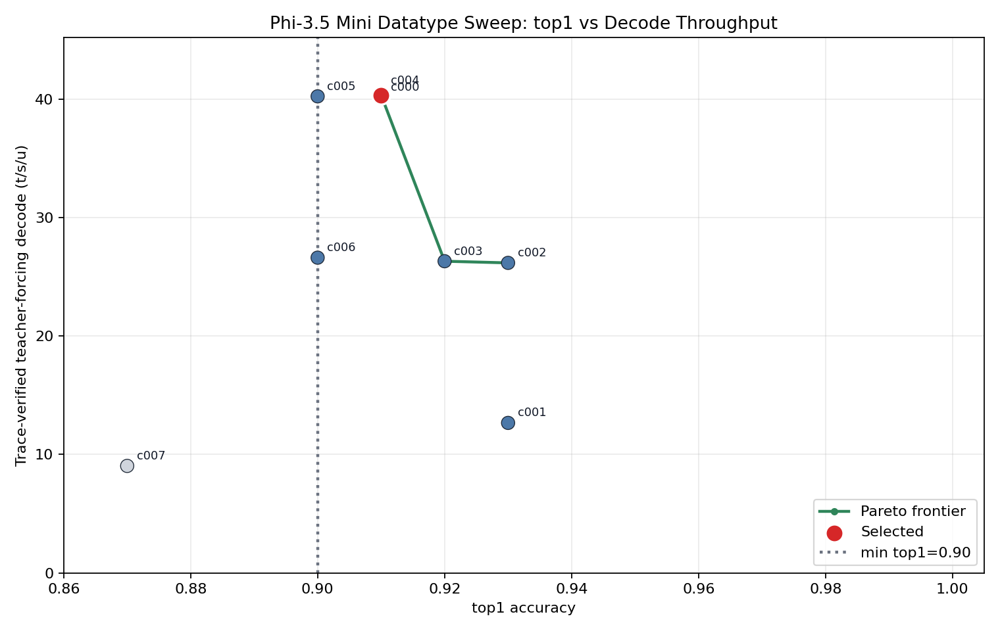
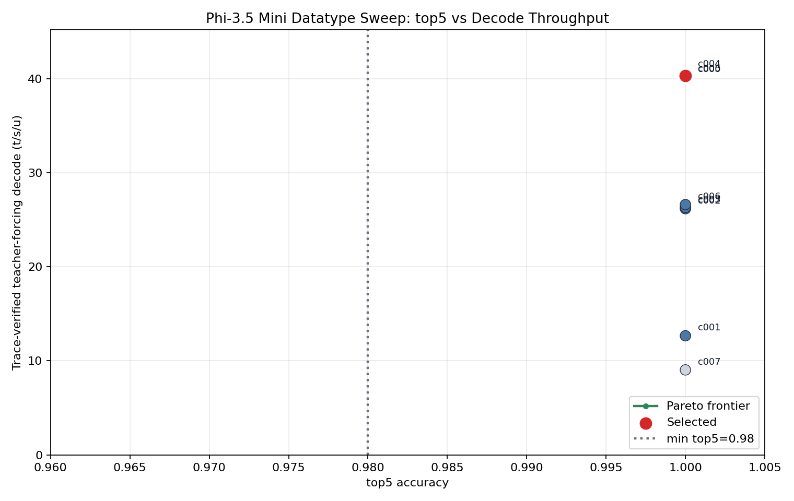

# Phi-3.5 Mini Datatype Sweep

Selected config: `c004_default_weights_bf16_ccl`. It is the fastest evaluated config that satisfies top-1 >= 90% and top-5 >= 98% on the full-model AIME24 chat-template readiness reference with 100 generated tokens.

Selected traced teacher-forcing result: top-1 91/100, top-5 100/100, top-100 100/100, TTFT 226.88 ms, decode 40.34 t/s/u.

Post-selection token-out no-readback result through the default selected-config construction path: TTFT 214.10 ms, decode 56.37 t/s/u, prompt128/gen128, 8 warmup decode steps, sampled-token readbacks 0, full-logit decode readbacks 0.

## Selected Policy

- Attention weights: BF8 qkv/o for decode and prefill.
- MLP weights: BF4 gate_up/down for decode, BF8 gate_up/down for prefill.
- Layer exceptions: none.
- Activation/residual dtype: BF16.
- Decode CCL dtype: BF16; prefill CCL dtype: BF16.
- KV-cache dtype: BF8.
- Compute fidelities: LoFi decode matmul and LM head, HiFi2 prefill matmul and LM head, HiFi4 norms/prefill SDPA.
- Logits/sampling: BF16 logits into the canonical split sampler; sampled token feedback is uint32.

`selected_precision_config.json` is consumed by default by `build_generator` via `Phi35MiniForCausalLMTT.from_hf(..., model_dir=...)` and passed into the decoder stack and KV-cache allocation. Use `PHI35_PRECISION_CONFIG=default` to bypass the selected artifact and return to the built-in optimized baseline.

## Results

| Config | top-1 | top-5 | top-100 | TTFT ms | traced TF decode t/s/u | Status |
| --- | ---: | ---: | ---: | ---: | ---: | --- |
| `c000_default_optimized` | 91/100 | 100/100 | 100/100 | 258.55 | 40.17 | pass |
| `c001_safe_bf16` | 93/100 | 100/100 | 100/100 | 3272.85 | 12.66 | pass |
| `c002_bf8_weights_kv_ccl` | 93/100 | 100/100 | 100/100 | 257.25 | 26.17 | pass |
| `c003_default_weights_bf16_kv` | 92/100 | 100/100 | 100/100 | 220.16 | 26.31 | pass |
| `c004_default_weights_bf16_ccl` | 91/100 | 100/100 | 100/100 | 226.88 | 40.34 | pass |
| `c005_inner_mlp_bf4_edges_bf8` | 90/100 | 100/100 | 100/100 | 248.23 | 40.23 | pass |
| `c006_attention_bf4_all` | 90/100 | 100/100 | 100/100 | 225.76 | 26.61 | pass |
| `c007_activation_bf8` | 87/100 | 100/100 | 100/100 | 11833.38 | 9.03 | fail_accuracy |

The BF16 canonical policy (`c001`) and BF8-weight canonical policy (`c002`) both pass accuracy but are slower. BF16 KV cache (`c003`) passes but cuts decode throughput. Restoring the first and last MLP layers to BF8 (`c005`) passes exactly at the top-1 gate and is not faster. BF4 attention (`c006`) also passes exactly at the top-1 gate but is slower. BF8 residual/activation (`c007`) fails top-1 accuracy at 87/100.

## Pareto Interpretation





Top-1 is the active gate because all configs met top-5/top-100. The selected point is the highest traced teacher-forcing decode throughput among passing full-model configs. The top-5 plot is degenerate because all evaluated configs reached 100/100 top-5; the selected point still dominates throughput at the required top-5 threshold.

## Commands

Baseline prefill:

```bash
PHI35_PRECISION_CONFIG=models/autoports/microsoft_phi_3_5_mini_instruct/doc/datatype_sweep/configs/c000_default_optimized.json /localdev/moconnor/tt-metal/python_env/bin/python -m models.common.readiness_check.run_prefill_check   --model-dir models/autoports/microsoft_phi_3_5_mini_instruct   --reference models/autoports/microsoft_phi_3_5_mini_instruct/readiness_aime24_chat_100.refpt   --mesh-device T3K --fabric-config FABRIC_1D_RING
```

Teacher-forcing candidates used the same command shape with each file under `configs/` assigned to `PHI35_PRECISION_CONFIG`.

Post-selection token-out used `build_generator(model_dir=..., mesh_device=...)` with no `PHI35_PRECISION_CONFIG` override, then `benchmark_token_out_decode(prompt128, max_new_tokens=128, warmup_decode_steps=8)`.

## Artifacts

- `sweep_results.json`
- `sweep_results.csv`
- `selected_precision_config.json`
- `top1_perf_pareto.png`
- `top5_perf_pareto.png`
- `logs/c000_prefill.log`
- `logs/c000_teacher.log` through `logs/c007_teacher.log`
- `logs/post_selection_token_out_no_readback.log`
- `perf/post_selection_token_out_no_readback_prompt128_gen128.json`

## Limitations

Performance ranking uses one full-model teacher-forcing run per config, so small differences near 40 t/s/u should be treated as run-to-run noise unless remeasured. The selection follows the stated rule: fastest evaluated passing config. vLLM integration was intentionally not started in this goal; the selected artifact is ready for a later adapter to consume through the same precision loader.
