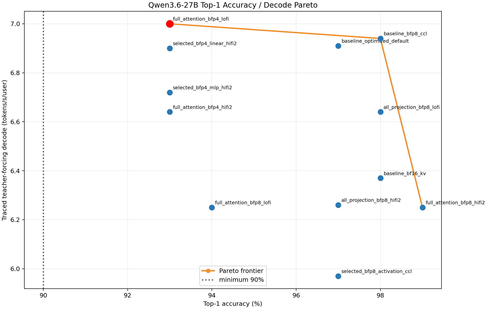
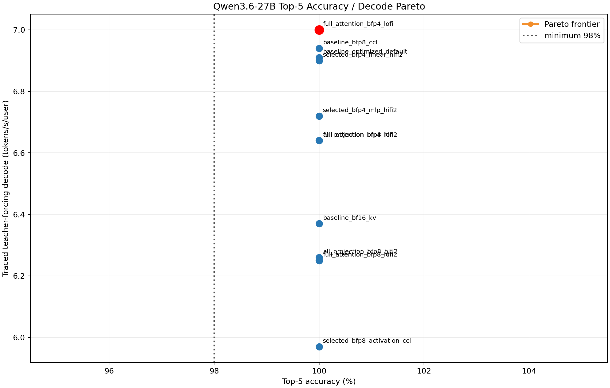

# Qwen3.6-27B Datatype Sweep

Status: complete; selected policy validated and independent stage review returned `clean-pass`.

Selected config: `full_attention_bfp4_lofi`. On the refreshed AIME24
chat-template reference (S161, 100 generated tokens), it achieves **93% top-1,
100% top-5, 100% top-100**, **5628.30 ms TTFT**, and **7.00 traced
teacher-forcing tokens/s/user**. Acceptance thresholds are top-1 >= 90%, top-5
>= 98%, and top-100 = 100%. It is the fastest passing evaluated full-model
configuration.

Post-selection warmed token-out, through the normal default construction path:
**5244.60 ms TTFT and 17.8968 tokens/s/user**, B1/S128/G128, 128 no-readback
model+sampler trace replays. This token-out result is the serving-comparison
number; teacher forcing is retained only as the datatype selection metric.

## Selected runtime policy

- Full-attention QKV/O, linear-attention internal/input/output projections, and
  MLP gate/up/down weights: BFP4_B.
- Full-attention SDPA/QKV/O, linear projection/internal, and MLP compute: LoFi.
- Linear recurrent compute: HiFi2; persistent recurrent state: BFP8_B.
- Residual/activation stream: BF16. Token-mixer and MLP CCL payloads: BF16.
- Paged KV cache: BFP8_B. LM-head weights/output and sampling logits: BFP8_B;
  LM-head compute: HiFi2; sampled token storage: UINT32.
- Layer exceptions: none. First/last layers use the selected global policy.

The authoritative artifact is `selected_precision_config.json`. `build_generator`
and `Qwen36Model.from_pretrained` load it automatically when no override is
given. The model passes a resolved policy to every layer, passes CCL and LM-head
fields to their actual runtime boundaries, rejects unsupported residual/sampler
assumptions, and emits a `PRECISION_CONFIG` summary containing the source path,
SHA-256, and all 64 constructed layer policies. Candidate logs retain that
summary. `QWEN36_PRECISION_CONFIG=<path>` is the explicit safe rollback/candidate
override. No vLLM adapter exists in this stage; the later adapter must use the
same `build_generator` construction boundary rather than bypass this required
artifact.

## Full-model candidate results

| config | top-1 | top-5 | top-100 | TTFT ms | traced TF t/s/u | decision |
|---|---:|---:|---:|---:|---:|---|
| baseline optimized default | 97% | 100% | 100% | 5153.68 | 6.91 | pass, slower |
| BF16 KV control | 98% | 100% | 100% | 5228.13 | 6.37 | pass, slower |
| full-attention BFP8 + HiFi2 | 99% | 100% | 100% | 6564.51 | 6.25 | pass, dominated |
| full-attention BFP8 + LoFi | 94% | 100% | 100% | 6335.04 | 6.25 | pass, dominated |
| full-attention BFP4 + HiFi2 | 93% | 100% | 100% | 5690.18 | 6.64 | pass, slower |
| **full-attention BFP4 + LoFi** | **93%** | **100%** | **100%** | **5628.30** | **7.00** | **selected** |
| all-projection BFP8 + HiFi2 | 97% | 100% | 100% | 5139.08 | 6.26 | pass after AutoFix, slower |
| all-projection BFP8 + LoFi | 98% | 100% | 100% | 5135.28 | 6.64 | pass after AutoFix, slower |
| baseline + BFP8 CCL | 98% | 100% | 100% | 9543.10 | 6.94 | pass, slower |
| selected BFP4 + MLP HiFi2 | 93% | 100% | 100% | 5125.51 | 6.72 | pass, LoFi faster |
| selected BFP4 + linear HiFi2 | 93% | 100% | 100% | 5125.87 | 6.90 | pass, LoFi faster |
| baseline weights + BFP8 residual/CCL | 97% | 100% | 100% | 5170.21 | 5.97 | pass after AutoFix, BF16 faster |

Every material BFP4 group selected uses LoFi and has a dtype-matched HiFi2
full-model comparison: full-attention 6.64, linear-attention 6.90, and MLP 6.72
t/s/u, all below selected LoFi at 7.00. BFP8 MLP-down initially exposed a real hard-coded
geometry bug: width 17 caused an L1/CB overlap. `AUTODEBUG.md` and `AUTOFIX.md`
show the isolated width-17/width-1 experiment, policy-field plumbing fix, and
successful reruns. The BFP8 activation/residual+CCL candidate also required a
local BF16 adapter for the exact `nlp_create_qkv_heads_decode` input contract;
it then passed at 5.97 t/s/u and was rejected as slower.

## Pareto interpretation

Both plots include every completed full-model candidate as blue/red points, with the non-dominated
frontier, selected point in red, and dotted accuracy threshold. Top-5 is tied at
100% for every candidate, so performance decides that frontier. Top-1 exposes
the selected speed/accuracy tradeoff: 93% is above the 90% gate and 7.00 t/s/u
is the best traced throughput.

## Capability and quality

The selected BFP8 KV/state dtypes preserve the prior cache layout. Physical
capacity was nevertheless recomputed using selected BFP4 weight residency:
B1 passes the advertised 262,144 tokens; B32 improves to a largest feasible
78,016 tokens with 78,080 the smallest failure. `doc/context_contract.json` now
points to these isolated worker artifacts and records no capability reduction.

The mixed-slot public gate passes non-aligned S65/S63, inactive-KV exactness,
and reset/reuse. AIME24 also exercises S161/S261. The selected six-prompt shared
suite uses the exact checkpoint chat template and 50 greedy tokens with matched
HF controls; all cases are coherent and show no mechanical repetition, wrong
language, prompt/control-token leakage, or corruption.

## Artifacts

- `sweep_results.json` / `sweep_results.csv`: 12 complete policy, metrics, command,
  trace regime, hardware/mesh, commit, and pass/fail rows.
- `selected_precision_config.json`: default runtime policy.
- `top1_perf_pareto.png` / `top5_perf_pareto.png`: Pareto charts.
- `artifacts/selected_token_out_b1_s128_g128.json`: post-selection token-out.
- `artifacts/selected_non_aligned_mixed_slots.json`: non-aligned/cache gate.
- `artifacts/selected_qualitative_shared_suite.json`: prompt metadata and HF/TT
  outputs.
- `artifacts/capacity_bfp8_selected*/capacity_b*.json`: selected capacity proof.
- `logs/`: exact reference, candidate, token-out, qualitative, and capacity logs.

Commands, hardware recovery details, limitations, and checkpoint SHA are in
`work_log.md`.
