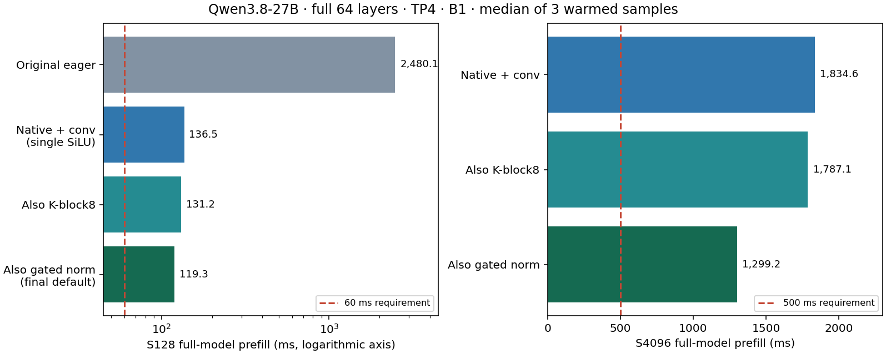
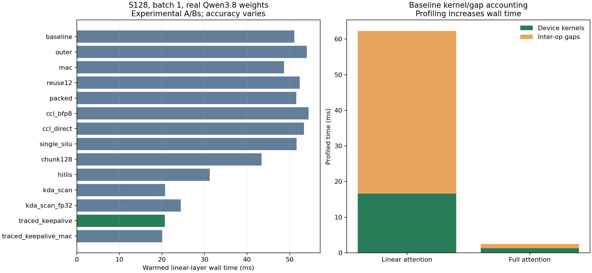

# Qwen3.8 TP4 prefill device investigation

Investigation started 2026-09-11; follow-up integration checks are ongoing. The runtime directory retains its Qwen3.6 name;
experiments explicitly load Qwen3.8 revision
`1d4bf0f2ff6012fd82039f2fa52739d0dd7c60c0` and the selected precision JSON.

## Latest measured result

The integrated native GDN graph reduced **full 64-layer B1 S128 prefill
from 2480.102 ms to 119.301 ms (20.79×)** in a matched generator
harness. Full-model S4096 measured **1299.242 ms**. The selected graph uses native
GDN, flat QKV/direct log-decay, larger outer chunks, supported fused convolution,
dedicated gated RMSNorm, K-block limit8, and one MLP SiLU. Fresh pinned Qwen3.8
checks measured **99/100 top1 and 100/100 top5** for both prefill and teacher
forcing; the run counted1872 flat-native calls and zero rank4 calls.

The first live benchmark measured **890.998ms median HTTP TTFT** at
ISL128/OSL252/C1 (4/4 requests), and **13039.632ms** for the
ISL4096/OSL252/C8 burst (8/8). The sampled-text failure was reproduced
as TP rank token disagreement and repaired with shared per-step entropy seeds.
The production full64 check passes574 decode observations; the final live
sampling/quality/benchmark rerun remains in progress before CI dispatch.

The119.301/1299.242ms figures are warmed generator measurements, **not
serving/CI TTFT**. Their remaining gaps are1.988×/2.598× against60/500ms.
Actual short-point HTTP TTFT remains14.85× above60ms.
The full-batch32 native test exposed a core-count limit; device-side batch
tiling now passes both aligned S128 and ragged S65 lifecycle checks across
four layers with all 32 rows active. Live serving validation remains in progress.
Required-point CI has not yet been dispatched.

See [the complete additional-work and pipeline-gap ledger](PIPELINE_GAPS.md)
for all follow-up actions, failed hypotheses, full-model artifacts, production
changes and proposed automatic gates. See [native operator experiments](native_gdn_followup.md)
for the shape/dtype adapter and higher-precision recurrent-state oracle.



## Initial investigation (historical baseline and experiments)

The first pass's protected recurrence trace measured 2537.329 → 998.780 ms
(2.540×) on a full64 S128 probe with additional per-layer synchronization.
It was an experiment, not a serving default. Native GDN supersedes that
candidate. The sections and chart below retain the initial measurements;
do not combine their timing regime with the latest generator medians above.
The old explanation that TTFT was entirely a device per-op floor was incorrect:
eager dispatch/runtime gaps were substantial.



## Contract and baseline

Target: warmed batch-1 cold-context prefill latency (no prefix cache). This is
different from first-ever kernel compilation and from warm-prefix/APC TTFT.
The server handles prefills through `generator_vllm.prefill_forward` →
`generator.prefill_forward` → `model.single_slot_prefill_view` → the TP4 stack.
Its single active request is narrowed to batch 1 even with a 32-slot allocation.
Linear attention has 12 local value heads, not 384 active groups. Decode uses
the full slot allocation and a different traced path.

No live server is profiled. `probe.py` uses real embeddings/weights, generator
masks/selectors, paged state and terminal logits. Device profiles contain only
layers 0 and 3 plus embedding/final norm/head. Layer 0 gets the correct embedding
activation; layer 3 gets layer 0's output without layers 1 and 2, so its values
are a reduced-stack control, not a full-stack accuracy result. Profiling and
unprofiled timing runs are separate. Per-layer timing adds explicit mesh
synchronization; full serving TTFT includes additional scheduling/sampling.

Fresh unprofiled S128 baseline: linear layer 0 **51.119 ms**, full-attention
layer 3 **2.193 ms**, reduced generator **62.937 ms** (medians of three warmed
runs). The selected policy uses BFP4 projection weights/LoFi, BF16 residuals
and CCLs, BFP8 KV and recurrent caches. The host exposes four Blackhole p300c
devices; bounded `tt-smi -ls --local` passed. The generic AGENTS.md statement
that this runner has no accelerator does not describe this session.

## Hypotheses registered before candidate measurements

| Candidate | Change and constraint | Prediction for S128 linear layer | Why the target is limited |
| --- | --- | --- | --- |
| Outer product | Replace `[12,1,128,1] @ [12,1,1,128]` with broadcast multiply; preserve rank-one algebra | 3–10% faster | Removes padded inner-dimension arithmetic, but still dispatches one op per token |
| Hoisted transpose | Transpose K once per 32-token chunk, then slice | A further 0–5% | A transposed-K slice replaces each transpose, so op count barely changes |
| Hillis scan | Existing batched affine compositions, explicit 8×10 reuse config | 1.5–2× faster at batch 1 | Prior S4096 full-model evidence is 1.82×; materializes 128×128 transition matrices |
| KDA affine scan | Build rank-one transitions, run fused exclusive scan in groups of eight tokens (12×8=96 workers), apply transitions to entries | 2–5× faster, approximately 10–25 ms/layer | FP32 entry/output requirement, transition construction and materialization remain; no claim of meeting 60 ms full-model TTFT |
| Single SiLU | `_prefill_program` already fuses SiLU; suppress second standalone SiLU | One unary op per MLP subchunk | Correctness repair as well as op removal; must compare against intended single-SiLU formula, not require equality to double-SiLU incumbent |
| CCL dtype | Audit row output payload and test BF16 vs BFP8 | Small on current recurrence-dominated graph | Each conversion has a latency floor; changing CCL precision needs model-visible correctness evidence |

The arithmetic extrapolation `48*linear + 16*full` is a layer-stack estimate,
not measured TTFT. Any end-to-end claim must be checked with the complete model.

## Initial operation-topology audit

| Boundary | Current graph / local shapes | Candidate / caveat |
| --- | --- | --- |
| Linear input | Four projections of the same `[1,B,32,5120]`: QKV→2560, Z→1536, beta/decay→12 each | Pack projections once, with device-major weights and correct head ordering; 12-wide outputs currently tile-pad to 32 |
| Convolution | Permute, concatenate four-token history, four slices/multiplies, three adds, state copy, permute, SiLU | KDA conv exists, but TP4 prefill override remains composite; cache selectors must preserve ragged/inactive slots |
| Q/K head expansion | Four key heads repeated to 12 value heads; permutes/reshapes, L2 norm | Keep grouped broadcasting if recurrence consumer supports it; avoid physically repeating before norm |
| Sequential recurrence | Per token: five slices, decay multiply, three matmuls, subtract, beta multiply, transpose, add | Outer-product multiply; fused scan; do not confuse low host gaps with absence of device per-op cost |
| Recurrent cache | BFP8→BF16 on chunk entry; BF16→BFP8 then copy on exit | Direct typecast into persistent output can remove a copy; retaining BF16 between chunks changes rounding and is not automatically equivalent |
| Linear output | RMS norm, SiLU(Z), multiply, layout conversion, 1536→5120 row projection + all-reduce every 32 tokens | Fuse gate unary into multiply; move output projection/all-reduce outside recurrence chunk loop if memory permits |
| MLP | 5120→4352 gate and up; gate fused SiLU **plus standalone SiLU**, multiply, 4352→5120 + all-reduce | Correct duplicated SiLU, pack gate/up only if split/activation traffic pays back; prefill chunks cap B×S at 2048 rows |
| CCL | Replicated residual, TP4 ring, one link, cluster axis 1; row outputs `[1,B,C,5120]` BF16 | Reduce-scatter plus gather establishes next replicated boundary; removing gather requires a compatible residual/norm/projection contract |
| Full attention | Packed QKV+gate, split/permute, per-head norms/partial RoPE, BFP8 cache fills, SDPA 8×8 with 64/64 chunks, sigmoid gate, row projection+all-reduce | Tune SDPA at long S separately; cache-fill typecasts implement the required cache dtype |

CCL routing currently recognizes `mlp_down_decode` but not `mlp_down_prefill`.
The latter therefore selects the token-mixer dtype. This does not affect the
shipped BF16/BF16 policy, but invalidates a nominal MLP-only prefill dtype sweep
unless corrected in the experiment. Likewise decode-named candidate switches
must not be assumed to affect prefill.

## Fresh profile: the old per-op-floor explanation is incomplete

The S128 real-weight generator profile covers **2,218 device operations** in
linear layer 0. The advice-enabled `tt-perf-report` has **16.629 ms kernel time
and 45.647 ms gaps**, totaling 62.276 ms versus a 62.103 ms synchronized layer
measurement. A separate check using **device 0 alone**, avoiding merged-device
accounting, gives 16.282 ms kernels + 45.905 ms gaps in a 62.178 ms signpost
window. Thus the gap is not an artifact of summing four devices.

| Linear layer operation family | Calls | Kernel ms | Gaps charged to these rows, ms |
| --- | ---: | ---: | ---: |
| Matmul | 407 | 8.938 | 6.978 |
| Binary elementwise | 619 | 3.009 | 16.979 |
| Slice | 688 | 1.374 | 13.234 |
| Reshape view | 56 | 0.851 | 0.765 |
| Untilize with unpadding | 52 | 0.531 | 1.935 |
| Tilize with value padding | 48 | 0.356 | 0.624 |
| Transpose | 164 | 0.287 | 1.935 |
| Permute | 32 | 0.285 | 0.079 |
| All-gather + reduce-scatter | 10 | 0.203 | 0.413 |
| Typecast | 16 | 0.100 | 0.476 |
| Copy | 8 | 0.013 | 0.144 |

Gaps are time **between** device operations, attributed to the following row;
they are not kernel execution and should not be interpreted as the named op's
arithmetic cost. Profiling increases the layer's wall time from 51.119 to
62.103 ms, so its gap percentage is not an unprofiled host-utilization metric.
However the bit-exact trace experiment removes about 30 ms from the unprofiled
layer. Together these observations directly refute the assertion that all the
~32 µs obtained by dividing end-to-end time by source-op count is kernel time.
Eager submission/runtime overhead is material on this checkout.

The three per-token recurrent matmuls account for 7.749 ms of kernel time:
256 vector/state products at 20.47 µs each on **4 cores**, and 128 padded
rank-one updates at 19.60 µs each on **16 cores**. The small effective matmul
occupancy is real, but a different 12-core batched-reuse config is not by itself
a win. The source's generic dense scan config cannot safely be applied to all
degenerate shapes without considering batch/grid divisibility.

Full-attention layer 3 has only **62 operations**, 1.242 ms kernels + 1.224 ms
gaps in a 2.490 ms synchronized profile. Its 2.193 ms unprofiled cost is already
small compared with the 48 linear layers. Long-context SDPA deserves its own
shape sweep; these S128 numbers do not establish its cost at 131K.

### Protected trace profile

The final reduced S128 profile contains **2250 operations per device on all four
devices**, versus 2218 baseline: input refresh copies and output clones add 32
operations across four chunks. Advice-enabled report accounting gives
**19.270 ms kernels + 6.165 ms gaps**, against 24.716 ms synchronized wall and
24.816 ms host-signpost duration. The merged accounting sum is about 3% above
wall time; do not interpret it as an exact non-overlapping timeline. Device 0
alone contributes 18.429 ms kernel time. Trace replay changes scheduling and
adds copy/clone work; it does not make the recurrence's arithmetic faster.
The gap reduction from 45.647 ms to 6.165 ms corroborates the unprofiled A/B.

The final profile is in `traced_linear_perf.csv`, its compressed advice report,
and `traced_linear_summary.json`. Reproduce using the profiling command below
with `--candidate traced_keepalive` and a different output directory. Its extra
eager warmup and capture increase raw profiler volume even with only two layers;
full-model profiling remains disabled.

### Tensor storage and communication

The recurrence's logical scalar/vector shapes are particularly wasteful in
tile layout. At B1 and a 32-token chunk:

| Tensor per device | Logical shape | Padded storage in BF16 |
| --- | --- | ---: |
| Q, K or V in recurrence order | `[12,32,1,128]` | 3 MiB each (32× logical size) |
| Beta or decay | `[12,32,1,1]` | 0.75 MiB each (1024× logical size) |
| One recurrent state | `[12,1,128,128]` | 0.375 MiB |
| Dense affine transitions, Hillis/KDA | `[12,32,128,128]` | 12 MiB each |

These are padded tensor bytes, not a measurement of bytes read by each kernel.
A fused recurrence can consume token-major rows without materializing scalar
tiles or rereading the entire state for every primitive. Merely reshaping a
tensor to those logical dimensions does not eliminate its padded storage.

Each linear layer reduces four attention outputs `[1,1,32,5120]` and one MLP
output `[1,1,128,5120]`, all BF16. The reduce-scatter outputs have width 1280 and
are gathered back to the replicated 5120 residual. Each full layer has two
S128 reductions. Standard four-rank ring accounting predicts 1.5× the input
payload per rank for reduce-scatter plus all-gather: **3.75 MiB/rank/layer** at
S128 for either layer kind. This is an algorithmic byte model, not a physical
fabric-counter measurement. In fact, the four small reductions select
`ReduceScatterMinimalDirectDeviceOperation`; the ring byte model is a comparison
budget, not proof of that kernel's physical transfer schedule. Attention's four
small reductions pay more startup
cost than one S128 reduction.

BFP8 storage costs 1088 bytes/tile versus BF16's 2048, a **46.875% payload
reduction**, not exactly 50%. Both explicit cast-to-BFP8 CCLs and direct BFP8
row-matmul output were tested. Neither improved the S128 layer: the current
collectives are too small for byte savings to overcome conversion/setup cost.
The runtime also warns that its 4352-byte fabric packet is suboptimal for
2048-byte pages and recommends 8192 bytes. Even eliminating all CCL kernel time
would save only 0.203 ms of this linear layer; packet tuning cannot solve TTFT.

## Measured hypotheses and misses

All times below are medians of three warmed runs at S128, using real weights
and the same reduced generator. The [machine-readable table](artifacts/candidate_summary.json)
and individual JSONs contain every sample and output comparison. Small changes
around 1% are inconclusive with this sample count; this is a hypothesis screen,
not a confidence-interval study. No candidate changes the shipped precision JSON.

| Candidate | Linear ms | Speedup vs 51.119 ms | Outcome / explanation |
| --- | ---: | ---: | --- |
| Broadcast rank-one multiply | 54.019 | 0.95× | Missed predicted 3–10% gain. Removes padded matmul arithmetic but retains a dispatch and broadcast work; algebra alone did not make this op faster. Exact SFPU/broadcast attribution was not separately profiled. |
| Fused MAC state update | 48.679 | 1.05× | Removes one primitive per token; modest gain, state PCC 0.999872 versus baseline. |
| 12-core reuse matmul | 52.392 | 0.98× | More balanced head/core mapping failed to improve latency; tiny matrix dimensions and dispatch remain. State PCC 0.999771. |
| Packed QKV/Z/beta/decay | 51.567 | 0.99× | Bit-exact, but only saves three projection launches per chunk; padded packed width and split traffic remain. |
| BFP8 CCL, explicit casts | 54.437 | 0.94× | Payload reduction does not repay conversion/setup at these small messages. |
| BFP8 CCL, direct row output | 53.390 | 0.96× | Avoiding the input cast still failed; restoring BF16 residual and collective startup remain. |
| Remove duplicate SiLU | 51.653 | 0.99× | Negligible speed effect. Changes the incumbent function; requires intended-function accuracy assessment. |
| Chunk size 128 | 43.413 | 1.18× | Fewer projection, cache-roundtrip and collective boundaries; state PCC 0.999887. Changes BFP8 cache rounding frequency. |
| Existing Hillis scan | 31.240 | 1.64× | Meets 1.5–2× speed hypothesis, but terminal recurrent state PCC only 0.961692, relative L2 0.2906. |
| Fused KDA affine scan | 20.715 | 2.47× | Meets 10–25 ms hypothesis, but state PCC 0.993154, relative L2 0.1374. |
| KDA with FP32 transitions | 24.446 | 2.09× | More precision did not repair error; terminal state relative L2 0.1478. |
| Protected recurrence trace | 20.689 | 2.47× | Checked values bit-exact; material dispatch reduction without arithmetic changes. |
| Protected trace + MAC | 20.059 | 2.55× | Only another 3% over trace alone; no longer bit-exact. Not promoted over the exact candidate. |

The two BFP8 CCL candidates changed reduced-stack logits by relative L2 0.00862
and 0.00852 respectively, with the same final top-1 and exact layer-0 recurrent
cache. The cache equality is expected because these reductions follow recurrence;
it does not establish whole-model precision equivalence. MAC, chunk128 and
single-SiLU also kept this prompt's top-1 while changing logits. Only the
protected original-arithmetic trace was taken through the full 64-layer A/B.

Hoisting K transpose was proposed but not measured: replacing transpose-per-token
with slice-per-token does not clearly reduce launch count. Long-context SDPA
chunk/fidelity sweeps, fused convolution, gate/up fusion, moving output projection
outside the chunk loop, and a purpose-built recurrent kernel remain proposals,
not measured improvements. The profiler's L1-placement and output-subblock advice
is retained in the reports; it is not evidence that those configurations win.

### Duplicate SiLU: intended-function check

On the identical TT LoFi/BFP4 gate projection with activation disabled, a Torch
oracle confirms the source diagnosis. Layer 0's incumbent output has relative
L2 **0.49056** against one SiLU and **0.00261** against two; removing the duplicate
has relative L2 **0.00177** against one. Layer 3 independently shows the same
pattern. This establishes a local correctness repair, not a full-model accuracy
pass. Both oracle JSONs are retained; the corrected function intentionally differs
from the baseline used by the bit-exact trace comparison.

### Why fast scan is not yet an acceptable replacement

The equivalent real-number update is `S' = d*(I - beta*kᵀ*k)*S + beta*kᵀ*v`.
The KDA experiment constructs these dense transitions, scans eight tokens at a
time, then applies each transition to its exclusive entry state. Twelve local
heads × eight tokens fit 96 workers. It uses the existing fused affine scan,
not a new kernel. The first attempt failed because a BF16 inclusive output became
the next scan's initial state, which must be FP32; explicitly casting every
entry repaired that API mismatch.

Output PCC alone hid state error. A separate FP64 recurrence oracle consumes
the **same real TT-preprocessed** Q/K/V/beta/decay and incoming cache for the first
32-token chunk. Baseline state relative L2 is **0.00851**, versus **0.06739** for
KDA. Promoting transition construction and inclusive accumulation to FP32 gives
**0.06650**, so BF16 transition storage alone does not explain the miss.
Different association, dense affine products and kernel math fidelity still
need isolation. We did not establish a specific kernel defect or a full-model
accuracy pass. Hillis/KDA are therefore performance evidence, not accepted fixes.
See `baseline_oracle_s128.json`, `kda_scan_oracle_s128.json`, and
`kda_scan_fp32_s128.json` in [artifacts](artifacts/).

### Why the first trace failed

The initial 20.651 ms trace corrupted hidden states (up to 3.78e25), despite
apparently matching recurrent caches, and a subsequent S32 diagnostic hung.
That result is rejected. Allocation tracking rejected replay with three live
copy-program buffers allocated after capture. The passing experiment warms the
whole eager path and input copies before capture and retains Python-visible
intermediate buffers until trace release. It caches one shape-compatible
recurrence trace shared across chunks and layers, refreshing its six inputs and
cloning returned outputs so callers cannot deallocate persistent trace storage.

See [AUTOTRIAGE.md](AUTOTRIAGE.md), [AUTOFIX.md](AUTOFIX.md), and
[trace_keepalive.py](trace_keepalive.py). The exact overwritten reshape mapping
is a hypothesis, not a proven victim. One bounded reset and mesh-open/close smoke
recovered the hardware; subsequent runs completed. Warmup and retention were
changed together, so their separate contributions are not established.

The protected S128 trace retains 420 Python tensor objects and 424 deduplicated
buffers including inputs/outputs. Tile-packed accounting gives approximately
**75.6 MiB/device**, plus a reserved 32,000,000-byte command-trace region. This is
not allocator peak usage. The experimental hook changes process-wide TTNN
behavior during capture and does not retain temporaries entirely internal to
C++ operations. Production integration needs explicit buffer ownership and
capacity/interleaving validation; copying this hook into the server is not a
validated deployment solution.

## Full-model reconciliation

| Same harness, full 64 layers, S128 | Baseline | Protected trace |
| --- | ---: | ---: |
| Three warmed prefill samples, ms | 2509.823, 2537.329, 2560.851 | 998.780, 997.230, 1003.546 |
| Median, ms | 2537.329 | 998.780 |
| Mean of 48 linear-layer medians, ms | 51.184 | 19.605 |
| Mean of 16 full-attention-layer medians, ms | 2.199 | 2.234 |
| Sum of all layer medians, ms | 2491.991 | 976.796 |

Reduced-layer extrapolation predicted baseline `48*51.119 + 16*2.193 = 2488.8 ms`,
within 1.9% of full prefill. Protected tracing predicted about 1031.7 ms for the
layer stack, or roughly 1077 ms including the baseline's 45 ms outside layers;
the measured 998.8 ms is about 7% better. Full-stack linear layers averaged
19.605 rather than the reduced probe's 20.689 ms, and time outside synchronized
layers fell to about 22 ms. Sums of independently taken medians are an explanatory
approximation, not an exact decomposition of one execution.

Correctness checks compare separate baseline/experimental runs with the same
prompt. Full-stack terminal logits and captured layer-0/3 outputs, convolution,
recurrent and KV caches are exactly equal. Captures are from the first traced
prefill after eager warmup; the subsequent three timed prefills establish
repeated completion, but their intermediate tensors were not independently
compared. This is one-prompt prefill equivalence, not dataset-level accuracy,
long decode, arbitrary multi-request scheduling or full advertised-context
validation. No full-stack device profiler was enabled.

The older CI 3141 ms and current 2537 ms figures have different harness/run
conditions and are not a before/after improvement claim. The 2.540× comparison
uses matching runs of this probe. It excludes vLLM scheduling, sampling and
network time; no serving TTFT gain has been measured or deployed.

### S4096 scaling control

A reduced-stack S4096 A/B also passed exact captured output/cache/logit
comparisons. Linear layer 0 fell **1670.163 → 573.517 ms (2.91×)**; full attention
was **16.875 → 16.904 ms**. Reduced generator latency fell
**1714.885 → 617.528 ms (2.78×)**. This uses 128 successive S32 chunks and keeps
one recurrence trace; it strengthens changed-input replay coverage beyond S128.
The 64-layer layer-sum extrapolation is about 80.44 s baseline versus 27.80 s
protected, but **no full-model S4096 or serving S4096 run was measured here**.
These estimates exclude non-layer costs and cannot replace an end-to-end check.
Reproduce using `--sequence 4096` on the paired reduced commands below.

## Priorities and remaining performance budget

1. Integrate recurrence tracing with explicit persistent scratch ownership, then
   validate long decode, mixed request lifetimes and memory capacity. The observed
   full-model opportunity is about **1.54 seconds at S128** on this checkout.
2. Fuse sequential recurrence in a kernel that keeps the 128×128 state resident
   and consumes token-major vectors/scalars. Baseline recurrence matmuls alone
   cost 7.75 ms/layer; removing that entire measured cost would save about 372 ms
   across 48 layers. This is an upper bound on that component, not a promised
   kernel gain: replacement arithmetic and memory traffic still cost time.
3. Combine larger chunks with output projection/CCL reorganization after checking
   changed cache rounding. The eager 15% chunk gain cannot simply be multiplied
   by the trace gain because both remove some boundary/submission work.
4. Correct duplicate SiLU and CCL role routing with full-model accuracy evidence.
   Treat these as correctness/configuration fixes, not the main TTFT solution.
5. Reprofile long prompts before optimizing SDPA and fabric bandwidth. Extrapolating
   S128 message costs to 4096 or 131K without measurement is not justified.

Even an unrealistically free linear recurrence does not automatically establish
60 ms: full-attention layers alone cost about 35 ms in this harness, and projections,
MLPs, cache movement, embeddings/head and boundaries remain. The measured scan
and trace experiments match the roughly 2–3× opportunity, not the roughly 42×
needed from the current 2537 ms baseline to reach 60 ms.

## Reproduction and validation

Run from the repository root with the existing built environment. No dependencies
were installed. Source baseline is commit
`761f5e2ff138f173f80c4681bb087b77a08f7e08`. The initial experiments below ran
against that runtime. The follow-up changes the production graph as described
in PIPELINE_GAPS.md; the precision JSON remains unchanged. Historical
monkeypatch experiments should be reproduced against their baseline source,
not assumed compatible with all subsequently integrated graph rewrites. The
four preexisting readiness log/JSON changes are unrelated user work.

```bash
export PYTHONPATH=.
export HF_HUB_OFFLINE=1
export QWEN_AUTOPORT_MODEL_ID=Qwen/Qwen3.8-27B
export QWEN_AUTOPORT_MODEL_REVISION=1d4bf0f2ff6012fd82039f2fa52739d0dd7c60c0
analysis_dir=models/autoports/qwen_qwen3_6_27b/doc/prefill_device_analysis
python_env/bin/python "$analysis_dir/probe.py" --candidate baseline \
  --save /tmp/qwen_baseline_s128.pt --result /tmp/baseline_s128.json
python_env/bin/python "$analysis_dir/probe.py" --candidate traced_keepalive \
  --reference /tmp/qwen_baseline_s128.pt --result /tmp/traced_keepalive_s128.json
```

Use `--full` on **both** commands and separate reference filenames to reproduce
the 64-layer result. Use `--candidate` for the table's other candidates; `chunk128`
also requires `QWEN36_LINEAR_PREFILL_CHUNK_SIZE=128` before Python starts.
`--oracle` checks the first recurrence chunk against FP64, and `--check-silu`
checks actual gate output against one and two applications of SiLU. These checks
run during warmup, outside recorded timing. Comparisons record errors rather
than silently applying an arbitrary PCC acceptance threshold.

The `traced` candidate and `--trace-recurrence` are unsafe diagnostic paths,
not recommended benchmark options: the former produced the documented corruption
and hang, and the latter does not implement the protected ownership scheme.
Use `traced_keepalive` for the demonstrated candidate.

Reduced baseline device profiling was run separately:

```bash
TT_METAL_PROFILER_PROGRAM_SUPPORT_COUNT=8192 python_env/bin/python -m tracy \
  -r -p -o /tmp/qwen_prefill_profile_baseline "$analysis_dir/probe.py" \
  --iterations 1 --result /tmp/profile_baseline_s128.json
# raw_csv is the generated reports/<timestamp>/ops_perf_results_<timestamp>.csv
python_env/bin/tt-perf-report "$raw_csv" --start-signpost LAYER_0 \
  --end-signpost LAYER_0_END --no-color --csv /tmp/baseline_linear_perf.csv
python_env/bin/tt-perf-report "$raw_csv" --start-signpost LAYER_0 \
  --end-signpost LAYER_0_END --no-color --no-summary > /tmp/baseline_linear_perf.txt
```

Repeat report extraction with `LAYER_3`/`LAYER_3_END` for full attention. Advice
remained enabled. Compact CSVs, grouped summaries and plots are retained in
[artifacts](artifacts/); the repetitive linear advice report is gzip compressed.
The raw multi-GB capture stays at the path in [provenance.json](artifacts/provenance.json).
Regenerate the overview without hardware using `python_env/bin/python
"$analysis_dir/summarize.py"`.

A separate S33 reduced-stack control with 32 allocated slots, only slot 17 active,
passed exact baseline comparisons for the captured layer outputs, logits and
whole layer-0/3 cache tensors, including inactive slots. Reproduce with
`--batch 32 --active-slot 17 --sequence 33` on both baseline and protected commands.
This exercises the generator's serving-style single-slot narrowing and a ragged
last chunk, but not interleaved decode or a production server.

Watcher validation was attempted with `TT_METAL_WATCHER=100`, separate from the
profiler. It failed **before model execution**, during `open_mesh_device`:
instrumented ACTIVE_ETH program size 29072 exceeds its 26624-byte configuration
buffer, followed by a teardown segfault. The
[complete startup failure](artifacts/watcher_startup_failure.txt) is retained.
Normal device listing and a TP4 ring mesh open/close then passed without another
reset; the same ragged probe passed without watcher. This is unavailable watcher
coverage, not a passing sanitizer check or a demonstrated model failure.

### Configuration ledger

The default and protected trace share the selected precision and graph:

| Component | Effective prefill contract |
| --- | --- |
| Projection weights | TP4 device-major shards, tile DRAM; BFP4/LoFi QKV, Z, beta/decay, attention output and MLP |
| Projection activations/residual | BF16 DRAM interleaved, replicated hidden width between row reductions |
| Prefill projection program | 2D multicast reuse, grid X=8 and policy grid Y; `per_core_N=ceil(local_N/256)`, `per_core_M=max(1,ceil(rows/(32*grid_Y)))`; K block divides K/32 and respects policy limit; output subblock H=1, W≤4 dividing per-core N |
| Linear recurrence | BF16 Q/K/V/state compute, HiFi2; automatic programs for logical vector/rank-one shapes; BFP8 state persisted each 32-token chunk |
| Dense scan trials | 8×10 batched reuse for full 128×128 products; 3×4 candidate tested separately for 12-head degenerate matmuls |
| Full-attention head path | Packed QKV+gate, local Q/K normalization, partial rotary embedding, BFP8 paged KV cache |
| SDPA | LoFi; 8×8 grid, Q/K chunks 64/64; not swept at long context in this investigation |
| Residual/norm | BF16 replicated residual, current norm path preserved; no distributed-residual layout change |
| MLP geometry | Per device 5120→4352 gate and up, 4352→5120 down; prefill subchunks ≤2048 rows; current gate includes double SiLU except explicit repair trial |
| CCL | BF16 DRAM→DRAM, cluster axis 1, tensor dim 3, four-rank ring, one link; reduce-scatter + all-gather; no new persistent collective buffers |
| LM head | BFP8 weights/output, HiFi2, unchanged generator logits path |

Actual per-op input dtype, memory, fidelity, block/subblock sizes, core counts,
kernel times and profiler advice are in the retained CSVs. Defaults not explicitly
overridden by the probe remain runtime-selected; no undocumented worker/buffer
CCL setting is claimed to have been tuned. This report is a scoped prefill
investigation, not a completed optimize-stage certification for decode/serving.

Host verification passed: repository pre-commit hooks on the three Python files
and edited/authored Markdown, independent AST parsing, strict parsing of all
retained JSONs, and `git diff --check -- models/autoports/qwen_qwen3_6_27b/doc`.
The unrestricted repository-wide whitespace check reports preexisting readiness
logs, which were left intact. This change contains Python probes and documentation
only, so no C++ build was required. Device evidence and its limitations are
reported above rather than inferred from host checks.
