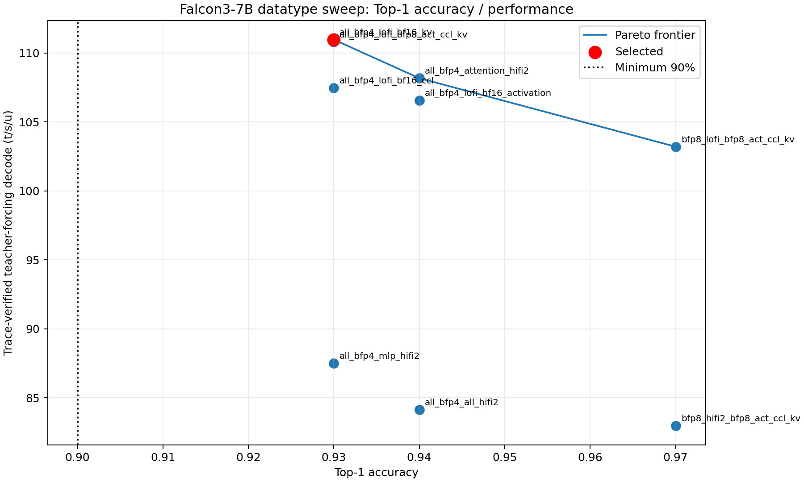
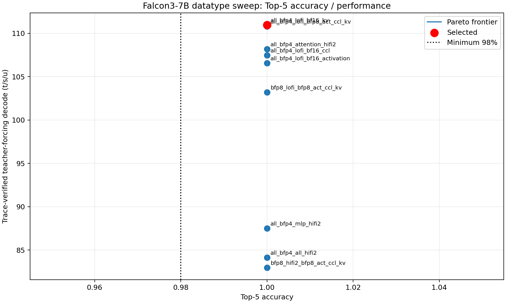

# Falcon3-7B-Base datatype sweep

Selected: `all_bfp4_lofi_bf16_kv`. On the refreshed AIME24 100-token
reference it reaches top-1 93%, top-5 100%, and top-100 100%, exceeding the
90%/98% gates. The comparable warmed batch-1, prompt-128, 128-replay full-model
measurement is 23.182 ms TTFT and 110.972 trace-verified teacher-forcing t/s/u.
The separate post-selection warmed token-out no-readback result through the
normal default construction path is 110.991 t/s/u device-only (110.403 t/s/u
caller-visible), recorded in `results/selected/post_selection_token_out.json`.

The policy uses BFP4 weights and LoFi for attention, MLP gate/up/down, and LM
head; BF16 embeddings, norms, and inter-layer residual; BFP8 attention/MLP
activations, CCL payloads, and local logits; BF16 KV cache; and the exact split-trace
sampling assumptions in `selected_precision_config.json`. There are no layer
exceptions. `tt.generator.build_generator` requires this artifact by default,
and `FALCON3_PRECISION_CONFIG` selects an explicit candidate. Every measured
evidence JSON contains `precision_summary`, including the actual decoder policy
and LM-head geometry consumed by that run.

## Frontier and rejected configurations

| config | top-1 | top-5 | traced TF t/s/u | decision |
|---|---:|---:|---:|---|
| all BFP4 + LoFi, BFP8 KV | 93% | 100% | 110.815 | slower baseline |
| all BFP4 + LoFi, BF16 KV | 93% | 100% | 110.972 | selected, fastest passing |
| all BFP4 + LoFi, BF16 activations | 94% | 100% | 106.553 | slower |
| all BFP4 + LoFi, BF16 CCL | 93% | 100% | 107.458 | slower |
| BFP4 + attention HiFi2 | 94% | 100% | 108.175 | slower |
| BFP4 + MLP HiFi2 | 93% | 100% | 87.491 | slower |
| BFP4 + all HiFi2 | 94% | 100% | 84.146 | slower |
| BFP8 + LoFi | 97% | 100% | 103.210 | safer but slower |
| BFP8 + HiFi2 | 97% | 100% | 82.985 | slower |
| BF16 + HiFi4 | n/a | n/a | n/a | exact L1 blocker after AutoFix |

Every material decoder and LM-head BFP4 group is evaluated together under
LoFi in the selected candidate; the three HiFi2 controls isolate attention,
MLP, and all groups. BFP8 also has direct LoFi/HiFi2 full-model controls. BF16
could not construct: after adapting the LM-head K block to its minimum legal
value, 32K/16K/8K vocabulary splits all require 2,003,712 bytes/core versus
1,572,864 available. `AUTODEBUG.md`, `AUTOFIX.md`, and
`results/autofix_lm_head/` contain the diagnosis and real-weight experiments.

The Pareto plots use only trace-verified full-model candidates. The selected
red point is fastest and lies beyond both dotted accuracy gates. BFP8 occupies
the higher-top-1/slower portion of the frontier; top-5 is tied at 100% for all
runnable policies.

## Capability and quality

The selected BF16 paged KV cache preserves the 32,768-token batch-1 contract.
`doc/context_contract.json` was recomputed with
`results/all_bfp4_lofi_bf16_kv/full_context_coverage.json`; all 28 layers and the final page
pass. Non-aligned prompts 33/47 and chunk-boundary prompts 2049/2079 pass in
`results/all_bfp4_lofi_bf16_kv/non_aligned_contract.json`. No advertised capability changed.

The prompt-correct base-model qualitative suite and HF controls are under
`results/selected_bf16_kv_qualitative/`; `qualitative_verdict.md` classifies the
controlled haiku-stanza repetition and records a pass. Exact commands,
hardware health, limitations, and artifact provenance are in `work_log.md`.
