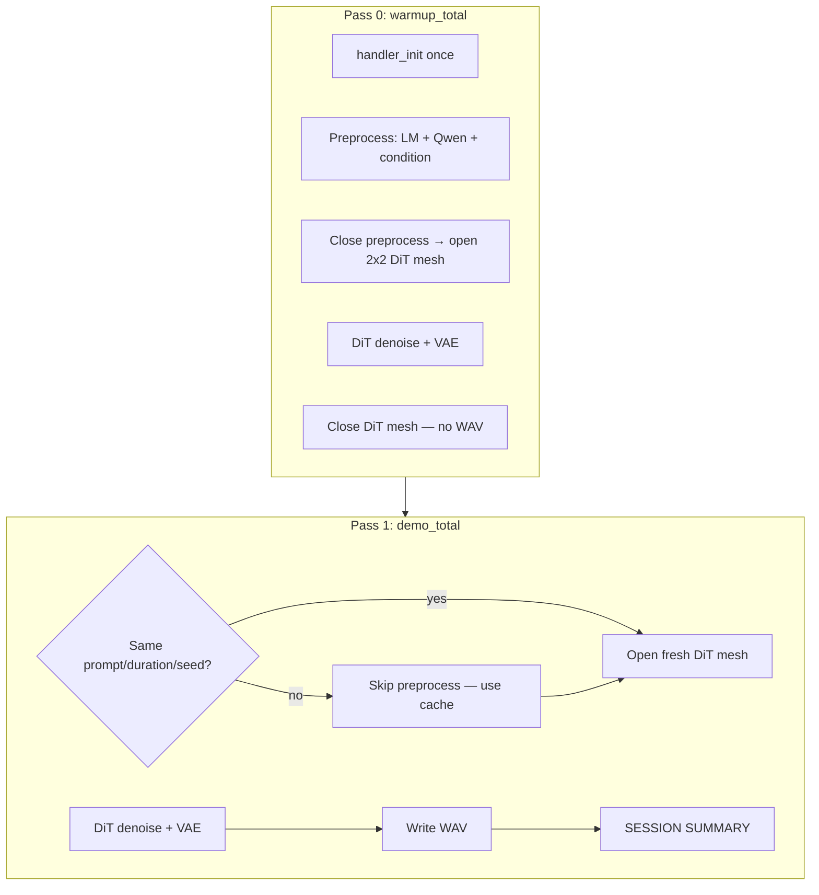

# ACE-Step v1.5 demo architecture

This document describes how `run_prompt_to_wav.py` runs today: how many passes it executes, which perf modules count as **preprocessing** vs **inference**, and how that compares to other model demos in this repo.

Entry point: `models/demos/ace_step_v1_5/run_prompt_to_wav.py`

Related code:

| File | Role |
|------|------|
| `demo_session.py` | Multi-pass session state, cached preprocess, run specs |
| `ace_step_perf_log.py` | Perf recorder + per-pass and SESSION SUMMARY |
| `tt_device.py` | Mesh SKU, split-device lifecycle, readback, CFG helpers |
| `runner/performant_runner.py` | SwinV2-style performant runner (perf tests; not wired into CLI) |

---

## How many times the demo runs

The script can recurse through multiple **passes** in one process when **session mode** is active.

**Session mode** turns on when any of these are set:

- `--warmup`
- `--repeat N` with `N > 1`
- `--serve` (partially stubbed — see [Serve mode](#serve-mode))

Each pass is one full **generate** attempt: preprocess (maybe) → DiT → VAE → (maybe) write WAV.

| CLI | Passes | What happens |
|-----|--------|--------------|
| Default (no session flags) | **1** | Single `demo_total` pass; write WAV |
| `--warmup` | **2** | Pass 0: `warmup_total` (compile cache, no WAV). Pass 1: `demo_total` (timed, writes WAV) |
| `--warmup --repeat 3` | **4** | Pass 0 warmup + 3 timed passes (`demo_total`, `demo_total_2`, `demo_total_3`) |
| `--repeat 2` (no warmup) | **2** | Two timed passes, no compile-only pass |
| `--fast-preprocess` | **1 always** | `--warmup` / `--repeat` are **disabled** (session requires the full handler path) |

**Within each pass**, on `BH_QB` mesh you also have a **two-phase device lifecycle** (not extra “runs”, but extra open/close):

1. **Preprocess phase** — 1×1 device (1 command queue): LM + Qwen + condition encoder
2. **Close preprocess → open DiT mesh** — 2×2 device (2 CQs if `--use-trace`)
3. **Inference phase** — DiT pipeline + VAE decode
4. **Between session passes** — DiT mesh is closed; preprocess tensors are cached on host; handlers stay loaded

See [Why the BH_QB two-phase device lifecycle](#bh-qb-two-phase-device-lifecycle) for the full rationale.

**One-time per process** (not counted as a separate pass):

- `handler_init` — loads `AceStepHandler` + 5 Hz LM handler (first pass only, when handlers aren’t reused)

**Preprocess cache skip:** On pass 1+ (or any later pass), if **prompt + duration + seed** match a prior pass, the demo skips LM + condition encode and reuses host tensors (`reusing cached preprocess tensors` in the log). With `--warmup` and the **same** `--prompt`, pass 1 typically skips preprocess.

---

<a id="bh-qb-two-phase-device-lifecycle"></a>

## Why the BH_QB two-phase device lifecycle

On multi-chip SKUs like `BH_QB` (2×2 mesh), the demo does **not** keep one TTNN device open for the entire pipeline. Instead it runs preprocess and inference as **sequential device sessions** on the same physical cards, with a mandatory close/open between them. This is deliberate — it follows from how ACE-Step is structured, how TT-Metal exposes meshes, and what the performant DiT path requires.

### 1. Two different workloads, two different topologies

ACE-Step is not a single monolithic model. It is a chain of subsystems:

| Subsystem | Role | Natural topology on BH |
|-----------|------|------------------------|
| 5 Hz LM + audio detokenizer | Text → semantic audio codes, CoT | **1×1** — autoregressive LM, batch=1, no mesh parallelism |
| Qwen3 embedding encoder | Caption → text hidden states | **1×1** — short seq (256 tokens), developed and PCC-validated on single chip |
| Condition encoder | Payload → DiT conditioning tensors | **1×1** — small MLP/conv stack, runs once per prompt |
| DiT denoiser | Latent diffusion (50 Euler steps) | **2×2 mesh** — large transformer, benefits from multi-chip DRAM bandwidth |
| TTNN VAE decoder | Latents → waveform | **2×2 mesh** — tiled conv1d over long latent sequences |

The comment in `tt_device.py` states the design rule explicitly: *“Preprocess (Qwen / 5 Hz LM) must stay on 1×1; DiT/VAE use the full mesh.”* Preprocess modules do not use mesh sharding today; opening a 2×2 mesh for them would add complexity with no throughput gain.

On **single-chip** SKUs (`P150`, `N150`), the whole pipeline shares one 1×1 device — no split is needed (`ace_step_needs_split_device` returns false when `rows × cols == 1`).

### 2. Command-queue count is fixed at device open (the hard constraint)

TT-Metal allocates **command queues (CQs)** when a device or mesh is opened. That count cannot change while the device stays open.

| Phase | Typical CQ count | Why |
|-------|------------------|-----|
| Preprocess (LM, Qwen, condition) | **1 CQ** | Eager forwards only; no trace replay overlap needed |
| DiT with `--use-trace` (default) | **2 CQs** | CQ 0 runs `execute_trace` on the captured DiT body; CQ 1 overlaps host→device copies of per-step temb / inputs (see `run_prompt_to_wav.py` and `runner/performant_runner.py`) |

If preprocess opens the card(s) with **1 CQ** and the demo then tries to open the **2×2 DiT mesh with 2 CQs** while the preprocess handle is still alive, TT-Metal reports a CQ mismatch (e.g. `num_hw_cqs() Expected: 2, Actual: 1`) or deadlocks when parent mesh and child resources conflict.

The fix is `transition_preprocess_to_dit_device()` in `tt_device.py`:

```python
def transition_preprocess_to_dit_device(...):
    """Close preprocess 1×1 device, then open the DiT mesh (avoids parent/submesh CQ conflicts)."""
    close_ace_step_device(ttnn_mod, preprocess_dev)
    return open_dit_device(..., num_command_queues=num_command_queues)
```

**You cannot “upgrade” from 1 CQ to 2 CQ in place** — preprocess must be fully closed before the DiT mesh opens with the trace-ready CQ layout.

### 3. Same physical cards, one owner at a time

On `BH_QB`, the 1×1 preprocess device and the 2×2 DiT mesh both use the **same four Blackhole cards** (device indices 0–3). TT-Metal does not support holding a 1×1 `open_device` and a 2×2 `open_mesh_device` on overlapping hardware simultaneously in this demo path.

Keeping both open was attempted early in mesh bring-up and caused:

- CQ ownership conflicts between parent mesh and submeshes
- Hangs when `create_submeshes()` ran after parent-mesh kernels had already dispatched
- Teardown errors (`MeshDevice cq ID 0 is in use by child submesh … during close`)

The sequential **close preprocess → open mesh** pattern avoids overlapping device handles on the same silicon.

### 4. Host readback is the deliberate handoff (`preprocess_readback`)

After condition encoding on the 1×1 preprocess device, the mesh path copies conditioning tensors to **host CPU memory** (`ace_step_ttnn_to_torch` + `.cpu()`), then deallocates on-device copies. That step is timed as `preprocess_readback`.

Why host, not device-to-device?

- The preprocess device is about to be **closed**; any tensor left on it would be invalid.
- Conditioning tensors are **small** relative to DiT activations (encoder hidden states, context latents, null embedding, mask) — one readback per prompt is cheap compared to 50 DiT steps.
- The DiT mesh can then **re-upload** or stage them once during `dit_pipeline_init` / mask prep, on the 2×2 layout it expects.

This is the “Phase A → Phase B” split referenced in code comments: TTNN preprocess on 1×1, then full-mesh DiT/VAE.

**Legacy alternative:** set `ACE_STEP_MESH_HOST_PREPROCESS=1` to skip TTNN preprocess on mesh entirely and run `prepare_condition` on host PyTorch (`ace_step_mesh_use_split_ttnn_preprocess` returns false). That avoids the 1×1 TTNN preprocess device but loses TTNN acceleration for Qwen/condition on mesh runs.

### 5. Why DiT mesh is closed between session passes (but handlers stay loaded)

In `--warmup` / `--repeat` session mode, each pass **reopens** a fresh DiT mesh after closing the previous one (`demo_session.close_dit_device()`). Handlers (`AceStepHandler`, LM handler) and **cached host preprocess tensors** survive across passes.

| Kept across passes | Closed/recreated each pass | Reason |
|--------------------|----------------------------|--------|
| Handler weights (host) | DiT mesh device handle | Mesh must reopen with correct CQ count (2 for trace) |
| `CachedPreprocess` on host | DiT pipeline, VAE, trace state | Pipe/VAE/trace bind to a specific mesh instance |
| Program cache (kernel compile cache) | — | Reopen still benefits from warm program cache on device |
| Qwen/condition encoders on preprocess dev | Preprocess device (closed at transition) | Cleared when preprocess closes; re-init skipped if cache hits |

Closing DiT between passes avoids holding the 2×2 mesh (and trace region, ~128 MB) open while deciding whether the next pass needs preprocess again. When prompt/duration/seed match, pass N+1 **skips preprocess entirely** and only pays `dit_pipeline_init` + denoise + VAE — the steady-state path (~13 s in typical `--clarity` runs).

Handlers are expensive to load (`handler_init`, ~32 s cold) but cheap to reuse; DiT mesh setup is moderate (`dit_pipeline_init`, ~2 s warm) but must align with trace/CQ config each pass.

### 6. What `--use-trace` adds to the picture

With trace enabled (default):

- DiT opens with **2 CQs** and a **128 MB trace region** (`ace_step_open_kwargs`).
- After two eager Euler steps, the per-step DiT body is captured once; remaining steps replay via `execute_trace`.
- Preprocess **never** needs this — it runs a handful of eager forwards per prompt.

With `--no-use-trace`, DiT can use 1 CQ and the eager denoise loop, but preprocess still uses 1×1 on mesh SKUs; the close/open transition remains required whenever preprocess ran on a separate 1×1 open before the mesh.

### 7. Summary diagram (one pass on BH_QB)

```
  [Host]  handler_init (once per process)
     │
     ▼
  ┌─────────────────────────────────────┐
  │ Phase A: 1×1 device, 1 CQ           │
  │  five_hz_lm_generate                │
  │  qwen_encoder_init (first time)     │
  │  handler_preprocess                 │
  │  condition_encoder                  │
  │  preprocess_readback → host tensors │
  └─────────────────────────────────────┘
     │ close 1×1
     ▼
  ┌─────────────────────────────────────┐
  │ Phase B: 2×2 mesh, 2 CQ (+ trace)   │
  │  dit_pipeline_init                  │
  │  dit_mask_prep                      │
  │  dit_denoise_loop (trace replay)    │
  │  vae_init / vae_decode              │
  └─────────────────────────────────────┘
     │ close mesh (if another session pass follows)
     ▼
  [Host]  cached preprocess reused OR full Phase A again
```

### 8. When this does *not* apply

- **Single-chip** (`P150`, no `--mesh-device`): one device, optional 2 CQ for trace, no transition.
- **`--fast-preprocess`**: skips handler/LM path; still one device unless mesh SKU forces split (session/warmup disabled on fast path).
- **`ACE_STEP_MESH_HOST_PREPROCESS=1`**: CPU preprocess on mesh; DiT mesh opens without a prior TTNN preprocess device (still 2×2 for DiT on `BH_QB`).

---

## What counts as preprocessing (and why)

Preprocessing is everything that turns **text → DiT conditioning tensors** (`enc_hs`, `enc_mask`, `ctx_lat`, `null_emb`, `frames`). It runs **before** the DiT mesh is opened (on `BH_QB`) or on the single device before denoise.

| Module | When | Why it’s “preprocess” |
|--------|------|------------------------|
| `handler_init` | Once per process | Loads ACE-Step handler + LM weights. Not per-generation; amortized in SESSION SUMMARY. |
| `five_hz_lm_generate` | Default path only | 5 Hz causal LM: CoT, audio semantic codes, filtered kwargs for the handler. Upstream “Phase 1” of ACE-Step. |
| `qwen_encoder_init` | First preprocess that needs TTNN Qwen | One-time build of Qwen embedding encoder + audio code detokenizer on preprocess device. |
| `handler_preprocess` | Default path | Official handler path: `preprocess_batch` / payload prep from LM output. |
| `condition_encoder` | TTNN condition path | Maps text + payload → DiT conditioning tensors. |
| `preprocess_readback` | `BH_QB` mesh only | Copies enc/ctx/null from 1×1 preprocess device to **host** so the DiT mesh can open with 2 CQs. See [Why the BH_QB two-phase device lifecycle](#bh-qb-two-phase-device-lifecycle). |
| `text_encoder` | `--fast-preprocess` only | Lightweight Qwen3 embedding (skips 5 Hz LM). |
| `prepare_condition_torch` | `--fast-preprocess` + no TTNN condition | Host PyTorch `prepare_condition` instead of TTNN condition encoder. |

**Not preprocess:** anything after `transition_preprocess_to_dit_device()` / `open_dit_device()` — that’s inference.

On `BH_QB`, preprocess and inference use **different device sessions** (1×1 then 2×2) because of mesh topology and CQ constraints — not because the ACE-Step model API defines them differently. The perf buckets mirror that implementation split.

---

## What counts as inference (and why)

Inference is **latent diffusion + decode to audio** on the DiT mesh.

| Module | Why it’s “inference” |
|--------|----------------------|
| `dit_pipeline_init` | Build DiT pipeline, upload weights, trace buffer setup, temb precompute. Per pass (DiT mesh reopened each pass). |
| `dit_mask_prep` | SDPA / attention masks for denoise steps. |
| `dit_denoise_loop` | Euler diffusion loop — the core DiT work (`--infer_steps` steps, CFG if `guidance_scale > 1`). |
| `vae_init` | TTNN Oobleck decoder init (may defer on multi-chip until after denoise). |
| `vae_decode` | Latent → waveform (tiled decode on mesh). |
| `vae_decode_torch` | Only with `--torch-vae`. |

**`(other/overhead)`** in perf summaries = untimed gaps: temb upload, trace capture, tensor staging, sync, device transitions, etc.

---

## End-to-end flow (`BH_QB` + `--warmup`)



**Typical timings** (base, 15 s, 50 steps, `--clarity`, cached preprocess on pass 1):

- Pass 0 (warmup): full cold compile (~45–90 s depending on coldness)
- Pass 1 (cached preprocess): ~13 s steady state (`dit_denoise_loop` ~6.5 s, `vae_decode` ~2.2 s, `dit_pipeline_init` ~2.1 s)

---

## Recommended command

```bash
python models/demos/ace_step_v1_5/run_prompt_to_wav.py \
  --mesh-device BH_QB \
  --variant acestep-v15-base \
  --duration_sec 15 --infer_steps 50 \
  --guidance_scale 7 --use-trace --clarity \
  --warmup \
  --prompt "Electronic dance track with deep bass and bright synth lead" \
  --out /tmp/ttnn_wav.wav
```

Optional flags:

- `--warmup-perf` — log module breakdown for the warmup pass (silent by default)
- `--warmup-prompt "..."` — different caption for pass 0 (cache won’t match pass 1)
- `--perf-log` / `ACE_STEP_DEMO_PERF_LOG=1` — enable perf logging (on by default on mesh SKUs)

---

## Perf output: per-pass vs session

Each pass emits a **RUN SUMMARY** (`warmup_total` or `demo_total`).

After the **last** pass in a session, a **SESSION SUMMARY** rolls up:

- One-time init (`handler_init`)
- Per-pass wall times
- Module rollup summed across passes
- Steady-state line (last timed pass)
- `SESSION (init + passes)` and `SESSION (process wall)`

---

## Modules by pass (default `BH_QB` path)

| Bucket | Pass 0 (warmup) | Pass 1 (same prompt, cached) |
|--------|-----------------|------------------------------|
| Init | `handler_init` | — |
| Preprocess | `five_hz_lm_generate`, `qwen_encoder_init`*, `handler_preprocess`, `condition_encoder`, `preprocess_readback` | **skipped** |
| Inference | `dit_pipeline_init`, `dit_mask_prep`, `dit_denoise_loop`, `vae_init`*, `vae_decode` | same (fresh DiT mesh each pass) |

\*Init buckets run only the first time that component is needed in the session.

---

## Comparison with other model demos

**Partially similar intent, different shape.** ACE-Step is heavier and more custom than most demos under `models/demos/`.

### Common patterns elsewhere

1. **Single-shot scripts** — load model, run once, exit (`demo.py`, `run_*.py`).
2. **`BenchmarkProfiler`** — used in Llama, Qwen, Gemma, Mamba, etc.; optional `warmup_iters`; first iteration often treated as compile.
3. **`PerformantRunner` class** — used in Sentence-BERT, BGE, SwinV2, and ACE-Step’s own `runner/performant_runner.py`:
   - Warmup at **construction** (one hidden `generate()`)
   - Steady **`run(prompt)`** calls reuse trace + program cache
   - Device owned by caller; runner does not multi-pass CLI

ACE-Step’s performant runner mirrors SwinV2: warmup at init captures the DiT trace, then `run(prompt)` is steady state. See `runner/performant_runner.py`.

### What’s unique about this demo

| Aspect | ACE-Step demo | Typical other demo |
|--------|---------------|-------------------|
| Pipeline stages | LM → condition → DiT → VAE (4 subsystems) | Usually one model forward |
| Device topology | Split 1×1 preprocess vs 2×2 DiT mesh | Single device/mesh |
| Session / warmup | CLI `--warmup` + recursive `main(session_pass=...)` + `AceStepDemoSession` | Runner warmup at construct, or manual double-run |
| Preprocess cache | Host-side `CachedPreprocess` by prompt/duration/seed | Per-prompt cache inside E2E model or none |
| Perf tooling | Custom `ace_step_perf_log.py` + SESSION SUMMARY | `BenchmarkProfiler` or pytest perf markers |
| `--fast-preprocess` | Alternate lighter path (no 5 Hz LM) | N/A |

The **warmup idea matches** Sentence-BERT / SwinV2 / `AceStepPerformantRunner`, but **`run_prompt_to_wav.py` adds session orchestration** because ACE-Step has split devices, a long LM preprocess phase, and handler state that other demos don’t have.

**`run_prompt_to_wav.py` is not wired to `AceStepPerformantRunner`** — that runner wraps `AceStepE2EModel` for perf tests; the CLI demo has its own session layer.

### Serve mode

`demo_session.py` defines `serve_prompt_loop()` for reading prompts from stdin, but **`--serve` is not fully hooked up** in `run_prompt_to_wav.py` (no stdin loop yet). Session mode recognizes `--serve`, but interactive serving is incomplete.

---

## CLI session flags (reference)

| Flag | Description |
|------|-------------|
| `--warmup` | Single process: compile-cache pass then timed generation. Handlers reused; DiT mesh reopened each pass. |
| `--warmup-prompt` | Caption for warmup pass (default: same as `--prompt`). |
| `--warmup-perf` | Also log perf module lines for the warmup pass. |
| `--repeat N` | Repeat timed generation N times in the same session (after warmup if set). |
| `--serve` | Keep session alive and read prompts from stdin (stub). |

---

## See also

- `README.md` — quick start, CLI options, variants
- `tests/test_tt_device_mesh.py` — unit tests for warmup run specs and session summary rollup
