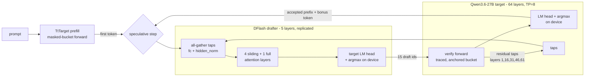

# Qwen3.6-27B DFlash speculative decoding

[DFlash](https://github.com/z-lab/dflash) ([arXiv:2602.06036](https://arxiv.org/abs/2602.06036))
speculative decoding for Qwen3.6-27B on a Wormhole T3K. A 5-layer block-diffusion drafter proposes
15 tokens in one forward from the target's residual stream; the target verifies all 16 slots in one
forward and commits the longest matching prefix plus one bonus token. Greedy verification accepts
only the target's own argmax, so the output is exactly the target's greedy output; the drafter only
changes speed. Companion to [README.md](README.md).

| Role | Checkpoint | Params | Env var |
| --- | --- | --- | --- |
| Target | `Qwen/Qwen3.6-27B` | 27B, 64 layers | `HF_MODEL` |
| Drafter | `z-lab/Qwen3.6-27B-DFlash` | 1.73B, 5 layers | `DFLASH_HF_MODEL` |

## Supported devices

| Device | Mesh (`MESH_DEVICE`) | Target | Drafter | Status |
| --- | --- | --- | --- | --- |
| Wormhole T3K (4x N300, 8 chips) | `T3K`, `(1, 8)` | 8-way tensor parallel | replicated on all 8 chips | validated |

## Architecture



| Module | Class | File |
| --- | --- | --- |
| Speculative loop (backend-agnostic) | `dflash_generate` | [reference/dflash/generate.py](reference/dflash/generate.py) |
| Device target: verify, taps, anchor | `TtTarget` | [tt/dflash/target.py](tt/dflash/target.py) |
| Target additions: taps, all-row logits, GDN snapshot, verify trace | `Qwen36Model` | [tt/model.py](tt/model.py) |
| Device drafter: tap projection, 5 layers | `TtDFlashDrafter` | [tt/dflash/drafter.py](tt/dflash/drafter.py) |
| Drafter adapter for the loop | `TtDrafter` | [tt/dflash/speculative_drafter.py](tt/dflash/speculative_drafter.py) |
| Drafter weights, dtypes | `load_drafter_weights` | [tt/dflash/weights.py](tt/dflash/weights.py) |
| Config, checkpoint resolution, runtime sizing | `DFlashDrafterConfig`, `paged_blocks_for` | [tt/dflash/config.py](tt/dflash/config.py) |
| Host reference drafter (vendored from z-lab, MIT) | `DFlashDraftModel`, `HostDrafter` | [reference/dflash/dflash.py](reference/dflash/dflash.py), [reference/dflash/drafters.py](reference/dflash/drafters.py) |
| Host reference target | `HFTarget` | [reference/dflash/targets.py](reference/dflash/targets.py) |
| Demo | `test_demo_dflash` | [demo/dflash_demo.py](demo/dflash_demo.py) |

Per-op device mapping of one drafter step: [DFLASH_DRAFTER_OP_MAPPING.md](DFLASH_DRAFTER_OP_MAPPING.md).

### Deviations from the reference

None of these changes the greedy output (asserted by the tests).

| Area | Reference (z-lab / HF) | This implementation | Why |
| --- | --- | --- | --- |
| Drafter precision | bf16 | `BFLOAT8_B` projections, `BFLOAT4_B` MLP gate/up, bf16 norms | weight-bandwidth bound |
| Drafter parallelism | one device | replicated on all 8 chips | bound by collectives and dispatch |
| Drafter KV | growing cache | fixed-capacity buffer | stable addresses under the parked verify trace |
| Target rollback | `cache.crop()` (a no-op on GDN layers) | anchored re-run from a GDN snapshot | no multi-token KV write at an arbitrary offset |
| Verify LM head | full logits | 32/64-row window, argmax on device | only the block's rows are needed |

## Running

```bash
export DFLASH_RUN_TARGET=1 MESH_DEVICE=T3K
export HF_MODEL=Qwen/Qwen3.6-27B DFLASH_HF_MODEL=z-lab/Qwen3.6-27B-DFlash
export TT_CACHE_PATH=$HOME/.cache/tt_cache/Qwen3.6-27B

pytest models/demos/blackhole/qwen36/demo/dflash_demo.py -v -s                          # all cases
pytest models/demos/blackhole/qwen36/demo/dflash_demo.py -v -s -k "spec_128 and not long"  # one case
```

| Parameter | Meaning | Cases |
| --- | --- | --- |
| `seqlen` | prompt length (ISL) | `spec_128`, `spec_128_long` (128); `isl_512` ... `isl_32k` (512 - 32768) |
| `max_generated_tokens` | tokens to generate | 100 (`spec_128_long`: 256) |
| `DFLASH_PROMPT` | literal prompt instead of the sample prompt | optional |
| `DFLASH_ANCHOR` / `DFLASH_AUTO_ANCHOR=0` | fixed anchor width / fixed 128, instead of per-request sizing | optional |

ISL 128 uses the shared question prompt `text_demo.py` uses; longer ISLs use a Frankenstein excerpt
with a request to summarise it. The demo runs one eager and one traced warm-up generation, then
times a traced generation and reports TTFT, decode TPS, acceptance and the output. It asserts the
traced run emits exactly the eager run's tokens and applies `text_demo.py`'s output-quality check.

Example (`spec_128`, greedy): the input is the ISL-128 condiment question, clipped to 128 tokens so it
ends mid-sentence ("... There are so many condiments to choose from, each"). Expected output begins:

> bringing its unique flavor and texture to enhance different dishes. \<think\> Here's a thinking
> process: 1. **Analyze User Input:** - The user asks: "What is your favorite condiment?" [...]

## Tests

| Test | What it checks |
| --- | --- |
| [tests/test_dflash_drafter_tp.py](tests/test_dflash_drafter_tp.py) | ttnn drafter vs host drafter PCC, per module, real weights |
| [tests/test_dflash_verify_pcc.py](tests/test_dflash_verify_pcc.py) | full-depth (64-layer) verify-path logits PCC vs HuggingFace, every row |
| [tests/reference/test_dflash_device.py](tests/reference/test_dflash_device.py) | device target primitives; full 27B speculation == greedy (`DFLASH_RUN_TARGET=1`) |
| [tests/reference/test_dflash_host.py](tests/reference/test_dflash_host.py) | host reference: speculation == autoregressive greedy |
| [tests/perf/test_dflash_traced_throughput.py](tests/perf/test_dflash_traced_throughput.py) | traced vs eager verify: identical tokens, tok/s |
| [tests/perf/test_profile_dflash_drafter.py](tests/perf/test_profile_dflash_drafter.py) | one drafter step under Tracy (per-op CSV) |

```bash
export MESH_DEVICE=T3K HF_MODEL=Qwen/Qwen3.6-27B DFLASH_HF_MODEL=z-lab/Qwen3.6-27B-DFlash
T=models/demos/blackhole/qwen36/tests
pytest -svq $T/test_dflash_drafter_tp.py
pytest -svq $T/test_dflash_verify_pcc.py                              # HF reference on CPU, ~60 GB RAM
DFLASH_RUN_TARGET=1 pytest -svq $T/reference/test_dflash_device.py
DFLASH_RUN_TARGET=1 pytest -svq $T/perf/test_dflash_traced_throughput.py
pytest $T/reference/test_dflash_host.py -sv                           # host only, no device
python -m tracy -p --op-support-count 100000 -r -v -m pytest $T/perf/test_profile_dflash_drafter.py
```

## PCC

T3K, real weights.

| Test | Scope | PCC | Gate |
| --- | --- | --- | --- |
| `test_dflash_drafter_tp` | `fc` + `hidden_norm` tap projection | 0.99991 | 0.99 |
| | one sliding-window layer / one full-attention layer | 0.99601 / 0.99599 | 0.99 |
| | full 5-layer drafter / second step with carried context | 0.99421 / 0.99495 | 0.99 |
| `test_dflash_verify_pcc` | prompt, positions 0-149 (two anchor buckets) | 0.9928 | 0.95 |
| | verify block, positions 150-165 | 0.9552 | 0.95 |

**Exception:** the verify test gates at 0.95, the full-depth decode test's gate, not the 0.98
prefill gate. A few rows where the reference puts almost all probability on one token score low on
full-vocab PCC while the argmax agrees (100% on the block). They score the same when the tokens run
as one bucket from position 0, so they reflect the target's precision, not the verify path.

## Performance

T3K, batch 1, greedy, `demo/dflash_demo.py`, 100 new tokens (`spec_128_long`: 256). TTFT: call to
first token. Decode TPS: rate after the first token. Production traced decode (`text_demo.py`,
ISL 128) is 17.87 tok/s.

| ISL | TTFT | Decode TPS | vs production | Acceptance (tok/step) |
| --- | --- | --- | --- | --- |
| 128 | 0.24 s | 18.44 | 1.03x | 4.95 |
| 256 | 0.25 s | 13.37 | 0.75x | 4.40 |
| 512 | 4.33 s | 16.24 | 0.91x | 4.12 |
| 1k | 3.96 s | 14.91 | 0.83x | 4.30 |
| 2k | 6.08 s | 16.83 | 0.94x | 5.21 |
| 3k | 7.45 s | 9.54 | 0.53x | 4.95 |
| 3968 | 8.22 s | 15.55 | 0.87x | 5.21 |
| 8k | 11.88 s | 10.30 | 0.58x | 6.19 |
| 16k | 16.20 s | 10.27 | 0.57x | 5.82 |
| 24k | 22.57 s | 9.11 | 0.51x | 5.82 |
| 32k | 31.65 s | 6.60 | 0.37x | 4.95 |


## Dependencies

| Component | Version |
| --- | --- |
| tt-metal / TTNN | branch `ign/qwen_3.6_27B_dFLASH` (`v0.78.0-dev20260901`); no C++ changes |
| Target checkpoint | `Qwen/Qwen3.6-27B` @ `6a9e13bd6fc8f0983b9b99948120bc37f49c13e9` |
| Drafter checkpoint | `z-lab/Qwen3.6-27B-DFlash` @ `0919688658996800f86b895034249700e9481106` |
| transformers / torch | 5.12.1 / 2.11.0+cpu |
| Firmware / KMD | fw bundle 19.2.0.0 / tt-kmd 2.7.0-rc1 |
