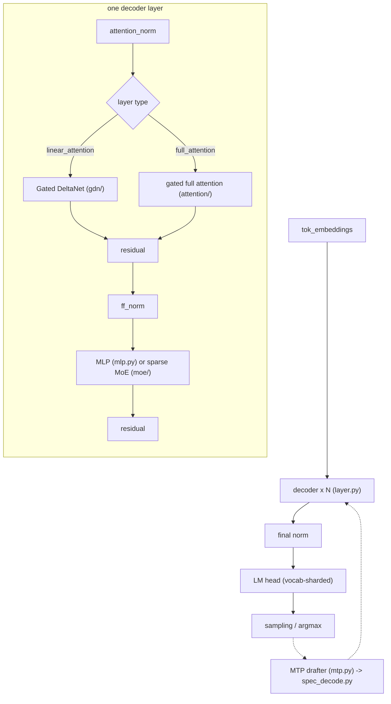

# Qwen3.5 / Qwen3.6 on Blackhole

This directory implements Tenstorrent Blackhole inference for the hybrid
**Gated DeltaNet + Gated Full Attention** Qwen3.5/3.6 family. A single code
path serves four checkpoints:

| Model            | `HF_MODEL`             | Mesh / `MESH_DEVICE` | Parallelism            |
| ---------------- | ---------------------- | -------------------- | ---------------------- |
| Qwen3.5-9B       | `Qwen/Qwen3.5-9B`      | single P150 — `P150` | single device          |
| Qwen3.5-27B      | `Qwen/Qwen3.5-27B`     | P150x4 — `P150x4`    | 4-way tensor parallel  |
| Qwen3.6-27B      | `Qwen/Qwen3.6-27B`     | P150x4 — `P150x4`    | 4-way tensor parallel  |
| Qwen3.6-27B      | `Qwen/Qwen3.6-27B`     | P150x8 — `P150x8`    | 8-way tensor parallel  |
| Qwen3.6-35B-A3B  | `Qwen/Qwen3.6-35B-A3B` | P150x4 — `P150x4`    | 4-way TP + sparse MoE  |

The **35B-A3B** is the sparse Mixture-of-Experts member of the family (`qwen3_5_moe`:
256 routed experts, top-8, plus a gated shared expert on every layer). Every layer's
dense SwiGLU MLP is replaced by the sparse MoE block in `tt/moe/`; dispatch is
config-driven (`args.is_moe_layer`), so on the dense 9B/27B `num_experts == 0` and the
dense MLP path is byte-for-byte unchanged.

- The **9B** runs on a **single Blackhole P150** device. It uses the validated
  single-device forward path (no collectives).
- The **27B** variants (both Qwen3.5-27B and Qwen3.6-27B) run on a **P150x4**
  (a `(1, 4)` Blackhole mesh) using **4-way tensor parallelism (TP)**. The TP
  path needs `FABRIC_1D` for the cross-device collectives (all-reduce /
  reduce-scatter) and a trace region for the captured chunk-outer prefill trace.
- **Qwen3.6-27B additionally runs at TP=8** on a `(1, 8)` mesh (`P150x8`).
  Because it has only **4 KV heads**, TP=8 cannot give each device its own head:
  each head is instead **replicated across the device pair holding its GQA query
  group** (devices 0-1 share KV head 0, 2-3 head 1, and so on), so
  `n_local_kv_heads` is 1 at both TP=4 and TP=8 and the whole runtime KV path is
  unchanged. See `tp_common.replicate_kv_weight` and
  `ModelArgs.SUPPORTS_KV_REPLICATION`.

Everything model-specific (hybrid layer dispatch, DeltaNet head/conv dims,
partial rotary factor, vocab, layer count) is read from the parsed HF config, so
the single code base adapts to each checkpoint. The device count alone
(`num_devices > 1`) switches between the single-device and TP code paths — see
`tt/model_config.py` and `tt/tp_common.py`.

## Architecture

Assembly: `tok_embeddings → N × Qwen36DecoderLayer → RMSNorm → LM Head`.

Each model interleaves two attention block types (read from the HF
`layer_types`): **Gated DeltaNet** (linear-attention, recurrent + causal conv
state) layers and **Gated Full Attention** (paged KV cache) layers. The 9B has
32 layers (24 DeltaNet + 8 full-attention). Qwen3.5 uses zero-centered RMSNorm
everywhere and **partial** RoPE (only a fraction of each head is rotated).

## Environment setup

Before running **any** test, export the two environment variables that select
the checkpoint and the device mesh.

**9B (single P150):**

```bash
export HF_MODEL=Qwen/Qwen3.5-9B
export MESH_DEVICE=P150
```

**27B (P150x4):**

```bash
# Qwen3.6-27B
export HF_MODEL=Qwen/Qwen3.6-27B
export MESH_DEVICE=P150x4

# …or Qwen3.5-27B
export HF_MODEL=Qwen/Qwen3.5-27B
export MESH_DEVICE=P150x4
```

**35B-A3B (P150x4, sparse MoE):**

```bash
export HF_MODEL=Qwen/Qwen3.6-35B-A3B
export MESH_DEVICE=P150x4
```

`HF_MODEL` is the single source of truth for the checkpoint — it may be a Hugging
Face hub id (resolved via `snapshot_download`) or a local checkpoint directory.
`MESH_DEVICE` selects the mesh shape (`P150` → `(1,1)`, `P150x4` → `(1,4)`,
`P150x8` → `(1,8)`).

Optional flags:

```bash
# Run SDPA in BF8 (faster; slightly lower precision).
export QWEN_SDPA_BF8=1
```


## End-to-end demo test (`demo/text_demo.py`)

The e2e text-generation test lives in `demo/text_demo.py`. It is a single
parametrized test (`test_demo_text`) covering a range of input sequence lengths
(ISLs): 128, 4k, 8k, 16k, 32k, 64k, 128k, and 256k tokens. Each ISL runs prefill
+ decode and validates output (non-degenerate generation) and per-ISL
performance gates (TTFT and decode tok/s).

Two execution variants exist per ISL, identified by the test id prefix:

- **`traced_*`** — captures the prefill (chunk-outer) and decode forward passes
  as device traces and replays them. This is the **preferred** path and the one
  vLLM serves; run these by default.
- **`paged_*`** — non-traced paged path, useful as an eager reference/fallback.

Run the preferred traced cases (the env vars above must already be exported):

```bash
# All traced ISLs
pytest models/demos/blackhole/qwen36/demo/text_demo.py -v -s -k "traced"

# A single ISL, e.g. the short 128-token traced case
pytest models/demos/blackhole/qwen36/demo/text_demo.py -v -s -k "traced_128"

# Medium / long traced ISLs
pytest models/demos/blackhole/qwen36/demo/text_demo.py -v -s -k "traced_4k"
pytest models/demos/blackhole/qwen36/demo/text_demo.py -v -s -k "traced_64k"
```

The **same command works for 9B, 27B, and 35B-A3B** — only the exported `HF_MODEL` /
`MESH_DEVICE` differ. On a single device the test takes the validated 9B path; on
the `(1,4)` mesh it routes through the TP chunk-outer traced prefill + paged
traced decode path automatically (the sparse MoE block is selected per layer from
the config, transparent to the demo).

> Long-context cases (64k+) download a public-domain corpus (Frankenstein, War
> and Peace) on first run and cache it under `demo/sample_prompts/.context_cache`.

## Tests

There are two tiers of tests under `tests/`.

### Single-device unit / component tests — **9B**

These run on a single P150 against the 9B checkpoint (the conftests
`setdefault HF_MODEL=Qwen/Qwen3.5-9B`). They validate each component's forward
pass against a torch reference (PCC) — see `tests/pcc_thresholds.json` for the
per-test thresholds.

`tests/unit/` (component PCC vs torch):

| Test                       | Validates                                            |
| -------------------------- | ---------------------------------------------------- |
| `test_embedding.py`        | token embedding                                      |
| `test_rms_norm.py`         | zero-centered RMSNorm (the "+1" fold)                |
| `test_rope.py`             | partial-rotary RoPE (host freqs + on-device lookup)  |
| `test_mlp.py`              | single-device SwiGLU MLP (layer 0)                   |
| `test_moe.py`              | single-device sparse MoE MLP (MoE checkpoint only; decode + prefill) |
| `test_attention.py`        | single-device gated full attention (layer 3)         |
| `test_gdn.py`              | single-device Gated DeltaNet (layer 0)               |
| `test_lm_head.py`          | LM head logits (bf8 vs bf16)                          |
| `test_layer.py`            | full decoder-block sanity (no NaN/Inf, non-constant) |
| `test_model.py`            | Generator decode contract: traced vs paged decode    |
| `test_substate.py`         | weight `substate` helper (pure CPU, no device)       |

`tests/` (single-device, also 9B):

| Test                     | Validates                                                  |
| ------------------------ | ---------------------------------------------------------- |
| `test_prefill.py`        | masked fixed-bucket + chunk-outer prefill vs `prefill_paged` |
| `test_weight_mapping.py` | HF → internal weight key remapping (pure CPU)              |

Run the 9B unit suite (with `HF_MODEL=Qwen/Qwen3.5-9B`, `MESH_DEVICE=P150`):

```bash
pytest models/demos/blackhole/qwen36/tests/unit/ -v -s
pytest models/demos/blackhole/qwen36/tests/test_prefill.py -v -s
pytest models/demos/blackhole/qwen36/tests/test_weight_mapping.py -v -s
```

> `test_prefill.py` auto-skips cases longer than `--max-prefill` (default 8192).
> Raise it to exercise long-context prefill, e.g. `--max-prefill 131072`.

### Tensor-parallel tests — **27B (P150x4)**

The `*_tp` tests exercise the multi-device TP path and default to the 27B
checkpoint. They must run on the `(1,4)` mesh with `FABRIC_1D` (the
`parametrize_mesh_tp` helper wires this from `MESH_DEVICE`). PCC thresholds are in
`tests/pcc_thresholds.json`.

| Test                  | Validates                                                            |
| --------------------- | ------------------------------------------------------------------- |
| `test_mlp_tp.py`      | TP SwiGLU MLP (column/row-parallel + reduce-scatter)                |
| `test_moe_tp.py`      | TP sparse MoE MLP (router + experts + shared; MoE checkpoint only; decode + prefill) |
| `test_attention_tp.py`| TP gated full attention: decode / prefill / paged-KV contract       |
| `test_gdn_tp.py`      | TP Gated DeltaNet: decode + chunk-prefill                           |
| `test_model_tp.py`    | full-model TP contract: paged+traced path matches the bespoke oracle |
| `test_generate_tp.py` | full-model bespoke `generate_tp` on a real prompt (answer oracle)   |

Run the 27B TP suite (with `HF_MODEL=Qwen/Qwen3.6-27B` or `Qwen/Qwen3.5-27B`,
`MESH_DEVICE=P150x4`):

```bash
pytest models/demos/blackhole/qwen36/tests/test_mlp_tp.py -v -s
pytest models/demos/blackhole/qwen36/tests/test_attention_tp.py -v -s
pytest models/demos/blackhole/qwen36/tests/test_gdn_tp.py -v -s
pytest models/demos/blackhole/qwen36/tests/test_model_tp.py -svq
pytest models/demos/blackhole/qwen36/tests/test_generate_tp.py -v -s
```

> The MoE-specific tests (`test_moe_tp.py`, and the MoE path in `test_model_tp.py` /
> `test_generate_tp.py`) require the sparse checkpoint — run them with
> `HF_MODEL=Qwen/Qwen3.6-35B-A3B MESH_DEVICE=P150x4`. On the dense 27B they are inert
> (`num_experts == 0`), and the dense/MoE checkpoints must not be mixed in one run
> (each test file `setdefault`s or expects a single `HF_MODEL`).
> `test_substate.py` and `test_weight_mapping.py` are pure-CPU and need no device.
> `test_weight_mapping.py`'s shape constants assume the 9B checkpoint.

## Wormhole

The same code runs on Wormhole, with two validated configurations. Blackhole-only fusions are
gated off (`is_blackhole()`), and the GDN kernels pick Wormhole-appropriate defaults for the
chunk-seq activation memory, the chunk output dtype, and the conv FIR padding layout.

| Config | Device | Mesh | `HF_MODEL` | `MESH_DEVICE` |
| --- | --- | --- | --- | --- |
| 9B | N300 | 1x2 | `Qwen/Qwen3.5-9B` | `N300` |
| 27B | T3K | 1x8 | `Qwen/Qwen3.6-27B` | `T3K` |

A single N150 cannot hold the 9B (~12 GB DRAM/chip against Blackhole P150's ~32 GB), so N300 is
the smallest Wormhole mesh for it — see `tests/test_factory.py` and `demo/text_demo.py`.

### Context length

| | 9B | 27B |
| --- | --- | --- |
| checkpoint max (`max_position_embeddings`) | 262,144 | 262,144 |
| layers (linear / full attention) | 24 / 8 | 48 / 16 |
| hidden size | 4,096 | 5,120 |
| vocab | 248,320 | 248,320 |

The demo parametrization covers 128 up to 262,144 single-user. On Wormhole the practical ceiling
is DRAM, not the checkpoint: paged KV scales as batch x ISL and is **replicated per device** (the
out-projection is TP-sharded, the KV cache is not), so `batched_64k_b8` needs ~8 GiB of KV per
device on top of ~2.9 GiB of weights and does not fit Wormhole's ~11 GiB. That case is sized for
Blackhole P150x4.

**Optimized sequence length: 128-8k.** Decode throughput is flat to ~8k and degrades gradually
beyond; under MTP spec decode acceptance also falls with context (see the ladder below), so both
the raw rate and the speculative gain are best in that band.

### Module map

Both checkpoints interleave two attention kinds: Gated DeltaNet (linear attention) on most layers
and gated full attention on the rest, in the ratio above.



| Path | Module |
| --- | --- |
| `tt/model.py` | whole-model orchestration, prefill/decode entry points, paged KV |
| `tt/layer.py` | decoder block: norm dispatch, attention-kind selection, residuals |
| `tt/gdn/` | Gated DeltaNet: `tp.py` (TP decode/prefill), `fused_chunk.py`, `recurrent_decode_wh.py`, `state.py`, `weights.py` |
| `tt/attention/` | gated full attention: `tp.py`, `rope_tp.py` (RoPE), `decode.py`, `prefill.py`, `weights.py` |
| `tt/mlp.py`, `tt/moe/` | dense SwiGLU MLP; sparse MoE (router, experts, shared expert) |
| `tt/mtp.py`, `tt/spec_decode.py` | MTP drafter head and the speculative decode loop |
| `tt/model_config.py`, `tt/tp_common.py` | centralized config; TP helpers and arch gating |
| `demo/text_demo.py`, `demo/vision_demo.py` | end-to-end demos |

### Example input and output

The ISL-128 demo case reads its prompt from
`models/demos/llama3_70b_galaxy/demo/sample_prompts/input_data_questions_prefill_128.json`:

> What is your favorite condiment? There are so many condiments to choose from, each bringing its
> unique flavor and texture to enhance different dishes. Do you prefer the classic taste of
> ketchup, the creamy richness of mayonnaise, the spicy kick of mustard, or perhaps something more
> exotic like sriracha…

Generated continuation, 27B on T3K, greedy, batch 1 (`[TP] GENERATED:` in the demo log):

> ` bringing its unique flavor and texture to enhance different dishes.`
> `<think></think>`
> `As an AI, I don't have taste buds…`

Longer ISLs (8k and above) use the Frankenstein corpus plus a continuation instruction from
`demo/sample_prompts/eval_frankenstein_long.json`; the 256k case is War and Peace.

### PyTorch fallback

Host-side torch is confined to weight loading, RoPE table construction and test references. The
one runtime exception is `Qwen36Model.generate_tp`, which reads full logits back and takes
`torch.argmax` per token:

| path | sampling | notes |
|---|---|---|
| MTP spec decode (`spec_decode.py`) | **on device** (`mtp.shard_argmax`) | vocab-sharded greedy pick, no readback |
| 9B / N300 `generate_tp` | on device | `tpc.wh_9b_n300` branch |
| 27B / T3K, N150, Blackhole `generate_tp` | **host** `torch.argmax` | one full-logit readback per token |

The host branch costs a device→host sync per token and is the non-speculative path; the default
single-user TP decode uses MTP spec decode, which does not take it.

### Dependency versions

Measured on the configuration these numbers came from:

| | version |
| --- | --- |
| tt-metal | `v0.80.0-dev20260924` |
| ttnn | `0.75.0rc10.dev959` |
| Python | 3.10.18 |
| torch | 2.11.0+cpu |
| transformers | 5.12.1 |
| HF `Qwen/Qwen3.5-9B` | `c202236235762e1c871ad0ccb60c8ee5ba337b9a` |
| HF `Qwen/Qwen3.6-27B` | `6a9e13bd6fc8f0983b9b99948120bc37f49c13e9` |

```bash
# 9B on N300
HF_MODEL=Qwen/Qwen3.5-9B MESH_DEVICE=N300 \
  pytest models/demos/blackhole/qwen36/demo/text_demo.py -k traced_128 -v -s

# 27B on T3K
HF_MODEL=Qwen/Qwen3.6-27B MESH_DEVICE=T3K \
  pytest models/demos/blackhole/qwen36/demo/text_demo.py -k traced_128 -v -s
```

### Performance

Warm trace replay, batch 1 greedy, **plain decode** (the 27B column is `QWEN36_SPEC=0`; for the
MTP speculative numbers see the ladder below). TTFT is wall clock including prefill and the first
token; TPS is decode tokens/s. Both models measured in one session on one build.

| ISL | 9B / N300 TTFT | 9B TPS | 27B / T3K TTFT | 27B TPS |
| --- | --- | --- | --- | --- |
| 128 | 0.16 s | 23.06 | 0.36 s | 16.96 |
| 2,642 | 0.84 s | 22.36 | 1.33 s | 16.86 |
| 8,192 | 1.94 s | 22.46 | 2.05 s | 16.71 |
| 16,384 | 4.04 s | 22.50 | 4.44 s | 16.41 |
| 32,768 | 8.84 s | 21.82 | 10.35 s | 16.42 |
| 65,536 | 20.97 s | 21.73 | 26.75 s | 15.29 |
| 103,351 | 39.64 s | 20.61 | 54.43 s | 14.32 |

Decode is close to flat across the whole range — the 9B loses 11% from 128 to 103k (23.06 -> 20.61)
and the 27B 16% (16.96 -> 14.32). TTFT is near-linear in ISL.

256k is not in this sweep; the previously recorded figures were 125.43 s / 18.15 TPS (9B) and
156.97 s / 11.79 TPS (27B), from an earlier run on a different build — re-measure before quoting.

### Accuracy

Full-depth logits vs the HuggingFace reference, real weights:

| Gate | 9B / N300 | 27B / T3K |
| --- | --- | --- |
| prefill logits PCC (≥ 0.98) | 0.9984 | 0.9957 |
| decode logits PCC, 5 steps (≥ 0.95) | 0.9948 | 0.9939 |

```bash
pytest models/demos/blackhole/qwen36/tests/unit/test_prefill.py \
       models/demos/blackhole/qwen36/tests/unit/test_decode.py -v -s
```

Module PCC thresholds live in `tests/pcc_thresholds.json` (27 entries), so a per-module gate is
changed in one place rather than in the test body.

#### Tests that do not assert PCC, and why

Most module tests gate on PCC against a torch reference built from the real checkpoint weights.
These do not, by design — each asserts something **stricter or categorically different**:

| Test | Asserts instead | Why PCC would be wrong |
| --- | --- | --- |
| `test_spec_lossless.py` | committed tokens **equal plain greedy, token for token** | spec decode must reproduce the target trajectory exactly; a high PCC on logits would not prove it |
| `test_spec_determinism.py` | **identical** tokens across repeat runs | run-to-run identity is exact, not approximate |
| `test_shard_argmax_tp.py` | sharded argmax == gathered argmax, **bit for bit** | an argmax returns an index; PCC on indices is meaningless |
| `test_generate_tp.py` | generated answer matches an expected-answer oracle | end-to-end text, not a tensor |
| `test_sampling.py` | sampling op contract (shapes, ranges) | no reference tensor to correlate against |
| `test_weight_mapping.py` | HF -> internal key remapping (pure CPU) | key names, not numerics |
| `unit/test_model.py` | Generator decode **contract**: traced path == paged path | compares two TT paths for equality, not a reference |
| `unit/test_layer.py` | decoder-block sanity: no NaN/Inf, output non-constant | smoke test with no reference to correlate against |

All of these load real checkpoint weights (the `tests/unit/conftest.py` `setup` fixture reads the
snapshot safetensors); only the input activations are random, which is the intended pattern.
Numerical coverage for a full decoder block comes from `unit/test_prefill.py` /
`unit/test_decode.py`, which run every layer against the HF reference.

### Known limitations

- Greedy decode runs on device; temperature sampling does not (`QWEN35_TEMP=0`).
- Batched GDN prefill is capped at batch 2–4, below the serving batch.
- GDN decode batch-splits above B=16 at fp32 recurrent state on N300.
- Run single-device and multi-device test files in **separate pytest processes**: one process
  opening both layouts mis-sizes the chunk-seq L1 reservation.


> Single-user TP decode now runs [MTP speculative decode](#mtp-speculative-decode) by DEFAULT,
> which more than doubles the ISL-128 decode rate. Only ISL 128 has been measured under spec
> decode; the other seven rows are baseline-only and would each need their own A/B.
### MTP speculative decode
Every Qwen3.6 checkpoint ships a single-layer MTP (multi-token prediction) head (`mtp.*`) that
reuses the main embedding and LM head. It is the speculative-decode drafter, and it is built
automatically whenever those weights are present — single-user TP decode uses it by default.
The head drafts K tokens autoregressively; the base model verifies all of them in ONE traced
K+1-token chunk forward; accepted tokens are committed by pointing the Gated DeltaNet recurrent
state at the accepted slot (no rollback, no re-processing). Rejected positions in the paged KV are
corrected implicitly — they are never attended and get overwritten on the next iteration.
Greedy, batch 1. `QWEN36_SPEC=0` opts out; it also falls back to plain decode automatically if
sampling is not pure greedy (temperature, repetition penalty or no-repeat-ngram set), since
losslessness is only defined against a greedy target.
MEASURED on T3K/27B at K=7, one build, back to back. Acceptance is `accepted/K -> committed
tokens per iteration` (a committed iteration always yields at least the verified token):
Both arms ran back to back on one build; `plain` is the same demo under `QWEN36_SPEC=0`.
| ISL | acceptance | plain TPS | spec TPS | speedup | plain TTFT | spec TTFT | TTFT cost |
| --- | --- | --- | --- | --- | --- | --- | --- |
| 128 | 4.27/7 -> 5.27 | 16.96 | **46.91** | **2.77x** | 0.36 s | 0.94 s | +0.58 s |
| 2,642 | 4.05/7 -> 5.05 | 16.86 | 43.33 | 2.57x | 1.33 s | 1.79 s | +0.46 s |
| 8,192 | 2.85/7 -> 3.85 | 16.71 | 34.28 | 2.05x | 2.05 s | 2.83 s | +0.78 s |
| 16,384 | 3.44/7 -> 4.44 | 16.41 | 36.49 | 2.22x | 4.44 s | 5.14 s | +0.70 s |
| 32,768 | 2.75/7 -> 3.75 | 16.42 | 31.51 | 1.92x | 10.35 s | 11.56 s | +1.21 s |
| 65,536 | 2.25/7 -> 3.25 | 15.29 | 26.13 | 1.71x | 26.75 s | 28.85 s | +2.10 s |
TPS is decode tokens/s, batch 1 greedy, warm trace replay.
**The speedup decays with context**, 2.77x at ISL 128 down to 1.71x at 64k, tracking acceptance
(4.27/7 -> 2.25/7). Quote the row you are actually serving rather than the headline. Plain decode
is nearly flat across the same range (16.96 -> 15.29 TPS), so the decay is the drafter's, not the
target's.
TTFT costs +0.46 to +2.10 s for the drafter-KV warm and trace captures — worth weighing for short
requests that generate few tokens.
The 103k case in the same sweep reports 4.94/7 and 44.00 TPS (3.07x), *above* the 64k row. It
generates 100 tokens against 64k's 500, so it spends proportionally longer in a favourable early
window; excluded pending a re-measurement at matched generation length.
Determinism: two repeat runs at ISL 128 gave identical acceptance (4.27/7) and 46.38 / 46.49 TPS.
Per-iteration breakdown, measured earlier at K=6 (ms):
| draft | verify | reseed | readback | commit | accept | other | total |
| --- | --- | --- | --- | --- | --- | --- | --- |
| 34.06 | 82.54 | 5.94 | 2.02 | 1.79 | 0.03 | 1.05 | **127.45** |
Verify is 65% of the iteration and is the phase that grows with context, so longer prompts need
their own measurement. The TTFT cost is real and worth weighing before enabling spec decode for
short requests.
**Losslessness is the property that makes the speedup meaningful.** Committed tokens come from the
target's own verify rows, so spec decode must reproduce the plain greedy trajectory token for
token rather than merely a plausible one — a high acceptance rate alone would not prove that.
`tests/test_spec_lossless.py` is that gate; `tests/test_spec_determinism.py` pins run-to-run
identity.
Two Wormhole-specific limits, both documented in `docs/mtp-v2-port.md`:
* **K is 6 on Wormhole, 11 on Blackhole.** The fused multi-pos verify SDPA
  (`sdpa_decode(spec_multi_pos_tiles=...)`, which reads KV once per group of 4 candidates instead
  of once per candidate) is gated to Blackhole: `TPAttention._SPEC_SDPA_L1_FIT`'s cores-per-head
  split was fitted to Blackhole's 110-core grid. Wormhole falls through to the legacy per-candidate
  verify, so the draft chain's tail stops paying for itself sooner. Acceptance is high at every K
  (79% at depth 4), so this is a cost problem, not a drafter-quality one. Re-tuning that table for
  an 8x8 grid is the largest remaining lever, and the one that matters most at long ISL.
* `test_sdpa_decode_spec_multi_pos.py` fails its 13 `spec_multi_pos_tiles=11` cases on Wormhole:
  the circular buffers need 1,448,192 B per core against 1,393,440 B of available L1. The op
  raises `TT_FATAL` rather than returning wrong data, and the arch gate above means the model
  never requests that configuration on Wormhole.

Single-user TP decode runs MTP speculative decode by default, so the ladder above measures spec
decode unless you set `QWEN36_SPEC=0`. To reproduce the A/B — baseline first, so both legs land on
one build:
```bash
# baseline
QWEN36_SPEC=0 pytest models/demos/blackhole/qwen36/demo/text_demo.py -v -s -k "traced_128 and not 128k" --timeout=0
# spec decode, with the per-phase timing breakdown
QWEN36_SPEC_TIMING=1 pytest models/demos/blackhole/qwen36/demo/text_demo.py -v -s -k "traced_128 and not 128k" --timeout=0
```
`traced_128` is a substring of `traced_128k`, hence the `and not 128k`. `QWEN36_SPEC_DRAFT_LEN`
overrides K if you want to re-walk the K sweep.
The gates, all on T3K unless noted:
```bash
pytest models/demos/blackhole/qwen36/tests/test_spec_lossless.py -v -s     # spec == plain greedy
pytest models/demos/blackhole/qwen36/tests/test_spec_determinism.py -v -s  # run-to-run identity
pytest models/demos/blackhole/qwen36/tests/test_mtp_tp.py -v -s            # drafter PCC vs torch ref
MESH_DEVICE=N150 pytest models/demos/blackhole/qwen36/tests/test_fused_recurrent_gdn.py -v -s
```
