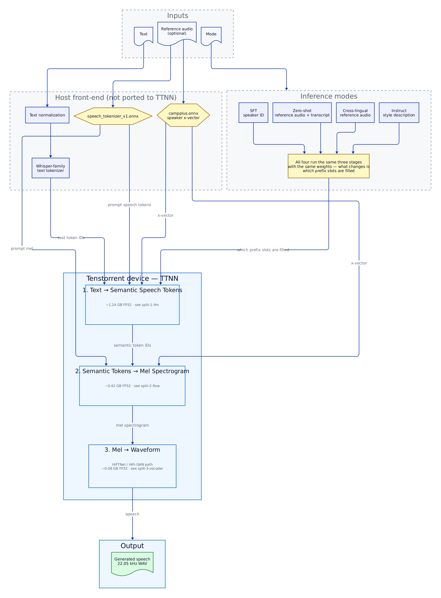
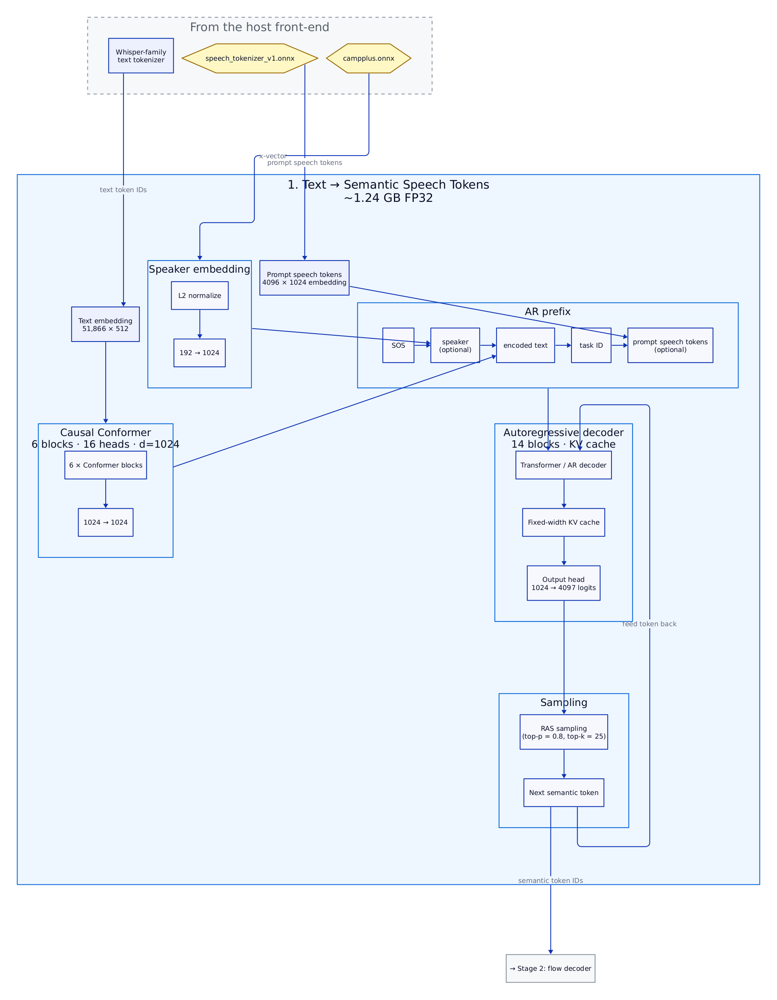
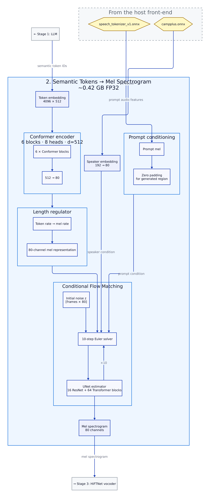
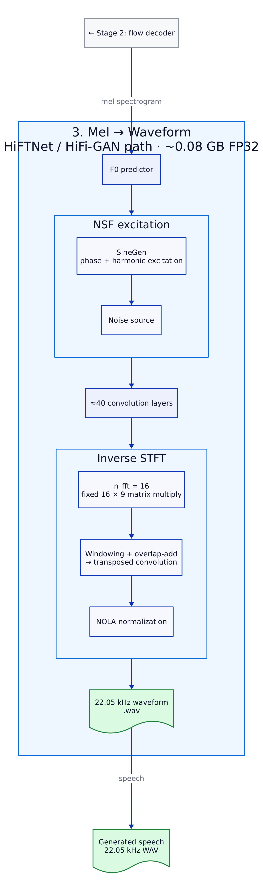

# CosyVoice-300M on Tenstorrent (TTNN)

TTNN bring-up of [CosyVoice-300M](https://github.com/FunAudioLLM/CosyVoice), Alibaba
FunAudioLLM's multilingual TTS model, for
[tenstorrent/tt-metal#32178](https://github.com/tenstorrent/tt-metal/issues/32178).

## Platforms

- Blackhole (`p150a`, `p150b`)
- Wormhole (`n300`)

## Overview

CosyVoice generates speech in three stages: an **LLM** predicts supervised semantic
tokens from text, a **flow-matching decoder** turns those tokens into a mel
spectrogram, and a **HiFTNet vocoder** turns the mel into a waveform. All three run
through TTNN here — including the vocoder, which is the part that is normally left
on the host. [Why that was the hard part](#why-the-vocoder-is-the-interesting-part).



| property | value |
|---|---|
| Parameters | ~300 M (llm 1.24 GB + flow 0.42 GB + hift 0.08 GB, fp32) |
| Sample rate | 22 050 Hz |
| Languages | Chinese, English, Japanese, Cantonese, Korean |
| Modes | SFT, zero-shot, cross-lingual, instruct |
| Status | **All three stages on device**, per-module PCC ≥ 0.99 against the reference. Figures in [PERF.md § Accuracy](PERF.md#accuracy) |

---

## Quick start

Every command in this file assumes these paths:

```bash
export TT_METAL_HOME=/path/to/tt-metal
export COSYVOICE_REPO=/mnt/CosyVoice            # the upstream checkout
export COSYVOICE_ENV=/mnt/cosyvoice_env         # the reference venv
export COSYVOICE_PY=$COSYVOICE_ENV/bin/python
export COSYVOICE_PYTHONPATH=$COSYVOICE_REPO:$COSYVOICE_REPO/third_party/Matcha-TTS
```

From a clean checkout to a `.wav`:

```bash
cd $TT_METAL_HOME/models/demos/cosyvoice

# 1. reference environment (host only, no device)
uv venv --python 3.10 $COSYVOICE_ENV
VIRTUAL_ENV=$COSYVOICE_ENV uv pip install -r requirements-reference.txt

git clone --recursive https://github.com/FunAudioLLM/CosyVoice.git $COSYVOICE_REPO
git -C $COSYVOICE_REPO checkout 074ca6dc9e80a2f424f1f74b48bdd7d3fea531cc
git -C $COSYVOICE_REPO submodule update --init --recursive

# 2. checkpoints (~6.9 GB)
$COSYVOICE_PY scripts/download_model.py --skip-onnx-trt

# 3. goldens and weights
export PYTHONPATH=$COSYVOICE_PYTHONPATH
$COSYVOICE_PY scripts/gen_golden.py --mode zero_shot
for m in hift flow llm; do
  $COSYVOICE_PY scripts/export_weights.py --module $m --fp16
done

# 4. synthesise on device
PYTHONPATH=$TT_METAL_HOME python demo/demo.py --out out.wav
```

---

## Setup

Two environments, deliberately separate. They do not share packages and should not.

| environment | what it is for |
|---|---|
| tt-metal `python_env` | running the model on device, PCC/perf tests |
| `cosyvoice_env` | the PyTorch reference: goldens, baseline audio, WER/SIM scoring |

The reference pins its own `torch` and `transformers` — see `requirements-reference.txt`,
which records why each pin is where it is. Forcing those into the tt-metal environment
would risk the tt-metal build for no benefit, since the reference never runs on device.

**Checkpoints.** `--skip-onnx-trt` omits `flow.decoder.estimator.fp32.onnx` (329 MB × 2),
which only the TensorRT export path reads. The three checkpoints then total ~6.9 GB.

> **First inference downloads more.** The text frontend fetches ~31 MB of `wetext` FSTs
> from ModelScope the first time it normalises text — not at import. A network-isolated
> run will fail there unless `~/.cache/modelscope` is already populated.

**Goldens.** `gen_golden.py` writes `tests/golden/*.npz` — one per module boundary, plus
`manifest.json`.

**Weights.** `export_weights.py` flattens each submodule's `state_dict` into
`tests/golden/<module>_weights.npz` with a JSON `__meta__` blob carrying the architectural
constants that cannot be read off a tensor shape. `weight_norm` is folded at export
(verified bit-exact) so the device never recomputes a constant normalisation.

---

## Running

### PCC tests

```bash
# host tier: no device, no silicon, ~40 s. 111 tests.
pytest models/demos/cosyvoice/tests/ -k "not device"

# device tier: needs /dev/tenstorrent. 35 device tests here, 11 more in perf below;
# the host tier lives in tests/pcc/ and runs here too, so this collects 146.
pytest models/demos/cosyvoice/tests/pcc/ models/demos/cosyvoice/tests/e2e/ -v

# performance -- see PERF.md for what the numbers mean
pytest models/demos/cosyvoice/tests/perf/ -v -s
```

### Demo

```bash
export PYTHONPATH=$TT_METAL_HOME
python models/demos/cosyvoice/demo/demo.py --out out.wav
```

Runs all three stages on device and writes a 22.05 kHz wav. With no arguments it
synthesises the captured golden utterance, which needs no front-end -- the quickest way to
hear the pipeline work, and it additionally scores itself against the reference waveform.

The front-end is not ported. `scripts/prepare_inputs.py` runs it once in the reference
venv and writes the flat `.npz` files the demo loads — see [What runs where](#what-runs-where).

**All four modes, real synthesis:**

`sft` and `instruct` need their own checkpoint's weights, not the base `CosyVoice-300M`
export above -- `llm.pt` differs across all three checkpoints and `flow.pt` differs for
`-SFT` specifically (`-Instruct`'s `flow.pt` is byte-identical to the base checkpoint's;
`hift.pt` is identical across all three, so one export covers every mode):

```bash
export PYTHONPATH=$COSYVOICE_PYTHONPATH
mkdir -p tests/golden/per_mode
$COSYVOICE_PY scripts/export_weights.py --checkpoint CosyVoice-300M-SFT --module llm --fp16 \
    --out tests/golden/per_mode/llm_weights_sft.npz
$COSYVOICE_PY scripts/export_weights.py --checkpoint CosyVoice-300M-Instruct --module llm --fp16 \
    --out tests/golden/per_mode/llm_weights_instruct.npz
$COSYVOICE_PY scripts/export_weights.py --checkpoint CosyVoice-300M-SFT --module flow --fp16 \
    --out tests/golden/per_mode/flow_weights_sft.npz
```

```bash
# in the reference venv, once:
$COSYVOICE_PY scripts/prepare_inputs.py --out-dir /tmp/sweep --langs en

# in tt-metal's python_env, on device:
export PYTHONPATH=$TT_METAL_HOME
python models/demos/cosyvoice/demo/demo.py --inputs /tmp/sweep --out /tmp/cosy_demo
```

Writes `sft_en.wav`, `zero_shot_en.wav`, `cross_lingual_en.wav` and `instruct_en.wav` into
`--out`. Unlike the golden path above, this generates fresh LLM tokens and a fresh vocoder
excitation per mode through `tt.pipeline.CosyVoiceTTNN.synthesize` — real synthesis, not
reproduction, so there is nothing to score it against and no two runs sound identical.
`--modes sft,instruct` restricts the loop; `--lang` picks which of
`prepare_inputs.py --langs`'s outputs to use (default `en`). One utterance per mode is the
right scope for a quickstart — the full mode x language sweep is what
`run_reference.py`/`eval_wer_sim.py` already cover for scoring.

### Reference baseline and scoring

```bash
export PYTHONPATH=$COSYVOICE_PYTHONPATH
$COSYVOICE_PY scripts/run_reference.py --out /tmp/ref
$COSYVOICE_PY scripts/eval_wer_sim.py --run-dir /tmp/ref
```

> **Never run scoring and synthesis at the same time.** Whisper large-v3 is ~9 GB
> resident on CPU and synthesis is ~4.6 GB; together they OOM an 11 GB host. The harness
> preflights available memory and refuses rather than getting killed mid-run. Pass
> `--asr-model medium` on a small box.

---

## What runs where

| stage | module | on device |
|---|---|---|
| text -> semantic tokens | `tt/llm/` — 6-block causal Conformer text encoder, 14-block AR decoder with a fixed-width KV cache, 4097-way head | yes |
| semantic tokens -> mel | `tt/flow/` — Conformer encoder, length regulator, 10-step CFM solver over a 16-resnet/64-transformer UNet | yes |
| mel -> waveform | `tt/hifigan/` — f0 predictor, NSF excitation, 40-odd convolutions, inverse STFT | yes |
| RAS sampling | `tt/llm/sampling.py` | host (Stage 1) |
| front-end (tokenizer, 2 ONNX encoders) | `scripts/prepare_inputs.py` | host, by design |

The front-end — text normalisation, the Whisper-family tokenizer, and the two **ONNX**
encoders (`speech_tokenizer_v1.onnx`, `campplus.onnx`) — stays on host by design: three
of the four are ONNX blobs, and none is on the critical path for this port.
`prepare_inputs.py` writes a flat `.npz` the device side loads without importing
CosyVoice or `onnxruntime` — the same boundary `export_weights.py` draws.

<details>
<summary>Each stage in detail</summary>







</details>

`tt/flow/reference.py` and `tt/llm/reference.py` reimplement their stages in plain torch
from the flat weight export alone — no CosyVoice, no `diffusers`, no device. Both reproduce
the captured goldens to PCC 0.9999999, which is what lets a device bring-up start from
"the graph is right" instead of bisecting eighty blocks on rented silicon.

### The trap: three modules draw from the RNG mid-forward

`ConditionalCFM.forward` draws `z = randn_like(mu)`; `SineGen.forward` draws a per-harmonic
phase offset from `U(−π, π)` plus Gaussian noise; `SourceModuleHnNSF.forward` draws noise
again.

Seeding does **not** make TTNN and PyTorch comparable — it only makes PyTorch reproducible
against itself, because TTNN cannot consume the torch RNG stream in the same order. So
`gen_golden.py` **captures every draw as a named array**, and the TTNN modules take them as
explicit inputs during PCC tests. Get this wrong and a perfectly correct vocoder port scores
PCC ≈ 0.3.

---

## Why the vocoder is the interesting part

TTNN has **no FFT of any kind**. A case-insensitive search for `fft|rfft|irfft|stft|istft`
across `ttnn/` and `tt_metal/` returns nothing. HiFTNet ends in an inverse STFT, so the
vocoder looks unportable — and is usually left on the host.

It does not actually block anything, because CosyVoice uses **`n_fft = 16`**. At that
size the inverse DFT of 9 one-sided bins is a fixed 16×9 real matrix pair, smaller than a
single 32×32 tile. So it is a **matmul** — and a matmul maps onto the FPU, the widest unit
on a Tensix core. Windowing and overlap-add then fuse into a single
**transposed convolution** with a diagonal kernel, because OLA
(`out[t·h + j] += frames[j,t]·w[j]`) and `conv_transpose1d`
(`out[o, t·s + k] += in[i,t]·W[i,o,k]`) are the same operation. The NOLA normalisation
depends only on the frame count, so it is a precomputed constant and one multiply.

Net: `matmul + conv_transpose2d + multiply`. All of which TTNN already has.

Verified against the real vocoder's captured magnitude/phase — spanning
1.06e-13 to 1.21e+01, fourteen decades:

```
PCC fp32      1.0000000000   max|Δ| 2.98e-07
PCC bf16-in   0.9999765688   max|Δ| 5.25e-03
```

See `tt/hifigan/istft.py` for the derivation and `tests/pcc/test_istft.py` for the checks.

---

## Validation strategy

Designed first rather than last — the gates below were written before the port, not
fitted to it.

| what is gated | how |
|---|---|
| Token accuracy | Exact agreement, not top-k overlap: teacher-forced argmax match per position, plus free-running greedy (`top_k=1`) full-sequence comparison. RAS sampling (`top_p 0.8`, `top_k 25`) is stochastic — reported for audio quality, never the gate. |
| Per-module numerics | PCC ≥ 0.99 against goldens captured from the reference. |
| Streaming | Content, not chunk count: concatenated streamed audio versus non-streamed, same text and seed. |
| Perf targets | Ordinary passing tests. A missed target is reported with the gap explained rather than marked `xfail`. |

**Every measured figure lives in [`PERF.md`](PERF.md) and nowhere else** — the end-to-end
RTF, the per-stage breakdown, the Blackhole/Wormhole comparison, which targets are met on
which part, and the per-module PCCs under [§ Accuracy](PERF.md#accuracy). The handful of
PCCs quoted in this file support an argument; PERF.md is the record.

**[`docs/VALIDATION.md`](docs/VALIDATION.md) maps it the other way** — every requirement
in the bring-up scope against the test that decides it, including the ones that are not
met and why. It carries no numbers of its own; it links to PERF.md for each. Start there
to check a specific requirement; start at PERF.md to read the measurements.

### Two things cannot be gated on exact agreement

RAS sampling is a multinomial draw, so the LLM is gated on its *logits* and the audio
chain on the reference's *captured tokens*.

NSF excitation phase is chaotically sensitive to f0. A 0.03 Hz error accumulates a tenth
of a cycle over an utterance — finer than Tensix arithmetic delivers. So waveform
*samples* are gated with the reference excitation injected, and the *envelope* without it.

---

## Layout

```
models/demos/cosyvoice/
├── README.md                    this file
├── requirements-reference.txt   reference-environment pins (CPU)
├── docs/
│   ├── VALIDATION.md            every requirement -> the test that decides it
│   ├── security.md              dependency review, and the open-advisory disposition
│   └── diagrams/                .d2 sources + rendered .svg/.png; ./render.sh rebuilds them
├── scripts/
│   ├── download_model.py        stdlib-only, resumable checkpoint fetch
│   ├── gen_golden.py            capture per-module goldens from the reference
│   ├── run_reference.py         4 modes x 5 languages, with tok/s + RTF
│   └── eval_wer_sim.py          WER/CER + speaker similarity
├── tt/
│   ├── model_config.py          every dtype, memcfg and shape constant
│   ├── common.py                golden loading, PCC, weight_norm folding
│   ├── llm/                     text encoder, AR decoder, rel-pos attention, RAS
│   ├── flow/                    conformer encoder, length regulator, CFM, estimator
│   └── hifigan/                 upstream's path name; the model is HiFTNet
│       └── istft.py             the iSTFT identity  <- the enabling result
└── tests/
    ├── golden/                  captured .npz + manifest.json
    ├── pcc/                     per-module PCC >= 0.99
    ├── e2e/                     4 modes x 5 languages, exact-token, WER, SIM
    └── perf/                    tok/s and RTF gates
```

---

## Known constraints

- **`weight_norm` must be folded at load time.** Every conv in HiFT is wrapped in it;
  folding `w = g·v/‖v‖` on host removes a per-inference normalisation for free.
- **The CFM solver's classifier-free guidance is already batched upstream** into one
  2-row call. Preserve it; unrolling it into two calls doubles the cost of the hottest
  module in the model.
- **`att_cache` is `[n_layers, n_heads, T, 2·head_dim]`** with K and V concatenated on
  the last axis. `ttnn.experimental.paged_cache` does not take this shape directly.
- **`SineGen` integrates phase with `cumsum` over the audio-rate signal.** In bfloat16 an
  accumulator reaching ~1e3 loses the ~1e-2 increments entirely; use
  `ttnn.cumsum(dtype=ttnn.float32)`.
- **RAS's retry path is a plain multinomial over the full 4097-token vocabulary**, not a
  re-draw from the truncated distribution. `ttnn.sampling` covers the primary path only.
