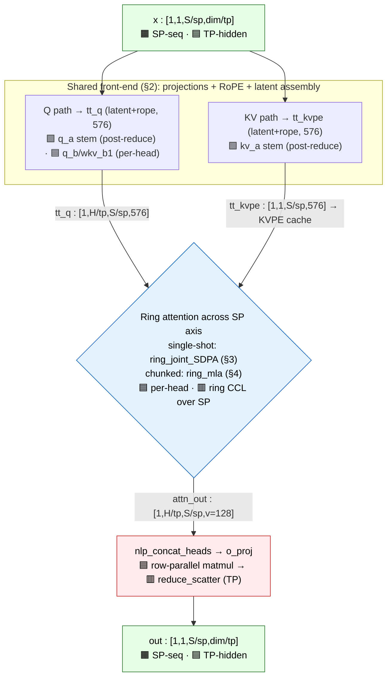
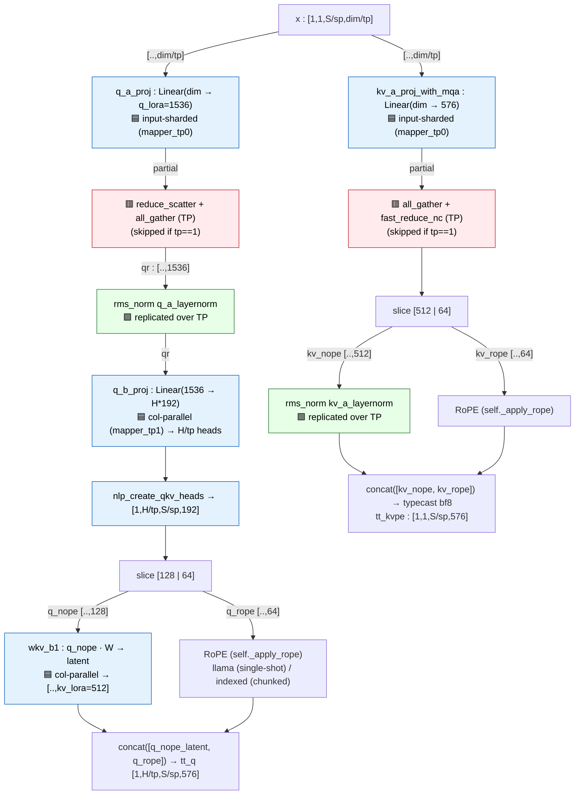
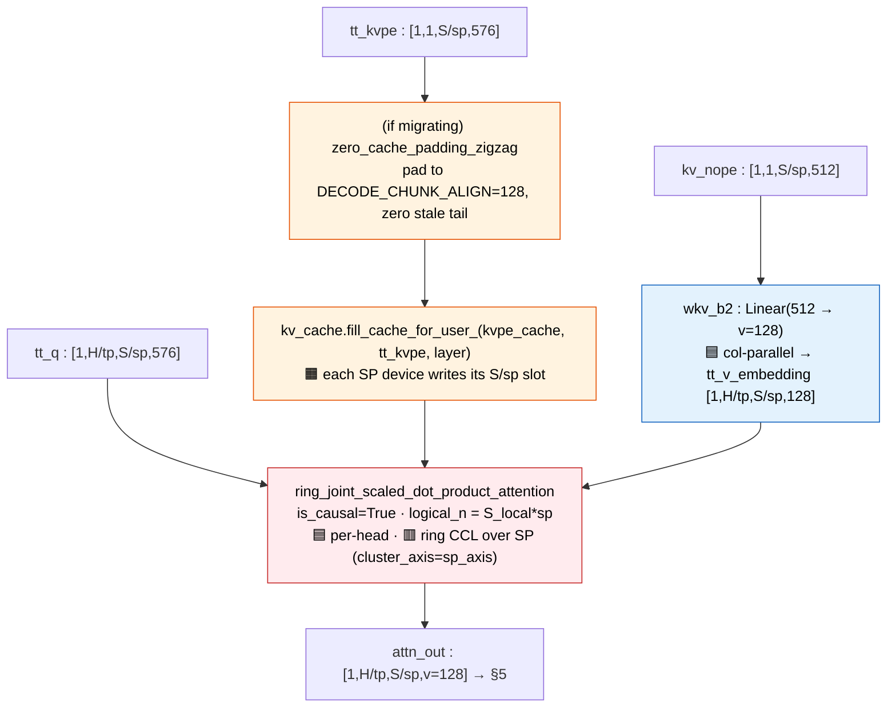
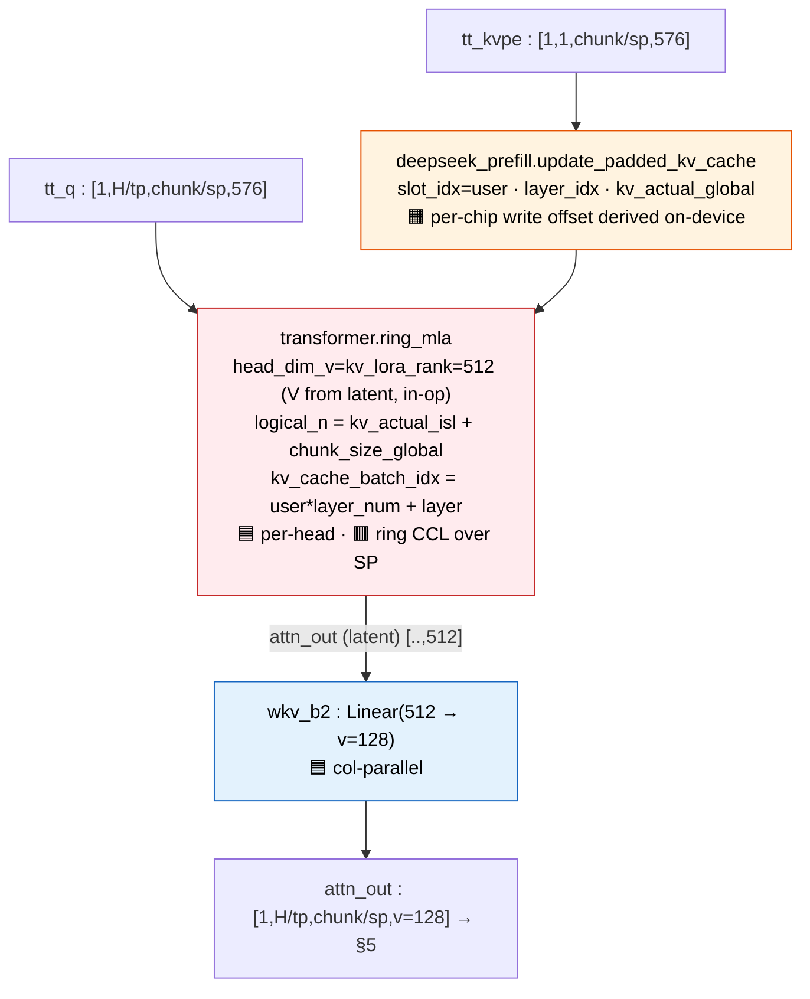
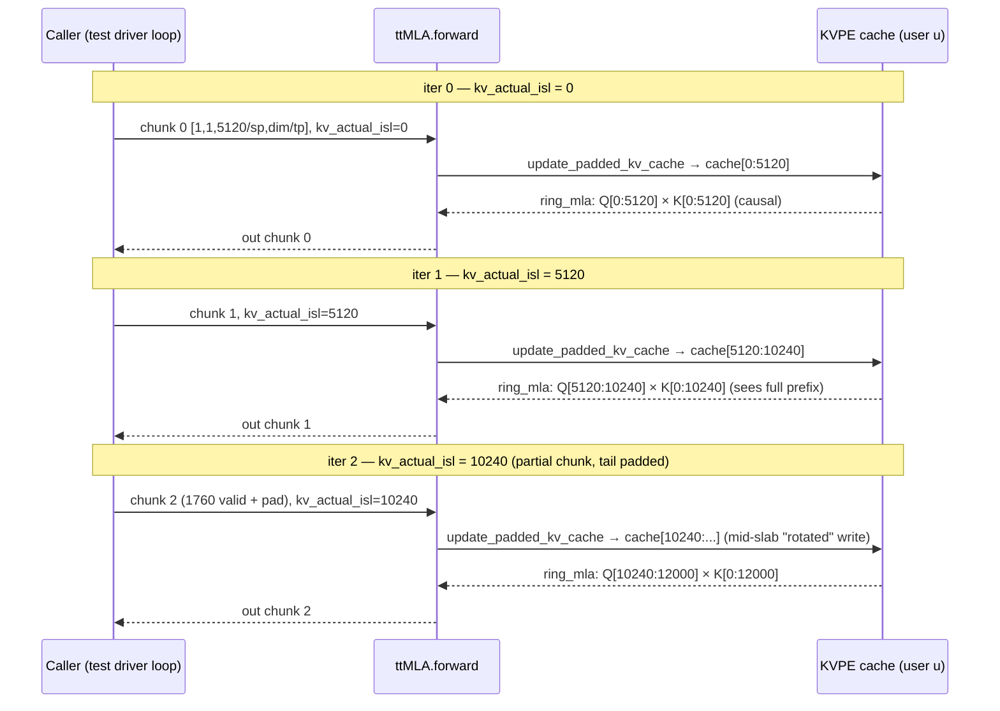
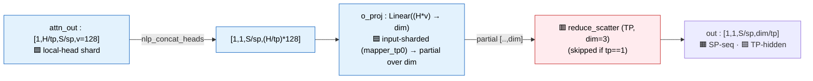
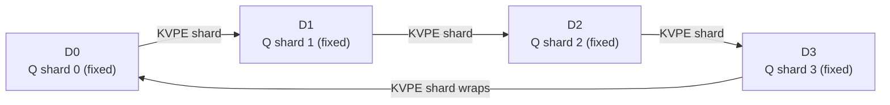

# MLA (Multi-Head Latent Attention) — Single Layer, Tenstorrent port

Source: `models/demos/deepseek_v3_d_p/tt/mla/` (`mla.py`, `rope.py`, `utils.py`, `mla_config.py`).
This is the **multi-device TT (ttnn) prefill** port of DeepSeek-V3 MLA. Where useful it is compared to the
single-device CPU reference (`models/demos/deepseek_v32/reference_cpu/MLA_LAYER.md`), whose section numbering this
document mirrors. The functional ground truth for *this* port is `reference/mla_reference.py` (an absorbed-form torch MLA).

> **Two big-picture differences from the CPU reference, up front:**
> 1. **Prefill-only, two prefill variants.** This module never runs decode (the `_d_p` = *disaggregated prefill* demo
>    streams KV to a separate decode server). Its "two paths" are **single-shot** and **chunked** prefill, not
>    prefill/decode. Both are on `main` — chunked prefill merged via PR&nbsp;#46345 (commit `92814d57026`).
> 2. **TP *and* SP.** The CPU reference is tensor-parallel only (head-partitioned, one `all_reduce`). This port adds
>    **sequence parallelism** over a 2-D device mesh and runs **ring attention** across the SP axis — the exact mechanism
>    the CPU doc's Appendix C.2 described as "not in this code." See §8.
> 3. **Dense MLA, no Indexer.** This is DeepSeek-**V3** (dense MLA). There is no lightning indexer / DSA sparse selection
>    here, so the CPU reference's Appendix A has no counterpart (see Appendix A below).

## Symbols & dimensions

| Symbol | Meaning | Value (V3 671B cfg) |
|---|---|---|
| `B` | batch size | 1 (per call) |
| `S` | global sequence (prompt / chunk) length | runtime |
| `sp` = `sp_factor` | devices on the sequence-parallel axis (`mesh.shape[sp_axis]`) | mesh-dependent (e.g. 8) |
| `tp` = `tp_factor` | devices on the tensor-parallel axis (`mesh.shape[tp_axis]`) | mesh-dependent (e.g. 4) |
| `S_local` | per-device sequence = `S / sp` | runtime |
| `H` | attention heads (`num_attention_heads`) | 128 (kimi_k2_6 variant differs) |
| `H_local` | per-device heads = `H / tp` | runtime |
| `dim` | model dim (`hidden_size`) | 7168 |
| `q_lora_rank` | query LoRA rank | 1536 |
| `kv_lora_rank` (`c`) | KV latent rank | 512 |
| `qk_nope_head_dim` | non-positional Q/K per-head dim | 128 |
| `qk_rope_head_dim` (`r`) | rotary Q/K per-head dim | 64 |
| `qk_head_dim` | nope+rope | 192 |
| `v_head_dim` | value per-head dim | 128 |
| `kvpe` | cached latent width = `kv_lora_rank + qk_rope_head_dim` | **576** |

Activation entering `ttMLA.forward` is **sharded on both mesh axes**:

```
hidden_states : [1, 1, S/sp, dim/tp]      # SP on seq dim, TP on hidden dim
```

Two prefill variants share one front-end (selected by whether `kv_actual_isl` is passed; see §3/§4):
- **Single-shot** (`is_chunked=False`): the whole local sequence is filled into the cache and attended in one ring pass.
- **Chunked** (`is_chunked=True`, merged via PR&nbsp;#46345): the prompt arrives in fixed `chunk_size_global` pieces over
  many `forward()` calls; each appends its KV and attends over the whole valid prefix so far.

---

## 1. High-level architecture

**Parallelism legend** (used in all diagrams): 🟩 **replicated** · 🟦 **TP-sharded** (per-head, `H_local = H/tp`) ·
🟧 **SP-sharded** (per-token, `S_local = S/sp`) · 🟥 **comm** (CCL collective). See §8 for the full story.



Unlike the CPU reference (one collective per layer), this port communicates **several times**: a TP reduce around the Q
stem and the KV stem, the **ring-attention CCL** across SP, and a TP `reduce_scatter` at `o_proj`. All of it disappears
when `tp==1` *and* `sp==1`, but the ring-attention op is what makes SP work.

---

## 2. Shared front-end (runs in both variants)

`forward()` builds the *absorbed* latent query and the latent KVPE — this port never materializes per-head K. Note
`wkv_b1` (the nope half of the reference's `kv_b_proj`) is folded into Q here, so `tt_q` ends up in latent space and
attends directly against the latent cache (the same absorption the CPU reference uses only in its decode path — here it
is used in **both** prefill variants).



Notes:
- **Latent stems are input-sharded, then reduced.** `q_a_proj` and `kv_a_proj_with_mqa` shard the *input* (hidden) dim
  across TP (`mapper_tp0`), so each device produces a partial; a TP collective reconstructs the latent. The Q stem uses
  `reduce_scatter`→`all_gather`; the KV stem uses `all_gather`→`fast_reduce_nc`. (Contrast the CPU reference, which keeps
  the latent stems fully **replicated** with no comm — see §8.)
- **`tt_q` is latent+rope (576), not 192.** Folding `wkv_b1` into `q_nope` projects it to `kv_lora_rank=512`; concatenated
  with the 64-wide roped part gives a 576-wide query that dots against the 576-wide latent KVPE. This is the absorption
  identity from the reference, applied to prefill.
- **RoPE op is bound once** in `__init__` (`self._apply_rope`): single-shot → `rotary_embedding_llama`; chunked →
  `deepseek_prefill.rotary_embedding_indexed` (offset-aware; see §4 / Appendix B). MLA RoPE here is YaRN-scaled, applied to
  both `q_rope` and `kv_rope`.
- **`tt_kvpe` is the only thing cached** — the latent `kv_nope` (512) + shared `kv_rope` key (64). No per-head K/V.

---

## 3. Single-shot prefill path (`is_chunked=False`)

The whole local sequence is written to the cache, then attended in one ring pass. V is **materialized** per head via
`wkv_b2` *before* attention (so this path is K-absorbed but V-explicit — a hybrid of the reference's prefill and decode).



- **Ring attention is the SP mechanism.** `ring_joint_scaled_dot_product_attention` rotates each device's KVPE shard
  around the SP ring so every query (which sits on one device) eventually sees all `S` keys, with causal masking — this is
  the "ring/striped attention" the CPU reference flagged as required for sequence-parallel keys. `logical_n = S_local*sp`
  is the true global length. The `joint_q/kv/v` are zero-length placeholders here.
- **`is_balanced` (zigzag).** When set, the sequence is pre-split into `2*sp` chunks and interleaved across SP devices
  (`create_balanced_chunk_order` in `utils.py`) so the causal-triangle workload is balanced. Caller undoes the
  permutation on the logits.
- **`zero_cache_padding_zigzag`** runs only when a migration callback is set: it zeros the cache region between the real
  prompt end and the next 128-token boundary so the downstream decode server (which reads KV in 128-token chunks) never
  sees stale KV from a prior request.

---

## 4. Chunked prefill path (`is_chunked=True`)

One chunk per `forward()`; the caller loops, accumulating `kv_actual_isl` (the count of valid KV tokens already cached).
Here **both K and V come from the latent cache** (`ring_mla` materializes V in-op from the first `kv_lora_rank` columns),
so `wkv_b2` is applied to the *compact* attention output **after** attention — full weight-absorption, matching the CPU
reference's decode math.



The caller's loop, one chunk per call (12000-token prompt, `chunk_size_global=5120`):



- **`kv_actual_isl` drives three things on-device**: the per-chip cache-write offset (`update_padded_kv_cache`), the RoPE
  rotation (`rotary_embedding_indexed`), and the causal/attention offset (`ring_mla`). One runtime value keeps them
  consistent. Chunk-aligned (`kv_actual_isl = n·chunk_size_global`) is the degenerate uniform-write case of the same code;
  mid-slab is the "rotated" case.
- **Block-cyclic cache layout.** KV is stored slab-major/block-cyclic so a plain SP shard hands each chip exactly the rows
  it owns; the RoPE cos/sin table is `block_cyclic_reorder`'d the same way (`rope.py::get_rope_tensors_indexed`, helpers in
  `utils.py`). See Appendix B.
- **User-major cache.** `cache_batch_idx = cache_user_id * layer_num + cache_layer_idx`, so multiple users' chunks
  interleave through one MLA without cross-contamination.
- **Constraints / TODOs:** requires `is_balanced=False`; no migration callback yet; `chunk_size_global % (TILE*sp)==0`,
  `kv_actual_isl` tile-aligned. The per-mode ring buffer (`_chunked_kv_buf`) is allocated per-layer/full-batch — flagged
  in-code as DRAM to reclaim (hoist to a shared owner; relax `ring_mla` to a batch-1 gather buffer).

---

## 5. Output (both variants)



`o_proj` is the TT analogue of the reference's `RowParallelLinear`, but the closing collective is a **`reduce_scatter`**
(not `all_reduce`): it sums the TP partials *and* leaves the result sharded back on the hidden dim, so the output matches
the `[.., dim/tp]` layout the next block expects. The result stays SP-sharded on the sequence dim throughout.

---

## 6. Parameter / weight inventory (one MLA layer)

Weights are converted and cached by `_convert_and_cache_weights` (8 tensors). Mesh mapper and dtype per weight:

| ttMLA weight | From reference | Shape (in → out) | Mesh mapper | dtype |
|---|---|---|---|---|
| `q_a_layernorm` | `q_a_layernorm` | (1536,) | replicate | bf16 |
| `kv_a_layernorm` | `kv_a_layernorm` | (512,) | replicate | bf16 |
| `q_a_proj` | `q_a_proj` | dim → 1536 | TP dim 0 (input) | bf8 |
| `q_b_proj` | `q_b_proj` | 1536 → H*192 | TP dim 1 (output/head) | bf8 |
| `kv_a_proj_with_mqa` | `kv_a_proj_with_mqa` | dim → 576 | TP dim 0 (input) | bf8 |
| `wkv_b1` | `kv_b_proj`[nope half] | per-head 128 → 512 | TP dim 1 (head) | bf8 |
| `wkv_b2` | `kv_b_proj`[v half] | per-head 512 → 128 | TP dim 1 (head) | bf8 |
| `o_proj` | `o_proj` | H*128 → dim | TP dim 0 (input) | bf8 |

The reference's single `kv_b_proj` is **pre-split** at load into `wkv_b1` (nope→latent, absorbed into Q) and `wkv_b2`
(latent→v, applied after attention). Buffers (not weights): the **KVPE cache** `[users*layers, 1, S/sp, 576]` and the
per-mode ring scratch buffers (`persistent_k/v` + joint, or `_chunked_kv_buf`).

`scale = qk_head_dim**-0.5`, × `mscale²` YaRN correction when `rope_scaling.factor > 1`. Matmul/SDPA program configs are
hand-tuned per local seq-len in `mla_config.py` (`MLA_MATMUL_CONFIG`, `MLA_SDPA_CONFIG`); `q_chunk_size`/`k_chunk_size`
there are the FlashAttention tiling sizes inside the ring SDPA, not the prefill chunk size.

---

## 7. Implementation checklist / gotchas

1. **Mode is fixed at construction.** `is_chunked` (init) must match per-call mode (`kv_actual_isl is not None`) — the ring
   buffers are pre-allocated per-mode, so a mismatch references buffers that don't exist (hard assert).
2. **Input is double-sharded.** Activations enter as `[1,1,S/sp,dim/tp]`; get the mesh mapper axes right (`sp_axis=0`,
   `tp_axis=1` by default) or every collective lands on the wrong axis.
3. **Latent stems reduce, head projections don't.** `q_a_proj`/`kv_a_proj_with_mqa`/`o_proj` are input-sharded (need a TP
   reduce); `q_b_proj`/`wkv_b1`/`wkv_b2` are output/head-sharded (no comm). Skip all TP collectives when `tp==1`.
4. **RoPE convention differs by mode.** Single-shot uses `rotary_embedding_llama`; chunked uses the offset-aware
   `rotary_embedding_indexed` over a block-cyclic cos/sin table. They must agree with how the cache was written.
5. **wkv_b placement.** Single-shot materializes V (`wkv_b2`) *before* SDPA; chunked applies `wkv_b2` *after* `ring_mla`.
   Both fold `wkv_b1` into Q in the front-end.
6. **Causality & `logical_n`.** Pass the true global length (`S_local*sp` single-shot; `kv_actual_isl + chunk_size_global`
   chunked) so the ring op masks correctly across SP.
7. **`is_balanced` only in single-shot.** Zigzag load-balancing is incompatible with chunked prefill (asserted).
8. **Precision.** Weights/activations are bf8/bf16 with tuned configs; the torch reference (`mla_reference.py`) is the PCC
   oracle (≈0.99+). Don't expect bit-exactness — validate with PCC.

---

## 8. Distribution scheme — SP | TP, and comparison of design choices

This is the heart of the difference from the CPU reference. MLA here runs on a **2-D device mesh**: axis `sp_axis`
(sequence parallel) × axis `tp_axis` (tensor parallel).

### 8.1 Tensor Parallelism (head-partitioned) — same idea as the reference, different collectives

TP shards attention heads across `tp` devices (`H_local = H/tp`), the classic column→row sandwich. But because the input
hidden state is **also** TP-sharded (`dim/tp`), the latent stems are realized as **input-sharded** matmuls that need a
reduce, rather than the reference's replicated stems:

| Stage | Layer | TT TP behavior | CPU reference |
|---|---|---|---|
| Q stem | `q_a_proj`, `q_a_layernorm` | 🟦 input-sharded → 🟥 `reduce_scatter`+`all_gather`, then replicated norm | 🟩 replicated, **no comm** |
| Q heads | `q_b_proj`, `wkv_b1` | 🟦 col-parallel → `H/tp` heads | 🟦 `wq_b` col-parallel |
| KV stem | `kv_a_proj_with_mqa`, `kv_a_layernorm` | 🟦 input-sharded → 🟥 `all_gather`+`fast_reduce_nc` | 🟩 replicated, **no comm** |
| V expand | `wkv_b2` | 🟦 col-parallel (per head) | 🟦 `wkv_b` col-parallel |
| Attention | ring SDPA / ring_mla | 🟦 per-head + 🟥 ring CCL (SP, see 8.2) | 🟦 per-head, **no comm** |
| Output | `o_proj` | 🟦 input-sharded → 🟥 `reduce_scatter` | 🟦 `wo` row-parallel → 🟥 `all_reduce` |

The reference keeps `dim` replicated, so its latent stems are free and the **only** collective is `wo`'s `all_reduce`.
This port keeps `dim` sharded end-to-end (to cut activation memory), which costs two extra TP reduces (Q stem, KV stem)
but never materializes the full `dim` activation on any device. `o_proj` closes with `reduce_scatter` (not `all_reduce`)
to *stay* sharded for the next block.

### 8.2 Sequence Parallelism — present here, absent in the reference

The CPU reference's Appendix C.2 says SP "is not in this code" and that sharding **keys** across devices needs ring/striped
attention. **This port implements exactly that.** The sequence dim is sharded `S → S/sp` across the SP axis, and:

- Token-independent front-end ops (`q_a_proj`, norms, `kv_a_proj`, RoPE, `wkv_b*`) operate per local token shard — free
  under SP.
- The **attention score couples the key axis**, so the SP ring (`ring_joint_scaled_dot_product_attention` /
  `ring_mla`, `cluster_axis=sp_axis`) rotates each device's KVPE shard around the ring until every query has seen all `S`
  keys, with causal masking. This is the ring/striped attention the reference only described hypothetically.
- **`is_balanced` zigzag** (`create_balanced_chunk_order`) addresses the causal load imbalance the reference also noted:
  split into `2*sp` chunks and interleave so each device gets one "early/cheap" and one "late/expensive" chunk.

The ring, pictured (sp=4): queries stay put, KVPE shards rotate one hop per step; after `sp` steps every query has seen all keys.



### 8.3 KV cache: replicated (reference) vs SP-sharded (here)

| | CPU reference (TP only) | TT port (SP × TP) |
|---|---|---|
| What's cached | latent `kv_cache (…,512)` + `pe_cache (…,64)` | combined `kvpe (…,576)` |
| Layout | **replicated** across TP ranks | **SP-sharded** on seq (`S/sp` per device), replicated across TP |
| Why | latent is head-shared → cheap to replicate | seq is the parallel axis → shard it; latent is still head-shared so TP replicates |
| Write | `[:, start:end] = kv` (contiguous) | `fill_cache_for_user_` (single-shot) / `update_padded_kv_cache` block-cyclic (chunked) |

The reference can afford to replicate the (tiny, 576/token) latent cache because TP doesn't touch the sequence axis. This
port shards it on the sequence axis (that *is* the SP axis) and reads it back through the ring, which is what enables long
context to scale across devices rather than being bounded by one device's DRAM.

### 8.4 Design-choice summary

| Dimension | CPU reference (`reference_cpu`) | TT port (`tt/mla`) |
|---|---|---|
| Parallelism | TP only (heads) | TP (heads) **+ SP (sequence)**, 2-D mesh |
| Collectives / layer | 1 (`all_reduce` in `wo`) | Q-stem reduce + KV-stem reduce + ring-attention CCL + `o_proj` reduce_scatter |
| Hidden dim | replicated | TP-sharded end-to-end |
| Runtime paths | prefill (MHA) + decode (MQA absorbed) | single-shot prefill + chunked prefill (decode is a separate server) |
| K/V handling | prefill materializes; decode absorbs | both absorb K into Q; single-shot materializes V, chunked absorbs V (`ring_mla`) |
| Sparse attention | Indexer / DSA (V3.2) | none — dense MLA (V3) |
| Precision | fp32/bf16 reference (fp8 simulated) | bf8/bf16 with tuned program configs |
| Cache | replicated latent | SP-sharded latent, user-major batch |

### 8.5 Other axes
- **Data/batch**: `B=1` per call here; batching is across users via the user-major cache (chunked).
- **Pipeline**: across the 61 layers; orthogonal (one `ttMLA` per layer).
- **Expert parallel**: MoE concern, not MLA.

---

## Appendix A — Indexer / sparse attention: **not present**

The CPU reference (DeepSeek-**V3.2**) has a lightning indexer (DSA) producing `topk_indices` that mask attention. This
port is DeepSeek-**V3** dense MLA: `tt/mla` has no indexer, no `topk_indices`, no index mask — attention is dense causal
over the full (ring-gathered) prefix. If/when a sparse variant is ported, it would slot in as an additive mask on the key
axis before the ring softmax, and (like the reference) would need to produce identical selection across the TP head shards
— but here it would also have to be consistent across the **SP** shards, since the key axis is itself sequence-parallel.

## Appendix B — KVPE cache & the chunk schedule

### B.1 What is cached
One combined latent buffer per (user, layer): `kvpe [users*layers, 1, S/sp, 576]` = latent `kv_nope` (512) + shared roped
key `kv_rope` (64). No per-head K/V (~71× smaller than classic MHA cache, same win as the reference). The batch dim is
user-major: `slot = user*layer_num + layer` (`init_kvpe_cache(..., num_users)`).

### B.2 Single-shot write
`fill_cache_for_user_(kvpe_cache, tt_kvpe, cache_layer_idx)` writes the whole `S/sp` local slot. Optional
`zero_cache_padding_zigzag` zeros `[actual_isl, next 128-boundary)` for clean migration to decode.

### B.3 Chunked write & the `kv_actual_isl` schedule
The caller loops one chunk per `forward()`:
```
kv_actual = prefill_len + sum(prior chunk lengths)   # valid tokens already cached
forward(..., kv_actual_isl=kv_actual, cache_user_id=u)
```
`update_padded_kv_cache` derives each chip's write offset on-device from `kv_actual_global`. The layout is **block-cyclic /
slab-major**: chip `c`'s SP-contiguous shard holds blocks `c, c+sp, c+2sp, …`. `utils.py` mirrors the writer kernel
exactly — `rotated_chip_positions` (per-chip global position incl. the mid-slab "rotated" boundary chip),
`blockcyclic_positions` (its inverse, for validation), `blockcyclic_cache_host` (host-side cache assembly). The RoPE table
(`rope.py::get_rope_tensors_indexed`) is `block_cyclic_reorder`'d the same way and built **once**, reused across all chunks
with only `kv_actual_global` varying.

A mid-slab ("rotated") write, sp=4 (cell = chunk-sized block; block `b` lives at chip `b % sp`, slab `b // sp`):

| | slab 0 | slab 1 | slab 2 |
|---|---|---|---|
| chip 0 | blk 0 ✅ | blk 4 ✅ | blk 8 🟠 |
| chip 1 (boundary) | blk 1 ✅ | blk 5 🟠 | blk 9 · |
| chip 2 | blk 2 ✅ | blk 6 🟠 | blk 10 · |
| chip 3 | blk 3 ✅ | blk 7 🟠 | blk 11 · |

✅ already valid (`kv_actual_isl` ends inside slab 1) · 🟠 this chunk's write — chips 1–3 finish slab 1 while chip 0,
already past the boundary, starts slab 2. The union tiles `[kv_actual, kv_actual + chunk_size_global)` exactly.

### B.4 Correctness invariant
Chunked prefill of a prompt in pieces must equal single-shot prefill of the same prompt (per-position output PCC), and the
device KV cache must match the torch reference's cache (`k_nope` directly; `k_pe` after Meta-interleave). This is exactly
what `tests/test_mla.py::test_mla_chunked_prefill` checks across rotation-edge / maxedge / production / multi-user
scenarios, on cpu/trace/func references and multiple meshes.

---

## Appendix C — Multi-device parallelism

Folded into §8 (this port's parallelism *is* the headline difference from the reference). In short: set `sp=1, tp=1` and
every collective vanishes, `H_local==H`, `S_local==S`, and the math reduces to the absorbed torch MLA in
`reference/mla_reference.py`. Keep the head and sequence axes explicit in your tensors — they are the axes this port shards.
