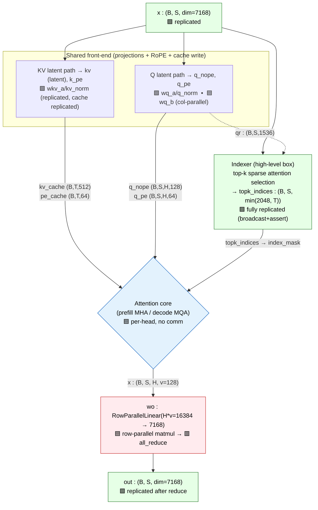
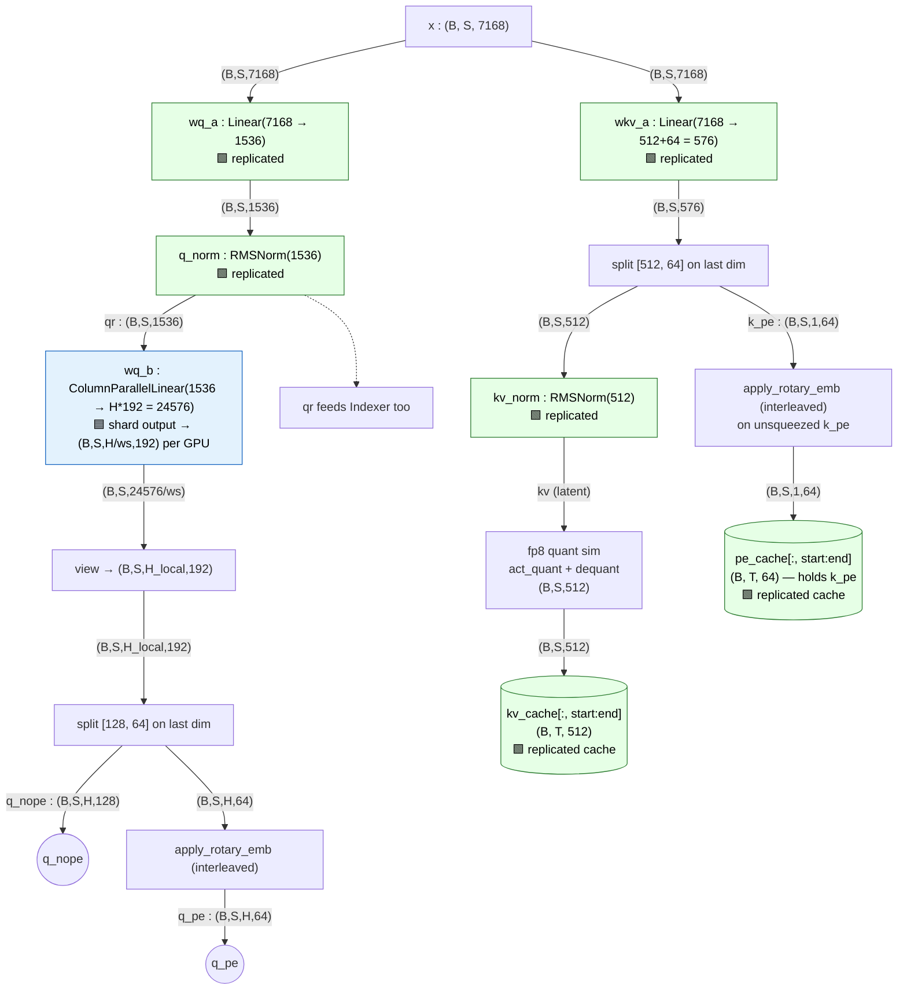
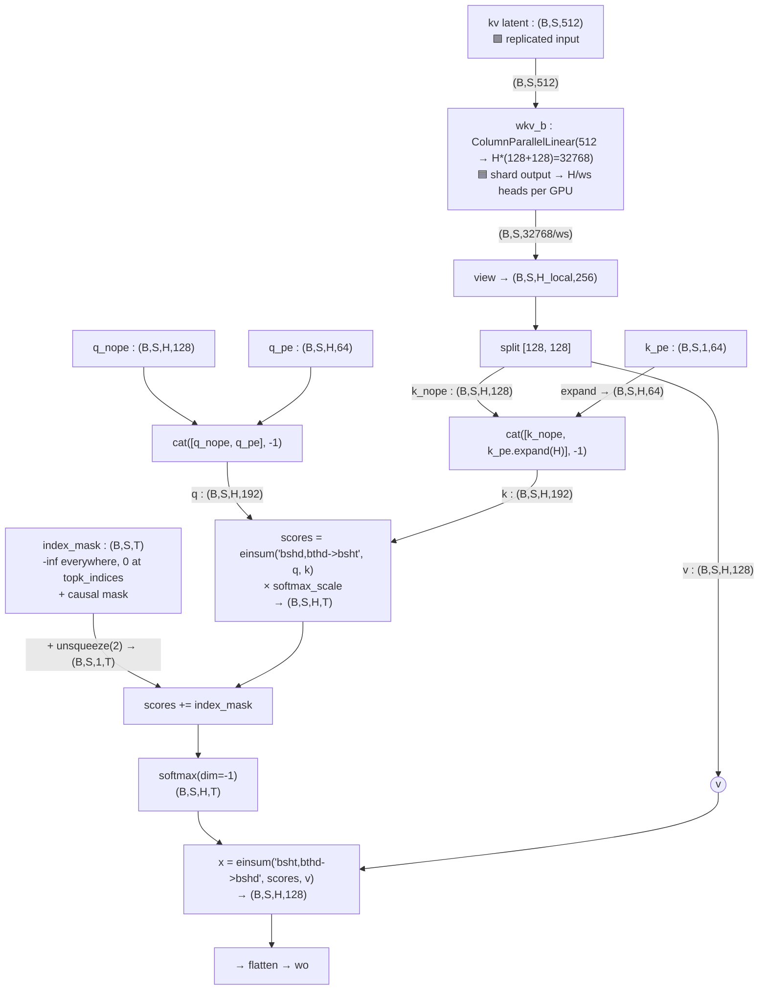
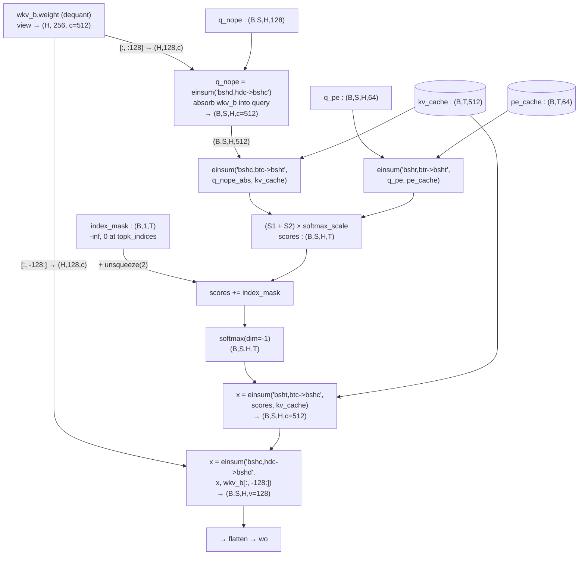
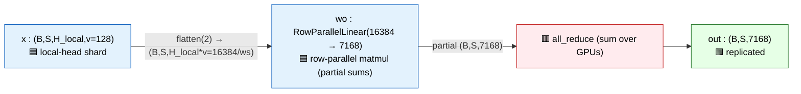
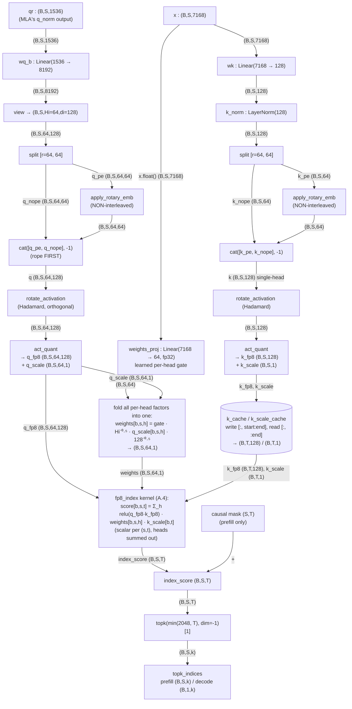

# MLA (Multi-Head Latent Attention) — Single Layer

Source: `inference/model.py`, `class MLA(nn.Module)`.
Dimensions below use the production config `inference/config_671B_v3.2.json`.

## Symbols & dimensions

| Symbol | Meaning | Value (671B cfg) |
|---|---|---|
| `B` | batch size | runtime |
| `S` | current chunk seq len | runtime (prefill: full chunk; decode: 1) |
| `T` | total cached length = `start_pos + S` (`end_pos`) | runtime |
| `H` | attention heads (`n_heads`, =`n_local_heads` when world_size=1) | 128 |
| `dim` | model dim | 7168 |
| `q_lora_rank` | query LoRA rank | 1536 |
| `kv_lora_rank` (`c`) | KV latent rank | 512 |
| `qk_nope_head_dim` | non-positional Q/K per-head dim | 128 |
| `qk_rope_head_dim` (`r`) | rotary Q/K per-head dim | 64 |
| `qk_head_dim` | nope+rope = 192 | 192 |
| `v_head_dim` | value per-head dim | 128 |

Two distinct runtime paths share the same front-end:
- **Prefill / MHA** (`mask is not None`): K and V are materialized per head, standard attention.
- **Decode / MQA** (`mask is None`): `wkv_b` is *absorbed* into Q so attention runs directly against the latent `kv_cache` — no per-head K/V materialization.

---

## 1. High-level architecture

**Parallelism legend** (used in all diagrams below): 🟩 **replicated** = same compute on every GPU · 🟦 **TP-sharded** = tensor-parallel, each GPU owns `H/world_size` heads · 🟥 **comm** = collective (`all_reduce`). See Appendix C for the full story.



---

## 2. Shared front-end (runs in both paths)



In TP, the entire KV-latent path (`wkv_a`, `kv_norm`, fp8 sim) and the Q-latent stem (`wq_a`, `q_norm`) run **identically on every GPU** — they operate on the small latent, so they are duplicated rather than sharded. Only `wq_b` shards (by head). The caches are replicated because the latent is shared across all heads.

Notes for CPU port:
- `RMSNorm(d)`: `x * rsqrt(mean(x^2, -1) + eps) * weight`, weight shape `(d,)`. See `class RMSNorm` ~line 272.
- `apply_rotary_emb` here is **interleaved** (`interleaved=True`); the Indexer uses `interleaved=False`. The rope dim is 64 → 32 complex pairs. `freqs_cis` is precomputed (YaRN-scaled) in `precompute_freqs_cis` (~line 324).
- The fp8 quant/dequant of `kv` (lines 570-571) only **simulates** the deployed fp8 KV cache precision. On CPU you may keep it as a no-op (store bf16/fp32) unless you want bit-accuracy.
- `kv_cache` stores the **latent** `kv` (512, no rope), not per-head K. `pe_cache` (attribute name in source) holds **`k_pe`** — the shared rope **key** (64), broadcast across heads. `q_pe` is never cached. Semantically `pe_cache` == `k_pe_cache`.

---

## 3. Prefill path — MHA (`mask is not None`)

Here `S == T` (causal, processing the whole prompt chunk). K and V are reconstructed per head via `wkv_b`.



> 🟦 **TP**: everything in this prefill diagram runs on a GPU's *local* head shard (`H_local = H/world_size`). `wkv_b` is column-parallel, and the scores/softmax/context einsums are per-head, so **no communication occurs until `wo`**. The causal `mask` and the indexer's `index_mask` are replicated (same on every GPU).

---

## 4. Decode path — MQA with weight absorption (`mask is None`)

`S` is typically 1. `wkv_b` is **not** applied to data; instead its weight is folded into Q and into the output, so attention is computed directly against the latent `kv_cache (B,T,512)` and `pe_cache (B,T,64)`. This is the key efficiency trick of MLA.

`wkv_b.weight` is dequantized once (`weight_dequant`, cached in `self.dequant_wkv_b`) and viewed as `(H=128, 256, c=512)`, where the 256 = `[qk_nope_head_dim=128 | v_head_dim=128]`.



> 🟦 **TP**: the absorbed `wkv_b.weight` is the same column-parallel shard (`(H_local, 256, 512)`), so the absorption einsums and both score einsums run on local heads only. The latent `kv_cache`/`pe_cache` are replicated and read in full by every GPU. Again **no communication until `wo`**.

Why the two einsums are equivalent to MHA:
- Prefill computes `q_nope · k_nope^T` where `k_nope = wkv_b_nope · kv_latent`. Decode rewrites this as `(q_nope · wkv_b_nope) · kv_latent^T` — the `q_nope = einsum('bshd,hdc->bshc')` step is exactly `q_nope · wkv_b_nope`, producing a query of width `c=512` that dots against the raw latent cache.
- Likewise the value side: prefill does `scores · v` with `v = wkv_b_v · kv_latent`; decode does `scores · kv_latent` first (→ width `c`), then `· wkv_b_v` at the very end.

---

## 5. Output (both paths)



`wo` is `RowParallelLinear`: its input dim `H*v=16384` is sharded by head, so each GPU computes a **partial** output over `dim=7168`, then `dist.all_reduce` sums them (lines 264-266; the partial is upcast to fp32 for the reduce). This is the only collective on the MLA data path — the other collective in the layer is the indexer's verification `broadcast` (Appendix A.8), which carries no data dependency.

---

## 6. Parameter / weight inventory (one MLA layer)

| Module | Type | Weight shape (in → out) |
|---|---|---|
| `wq_a` | Linear | 7168 → 1536 |
| `q_norm` | RMSNorm | (1536,) |
| `wq_b` | ColumnParallelLinear | 1536 → 24576 (=128×192) |
| `wkv_a` | Linear | 7168 → 576 (=512+64) |
| `kv_norm` | RMSNorm | (512,) |
| `wkv_b` | ColumnParallelLinear | 512 → 32768 (=128×256) |
| `wo` | RowParallelLinear | 16384 → 7168 |
| `indexer` | Indexer | (separate, treated as black box) |

Buffers (not weights): `kv_cache (max_batch, max_seq, 512)`, `pe_cache (max_batch, max_seq, 64)` — allocated at `max_batch_size`, only `[:bsz]` used.

`softmax_scale = qk_head_dim**-0.5 = 192**-0.5`, optionally multiplied by `mscale²` when `max_seq_len > original_seq_len` (YaRN attention scaling).

---

## 7. CPU-implementation checklist / gotchas

1. **Single device**: `world_size=1`, so `ColumnParallelLinear`/`RowParallelLinear` behave as plain `Linear` (no sharding; `wo`'s `all_reduce` is skipped — it's gated on `world_size > 1`). You can replace all three with `nn.Linear`. **But** the indexer's `dist.broadcast` (line 485) is *not* gated and `generate.py` doesn't init a process group when `world_size==1` — running the reference single-process hits an uninitialized-process-group error there. Drop the broadcast+assert in a CPU port.
2. **fp8 everywhere is optional**: weights ship in fp8 (`dtype="fp8"`, `scale_fmt="ue8m0"`). `weight_dequant` (line 490) reconstructs bf16 from blockwise (128×128) scales. For a CPU reference, dequant once and work in fp32/bf16. The `act_quant`/dequant on `kv` (lines 570-571) is precision *simulation* — safe to drop for a functional port.
3. **RoPE**: MLA uses `interleaved=True`; Indexer uses `interleaved=False`. `freqs_cis` is YaRN-scaled (`precompute_freqs_cis`). Get this exactly right or attention scores diverge.
4. **Two code paths**: you need both. Prefill (MHA, materialize K/V) and decode (MQA, absorbed `wkv_b`). They must produce numerically matching results on overlapping positions.
5. **Indexer output is just a mask**: it returns `topk_indices`; MLA turns that into an additive `{0, -inf}` mask. Since you already have the indexer, you only need its `topk_indices` tensor shape: prefill `(B, S, min(2048, T))`, decode `(B, 1, min(2048, T))`.
6. **k_pe is shared across heads** (MQA-style key rope): `(B,S,1,64)` expanded to all `H` heads — only `q` is per-head in the rope part.
7. **The `256` split in `wkv_b`** is `[nope=128 | v=128]` per head; ordering matters for the absorption slices `[:, :128]` and `[:, -128:]`.

---

## Appendix A — Indexer (the "lightning indexer" of DeepSeek Sparse Attention)

Source: `class Indexer(torch.nn.Module)`, `inference/model.py:435`. This is the box left high-level in §1. Its **only output** is `topk_indices` — the set of past positions each query is allowed to attend to. It is a cheap, low-precision relevance scorer that runs *alongside* MLA and shares the query latent `qr` and `freqs_cis`.

### A.1 Config & shapes (671B)

| Symbol | Meaning | Value |
|---|---|---|
| `dim` | model dim | 7168 |
| `Hi` = `index_n_heads` | indexer heads | 64 |
| `di` = `index_head_dim` | indexer head dim | 128 |
| `r` = `qk_rope_head_dim` | rope part of `di` | 64 (nope part = `di-r` = 64) |
| `index_topk` | keys kept per query | 2048 |
| `q_lora_rank` | input rank (shares MLA's `qr`) | 1536 |

Note `Hi=64` here is **half** of MLA's `H=128`, and the indexer's **K is single-head** (shared across all 64 query heads).

### A.2 Modules / weights (one layer)

| Module | Type | Shape (in → out) | Notes |
|---|---|---|---|
| `wq_b` | Linear | 1536 → `Hi*di` = 8192 | consumes MLA's `qr`, **not** `x` |
| `wk` | Linear | 7168 → `di` = 128 | single-head key |
| `k_norm` | **LayerNorm** | (128,) | full LayerNorm (weight+bias), unlike MLA's RMSNorm |
| `weights_proj` | Linear (**fp32**) | 7168 → `Hi` = 64 | per-head gate, computed from `x` |
| `k_cache` | buffer (fp8_e4m3fn) | (B, max_seq, 128) | quantized key cache |
| `k_scale_cache` | buffer (fp32) | (B, max_seq, 1) | blockwise (128) dequant scale |

`softmax_scale = di**-0.5 = 128**-0.5`.

### A.3 Dataflow



> 🟩 **The Indexer is fully replicated** — it uses plain `Linear` (not `ColumnParallelLinear`) and references `self.n_heads` (64) directly, so every GPU computes all 64 indexer heads. Lines 484-486 then `dist.broadcast(topk_indices, src=0)` and **assert all ranks agree**, guaranteeing identical selection. Its `k_cache`/`k_scale_cache` are replicated too. So the indexer adds compute on every GPU but no useful TP sharding — a candidate for offload or for sequence parallelism, not tensor parallelism.

### A.4 What `fp8_index` computes (`kernel.py:254`)

Per query position `s` and key position `t`, summing over the 64 indexer heads `h`:

```
index_score[b,s,t] = ( Σ_h  relu( q[b,s,h,:] · k[b,t,:] ) * weights[b,s,h] ) * k_scale[b,t]
```

- `q·k` is `di=128`-wide; **K is shared** across all `Hi` query heads (single-head key dotted against 64 query heads).
- `relu` gates out negative contributions before the weighted sum.
- `weights[b,s,h]` folds together: the learned per-head gate `weights_proj(x)`, the `Hi**-0.5` factor, the fp8 dequant scale `q_scale`, and `softmax_scale`.
- `k_scale` is the fp8 dequant scale of the key (e8m0 / `ue8m0`).
- Result is a single scalar relevance score per (query, key) pair — **not** per head. `topk` then picks the 2048 highest-scoring keys.

### A.5 Differences vs MLA proper (watch these in a CPU port)

1. **Input source**: `wq_b` consumes MLA's `qr` (post `q_norm`), while `wk`/`weights_proj` consume the raw `x`.
2. **Norm type**: `k_norm` is **LayerNorm** (with bias), not RMSNorm.
3. **RoPE convention**: `interleaved=False` (half-split), opposite of MLA's interleaved Q/K. See the RoPE explainer.
4. **Rope/nope order**: indexer concatenates `[q_pe, q_nope]` (rope first); MLA uses `[q_nope, q_pe]` (nope first). Consistent within indexer since K matches.
5. **Single-head K**: one shared 128-d key, scored against 64 query heads + relu-weighted sum.
6. **weights_proj is fp32**.

### A.6 CPU simplifications (functional, not bit-exact)

- **Drop Hadamard + fp8 entirely.** `rotate_activation` is an *orthogonal* Hadamard transform, so `(Hq)·(Hk) = q·k` — it does not change the dot product; it only spreads outliers so fp8 quantization is accurate. In fp32 on CPU you can skip both `rotate_activation` and `act_quant`/`fp8_index` and compute the score directly:

  ```python
  # fp32 CPU reference for index_score, no Hadamard / no fp8
  logits = einsum('bshd,btd->bsht', q, k)          # k single-head, broadcast over h
  logits = relu(logits) * weights                  # weights = weights_proj(x)*Hi**-0.5, * softmax_scale
  index_score = logits.sum(dim=2)                  # sum over Hi heads → (B,S,T)
  ```
  (Folding `softmax_scale` and the per-head gate into `weights` reproduces the kernel's arithmetic without the dequant-scale factors, which are identity once you're in fp32.)
- Still apply the **non-interleaved RoPE** and **LayerNorm** exactly — those affect the result.
- `topk_indices` shape feeds MLA's `index_mask`; that contract is unchanged regardless of how you compute the scores.

### A.7 Why it's "lightweight" (cost vs full attention)

The indexer is cheap *relative to MLA attention*, by design:

| | Full MLA attention | Lightning indexer |
|---|---|---|
| heads × dim | 128 × 192 (QK), × 128 (V) | 64 × 128, **single-head K** |
| precision | bf16 / fp8 GEMM + softmax | fp8, ReLU-gated |
| value path | yes (`wkv_b`, context einsum, `wo`) | **none** — outputs only a scalar score |
| output | `(B,S,H,v)` context | `(B,S,T)` scores → indices |

The projections are tiny (`wk`: 7168→128, `weights_proj`: 7168→64; `wq_b`: 1536→8192). The only part that scales with context is the score `q·k` over `T` keys — same order as attention's score step, but with **no value aggregation** and in fp8. So even when replicated across GPUs, the indexer is a small fraction of layer cost.

**What it buys**: the top-k (≤2048) makes long-context attention tractable. In this reference code MLA's score/softmax/context still run over all `T` keys and the mask just zeroes the unselected ones; in a kernel-fused deployment the mask lets attention *skip* the unselected keys entirely. That is sparsity (DeepSeek Sparse Attention), orthogonal to the parallelism in Appendix C.

### A.8 Under multi-GPU: fully replicated, and why

The indexer does **not** participate in tensor parallelism — every GPU computes all 64 heads in full (it uses plain `Linear` and `self.n_heads`, not `n_local_heads`). Reasons:

- **Its output must be bit-identical on every rank.** `topk_indices` becomes an additive mask over the **key/T axis**, which is *shared across all heads*. Since MLA shards heads across GPUs, every head on every GPU must mask the **same** keys — otherwise different shards would attend to different tokens and the merged attention would be incoherent.
- Lines 484-486 enforce this as a guardrail:
  ```python
  topk_indices_ = topk_indices.clone()
  dist.broadcast(topk_indices_, src=0)
  assert torch.all(topk_indices == topk_indices_)   # all ranks must agree
  ```
  It broadcasts rank-0's indices only to **assert** the replicas match — it keeps its own (verified-identical) result. This is a correctness check, not a data dependency; it could be dropped in production. Note it is **not** gated on `world_size > 1`, so a single-process run errors here unless a process group was initialized (or the check is removed — see §7.1).
- Replicating a *cheap* module (A.7) beats the alternative of sharding scores + `all_gather` + top-k, which adds a collective and still needs consistency.

**Cost / scaling**: replication means `world_size`× redundant indexer FLOPs (e.g. 8× at TP=8). Accepted because the module is cheap and consistency makes TP-sharding awkward. If it ever became a bottleneck, the lever is **sequence parallelism** — shard the indexer's token-independent projections (`wq_b`, `wk`, `weights_proj`) by sequence, like the other replicated stems in Appendix C.2 — **not** tensor parallelism. Its `k_cache`/`k_scale_cache` are replicated for the same reason the MLA latent caches are (§C.1).

---

## Appendix B — KV cache & the prefill/decode loop

The cache is what makes the two MLA code paths exist. This appendix shows how the buffers are allocated, written, read, and how the outer loop drives `start_pos`/`mask` to switch between prefill and decode.

### B.1 What is cached (per MLA layer)

MLA caches the **latents**, not per-head K/V — that is the whole memory win.

| Buffer | Allocated shape | Per-token footprint | Holds |
|---|---|---|---|
| `kv_cache` | `(max_batch, max_seq, 512)` | 512 | latent `kv` (post `kv_norm`), **no rope** |
| `pe_cache` | `(max_batch, max_seq, 64)` | 64 | `k_pe` — shared rope **key** (1 head) |

Total per token per layer = **576** values, vs a classic MHA cache of `H × (qk_head_dim + v_head_dim)` = `128 × (192+128)` = **40960**. ~71× smaller.

The Indexer keeps its own separate cache (Appendix A.2): `k_cache (…,128) fp8` + `k_scale_cache (…,1)`.

Allocation (`MLA.__init__`, lines 541-542): `register_buffer(..., persistent=False)` — these are **runtime scratch**, not checkpoint weights. On CPU, just allocate two tensors per layer of shape `(B, max_seq, 512)` and `(B, max_seq, 64)`.

### B.2 Indexing: `start_pos`, `end_pos`, `seqlen`

```
end_pos = start_pos + seqlen          # how much of the cache is now valid
kv_cache[:bsz, start_pos:end_pos] = kv      # WRITE current chunk
pe_cache[:bsz, start_pos:end_pos] = k_pe
... attention READS [:end_pos]              # all tokens seen so far
```

- `start_pos` = number of tokens already cached before this call.
- `seqlen` (`S`) = tokens in the current call.
- `end_pos` (`T`) = total valid length after the write.

### B.3 The outer loop (`generate.py:57-69`)

```python
prev_pos = 0
for cur_pos in range(min(prompt_lens), total_len):
    logits = model.forward(tokens[:, prev_pos:cur_pos], prev_pos)   # start_pos = prev_pos
    next_token = sample(logits) ...
    tokens[:, cur_pos] = next_token
    prev_pos = cur_pos
```

- **Iteration 1 (prefill):** `prev_pos=0`, feeds the whole prompt `tokens[:, 0:P]` → `S=P > 1`.
- **Iterations 2..N (decode):** feeds one token `tokens[:, cur_pos-1:cur_pos]` → `S=1`.

`prev_pos = cur_pos` is what advances `start_pos`, so each step only re-runs the *new* tokens through the network; everything earlier is already in the cache.

### B.4 What selects prefill vs decode: the `mask`

In `Transformer.forward` (`model.py:903`):

```python
mask = torch.full((seqlen, seqlen), -inf).triu_(1) if seqlen > 1 else None
```

- `seqlen > 1` → causal `mask` is built → **prefill / MHA branch** (`mask is not None`).
- `seqlen == 1` → `mask is None` → **decode / MQA branch**.

So the branch is chosen purely by chunk length. The same `mask`, `start_pos`, and `freqs_cis` are threaded through every layer.

| | Prefill (MHA) | Decode (MQA) |
|---|---|---|
| trigger | `seqlen > 1` (`mask` built) | `seqlen == 1` (`mask is None`) |
| `S` | prompt length `P` | 1 |
| `T` (`end_pos`) | `P` | grows by 1 each step |
| writes cache | yes (`[0:P]`) | yes (`[T-1:T]`) |
| reads cache | implicitly `[0:P]` (== current chunk) | `[0:T]` (all history) |
| K/V | materialized per head via `wkv_b` | **not** materialized — `wkv_b` absorbed into Q/out |
| `freqs_cis` | `[start:start+P]` | the single position |

### B.5 freqs_cis must track absolute position

`freqs_cis = self.freqs_cis[start_pos:start_pos+seqlen]` (`model.py:902`). RoPE angles depend on **absolute** position, so the slice must start at `start_pos`, not 0. In decode that's a single row at index `start_pos`. Getting this wrong desyncs query rope from the cached key rope.

### B.6 Cache-correctness invariants (numerical equality across paths)

A correct CPU port must satisfy: **prefilling P tokens, then decoding token P, gives the same layer output for position P as prefilling P+1 tokens at once.** This holds only if:

1. `kv` / `k_pe` written during prefill are byte-identical to what decode would write (same projections, same norm, same rope, same fp8 sim if you keep it).
2. The fp8 quant *simulation* on `kv` (lines 570-571) is applied **on the write path in both branches** — the value stored is the dequantized one, so decode reads exactly what prefill stored. If you drop fp8 on CPU, drop it consistently.
3. The absorbed decode math (Appendix §4) is algebraically equal to the materialized prefill math — it is, by the `wkv_b` absorption identity, *provided* you read the same latent cache.

A good first CPU test: run a sequence in one prefill shot, then run it token-by-token, and assert per-layer outputs match within tolerance.

### B.7 CPU porting notes

- Buffers are `persistent=False` → not in the checkpoint; allocate fresh, zero-filled. Only `[:bsz, :end_pos]` is ever valid; the tail is garbage and must stay masked out.
- `max_batch_size`/`max_seq_len` bound the allocation (`config`/`ModelArgs`: `max_seq_len = 4096*4`). Size for your workload.
- You can keep the cache in fp32/bf16 and skip the fp8 simulation entirely for a functional reference (see invariant B.6.2 — just be consistent).
- The Indexer cache advances on the **same** `start_pos`/`end_pos` schedule; keep the two caches in lockstep.

---

## Appendix C — Multi-GPU parallelism (tensor vs sequence)

`world_size`/`rank` (module globals, `model.py:13-14`) drive distribution. With `world_size=1` (the CPU case) everything below collapses to a single replica and all collectives are no-ops.

### C.1 What this code actually implements: Tensor Parallelism (head-partitioned)

MLA is parallelized by **splitting attention heads across GPUs**. The pattern is the classic Megatron column→row sandwich:

| Stage | Layer | TP behavior |
|---|---|---|
| Q stem | `wq_a`, `q_norm` | 🟩 **replicated** (operate on 1536-d latent) |
| Q heads | `wq_b` (ColumnParallel) | 🟦 shard output → `H_local = H/ws` heads/GPU |
| KV stem | `wkv_a`, `kv_norm`, fp8 sim | 🟩 **replicated** (operate on 512-d latent) |
| KV heads | `wkv_b` (ColumnParallel) | 🟦 shard by head (prefill: applied; decode: weight absorbed) |
| Attention core | scores / softmax / context einsums | 🟦 **per-head, local, no comm** |
| Output | `wo` (RowParallel) | 🟦 row-parallel matmul → 🟥 `all_reduce` |
| Indexer | whole module | 🟩 **replicated** + `broadcast`/assert |

Key consequences:
- **One collective on the data path per MLA layer**: the `all_reduce` in `wo` (`model.py:264-266`). The indexer's `broadcast`+assert (A.8) is the only other collective, and it's a consistency check, not a data dependency. `q_pe`/`k_pe`/RoPE, the masks, and the softmax all happen without communication because each GPU owns whole heads.
- **Constraint**: `ColumnParallelLinear.__init__` asserts `out_features % world_size == 0`; the head-sharded views (`n_local_heads = n_heads // world_size`) additionally need `n_heads % world_size == 0`. With `H=128` you can use TP up to 128 (practically ≤ 8).
- **Caches are replicated, not sharded**: `kv_cache (…,512)` and `pe_cache (…,64)` hold the *latent*, which is shared across all heads, so every GPU stores the full latent cache. This is cheap (576/token) — MLA's small cache is what makes replication affordable. (Contrast: classic MHA would shard the per-head K/V cache across TP ranks.)
- **Redundant work**: the latent stems (`wq_a`, `wkv_a`, norms) and the **entire Indexer** are recomputed on every GPU.

### C.2 Sequence Parallelism — not in this code, but where it would go

This implementation has **no sequence parallelism (SP)**. Megatron-style SP shards the *replicated* regions along the **token (sequence) dimension** to cut activation memory, converting the TP `all_reduce` into a `reduce_scatter` + `all_gather` pair. If you were to add it, the natural split is:

- **SP-shardable (token-independent ops)** → the 🟩 replicated regions: `wq_a`, `q_norm`, `wkv_a`, `kv_norm`, the fp8 sim, and residual/RMSNorm around the block. Each GPU would hold `S/ws` tokens.
- **Transition points**: `all_gather` tokens before the column-parallel `wq_b`/`wkv_b` (attention needs all heads' worth of each token); `reduce_scatter` at `wo` instead of `all_reduce` to return to the sharded layout.
- **The attention score einsum couples the T (key) axis** — every query attends to all keys — so you cannot freely shard keys across GPUs inside attention without extra comm (ring/striped attention). Sharding **queries** by sequence is free (each query row is independent); sharding **keys** is not.
- **The KV cache is the catch for SP+long context**: since the latent cache is replicated, pure SP over keys would require gathering/streaming the cache. The indexer's top-k (≤2048 keys) bounds how many keys each query actually needs, which is what makes long-context attention tractable here — but that's sparsity, not parallelism.

### C.3 Other axes

- **Data / batch parallel**: the `B` axis is embarrassingly parallel (independent sequences); orthogonal to the TP above.
- **Expert parallel**: applies to the MoE `Gate`/experts (not MLA) — separate concern.
- **Pipeline parallel**: across the 61 layers; orthogonal to MLA-internal TP.

### C.4 CPU-port implication

For a single-CPU reference, set `world_size=1`: `ColumnParallelLinear`/`RowParallelLinear` degrade to plain `Linear`, the `all_reduce` is skipped (gated on `world_size > 1`), the indexer's ungated `broadcast` must be removed (§7.1), `H_local == H`, and there is a single replica of every cache. You can ignore all parallelism and implement the math in §2–§5 directly. Keep the head dimension explicit in your tensors, though — it's the axis you'd later shard if you parallelize.
